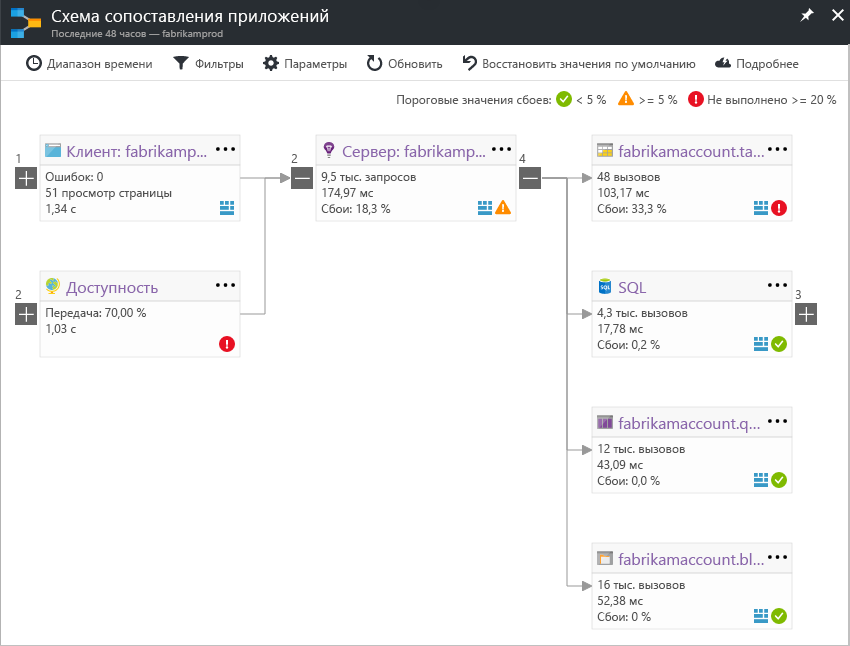

# Схема сопоставления приложений в Application InsightsApplication Map in Application Insights
В [Azure Application Insights](app-insights-overview.md), карта приложения — это визуальное расположение hello отношения зависимости компонентов приложения.In [Azure Application Insights](app-insights-overview.md), Application Map is a visual layout of hello dependency relationships of your application components. Каждый компонент показаны ключевые показатели эффективности например toohelp загрузки, производительности, ошибок и предупреждений, обнаружение любой компонент вызывает проблемы с производительностью или сбоя.Each component shows KPIs such as load, performance, failures, and alerts, toohelp you discover any component causing a performance issue or failure. Можно щелкнуть из любого компонента toomore подробные диагностики, таких как события Application Insights.You can click through from any component toomore detailed diagnostics, such as Application Insights events. Если приложение использует службы Azure, можно также щелкнуть по диагностике tooAzure, например рекомендаций помощник по настройке ядра базы данных SQL.If your app uses Azure services, you can also click through tooAzure diagnostics, such as SQL Database Advisor recommendations.

Как и другие диаграммы можно закрепить toohello карты приложения Azure панели мониторинга, где будут обладать полной функциональностью.Like other charts, you can pin an application map toohello Azure dashboard, where it is fully functional. 

## Привет открыть приложение картыOpen hello application map
Откройте hello карты из колонки Обзор hello для приложения:Open hello map from hello overview blade for your application:

Hello карте показаны.hello map shows:

* Тесты доступностиAvailability tests
* Клиентский компонент (просматривается с hello JavaScript SDK)Client-side component (monitored with hello JavaScript SDK)
* компонент на стороне сервера;Server-side component
* Зависимости hello клиентские и серверные компонентыDependencies of hello client and server components

Можно разворачивать и сворачивать группы ссылок зависимостей:You can expand and collapse dependency link groups:

Если есть большое количество однотипных зависимостей (например, SQL, HTTP и пр.), они могут группироваться.If you have many dependencies of one type (SQL, HTTP etc.), they may appear grouped. 

## Выявление проблемSpot problems
Каждый узел имеет соответствующие производительности показатели, такие как hello скорости загрузки, производительности и сбоя для этого компонента.Each node has relevant performance indicators, such as hello load, performance, and failure rates for that component. 

Предупреждающие значки указывают на возможные проблемы.Warning icons highlight possible problems. Оранжевое предупреждение означает сбои в запросах, представлении страниц или вызовах зависимостей.An orange warning means there are failures in requests, page views or dependency calls. Красное предупреждение указывает на риск сбоя с вероятностью более 5 %.Red means a failure rate above 5%. Если вы хотите tooadjust эти пороговые значения, откройте параметры.If you want tooadjust these thresholds, open Options.

Тут же отображаются активные оповещения:Active alerts also show up: 

При использовании SQL Azure вы увидите соответствующий значок, информирующий о наличии рекомендаций по улучшению производительности.If you use SQL Azure, there's an icon that shows when there are recommendations on how you can improve performance. 

Щелкните любой значок tooget Дополнительные сведения:Click any icon tooget more details:

## Просмотр данных диагностикиDiagnostic click through
Каждый из узлов hello на карте hello предлагает целевой Повтор дополнительной информации для диагностики.Each of hello nodes on hello map offers targeted click through for diagnostics. Hello параметры зависят от типа hello hello узла.hello options vary depending on hello type of hello node.

Для компонентов, которые размещены в Azure hello варианты toothem прямых ссылок.For components that are hosted in Azure, hello options include direct links toothem.

## Фильтры и диапазон времениFilters and time range
По умолчанию hello карты перечислены все доступные для выбранного диапазона времени hello данные hello.By default, hello map summarizes all hello data available for hello chosen time range. Но можно использовать имена tooinclude только определенной операции или зависимости.But you can filter it tooinclude only specific operation names or dependencies.

* Имя операции: сюда входят запросы просмотров страниц и запросы сервера.Operation name: This includes both page views and server-side request types. Этот параметр показывает карты hello hello ключевого показателя Эффективности на узле стороне сервера или клиента hello hello выбран только для операций.With this option, hello map shows hello KPI on hello server/client-side node for hello selected operations only. Он показывает зависимости hello, вызывается в контексте hello этих конкретных операций.It shows hello dependencies called in hello context of those specific operations.
* Базовое имя зависимостей: hello AJAX браузера зависимости и зависимости на стороне сервера.Dependency base name: This includes hello AJAX browser dependencies and server-side dependencies. Если вы сообщаете телеметрии пользовательскую зависимость с hello TrackDependency API, они также отображаются здесь.If you report custom dependency telemetry with hello TrackDependency API, they also appear here. Вы можете выбрать tooshow hello зависимости на карте hello.You can select hello dependencies tooshow on hello map. В настоящее время этот выбор фильтрует hello серверных запросов или представлений hello страницы на стороне клиента.Currently this selection does not filter hello server-side requests, or hello client-side page views.

## Сохранение фильтровSave filters
Примененные фильтры hello toosave ПИН-кода hello отфильтрованное представление на [мониторинга](app-insights-dashboards.md).toosave hello filters you have applied, pin hello filtered view onto a [dashboard](app-insights-dashboards.md).

## Область ошибокError pane
Если щелкнуть узел в карте hello, ошибка панель отображается правой стороны hello суммирования сбоев для этого узла.When you click a node in hello map, an error pane is displayed on hello right-hand side summarizing failures for that node. Сбои группируются сначала по идентификатору операции, затем — по идентификатору проблемы.Failures are grouped first by operation ID and then grouped by problem ID.

Щелкнув сбоя принимает экземпляра последним toohello об этой ошибке.Clicking on a failure takes you toohello most recent instance of that failure.

## Работоспособность ресурсаResource health
Для некоторых типов ресурсов исправности ресурсов отображается в верхней hello hello Ошибка области.For some resource types, resource health is displayed at hello top of hello error pane. Например при щелчке узла SQL покажет hello работоспособности базы данных и все оповещения, которые сработавшими триггерами.For example, clicking a SQL node will show hello database health and any alerts that have fired.

Можно щелкнуть hello метрики ресурсов имя tooview стандартные общие сведения для этого ресурса.You can click hello resource name tooview standard overview metrics for that resource.

## Комплексная схема сопоставления приложений системыEnd-to-end system app maps

*Требуется пакет SDK версии 2.3 или выше.**Requires SDK version 2.3 or higher*

Если приложение имеет несколько компонентов - например, внутренняя служба Кроме toohello веб-приложения — то можно показать их все на один интегрированного приложения карты.If your application has several components - for example, a back-end service in addition toohello web app - then you can show them all on one integrated app map.

карта приложения Hello выполняется поиск узлов сервера, выполнив любой HTTP-обращениях зависимостей между серверами с hello установлен пакет SDK для Application Insights.hello app map finds server nodes by following any HTTP dependency calls made between servers with hello Application Insights SDK installed. Каждый ресурс Application Insights предполагается, что toocontain одного сервера.Each Application Insights resource is assumed toocontain one server.

### Карта приложений с несколькими ролями (предварительная версия)Multi-role app map (preview)

Hello Предварительный просмотр приложения с несколькими ролями карты позволяет вам карты приложения hello toouse с несколькими серверами, отправка данных toohello того же ресурса Application Insights и ключ инструментирования.hello preview multi-role app map feature allows you toouse hello app map with multiple servers sending data toohello same Application Insights resource  / instrumentation key. Серверы в карте hello разделены свойством cloud_RoleName hello элементов телеметрии.Servers in hello map are segmented by hello cloud_RoleName property on telemetry items. Задать *карты несколькими ролями приложения* слишком*на* из hello tooenable колонке предварительные версии этой конфигурации.Set *Multi-role Application Map* too*On* from hello Previews blade tooenable this configuration.

Этот подход может оказаться целесообразным в приложении службы micro или в других сценариях, где искомые события toocorrelate на нескольких серверах в пределах одного ресурса Application Insights.This approach may be desired in a micro-services application, or in other scenarios where you want toocorrelate events across multiple servers within a single Application Insights resource.

## ВидеоVideo

> [!VIDEO https://channel9.msdn.com/events/Connect/2016/112/player] 

## ОтзывFeedback
Оставьте отзыв через параметр портала отзыва hello.Please provide feedback through hello portal feedback option.

## Дальнейшие действияNext steps

* [Портал AzureAzure portal](https://portal.azure.com)
