# Общие сведения о Application Insights для DevOps

С помощью [Application Insights](app-insights-overview.md) можно быстро получить сведения о производительности и использовании динамического приложения. Если не удается, он позволяет изучить, помогают оценить влияние hello и помогает определить причину hello.

Прочитайте отзыв рабочей группы, разрабатывающей веб-приложения:

* *"Несколько дней назад мы развернули минимальное исправление. Мы не был запущен широкий тестового прохода, но к сожалению, некоторые непредвиденное изменение получен объединены в полезных данных hello, вызывает несовместимость hello передней и задней заканчивается. Немедленно инициировать нашей предупреждение surged исключения сервера, и мы были уведомлены об hello ситуации. За несколько щелчков мышью в портале Application Insights hello полученный достаточно информации из toonarrow стеки вызовов исключения hello проблемы. Мы немедленно выполнен откат и ограниченные повреждения hello. Application Insights внес в этой части hello devops цикла очень простой и практических.»*

В этой статье мы выполните команды в банке компании Fabrikam, которая разрабатывает hello online банковских toosee системы (ДСО), как они используют tooquickly Application Insights ответ toocustomers и вносить обновления.  

Выполняет цикл DevOps hello следующие иллюстрации показано команда Hello:

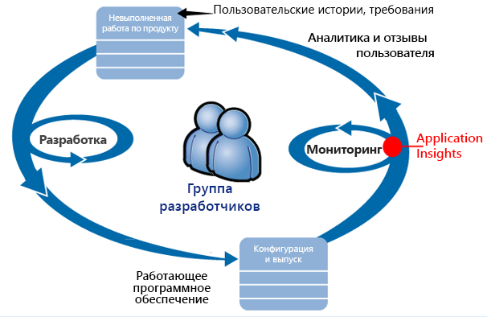

Требования поступают в план разработки (список задач). Иными словами, они работают спринтов, предоставляющие часто работающего программного обеспечения — обычно в виде hello улучшениях и расширениях toohello существующего приложения. Динамическая приложение Hello часто получает обновления с новыми функциями. При динамической hello team следит за его производительности и использования с помощью Application Insights hello. Данные APM поступают в невыполненную работу по разработке.

Команда Hello использует Application Insights toomonitor hello динамической веб-приложения точно для:

* Производительность. Они хотят toounderstand как времени ответа зависит от количество запросов; сколько ЦП, сети, диск и другие ресурсы, которые используются; по месту нахождения hello узких мест.
* Сбои. При наличии исключений неудачных запросов или если счетчик производительности выходит за пределы научились значений, hello tooknow потребностями команды быстро так, чтобы они могли выполнить действия.
* Использование. Каждый раз, когда новая функция освобождается, hello команды требуется tooknow toowhat экстент, она используется и наличия у пользователей возникли проблемы с ним.

Рассмотрим hello отзыв часть цикла hello:

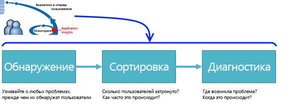

## Обнаружение низкой доступности
Marcela Markova — старший разработчик в команде ДСО hello и принимает интереса hello о наблюдении за производительностью в сети. Она настраивает несколько [тестов доступности](app-insights-monitor-web-app-availability.md).

* Тест одному URL-АДРЕСУ для hello Главная целевая страница для приложения hello http://fabrikambank.com/onlinebanking/. Она задает в качестве условия получение кода состояния HTTP 200 и текста "Добро пожаловать!". Если этот тест не пройден, что-то серьезный сбой сети hello или серверы hello или может быть ошибка развертывания. (Или изменены hello Добро пожаловать! сообщение на странице приветствия без уведомления ее известных).
* Глубокий многоэтапный тест, во время которого выполняется вход в систему и создается список текущих учетных записей, а также проверяется несколько ключевых пунктов на каждой странице. В этом тесте проверяется, что работа базы данных учетных записей связей toohello, hello. Анастасия использует идентификатор вымышленного пользователя: несколько таких пользователей создано специально для тестирования.

С помощью этих тестов, Настройка Marcela уверены, что команда hello быстро сведения любого сбоя.  

Ошибки отображаются как красные точки на диаграмму тестирования hello web:

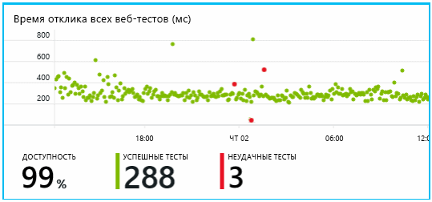

Но что более важно, оповещения о любой ошибке по электронной почте toohello разработчиков. Таким образом они узнать об этом перед практически все hello клиентов.

## Мониторинг производительности
На странице обзора hello в Application Insights, имеется диаграмма, показывающая разнообразные [ключевые метрики](app-insights-web-monitor-performance.md).

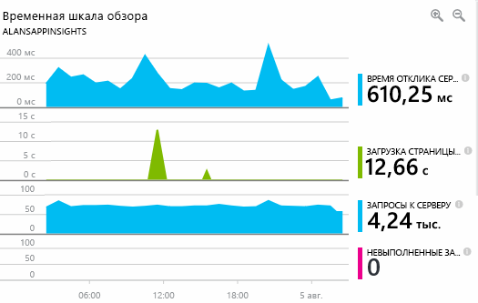

Время загрузки страницы в браузере определяется на основе телеметрических данных, отправляемых непосредственно с веб-страниц. Время ответа сервера, число запросов к серверу и число неудачных запросов все измеряется hello веб-сервера и отправленных tooApplication аналитики оттуда.

Немного Marcela отвечает hello граф ответа сервера. На этой диаграмме показано hello среднее время между при hello сервер получает запрос HTTP из браузера пользователя, и если он возвращает ответ hello. Необычные toosee вариации в этой диаграмме не как зависит от нагрузки на систему hello. Однако в этом случае существует по-видимому, toobe корреляции между небольшой растет hello числа запросов и больших усложнении hello времени ответа. Это может указывать, что система hello работает только в определенные границы.

Она открывает hello серверы диаграмм:

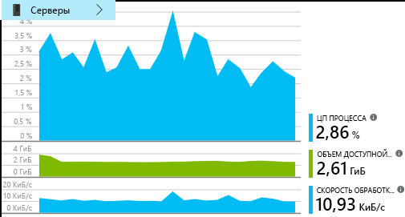

Похоже, что toobe признаков ограниченности ресурсов, поэтому может быть выпуклости hello в диаграммах ответа сервера hello просто совпадение.

## Настройка оповещений о toomeet целей
Тем не менее она хочет tookeep внимание на время отклика hello. Если они оказались слишком велико, менеджеру tooknow о нем немедленно.

Поэтому она задает [оповещение](app-insights-metrics-explorer.md) о времени отклика, превышающем обычное пороговое значение. Это гарантирует, что она узнает, если ответы будут выполняться медленно.

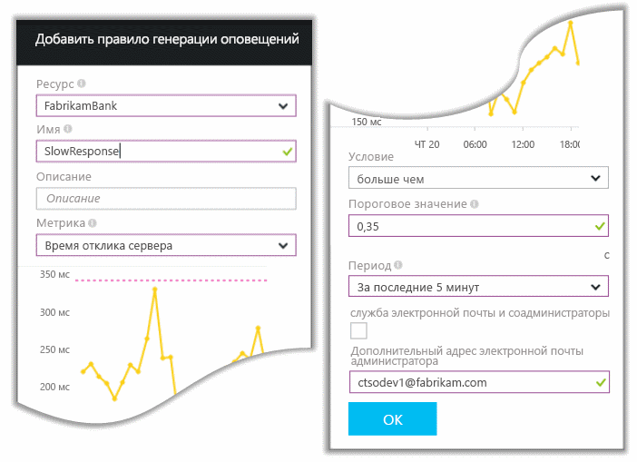

Можно задать оповещения о широком наборе других метрик. Например может получать сообщения электронной почты, если количество исключений hello становится высокого уровня, или доступной памяти hello переходит низким или если пиковое значение в клиентских запросов.

## Будьте в курсе последних новостей с помощью оповещений интеллектуального обнаружения.
На следующий день по электронной почте поступает оповещение из Application Insights. Но когда открывает, она обнаруживает, что не предупреждение времени ответа hello, задайте ей. Вместо этого ей сообщается о неожиданном увеличении числа невыполненных запросов — то есть запросов, которые вернули код ошибки 500 или более.

Невыполненные запросы являются, где пользователи увидели ошибка - обычно после возникновения исключения, вызванных в коде hello. Возможно, пользователи видят сообщение "К сожалению, сейчас обновить данные не удалось". Или, в худшем случае абсолютный неудобно, дамп стека отображается на экране приветствия пользователя правительством hello веб-сервера.

Это предупреждение является удивительно, произошел сбой hello она рассказывали, hello времени последнего запроса, что число encouragingly недостаточно. Небольшое число сбоев — toobe, ожидаемая в загруженном сервере.

Также было немного неожиданные для нее, так как она не было tooconfigure это предупреждение. Application Insights включает интеллектуальное обнаружение. Он автоматически корректирует tooyour приложения обычные сбоя шаблон «будет использоваться для» сбои и на конкретной странице или под высокой нагрузкой или связанного tooother метрики. Он выдает оповещения hello только при наличии уделять выше и что он поступает tooexpect.

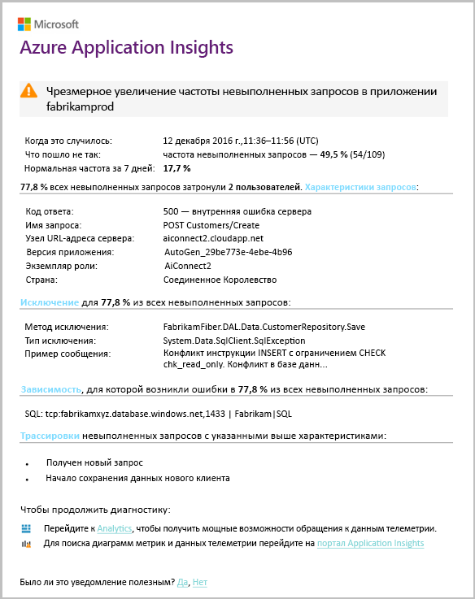

Это очень полезное электронное сообщение. Было не просто создано оповещение. Он выполняет множество операций "Рассмотрение" hello "и" диагностики работа слишком.

В нем указано, сколько клиентов затронуто, а также — какие веб-страницы или операции. Marcela можно решить, должен ли она tooget hello вся команда работает в данном виде практическую проверку или ли он обрабатывается до следующей недели.

Hello электронной почты также показано, что произошло конкретного исключения и - более интересное -, сбой hello связан с определенной базой данных tooa вызовов со сбоем. Это объясняет, почему ошибки hello внезапно появляются несмотря на то, что команды Marcela недавно не развернут все обновления.

Марцелла проверка связи с заполнением hello объекта группы hello базы данных, основанный на это сообщение электронной почты. Она узнает отжатии оперативное исправление в hello за последние полчаса; и к сожалению, может быть было изменения схемы дополнительный...

Поэтому hello связана toobeing способом hello фиксированной даже прежде чем журналы и в течение 15 минут, его связи. Однако Marcela щелкает ссылку hello tooopen Application Insights. Он открывает непосредственно на невыполненных запросов, а здесь можно увидеть вызов в связанный список вызовов зависимостей hello поврежденной базы данных.

## Обнаружение исключений
С помощью программы установки, немного [исключения](app-insights-asp-net-exceptions.md) , о которой tooApplication аналитики автоматически. Их можно также явным образом записать, вставив вызовы слишком[TrackException()](app-insights-api-custom-events-metrics.md#trackexception) в hello код:  

    var telemetry = new TelemetryClient();
    ...
    try
    { ...
    }
    catch (Exception ex)
    {
       // Set up some properties:
       var properties = new Dictionary <string, string>
         {{"Game", currentGame.Name}};

       var measurements = new Dictionary <string, double>
         {{"Users", currentGame.Users.Count}};

       // Send hello exception telemetry:
       telemetry.TrackException(ex, properties, measurements);
    }

Команда Fabrikam банка Hello развивался hello рекомендуется всегда отправлять данные телеметрии об исключении, при отсутствии очевидным восстановления.  

На самом деле их стратегия заключается в еще большем, чем: они отправляют телеметрии во всех случаях, где клиент hello разочарованы в том, что нужно toodo, было ли соответствующий tooan исключения в коде hello, или нет. Например если hello внешних передачи между bank система возвращает сообщение «не удается завершить транзакцию» по некоторым причинам, оперативной (не возвращать ошибок клиента hello) они отслеживают события.

    var successCode = AttemptTransfer(transferAmount, ...);
    if (successCode < 0)
    {
       var properties = new Dictionary <string, string>
            {{ "Code", returnCode, ... }};
       var measurements = new Dictionary <string, double>
         {{"Value", transferAmount}};
       telemetry.TrackEvent("transfer failed", properties, measurements);
    }

TrackException является используется tooreport исключения, поскольку он отправляет копию hello стека. TrackEvent является используется tooreport другие события. Можно прикреплять любые свойства, которые могут пригодиться при диагностике.

Исключения и события отображаются в hello [диагностики поиска](app-insights-diagnostic-search.md) колонку. Можно выполнить детализацию до их дополнительные свойства toosee hello и трассировка стека.

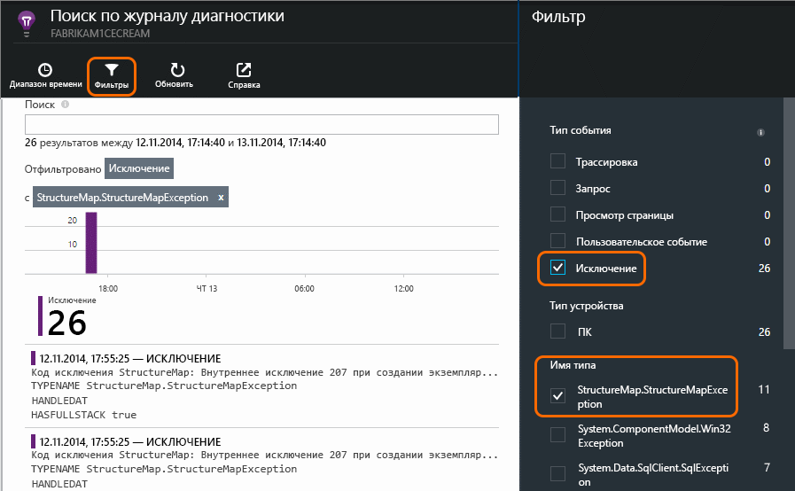

## Упреждающий мониторинг
Анастасия не просто сидит на месте в ожидании тревожных оповещений. Вскоре после каждого повторного развертывания она смотрит на [отклика](app-insights-web-monitor-performance.md) — оба hello общую рисунок и подсчитывает таблицы hello Медленные запросы, а также исключения.  

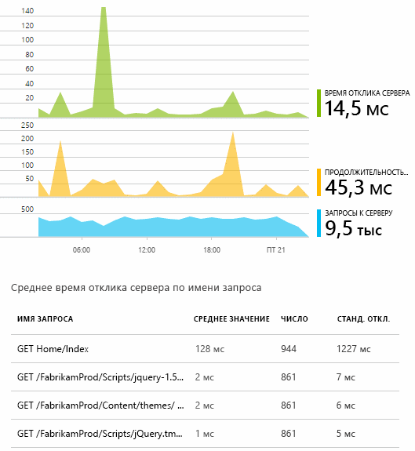

Она можно оценить влияние на производительность hello каждого развертывания обычно последнего сравнение с hello каждую неделю. Если резким worsening, она вызывает, соответствующие разработчикам hello.

## Рассмотрение проблем
Рассмотрение - оценки серьезность hello и степень проблема - является первым шагом hello после обнаружения. Следует мы называем ожидания команды hello в полночь? Или можно его оставить до следующего удобный пропуск hello в hello невыполненной работы? Процесс рассмотрения предполагает ответы на некоторые ключевые вопросы.

Как часто происходит его? Hello диаграмм, в колонке Обзор hello присвойте проблему tooa перспективы. Например Fabrikam приложения hello созданных четыре предупреждений теста web одну ночь. Просматривая диаграммы hello в утром hello, hello команды может определить, что на самом деле некоторые красные точки на то, что по-прежнему большинство hello тесты были зеленый. Детализируя диаграммы доступности hello, было ясно, что все эти временные проблемы были получены из расположения одного теста. Очевидно, возникшая в сети проблема затронула только один маршрут, после чего самоустранилась.  

В отличие от этого уделять значительное и стабильный графике hello число исключений или время отклика очевидно, что-то toopanic о.

Полезная тактика — выполнять рассмотрение самостоятельно. Если возникли hello же проблему, вы знаете, real.

Доля пользователей будут затронуты? tooobtain грубого ответов, разделите число сеансов hello Частота сбоев hello.

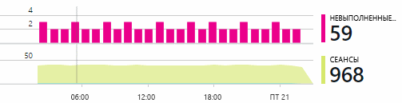

При наличии замедление отклика, сравните таблицы hello отвечает медленных запросов с hello частоты использования каждой страницы.

Насколько важна сценарий hello заблокировано? Это функциональная проблема блокирует только одну конкретную пользовательскую историю? Насколько она серьезна? Если клиенты не могут оплачивать свои счета, это серьезно; если не получается изменить настройки цвета экрана — возможно, это может подождать. Здравствуйте подробные события hello или исключения или удостоверения hello медленно страницы приветствия, рассказывается о том, где клиенты возникают проблемы.

## Диагностика проблем
Диагностика совсем не hello такой же, как отладка. Прежде чем начать трассировку через кода hello, должны иметь грубого общее представление о том, почему, где и когда возникают проблемы hello.

**Если он произошло?**  hello историческое представление диаграммы hello события и метрики, предоставляемые делает его легко toocorrelate эффекты возможные причины ее возникновения. При наличии периодических пики в скорости ответа времени или исключение, рассмотрим количество запросов hello: если она достигает максимума hello же времени, то он будет выглядеть на проблему ресурсов. Требуется tooassign дополнительные ЦП или памяти? Или зависимость, которую нельзя управлять hello нагрузки?

**Или причина в нас?**  Если у вас неожиданного падения производительности конкретного типа запроса, — например при hello клиент хочет выписки - есть вероятность может быть внешней подсистемы, а не веб-приложения. В обозревателе метрик выберите Интенсивность отказов зависимостей hello и длительность зависимости ставки и сравнение журналами за hello за несколько часов или дней с hello проблемы, которую вы обнаружил. Если согласование изменений, подсистему внешних может быть tooblame.  

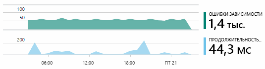

Иногда проблемы с медленными зависимостями возникают вследствие недоработок, связанных с географическим расположением. В Банке Fabrikam используются виртуальные машины Azure, и однажды обнаружилось, что банк непреднамеренно разместил свой веб-сервер и сервер учетных записей в разных странах. Перенос одного из них позволил добиться резкого улучшения в работе.

**Что мы сделали?** Если проблема hello не toobe в зависимости, и не всегда существует, возможно, причиной является последние изменения. Hello исторических Перспектива диаграммы hello метрики и события, предоставляемые делает его легко toocorrelate любой внезапные изменения с развертываниями. Применяет hello поиск hello проблему.

**В чем причина?** Лишь изредка могут возникнуть некоторые проблемы и может быть трудно tootrack вниз путем проверки в автономном режиме. Мы можем сделать всего tootry toocapture hello ошибки при его возникновении в режиме реального времени. Можно проверить и дампов стека hello в отчеты об исключениях. Кроме того, можно написать трассировочные вызовы с использованием привычной платформы ведения журналов либо задействовать TrackTrace() или TrackEvent().  

В Банке Fabrikam периодически возникала проблема с переводами между учетными записями, при этом были затронуты только записи определенного типа. лучше toounderstand что случается, они вставлены вызовы TrackTrace() в ключевых точках кода hello, присоединение hello тип учетной записи, как вызов tooeach свойство. Представляет собой простой toofilter ожидания только эти трассировки диагностики поиска. Также они присоединены значения параметров, как вызовы трассировки toohello свойства и меры.

## Ответ toodiscovered проблемы
После клиент собирается hello проблемы вы можете сделать toofix плана ее. Может быть необходимо tooroll обратно последние изменения, или может быть просто пойти дальше и устранить ее. После завершения исправления hello Application Insights показывает, успешно ли.  

Разработчики Fabrikam банка занять более структурированный tooperformance измерения подход, чем их использовать toobefore их использовать Application Insights.

* Целевые показатели по производительности с точки зрения определенных мер они заданы в Application Insights hello «Обзор».
* Они закладывать приложения hello от начала hello, например hello метрики, полученные через «Воронкообразные диаграммы.» Ход реализации пользовательских показателей производительности  

## Мониторинг действий пользователей
Когда время ответа хорошо, и существует несколько исключений, команда разработчиков hello можно переместить на toousability. Их можно рассматривать как tooimprove hello работы пользователей, и как tooencourage дополнительные пользователи tooachieve hello необходимой цели.

Application Insights также можно использовать toolearn, каких пользователей следует с помощью приложения. После его шло гладко, новые пользователи, например или трудности с и как часто они вернуться hello team хотел tooknow функций, наиболее популярных hello. Это позволяет правильно расставить приоритеты для предстоящей работы. И они могут планировать успех hello toomeasure каждого компонента как часть цикла разработки hello. 

Например путешествия типичные действия пользователя через hello веб-сайт имеет снимите флажок «Воронка». Многие клиенты найдите темпами hello кредитов различных типов. Меньшее число переходите toofill в форме предложения hello. Те из них, которые получают предложение несколько пойти дальше и извлеките кредитов hello.

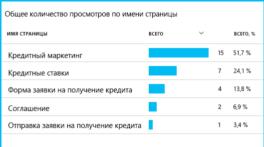

Следует учитывать, где выпадают hello наибольшее количество клиентов, hello бизнеса можно составить как tooget больше пользователей через toohello внизу hello Воронка. В некоторых случаях может возникнуть сбой разработке пользовательского интерфейса пользователя — например, жесткого toofind — кнопку «Далее» hello или инструкции hello не очевидны. Более вероятно, большую бизнесе существует причин для перетаскивания элементов: может быть слишком много кредитов ставки hello.

Независимо от причин hello, данные hello помогают team hello за действиями пользователей. Дополнительные отслеживания вызовы могут быть вставлены toowork более подробные сведения. TrackEvent() может быть используется toocount действия пользователя с мелкими деталями hello из отдельных кнопок щелкает toosignificant достижений, например, оплата off кредиту.

Команда Hello является получение используется toohaving сведения об активности пользователей. Теперь при разработке любой новой функции предусматривается процесс получения отзывов о ее использовании. Они разработать отслеживания к вызову функции hello от начала hello. Они используют средство hello tooimprove hello обратной связи в каждом цикле разработки.

[Анализ использования для веб-приложений с помощью Application Insights](app-insights-usage-overview.md).

## Применение цикла DevOps hello
Вот как одна team используйте Application Insights toofix не только отдельные проблемы, но tooimprove жизненный цикл разработки. Надеюсь, вы получили некоторые соображения относительно того, как Application Insights может помочь управлять производительностью в собственных приложениях.

## Видео

> [!VIDEO https://channel9.msdn.com/events/Connect/2016/112/player]

## Дальнейшие действия
Вы можете начать несколькими способами, в зависимости от характеристик приложения hello. Выберите, что вам лучше всего подходит:

* [веб-приложение ASP.NET](app-insights-asp-net.md);
* [веб-приложение Java](app-insights-java-get-started.md);
* [веб-приложение Node.js](app-insights-nodejs.md);
* уже развернутые приложения, размещенные в среде [IIS](app-insights-monitor-web-app-availability.md), [J2EE](app-insights-java-live.md) или [Azure](app-insights-azure.md);
* [Веб-страницы](app-insights-javascript.md) -одной страницы приложения или обычные веб-страница — использовать сам по себе или в tooany сложения hello параметров сервера.
* [Проверяет доступность](app-insights-monitor-web-app-availability.md) tootest приложения hello общедоступный Интернет.
