# Что такое Azure Application Insights?What is Application Insights?
Application Insights — это расширяемая служба управления производительностью приложений (APM) для веб-разработчиков на нескольких платформах.Application Insights is an extensible Application Performance Management (APM) service for web developers on multiple platforms. Используйте его toomonitor динамической веб-приложения.Use it toomonitor your live web application. Она автоматически обнаруживает аномалии производительности.It will automatically detect performance anomalies. Он включает toohelp средств гибкой аналитической диагностировать проблемы и toounderstand, какие пользователи фактически выполняют вместе с приложением.It includes powerful analytics tools toohelp you diagnose issues and toounderstand what users actually do with your app.  Он разработан toohelp постоянно повысить производительность и удобство использования.It's designed toohelp you continuously improve  performance and usability. Он работает для приложений на различных платформах, включая .NET, Node.js и J2EE, размещенные локально или в облаке hello.It works for apps on a wide variety of platforms including .NET, Node.js and J2EE, hosted on-premises or in hello cloud. Интегрируется с процесс devOps и разными tooa точек подключения средств разработки.It  integrates with your devOps process, and has connection points tooa variety of development tools.

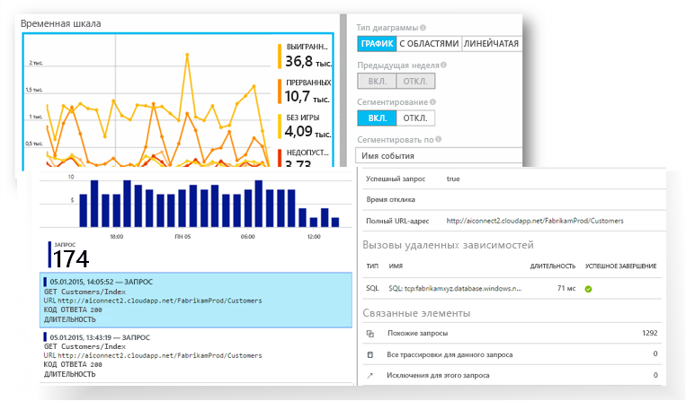

[Рассмотрим начальный анимации hello](https://www.youtube.com/watch?v=fX2NtGrh-Y0).[Take a look at hello intro animation](https://www.youtube.com/watch?v=fX2NtGrh-Y0).

## Как работает Application Insights?How does Application Insights work?
Установка пакета небольшое инструментирование в приложении и настроить ресурс Application Insights на портале Microsoft Azure hello.You install a small instrumentation package in your application, and set up an Application Insights resource in hello Microsoft Azure portal. Инструментирование Hello отслеживает приложение и отправляет портал toohello данных телеметрии.hello instrumentation monitors your app and sends telemetry data toohello portal. (hello приложение может работать в любом месте — это не обязательно toobe, размещенных в Azure).(hello application can run anywhere - it doesn't have toobe hosted in Azure.)

Инструментирование не только приложение hello веб-службы, но и все компоненты фона и hello JavaScript в веб-страницы приветствия сами.You can instrument not only hello web service application, but also any background components, and hello JavaScript in hello web pages themselves. 

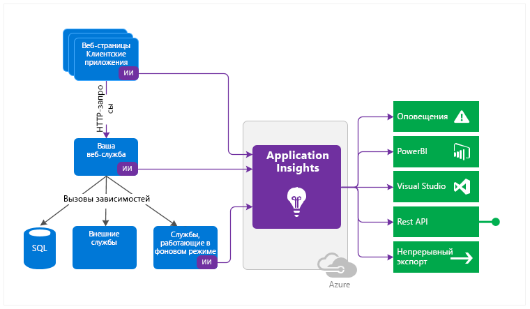

Кроме того можно извлечь данные телеметрии из среды узла hello, такие как счетчики производительности диагностики Azure и журналы Docker.In addition, you can pull in telemetry from hello host environments such as performance counters, Azure diagnostics, or Docker logs. Можно также настроить веб-тесты, которые периодически отправлять запросы на искусственных tooyour веб-службы.You can also set up web tests that periodically send synthetic requests tooyour web service.

Все эти потоки телеметрии интегрированы в hello портал Azure, где можно применить мощных аналитический и поиска средств toohello необработанных данных.All these telemetry streams are integrated in hello Azure portal, where you can apply powerful analytic and search tools toohello raw data.

### Что такое издержки helloWhat's hello overhead?
Hello влияние на производительность приложения, очень мал.hello impact on your app's performance is very small. Вызовы отслеживания не приводят к блокировке, выполняются в пакетном режиме и отправляется в отдельном потоке.Tracking calls are non-blocking, and are batched and sent in a separate thread.

## Как работает монитор Application Insights?What does Application Insights monitor?

Application Insights предназначен для команды разработчиков hello, toohelp понять, как работает приложение, и как он используется.Application Insights is aimed at hello development team, toohelp you understand how your app is performing and how it's being used. Она отслеживает следующее:It monitors:

* **Частота запросов, время отклика и частота сбоев.** Узнайте, какие страницы наиболее популярны, в какое время дня их посещают чаще всего, а также узнайте о расположении пользователей.**Request rates, response times, and failure rates** - Find out which pages are most popular, at what times of day, and where your users are. Узнайте, какие страницы работают лучше всего.See which pages perform best. Если при увеличении количества запросов повышается время отклика и частота сбоев, возможно, возникла проблема с ресурсами.If your response times and failure rates go high when there are more requests, then perhaps you have a resourcing problem. 
* **Частота зависимостей, время отклика и частота сбоев.** Узнайте, замедляют ли внешние службы вашу работу.**Dependency rates, response times, and failure rates** - Find out whether external services are slowing you down.
* **Исключения** — анализ статистики суммарный hello, или выбрать конкретные экземпляры и можно перейти к трассировке стека hello и связанные запросы.**Exceptions** - Analyse hello aggregated statistics, or pick specific instances and drill into hello stack trace and related requests. Исключения сервера и браузера регистрируются.Both server and browser exceptions are reported.
* **Просмотры страниц и производительность загрузки.** Эти сведения сообщаются через браузеры пользователей.**Page views and load performance** - reported by your users' browsers.
* **Вызовы AJAX** с веб-страницы. Скорость, время отклика и частота сбоев.**AJAX calls** from web pages - rates, response times, and failure rates.
* **Количество пользователей и сеансов.****User and session counts**.
* **Счетчики производительности** с компьютеров с сервером Windows или Linux, такие как ЦП, память и использование сети.**Performance counters** from your Windows or Linux server machines, such as CPU, memory, and network usage. 
* **Размещение диагностики** из Docker или Azure.**Host diagnostics** from Docker or Azure. 
* **Журналы диагностики трассировки** из вашего приложения. Предназначены для сопоставления событий трассировки с запросами.**Diagnostic trace logs** from your app - so that you can correlate trace events with requests.
* **Пользовательские события и метрики** создавать самостоятельно в hello клиента или сервера кода, tootrack бизнес-события, такие как элементы продаж или игр реализовано.**Custom events and metrics** that you write yourself in hello client or server code, tootrack business events such as items sold or games won.

## Где отображаются мои данные телеметрии?Where do I see my telemetry?

Существует множество способов tooexplore данных.There are plenty of ways tooexplore your data. Ознакомьтесь со следующими статьями:Check out these articles:

|  |  |
| --- | --- |
| [**Интеллектуальное обнаружение в Application Insights****Smart detection and manual alerts**](app-insights-proactive-diagnostics.md) Автоматические оповещения адаптировать tooyour приложения обычных шаблонов, телеметрии и триггер когда что-нибудь за пределами hello стандартный подход.Automatic alerts adapt tooyour app's normal patterns of telemetry and trigger when there's something outside hello usual pattern. Также можно [настроить оповещения](app-insights-alerts.md) для определенных уровней пользовательских или стандартных метрик.You can also [set alerts](app-insights-alerts.md) on particular levels of custom or standard metrics. |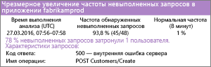 |
| [**Схема сопоставления приложений в Application Insights****Application map**](app-insights-app-map.md) компоненты приложения, оповещения и ключевые показатели Hello.hello components of your app, with key metrics and alerts. |  |
| [**Профилирование динамических веб-приложений Azure с помощью Application Insights (предварительная версия)****Profiler**](app-insights-profiler.md) Проверьте hello профили выполнения выборки запросов.Inspect hello execution profiles of sampled requests. |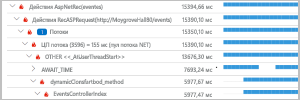 |
| [**Usage analysis for web applications with Application Insights**](app-insights-usage-overview.md) (Аналитики использования для веб-приложений с Application Insights)[**Usage analysis**](app-insights-usage-overview.md) Анализируйте сегментацию пользователей и хранение.Analyze user segmentation and retention.| |
| [**Работа с Application Insights в Visual Studio****Diagnostic search for instance data**](app-insights-diagnostic-search.md) Поиск и фильтрация событий, таких как запросы, исключения, вызовы зависимостей, журналы трассировки и просмотры страниц.Search and filter events such as requests, exceptions, dependency calls, log traces, and page views.  |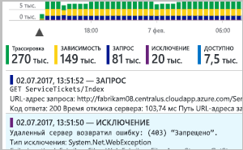 |
| [**Исследование метрик в Application Insights****Metrics Explorer for aggregated data**](app-insights-metrics-explorer.md) Просмотр, фильтрация и сегментирование объединенных данных, таких как частоты запросов, ошибок и исключений, время отклика и время загрузки страницы.Explore, filter, and segment aggregated data such as rates of requests, failures, and exceptions; response times, page load times. | |
| [**Панели мониторинга****Dashboards**](app-insights-dashboards.md#dashboards) Объединение разнородных данных из нескольких ресурсов и их совместное использование с другими пользователями.Mash up data from multiple resources and share with others. Идеальное решение для многокомпонентные приложений, а также для непрерывного отображения в комнату команды hello.Great for multi-component applications, and for continuous display in hello team room. | |
| [**Динамический поток метрик: мгновенные метрики для подробного отслеживания****Live Metrics Stream**](app-insights-live-stream.md) При развертывании новой сборки, просмотрите эти toomake индикаторы производительности рядом реального времени, убедиться, что все работает правильно.When you deploy a new build, watch these near-real-time performance indicators toomake sure everything works as expected. |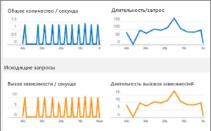 |
| [**Аналитика в Application Insights****Analytics**](app-insights-analytics.md) Получите ответы на сложные вопросы о производительности и использовании приложения с помощью этого мощного языка запросов.Answer tough questions about your app's performance and usage by using this powerful query language. |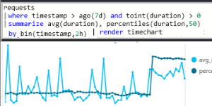 |
| [**Работа с Application Insights в Visual Studio****Visual Studio**](app-insights-visual-studio.md) Просмотреть данные производительности в коде hello.See performance data in hello code. Toocode перейти из трассировки стека.Go toocode from stack traces.|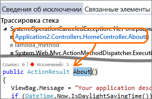 |
| [**Debug Snapshots on Exceptions in .NET Apps**](app-insights-snapshot-debugger.md) (Отладка моментальных снимков при исключениях в приложениях .NET)[**Snapshot debugger**](app-insights-snapshot-debugger.md) Отладка моментальных снимков, выбранных из активных операций со значениями параметров.Debug snapshots sampled from live operations, with parameter values.|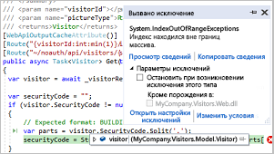 |
| [**Использование данных Application Insights в Power BI****Power BI**](app-insights-export-power-bi.md) Интегрируйте метрики использования с другими метриками бизнес-аналитики.Integrate usage metrics with other business intelligence.| 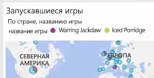|
| [**Use the Application Insights REST API to build custom solutions**](https://dev.applicationinsights.io/) (Использование интерфейса REST API Application Insights для создания пользовательских решений)[**REST API**](https://dev.applicationinsights.io/) Напишите код, toorun запросы через метрики и необработанных данных.Write code toorun queries over your metrics and raw data.|  |
| [**Экспорт данных телеметрии из Application Insights****Continuous export**](app-insights-export-telemetry.md) Массовый экспорт toostorage необработанные данные по мере их поступления.Bulk export of raw data toostorage as soon as it arrives. |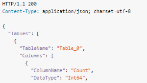 |

## Как использовать Application Insights?How do I use Application Insights?

### МониторMonitor
Установите Application Insights в веб-приложении, настройте [доступность веб-тестов](app-insights-monitor-web-app-availability.md) и:Install Application Insights in your app, set up [availability web tests](app-insights-monitor-web-app-availability.md), and:

* Настройка [мониторинга](app-insights-dashboards.md) для вашей команды tookeep комнаты в глаза нагрузочных тестов, время отклика, и производительности hello зависимостей страницы загрузки и вызовов AJAX.Set up a [dashboard](app-insights-dashboards.md) for your team room tookeep an eye on load, responsiveness, and hello performance of your dependencies, page loads, and AJAX calls.
* Обнаружение, являющиеся медленных hello и большинство сбоев запросов.Discover which are hello slowest and most failing requests.
* Контрольное значение [обновляющегося потока](app-insights-live-stream.md) при развертывании нового выпуска tooknow немедленно о потери.Watch [Live Stream](app-insights-live-stream.md) when you deploy a new release, tooknow immediately about any degradation.

### Обнаружение и диагностикаDetect, Diagnose
При получении предупреждения или обнаружении проблемы:When you receive an alert or discover a problem:

* Оцените, сколько пользователей столкнулось с проблемами.Assess how many users are affected.
* сопоставляйте сбои с исключениями, вызовами зависимостей и трассировками;Correlate failures with exceptions, dependency calls and traces.
* изучите профилировщик, моментальные снимки, дамп стека и журналы трассировки.Examine profiler, snapshots, stack dumps, and trace logs.

### Создание, измерение и обучениеBuild, Measure, Learn
[Измерение эффективности hello](app-insights-usage-overview.md) каждой новой функции развертывания.[Measure hello effectiveness](app-insights-usage-overview.md) of each new feature that you deploy.

* Планирование toomeasure каким образом пользователи используют новый UX или бизнес-функций.Plan toomeasure how customers use new UX or business features.
* записывайте пользовательскую телеметрию в свой код;Write custom telemetry into your code.
* Далее разработку базовый hello циклическое переключение жестких свидетельство из телеметрии.Base hello next development cycle on hard evidence from your telemetry.

## Начало работыGet started
Application Insights является одним из многих служб, размещенных в Microsoft Azure и телеметрии существует отправляется для анализа и представления hello.Application Insights is one of hello many services hosted within Microsoft Azure, and telemetry is sent there for analysis and presentation. Поэтому перед выполнением других действий, вам понадобится подписка слишком[Microsoft Azure](http://azure.com).So before you do anything else, you'll need a subscription too[Microsoft Azure](http://azure.com). Он работает свободного toosign и при выборе hello основные [ценовой план](https://azure.microsoft.com/pricing/details/application-insights/) аналитики приложений является бесплатной пока приложение стал toohave значительных использования.It's free toosign up, and if you choose hello basic [pricing plan](https://azure.microsoft.com/pricing/details/application-insights/) of Application Insights, there's no charge until your application has grown toohave substantial usage. Если у вашей организации уже есть подписка, они добавить ваш tooit учетной записи Майкрософт.If your organization already has a subscription, they could add your Microsoft account tooit.

Существует несколько способов запуска tooget.There are several ways tooget started. Начните с того, который вам лучше подходит.Begin with whichever works best for you. Можно добавить позднее hello другим пользователям.You can add hello others later.

* **Во время выполнения: инструментирование веб-приложения на сервере hello.****At run time: instrument your web app on hello server.** Позволяет избежать toohello кода обновления.Avoids any update toohello code. Необходимо, чтобы сервер tooyour доступа администратора.You need admin access tooyour server.
  * [**Локальные или размещенные на виртуальной машине службы IIS**](app-insights-monitor-performance-live-website-now.md);[**IIS on-premises or on a VM**](app-insights-monitor-performance-live-website-now.md)
  * [**веб-приложения или виртуальные машины Azure**](app-insights-monitor-performance-live-website-now.md);[**Azure web app or VM**](app-insights-monitor-performance-live-website-now.md)
  * [**J2EE**](app-insights-java-live.md).[**J2EE**](app-insights-java-live.md)
* **Во время разработки: добавьте код tooyour Application Insights.****At development time: add Application Insights tooyour code.** Позволяет toowrite пользовательские телеметрии и tooinstrument серверной части и настольных приложений.Allows you toowrite custom telemetry and tooinstrument back-end and desktop apps.
  * [Visual Studio](app-insights-asp-net.md) 2013 с обновлением 2 или более поздняя версия.[Visual Studio](app-insights-asp-net.md) 2013 update 2 or later.
  * Java в [Eclipse](app-insights-java-eclipse.md) или [другие средства](app-insights-java-get-started.md);Java in [Eclipse](app-insights-java-eclipse.md) or [other tools](app-insights-java-get-started.md)
  * [Node.jsNode.js](app-insights-nodejs.md)
  * [другие платформы.Other platforms](app-insights-platforms.md)
* **[Инструментирование веб-страниц](app-insights-javascript.md)** для получения сведений о просмотрах страниц, вызовах AJAX и других данных телеметрии на стороне клиента.**[Instrument your web pages](app-insights-javascript.md)** for page view, AJAX and other client-side telemetry.
* **[Тесты доступности](app-insights-monitor-web-app-availability.md)** с наших серверов для регулярной проверки связи с вашим веб-сайтом.**[Availability tests](app-insights-monitor-web-app-availability.md)** - ping your website regularly from our servers.

## Дальнейшие действияNext steps
Приступите к работе во время выполнения с помощью:Get started at runtime with:

* [сервера IIS;IIS server](app-insights-monitor-performance-live-website-now.md)
* [сервера J2EE.J2EE server](app-insights-java-live.md)

Приступите к работе во время разработки с помощью:Get started at development time with:

* [ASP.NETASP.NET](app-insights-asp-net.md)
* [JavaJava](app-insights-java-get-started.md)
* [Node.jsNode.js](app-insights-nodejs.md)

## Поддержка и обратная связьSupport and feedback
* Вопросы и проблемыQuestions and Issues:
  * [Устранение неполадок][qna][Troubleshooting][qna]
  * [Форум MSDNMSDN Forum](https://social.msdn.microsoft.com/Forums/vstudio/home?forum=ApplicationInsights)
  * [StackoverflowStackOverflow](http://stackoverflow.com/questions/tagged/ms-application-insights)
* Ваши предложения:Your suggestions:
  * [UserVoiceUserVoice](https://visualstudio.uservoice.com/forums/357324)
* Блог:Blog:
  * [Блог Application InsightsApplication Insights blog](https://azure.microsoft.com/blog/tag/application-insights)

## ВидеороликиVideos

[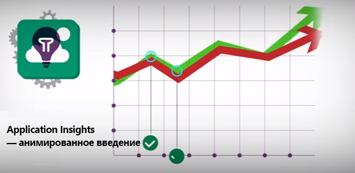](https://www.youtube.com/watch?v=fX2NtGrh-Y0)

> [!VIDEO https://channel9.msdn.com/events/Connect/2016/100/player] 

<!--Link references-->

[android]: https://github.com/Microsoft/ApplicationInsights-Android
[azure]: ../insights-perf-analytics.md
[client]: app-insights-javascript.md
[desktop]: app-insights-windows-desktop.md
[detect]: app-insights-detect-triage-diagnose.md
[greenbrown]: app-insights-asp-net.md
[ios]: https://github.com/Microsoft/ApplicationInsights-iOS
[java]: app-insights-java-get-started.md
[knowUsers]: app-insights-web-track-usage.md
[platforms]: app-insights-platforms.md
[portal]: http://portal.azure.com/
[qna]: app-insights-troubleshoot-faq.md
[redfield]: app-insights-monitor-performance-live-website-now.md
