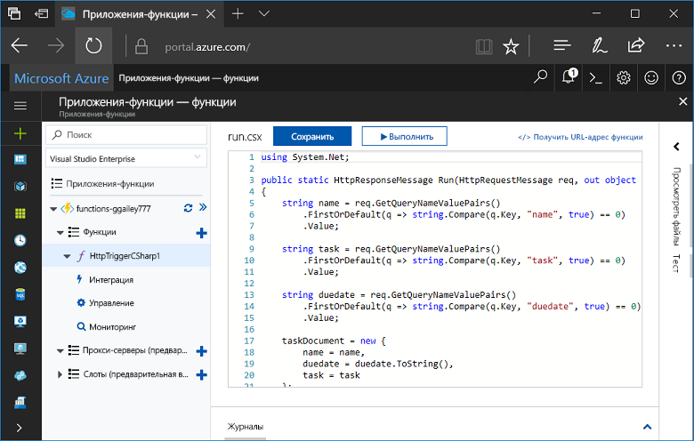
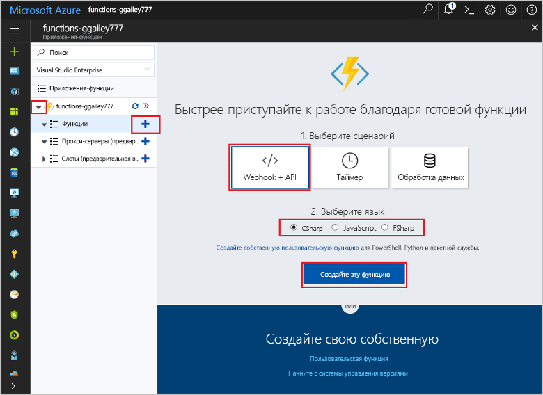
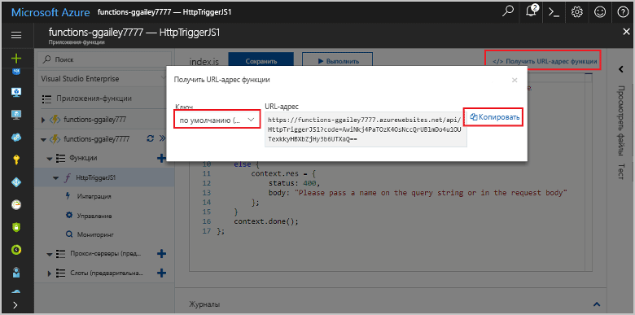
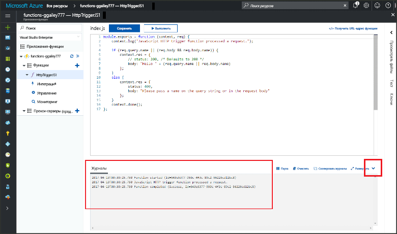

# Создание первой функции в hello портал AzureCreate your first function in hello Azure portal

Функции Azure позволяет выполнять код в среде без сервера без необходимости toofirst создания виртуальной Машины или публикации веб-приложения.Azure Functions lets you execute your code in a serverless environment without having toofirst create a VM or publish a web application. В этом разделе рассказано, как toouse функционирует toocreate функции «hello world» в hello портал Azure.In this topic, learn how toouse Functions toocreate a "hello world" function in hello Azure portal.

[!INCLUDE [quickstarts-free-trial-note](../../includes/quickstarts-free-trial-note.md)]

## Войдите в tooAzureLog in tooAzure

Войдите в toohello [портал Azure](https://portal.azure.com/).Log in toohello [Azure portal](https://portal.azure.com/).

## Создание приложения-функцииCreate a function app

Требуется выполнение функции приложения toohost hello функций.You must have a function app toohost hello execution of your functions. позволяющее группировать функции в логические единицы и упростить развертывание и совместное использование ресурсов, а также управление ими.A function app lets you group functions as a logic unit for easier management, deployment, and sharing of resources. 

[!INCLUDE [Create function app Azure portal](../../includes/functions-create-function-app-portal.md)]

[!INCLUDE [functions-portal-favorite-function-apps](../../includes/functions-portal-favorite-function-apps.md)]

Создайте функцию в приложение новые функции hello.Next, you create a function in hello new function app.

## Создание функции, активируемой HTTPCreate an HTTP triggered function

1. Разверните приложение новые функции, а затем щелкните hello  **+**  рядом слишком**функции**.Expand your new function app, then click hello **+** button next too**Functions**.

2.  В hello **быстро приступить к работе** выберите **веб-перехватчика + API**, **выбрать язык** функции, а затем щелкните **создания этой функции** .In hello **Get started quickly** page, select **WebHook + API**, **Choose a language** for your function, and click **Create this function**. 
   
    

Функция создается в выбранный язык с помощью шаблона hello для функции активации HTTP.A function is created in your chosen language using hello template for an HTTP triggered function. Можно запустить новые функции hello, отправив запрос HTTP.You can run hello new function by sending an HTTP request.

## Проверка функции helloTest hello function

1. В новой функции щелкните **</> Получить URL-адрес функции**, выберите **По умолчанию (ключ функции)**и нажмите кнопку **Копировать**.In your new function, click **</> Get function URL**, select **default (Function key)**, and then click **Copy**. 

    

2. Вставьте URL-адрес функции hello в адресной строке браузера.Paste hello function URL into your browser's address bar. Добавить строку hello запроса `&name=<yourname>` toothis hello URL-адрес и нажмите клавишу `Enter` ключа запроса hello tooexecute клавиатуры.Append hello query string `&name=<yourname>` toothis URL and press hello `Enter` key on your keyboard tooexecute hello request. Hello ниже приведен пример hello ответ, возвращаемый функцией "hello" в браузере Edge hello:hello following is an example of hello response returned by hello function in hello Edge browser:

    

    URL-адрес содержит ключ, который требуется, по умолчанию tooaccess запрос Hello работу по протоколу HTTP.hello request URL includes a key that is required, by default, tooaccess your function over HTTP.   

3. При выполнении функции сведения трассировки записываются журналы toohello.When your function runs, trace information is written toohello logs. выходные данные трассировки hello toosee из предыдущего выполнения hello, вернитесь tooyour функции hello портала и нажмите кнопку hello стрелкой hello нижней части экрана tooexpand hello **журналы**.toosee hello trace output from hello previous execution, return tooyour function in hello portal and click hello up arrow at hello bottom of hello screen tooexpand **Logs**. 

   

## Очистка ресурсовClean up resources

[!INCLUDE [Clean up resources](../../includes/functions-quickstart-cleanup.md)]

## Дальнейшие действияNext steps

Вы создали приложение-функцию с простой функцией, активируемой HTTP.You have created a function app with a simple HTTP triggered function.  

[!INCLUDE [Next steps note](../../includes/functions-quickstart-next-steps.md)]

Дополнительные сведения см. в статье [Привязки HTTP и webhook в функциях Azure](functions-bindings-http-webhook.md).For more information, see [Azure Functions HTTP and webhook bindings](functions-bindings-http-webhook.md).

