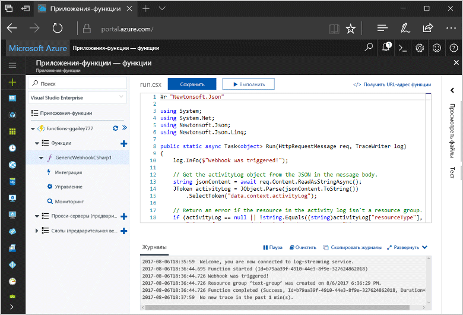
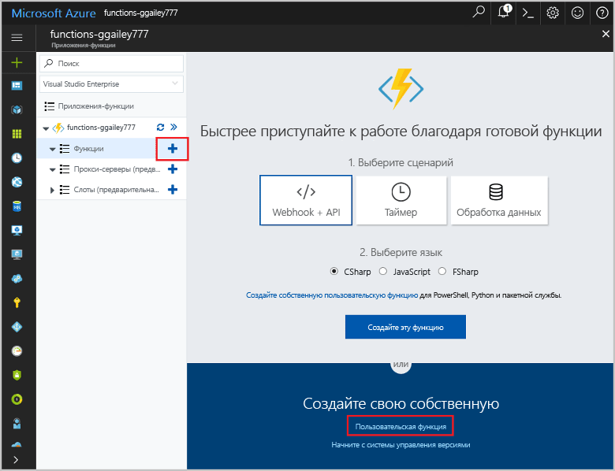
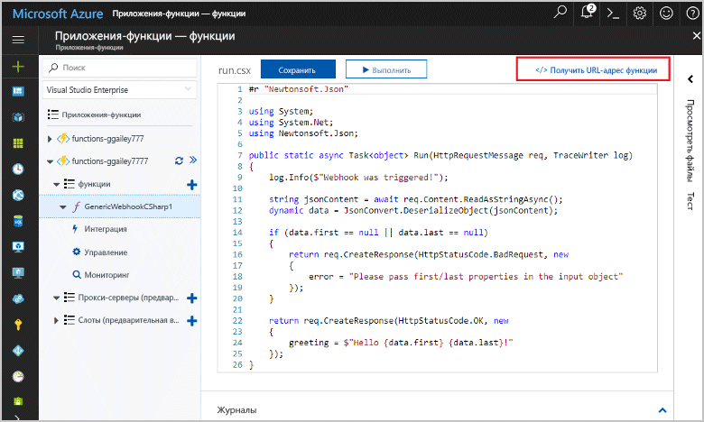
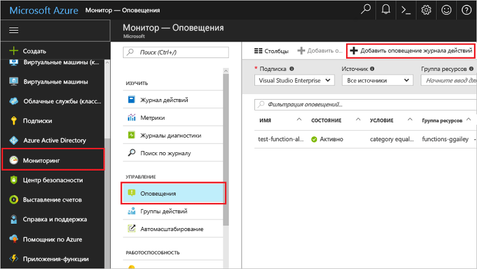
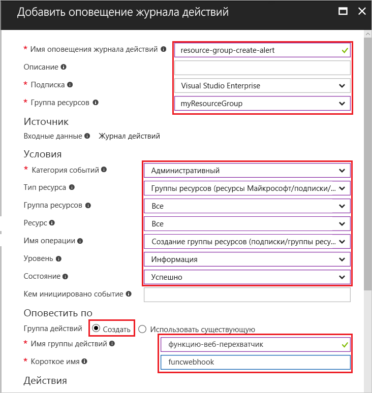
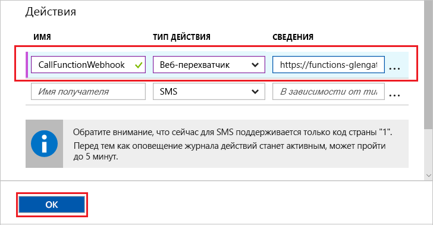
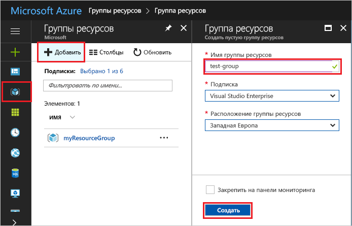
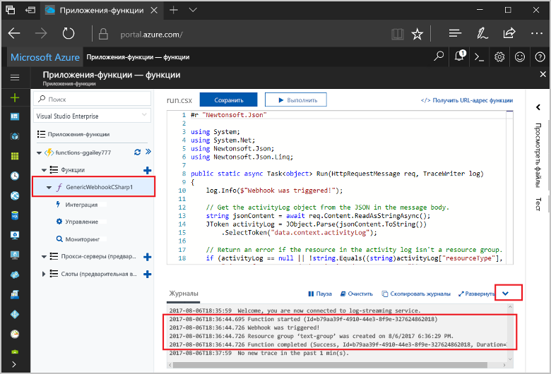

# <a name="create-a-function-triggered-by-a-generic-webhook"></a><span data-ttu-id="a1acb-103">Создание функции, активируемой универсальным веб-перехватчиком</span><span class="sxs-lookup"><span data-stu-id="a1acb-103">Create a function triggered by a generic webhook</span></span>

<span data-ttu-id="a1acb-104">Функции Azure позволяет выполнять код в среде без сервера без необходимости toofirst создания виртуальной Машины или публикации веб-приложения.</span><span class="sxs-lookup"><span data-stu-id="a1acb-104">Azure Functions lets you execute your code in a serverless environment without having toofirst create a VM or publish a web application.</span></span> <span data-ttu-id="a1acb-105">Например можно настроить функцию toobe, вызванное предупреждение, подаваемое монитором Azure.</span><span class="sxs-lookup"><span data-stu-id="a1acb-105">For example, you can configure a function toobe triggered by an alert raised by Azure Monitor.</span></span> <span data-ttu-id="a1acb-106">В этом разделе показано, как код на C# tooexecute при группа ресурсов находится добавлена tooyour подписки.</span><span class="sxs-lookup"><span data-stu-id="a1acb-106">This topic shows you how tooexecute C# code when a resource group is added tooyour subscription.</span></span>   



## <a name="prerequisites"></a><span data-ttu-id="a1acb-108">Предварительные требования</span><span class="sxs-lookup"><span data-stu-id="a1acb-108">Prerequisites</span></span> 

<span data-ttu-id="a1acb-109">toocomplete этого учебника:</span><span class="sxs-lookup"><span data-stu-id="a1acb-109">toocomplete this tutorial:</span></span>

+ <span data-ttu-id="a1acb-110">Если у вас еще нет подписки Azure, [создайте бесплатную учетную запись Azure](https://azure.microsoft.com/free/?WT.mc_id=A261C142F), прежде чем начинать работу.</span><span class="sxs-lookup"><span data-stu-id="a1acb-110">If you don't have an Azure subscription, create a [free account](https://azure.microsoft.com/free/?WT.mc_id=A261C142F) before you begin.</span></span>

[!INCLUDE [functions-portal-favorite-function-apps](../../includes/functions-portal-favorite-function-apps.md)]

## <a name="create-an-azure-function-app"></a><span data-ttu-id="a1acb-111">Создание приложения-функции Azure</span><span class="sxs-lookup"><span data-stu-id="a1acb-111">Create an Azure Function app</span></span>

[!INCLUDE [Create function app Azure portal](../../includes/functions-create-function-app-portal.md)]

<span data-ttu-id="a1acb-112">Создайте функцию в приложение новые функции hello.</span><span class="sxs-lookup"><span data-stu-id="a1acb-112">Next, you create a function in hello new function app.</span></span>

## <span data-ttu-id="a1acb-113"><a name="create-function"></a>Создание функции, активируемой универсальным веб-перехватчиком</span><span class="sxs-lookup"><span data-stu-id="a1acb-113"><a name="create-function"></a>Create a generic webhook triggered function</span></span>

1. <span data-ttu-id="a1acb-114">Разверните приложения функции и щелкните hello  **+**  рядом слишком**функции**.</span><span class="sxs-lookup"><span data-stu-id="a1acb-114">Expand your function app and click hello **+** button next too**Functions**.</span></span> <span data-ttu-id="a1acb-115">Если эта функция является hello первый в функции приложения, выберите **пользовательские функции**.</span><span class="sxs-lookup"><span data-stu-id="a1acb-115">If this function is hello first one in your function app, select **Custom function**.</span></span> <span data-ttu-id="a1acb-116">Откроется hello полный набор шаблонов функций.</span><span class="sxs-lookup"><span data-stu-id="a1acb-116">This displays hello complete set of function templates.</span></span>

    

2. <span data-ttu-id="a1acb-118">Выберите hello **универсального веб-перехватчика - C#** шаблона.</span><span class="sxs-lookup"><span data-stu-id="a1acb-118">Select hello **Generic WebHook - C#** template.</span></span> <span data-ttu-id="a1acb-119">Введите имя функции C# и выберите **Создать**.</span><span class="sxs-lookup"><span data-stu-id="a1acb-119">Type a name for your C# function, then select **Create**.</span></span>

      

2. <span data-ttu-id="a1acb-121">В новые функции, щелкните **URL-адрес функции <> / Get**, затем скопируйте и сохраните значение hello.</span><span class="sxs-lookup"><span data-stu-id="a1acb-121">In your new function, click **</> Get function URL**, then copy and save hello value.</span></span> <span data-ttu-id="a1acb-122">Использовать этот веб-перехватчик значение tooconfigure hello.</span><span class="sxs-lookup"><span data-stu-id="a1acb-122">You use this value tooconfigure hello webhook.</span></span> 

    
         
<span data-ttu-id="a1acb-124">Затем вы создадите конечную точку веб-перехватчика в оповещении журнала действий в Azure Monitor.</span><span class="sxs-lookup"><span data-stu-id="a1acb-124">Next, you create a webhook endpoint in an activity log alert in Azure Monitor.</span></span> 

## <a name="create-an-activity-log-alert"></a><span data-ttu-id="a1acb-125">Создание оповещения журнала действий</span><span class="sxs-lookup"><span data-stu-id="a1acb-125">Create an activity log alert</span></span>

1. <span data-ttu-id="a1acb-126">В hello портал Azure, перейдите toohello **монитор** службы, выберите **оповещения**и нажмите кнопку **журнала действий добавить оповещение**.</span><span class="sxs-lookup"><span data-stu-id="a1acb-126">In hello Azure portal, navigate toohello **Monitor** service, select **Alerts**, and click **Add activity log alert**.</span></span>   

    

2. <span data-ttu-id="a1acb-128">Используйте параметры hello, как указано в таблице hello:</span><span class="sxs-lookup"><span data-stu-id="a1acb-128">Use hello settings as specified in hello table:</span></span>

    

    | <span data-ttu-id="a1acb-130">Настройка</span><span class="sxs-lookup"><span data-stu-id="a1acb-130">Setting</span></span>      |  <span data-ttu-id="a1acb-131">Рекомендуемое значение</span><span class="sxs-lookup"><span data-stu-id="a1acb-131">Suggested value</span></span>   | <span data-ttu-id="a1acb-132">Описание</span><span class="sxs-lookup"><span data-stu-id="a1acb-132">Description</span></span>                              |
    | ------------ |  ------- | -------------------------------------------------- |
    | <span data-ttu-id="a1acb-133">**Имя оповещения журнала действий**</span><span class="sxs-lookup"><span data-stu-id="a1acb-133">**Activity log alert name**</span></span> | <span data-ttu-id="a1acb-134">resource-group-create-alert</span><span class="sxs-lookup"><span data-stu-id="a1acb-134">resource-group-create-alert</span></span> | <span data-ttu-id="a1acb-135">Имя предупреждения журнала действие hello.</span><span class="sxs-lookup"><span data-stu-id="a1acb-135">Name of hello activity log alert.</span></span> |
    | <span data-ttu-id="a1acb-136">**Подписка**</span><span class="sxs-lookup"><span data-stu-id="a1acb-136">**Subscription**</span></span> | <span data-ttu-id="a1acb-137">Ваша подписка</span><span class="sxs-lookup"><span data-stu-id="a1acb-137">Your subscription</span></span> | <span data-ttu-id="a1acb-138">Hello подписку, которую вы используете для этого учебника.</span><span class="sxs-lookup"><span data-stu-id="a1acb-138">hello subscription you are using for this tutorial.</span></span> | 
    |  <span data-ttu-id="a1acb-139">**Группа ресурсов**</span><span class="sxs-lookup"><span data-stu-id="a1acb-139">**Resource Group**</span></span> | <span data-ttu-id="a1acb-140">myResourceGroup</span><span class="sxs-lookup"><span data-stu-id="a1acb-140">myResourceGroup</span></span> | <span data-ttu-id="a1acb-141">Группа ресурсов Hello, развернутые для hello уведомление ресурсам.</span><span class="sxs-lookup"><span data-stu-id="a1acb-141">hello resource group that hello alert resources are deployed to.</span></span> <span data-ttu-id="a1acb-142">С помощью hello одну группу ресурсов, как функция приложения составляющих его проще tooclean после завершения учебника hello.</span><span class="sxs-lookup"><span data-stu-id="a1acb-142">Using hello same resource group as your function app makes it easier tooclean up after you complete hello tutorial.</span></span> |
    | <span data-ttu-id="a1acb-143">**Категория событий**</span><span class="sxs-lookup"><span data-stu-id="a1acb-143">**Event category**</span></span> | <span data-ttu-id="a1acb-144">Administrative</span><span class="sxs-lookup"><span data-stu-id="a1acb-144">Administrative</span></span> | <span data-ttu-id="a1acb-145">В эту категорию входят изменения, внесенные tooAzure ресурсов.</span><span class="sxs-lookup"><span data-stu-id="a1acb-145">This category includes changes made tooAzure resources.</span></span>  |
    | <span data-ttu-id="a1acb-146">**Тип ресурса**</span><span class="sxs-lookup"><span data-stu-id="a1acb-146">**Resource type**</span></span> | <span data-ttu-id="a1acb-147">Группы ресурсов</span><span class="sxs-lookup"><span data-stu-id="a1acb-147">Resource groups</span></span> | <span data-ttu-id="a1acb-148">Фильтры оповещения tooresource группы действий.</span><span class="sxs-lookup"><span data-stu-id="a1acb-148">Filters alerts tooresource group activities.</span></span> |
    | <span data-ttu-id="a1acb-149">**Группа ресурсов**</span><span class="sxs-lookup"><span data-stu-id="a1acb-149">**Resource Group**</span></span><br/><span data-ttu-id="a1acb-150">и **ресурс**</span><span class="sxs-lookup"><span data-stu-id="a1acb-150">and **Resource**</span></span> | <span data-ttu-id="a1acb-151">Все</span><span class="sxs-lookup"><span data-stu-id="a1acb-151">All</span></span> | <span data-ttu-id="a1acb-152">Отслеживает все ресурсы.</span><span class="sxs-lookup"><span data-stu-id="a1acb-152">Monitor all resources.</span></span> |
    | <span data-ttu-id="a1acb-153">**Имя операции**</span><span class="sxs-lookup"><span data-stu-id="a1acb-153">**Operation name**</span></span> | <span data-ttu-id="a1acb-154">Создать группу ресурсов</span><span class="sxs-lookup"><span data-stu-id="a1acb-154">Create Resource Group</span></span> | <span data-ttu-id="a1acb-155">Фильтры оповещения toocreate операций.</span><span class="sxs-lookup"><span data-stu-id="a1acb-155">Filters alerts toocreate operations.</span></span> |
    | <span data-ttu-id="a1acb-156">**Level**</span><span class="sxs-lookup"><span data-stu-id="a1acb-156">**Level**</span></span> | <span data-ttu-id="a1acb-157">Информация</span><span class="sxs-lookup"><span data-stu-id="a1acb-157">Informational</span></span> | <span data-ttu-id="a1acb-158">Учитывает оповещения на уровне сведений.</span><span class="sxs-lookup"><span data-stu-id="a1acb-158">Include informational level alerts.</span></span> | 
    | <span data-ttu-id="a1acb-159">**Состояние**</span><span class="sxs-lookup"><span data-stu-id="a1acb-159">**Status**</span></span> | <span data-ttu-id="a1acb-160">Успешно</span><span class="sxs-lookup"><span data-stu-id="a1acb-160">Succeeded</span></span> | <span data-ttu-id="a1acb-161">Фильтрует tooactions предупреждения, завершены успешно.</span><span class="sxs-lookup"><span data-stu-id="a1acb-161">Filters alerts tooactions that have completed successfully.</span></span> |
    | <span data-ttu-id="a1acb-162">**Группа действий**</span><span class="sxs-lookup"><span data-stu-id="a1acb-162">**Action group**</span></span> | <span data-ttu-id="a1acb-163">Создать</span><span class="sxs-lookup"><span data-stu-id="a1acb-163">New</span></span> | <span data-ttu-id="a1acb-164">Создайте новую группу действий, который определяет hello принимает действие при возникновении предупреждения.</span><span class="sxs-lookup"><span data-stu-id="a1acb-164">Create a new action group, which defines hello action takes when an alert is raised.</span></span> |
    | <span data-ttu-id="a1acb-165">**Имя группы действий**</span><span class="sxs-lookup"><span data-stu-id="a1acb-165">**Action group name**</span></span> | <span data-ttu-id="a1acb-166">function-webhook</span><span class="sxs-lookup"><span data-stu-id="a1acb-166">function-webhook</span></span> | <span data-ttu-id="a1acb-167">Группа действий для hello tooidentify имя.</span><span class="sxs-lookup"><span data-stu-id="a1acb-167">A name tooidentify hello action group.</span></span>  | 
    | <span data-ttu-id="a1acb-168">**Краткое название**</span><span class="sxs-lookup"><span data-stu-id="a1acb-168">**Short name**</span></span> | <span data-ttu-id="a1acb-169">funcwebhook</span><span class="sxs-lookup"><span data-stu-id="a1acb-169">funcwebhook</span></span> | <span data-ttu-id="a1acb-170">Короткое имя для группы действий hello.</span><span class="sxs-lookup"><span data-stu-id="a1acb-170">A short name for hello action group.</span></span> |  

3. <span data-ttu-id="a1acb-171">В **действия**, добавьте действие, используя параметры hello, как указано в таблице hello:</span><span class="sxs-lookup"><span data-stu-id="a1acb-171">In **Actions**, add an action using hello settings as specified in hello table:</span></span> 

    

    | <span data-ttu-id="a1acb-173">Настройка</span><span class="sxs-lookup"><span data-stu-id="a1acb-173">Setting</span></span>      |  <span data-ttu-id="a1acb-174">Рекомендуемое значение</span><span class="sxs-lookup"><span data-stu-id="a1acb-174">Suggested value</span></span>   | <span data-ttu-id="a1acb-175">Описание</span><span class="sxs-lookup"><span data-stu-id="a1acb-175">Description</span></span>                              |
    | ------------ |  ------- | -------------------------------------------------- |
    | <span data-ttu-id="a1acb-176">**Имя**</span><span class="sxs-lookup"><span data-stu-id="a1acb-176">**Name**</span></span> | <span data-ttu-id="a1acb-177">CallFunctionWebhook</span><span class="sxs-lookup"><span data-stu-id="a1acb-177">CallFunctionWebhook</span></span> | <span data-ttu-id="a1acb-178">Название действия hello.</span><span class="sxs-lookup"><span data-stu-id="a1acb-178">A name for hello action.</span></span> |
    | <span data-ttu-id="a1acb-179">**Тип действия**</span><span class="sxs-lookup"><span data-stu-id="a1acb-179">**Action type**</span></span> | <span data-ttu-id="a1acb-180">webhook</span><span class="sxs-lookup"><span data-stu-id="a1acb-180">Webhook</span></span> | <span data-ttu-id="a1acb-181">Предупреждение toohello Hello ответа —, вызывается URL-адрес веб-перехватчика.</span><span class="sxs-lookup"><span data-stu-id="a1acb-181">hello response toohello alert is that a Webhook URL is called.</span></span> |
    | <span data-ttu-id="a1acb-182">**Дополнительные сведения**</span><span class="sxs-lookup"><span data-stu-id="a1acb-182">**Details**</span></span> | <span data-ttu-id="a1acb-183">URL-адрес функции</span><span class="sxs-lookup"><span data-stu-id="a1acb-183">Function URL</span></span> | <span data-ttu-id="a1acb-184">Вставьте URL-адрес веб-перехватчика hello функции hello, скопированное ранее.</span><span class="sxs-lookup"><span data-stu-id="a1acb-184">Paste in hello webhook URL of hello function that you copied earlier.</span></span> |<span data-ttu-id="a1acb-185">v</span><span class="sxs-lookup"><span data-stu-id="a1acb-185">v</span></span>

4. <span data-ttu-id="a1acb-186">Нажмите кнопку **ОК** toocreate hello появления предупреждения и действия группы.</span><span class="sxs-lookup"><span data-stu-id="a1acb-186">Click **OK** toocreate hello alert and action group.</span></span>  

<span data-ttu-id="a1acb-187">веб-перехватчика Hello, теперь называется при создании группы ресурсов в вашей подписке.</span><span class="sxs-lookup"><span data-stu-id="a1acb-187">hello webhook is now called when a resource group is created in your subscription.</span></span> <span data-ttu-id="a1acb-188">Затем обновить кода hello в вашей hello toohandle функция журнала данных JSON в тексте hello hello запроса.</span><span class="sxs-lookup"><span data-stu-id="a1acb-188">Next, you update hello code in your function toohandle hello JSON log data in hello body of hello request.</span></span>   

## <a name="update-hello-function-code"></a><span data-ttu-id="a1acb-189">Изменения кода hello</span><span class="sxs-lookup"><span data-stu-id="a1acb-189">Update hello function code</span></span>

1. <span data-ttu-id="a1acb-190">Перейдите назад tooyour функции приложения hello портала и разверните функции.</span><span class="sxs-lookup"><span data-stu-id="a1acb-190">Navigate back tooyour function app in hello portal, and expand your function.</span></span> 

2. <span data-ttu-id="a1acb-191">Замените код скрипта hello C# в функции hello в портале hello hello, следующий код:</span><span class="sxs-lookup"><span data-stu-id="a1acb-191">Replace hello C# script code in hello function in hello portal with hello following code:</span></span>

    ```csharp
    #r "Newtonsoft.Json"
    
    using System;
    using System.Net;
    using Newtonsoft.Json;
    using Newtonsoft.Json.Linq;
    
    public static async Task<object> Run(HttpRequestMessage req, TraceWriter log)
    {
        log.Info($"Webhook was triggered!");
    
        // Get hello activityLog object from hello JSON in hello message body.
        string jsonContent = await req.Content.ReadAsStringAsync();
        JToken activityLog = JObject.Parse(jsonContent.ToString())
            .SelectToken("data.context.activityLog");
    
        // Return an error if hello resource in hello activity log isn't a resource group. 
        if (activityLog == null || !string.Equals((string)activityLog["resourceType"], 
            "Microsoft.Resources/subscriptions/resourcegroups"))
        {
            log.Error("An error occured");
            return req.CreateResponse(HttpStatusCode.BadRequest, new
            {
                error = "Unexpected message payload or wrong alert received."
            });
        }
    
        // Write information about hello created resource group toohello streaming log.
        log.Info(string.Format("Resource group '{0}' was {1} on {2}.",
            (string)activityLog["resourceGroupName"],
            ((string)activityLog["subStatus"]).ToLower(), 
            (DateTime)activityLog["submissionTimestamp"]));
    
        return req.CreateResponse(HttpStatusCode.OK);    
    }
    ```

<span data-ttu-id="a1acb-192">Теперь можно протестировать функции hello, создав новую группу ресурсов в вашей подписке.</span><span class="sxs-lookup"><span data-stu-id="a1acb-192">Now you can test hello function by creating a new resource group in your subscription.</span></span>

## <a name="test-hello-function"></a><span data-ttu-id="a1acb-193">Проверка функции hello</span><span class="sxs-lookup"><span data-stu-id="a1acb-193">Test hello function</span></span>

1. <span data-ttu-id="a1acb-194">Щелкните значок группы ресурсов hello в hello левой части hello портал Azure, выберите **+ добавить**, введите команду **имя группы ресурсов**и выберите **создать** toocreate группы ресурсов пустым.</span><span class="sxs-lookup"><span data-stu-id="a1acb-194">Click hello resource group icon in hello left of hello Azure portal, select **+ Add**, type a **Resource group name**, and select **Create** toocreate an empty resource group.</span></span>
    
    

2. <span data-ttu-id="a1acb-196">Функция tooyour вернуться назад и разверните hello **журналы** окна.</span><span class="sxs-lookup"><span data-stu-id="a1acb-196">Go back tooyour function and expand hello **Logs** window.</span></span> <span data-ttu-id="a1acb-197">После создания группы ресурсов hello hello триггеры предупреждения журнала действие hello веб-перехватчика и выполняет функции hello.</span><span class="sxs-lookup"><span data-stu-id="a1acb-197">After hello resource group is created, hello activity log alert triggers hello webhook and hello function executes.</span></span> <span data-ttu-id="a1acb-198">Можно видеть имя hello hello записываются журналы toohello новую группу ресурсов.</span><span class="sxs-lookup"><span data-stu-id="a1acb-198">You see hello name of hello new resource group written toohello logs.</span></span>  

    

3. <span data-ttu-id="a1acb-200">(Необязательно) Вернуться назад и удалить созданную группу ресурсов hello.</span><span class="sxs-lookup"><span data-stu-id="a1acb-200">(Optional) Go back and delete hello resource group that you created.</span></span> <span data-ttu-id="a1acb-201">Обратите внимание, что это действие не приводит к возникновению функции hello.</span><span class="sxs-lookup"><span data-stu-id="a1acb-201">Note that this activity doesn't trigger hello function.</span></span> <span data-ttu-id="a1acb-202">Это из-за удаления операций отфильтровываются hello предупреждения.</span><span class="sxs-lookup"><span data-stu-id="a1acb-202">This is because delete operations are filtered out by hello alert.</span></span> 

## <a name="clean-up-resources"></a><span data-ttu-id="a1acb-203">Очистка ресурсов</span><span class="sxs-lookup"><span data-stu-id="a1acb-203">Clean up resources</span></span>

[!INCLUDE [Next steps note](../../includes/functions-quickstart-cleanup.md)]

## <a name="next-steps"></a><span data-ttu-id="a1acb-204">Дальнейшие действия</span><span class="sxs-lookup"><span data-stu-id="a1acb-204">Next steps</span></span>

<span data-ttu-id="a1acb-205">Вы создали функцию, которая выполняется при получении запроса от универсального веб-перехватчика.</span><span class="sxs-lookup"><span data-stu-id="a1acb-205">You have created a function that runs when a request is received from a generic webhook.</span></span> 

[!INCLUDE [Next steps note](../../includes/functions-quickstart-next-steps.md)]

<span data-ttu-id="a1acb-206">Дополнительные сведения см. в статье [Привязки HTTP и веб-перехватчика в функциях Azure](functions-bindings-http-webhook.md).</span><span class="sxs-lookup"><span data-stu-id="a1acb-206">For more information about webhook triggers, see [Azure Functions HTTP and webhook bindings](functions-bindings-http-webhook.md).</span></span> <span data-ttu-id="a1acb-207">toolearn Дополнительные сведения о разработке функции в C# в разделе [Справочник разработчика сценария Azure функции C#](functions-reference-csharp.md).</span><span class="sxs-lookup"><span data-stu-id="a1acb-207">toolearn more about developing functions in C#, see [Azure Functions C# script developer reference](functions-reference-csharp.md).</span></span>

