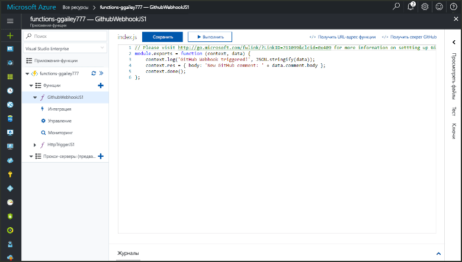
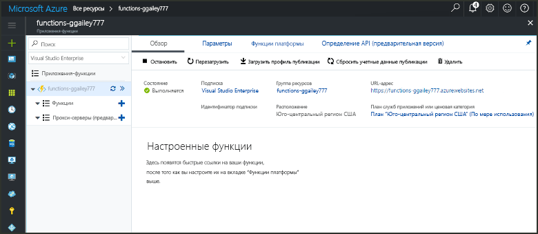
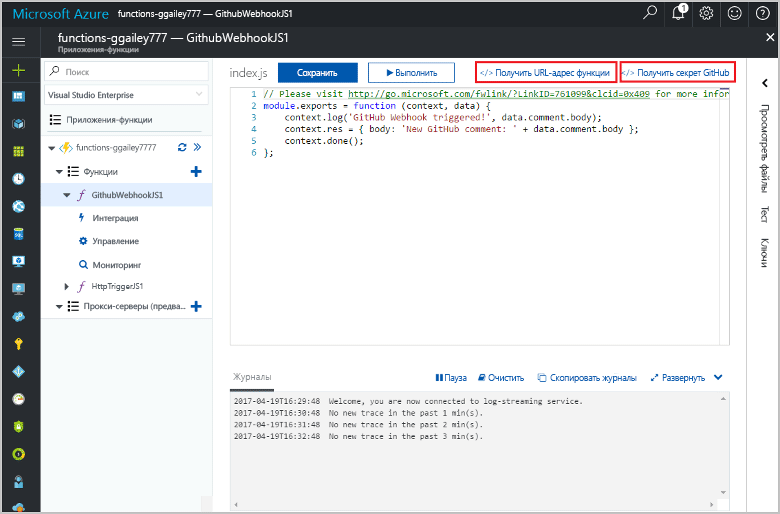
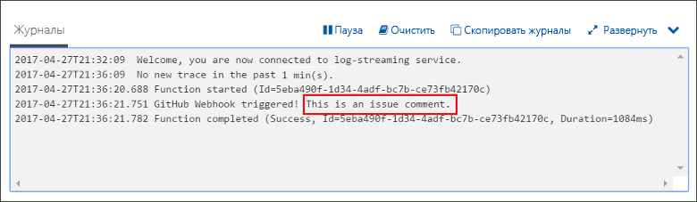

# Создание функции, активируемой объектом webhook GitHub

Узнайте, как toocreate функцию, которая инициируется с полезными данными GitHub конкретного веб-перехватчика HTTP-запроса.

## Предварительные требования

+ Учетная запись GitHub с хотя бы одним проектом.
+ Подписка Azure. Если у вас еще нет подписки Azure, создайте [бесплатную учетную запись](https://azure.microsoft.com/free/?WT.mc_id=A261C142F), прежде чем начать работу.

[!INCLUDE [functions-portal-favorite-function-apps](../../includes/functions-portal-favorite-function-apps.md)]

## Создание приложения-функции Azure

[!INCLUDE [Create function app Azure portal](../../includes/functions-create-function-app-portal.md)]

Создайте функцию в приложение новые функции hello.

## Создание функции, активируемой объектом webhook GitHub

1. Разверните приложения функции и щелкните hello  **+**  рядом слишком**функции**. Если это первая функция hello в приложении функции, выберите **пользовательские функции**. Откроется hello полный набор шаблонов функций.

    

2. Выберите hello **GitHub веб-перехватчика** шаблона для нужный язык. **Присвойте функции имя** и щелкните **Создать**.

      

3. В новые функции, щелкните **URL-адрес функции <> / Get**, затем скопируйте и сохраните значения hello. Здравствуйте, такие же действия **<> / GitHub получить секрет**. Используйте эти веб-перехватчика значения tooconfigure hello в GitHub.

    

Затем создайте объект webhook в репозитории GitHub.

## Настройка веб-перехватчика hello

1. На портале GitHub перейдите tooa репозитория, вы являетесь владельцем. Вы можете использовать любые репозитории, для которых создали ответвления. Toofork репозиторий используйте <https://github.com/Azure-Samples/functions-quickstart>.

1. Щелкните **Параметры**, **Веб-перехватчики**, а затем — **Добавить веб-перехватчик**.

    

1. Использовать параметры, как указано в таблице hello, а затем нажмите кнопку **добавить веб-перехватчика**.

    

| Настройка | Рекомендуемое значение | Описание |
|---|---|---|
| **Payload URL** (URL-адрес полезных данных) | Скопированное значение | Используйте значение hello, возвращенное **URL-адрес функции <> / Get**. |
| **Секрет**   | Скопированное значение | Используйте значение hello, возвращенное **<> / GitHub получить секрет**. |
| **Тип содержимого** | приложение/json | функция Hello ожидает полезные данные JSON. |
| Триггеры событий | Let me select individual events (Я выбираю отдельные события) | Нам нужен только tootrigger на проблему комментирования событий.  |
| | Issue comment (Примечание к вопросу) |  |

Теперь hello веб-перехватчика имеет настроенный tootrigger функции при добавлении нового комментария проблему.

## Проверка функции hello

1. В репозитории GitHub откройте hello **проблемы** вкладку в новом окне браузера.

1. В новом окне приветствия щелкните **новая проблема**, введите заголовок и нажмите кнопку **отправить новый выпуск**.

1. В выпуске hello, введите комментарий и нажмите кнопку **комментарий**.

    

1. Вернитесь к предыдущему окну toohello портал и просмотрите журналы hello. Должна появиться запись трассировки hello новым текстом комментария.

     

## Очистка ресурсов

[!INCLUDE [Next steps note](../../includes/functions-quickstart-cleanup.md)]

## Дальнейшие действия

Вы создали функцию, которая выполняется при получении запроса объекта webhook GitHub.

[!INCLUDE [Next steps note](../../includes/functions-quickstart-next-steps.md)]

Дополнительные сведения см. в статье [Привязки HTTP и веб-перехватчика в функциях Azure](functions-bindings-http-webhook.md).
