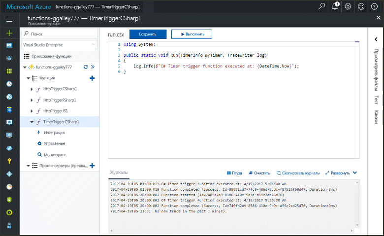
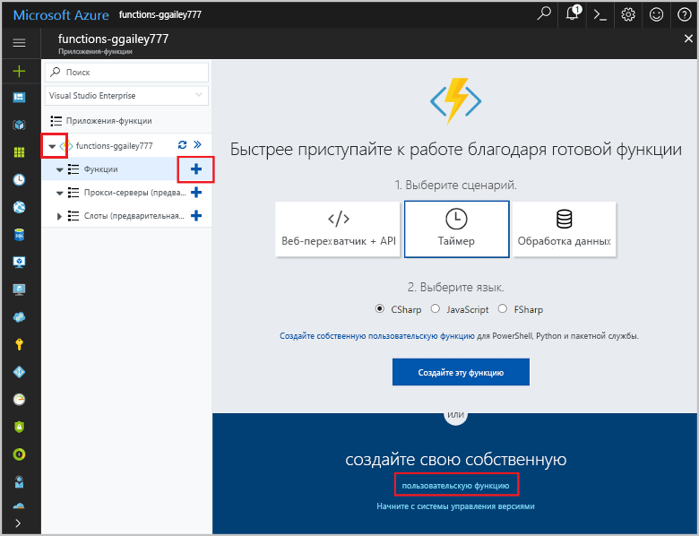
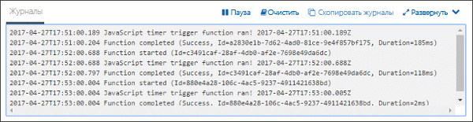
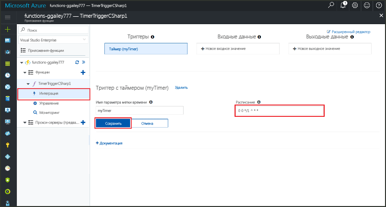

# Создание в Azure функции, активируемой по таймеруCreate a function in Azure that is triggered by a timer

Узнайте, как toocreate функции Azure toouse функцию, которая выполняется на основе определяемому вами расписанию.Learn how toouse Azure Functions toocreate a function that runs based a schedule that you define.

## Предварительные требованияPrerequisites

toocomplete этого учебника:toocomplete this tutorial:

+ Если у вас еще нет подписки Azure, [создайте бесплатную учетную запись Azure](https://azure.microsoft.com/free/?WT.mc_id=A261C142F), прежде чем начинать работу.If you don't have an Azure subscription, create a [free account](https://azure.microsoft.com/free/?WT.mc_id=A261C142F) before you begin.

[!INCLUDE [functions-portal-favorite-function-apps](../../includes/functions-portal-favorite-function-apps.md)]

## Создание приложения-функции AzureCreate an Azure Function app

[!INCLUDE [Create function app Azure portal](../../includes/functions-create-function-app-portal.md)]

Создайте функцию в приложение новые функции hello.Next, you create a function in hello new function app.

## Создание функции, активируемой по таймеруCreate a timer triggered function

1. Разверните приложения функции и щелкните hello  **+**  рядом слишком**функции**.Expand your function app and click hello **+** button next too**Functions**. Если это первая функция hello в приложении функции, выберите **пользовательские функции**.If this is hello first function in your function app, select **Custom function**. Откроется hello полный набор шаблонов функций.This displays hello complete set of function templates.

    

2. Выберите hello **TimerTrigger** шаблона для нужный язык.Select hello **TimerTrigger** template for your desired language. Затем используйте hello параметры, как указано в таблице hello:Then use hello settings as specified in hello table:

    

    | НастройкаSetting | Рекомендуемое значениеSuggested value | ОписаниеDescription |
    |---|---|---|
    | **Имя функции****Name your function** | TimerTriggerCSharp1TimerTriggerCSharp1 | Определяет имя hello этой функции запуска таймера.Defines hello name of your timer triggered function. |
    | **[Расписание](http://en.wikipedia.org/wiki/Cron#CRON_expression)****[Schedule](http://en.wikipedia.org/wiki/Cron#CRON_expression)** | 0 \*/1 \* \* \* \*0 \*/1 \* \* \* \* | Шесть полей [выражение CRON](http://en.wikipedia.org/wiki/Cron#CRON_expression) , планирует вашей toorun функция каждую минуту.A six field [CRON expression](http://en.wikipedia.org/wiki/Cron#CRON_expression) that schedules your function toorun every minute. |

2. Щелкните **Создать**.Click **Create**. Будет создана функция на выбранном вами языке, которая будет выполняться каждую минуту.A function is created in your chosen language that runs every minute.

3. Проверьте выполнение, просмотр сведений трассировки записываются журналы toohello.Verify execution by viewing trace information written toohello logs.

    

Теперь можно изменить расписание функции hello, чтобы он запускался реже, например один раз в час.Now, you can change hello function's schedule so that it runs less often, such as once every hour. 

## Обновить расписание таймера helloUpdate hello timer schedule

1. Разверните вашу функцию и щелкните **Интеграция**.Expand your function and click **Integrate**. Это где определение входных данных и вывода привязки функции, а также задать расписание hello.This is where you define input and output bindings for your function and also set hello schedule. 

2. Введите в поле **Расписания** новое значение `0 0 */1 * * *`, а затем щелкните **Сохранить**.Enter a new **Schedule** value of `0 0 */1 * * *`, and then click **Save**.  

Теперь функция будет выполняться раз в час.You now have a function that runs once every hour. 

## Очистка ресурсовClean up resources

[!INCLUDE [Next steps note](../../includes/functions-quickstart-cleanup.md)]

## Дальнейшие действияNext steps

Вы создали функцию, которая выполняется на основе расписания.You have created a function that runs based on a schedule.

[!INCLUDE [Next steps note](../../includes/functions-quickstart-next-steps.md)]

Дополнительные сведения о триггерах см.в статье [Настройка триггеров для выполнения кода с помощью Функций Azure](functions-bindings-timer.md).For more information timer triggers, see [Schedule code execution with Azure Functions](functions-bindings-timer.md).