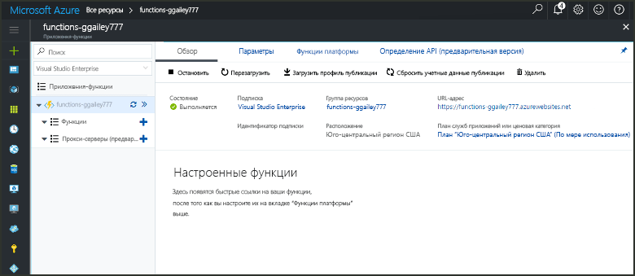

# Создание в Azure функции, активируемой по таймеру

Узнайте, как toocreate функции Azure toouse функцию, которая выполняется на основе определяемому вами расписанию.

## Предварительные требования

toocomplete этого учебника:

+ Если у вас еще нет подписки Azure, [создайте бесплатную учетную запись Azure](https://azure.microsoft.com/free/?WT.mc_id=A261C142F), прежде чем начинать работу.

[!INCLUDE [functions-portal-favorite-function-apps](../../includes/functions-portal-favorite-function-apps.md)]

## Создание приложения-функции Azure

[!INCLUDE [Create function app Azure portal](../../includes/functions-create-function-app-portal.md)]

Создайте функцию в приложение новые функции hello.

## Создание функции, активируемой по таймеру

1. Разверните приложения функции и щелкните hello  **+**  рядом слишком**функции**. Если это первая функция hello в приложении функции, выберите **пользовательские функции**. Откроется hello полный набор шаблонов функций.

    

2. Выберите hello **TimerTrigger** шаблона для нужный язык. Затем используйте hello параметры, как указано в таблице hello:

    

    | Настройка | Рекомендуемое значение | Описание |
    |---|---|---|
    | **Имя функции** | TimerTriggerCSharp1 | Определяет имя hello этой функции запуска таймера. |
    | **[Расписание](http://en.wikipedia.org/wiki/Cron#CRON_expression)** | 0 \*/1 \* \* \* \* | Шесть полей [выражение CRON](http://en.wikipedia.org/wiki/Cron#CRON_expression) , планирует вашей toorun функция каждую минуту. |

2. Щелкните **Создать**. Будет создана функция на выбранном вами языке, которая будет выполняться каждую минуту.

3. Проверьте выполнение, просмотр сведений трассировки записываются журналы toohello.

    

Теперь можно изменить расписание функции hello, чтобы он запускался реже, например один раз в час. 

## Обновить расписание таймера hello

1. Разверните вашу функцию и щелкните **Интеграция**. Это где определение входных данных и вывода привязки функции, а также задать расписание hello. 

2. Введите в поле **Расписания** новое значение `0 0 */1 * * *`, а затем щелкните **Сохранить**.  

Теперь функция будет выполняться раз в час. 

## Очистка ресурсов

[!INCLUDE [Next steps note](../../includes/functions-quickstart-cleanup.md)]

## Дальнейшие действия

Вы создали функцию, которая выполняется на основе расписания.

[!INCLUDE [Next steps note](../../includes/functions-quickstart-next-steps.md)]

Дополнительные сведения о триггерах см.в статье [Настройка триггеров для выполнения кода с помощью Функций Azure](functions-bindings-timer.md).