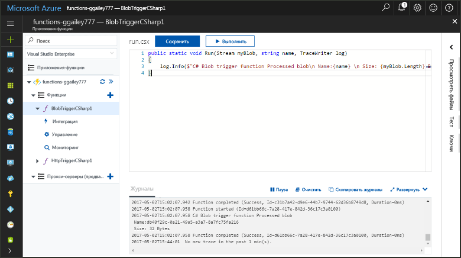
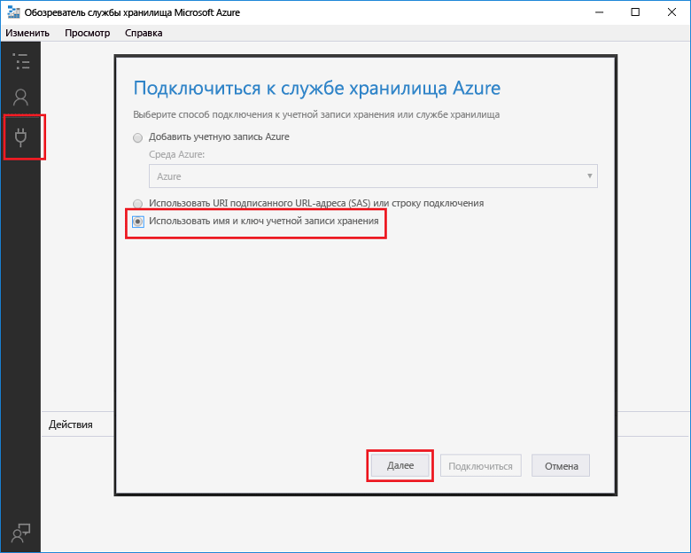
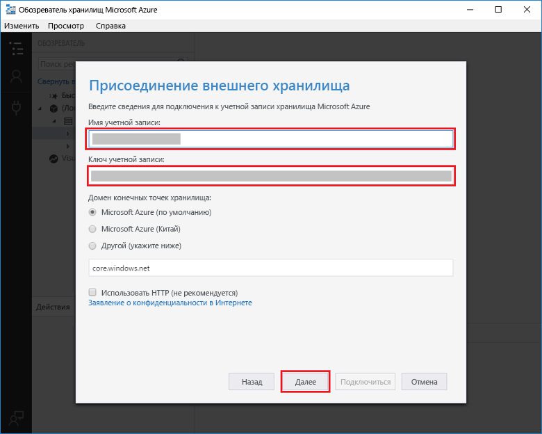
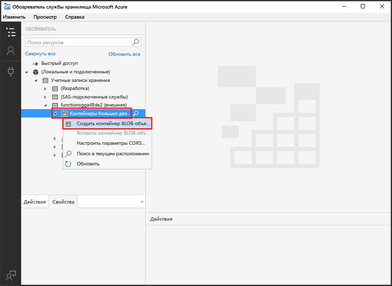
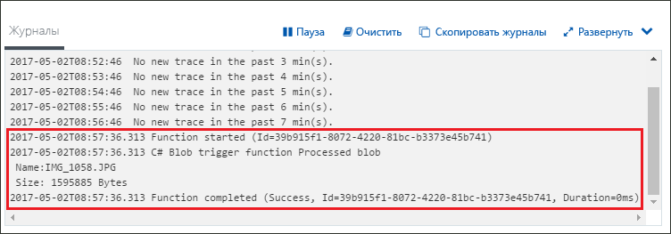

# Создание функции, активируемой хранилищем BLOB-объектов AzureCreate a function triggered by Azure Blob storage

Узнайте, как toocreate функции, вызываемые при файлы, загрузить tooor обновляется в хранилище больших двоичных объектов Azure.Learn how toocreate a function triggered when files are uploaded tooor updated in Azure Blob storage.

## Предварительные требованияPrerequisites

+ Загрузите и установите hello [Microsoft Azure Storage Explorer](http://storageexplorer.com/).Download and install hello [Microsoft Azure Storage Explorer](http://storageexplorer.com/).
+ Подписка Azure.An Azure subscription. Если у вас еще нет подписки Azure, создайте [бесплатную учетную запись](https://azure.microsoft.com/free/?WT.mc_id=A261C142F), прежде чем начать работу.If you don't have one, create a [free account](https://azure.microsoft.com/free/?WT.mc_id=A261C142F) before you begin.

[!INCLUDE [functions-portal-favorite-function-apps](../../includes/functions-portal-favorite-function-apps.md)]

## Создание приложения-функции AzureCreate an Azure Function app

[!INCLUDE [Create function app Azure portal](../../includes/functions-create-function-app-portal.md)]

Создайте функцию в приложение новые функции hello.Next, you create a function in hello new function app.

## Создание функции, активируемой хранилищем BLOB-объектовCreate a Blob storage triggered function

1. Разверните приложения функции и щелкните hello  **+**  рядом слишком**функции**.Expand your function app and click hello **+** button next too**Functions**. Если это первая функция hello в приложении функции, выберите **пользовательские функции**.If this is hello first function in your function app, select **Custom function**. Откроется hello полный набор шаблонов функций.This displays hello complete set of function templates.

    

2. Выберите hello **BlobTrigger** шаблона для нужного языка и использовать параметры hello, как указано в таблице hello.Select hello **BlobTrigger** template for your desired language, and use hello settings as specified in hello table.

    

    | НастройкаSetting | Рекомендуемое значениеSuggested value | ОписаниеDescription |
    |---|---|---|
    | **Путь****Path**   | mycontainer/{name}mycontainer/{name}    | Расположение в хранилище BLOB-объектов отслеживается.Location in Blob storage being monitored. Имя файла Hello hello большого двоичного объекта передается в привязке hello как hello _имя_ параметра.hello file name of hello blob is passed in hello binding as hello _name_ parameter.  |
    | **Подключение к учетной записи хранения****Storage account connection** | AzureWebJobStorageAzureWebJobStorage | Можно использовать уже используется приложением функции подключения к учетной записи хранилища hello или создайте новую.You can use hello storage account connection already being used by your function app, or create a new one.  |
    | **Имя функции****Name your function** | Уникальное для вашего приложения-функцииUnique in your function app | Имя функции, активируемой большим двоичным объектом.Name of this blob triggered function. |

3. Нажмите кнопку **создать** toocreate функции.Click **Create** toocreate your function.

Затем подключите учетную запись хранилища Azure tooyour и создать hello **mycontainer** контейнера.Next, you connect tooyour Azure Storage account and create hello **mycontainer** container.

## Создание контейнера helloCreate hello container

1. Щелкните **Интегрировать** в своей функции, затем разверните узел **Документация** и скопируйте **имя учетной записи** и **ключ учетной записи**.In your function, click **Integrate**, expand **Documentation**, and copy both **Account name** and **Account key**. Можно использовать учетную запись хранения tooconnect toohello эти учетные данные.You use these credentials tooconnect toohello storage account. Если вы уже подключились вашей учетной записи хранилища, пропустите toostep 4.If you have already connected your storage account, skip toostep 4.

    

1. Запустите hello [Microsoft Azure Storage Explorer](http://storageexplorer.com/) инструмент, нажмите кнопку hello значок слева hello подключения, выберите **использовать имя учетной записи хранения и ключ**и нажмите кнопку **Далее**.Run hello [Microsoft Azure Storage Explorer](http://storageexplorer.com/) tool, click hello connect icon on hello left, choose **Use a storage account name and key**, and click **Next**.

    

1. Введите hello **имя учетной записи** и **ключ учетной записи** из шага 1, нажмите кнопку **Далее** и затем **Connect**.Enter hello **Account name** and **Account key** from step 1, click **Next** and then **Connect**. 

    

1. Hello присоединенного учетной записи хранилища, щелкните правой кнопкой **контейнеры больших двоичных объектов**, нажмите кнопку **создать контейнер больших двоичных объектов**, тип `mycontainer`, и нажмите клавишу ВВОД.Expand hello attached storage account, right-click **Blob containers**, click **Create blob container**, type `mycontainer`, and then press enter.

    

Теперь, когда контейнер больших двоичных объектов, можно проверить функции hello передав toohello контейнера файлов.Now that you have a blob container, you can test hello function by uploading a file toohello container.

## Проверка функции helloTest hello function

1. Обратно в hello портал Azure, функция tooyour обзора разверните hello **журналы** hello нижней части страницы hello и убедитесь, что не приостановлен, журналов потоковой передачи.Back in hello Azure portal, browse tooyour function expand hello **Logs** at hello bottom of hello page and make sure that log streaming isn't paused.

1. В обозревателе хранилищ разверните вашу учетную запись хранения, **Blob containers** (Контейнеры больших двоичных объектов) и **mycontainer**.In Storage Explorer, expand your storage account, **Blob containers**, and **mycontainer**. Щелкните **Отправка**, а затем **Отправка файлов**.Click **Upload** and then **Upload files...**.

    

1. В hello **передачи файлов** диалоговое окно, нажмите кнопку hello **файлы** поля.In hello **Upload files** dialog box, click hello **Files** field. Обзор tooa файл на локальном компьютере, таких как файл изображения, выберите его и нажмите кнопку **откройте** и затем **отправить**.Browse tooa file on your local computer, such as an image file, select it and click **Open** and then **Upload**.

1. Вернитесь к предыдущему окну tooyour журналов функций и убедитесь, что были прочитаны hello большого двоичного объекта.Go back tooyour function logs and verify that hello blob has been read.

   

    >[!NOTE]
    > При выполнении функции приложения в плане использования по умолчанию hello могут существовать задержки вверх tooseveral минут между hello добавлении или обновлении большого двоичного объекта и hello функции запустилась.When your function app runs in hello default Consumption plan, there may be a delay of up tooseveral minutes between hello blob being added or updated and hello function being triggered. Выполняйте свое приложение-функцию в рамках плана службы приложений, если требуется малая задержка в функции, активируемой большим двоичным объектом.If you need low latency in your blob triggered functions, consider running your function app in an App Service plan.

## Очистка ресурсовClean up resources

[!INCLUDE [Next steps note](../../includes/functions-quickstart-cleanup.md)]

## Дальнейшие действияNext steps

Вы создали функцию, которая выполняется при добавлении tooor обновить большой двоичный объект в хранилище больших двоичных объектов.You have created a function that runs when a blob is added tooor updated in Blob storage. 

[!INCLUDE [Next steps note](../../includes/functions-quickstart-next-steps.md)]

Дополнительные сведения о триггерах хранилища BLOB-объектов см.в статье [Привязки больших двоичных объектов службы хранилища для Функций Azure](functions-bindings-storage-blob.md).For more information about Blob storage triggers, see [Azure Functions Blob storage bindings](functions-bindings-storage-blob.md).
