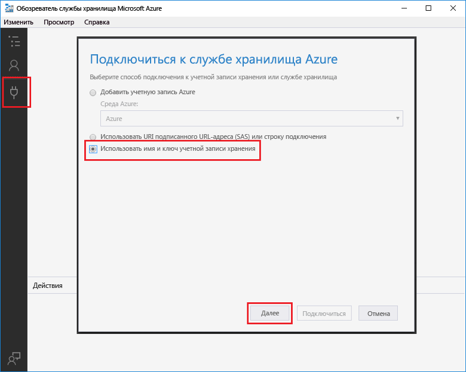
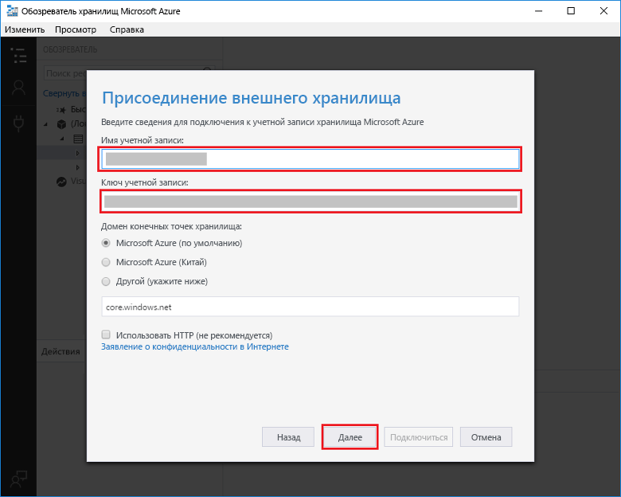

# Создание функции, активируемой хранилищем очередей Azure

Узнайте, как toocreate функции, вызываемые при сообщения, отправленные tooan очереди службы хранилища Azure.

## Предварительные требования

- Загрузите и установите hello [Microsoft Azure Storage Explorer](http://storageexplorer.com/).

- Подписка Azure. Если у вас еще нет подписки Azure, создайте [бесплатную учетную запись](https://azure.microsoft.com/free/?WT.mc_id=A261C142F), прежде чем начать работу.

[!INCLUDE [functions-portal-favorite-function-apps](../../includes/functions-portal-favorite-function-apps.md)]

## Создание приложения-функции Azure

[!INCLUDE [Create function app Azure portal](../../includes/functions-create-function-app-portal.md)]

Создайте функцию в приложение новые функции hello.

## Создание функции, активируемой очередью

1. Разверните приложения функции и щелкните hello  **+**  рядом слишком**функции**. Если это первая функция hello в приложении функции, выберите **пользовательские функции**. Откроется hello полный набор шаблонов функций.

    

2. Выберите hello **QueueTrigger** шаблона для нужного языка и использовать параметры hello, как указано в таблице hello.

    
    
    | Настройка | Рекомендуемое значение | Описание |
    |---|---|---|
    | **Имя очереди**   | myqueue-items    | Имя hello очереди tooconnect tooin вашей учетной записи хранилища. |
    | **Подключение к учетной записи хранения** | AzureWebJobStorage | Можно использовать уже используется приложением функции подключения к учетной записи хранилища hello или создайте новую.  |
    | **Имя функции** | Уникальное для вашего приложения-функции | Имя функции, активируемой очередью. |

3. Нажмите кнопку **создать** toocreate функции.

Затем подключите учетную запись хранилища Azure tooyour и создать hello **myqueue элементы** очереди хранилища.

## Создать очередь hello

1. Щелкните **Интегрировать** в своей функции, затем разверните узел **Документация** и скопируйте **имя учетной записи** и **ключ учетной записи**. Можно использовать учетную запись хранения tooconnect toohello эти учетные данные. Если вы уже подключились вашей учетной записи хранилища, пропустите toostep 4.

    v

1. Запустите hello [Microsoft Azure Storage Explorer](http://storageexplorer.com/) инструмент, нажмите кнопку hello значок слева hello подключения, выберите **использовать имя учетной записи хранения и ключ**и нажмите кнопку **Далее**.

    

1. Введите hello **имя учетной записи** и **ключ учетной записи** из шага 1, нажмите кнопку **Далее** и затем **Connect**.

    

1. Hello присоединенного учетной записи хранилища, щелкните правой кнопкой **очереди**, нажмите кнопку **создать очередь**, тип `myqueue-items`, и нажмите клавишу ВВОД.

    

Теперь, когда очередь хранилища можно проверить функции hello, добавив toohello очереди сообщений.

## Проверка функции hello

1. Обратно в hello портал Azure, функция tooyour обзора разверните hello **журналы** hello нижней части страницы hello и убедитесь, что не приостановлен, журналов потоковой передачи.

1. Разверните свою учетную запись в обозревателе хранилищ, узел **Очереди** и **myqueue-items**, а затем щелкните **Add message** (Добавить сообщение).

    

1. Введите сообщение Hello World в поле **Текст сообщения** и щелкните **ОК**.

1. Подождите несколько секунд, а затем вернитесь tooyour журналов функций и убедитесь, что новые сообщения hello уже считаны из очереди hello.

    

1. Назад в обозреватель хранилищ щелкните **обновление** и убедитесь, что приветственное сообщение было обработано и hello очереди больше не.

## Очистка ресурсов

[!INCLUDE [Next steps note](../../includes/functions-quickstart-cleanup.md)]

## Дальнейшие действия

Вы создали функцию, которая выполняется при добавлении tooa хранилища очереди сообщений.

[!INCLUDE [Next steps note](../../includes/functions-quickstart-next-steps.md)]

Дополнительные сведения о триггерах хранилища очередей см. в статье [Привязки очередей службы хранилища для Функций Azure](functions-bindings-storage-queue.md).