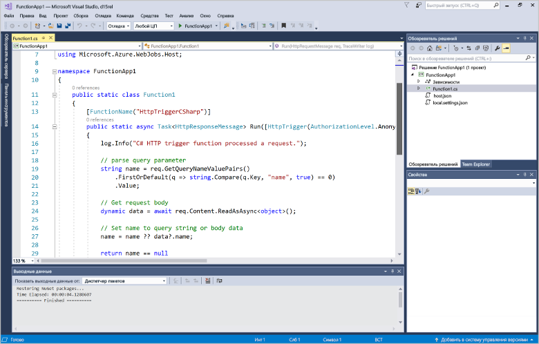
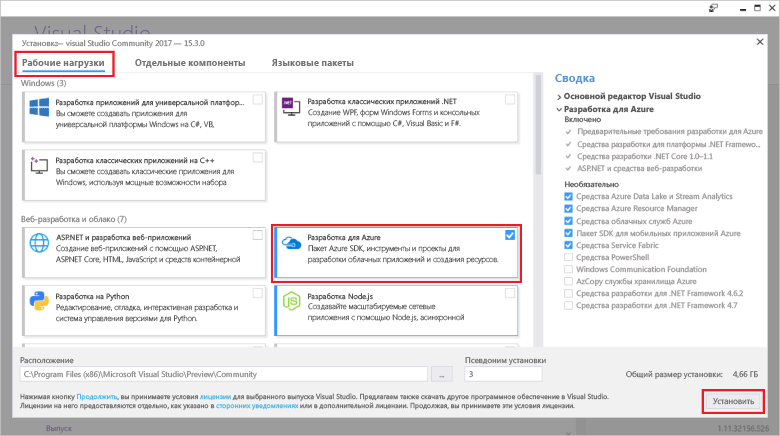
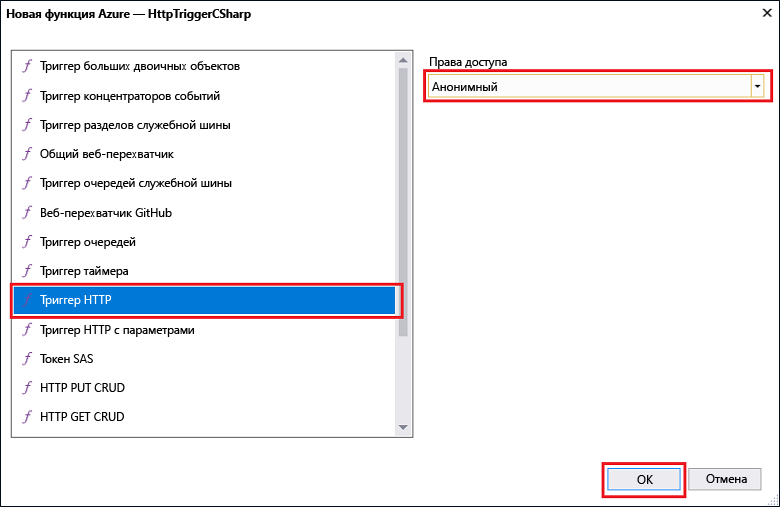

# Создание первой функции с помощью Visual Studio

Функции Azure позволяет выполнять код в среде без сервера без необходимости toofirst создания виртуальной Машины или публикации веб-приложения.

В этом разделе вы узнаете, как toouse hello 2017 г. Visual Studio tools для функций Azure toocreate и тестов локально функцию «hello world». Затем вы публикуете tooAzure кода функции hello. Эти средства доступны как часть рабочей нагрузки разработки Azure hello в Visual Studio 2017 г. версия 15,3 или более поздней версии.

## Предварительные требования

toocomplete учебника, установки:

* [Visual Studio 2017 г. версия 15,3](https://www.visualstudio.com/vs/preview/), включая hello **разработки Azure** рабочей нагрузки.

    
    
    >[!NOTE]  
    После установки или обновления tooVisual Studio 2017 г. версия 15,3, необходимо также toomanually обновления hello 2017 г. Visual Studio tools для функций Azure. Можно обновить средства hello из hello **средства** меню в разделе **расширения и обновления...**   >  **Обновления** > **Visual Studio Marketplace** > **функций Azure и веб-задания средства**  >  **Обновление**. 

[!INCLUDE [quickstarts-free-trial-note](../../includes/quickstarts-free-trial-note.md)] 

## Создание проекта функций Azure в Visual Studio

[!INCLUDE [Create a project using hello Azure Functions template](../../includes/functions-vstools-create.md)]

После создания проекта hello созданием первой функции.

## Создание функции hello

1. Щелкните правой кнопкой мыши узел проекта в **обозревателе решений** и выберите **Добавить** > **Новый элемент**. Выберите **Функция Azure** и нажмите кнопку **Добавить**.

2. Выберите **HttpTrigger**, укажите **имя функции**, выберите для параметра **Права доступа** значение **Анонимно** и нажмите кнопку **Создать**. Hello функция, созданная осуществляется с помощью запроса HTTP из любого клиента. 

    

    Файл кода добавляется tooyour проект, содержащий класс, реализующий кода функции. Этот код основан на шаблоне, который получает значение имени и выводит сведения о нем. Hello **FunctionName** атрибута задает имя функции hello. Hello **HttpTrigger** атрибут указывает на приветственное сообщение, которое вызывает функции hello. 

    

Созданную функцию, активируемую HTTP, можно протестировать на локальном компьютере.

## Проверка функции hello локально

Основные инструменты службы Функции Azure позволяют запускать проекты функций Azure на локальном компьютере разработчика. Все запрашиваемые tooinstall, эти средства hello первом запуске функции из Visual Studio.  

1. tootest работу, нажмите клавишу F5. При необходимости принятия запроса hello из Visual Studio toodownload и установить средства основных функций Azure (CLI).  Может также потребоваться tooenable исключение брандмауэра, чтобы средства hello можно обрабатывать HTTP-запросы.

2. Копировать URL-адрес hello этой функции из среды выполнения Azure функции hello выходных данных.  

    

3. Вставьте hello URL-адрес для hello HTTP-запроса в адресной строке браузера. Добавить строку hello запроса `&name=<yourname>` toothis URL-адрес и выполнения запроса hello. Hello ниже показан ответ hello в hello браузера toohello локального запроса GET возвращается функцией hello: 

    

4. отладка, toostop щелкните hello **остановить** на hello инструментов Visual Studio.

После проверки того, что функции hello работает правильно на локальном компьютере, это время toopublish hello проекта tooAzure.

## Публикация проекта tooAzure hello

Перед публикацией проекта убедитесь, что в вашей подписке Azure есть приложения-функция. Можно создать приложение-функцию непосредственно в Visual Studio.

[!INCLUDE [Publish hello project tooAzure](../../includes/functions-vstools-publish.md)]

## Тестирование функции в Azure

1. Скопируйте hello базовый URL-адрес приложения hello функции из hello страницу профиля публикации. Замените hello `localhost:port` часть hello URL-адреса, используемые при проверке функции hello локально с hello новый базовый URL-адрес. Как и раньше, убедитесь, что строка запроса hello tooappend `&name=<yourname>` toothis URL-адрес и выполнения запроса hello.

    Hello URL-адрес, который вызывает HTTP запуска функции выглядит следующим образом:

        http://<functionappname>.azurewebsites.net/api/<functionname>?name=<yourname> 

2. Вставьте этот новый URL-адрес для hello HTTP-запроса в адресной строке браузера. Hello ниже показан ответ hello в hello браузера toohello удаленного запроса GET возвращается функцией hello: 

    
 
## Дальнейшие действия

Вы использовали функции приложения Visual Studio toocreate C# для простой функции активации HTTP. 

+ toolearn как tooconfigure ваш проект toosupport других типов триггеров и привязок, в разделе hello [Настройка hello проекта для локальной разработки](functions-develop-vs.md#configure-the-project-for-local-development) статьи [функции средства Azure для Visual Studio](functions-develop-vs.md).
+ toolearn Дополнительные сведения о локального тестирования и отладки с помощью средства основных функций hello Azure, в разделе [кода и тестов функции Azure локально](functions-run-local.md). 
+ toolearn Дополнительные сведения о разработке функции как библиотеки классов .NET, в разделе [библиотеки классов с помощью .NET с помощью функций Azure](functions-dotnet-class-library.md). 

