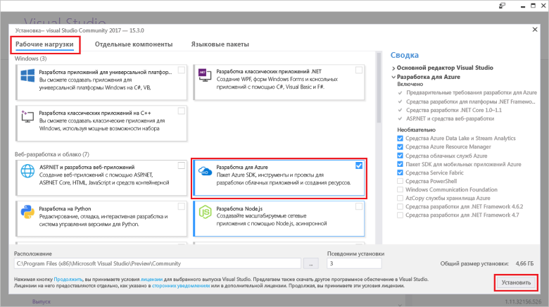

# <a name="azure-functions-tools-for-visual-studio"></a><span data-ttu-id="a3cf1-103">Инструменты Функций Azure для Visual Studio</span><span class="sxs-lookup"><span data-stu-id="a3cf1-103">Azure Functions Tools for Visual Studio</span></span>  

<span data-ttu-id="a3cf1-104">Средства Azure функции для Visual Studio 2017 г. — это расширение Visual Studio, которое позволяет разрабатывать, тестировать и развертывать tooAzure функции C#.</span><span class="sxs-lookup"><span data-stu-id="a3cf1-104">Azure Functions Tools for Visual Studio 2017 is an extension for Visual Studio that lets you develop, test, and deploy C# functions tooAzure.</span></span> <span data-ttu-id="a3cf1-105">Если это ваш первый опыт работы с Azure функции, Дополнительные сведения в [tooAzure введение функции](functions-overview.md).</span><span class="sxs-lookup"><span data-stu-id="a3cf1-105">If this is your first experience with Azure Functions, you can learn more at [An introduction tooAzure Functions](functions-overview.md).</span></span>

<span data-ttu-id="a3cf1-106">Hello функции средства Azure предоставляет hello следующие преимущества:</span><span class="sxs-lookup"><span data-stu-id="a3cf1-106">hello Azure Functions Tools provides hello following benefits:</span></span> 

* <span data-ttu-id="a3cf1-107">Создание, редактирование и выполнение функций на локальном компьютере для разработки.</span><span class="sxs-lookup"><span data-stu-id="a3cf1-107">Edit, build, and run functions on your local development computer.</span></span> 
* <span data-ttu-id="a3cf1-108">Публикация функций Azure непосредственно проект tooAzure.</span><span class="sxs-lookup"><span data-stu-id="a3cf1-108">Publish your Azure Functions project directly tooAzure.</span></span> 
* <span data-ttu-id="a3cf1-109">Используйте веб-задания атрибутов toodeclare функции привязки непосредственно в hello кода C# вместо обслуживание отдельных function.json для определений привязки.</span><span class="sxs-lookup"><span data-stu-id="a3cf1-109">Use WebJobs attributes toodeclare function bindings directly in hello C# code instead of maintaining a separate function.json for binding definitions.</span></span>
* <span data-ttu-id="a3cf1-110">Разработка и развертывание предварительно скомпилированных функций C#.</span><span class="sxs-lookup"><span data-stu-id="a3cf1-110">Develop and deploy pre-compiled C# functions.</span></span> <span data-ttu-id="a3cf1-111">Предварительно скомпилированные функции обеспечивают более высокую производительность при холодном запуске, чем функции C# на основе сценариев.</span><span class="sxs-lookup"><span data-stu-id="a3cf1-111">Pre-complied functions provide a better cold-start performance than C# script-based functions.</span></span> 
* <span data-ttu-id="a3cf1-112">Код функций в C#, имея все преимущества hello разработки Visual Studio.</span><span class="sxs-lookup"><span data-stu-id="a3cf1-112">Code your functions in C# while having all of hello benefits of Visual Studio development.</span></span> 

<span data-ttu-id="a3cf1-113">В этом разделе показано, как toouse hello функции средства Azure для Visual Studio 2017 г toodevelop функций в C#.</span><span class="sxs-lookup"><span data-stu-id="a3cf1-113">This topic shows you how toouse hello Azure Functions Tools for Visual Studio 2017 toodevelop your functions in C#.</span></span> <span data-ttu-id="a3cf1-114">Вы также узнаете, как toopublish tooAzure ваш проект как сборку .NET.</span><span class="sxs-lookup"><span data-stu-id="a3cf1-114">You also learn how toopublish your project tooAzure as a .NET assembly.</span></span>

## <a name="prerequisites"></a><span data-ttu-id="a3cf1-115">Предварительные требования</span><span class="sxs-lookup"><span data-stu-id="a3cf1-115">Prerequisites</span></span>

<span data-ttu-id="a3cf1-116">Инструменты Azure функции входит в рабочую нагрузку разработки Azure hello [Visual Studio 2017 г. версия 15,3](https://www.visualstudio.com/vs/), или более поздней версии.</span><span class="sxs-lookup"><span data-stu-id="a3cf1-116">Azure Functions Tools is included in hello Azure development workload of [Visual Studio 2017 version 15.3](https://www.visualstudio.com/vs/), or a later version.</span></span> <span data-ttu-id="a3cf1-117">Не забудьте поставить hello **разработки Azure** рабочей нагрузки в вашей установке версии 15,3 2017 г. Visual Studio:</span><span class="sxs-lookup"><span data-stu-id="a3cf1-117">Make sure you include hello **Azure development** workload in your Visual Studio 2017 version 15.3 installation:</span></span>



<span data-ttu-id="a3cf1-119">toocreate и развернуть функции, необходимо также:</span><span class="sxs-lookup"><span data-stu-id="a3cf1-119">toocreate and deploy functions, you also need:</span></span>

* <span data-ttu-id="a3cf1-120">Активная подписка Azure.</span><span class="sxs-lookup"><span data-stu-id="a3cf1-120">An active Azure subscription.</span></span> <span data-ttu-id="a3cf1-121">Если у вас нет подписки Azure, воспользуйтесь [бесплатными учетными записями](https://azure.microsoft.com/free/?WT.mc_id=A261C142F).</span><span class="sxs-lookup"><span data-stu-id="a3cf1-121">If you don't have an Azure subscription, [free accounts](https://azure.microsoft.com/free/?WT.mc_id=A261C142F) are available.</span></span>

* <span data-ttu-id="a3cf1-122">Учетная запись хранения Azure.</span><span class="sxs-lookup"><span data-stu-id="a3cf1-122">An Azure Storage account.</span></span> <span data-ttu-id="a3cf1-123">toocreate учетной записи хранения в разделе [создать учетную запись хранилища](../storage/common/storage-create-storage-account.md#create-a-storage-account).</span><span class="sxs-lookup"><span data-stu-id="a3cf1-123">toocreate a storage account, see [Create a storage account](../storage/common/storage-create-storage-account.md#create-a-storage-account).</span></span>  
## <a name="create-an-azure-functions-project"></a><span data-ttu-id="a3cf1-124">Создание проекта Функций Azure</span><span class="sxs-lookup"><span data-stu-id="a3cf1-124">Create an Azure Functions project</span></span> 

[!INCLUDE [Create a project using hello Azure Functions](../../includes/functions-vstools-create.md)]


## <a name="configure-hello-project-for-local-development"></a><span data-ttu-id="a3cf1-125">Настройка проекта hello для локальной разработки</span><span class="sxs-lookup"><span data-stu-id="a3cf1-125">Configure hello project for local development</span></span>

<span data-ttu-id="a3cf1-126">При создании нового проекта с помощью шаблона Azure функции hello, вы получаете пустой проект C#, содержащий hello следующие файлы:</span><span class="sxs-lookup"><span data-stu-id="a3cf1-126">When you create a new project using hello Azure Functions template, you get an empty C# project that contains hello following files:</span></span>

* <span data-ttu-id="a3cf1-127">**Host.JSON**: позволяет настроить hello узла функции.</span><span class="sxs-lookup"><span data-stu-id="a3cf1-127">**host.json**: Lets you configure hello Functions host.</span></span> <span data-ttu-id="a3cf1-128">Эти параметры применяются как в локальном режиме, так и в Azure.</span><span class="sxs-lookup"><span data-stu-id="a3cf1-128">These settings apply both when running locally and in Azure.</span></span> <span data-ttu-id="a3cf1-129">Дополнительные сведения см. в справочной статье о [host.json](https://github.com/Azure/azure-webjobs-sdk-script/wiki/host.json).</span><span class="sxs-lookup"><span data-stu-id="a3cf1-129">For more information, see [host.json](https://github.com/Azure/azure-webjobs-sdk-script/wiki/host.json) reference article.</span></span>
    
* <span data-ttu-id="a3cf1-130">**local.settings.json**: содержит параметры, используемые при выполнении функций локально.</span><span class="sxs-lookup"><span data-stu-id="a3cf1-130">**local.settings.json**: Maintains settings used when running functions locally.</span></span> <span data-ttu-id="a3cf1-131">Эти параметры не используются в Azure, они используются hello [основные инструменты Azure функции](functions-run-local.md).</span><span class="sxs-lookup"><span data-stu-id="a3cf1-131">These settings are not used by Azure, they are used by hello [Azure Functions Core Tools](functions-run-local.md).</span></span> <span data-ttu-id="a3cf1-132">Используйте этот файл toospecify параметры, такие как строки соединения tooother Azure службы.</span><span class="sxs-lookup"><span data-stu-id="a3cf1-132">Use this file toospecify settings, such as connection strings tooother Azure services.</span></span> <span data-ttu-id="a3cf1-133">Добавление нового ключа toohello **значения** массива для каждого соединения, необходимые для функции в проекте.</span><span class="sxs-lookup"><span data-stu-id="a3cf1-133">Add a new key toohello **Values** array for each connection required by functions in your project.</span></span> <span data-ttu-id="a3cf1-134">Дополнительные сведения см. в разделе [параметры локального файла](functions-run-local.md#local-settings-file) в разделе Основные инструменты Azure функции hello.</span><span class="sxs-lookup"><span data-stu-id="a3cf1-134">For more information, see [Local settings file](functions-run-local.md#local-settings-file) in hello Azure Functions Core Tools topic.</span></span>

<span data-ttu-id="a3cf1-135">Учетная запись хранилища Azure использует время выполнения функции Hello для внутренних целей.</span><span class="sxs-lookup"><span data-stu-id="a3cf1-135">hello Functions runtime uses an Azure Storage account internally.</span></span> <span data-ttu-id="a3cf1-136">Для всех инициировать типам, отличным от HTTP и веб-привязок, необходимо задать hello **Values.AzureWebJobsStorage** ключа tooa допустимую хранилища Azure строку подключения для учетной записи.</span><span class="sxs-lookup"><span data-stu-id="a3cf1-136">For all trigger types other than HTTP and webhooks, you must set hello **Values.AzureWebJobsStorage** key tooa valid Azure Storage account connection string.</span></span>

[!INCLUDE [Note toonot use local storage](../../includes/functions-local-settings-note.md)]

 <span data-ttu-id="a3cf1-137">Строка подключения учетной записи хранилища hello tooset:</span><span class="sxs-lookup"><span data-stu-id="a3cf1-137">tooset hello storage account connection string:</span></span>

1. <span data-ttu-id="a3cf1-138">В Visual Studio откройте **Cloud Explorer**, разверните **учетной записи хранилища** > **учетной записи хранения**, а затем выберите **свойства**и копирования hello **основной строка подключения** значение.</span><span class="sxs-lookup"><span data-stu-id="a3cf1-138">In Visual Studio, open **Cloud Explorer**, expand **Storage Account** > **Your Storage Account**, then select **Properties** and copy hello **Primary Connection String** value.</span></span>   

2. <span data-ttu-id="a3cf1-139">В проекте откройте файл проекта local.settings.json hello и задайте значение hello hello **AzureWebJobsStorage** toohello строку подключения, вы скопировали ключ.</span><span class="sxs-lookup"><span data-stu-id="a3cf1-139">In your project, open hello local.settings.json project file and set hello value of hello **AzureWebJobsStorage** key toohello connection string you copied.</span></span>

3. <span data-ttu-id="a3cf1-140">Повторите hello предыдущего шага tooadd уникальные ключи toohello **значения** массива для других соединений, необходимые для функций.</span><span class="sxs-lookup"><span data-stu-id="a3cf1-140">Repeat hello previous step tooadd unique keys toohello **Values** array for any other connections required by your functions.</span></span>  

## <a name="create-a-function"></a><span data-ttu-id="a3cf1-141">Создание функции</span><span class="sxs-lookup"><span data-stu-id="a3cf1-141">Create a function</span></span>

<span data-ttu-id="a3cf1-142">В предварительно скомпилированного функции hello привязки, используемые функцией hello определяются путем применения атрибутов в коде hello.</span><span class="sxs-lookup"><span data-stu-id="a3cf1-142">In pre-compiled functions, hello bindings used by hello function are defined by applying attributes in hello code.</span></span> <span data-ttu-id="a3cf1-143">При использовании функций на основе шаблонов, предоставляемых hello toocreate средства Azure функции hello эти атрибуты применяются автоматически.</span><span class="sxs-lookup"><span data-stu-id="a3cf1-143">When you use hello Azure Functions Tools toocreate your functions from hello provided templates, these attributes are applied for you.</span></span> 

1. <span data-ttu-id="a3cf1-144">Щелкните правой кнопкой мыши узел проекта в **обозревателе решений** и выберите **Добавить** > **Новый элемент**.</span><span class="sxs-lookup"><span data-stu-id="a3cf1-144">In **Solution Explorer**, right-click on your project node and select **Add** > **New Item**.</span></span> <span data-ttu-id="a3cf1-145">Выберите **функция Azure**, введите команду **имя** hello класса, а затем щелкните **добавить**.</span><span class="sxs-lookup"><span data-stu-id="a3cf1-145">Select **Azure Function**, type a **Name** for hello class, and click **Add**.</span></span>

2. <span data-ttu-id="a3cf1-146">Выберите код триггера, задать свойства привязки hello и нажмите кнопку **создать**.</span><span class="sxs-lookup"><span data-stu-id="a3cf1-146">Choose your trigger, set hello binding properties, and click **Create**.</span></span> <span data-ttu-id="a3cf1-147">Hello пример hello параметры при создании хранилища очередей активации функции.</span><span class="sxs-lookup"><span data-stu-id="a3cf1-147">hello following example shows hello settings when creating a Queue storage triggered function.</span></span> 

    
    
    <span data-ttu-id="a3cf1-148">Ключ строки подключения с именем **QueueStorage** предоставляется, которая определена в файле local.settings.json hello.</span><span class="sxs-lookup"><span data-stu-id="a3cf1-148">A connection string key named **QueueStorage** is supplied, which is defined in hello local.settings.json file.</span></span> 
 
3. <span data-ttu-id="a3cf1-149">Изучите hello добавления класса.</span><span class="sxs-lookup"><span data-stu-id="a3cf1-149">Examine hello newly added class.</span></span> <span data-ttu-id="a3cf1-150">Вы видите статический **запуска** методы, к которым имеет атрибут hello **FunctionName** атрибута.</span><span class="sxs-lookup"><span data-stu-id="a3cf1-150">You see a static **Run** method, that is attributed with hello **FunctionName** attribute.</span></span> <span data-ttu-id="a3cf1-151">Этот атрибут указывает на то, что метод hello hello точки входа для функции hello.</span><span class="sxs-lookup"><span data-stu-id="a3cf1-151">This attribute indicates that hello method is hello entry point for hello function.</span></span> 

    <span data-ttu-id="a3cf1-152">Например hello следующий класс C# представляет основной функции хранения активации очереди:</span><span class="sxs-lookup"><span data-stu-id="a3cf1-152">For example, hello following C# class represents a basic Queue storage triggered function:</span></span>

    ````csharp
    using System;
    using Microsoft.Azure.WebJobs;
    using Microsoft.Azure.WebJobs.Host;
    
    namespace FunctionApp1
    {
        public static class Function1
        {
            [FunctionName("QueueTriggerCSharp")]        
            public static void Run([QueueTrigger("myqueue-items", Connection = "QueueStorage")]string myQueueItem, TraceWriter log)
            {
                log.Info($"C# Queue trigger function processed: {myQueueItem}");
            }
        }
    } 
    ````
 
    <span data-ttu-id="a3cf1-153">Привязки особый атрибут имеет метод точки входа toohello указан параметр примененных tooeach привязки.</span><span class="sxs-lookup"><span data-stu-id="a3cf1-153">A binding-specific attribute is applied tooeach binding parameter supplied toohello entry point method.</span></span> <span data-ttu-id="a3cf1-154">атрибут Hello принимает сведения о привязке hello в качестве параметров.</span><span class="sxs-lookup"><span data-stu-id="a3cf1-154">hello attribute takes hello binding information as parameters.</span></span> <span data-ttu-id="a3cf1-155">В предыдущем примере hello hello первый параметр имеет **QueueTrigger** применен атрибут, указывающий функцию активации очереди.</span><span class="sxs-lookup"><span data-stu-id="a3cf1-155">In hello previous example, hello first parameter has a **QueueTrigger** attribute applied, indicating queue triggered function.</span></span> <span data-ttu-id="a3cf1-156">Имя очереди Hello и имя параметра строки соединения, передаются как параметры.</span><span class="sxs-lookup"><span data-stu-id="a3cf1-156">hello queue name and connection string setting name are passed as parameters.</span></span>  

## <a name="testing-functions"></a><span data-ttu-id="a3cf1-157">Функции тестирования</span><span class="sxs-lookup"><span data-stu-id="a3cf1-157">Testing functions</span></span>

<span data-ttu-id="a3cf1-158">Основные инструменты службы Функции Azure позволяют запускать проекты функций Azure на локальном компьютере разработчика.</span><span class="sxs-lookup"><span data-stu-id="a3cf1-158">Azure Functions Core Tools lets you run Azure Functions project on your local development computer.</span></span> <span data-ttu-id="a3cf1-159">Все запрашиваемые tooinstall, эти средства hello первом запуске функции из Visual Studio.</span><span class="sxs-lookup"><span data-stu-id="a3cf1-159">You are prompted tooinstall these tools hello first time you start a function from Visual Studio.</span></span>  

<span data-ttu-id="a3cf1-160">tootest работу, нажмите клавишу F5.</span><span class="sxs-lookup"><span data-stu-id="a3cf1-160">tootest your function, press F5.</span></span> <span data-ttu-id="a3cf1-161">При необходимости принятия запроса hello из Visual Studio toodownload и установить средства основных функций Azure (CLI).</span><span class="sxs-lookup"><span data-stu-id="a3cf1-161">If prompted, accept hello request from Visual Studio toodownload and install Azure Functions Core (CLI) tools.</span></span>  <span data-ttu-id="a3cf1-162">Может также потребоваться tooenable исключение брандмауэра, чтобы средства hello можно обрабатывать HTTP-запросы.</span><span class="sxs-lookup"><span data-stu-id="a3cf1-162">You may also need tooenable a firewall exception so that hello tools can handle HTTP requests.</span></span>

<span data-ttu-id="a3cf1-163">С проектом hello под управлением можно проверить код как тестируется развернутой функции.</span><span class="sxs-lookup"><span data-stu-id="a3cf1-163">With hello project running, you can test your code as you would test deployed function.</span></span> <span data-ttu-id="a3cf1-164">Дополнительные сведения см. в статье [Методика тестирования кода с помощью Функций Azure](functions-test-a-function.md).</span><span class="sxs-lookup"><span data-stu-id="a3cf1-164">For more information, see [Strategies for testing your code in Azure Functions](functions-test-a-function.md).</span></span> <span data-ttu-id="a3cf1-165">При работе в режиме отладки точки останова срабатывают в Visual Studio должным образом.</span><span class="sxs-lookup"><span data-stu-id="a3cf1-165">When running in debug mode, breakpoints are hit in Visual Studio as expected.</span></span> 

<span data-ttu-id="a3cf1-166">Пример запуска функции tootest очереди, разделе hello [очередь запускается функция краткого руководства](functions-create-storage-queue-triggered-function.md#test-the-function).</span><span class="sxs-lookup"><span data-stu-id="a3cf1-166">For an example of how tootest a queue triggered function, see hello [queue triggered function quickstart tutorial](functions-create-storage-queue-triggered-function.md#test-the-function).</span></span>  

<span data-ttu-id="a3cf1-167">toolearn Подробнее об использовании hello Azure функции основные инструменты в разделе [кода и тестирования функций Azure локально](functions-run-local.md).</span><span class="sxs-lookup"><span data-stu-id="a3cf1-167">toolearn more about using hello Azure Functions Core Tools, see [Code and test Azure functions locally](functions-run-local.md).</span></span>

## <a name="publish-tooazure"></a><span data-ttu-id="a3cf1-168">Публикация tooAzure</span><span class="sxs-lookup"><span data-stu-id="a3cf1-168">Publish tooAzure</span></span>

[!INCLUDE [Publish hello project tooAzure](../../includes/functions-vstools-publish.md)]

>[!NOTE]  
><span data-ttu-id="a3cf1-169">Все параметры, которые вы добавили в hello local.settings.json необходимо также добавить toohello функции приложения в Azure.</span><span class="sxs-lookup"><span data-stu-id="a3cf1-169">Any settings you added in hello local.settings.json must be also added toohello function app in Azure.</span></span> <span data-ttu-id="a3cf1-170">Эти параметры не добавляются автоматически.</span><span class="sxs-lookup"><span data-stu-id="a3cf1-170">These settings are not added automatically.</span></span> <span data-ttu-id="a3cf1-171">Необходимые параметры tooyour функции приложения можно добавить одним из следующих способов:</span><span class="sxs-lookup"><span data-stu-id="a3cf1-171">You can add required settings tooyour function app in one of these ways:</span></span>
>
>* <span data-ttu-id="a3cf1-172">[Здравствуйте, с помощью портала Azure](functions-how-to-use-azure-function-app-settings.md#settings).</span><span class="sxs-lookup"><span data-stu-id="a3cf1-172">[Using hello Azure portal](functions-how-to-use-azure-function-app-settings.md#settings).</span></span>
>* <span data-ttu-id="a3cf1-173">[С помощью hello `--publish-local-settings` публикации параметр в hello основные инструменты Azure функции](functions-run-local.md#publish).</span><span class="sxs-lookup"><span data-stu-id="a3cf1-173">[Using hello `--publish-local-settings` publish option in hello Azure Functions Core Tools](functions-run-local.md#publish).</span></span>
>* <span data-ttu-id="a3cf1-174">[С помощью hello Azure CLI](/cli/azure/functionapp/config/appsettings#set).</span><span class="sxs-lookup"><span data-stu-id="a3cf1-174">[Using hello Azure CLI](/cli/azure/functionapp/config/appsettings#set).</span></span> 

## <a name="next-steps"></a><span data-ttu-id="a3cf1-175">Дальнейшие действия</span><span class="sxs-lookup"><span data-stu-id="a3cf1-175">Next steps</span></span>

<span data-ttu-id="a3cf1-176">Дополнительные сведения о функции инструменты Azure, см. в разделе hello разделе вопросы hello "Общие" [2017 г средств Visual Studio для функций Azure](https://blogs.msdn.microsoft.com/webdev/2017/05/10/azure-function-tools-for-visual-studio-2017/) записи блога.</span><span class="sxs-lookup"><span data-stu-id="a3cf1-176">For more information about Azure Functions Tools, see hello Common Questions section of hello [Visual Studio 2017 Tools for Azure Functions](https://blogs.msdn.microsoft.com/webdev/2017/05/10/azure-function-tools-for-visual-studio-2017/) blog post.</span></span>

<span data-ttu-id="a3cf1-177">toolearn Дополнительные сведения о средствах основные функции hello Azure, в разделе [кода и тестирования функций Azure локально](functions-run-local.md).</span><span class="sxs-lookup"><span data-stu-id="a3cf1-177">toolearn more about hello Azure Functions Core Tools, see [Code and test Azure functions locally](functions-run-local.md).</span></span>  
<span data-ttu-id="a3cf1-178">toolearn Дополнительные сведения о разработке функции как библиотеки классов .NET, в разделе [библиотеки классов с помощью .NET с помощью функций Azure](functions-dotnet-class-library.md).</span><span class="sxs-lookup"><span data-stu-id="a3cf1-178">toolearn more about developing functions as .NET class libraries, see [Using .NET class libraries with Azure Functions](functions-dotnet-class-library.md).</span></span> <span data-ttu-id="a3cf1-179">В этом разделе также приведены примеры как атрибуты toodeclare toouse hello различные типы привязок, поддерживаемых функций Azure.</span><span class="sxs-lookup"><span data-stu-id="a3cf1-179">This topic also provides examples of how toouse attributes toodeclare hello various types of bindings supported by Azure Functions.</span></span>    
