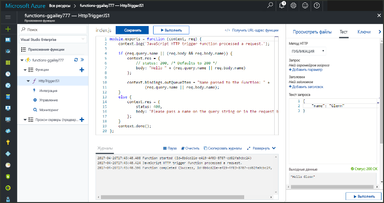
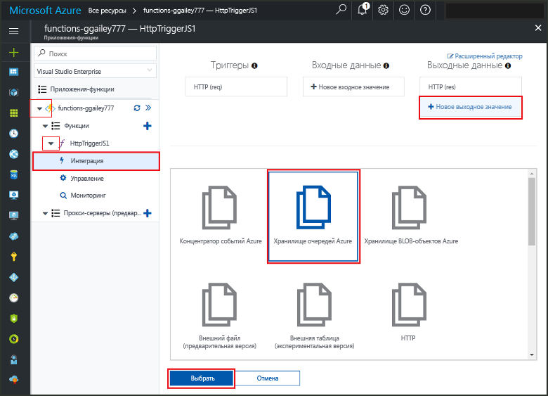
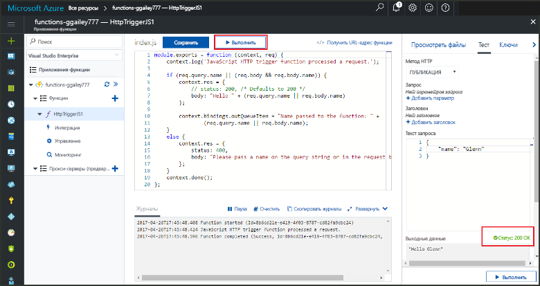
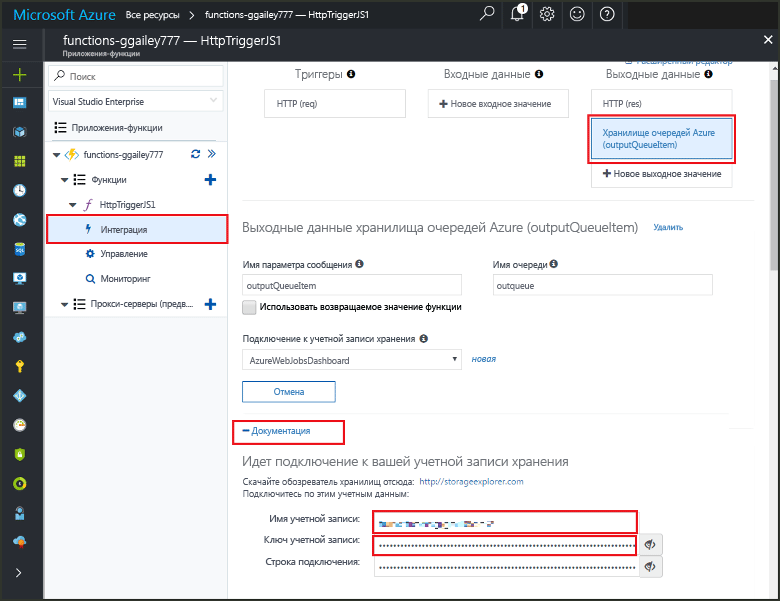

# <a name="add-messages-tooan-azure-storage-queue-using-functions"></a><span data-ttu-id="71722-103">Добавление очереди хранилища Azure tooan сообщения, с помощью функции</span><span class="sxs-lookup"><span data-stu-id="71722-103">Add messages tooan Azure Storage queue using Functions</span></span>

<span data-ttu-id="71722-104">В функциях Azure привязки ввода-вывода предоставляют декларативным способом tooconnect tooexternal данные службы при помощи функции.</span><span class="sxs-lookup"><span data-stu-id="71722-104">In Azure Functions, input and output bindings provide a declarative way tooconnect tooexternal service data from your function.</span></span> <span data-ttu-id="71722-105">В этом разделе рассказано, как tooupdate существующую функцию, добавив выход привязки, которая отправляет сообщения tooAzure очереди хранилища.</span><span class="sxs-lookup"><span data-stu-id="71722-105">In this topic, learn how tooupdate an existing function by adding an output binding that sends messages tooAzure Queue storage.</span></span>  



## <a name="prerequisites"></a><span data-ttu-id="71722-107">Предварительные требования</span><span class="sxs-lookup"><span data-stu-id="71722-107">Prerequisites</span></span> 

[!INCLUDE [Previous topics](../../includes/functions-quickstart-previous-topics.md)]

* <span data-ttu-id="71722-108">Установка hello [Microsoft Azure Storage Explorer](http://storageexplorer.com/).</span><span class="sxs-lookup"><span data-stu-id="71722-108">Install hello [Microsoft Azure Storage Explorer](http://storageexplorer.com/).</span></span>

## <span data-ttu-id="71722-109"><a name="add-binding"></a>Добавление выходной привязки</span><span class="sxs-lookup"><span data-stu-id="71722-109"><a name="add-binding"></a>Add an output binding</span></span>
 
1. <span data-ttu-id="71722-110">Разверните ваше приложение-функцию и функцию.</span><span class="sxs-lookup"><span data-stu-id="71722-110">Expand both your function app and your function.</span></span>

2. <span data-ttu-id="71722-111">Выберите **Интегрировать** и **+Новые выходные данные**, а затем выберите **Хранилище очередей Azure** и **Выбрать**.</span><span class="sxs-lookup"><span data-stu-id="71722-111">Select **Integrate** and **+ New output**, then choose **Azure Queue storage** and choose **Select**.</span></span>
    
    

3. <span data-ttu-id="71722-113">Используйте параметры hello, как указано в таблице hello:</span><span class="sxs-lookup"><span data-stu-id="71722-113">Use hello settings as specified in hello table:</span></span> 

    

    | <span data-ttu-id="71722-115">Настройка</span><span class="sxs-lookup"><span data-stu-id="71722-115">Setting</span></span>      |  <span data-ttu-id="71722-116">Рекомендуемое значение</span><span class="sxs-lookup"><span data-stu-id="71722-116">Suggested value</span></span>   | <span data-ttu-id="71722-117">Описание</span><span class="sxs-lookup"><span data-stu-id="71722-117">Description</span></span>                              |
    | ------------ |  ------- | -------------------------------------------------- |
    | <span data-ttu-id="71722-118">**Имя очереди**</span><span class="sxs-lookup"><span data-stu-id="71722-118">**Queue name**</span></span>   | <span data-ttu-id="71722-119">myqueue-items</span><span class="sxs-lookup"><span data-stu-id="71722-119">myqueue-items</span></span>    | <span data-ttu-id="71722-120">Имя Hello hello очереди tooconnect tooin вашей учетной записи хранилища.</span><span class="sxs-lookup"><span data-stu-id="71722-120">hello name of hello queue tooconnect tooin your Storage account.</span></span> |
    | <span data-ttu-id="71722-121">**Подключение к учетной записи хранения**</span><span class="sxs-lookup"><span data-stu-id="71722-121">**Storage account connection**</span></span> | <span data-ttu-id="71722-122">AzureWebJobStorage</span><span class="sxs-lookup"><span data-stu-id="71722-122">AzureWebJobStorage</span></span> | <span data-ttu-id="71722-123">Можно использовать уже используется приложением функции подключения к учетной записи хранилища hello или создайте новую.</span><span class="sxs-lookup"><span data-stu-id="71722-123">You can use hello storage account connection already being used by your function app, or create a new one.</span></span>  |
    | <span data-ttu-id="71722-124">**Имя параметра сообщения**</span><span class="sxs-lookup"><span data-stu-id="71722-124">**Message parameter name**</span></span> | <span data-ttu-id="71722-125">outputQueueItem</span><span class="sxs-lookup"><span data-stu-id="71722-125">outputQueueItem</span></span> | <span data-ttu-id="71722-126">Имя Hello hello выходной параметр привязки.</span><span class="sxs-lookup"><span data-stu-id="71722-126">hello name of hello output binding parameter.</span></span> | 

4. <span data-ttu-id="71722-127">Нажмите кнопку **Сохранить** tooadd hello привязки.</span><span class="sxs-lookup"><span data-stu-id="71722-127">Click **Save** tooadd hello binding.</span></span>
 
<span data-ttu-id="71722-128">Теперь, когда выходные данные привязки, определенной необходима tooupdate toouse кода hello hello привязки tooa сообщения tooadd очередь.</span><span class="sxs-lookup"><span data-stu-id="71722-128">Now that you have an output binding defined, you need tooupdate hello code toouse hello binding tooadd messages tooa queue.</span></span>  

## <a name="update-hello-function-code"></a><span data-ttu-id="71722-129">Изменения кода hello</span><span class="sxs-lookup"><span data-stu-id="71722-129">Update hello function code</span></span>

1. <span data-ttu-id="71722-130">Выберите код функции hello toodisplay функции в редакторе hello.</span><span class="sxs-lookup"><span data-stu-id="71722-130">Select your function toodisplay hello function code in hello editor.</span></span> 

2. <span data-ttu-id="71722-131">Для функции C#, обновите определение функции следующим образом: tooadd hello **outputQueueItem** параметр привязки хранилища.</span><span class="sxs-lookup"><span data-stu-id="71722-131">For a C# function, update your function definition as follows tooadd hello **outputQueueItem** storage binding parameter.</span></span> <span data-ttu-id="71722-132">Пропустите этот шаг для функции JavaScript.</span><span class="sxs-lookup"><span data-stu-id="71722-132">Skip this step for a JavaScript function.</span></span>

    ```cs   
    public static async Task<HttpResponseMessage> Run(HttpRequestMessage req, 
        ICollector<string> outputQueueItem, TraceWriter log)
    {
        ....
    }
    ```

3. <span data-ttu-id="71722-133">Добавьте следующие функции toohello кода непосредственно перед методом hello hello.</span><span class="sxs-lookup"><span data-stu-id="71722-133">Add hello following code toohello function just before hello method returns.</span></span> <span data-ttu-id="71722-134">Используйте соответствующий фрагмент hello для языка hello этой функции.</span><span class="sxs-lookup"><span data-stu-id="71722-134">Use hello appropriate snippet for hello language of your function.</span></span>

    ```javascript
    context.bindings.outputQueueItem = "Name passed toohello function: " + 
                (req.query.name || req.body.name);
    ```

    ```cs
    outputQueueItem.Add("Name passed toohello function: " + name);     
    ```

4. <span data-ttu-id="71722-135">Выберите **Сохранить** toosave изменений.</span><span class="sxs-lookup"><span data-stu-id="71722-135">Select **Save** toosave changes.</span></span>

<span data-ttu-id="71722-136">Hello значению, переданному в toohello HTTP триггер включается в добавленных toohello очереди сообщений.</span><span class="sxs-lookup"><span data-stu-id="71722-136">hello value passed toohello HTTP trigger is included in a message added toohello queue.</span></span>
 
## <a name="test-hello-function"></a><span data-ttu-id="71722-137">Проверка функции hello</span><span class="sxs-lookup"><span data-stu-id="71722-137">Test hello function</span></span> 

1. <span data-ttu-id="71722-138">После сохранения изменений кода hello выберите **запуска**.</span><span class="sxs-lookup"><span data-stu-id="71722-138">After hello code changes are saved, select **Run**.</span></span> 

    

2. <span data-ttu-id="71722-140">Проверьте функции hello успешно toomake журналы hello.</span><span class="sxs-lookup"><span data-stu-id="71722-140">Check hello logs toomake sure that hello function succeeded.</span></span> <span data-ttu-id="71722-141">Новая очередь с именем **outqueue** по функции среды выполнения, когда привязка для вывода hello сначала используется hello создается в вашей учетной записи хранилища.</span><span class="sxs-lookup"><span data-stu-id="71722-141">A new queue named **outqueue** is created in your Storage account by hello Functions runtime when hello output binding is first used.</span></span>

<span data-ttu-id="71722-142">Затем можно подключить приветственное сообщение, что вы добавили tooit и tooyour хранилища учетной записи tooverify hello новая очередь.</span><span class="sxs-lookup"><span data-stu-id="71722-142">Next, you can connect tooyour storage account tooverify hello new queue and hello message you added tooit.</span></span> 

## <a name="connect-toohello-queue"></a><span data-ttu-id="71722-143">Подключение toohello очереди</span><span class="sxs-lookup"><span data-stu-id="71722-143">Connect toohello queue</span></span>

<span data-ttu-id="71722-144">Пропустить hello первых трех шагов, если вы уже установили обозреватель хранилищ и соединения его tooyour учетной записи хранилища.</span><span class="sxs-lookup"><span data-stu-id="71722-144">Skip hello first three steps if you have already installed Storage Explorer and connected it tooyour storage account.</span></span>    

1. <span data-ttu-id="71722-145">В функции, выберите **Интеграция** и новый hello **хранилища очередей Azure** выходной привязки, а затем разверните **документации**.</span><span class="sxs-lookup"><span data-stu-id="71722-145">In your function, choose **Integrate** and hello new **Azure Queue storage** output binding, then expand **Documentation**.</span></span> <span data-ttu-id="71722-146">Скопируйте **имя учетной записи** и **ключ учетной записи**.</span><span class="sxs-lookup"><span data-stu-id="71722-146">Copy both **Account name** and **Account key**.</span></span> <span data-ttu-id="71722-147">Можно использовать учетную запись хранения tooconnect toohello эти учетные данные.</span><span class="sxs-lookup"><span data-stu-id="71722-147">You use these credentials tooconnect toohello storage account.</span></span>
 
    

2. <span data-ttu-id="71722-149">Запустите hello [обозреватель хранилищ Microsoft Azure](http://storageexplorer.com/) средство, выберите hello значок слева hello подключения, выберите **использовать имя учетной записи хранения и ключ**и выберите **Далее**.</span><span class="sxs-lookup"><span data-stu-id="71722-149">Run hello [Microsoft Azure Storage Explorer](http://storageexplorer.com/) tool, select hello connect icon on hello left, choose **Use a storage account name and key**, and select **Next**.</span></span>

    
    
3. <span data-ttu-id="71722-151">Вставить hello **имя учетной записи** и **ключ учетной записи** из шага 1 в их соответствующие поля, а затем выберите **Далее**, и **Connect**.</span><span class="sxs-lookup"><span data-stu-id="71722-151">Paste hello **Account name** and **Account key** from step 1 into their corresponding fields, then select **Next**, and **Connect**.</span></span> 
  
    

4. <span data-ttu-id="71722-153">Разверните узлы hello присоединенного учетной записи хранилища, **очереди** и убедитесь, что очередь с именем **myqueue элементы** существует.</span><span class="sxs-lookup"><span data-stu-id="71722-153">Expand hello attached storage account, expand **Queues** and verify that a queue named **myqueue-items** exists.</span></span> <span data-ttu-id="71722-154">Вы также увидите сообщение уже находится в очереди hello.</span><span class="sxs-lookup"><span data-stu-id="71722-154">You should also see a message already in hello queue.</span></span>  
 
    
 

## <a name="clean-up-resources"></a><span data-ttu-id="71722-156">Очистка ресурсов</span><span class="sxs-lookup"><span data-stu-id="71722-156">Clean up resources</span></span>

[!INCLUDE [Next steps note](../../includes/functions-quickstart-cleanup.md)]

## <a name="next-steps"></a><span data-ttu-id="71722-157">Дальнейшие действия</span><span class="sxs-lookup"><span data-stu-id="71722-157">Next steps</span></span>

<span data-ttu-id="71722-158">Вы добавили существующей функции tooan выходные данные привязки.</span><span class="sxs-lookup"><span data-stu-id="71722-158">You have added an output binding tooan existing function.</span></span> 

[!INCLUDE [Next steps note](../../includes/functions-quickstart-next-steps.md)]

<span data-ttu-id="71722-159">Дополнительные сведения о хранении tooQueue привязки см. в разделе [привязки очереди хранилища Azure функции](functions-bindings-storage-queue.md).</span><span class="sxs-lookup"><span data-stu-id="71722-159">For more information about binding tooQueue storage, see [Azure Functions Storage queue bindings](functions-bindings-storage-queue.md).</span></span> 


