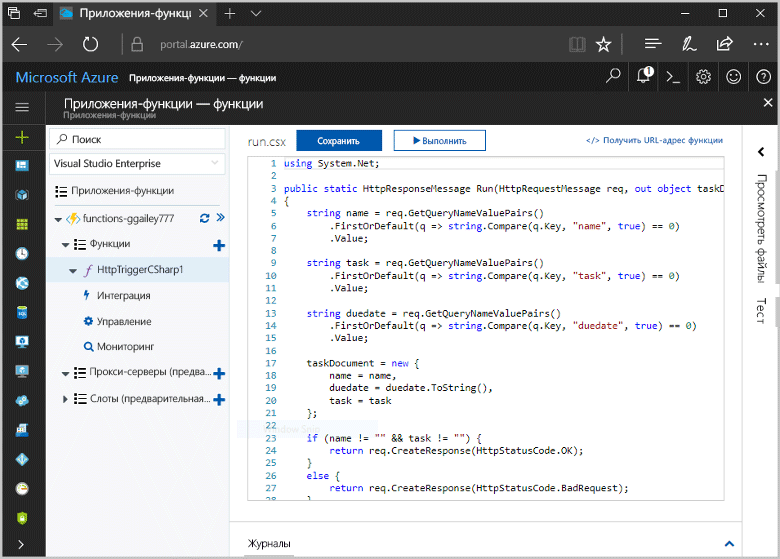
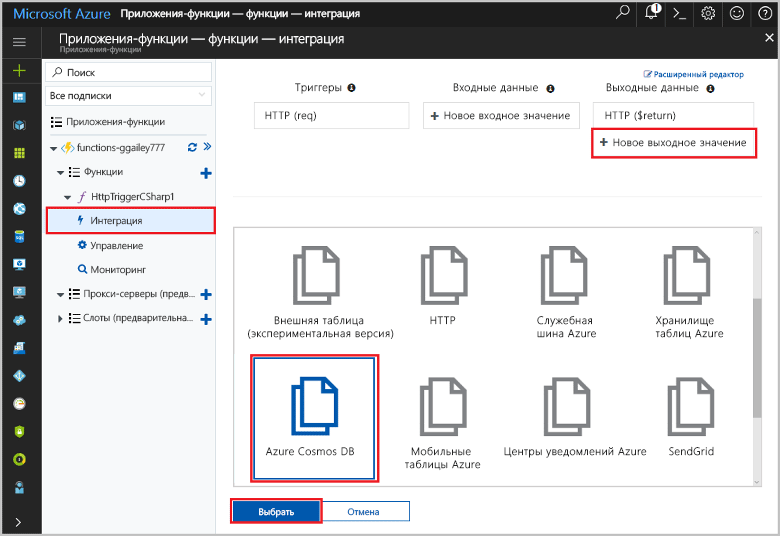
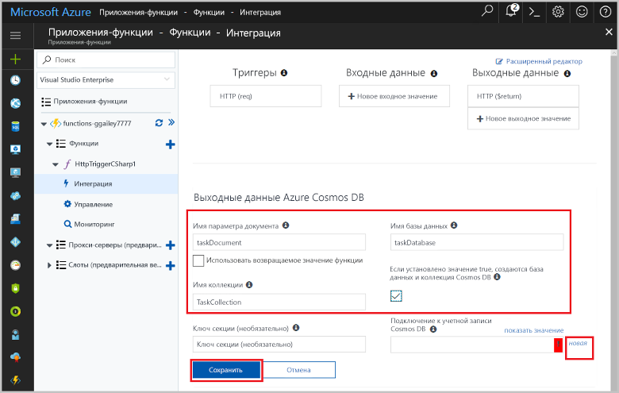
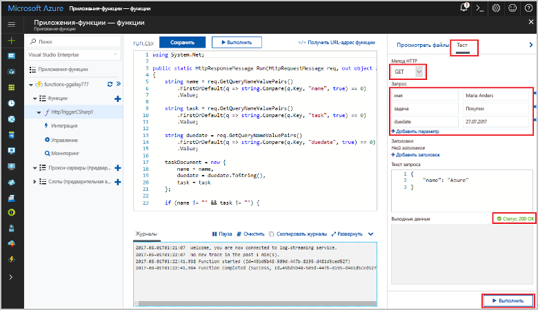
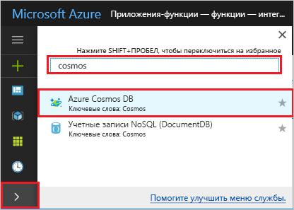
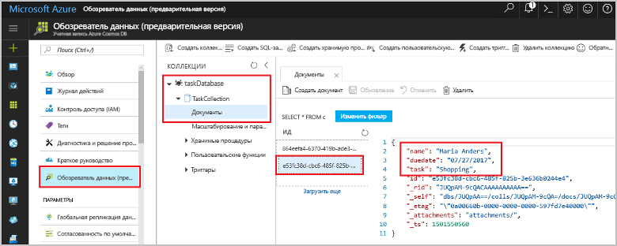

# <a name="store-unstructured-data-using-azure-functions-and-cosmos-db"></a><span data-ttu-id="b2171-104">Хранение неструктурированных данных с помощью служб Функции Azure и Cosmos DB</span><span class="sxs-lookup"><span data-stu-id="b2171-104">Store unstructured data using Azure Functions and Cosmos DB</span></span>

<span data-ttu-id="b2171-105">[Azure Cosmos DB](https://azure.microsoft.com/services/cosmos-db/) — это отличный способ toostore неструктурированных и данных JSON.</span><span class="sxs-lookup"><span data-stu-id="b2171-105">[Azure Cosmos DB](https://azure.microsoft.com/services/cosmos-db/) is a great way toostore unstructured and JSON data.</span></span> <span data-ttu-id="b2171-106">В сочетании с функциями Azure Cosmos DB позволяет быстро и просто сохранять данные, используя код гораздо меньшего объема, чем требуется для хранения данных в реляционной базе данных.</span><span class="sxs-lookup"><span data-stu-id="b2171-106">Combined with Azure Functions, Cosmos DB makes storing data quick and easy with much less code than required for storing data in a relational database.</span></span>

<span data-ttu-id="b2171-107">В функциях Azure привязки ввода-вывода предоставляют декларативным способом tooconnect tooexternal данные службы при помощи функции.</span><span class="sxs-lookup"><span data-stu-id="b2171-107">In Azure Functions, input and output bindings provide a declarative way tooconnect tooexternal service data from your function.</span></span> <span data-ttu-id="b2171-108">В этом разделе рассказано, как tooupdate существующие C# функции tooadd привязку выходных данных, которая хранит неструктурированные данные в документе Cosmos DB.</span><span class="sxs-lookup"><span data-stu-id="b2171-108">In this topic, learn how tooupdate an existing C# function tooadd an output binding that stores unstructured data in a Cosmos DB document.</span></span> 



## <a name="prerequisites"></a><span data-ttu-id="b2171-110">Предварительные требования</span><span class="sxs-lookup"><span data-stu-id="b2171-110">Prerequisites</span></span>

<span data-ttu-id="b2171-111">toocomplete этого учебника:</span><span class="sxs-lookup"><span data-stu-id="b2171-111">toocomplete this tutorial:</span></span>

[!INCLUDE [Previous quickstart note](../../includes/functions-quickstart-previous-topics.md)]

## <a name="add-an-output-binding"></a><span data-ttu-id="b2171-112">Добавление выходной привязки</span><span class="sxs-lookup"><span data-stu-id="b2171-112">Add an output binding</span></span>

1. <span data-ttu-id="b2171-113">Разверните ваше приложение-функцию и функцию.</span><span class="sxs-lookup"><span data-stu-id="b2171-113">Expand both your function app and your function.</span></span>

1. <span data-ttu-id="b2171-114">Выберите **Интеграция** и **+ новый Выход**, который находится на hello верхнем правом углу страницы приветствия.</span><span class="sxs-lookup"><span data-stu-id="b2171-114">Select **Integrate** and **+ New Output**, which is at hello top right of hello page.</span></span> <span data-ttu-id="b2171-115">Выберите **Azure Cosmos DB** и щелкните **Выбрать**.</span><span class="sxs-lookup"><span data-stu-id="b2171-115">Choose **Azure Cosmos DB**, and click **Select**.</span></span>

    

3. <span data-ttu-id="b2171-117">Используйте hello **вывод Azure Cosmos DB** параметры, как указано в таблице hello:</span><span class="sxs-lookup"><span data-stu-id="b2171-117">Use hello **Azure Cosmos DB output** settings as specified in hello table:</span></span> 

    

    | <span data-ttu-id="b2171-119">Настройка</span><span class="sxs-lookup"><span data-stu-id="b2171-119">Setting</span></span>      | <span data-ttu-id="b2171-120">Рекомендуемое значение</span><span class="sxs-lookup"><span data-stu-id="b2171-120">Suggested value</span></span>  | <span data-ttu-id="b2171-121">Описание</span><span class="sxs-lookup"><span data-stu-id="b2171-121">Description</span></span>                                |
    | ------------ | ---------------- | ------------------------------------------ |
    | <span data-ttu-id="b2171-122">**Имя параметра документа**</span><span class="sxs-lookup"><span data-stu-id="b2171-122">**Document parameter name**</span></span> | <span data-ttu-id="b2171-123">taskDocument</span><span class="sxs-lookup"><span data-stu-id="b2171-123">taskDocument</span></span> | <span data-ttu-id="b2171-124">Имя, которое ссылается объект Cosmos DB toohello в коде.</span><span class="sxs-lookup"><span data-stu-id="b2171-124">Name that refers toohello Cosmos DB object in code.</span></span> |
    | <span data-ttu-id="b2171-125">**Database name** (Имя базы данных)</span><span class="sxs-lookup"><span data-stu-id="b2171-125">**Database name**</span></span> | <span data-ttu-id="b2171-126">taskDatabase</span><span class="sxs-lookup"><span data-stu-id="b2171-126">taskDatabase</span></span> | <span data-ttu-id="b2171-127">Имя базы данных toosave документов.</span><span class="sxs-lookup"><span data-stu-id="b2171-127">Name of database toosave documents.</span></span> |
    | <span data-ttu-id="b2171-128">**Имя коллекции**</span><span class="sxs-lookup"><span data-stu-id="b2171-128">**Collection name**</span></span> | <span data-ttu-id="b2171-129">TaskCollection</span><span class="sxs-lookup"><span data-stu-id="b2171-129">TaskCollection</span></span> | <span data-ttu-id="b2171-130">Имя коллекции баз данных Cosmos DB.</span><span class="sxs-lookup"><span data-stu-id="b2171-130">Name of collection of Cosmos DB databases.</span></span> |
    | <span data-ttu-id="b2171-131">**Если значение равно true, создается база данных Cosmos DB hello и коллекции**</span><span class="sxs-lookup"><span data-stu-id="b2171-131">**If true, creates hello Cosmos DB database and collection**</span></span> | <span data-ttu-id="b2171-132">Флажок установлен</span><span class="sxs-lookup"><span data-stu-id="b2171-132">Checked</span></span> | <span data-ttu-id="b2171-133">Hello коллекции не существует, поэтому следует создать его.</span><span class="sxs-lookup"><span data-stu-id="b2171-133">hello collection doesn't already exist, so create it.</span></span> |

4. <span data-ttu-id="b2171-134">Выберите **New** Далее toohello **подключение документа Cosmos DB** метки и выберите **+ создать новый**.</span><span class="sxs-lookup"><span data-stu-id="b2171-134">Select **New** next toohello **Cosmos DB document connection** label, and select **+ Create new**.</span></span> 

5. <span data-ttu-id="b2171-135">Используйте hello **новой учетной записи** параметры, как указано в таблице hello:</span><span class="sxs-lookup"><span data-stu-id="b2171-135">Use hello **New account** settings as specified in hello table:</span></span> 

    

    | <span data-ttu-id="b2171-137">Настройка</span><span class="sxs-lookup"><span data-stu-id="b2171-137">Setting</span></span>      | <span data-ttu-id="b2171-138">Рекомендуемое значение</span><span class="sxs-lookup"><span data-stu-id="b2171-138">Suggested value</span></span>  | <span data-ttu-id="b2171-139">Описание</span><span class="sxs-lookup"><span data-stu-id="b2171-139">Description</span></span>                                |
    | ------------ | ---------------- | ------------------------------------------ |
    | <span data-ttu-id="b2171-140">**Идентификатор**</span><span class="sxs-lookup"><span data-stu-id="b2171-140">**ID**</span></span> | <span data-ttu-id="b2171-141">Имя базы данных</span><span class="sxs-lookup"><span data-stu-id="b2171-141">Name of database</span></span> | <span data-ttu-id="b2171-142">Уникальный идентификатор для базы данных Cosmos DB hello</span><span class="sxs-lookup"><span data-stu-id="b2171-142">Unique ID for hello Cosmos DB database</span></span>  |
    | <span data-ttu-id="b2171-143">**API**</span><span class="sxs-lookup"><span data-stu-id="b2171-143">**API**</span></span> | <span data-ttu-id="b2171-144">SQL (DocumentDB)</span><span class="sxs-lookup"><span data-stu-id="b2171-144">SQL (DocumentDB)</span></span> | <span data-ttu-id="b2171-145">Выберите hello API базы данных документа.</span><span class="sxs-lookup"><span data-stu-id="b2171-145">Select hello document database API.</span></span>  |
    | <span data-ttu-id="b2171-146">**Подписка**</span><span class="sxs-lookup"><span data-stu-id="b2171-146">**Subscription**</span></span> | <span data-ttu-id="b2171-147">Подписка Azure</span><span class="sxs-lookup"><span data-stu-id="b2171-147">Azure Subscription</span></span> | <span data-ttu-id="b2171-148">Подписка Azure</span><span class="sxs-lookup"><span data-stu-id="b2171-148">Azure Subscription</span></span>  |
    | <span data-ttu-id="b2171-149">**Группа ресурсов**</span><span class="sxs-lookup"><span data-stu-id="b2171-149">**Resource Group**</span></span> | <span data-ttu-id="b2171-150">myResourceGroup</span><span class="sxs-lookup"><span data-stu-id="b2171-150">myResourceGroup</span></span> |  <span data-ttu-id="b2171-151">Используйте hello существующую группу ресурсов, содержащий функции приложения.</span><span class="sxs-lookup"><span data-stu-id="b2171-151">Use hello existing resource group that contains your function app.</span></span> |
    | <span data-ttu-id="b2171-152">**Расположение**</span><span class="sxs-lookup"><span data-stu-id="b2171-152">**Location**</span></span>  | <span data-ttu-id="b2171-153">WestEurope</span><span class="sxs-lookup"><span data-stu-id="b2171-153">WestEurope</span></span> | <span data-ttu-id="b2171-154">Выберите местоположение рядом tooeither функция приложением или tooother приложений, использующих hello хранятся документы.</span><span class="sxs-lookup"><span data-stu-id="b2171-154">Select a location near tooeither your function app or tooother apps that use hello stored documents.</span></span>  |

6. <span data-ttu-id="b2171-155">Нажмите кнопку **ОК** базы данных toocreate hello.</span><span class="sxs-lookup"><span data-stu-id="b2171-155">Click **OK** toocreate hello database.</span></span> <span data-ttu-id="b2171-156">Может потребоваться несколько баз данных hello toocreate минут.</span><span class="sxs-lookup"><span data-stu-id="b2171-156">It may take a few minutes toocreate hello database.</span></span> <span data-ttu-id="b2171-157">После создания базы данных hello hello строку подключения базы данных хранятся как параметр функции приложения.</span><span class="sxs-lookup"><span data-stu-id="b2171-157">After hello database is created, hello database connection string is stored as a function app setting.</span></span> <span data-ttu-id="b2171-158">Имя параметра приложения Hello вставляется в **подключения к учетной записи Cosmos DB**.</span><span class="sxs-lookup"><span data-stu-id="b2171-158">hello name of this app setting is inserted in **Cosmos DB account connection**.</span></span> 
 
8. <span data-ttu-id="b2171-159">Если задана строка соединения hello, выберите **Сохранить** toocreate hello привязки.</span><span class="sxs-lookup"><span data-stu-id="b2171-159">After hello connection string is set, select **Save** toocreate hello binding.</span></span>

## <a name="update-hello-function-code"></a><span data-ttu-id="b2171-160">Изменения кода hello</span><span class="sxs-lookup"><span data-stu-id="b2171-160">Update hello function code</span></span>

<span data-ttu-id="b2171-161">Замените hello существующий код C# функции hello, следующий код:</span><span class="sxs-lookup"><span data-stu-id="b2171-161">Replace hello existing C# function code with hello following code:</span></span>

```csharp
using System.Net;

public static HttpResponseMessage Run(HttpRequestMessage req, out object taskDocument, TraceWriter log)
{
    string name = req.GetQueryNameValuePairs()
        .FirstOrDefault(q => string.Compare(q.Key, "name", true) == 0)
        .Value;

    string task = req.GetQueryNameValuePairs()
        .FirstOrDefault(q => string.Compare(q.Key, "task", true) == 0)
        .Value;

    string duedate = req.GetQueryNameValuePairs()
        .FirstOrDefault(q => string.Compare(q.Key, "duedate", true) == 0)
        .Value;

    taskDocument = new {
        name = name,
        duedate = duedate.ToString(),
        task = task
    };

    if (name != "" && task != "") {
        return req.CreateResponse(HttpStatusCode.OK);
    }
    else {
        return req.CreateResponse(HttpStatusCode.BadRequest);
    }
}

```
<span data-ttu-id="b2171-162">Этот пример кода считывает строки запроса HTTP-запроса hello и назначает им toofields в hello `taskDocument` объекта.</span><span class="sxs-lookup"><span data-stu-id="b2171-162">This code sample reads hello HTTP Request query strings and assigns them toofields in hello `taskDocument` object.</span></span> <span data-ttu-id="b2171-163">Hello `taskDocument` привязки отправляет hello объекта данные из этой привязки параметра toobe, хранящихся в базе данных связанного документа hello.</span><span class="sxs-lookup"><span data-stu-id="b2171-163">hello `taskDocument` binding sends hello object data from this binding parameter toobe stored in hello bound document database.</span></span> <span data-ttu-id="b2171-164">Hello база данных создается в hello впервые запускается функции hello.</span><span class="sxs-lookup"><span data-stu-id="b2171-164">hello database is created hello first time hello function runs.</span></span>

## <a name="test-hello-function-and-database"></a><span data-ttu-id="b2171-165">Функции проверки hello и базы данных</span><span class="sxs-lookup"><span data-stu-id="b2171-165">Test hello function and database</span></span>

1. <span data-ttu-id="b2171-166">Разверните в правом окне hello и выберите **теста**.</span><span class="sxs-lookup"><span data-stu-id="b2171-166">Expand hello right window and select **Test**.</span></span> <span data-ttu-id="b2171-167">В разделе **запроса**, нажмите кнопку **+ добавить параметр** и добавьте следующие параметры строки запроса toohello hello:</span><span class="sxs-lookup"><span data-stu-id="b2171-167">Under **Query**, click **+ Add parameter** and add hello following parameters toohello query string:</span></span>

    + `name`
    + `task`
    + `duedate`

2. <span data-ttu-id="b2171-168">Щелкните **Выполнить**. Должно быть возвращено состояние 200.</span><span class="sxs-lookup"><span data-stu-id="b2171-168">Click **Run** and verify that a 200 status is returned.</span></span>

    

1. <span data-ttu-id="b2171-170">На hello слева от оператора hello портал Azure, разверните панель значков hello, тип `cosmos` в hello найдите и выберите **Azure Cosmos DB**.</span><span class="sxs-lookup"><span data-stu-id="b2171-170">On hello left side of hello Azure portal, expand hello icon bar, type `cosmos` in hello search field, and select **Azure Cosmos DB**.</span></span>

    

2. <span data-ttu-id="b2171-172">Выберите hello базы данных был создан, затем выберите **обозреватель данных**.</span><span class="sxs-lookup"><span data-stu-id="b2171-172">Select hello database you created, then select **Data Explorer**.</span></span> <span data-ttu-id="b2171-173">Разверните hello **коллекций** узлов, выберите новый документ hello и подтвердить hello документ содержит ваш значения строки запроса, а также некоторые дополнительные метаданные.</span><span class="sxs-lookup"><span data-stu-id="b2171-173">Expand hello **Collections** nodes, select hello new document, and confirm that hello document contains your query string values, along with some additional metadata.</span></span> 

    

<span data-ttu-id="b2171-175">Вы успешно добавили триггер HTTP tooyour привязки, который хранит неструктурированные данные в базе данных Cosmos DB.</span><span class="sxs-lookup"><span data-stu-id="b2171-175">You have successfully added a binding tooyour HTTP trigger that stores unstructured data in a Cosmos DB database.</span></span>

[!INCLUDE [Clean-up section](../../includes/clean-up-section-portal.md)]

## <a name="next-steps"></a><span data-ttu-id="b2171-176">Дальнейшие действия</span><span class="sxs-lookup"><span data-stu-id="b2171-176">Next steps</span></span>

[!INCLUDE [functions-quickstart-next-steps](../../includes/functions-quickstart-next-steps.md)]

<span data-ttu-id="b2171-177">Дополнительные сведения о базе данных Cosmos DB tooa привязки см. в разделе [Azure DB Cosmos функции привязки](functions-bindings-documentdb.md).</span><span class="sxs-lookup"><span data-stu-id="b2171-177">For more information about binding tooa Cosmos DB database, see [Azure Functions Cosmos DB bindings](functions-bindings-documentdb.md).</span></span>
