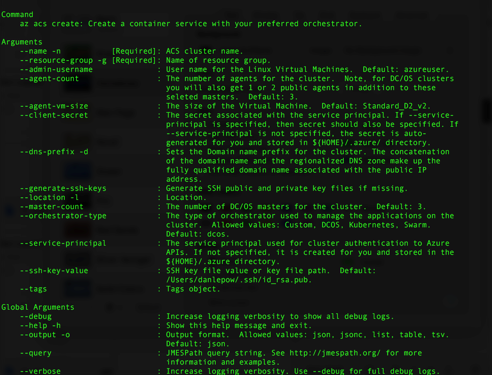

# <a name="deploy-a-docker-container-hosting-solution-using-the-azure-cli-20"></a><span data-ttu-id="95195-103">Развертывание решения для размещения контейнера Docker с помощью Azure CLI 2.0</span><span class="sxs-lookup"><span data-stu-id="95195-103">Deploy a Docker container hosting solution using the Azure CLI 2.0</span></span>

<span data-ttu-id="95195-104">Чтобы создать кластер и управлять им в Службе контейнеров Azure, используйте команды `az acs` в Azure CLI 2.0.</span><span class="sxs-lookup"><span data-stu-id="95195-104">Use the `az acs` commands in the Azure CLI 2.0 to create and manage clusters in Azure Container Service.</span></span> <span data-ttu-id="95195-105">Вы также можете развернуть кластер Службы контейнеров Azure с помощью [портала Azure](container-service-deployment.md) или с помощью интерфейсов API Службы контейнеров Azure.</span><span class="sxs-lookup"><span data-stu-id="95195-105">You can also deploy an Azure Container Service cluster by using the [Azure portal](container-service-deployment.md) or the Azure Container Service APIs.</span></span>

<span data-ttu-id="95195-106">Чтобы получить справку по командам `az acs`, добавьте параметр `-h` в любую команду.</span><span class="sxs-lookup"><span data-stu-id="95195-106">For help on `az acs` commands, pass the `-h` parameter to any command.</span></span> <span data-ttu-id="95195-107">Например, `az acs create -h`.</span><span class="sxs-lookup"><span data-stu-id="95195-107">For example: `az acs create -h`.</span></span>


## <a name="prerequisites"></a><span data-ttu-id="95195-108">Предварительные требования</span><span class="sxs-lookup"><span data-stu-id="95195-108">Prerequisites</span></span>
<span data-ttu-id="95195-109">Чтобы создать кластер Службы контейнеров Azure с помощью Azure CLI 2.0, необходимо следующее:</span><span class="sxs-lookup"><span data-stu-id="95195-109">To create an Azure Container Service cluster using the Azure CLI 2.0, you must:</span></span>
* <span data-ttu-id="95195-110">учетная запись Azure ([получите бесплатную пробную версию](https://azure.microsoft.com/pricing/free-trial/));</span><span class="sxs-lookup"><span data-stu-id="95195-110">have an Azure account ([get a free trial](https://azure.microsoft.com/pricing/free-trial/))</span></span>
* <span data-ttu-id="95195-111">установленный и настроенный [Azure CLI 2.0](/cli/azure/install-az-cli2).</span><span class="sxs-lookup"><span data-stu-id="95195-111">have installed and set up the [Azure CLI 2.0](/cli/azure/install-az-cli2)</span></span>

## <a name="get-started"></a><span data-ttu-id="95195-112">Начало работы</span><span class="sxs-lookup"><span data-stu-id="95195-112">Get started</span></span> 
### <a name="log-in-to-your-account"></a><span data-ttu-id="95195-113">Вход в учетную запись</span><span class="sxs-lookup"><span data-stu-id="95195-113">Log in to your account</span></span>
```azurecli
az login 
```

<span data-ttu-id="95195-114">Следуйте указаниям, чтобы выполнить вход в интерактивном режиме.</span><span class="sxs-lookup"><span data-stu-id="95195-114">Follow the prompts to log in interactively.</span></span> <span data-ttu-id="95195-115">Другие способы входа см. в статье [Get started with Azure CLI 2.0](/cli/azure/get-started-with-az-cli2) (Приступая к работе с Azure CLI 2.0).</span><span class="sxs-lookup"><span data-stu-id="95195-115">For other methods to log in, see [Get started with Azure CLI 2.0](/cli/azure/get-started-with-az-cli2).</span></span>

### <a name="set-your-azure-subscription"></a><span data-ttu-id="95195-116">Настройка подписки Azure</span><span class="sxs-lookup"><span data-stu-id="95195-116">Set your Azure subscription</span></span>

<span data-ttu-id="95195-117">При наличии нескольких подписок Azure укажите подписку по умолчанию.</span><span class="sxs-lookup"><span data-stu-id="95195-117">If you have more than one Azure subscription, set the default subscription.</span></span> <span data-ttu-id="95195-118">Например:</span><span class="sxs-lookup"><span data-stu-id="95195-118">For example:</span></span>

```
az account set --subscription "f66xxxxx-xxxx-xxxx-xxx-zgxxxx33cha5"
```


### <a name="create-a-resource-group"></a><span data-ttu-id="95195-119">Создание группы ресурсов</span><span class="sxs-lookup"><span data-stu-id="95195-119">Create a resource group</span></span>
<span data-ttu-id="95195-120">Мы рекомендуем создать группу ресурсов для каждого кластера.</span><span class="sxs-lookup"><span data-stu-id="95195-120">We recommend that you create a resource group for every cluster.</span></span> <span data-ttu-id="95195-121">Укажите регион Azure, в котором [доступна](https://azure.microsoft.com/en-us/regions/services/) Служба контейнеров Azure.</span><span class="sxs-lookup"><span data-stu-id="95195-121">Specify an Azure region in which Azure Container Service is [available](https://azure.microsoft.com/en-us/regions/services/).</span></span> <span data-ttu-id="95195-122">Например:</span><span class="sxs-lookup"><span data-stu-id="95195-122">For example:</span></span>

```azurecli
az group create -n acsrg1 -l "westus"
```
<span data-ttu-id="95195-123">Результат аналогичен приведенному ниже:</span><span class="sxs-lookup"><span data-stu-id="95195-123">Output is similar to the following:</span></span>


## <a name="create-an-azure-container-service-cluster"></a><span data-ttu-id="95195-125">Создание кластера Службы контейнеров Azure</span><span class="sxs-lookup"><span data-stu-id="95195-125">Create an Azure Container Service cluster</span></span>

<span data-ttu-id="95195-126">Чтобы создать кластер, используйте команду `az acs create`.</span><span class="sxs-lookup"><span data-stu-id="95195-126">To create a cluster, use `az acs create`.</span></span>
<span data-ttu-id="95195-127">Имя кластера и имя группы ресурсов, созданной на предыдущем шаге, являются обязательными.</span><span class="sxs-lookup"><span data-stu-id="95195-127">A name for the cluster and the name of the resource group created in the previous step are mandatory parameters.</span></span> 

<span data-ttu-id="95195-128">Для других входных данных устанавливаются значения по умолчанию (см. снимок экрана), если они не переопределены с помощью соответствующих параметров.</span><span class="sxs-lookup"><span data-stu-id="95195-128">Other inputs are set to default values (see the following screen) unless overwritten using their respective switches.</span></span> <span data-ttu-id="95195-129">Например, для orchestrator по умолчанию установлено значение DC/OS.</span><span class="sxs-lookup"><span data-stu-id="95195-129">For example, the orchestrator is set by default to DC/OS.</span></span> <span data-ttu-id="95195-130">Если префикс DNS-имени не указан, он будет создан на основе имени кластера.</span><span class="sxs-lookup"><span data-stu-id="95195-130">And if you don't specify one, a DNS name prefix is created based on the cluster name.</span></span>




### <a name="quick-acs-create-using-defaults"></a><span data-ttu-id="95195-132">Быстрое выполнение `acs create` с использованием значений по умолчанию</span><span class="sxs-lookup"><span data-stu-id="95195-132">Quick `acs create` using defaults</span></span>
<span data-ttu-id="95195-133">Если у вас есть файл открытого ключа RSA (SSH) `id_rsa.pub` в расположении по умолчанию (или вы его создали для [OS X и Linux](../../virtual-machines/linux/mac-create-ssh-keys.md) или [Windows](../../virtual-machines/linux/ssh-from-windows.md)), используйте приведенную ниже команду.</span><span class="sxs-lookup"><span data-stu-id="95195-133">If you have an SSH RSA public key file `id_rsa.pub` in the default location (or created one for [OS X and Linux](../../virtual-machines/linux/mac-create-ssh-keys.md) or [Windows](../../virtual-machines/linux/ssh-from-windows.md)), use a command like the following:</span></span>

```azurecli
az acs create -n acs-cluster -g acsrg1 -d applink789
```
<span data-ttu-id="95195-134">Если у вас нет открытого ключа SSH, используйте вторую команду.</span><span class="sxs-lookup"><span data-stu-id="95195-134">If you don't have an SSH public key, use this second command.</span></span> <span data-ttu-id="95195-135">Эта команда с переключателем `--generate-ssh-keys` создается автоматически.</span><span class="sxs-lookup"><span data-stu-id="95195-135">This command with the `--generate-ssh-keys` switch creates one for you.</span></span>

```azurecli
az acs create -n acs-cluster -g acsrg1 -d applink789 --generate-ssh-keys
```

<span data-ttu-id="95195-136">После введения команды подождите около 10 минут, пока будет создан кластер.</span><span class="sxs-lookup"><span data-stu-id="95195-136">After you enter the command, wait for about 10 minutes for the cluster to be created.</span></span> <span data-ttu-id="95195-137">Выходные данные команды содержат полные доменные имена (FQDN) главных узлов и узлов агентов и команду SSH для подключения к первому главному узлу.</span><span class="sxs-lookup"><span data-stu-id="95195-137">The command output includes fully qualified domain names (FQDNs) of the master and agent nodes and an SSH command to connect to the first master.</span></span> <span data-ttu-id="95195-138">Ниже приведены сокращенные выходные данные.</span><span class="sxs-lookup"><span data-stu-id="95195-138">Here is abbreviated output:</span></span>


> [!TIP]
> <span data-ttu-id="95195-140">В статье [Обработчик Службы контейнеров Microsoft Azure. Пошаговое руководство по использованию Kubernetes](../kubernetes/container-service-kubernetes-walkthrough.md) показано, как использовать `az acs create` со значениями по умолчанию для создания кластера Kubernetes.</span><span class="sxs-lookup"><span data-stu-id="95195-140">The [Kubernetes walkthrough](../kubernetes/container-service-kubernetes-walkthrough.md) shows how to use `az acs create` with default values to create a Kubernetes cluster.</span></span>
>

## <a name="manage-acs-clusters"></a><span data-ttu-id="95195-141">Управление кластерами ACS</span><span class="sxs-lookup"><span data-stu-id="95195-141">Manage ACS clusters</span></span>

<span data-ttu-id="95195-142">Для управления кластером используйте дополнительные команды `az acs`.</span><span class="sxs-lookup"><span data-stu-id="95195-142">Use additional `az acs` commands to manage your cluster.</span></span> <span data-ttu-id="95195-143">Ниже приведены некоторые примеры.</span><span class="sxs-lookup"><span data-stu-id="95195-143">Here are some examples.</span></span>

### <a name="list-clusters-under-a-subscription"></a><span data-ttu-id="95195-144">Получение списка кластеров в рамках подписки</span><span class="sxs-lookup"><span data-stu-id="95195-144">List clusters under a subscription</span></span>

```azurecli
az acs list --output table
```

### <a name="list-clusters-in-a-resource-group"></a><span data-ttu-id="95195-145">Получение списка кластеров в группе ресурсов</span><span class="sxs-lookup"><span data-stu-id="95195-145">List clusters in a resource group</span></span>

```azurecli
az acs list -g acsrg1 --output table
```


### <a name="display-details-of-a-container-service-cluster"></a><span data-ttu-id="95195-147">Отображение сведений о кластере службы контейнеров</span><span class="sxs-lookup"><span data-stu-id="95195-147">Display details of a container service cluster</span></span>

```azurecli
az acs show -g acsrg1 -n acs-cluster --output list
```


### <a name="scale-the-cluster"></a><span data-ttu-id="95195-149">Масштабирование кластера</span><span class="sxs-lookup"><span data-stu-id="95195-149">Scale the cluster</span></span>
<span data-ttu-id="95195-150">Увеличение и уменьшение масштабирования узлов агента разрешено.</span><span class="sxs-lookup"><span data-stu-id="95195-150">Both scaling in and scaling out of agent nodes are allowed.</span></span> <span data-ttu-id="95195-151">Параметр `new-agent-count` представляет собой новое количество агентов в кластере ACS.</span><span class="sxs-lookup"><span data-stu-id="95195-151">The parameter `new-agent-count` is the new number of agents in the ACS cluster.</span></span>

```azurecli
az acs scale -g acsrg1 -n acs-cluster --new-agent-count 4
```


## <a name="delete-a-container-service-cluster"></a><span data-ttu-id="95195-153">Удаление кластера службы контейнеров</span><span class="sxs-lookup"><span data-stu-id="95195-153">Delete a container service cluster</span></span>
```azurecli
az acs delete -g acsrg1 -n acs-cluster 
```
<span data-ttu-id="95195-154">Эта команда не удаляет все ресурсы (сеть и хранилище), созданные вместе со службой контейнеров.</span><span class="sxs-lookup"><span data-stu-id="95195-154">This command does not delete all resources (network and storage) created while creating the container service.</span></span> <span data-ttu-id="95195-155">Чтобы легко удалить все ресурсы, рекомендуется развертывать каждый кластер в отдельной группе ресурсов.</span><span class="sxs-lookup"><span data-stu-id="95195-155">To delete all resources easily, it is recommended you deploy each cluster in a distinct resource group.</span></span> <span data-ttu-id="95195-156">Если кластер больше не используется, группу ресурсов можно удалить.</span><span class="sxs-lookup"><span data-stu-id="95195-156">Then, delete the resource group when the cluster is no longer required.</span></span>

## <a name="next-steps"></a><span data-ttu-id="95195-157">Дальнейшие действия</span><span class="sxs-lookup"><span data-stu-id="95195-157">Next steps</span></span>
<span data-ttu-id="95195-158">Теперь, когда у вас есть работающий кластер, выберите ссылки ниже, чтобы узнать о возможностях подключения и управления.</span><span class="sxs-lookup"><span data-stu-id="95195-158">Now that you have a functioning cluster, see these documents for connection and management details:</span></span>

* [<span data-ttu-id="95195-159">Подключение к кластеру службы контейнеров Azure</span><span class="sxs-lookup"><span data-stu-id="95195-159">Connect to an Azure Container Service cluster</span></span>](../container-service-connect.md)
* [<span data-ttu-id="95195-160">Работа со службой контейнеров Azure и DC/OS</span><span class="sxs-lookup"><span data-stu-id="95195-160">Work with Azure Container Service and DC/OS</span></span>](container-service-mesos-marathon-rest.md)
* [<span data-ttu-id="95195-161">Работа со службой контейнеров Azure и Docker Swarm</span><span class="sxs-lookup"><span data-stu-id="95195-161">Work with Azure Container Service and Docker Swarm</span></span>](container-service-docker-swarm.md)
* [<span data-ttu-id="95195-162">Работа со службой контейнеров Azure и Kubernetes</span><span class="sxs-lookup"><span data-stu-id="95195-162">Work with Azure Container Service and Kubernetes</span></span>](../kubernetes/container-service-kubernetes-walkthrough.md)