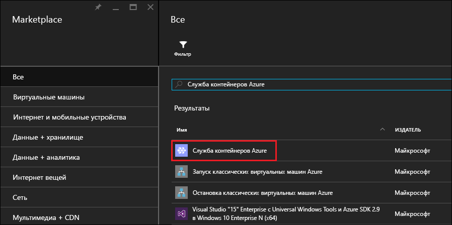
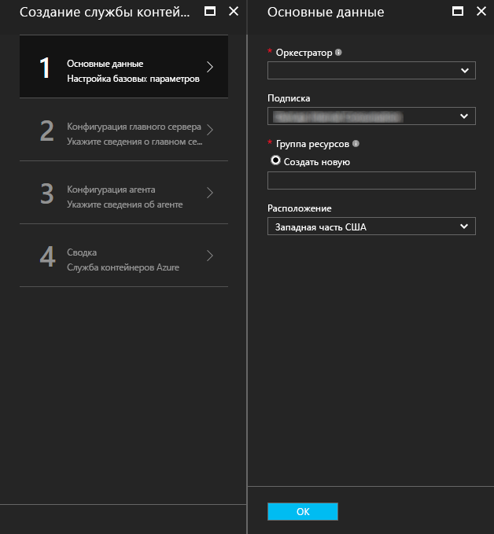
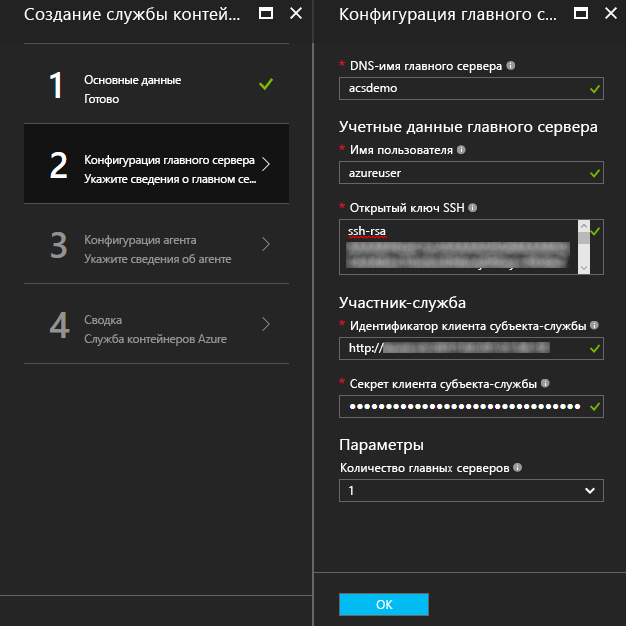
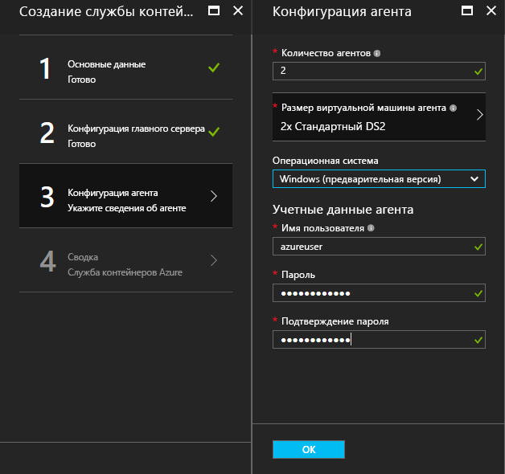
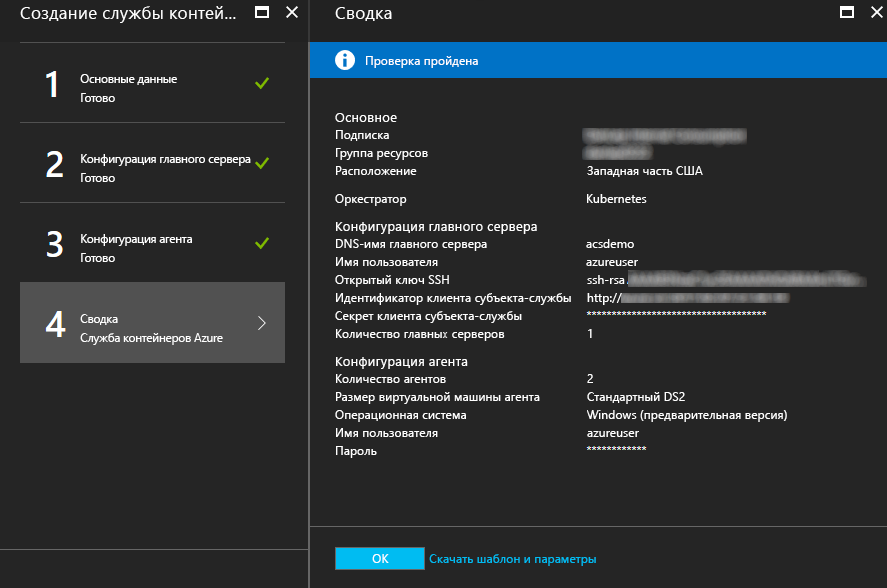
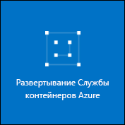

# <a name="deploy-a-docker-container-hosting-solution-using-hello-azure-portal"></a>Развертывания с помощью портала Azure hello решения по размещению контейнера Docker


Служба контейнеров Azure предусматривает быстрое развертывание популярных решений с открытым кодом для кластеризации и оркестрации контейнеров. В этом документе описывается развертывание кластера службы контейнера Azure с помощью портала Azure hello или шаблоном краткого руководства диспетчера ресурсов Azure. 

Можно также развернуть кластер контейнера службы Azure с помощью hello [Azure CLI 2.0](container-service-create-acs-cluster-cli.md) или hello API-интерфейсы службы контейнера Azure.

Чтобы изучить общие положения, ознакомьтесь с разделом [Общие сведения о службе контейнеров Azure](../container-service-intro.md).


## <a name="prerequisites"></a>Предварительные требования

* **Подписка Azure.** Если у вас ее нет, зарегистрируйтесь, чтобы [воспользоваться бесплатной пробной версией](http://azure.microsoft.com/pricing/free-trial/?WT.mc_id=AA4C1C935). Для более крупных кластеров можно использовать подписку с оплатой по мере использования или другие варианты приобретения.

    > [!NOTE]
    > Использование вашей подписки Azure и [квоты ресурсов](../../azure-subscription-service-limits.md), такие как квоты ядер, можно ограничить размер hello развертывания кластера hello. Увеличение квоты, откройте toorequest [запрос на получение поддержки сети клиента](../../azure-supportability/how-to-create-azure-support-request.md) бесплатно.
    >

* **Открытый ключ SSH-RSA**: требуется при развертывании через портал hello или один из шаблонов hello Azure краткое руководство, tooprovide hello открытый ключ для проверки подлинности Azure контейнера службы виртуальных машин. ключи RSA Secure Shell (SSH) toocreate, в разделе hello [OS X и Linux](../../virtual-machines/linux/mac-create-ssh-keys.md) или [Windows](../../virtual-machines/linux/ssh-from-windows.md) рекомендации. 

* **Идентификатор участника клиента и секрет службы** (Kubernetes): Дополнительные сведения и рекомендации toocreate участника-службы Azure Active Directory, см. [о hello участника-службы для кластера Kubernetes](../kubernetes/container-service-kubernetes-service-principal.md).


## <a name="create-a-cluster-by-using-hello-azure-portal"></a>Создание кластера с помощью портала Azure hello
1. Выберите вход toohello портал Azure **New**и hello Azure Marketplace для поиска **контейнера службы Azure**.

      <br />

2. Выберите **Служба контейнеров Azure** и щелкните **Создать**.

3. На hello **основы** колонке введите hello следующую информацию:

    * **Orchestrator**: выберите один из toodeploy orchestrators контейнера hello в кластере hello.
        * **DC/OS** — развертывает кластер DC/OS.
        * **Swarm** — развертывает кластер Docker Swarm.
        * **Kubernetes** — развертывает кластер Kubernetes.
    * **Подписка**— выберите подписку Azure.
    * **Группа ресурсов**: Введите hello имя группы ресурсов для развертывания hello.
    * **Расположение**: Выберите регион Azure для развертывания службы Azure контейнера hello. Проверьте [доступность продуктов по регионам](https://azure.microsoft.com/regions/services/).
    
      <br />
    
    Нажмите кнопку **ОК** когда вы будете готовы tooproceed.

4. На hello **главный конфигурации** колонки, введите следующие параметры для hello Linux главный узел или узлы в кластере hello (некоторые параметры, определенные tooeach orchestrator) hello:

    * **Основной DNS-имя**: hello префикс, используемый toocreate уникальное полное доменное имя (FQDN) для базы данных master hello. Hello master полное доменное имя имеет вид hello *префикс*управления*расположение*. cloudapp.azure.com.
    * **Имя пользователя**: hello имя пользователя для учетной записи для всех виртуальных машин Linux hello в кластере hello.
    * **Открытый ключ SSH-RSA**: добавление ключа toobe с общей hello используемых для проверки подлинности виртуальных машин Linux hello. Очень важно, что этот раздел содержит без разрывов строки, а также hello `ssh-rsa` префикс. Hello `username@domain` постфиксная является необязательным. Hello ключ должен выглядеть примерно hello следующим образом: **AAAAB3Nz ssh-rsa... <>...... UcyupgH azureuser@linuxvm** . 
    * **Участника-службы**: Если вы выбрали hello Kubernetes orchestrator, введите Azure Active Directory **идентификатор участника клиент службы** (также называемые hello appId) и **основной секретный службы** (пароль). Дополнительные сведения см. в разделе [о hello участника-службы для кластера Kubernetes](../kubernetes/container-service-kubernetes-service-principal.md).
    * **Главный счетчик**: hello число образцов в кластере hello.
    * **Диагностика виртуальных Машин**: для некоторых orchestrators можно включить диагностику виртуальных Машин в hello образцов.

      <br />

    Нажмите кнопку **ОК** когда вы будете готовы tooproceed.

5. На hello **конфигурация агента** колонке введите hello следующую информацию:

    * **Количество агентов**: для Docker группу мелких объектов и Kubernetes, это значение равно hello начальное количество агентов в наборе масштабирования агент hello. Для контроллера домена/OS это hello начальное количество агентов в наборе масштабирования закрытый. Кроме того, для DC/OS создается общедоступный масштабируемый набор с заранее определенным количеством агентов. Hello количество агентов в этот набор общих шкалы определяется hello число образцов в кластере hello: один открытый агент для одной базы данных master и два общих агентов для три или пять образцов.
    * **Размер виртуальной машины агента**: hello размер hello агент виртуальных машин.
    * **Операционная система**: этот параметр в настоящее время доступен только в том случае, если вы выбрали hello Kubernetes orchestrator. Выберите ОС Linux или toorun операционной системы Windows Server на агентах hello. Этот параметр определяет, может ли кластер запускать приложения-контейнеры Windows или Linux. 

        > [!NOTE]
        > Поддержка контейнера Windows для кластеров Kubernetes находится на этапе предварительной версии. Для кластеров DC/OS и Swarm в настоящее время поддерживаются только агенты Linux в Службе контейнеров Azure.

    * **Учетные данные агента**: Если вы выбрали операционной системы Windows hello, введите администратор **имя пользователя** и **пароль** hello агента ВМ. 

      <br />

    Нажмите кнопку **ОК** когда вы будете готовы tooproceed.

6. Когда проверка службы завершится, нажмите кнопку **ОК**.

      <br />

7. Просмотреть условия hello. процесс развертывания toostart hello, нажмите кнопку **создать**.

    Если выбрана toopin hello развертывания toohello портал Azure, можно просмотреть состояние развертывания hello.

      <br />

Hello развертывания занимает несколько минут toocomplete. Затем кластер hello Azure контейнера службы будет готов к использованию.


## <a name="create-a-cluster-by-using-a-quickstart-template"></a>Создание кластера с помощью шаблона быстрого запуска
Быстрый запуск Azure шаблоны, доступные toodeploy кластера в службе контейнера Azure. Hello при условии, что примеры использования шаблоны могут быть измененный tooinclude дополнительные или расширенные конфигурации Azure. toocreate кластер контейнера службы Azure с помощью шаблона Azure краткое руководство, требуется подписка Azure. Если у вас ее нет, зарегистрируйтесь, чтобы [воспользоваться бесплатной пробной версией](http://azure.microsoft.com/pricing/free-trial/?WT.mc_id=AA4C1C935). 

Выполните эти шаги toodeploy кластера, с помощью шаблона и hello Azure CLI 2.0 (в разделе [инструкции по установке и настройке](/cli/azure/install-az-cli2)).

> [!NOTE] 
> Если вы в системе Windows, можно использовать аналогичные действия toodeploy шаблона с помощью Azure PowerShell. Инструкции см. далее в этом разделе. Можно также развернуть шаблон через hello [портала](../../azure-resource-manager/resource-group-template-deploy-portal.md) или других методов.

1. toodeploy DC/OS помощью Docker Swarm и Kubernetes кластера, выберите один из шаблонов доступные примеры использования hello из GitHub. Ниже приведен неполный список шаблонов. Hello DC/OS и шаблонов группу мелких объектов являются hello же, за исключением выбора orchestrator по умолчанию hello.

    * [Шаблон DC/OS](https://github.com/Azure/azure-quickstart-templates/tree/master/101-acs-dcos).
    * [шаблон Swarm](https://github.com/Azure/azure-quickstart-templates/tree/master/101-acs-swarm);
    * [Шаблон Kubernetes](https://github.com/Azure/azure-quickstart-templates/tree/master/101-acs-kubernetes).

2. Войдите в учетную запись Azure tooyour (`az login`) и убедитесь, что hello Azure CLI tooyour подключенных подписка Azure. Подписка по умолчанию hello можно просмотреть с помощью hello следующую команду:

    ```azurecli
    az account show
    ```
    
    При наличии более одной подписки и необходимость tooset подписки по умолчанию выполнить `az account set --subscription` и укажите идентификатор подписки hello или имя.

3. Рекомендуется используйте новую группу ресурсов для развертывания hello. использовать toocreate группу ресурсов hello `az group create` команда указывает имя группы ресурсов и расположение: 

    ```azurecli
    az group create --name "RESOURCE_GROUP" --location "LOCATION"
    ```

4. Шаблон JSON файла содержащего hello необходимые параметры. Загрузите hello параметры файл с именем `azuredeploy.parameters.json` , сопровождающее шаблона службы контейнера Azure hello `azuredeploy.json` в GitHub. Введите необходимые значения параметров кластера. 

    Например, hello toouse [шаблона DC/OS](https://github.com/Azure/azure-quickstart-templates/tree/master/101-acs-dcos), укажите значения параметров для `dnsNamePrefix` и `sshRSAPublicKey`. В разделе описания hello в `azuredeploy.json` и параметры для других параметров.  
 

5. Создание контейнера службы кластера, передав файл параметров развертывания hello с hello следующую команду, где:

    * **RESOURCE_GROUP** — имя группы ресурсов hello, созданную в предыдущем шаге hello hello.
    * **DEPLOYMENT_NAME** (необязательно) — это имя, вы предоставляете toohello развертывания.
    * **TEMPLATE_URI** hello расположения файла развертывания hello `azuredeploy.json`. Этот URI должен быть Необработанный файл hello, указатель toohello GitHub пользовательского интерфейса. toofind этот URI выберите hello `azuredeploy.json` на GitHub и нажмите кнопку hello **Raw** кнопки.  

    ```azurecli
    az group deployment create -g RESOURCE_GROUP -n DEPLOYMENT_NAME --template-uri TEMPLATE_URI --parameters @azuredeploy.parameters.json
    ```

    Можно также предоставляют параметры, как строку формата JSON в командной строке hello. Используйте следующие команды аналогичные toohello:

    ```azurecli
    az group deployment create -g RESOURCE_GROUP -n DEPLOYMENT_NAME --template-uri TEMPLATE_URI --parameters "{ \"param1\": {\"value1\"} … }"
    ```

    > [!NOTE]
    > Hello развертывания занимает несколько минут toocomplete.
    > 

### <a name="equivalent-powershell-commands"></a>Аналогичные команды PowerShell
Шаблон кластера Службы контейнеров Azure также можно развернуть с помощью PowerShell. В этом документе основана на hello версии 1.0 [модуля Azure PowerShell](https://azure.microsoft.com/blog/azps-1-0/).

1. toodeploy DC/OS помощью Docker Swarm и Kubernetes кластера, выберите один из шаблонов доступные примеры использования hello из GitHub. Ниже приведен неполный список шаблонов. Обратите внимание, что hello DC/OS и шаблонов группу мелких объектов являются hello таким же, за исключением hello выбора orchestrator по умолчанию hello.

    * [Шаблон DC/OS](https://github.com/Azure/azure-quickstart-templates/tree/master/101-acs-dcos).
    * [шаблон Swarm](https://github.com/Azure/azure-quickstart-templates/tree/master/101-acs-swarm);
    * [Шаблон Kubernetes](https://github.com/Azure/azure-quickstart-templates/tree/master/101-acs-kubernetes).

2. Перед созданием кластера в вашей подписке Azure, убедитесь, что сеанс PowerShell подписанный в tooAzure. Это можно сделать с помощью hello `Get-AzureRMSubscription` команды:

    ```powershell
    Get-AzureRmSubscription
    ```

3. Если требуется toosign в tooAzure использовать hello `Login-AzureRMAccount` команды:

    ```powershell
    Login-AzureRmAccount
    ```

4. Рекомендуется используйте новую группу ресурсов для развертывания hello. использовать toocreate группу ресурсов hello `New-AzureRmResourceGroup` команду и укажите регион имени и места назначения группы ресурсов:

    ```powershell
    New-AzureRmResourceGroup -Name GROUP_NAME -Location REGION
    ```

5. После создания группы ресурсов, можно создать кластер с hello следующую команду. Hello URI hello требуемого указан шаблон с hello `-TemplateUri` параметра. При выполнении этой команды в PowerShell отобразится запрос на ввод значений параметров развертывания.

    ```powershell
    New-AzureRmResourceGroupDeployment -Name DEPLOYMENT_NAME -ResourceGroupName RESOURCE_GROUP_NAME -TemplateUri TEMPLATE_URI
    ```

#### <a name="provide-template-parameters"></a>Выбор параметров шаблона
Если вы знакомы с помощью PowerShell, вы знаете, что циклического перемещения между hello доступные параметры командлета, введите знак минус (-) и нажав клавишу TAB hello. Точно так же это работает с параметрами, которые вы определили в шаблоне. Сразу после ввода имени шаблона hello hello командлет выбирает шаблон hello, выполняет синтаксический анализ параметров hello и динамически добавляет команды toohello параметры шаблона hello. Это делает значения параметров шаблона легко toospecify hello. И, если вы забыли требуемое значение параметра, PowerShell запрашивает значение hello.

Ниже приведен полный команда hello с параметрами, которые включены. Укажите собственные значения для hello имена ресурсов hello.

```powershell
New-AzureRmResourceGroupDeployment -ResourceGroupName RESOURCE_GROUP_NAME-TemplateURI TEMPLATE_URI -adminuser value1 -adminpassword value2 ....
```

## <a name="next-steps"></a>Дальнейшие действия
Теперь, когда у вас есть работающий кластер, выберите ссылки ниже, чтобы узнать о возможностях подключения и управления.

* [Подключите кластер tooan контейнера службы Azure](../container-service-connect.md)
* [Работа со службой контейнеров Azure и DC/OS](container-service-mesos-marathon-rest.md)
* [Работа со службой контейнеров Azure и Docker Swarm](container-service-docker-swarm.md)
* [Работа со службой контейнеров Azure и Kubernetes](../kubernetes/container-service-kubernetes-walkthrough.md)
