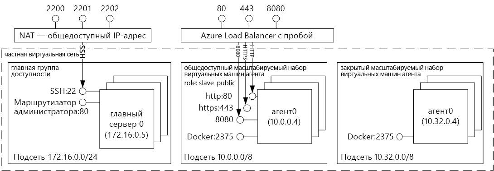
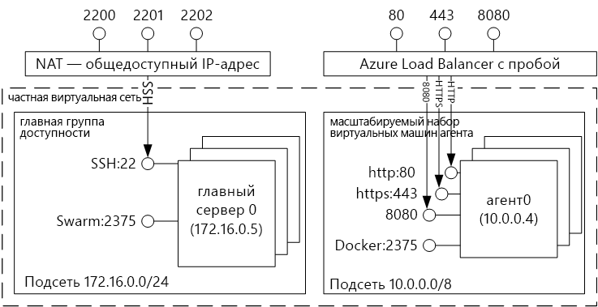
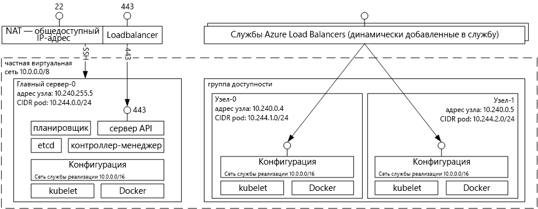

# Общие сведения о решениях для размещения контейнера Docker с помощью службы контейнеров AzureIntroduction to Docker container hosting solutions with Azure Container Service 
Служба контейнеров Azure позволяет упростить создание и настройку кластера виртуальных машин, настроенных для запуска контейнерных приложений, а также управление такими машинами.Azure Container Service makes it simpler for you to create, configure, and manage a cluster of virtual machines that are preconfigured to run containerized applications. Используется оптимизированная конфигурация популярных средств планирования и оркестрации с открытым исходным кодом.It uses an optimized configuration of popular open-source scheduling and orchestration tools. Это позволяет использовать имеющиеся навыки либо положиться на опыт обширного и постоянно увеличивающегося сообщества при развертывании приложений на основе контейнера в Microsoft Azure и управлении ими.This enables you to use your existing skills, or draw upon a large and growing body of community expertise, to deploy and manage container-based applications on Microsoft Azure.

Служба контейнеров Azure использует формат контейнера Docker, чтобы обеспечить полную переносимость контейнеров приложения.Azure Container Service leverages the Docker container format to ensure that your application containers are fully portable. Она также поддерживает Marathon и DC/OS, Docker Swarm и Kubernetes, позволяя масштабировать эти приложения до тысяч и даже десятков тысяч контейнеров.It also supports your choice of Marathon and DC/OS, Docker Swarm, or Kubernetes so that you can scale these applications to thousands of containers, or even tens of thousands.

Служба контейнеров Azure позволяет воспользоваться преимуществами функций корпоративного уровня в Azure, сохранив при этом переносимость приложений, в том числе на уровнях оркестрации.By using Azure Container Service, you can take advantage of the enterprise-grade features of Azure, while still maintaining application portability--including portability at the orchestration layers.

## Использование службы контейнеров AzureUsing Azure Container Service
Цель, которой мы стремимся достичь с помощью службы контейнеров Azure, заключается в том, чтобы предоставить среду для размещения контейнеров, применяя средства и технологии с открытым исходным кодом, которые сейчас пользуются популярностью среди наших клиентов.Our goal with Azure Container Service is to provide a container hosting environment by using open-source tools and technologies that are popular among our customers today. Для этого мы предоставляем стандартные конечные точки API для выбранного вами оркестратора (DC/OS, Docker Swarm или Kubernetes).To this end, we expose the standard API endpoints for your chosen orchestrator (DC/OS, Docker Swarm, or Kubernetes). С помощью этих конечных точек можно использовать любое программное обеспечение, способное взаимодействовать с ними.By using these endpoints, you can leverage any software that is capable of talking to those endpoints. Например, в случае конечной точки Docker Swarm можно использовать интерфейс командной строки (CLI) Docker.For example, in the case of the Docker Swarm endpoint, you might choose to use the Docker command-line interface (CLI). Для DC/OS можно выбрать интерфейс командной строки DCOS.For DC/OS, you might choose the DCOS CLI. Для Kubernetes можно выбрать `kubectl`.For Kubernetes, you might choose `kubectl`.

## Создание кластера Docker с помощью службы контейнеров AzureCreating a Docker cluster by using Azure Container Service
Чтобы приступить к работе со Службой контейнеров Azure, разверните кластер Службы контейнеров Azure с помощью портала (выполните в Marketplace поиск по словам **Служба контейнеров Azure**), воспользовавшись шаблоном Azure Resource Manager ([Docker Swarm](https://github.com/Azure/azure-quickstart-templates/tree/master/101-acs-swarm), [DC/OS](https://github.com/Azure/azure-quickstart-templates/tree/master/101-acs-dcos) или [Kubernetes](https://github.com/Azure/azure-quickstart-templates/tree/master/101-acs-kubernetes)) или [Azure CLI 2.0](container-service-create-acs-cluster-cli.md).To begin using Azure Container Service, you deploy an Azure Container Service cluster via the portal (search the Marketplace for **Azure Container Service**), by using an Azure Resource Manager template ([Docker Swarm](https://github.com/Azure/azure-quickstart-templates/tree/master/101-acs-swarm), [DC/OS](https://github.com/Azure/azure-quickstart-templates/tree/master/101-acs-dcos), or [Kubernetes](https://github.com/Azure/azure-quickstart-templates/tree/master/101-acs-kubernetes)), or with the [Azure CLI 2.0](container-service-create-acs-cluster-cli.md). Предоставляемые шаблоны быстрого запуска можно изменять, включив дополнительную или расширенную конфигурацию Azure.The provided quickstart templates can be modified to include additional or advanced Azure configuration. Дополнительные сведения см. в статье [Развертывание кластера службы контейнеров Azure](container-service-deployment.md).For more information, see [Deploy an Azure Container Service cluster](container-service-deployment.md).

## Развертывание приложенияDeploying an application
Служба контейнеров Azure позволяет выбрать для оркестрации Docker Swarm, DC/OS или Kubernetes.Azure Container Service provides a choice of Docker Swarm, DC/OS, or Kubernetes for orchestration. Способ развертывания приложения зависит от выбранного оркестратора.How you deploy your application depends on your choice of orchestrator.

### Использование DC/OSUsing DC/OS
DC/OS — это распределенная операционная система на базе ядра распределенных систем Apache Mesos.DC/OS is a distributed operating system based on the Apache Mesos distributed systems kernel. Apache Mesos принадлежит Apache Software Foundation. Среди пользователей и соавторов этой системы — [известные в ИТ-отрасли компании](http://mesos.apache.org/documentation/latest/powered-by-mesos/).Apache Mesos is housed at the Apache Software Foundation and lists some of the [biggest names in IT](http://mesos.apache.org/documentation/latest/powered-by-mesos/) as users and contributors.

В DC/OS и Apache Mesos доступны впечатляющие функции.DC/OS and Apache Mesos include an impressive feature set:

* Надежная масштабируемостьProven scalability
* Отказоустойчивые, реплицируемые главная и подчиненные системы на базе Apache ZooKeeperFault-tolerant replicated master and slaves using Apache ZooKeeper
* Поддержка контейнеров в формате DockerSupport for Docker-formatted containers
* Собственная изоляция между задачами с помощью контейнеров LinuxNative isolation between tasks with Linux containers
* Планирование множественных ресурсов (память, ЦП, диск и порты)Multiresource scheduling (memory, CPU, disk, and ports)
* API-интерфейсы Java, Python и C++ для разработки новых параллельных приложенийJava, Python, and C++ APIs for developing new parallel applications
* Веб-интерфейс для просмотра состояния кластераA web UI for viewing cluster state

По умолчанию ОС DC/OS, работающая в службе контейнеров Azure, включает платформу оркестрации Marathon для планирования рабочих нагрузок.By default, DC/OS running on Azure Container Service includes the Marathon orchestration platform for scheduling workloads. Однако при развертывании в DC/OS Службы контейнеров Azure также доступен пакет служб Mesosphere Universe, которые можно добавлять в свою службу.However, included with the DC/OS deployment of ACS is the Mesosphere Universe of services that can be added to your service. К ним относятся службы Spark, Hadoop, Cassandra и многие другие.Services in the Universe include Spark, Hadoop, Cassandra, and much more.

#### Использование MarathonUsing Marathon
Marathon представляет собой систему инициализации и управления на уровне кластера для служб в cgroups или — как в случае со службой контейнеров Azure — в контейнерах в формате Docker.Marathon is a cluster-wide init and control system for services in cgroups--or, in the case of Azure Container Service, Docker-formatted containers. Marathon предоставляет веб-интерфейс, из которого можно развертывать приложения.Marathon provides a web UI from which you can deploy your applications. Для доступа к нему используется URL-адрес, такой как `http://DNS_PREFIX.REGION.cloudapp.azure.com`, где DNS\_PREFIX и REGION определяются во время развертывания.You can access this at a URL that looks something like `http://DNS_PREFIX.REGION.cloudapp.azure.com` where DNS\_PREFIX and REGION are both defined at deployment time. Конечно же, вы можете задать свое собственное DNS-имя.Of course, you can also provide your own DNS name. Дополнительные сведения о запуске контейнера с помощью пользовательского веб-интерфейса Marathon см. в статье [Управление контейнером DC/OS службы контейнеров Azure с помощью веб-интерфейса Marathon](container-service-mesos-marathon-ui.md).For more information on running a container using the Marathon web UI, see [DC/OS container management through the Marathon web UI](container-service-mesos-marathon-ui.md).

Кроме того, вы можете использовать интерфейсы REST API для взаимодействия с Marathon.You can also use the REST APIs for communicating with Marathon. Для каждого инструмента доступен ряд клиентских библиотек.There are a number of client libraries that are available for each tool. Библиотеки представлены на разных языках и в каждом из них, разумеется, можно использовать протокол HTTP.They cover a variety of languages--and, of course, you can use the HTTP protocol in any language. Кроме того, Marathon поддерживается во многих популярных инструментах DevOps.In addition, many popular DevOps tools provide support for Marathon. Это обеспечивает максимальную гибкость работы с кластером службы контейнеров Azure.This provides maximum flexibility for your operations team when you are working with an Azure Container Service cluster. Дополнительные сведения о запуске контейнера с помощью REST API Marathon см. в статье [Управление контейнерами DC/OS с помощью REST API Marathon](container-service-mesos-marathon-rest.md).For more information on running a container by using the Marathon REST API, see [DC/OS container management through the Marathon REST API](container-service-mesos-marathon-rest.md).

### Использование Docker SwarmUsing Docker Swarm
Docker Swarm предоставляет собственные функции кластеризации для Docker.Docker Swarm provides native clustering for Docker. Поскольку Docker Swarm использует стандартный API Docker, любой инструмент, любое средство, которое уже взаимодействует с управляющей программой Docker, может использовать Swarm для прозрачного масштабирования на нескольких узлах в службе контейнеров Azure.Because Docker Swarm serves the standard Docker API, any tool that already communicates with a Docker daemon can use Swarm to transparently scale to multiple hosts on Azure Container Service.

[!INCLUDE [container-service-swarm-mode-note](../../../includes/container-service-swarm-mode-note.md)]

К поддерживаемым средствам для управления контейнерами в кластере Swarm относятся следующие:Supported tools for managing containers on a Swarm cluster include, but are not limited to, the following:

* DokkuDokku
* Docker CLI и Docker ComposeDocker CLI and Docker Compose
* KraneKrane
* JenkinsJenkins

### Использование KubernetesUsing Kubernetes
Kubernetes — это популярный инструмент оркестрации контейнеров для рабочих сред с открытым кодом.Kubernetes is a popular open-source, production-grade container orchestrator tool. Kubernetes автоматизирует развертывание, масштабирование приложений-контейнеров и управление ими.Kubernetes automates deployment, scaling, and management of containerized applications. Так как это решение имеет открытый исходный код и создано с использованием опыта сообщества разработчиков ПО с открытым исходным кодом, его можно с легкостью запустить в службе контейнеров Azure и использовать для развертывания контейнеров в ней.Because it is an open-source solution and is driven by the open-source community, it runs seamlessly on Azure Container Service and can be used to deploy containers at scale on Azure Container Service.

Это решение предоставляет обширный набор возможностей, в том числе:It has a rich set of features including:
* горизонтальное масштабирование;Horizontal scaling
* обнаружение служб и балансировка нагрузки;Service discovery and load balancing
* управление секретами и конфигурациями;Secrets and configuration management
* автоматические обновления и откаты на основе API;API-based automated rollouts and rollbacks
* самовосстановление;Self-healing

## ВидеороликиVideos
Приступая к работе со службой контейнеров Azure (101):Getting started with Azure Container Service (101):  

> [!VIDEO https://channel9.msdn.com/Shows/Azure-Friday/Azure-Container-Service-101/player]
>
>

Создание приложений с помощью службы контейнеров Azure (Build 2016)Building Applications Using the Azure Container Service (Build 2016)

> [!VIDEO https://channel9.msdn.com/Events/Build/2016/B822/player]
>
>

## Дальнейшие действияNext steps

Разверните кластер службы контейнеров с помощью [портала](container-service-deployment.md) или [Azure CLI 2.0](container-service-create-acs-cluster-cli.md).Deploy a container service cluster using the [portal](container-service-deployment.md) or [Azure CLI 2.0](container-service-create-acs-cluster-cli.md).