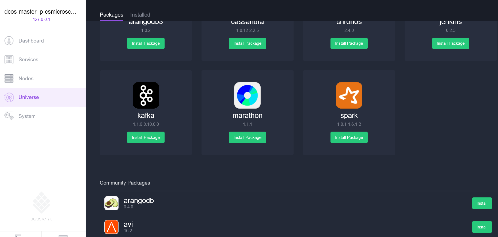

# Контейнер tooDocker введение размещения решений с помощью контейнера службы Azure 
Служба Azure контейнера упрощает для вас toocreate, настройки и управления кластера виртуальных машин, которые являются предварительно настроенных toorun контейнерных приложений. Используется оптимизированная конфигурация популярных средств планирования и оркестрации с открытым исходным кодом. Это позволяет вам toouse существующие навыки работы или рисования при растущих части опытом сообщества, toodeploy и управлять приложениями на основе контейнера на Microsoft Azure.

Служба Azure контейнер использует контейнеры вашего приложения полностью переносимые формат tooensure hello Docker контейнера. Оно также поддерживает выбор Marathon и контроллера домена/OS помощью Docker Swarm и Kubernetes, чтобы масштабировать этих приложений toothousands контейнеров или даже десятков тысяч.

С помощью контейнера службы Azure, вы сможете использовать функции уровня предприятия Azure, одновременно сохраняя переносимость приложения — включая переносимость на слои orchestration hello.

## Использование службы контейнеров Azure
Наша цель, с помощью контейнера службы Azure — tooprovide среды размещения контейнера с помощью средств с открытым исходным кодом и технологии, которые часто используются для наших заказчиков сегодня. конец toothis мы предоставляем hello стандартные конечные точки API для вашей выбранной orchestrator (DC/OS помощью Docker Swarm и Kubernetes). Используя эти конечные точки, может использовать программное обеспечение, которое поддерживает обмен данными toothose конечных точек. Например в случае hello с помощью Docker Swarm endpoint hello, вы можете toouse hello Docker командной строки (CLI). Для контроллера домена/OS может выбрать hello DCOS CLI. Для Kubernetes можно выбрать `kubectl`.

## Создание кластера Docker с помощью службы контейнеров Azure
toobegin с помощью контейнера службы Azure, развертывание кластера службы контейнера Azure через портал hello (hello поиска Marketplace для **контейнера службы Azure**), с помощью шаблона Azure Resource Manager ([Docker Скапливаются](https://github.com/Azure/azure-quickstart-templates/tree/master/101-acs-swarm), [DC/OS](https://github.com/Azure/azure-quickstart-templates/tree/master/101-acs-dcos), или [Kubernetes](https://github.com/Azure/azure-quickstart-templates/tree/master/101-acs-kubernetes)), или с hello [Azure CLI 2.0](container-service-create-acs-cluster-cli.md). Hello при условии, что примеры использования шаблоны могут быть измененный tooinclude дополнительные или расширенные конфигурации Azure. Дополнительные сведения см. в статье [Развертывание кластера службы контейнеров Azure](container-service-deployment.md).

## Развертывание приложения
Служба контейнеров Azure позволяет выбрать для оркестрации Docker Swarm, DC/OS или Kubernetes. Способ развертывания приложения зависит от выбранного оркестратора.

### Использование DC/OS
Контроллер домена/ОС — распределенных операционной системы на базе ядра распределенных систем Apache Mesos hello. Apache Mesos размещается на hello Apache Software Foundation и перечислены некоторые hello [крупнейших имена в ИТ](http://mesos.apache.org/documentation/latest/powered-by-mesos/) как пользователи и участники.

В DC/OS и Apache Mesos доступны впечатляющие функции.

* Надежная масштабируемость
* Отказоустойчивые, реплицируемые главная и подчиненные системы на базе Apache ZooKeeper
* Поддержка контейнеров в формате Docker
* Собственная изоляция между задачами с помощью контейнеров Linux
* Планирование множественных ресурсов (память, ЦП, диск и порты)
* API-интерфейсы Java, Python и C++ для разработки новых параллельных приложений
* Веб-интерфейс для просмотра состояния кластера

По умолчанию контроллер домена или Операционную систему контейнера службы Azure включает hello Marathon orchestration платформы для планирования рабочих нагрузок. Тем не менее с hello DC/OS развертывания служб ACS входит hello вселенной Mesosphere служб, которые могут быть добавлены tooyour службы. Службы в hello вселенной включают Spark, Hadoop, Cassandra и многое другое.

#### Использование Marathon
Marathon — это init общих и системы управления для служб в cgroups — или, в случае hello контейнера службы Azure, контейнеры Docker формате. Marathon предоставляет веб-интерфейс, из которого можно развертывать приложения. Для доступа к нему используется URL-адрес, такой как `http://DNS_PREFIX.REGION.cloudapp.azure.com`, где DNS\_PREFIX и REGION определяются во время развертывания. Конечно же, вы можете задать свое собственное DNS-имя. Дополнительные сведения о запуске контейнера при помощи hello Marathon пользовательского веб-интерфейса см. в разделе [DC/OS управления контейнера с помощью hello Marathon пользовательского веб-интерфейса](container-service-mesos-marathon-ui.md).

Также можно использовать hello API-интерфейс REST для обмена данными с Marathon. Для каждого инструмента доступен ряд клиентских библиотек. Они охватывают на различных языках — и, конечно, можно использовать протокол HTTP hello на любом языке. Кроме того, Marathon поддерживается во многих популярных инструментах DevOps. Это обеспечивает максимальную гибкость работы с кластером службы контейнеров Azure. Дополнительные сведения о запуске контейнера с помощью API-интерфейса REST Marathon hello см. в разделе [Управление контейнерами DC/OS через API-Интерфейс REST Marathon hello](container-service-mesos-marathon-rest.md).

### Использование Docker Swarm
Docker Swarm предоставляет собственные функции кластеризации для Docker. Поскольку помощью Docker Swarm Здравствуйте стандартный API-Интерфейс Docker, любой инструмент, который уже обменивается данными с управляющей программы Docker можно использовать группу мелких объектов tootransparently шкалы toomultiple узлов на контейнера службы Azure.

[!INCLUDE [container-service-swarm-mode-note](../../../includes/container-service-swarm-mode-note.md)]

Поддерживаемые средства управления контейнерами в кластере группу мелких объектов включают, но не ограничиваются hello следующее:

* Dokku
* Docker CLI и Docker Compose
* Krane
* Jenkins

### Использование Kubernetes
Kubernetes — это популярный инструмент оркестрации контейнеров для рабочих сред с открытым кодом. Kubernetes автоматизирует развертывание, масштабирование приложений-контейнеров и управление ими. Так как он представляет собой решение с открытым исходным кодом и управляется сообщества hello открытым исходным кодом, он работает без проблем на контейнера службы Azure и могут быть контейнеры используется toodeploy в масштабе контейнера службы Azure.

Это решение предоставляет обширный набор возможностей, в том числе:
* горизонтальное масштабирование;
* обнаружение служб и балансировка нагрузки;
* управление секретами и конфигурациями;
* автоматические обновления и откаты на основе API;
* самовосстановление;

## Видеоролики
Приступая к работе со службой контейнеров Azure (101):  

> [!VIDEO https://channel9.msdn.com/Shows/Azure-Friday/Azure-Container-Service-101/player]
>
>

Построение приложений с помощью hello контейнера службы Azure (построения 2016 г.)

> [!VIDEO https://channel9.msdn.com/Events/Build/2016/B822/player]
>
>

## Дальнейшие действия

Развертывание кластера службы контейнера с помощью hello [портала](container-service-deployment.md) или [Azure CLI 2.0](container-service-create-acs-cluster-cli.md).
