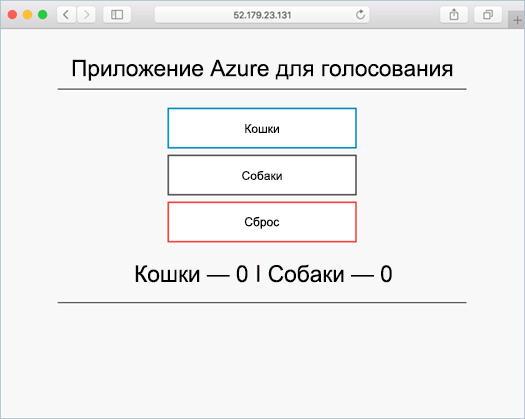

# <a name="deploy-docker-swarm-cluster"></a>Развертывание кластера Docker Swarm

В этом кратком руководстве кластера с помощью Docker Swarm развертывается hello Azure CLI. Контейнер несколькими приложение, состоящее из веб-сервер и экземпляр Redis затем развертывается и запускается на кластере hello. После завершения приложения hello доступна через Интернет hello.

Если у вас еще нет подписки Azure, [создайте бесплатную учетную запись Azure](https://azure.microsoft.com/free/?WT.mc_id=A261C142F), прежде чем начинать работу.

Краткого руководства требует, что вы используете версию Azure CLI hello 2.0.4 или более поздней версии. Запустите `az --version` версии toofind hello. Если требуется tooinstall или обновления, см. раздел [установить CLI Azure 2.0]( /cli/azure/install-azure-cli).

## <a name="create-a-resource-group"></a>Создание группы ресурсов

Создание группы ресурсов с hello [Создание группы az](/cli/azure/group#create) команды. Группа ресурсов Azure — это логическая группа, в которой выполняется развертывание и администрирование ресурсов Azure.

Hello следующий пример создает группу ресурсов с именем *myResourceGroup* в hello *westus* расположение.

```azurecli-interactive
az group create --name myResourceGroup --location westus
```

Выходные данные:

```json
{
  "id": "/subscriptions/00000000-0000-0000-0000-000000000000/resourceGroups/myResourceGroup",
  "location": "westcentralus",
  "managedBy": null,
  "name": "myResourceGroup",
  "properties": {
    "provisioningState": "Succeeded"
  },
  "tags": null
}
```

## <a name="create-docker-swarm-cluster"></a>Создание кластера Docker Swarm

Создание кластера с помощью Docker Swarm в контейнере службы Azure с hello [создать acs az](/cli/azure/acs#create) команды. 

Hello следующий пример создает кластер с именем *mySwarmCluster* с Linux в один главный узел и три узла агента Linux.

```azurecli-interactive
az acs create --name mySwarmCluster --orchestrator-type Swarm --resource-group myResourceGroup --generate-ssh-keys
```

Через несколько минут hello команда завершается и возвращает в формате json сведения о кластере hello.

## <a name="connect-toohello-cluster"></a>Подключите кластер toohello

В этом кратком руководстве требуется hello IP-адрес главного помощью Docker Swarm hello и пул агентов hello Docker. Выполните следующие команды tooreturn hello оба IP-адреса.


```bash
az network public-ip list --resource-group myResourceGroup --query '[*].{Name:name,IPAddress:ipAddress}' -o table
```

Выходные данные:

```bash
Name                                                                 IPAddress
-------------------------------------------------------------------  -------------
swarmm-agent-ip-myswarmcluster-myresourcegroup-d5b9d4agent-66066781  52.179.23.131
swarmm-master-ip-myswarmcluster-myresourcegroup-d5b9d4mgmt-66066781  52.141.37.199
```

Создайте главный группу мелких объектов toohello туннеля SSH. Замените `IPAddress` hello IP-адрес главного hello группу мелких объектов.

```bash
ssh -p 2200 -fNL 2375:localhost:2375 azureuser@IPAddress
```

Набор hello `DOCKER_HOST` переменной среды. Это позволяет toorun команды docker с помощью Docker Swarm hello без имени hello toospecify hello узла.

```bash
export DOCKER_HOST=:2375
```

Теперь вы находитесь службы Docker готов toorun на hello с помощью Docker Swarm.


## <a name="run-hello-application"></a>Запустите приложение hello

Создайте файл с именем `docker-compose.yaml` и hello копировать содержимое в него.

```yaml
version: '3'
services:
  azure-vote-back:
    image: redis
    container_name: azure-vote-back
    ports:
        - "6379:6379"

  azure-vote-front:
    image: microsoft/azure-vote-front:redis-v1
    container_name: azure-vote-front
    environment:
      REDIS: azure-vote-back
    ports:
        - "80:80"
```

Запустите hello, следующая команда toocreate hello Azure голос службы.

```bash
docker-compose up -d
```

Выходные данные:

```bash
Creating network "user_default" with hello default driver
Pulling azure-vote-front (microsoft/azure-vote-front:redis-v1)...
swarm-agent-EE873B23000005: Pulling microsoft/azure-vote-front:redis-v1...
swarm-agent-EE873B23000004: Pulling microsoft/azure-vote-front:redis-v1... : downloaded
Pulling azure-vote-back (redis:latest)...
swarm-agent-EE873B23000004: Pulling redis:latest... : downloaded
Creating azure-vote-front ... 
Creating azure-vote-back ... 
Creating azure-vote-front
Creating azure-vote-back ...
```

## <a name="test-hello-application"></a>Тестирование приложения hello

Обзор toohello IP-адрес tootest пула агента группу мелких объектов hello out приложения hello Azure голос.



## <a name="delete-cluster"></a>Удаление кластера
Когда кластер hello не нужны, можно использовать hello [удаление группы az](/cli/azure/group#delete) команд группы ресурсов tooremove hello, контейнер службы и все связанные ресурсы.

```azurecli-interactive
az group delete --name myResourceGroup --yes --no-wait
```

## <a name="get-hello-code"></a>Получение кода hello

В этом кратком руководстве образы контейнеров предварительно созданной были используется toocreate службу Docker. Hello связанные код приложения, Dockerfile, и создать файл доступны на сайте GitHub.

[https://github.com/Azure-Samples/azure-voting-app-redis](https://github.com/Azure-Samples/azure-voting-app-redis.git)

## <a name="next-steps"></a>Дальнейшие действия

В этом кратком руководстве развертывания кластера с помощью Docker Swarm и развернуты tooit приложение несколькими контейнера.

toolearn об интеграции с Visual Studio Team Services Docker горячего по-прежнему toohello CI или компакт-диска с помощью Docker Swarm и VSTS.

> [!div class="nextstepaction"]
> [Непрерывная интеграция и доставка с помощью Docker Swarm и VSTS](./container-service-docker-swarm-setup-ci-cd.md)