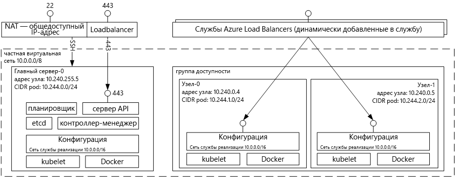

# Введение tooAzure контейнер службы для Kubernetes
Служба Azure контейнер для Kubernetes делает простой toocreate, настройки и управления кластера виртуальных машин, которые являются предварительно настроенных toorun контейнерных приложений. Это позволяет вам toouse существующие навыки работы или рисования при растущих части опытом сообщества, toodeploy и управлять приложениями на основе контейнера на Microsoft Azure.

С помощью контейнера службы Azure, можно воспользоваться преимуществами hello функций корпоративного уровня, Azure, одновременно сохраняя переносимость приложения через Kubernetes и hello Docker формат изображения.

## Использование службы контейнеров Azure для Kubernetes
Наша цель, с помощью контейнера службы Azure — tooprovide среды размещения контейнера с помощью средств с открытым исходным кодом и технологии, которые часто используются для наших заказчиков сегодня. конец toothis мы предоставляем hello стандартные конечные точки Kubernetes API. Используя эти стандартные конечные точки, может использовать программное обеспечение, которое поддерживает обмен данными tooa Kubernetes кластера. Например, можно выбрать [kubectl](https://kubernetes.io/docs/user-guide/kubectl-overview/), [Helm](https://helm.sh/) или [Draft](https://github.com/Azure/draft).

## Создание кластера Kubernetes с помощью службы контейнеров Azure
toobegin с помощью контейнера службы Azure, развернуть кластер контейнера службы Azure с hello [Azure CLI 2.0](container-service-kubernetes-walkthrough.md) или через портал hello (hello поиска Marketplace для **контейнера службы Azure**). Опытных пользователей, которым необходим больший контроль над hello шаблоны диспетчера ресурсов Azure можно использовать Привет открыть источник [acs ядра](https://github.com/Azure/acs-engine) toobuild проект собственных пользовательских Kubernetes кластера и его развертывания через hello `az` CLI.

### Использование Kubernetes
Kubernetes автоматизирует развертывание, масштабирование приложений-контейнеров и управление ими. Это решение предоставляет обширный набор возможностей, в том числе:
* автоматическая упаковка в контейнеры;
* самовосстановление;
* горизонтальное масштабирование;
* обнаружение служб и балансировка нагрузки;
* автоматические обновления и откаты;
* управление секретами и конфигурациями;
* оркестрация хранилища;
* пакетное выполнение.

Архитектура службы Kubernetes, развернутой с помощью службы контейнеров Azure:

## Видеоролики

Поддержка Kubernetes в службе контейнеров ("Пятница с Azure", январь 2017 г.):

> [!VIDEO https://channel9.msdn.com/Shows/Azure-Friday/Kubernetes-Support-in-Azure-Container-Services/player]
>
>

Средства разработки и развертывания приложений в Kubernetes (Azure OpenDev, июнь 2017 г.):

> [!VIDEO https://channel9.msdn.com/Events/AzureOpenDev/June2017/Tools-for-Developing-and-Deploying-Applications-on-Kubernetes/player]
>
>

## Дальнейшие действия

Просмотр hello [краткое руководство Kubernetes](container-service-kubernetes-walkthrough.md) toobegin сегодня изучение контейнера службы Azure.
