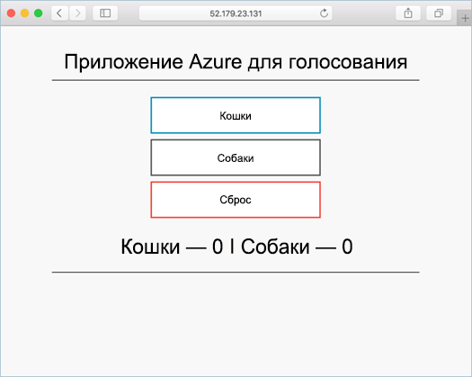

# <a name="deploy-kubernetes-cluster-for-linux-containers"></a>Развертывание кластера Kubernetes для контейнеров Linux

В этом кратком руководстве кластера Kubernetes развертывается hello Azure CLI. Контейнер несколькими приложение, состоящее из веб-сервер и экземпляр Redis затем развертывается и запускается на кластере hello. После завершения приложения hello доступна через Интернет hello. 

Пример приложения Hello, используемые в этом документе записывается в Python. Основные понятия Hello и этапы, описанные здесь может быть используется toodeploy любого контейнера изображения в качестве Kubernetes кластера. Hello кода, Dockerfile и предварительно созданный проект toothis связанные файлы манифеста Kubernetes доступны на [GitHub](https://github.com/Azure-Samples/azure-voting-app-redis.git).



В этом кратком руководстве предполагается, основные понятия Kubernetes см. подробные сведения о Kubernetes hello [Kubernetes документации]( https://kubernetes.io/docs/home/).

Если у вас еще нет подписки Azure, [создайте бесплатную учетную запись Azure](https://azure.microsoft.com/free/?WT.mc_id=A261C142F), прежде чем начинать работу.

[!INCLUDE [cloud-shell-try-it.md](../../../includes/cloud-shell-try-it.md)]

Если выбрать tooinstall и использовать hello CLI локально, краткого руководства требуется управлением hello Azure CLI версия 2.0.4 или более поздней версии. Запустите `az --version` версии toofind hello. Если требуется tooinstall или обновления, см. раздел [установить CLI Azure 2.0]( /cli/azure/install-azure-cli). 

## <a name="create-a-resource-group"></a>Создание группы ресурсов

Создание группы ресурсов с hello [Создание группы az](/cli/azure/group#create) команды. Группа ресурсов Azure — это логическая группа, в которой выполняется развертывание и администрирование ресурсов Azure. 

Hello следующий пример создает группу ресурсов с именем *myResourceGroup* в hello *westeurope* расположение.

```azurecli-interactive 
az group create --name myResourceGroup --location westeurope
```

Выходные данные:

```json
{
  "id": "/subscriptions/00000000-0000-0000-0000-000000000000/resourceGroups/myResourceGroup",
  "location": "westeurope",
  "managedBy": null,
  "name": "myResourceGroup",
  "properties": {
    "provisioningState": "Succeeded"
  },
  "tags": null
}
```

## <a name="create-kubernetes-cluster"></a>Создание кластера Kubernetes

Создание кластера Kubernetes в контейнере службы Azure с hello [создать acs az](/cli/azure/acs#create) команды. Hello следующий пример создает кластер с именем *myK8sCluster* с Linux в один главный узел и три узла агента Linux.

```azurecli-interactive 
az acs create --orchestrator-type kubernetes --resource-group myResourceGroup --name myK8sCluster --generate-ssh-keys 
```

Через несколько минут hello команда завершается и возвращает в формате json сведения о кластере hello. 

## <a name="connect-toohello-cluster"></a>Подключите кластер toohello

использовать кластер Kubernetes toomanage [kubectl](https://kubernetes.io/docs/user-guide/kubectl/), клиент командной строки Kubernetes hello. 

Если вы используете Azure CloudShell, клиент kubectl уже установлен. Если требуется, чтобы tooinstall его локально, можно использовать hello [az acs kubernetes install-cli](/cli/azure/acs/kubernetes#install-cli) команды.

tooconfigure kubectl tooconnect tooyour Kubernetes кластера, запустите hello [az kubernetes get-учетные данные acs](/cli/azure/acs/kubernetes#get-credentials) команды. На этом этапе загрузки учетных данных и настраивает hello Kubernetes CLI toouse их.

```azurecli-interactive 
az acs kubernetes get-credentials --resource-group=myResourceGroup --name=myK8sCluster
```

tooyour tooverify hello подключения кластера, используйте hello [kubectl получить](https://kubernetes.io/docs/user-guide/kubectl/v1.6/#get) tooreturn команда список узлов в кластере hello.

```azurecli-interactive
kubectl get nodes
```

Выходные данные:

```bash
NAME                    STATUS                     AGE       VERSION
k8s-agent-14ad53a1-0    Ready                      10m       v1.6.6
k8s-agent-14ad53a1-1    Ready                      10m       v1.6.6
k8s-agent-14ad53a1-2    Ready                      10m       v1.6.6
k8s-master-14ad53a1-0   Ready,SchedulingDisabled   10m       v1.6.6
```

## <a name="run-hello-application"></a>Запустите приложение hello

Файл манифеста Kubernetes определяет требуемое состояние для hello кластера, включая то, что должна быть запущена образы контейнеров. Например манифест представляет используется toocreate все объекты, необходимые toorun hello приложения Azure голос. 

Создайте файл с именем `azure-vote.yml` и скопируйте в него следующие YAML hello. Если вы работаете в Azure Cloud Shell, этот файл можно создать с помощью Vi или Nano, как при работе в виртуальной или физической системе.

```yaml
apiVersion: apps/v1beta1
kind: Deployment
metadata:
  name: azure-vote-back
spec:
  replicas: 1
  template:
    metadata:
      labels:
        app: azure-vote-back
    spec:
      containers:
      - name: azure-vote-back
        image: redis
        ports:
        - containerPort: 6379
          name: redis
---
apiVersion: v1
kind: Service
metadata:
  name: azure-vote-back
spec:
  ports:
  - port: 6379
  selector:
    app: azure-vote-back
---
apiVersion: apps/v1beta1
kind: Deployment
metadata:
  name: azure-vote-front
spec:
  replicas: 1
  template:
    metadata:
      labels:
        app: azure-vote-front
    spec:
      containers:
      - name: azure-vote-front
        image: microsoft/azure-vote-front:redis-v1
        ports:
        - containerPort: 80
        env:
        - name: REDIS
          value: "azure-vote-back"
---
apiVersion: v1
kind: Service
metadata:
  name: azure-vote-front
spec:
  type: LoadBalancer
  ports:
  - port: 80
  selector:
    app: azure-vote-front
```

Используйте hello [kubectl создания](https://kubernetes.io/docs/user-guide/kubectl/v1.6/#create) команды toorun приложения hello.

```azurecli-interactive
kubectl create -f azure-vote.yml
```

Выходные данные:

```bash
deployment "azure-vote-back" created
service "azure-vote-back" created
deployment "azure-vote-front" created
service "azure-vote-front" created
```

## <a name="test-hello-application"></a>Тестирование приложения hello

При запуске приложения hello [Kubernetes службы](https://kubernetes.io/docs/concepts/services-networking/service/) создается hello, предоставляет toohello внешнего интерфейса приложения Интернета. Этот процесс может занять несколько минут toocomplete. 

toomonitor о ходе выполнения, используйте hello [kubectl получить службу](https://kubernetes.io/docs/user-guide/kubectl/v1.6/#get) с hello `--watch` аргумент.

```azurecli-interactive
kubectl get service azure-vote-front --watch
```

Здравствуйте, изначально **внешний IP-** для hello *azure голос передней панели* службы отображается как *ожидающие*. После hello внешний IP-адрес отличается от *ожидающие* tooan *IP-адрес*, используйте `CTRL-C` toostop hello kubectl Контрольные значения процесса. 
  
```bash
azure-vote-front   10.0.34.242   <pending>     80:30676/TCP   7s
azure-vote-front   10.0.34.242   52.179.23.131   80:30676/TCP   2m
```

Теперь можно выполнять поиск toohello внешние IP адрес toosee hello голос приложения Azure.

  

## <a name="delete-cluster"></a>Удаление кластера
Когда кластер hello не нужны, можно использовать hello [удаление группы az](/cli/azure/group#delete) команд группы ресурсов tooremove hello, контейнер службы и все связанные ресурсы.

```azurecli-interactive 
az group delete --name myResourceGroup --yes --no-wait
```

## <a name="get-hello-code"></a>Получение кода hello

В этом кратком руководстве образы контейнеров предварительно созданной были используется toocreate Kubernetes развертывания. Hello связанные код приложения, Dockerfile, и файл манифеста Kubernetes доступны на сайте GitHub.

[https://github.com/Azure-Samples/azure-voting-app-redis](https://github.com/Azure-Samples/azure-voting-app-redis.git)

## <a name="next-steps"></a>Дальнейшие действия

В этом кратком руководстве развертывания кластера Kubernetes и развернуты tooit приложение несколькими контейнера. 

toolearn Дополнительные сведения о службе Azure контейнера и пошагового полный пример toodeployment, продолжить работу с учебником кластера Kubernetes toohello.

> [!div class="nextstepaction"]
> [Create container images to be used with Azure Container Service](./container-service-tutorial-kubernetes-prepare-app.md) (Создание образов контейнеров для использования со Службой контейнеров Azure)
