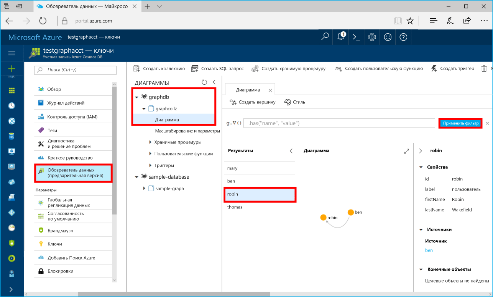

# <a name="azure-cosmos-db-build-a-net-application-using-the-graph-api"></a><span data-ttu-id="12351-103">Azure Cosmos DB. Создание приложения .NET с помощью API Graph</span><span class="sxs-lookup"><span data-stu-id="12351-103">Azure Cosmos DB: Build a .NET application using the Graph API</span></span>

<span data-ttu-id="12351-104">Azure Cosmos DB — это глобально распределенная многомодельная служба базы данных Майкрософт.</span><span class="sxs-lookup"><span data-stu-id="12351-104">Azure Cosmos DB is Microsoft’s globally distributed multi-model database service.</span></span> <span data-ttu-id="12351-105">Вы можете быстро создавать и запрашивать документы, пары "ключ — значение" и базы данных графов, используя преимущества возможностей глобального распределения и горизонтального масштабирования Azure Cosmos DB.</span><span class="sxs-lookup"><span data-stu-id="12351-105">You can quickly create and query document, key/value, and graph databases, all of which benefit from the global distribution and horizontal scale capabilities at the core of Azure Cosmos DB.</span></span> 

<span data-ttu-id="12351-106">В этом кратком руководстве показано, как создать учетную запись Azure Cosmos DB, базу данных и граф (контейнер) с помощью портала Azure.</span><span class="sxs-lookup"><span data-stu-id="12351-106">This quick start demonstrates how to create an Azure Cosmos DB account, database, and graph (container) using the Azure portal.</span></span> <span data-ttu-id="12351-107">Затем вы создадите и запустите консольное приложение на базе [API Graph](graph-sdk-dotnet.md) (предварительная версия).</span><span class="sxs-lookup"><span data-stu-id="12351-107">You then build and run a console app built on the [Graph API](graph-sdk-dotnet.md) (preview).</span></span>  

## <a name="prerequisites"></a><span data-ttu-id="12351-108">Предварительные требования</span><span class="sxs-lookup"><span data-stu-id="12351-108">Prerequisites</span></span>

<span data-ttu-id="12351-109">Если вы еще не установили Visual Studio 2017, вы можете скачать и использовать **бесплатный** [выпуск Community для Visual Studio 2017](https://www.visualstudio.com/downloads/).</span><span class="sxs-lookup"><span data-stu-id="12351-109">If you don’t already have Visual Studio 2017 installed, you can download and use the **free** [Visual Studio 2017 Community Edition](https://www.visualstudio.com/downloads/).</span></span> <span data-ttu-id="12351-110">При установке Visual Studio необходимо включить возможность **разработки для Azure**.</span><span class="sxs-lookup"><span data-stu-id="12351-110">Make sure that you enable **Azure development** during the Visual Studio setup.</span></span>

[!INCLUDE [quickstarts-free-trial-note](../../includes/quickstarts-free-trial-note.md)]

## <a name="create-a-database-account"></a><span data-ttu-id="12351-111">Создание учетной записи базы данных</span><span class="sxs-lookup"><span data-stu-id="12351-111">Create a database account</span></span>

[!INCLUDE [cosmos-db-create-dbaccount-graph](../../includes/cosmos-db-create-dbaccount-graph.md)]

## <a name="add-a-graph"></a><span data-ttu-id="12351-112">Добавление графа</span><span class="sxs-lookup"><span data-stu-id="12351-112">Add a graph</span></span>

[!INCLUDE [cosmos-db-create-graph](../../includes/cosmos-db-create-graph.md)]

## <a name="clone-the-sample-application"></a><span data-ttu-id="12351-113">Клонирование примера приложения</span><span class="sxs-lookup"><span data-stu-id="12351-113">Clone the sample application</span></span>

<span data-ttu-id="12351-114">Теперь необходимо клонировать приложение API Graph из GitHub. Задайте строку подключения и выполните ее.</span><span class="sxs-lookup"><span data-stu-id="12351-114">Now let's clone a Graph API app from github, set the connection string, and run it.</span></span> <span data-ttu-id="12351-115">Вы узнаете, как можно упростить работу с данными программным способом.</span><span class="sxs-lookup"><span data-stu-id="12351-115">You'll see how easy it is to work with data programmatically.</span></span> 

1. <span data-ttu-id="12351-116">Откройте окно терминала Git, например Git Bash, и выполните команду `cd`, чтобы перейти в рабочий каталог.</span><span class="sxs-lookup"><span data-stu-id="12351-116">Open a git terminal window, such as git bash, and `cd` to a working directory.</span></span>  

2. <span data-ttu-id="12351-117">Выполните команду ниже, чтобы клонировать репозиторий с примером.</span><span class="sxs-lookup"><span data-stu-id="12351-117">Run the following command to clone the sample repository.</span></span> 

    ```bash
    git clone https://github.com/Azure-Samples/azure-cosmos-db-graph-dotnet-getting-started.git
    ```

3. <span data-ttu-id="12351-118">Затем откройте файл решения в Visual Studio.</span><span class="sxs-lookup"><span data-stu-id="12351-118">Then open Visual Studio and open the solution file.</span></span> 

## <a name="review-the-code"></a><span data-ttu-id="12351-119">Просмотр кода</span><span class="sxs-lookup"><span data-stu-id="12351-119">Review the code</span></span>

<span data-ttu-id="12351-120">Сделаем краткий обзор того, что происходит в приложении.</span><span class="sxs-lookup"><span data-stu-id="12351-120">Let's make a quick review of what's happening in the app.</span></span> <span data-ttu-id="12351-121">Откройте файл Program.cs, и вы увидите, что эти строки кода создают ресурсы Azure Cosmos DB.</span><span class="sxs-lookup"><span data-stu-id="12351-121">Open the Program.cs file and you'll find that these lines of code create the Azure Cosmos DB resources.</span></span> 

* <span data-ttu-id="12351-122">Инициализация экземпляра DocumentClient.</span><span class="sxs-lookup"><span data-stu-id="12351-122">The DocumentClient is initialized.</span></span> <span data-ttu-id="12351-123">В предварительной версии мы добавили API расширения графа в клиент Azure Cosmos DB.</span><span class="sxs-lookup"><span data-stu-id="12351-123">In the preview, we added a graph extension API on the Azure Cosmos DB client.</span></span> <span data-ttu-id="12351-124">Мы работаем над автономным клиентом графа, не связанным с клиентом Azure Cosmos DB и ресурсами.</span><span class="sxs-lookup"><span data-stu-id="12351-124">We are working on a standalone graph client decoupled from the Azure Cosmos DB client and resources.</span></span>

    ```csharp
    using (DocumentClient client = new DocumentClient(
        new Uri(endpoint),
        authKey,
        new ConnectionPolicy { ConnectionMode = ConnectionMode.Direct, ConnectionProtocol = Protocol.Tcp }))
    ```

* <span data-ttu-id="12351-125">Создание базы данных.</span><span class="sxs-lookup"><span data-stu-id="12351-125">A new database is created.</span></span>

    ```csharp
    Database database = await client.CreateDatabaseIfNotExistsAsync(new Database { Id = "graphdb" });
    ```

* <span data-ttu-id="12351-126">Создание графа.</span><span class="sxs-lookup"><span data-stu-id="12351-126">A new graph is created.</span></span>

    ```csharp
    DocumentCollection graph = await client.CreateDocumentCollectionIfNotExistsAsync(
        UriFactory.CreateDatabaseUri("graphdb"),
        new DocumentCollection { Id = "graph" },
        new RequestOptions { OfferThroughput = 1000 });
    ```
* <span data-ttu-id="12351-127">Выполнение шагов Gremlin с использованием метода `CreateGremlinQuery`.</span><span class="sxs-lookup"><span data-stu-id="12351-127">A series of Gremlin steps are executed using the `CreateGremlinQuery` method.</span></span>

    ```csharp
    // The CreateGremlinQuery method extensions allow you to execute Gremlin queries and iterate
    // results asychronously
    IDocumentQuery<dynamic> query = client.CreateGremlinQuery<dynamic>(graph, "g.V().count()");
    while (query.HasMoreResults)
    {
        foreach (dynamic result in await query.ExecuteNextAsync())
        {
            Console.WriteLine($"\t {JsonConvert.SerializeObject(result)}");
        }
    }

    ```

## <a name="update-your-connection-string"></a><span data-ttu-id="12351-128">Обновление строки подключения</span><span class="sxs-lookup"><span data-stu-id="12351-128">Update your connection string</span></span>

<span data-ttu-id="12351-129">Теперь вернитесь на портал Azure, чтобы получить данные строки подключения. Скопируйте эти данные в приложение.</span><span class="sxs-lookup"><span data-stu-id="12351-129">Now go back to the Azure portal to get your connection string information and copy it into the app.</span></span>

1. <span data-ttu-id="12351-130">В Visual Studio 2017 откройте файл App.config.</span><span class="sxs-lookup"><span data-stu-id="12351-130">In Visual Studio 2017, open the App.config file.</span></span> 

2. <span data-ttu-id="12351-131">На портале Azure в учетной записи Azure Cosmos DB щелкните **Ключи** в левой области навигации.</span><span class="sxs-lookup"><span data-stu-id="12351-131">In the Azure portal, in your Azure Cosmos DB account, click **Keys** in the left navigation.</span></span> 

    

3. <span data-ttu-id="12351-133">Скопируйте значение **URI** из портала и добавьте его в качестве значения параметра ключа конечной точки в файле App.config.</span><span class="sxs-lookup"><span data-stu-id="12351-133">Copy your **URI** value from the portal and make it the value of the Endpoint key in App.config.</span></span> <span data-ttu-id="12351-134">Как показано на предыдущем снимке экрана, вы можете использовать кнопку "Копировать" для копирования значения.</span><span class="sxs-lookup"><span data-stu-id="12351-134">You can use the copy button as shown in the preceding screenshot to copy the value.</span></span>

    `<add key="Endpoint" value="https://FILLME.documents.azure.com:443" />`

4. <span data-ttu-id="12351-135">Скопируйте значение **первичного ключа** с портала и добавьте его в качестве значения параметра ключа AuthKey в App.config, а затем сохраните изменения.</span><span class="sxs-lookup"><span data-stu-id="12351-135">Copy your **PRIMARY KEY** value from the portal, and make it the value of the AuthKey key in App.config, then save your changes.</span></span> 

    `<add key="AuthKey" value="FILLME" />`

<span data-ttu-id="12351-136">Теперь приложение со всеми сведениями, необходимыми для взаимодействия с Azure Cosmos DB, обновлено.</span><span class="sxs-lookup"><span data-stu-id="12351-136">You've now updated your app with all the info it needs to communicate with Azure Cosmos DB.</span></span> 

## <a name="run-the-console-app"></a><span data-ttu-id="12351-137">Запуск консольного приложения</span><span class="sxs-lookup"><span data-stu-id="12351-137">Run the console app</span></span>

1. <span data-ttu-id="12351-138">В Visual Studio в **обозревателе решений** щелкните проект **GraphGetStarted** правой кнопкой мыши и выберите **Управление пакетами NuGet**.</span><span class="sxs-lookup"><span data-stu-id="12351-138">In Visual Studio, right-click on the **GraphGetStarted** project in **Solution Explorer** and then click **Manage NuGet Packages**.</span></span> 

2. <span data-ttu-id="12351-139">В NuGet в поле **обзора** введите *Microsoft.Azure.Graphs* и установите флажок для поля **Includes prerelease** (Включить предварительный выпуск).</span><span class="sxs-lookup"><span data-stu-id="12351-139">In the NuGet **Browse** box, type *Microsoft.Azure.Graphs* and check the **Includes prerelease** box.</span></span> 

3. <span data-ttu-id="12351-140">В результатах поиска выберите библиотеку **Microsoft.Azure.Graphs** и установите ее.</span><span class="sxs-lookup"><span data-stu-id="12351-140">From the results, install the **Microsoft.Azure.Graphs** library.</span></span> <span data-ttu-id="12351-141">При этом установится пакет библиотеки расширений графов Azure Cosmos DB и все зависимые компоненты.</span><span class="sxs-lookup"><span data-stu-id="12351-141">This installs the Azure Cosmos DB graph extension library package and all dependencies.</span></span>

    <span data-ttu-id="12351-142">Если появится сообщение о просмотре изменений в решении, нажмите кнопку **ОК**.</span><span class="sxs-lookup"><span data-stu-id="12351-142">If you get a message about reviewing changes to the solution, click **OK**.</span></span> <span data-ttu-id="12351-143">Если появится сообщение о принятии условий лицензионного соглашения, щелкните **Принимаю**.</span><span class="sxs-lookup"><span data-stu-id="12351-143">If you get a message about license acceptance, click **I accept**.</span></span>

4. <span data-ttu-id="12351-144">Нажмите клавиши CTRL+F5 для запуска приложения.</span><span class="sxs-lookup"><span data-stu-id="12351-144">Click CTRL + F5 to run the application.</span></span>

   <span data-ttu-id="12351-145">В окне консоли появятся вершины и ребра, добавляемые в граф.</span><span class="sxs-lookup"><span data-stu-id="12351-145">The console window displays the vertexes and edges being added to the graph.</span></span> <span data-ttu-id="12351-146">После завершения сценария закройте окно консоли, дважды нажав клавишу ВВОД.</span><span class="sxs-lookup"><span data-stu-id="12351-146">When the script completes, press ENTER twice to close the console window.</span></span> 

## <a name="browse-using-the-data-explorer"></a><span data-ttu-id="12351-147">Просмотр с помощью обозревателя данных</span><span class="sxs-lookup"><span data-stu-id="12351-147">Browse using the Data Explorer</span></span>

<span data-ttu-id="12351-148">Теперь вернитесь в обозреватель данных на портале Azure. Здесь вы можете просмотреть и запросить новые данные графа.</span><span class="sxs-lookup"><span data-stu-id="12351-148">You can now go back to Data Explorer in the Azure portal and browse and query your new graph data.</span></span>

1. <span data-ttu-id="12351-149">В обозревателе данных новая база данных отображается в области "Графы".</span><span class="sxs-lookup"><span data-stu-id="12351-149">In Data Explorer, the new database appears in the Graphs pane.</span></span> <span data-ttu-id="12351-150">Разверните **graphdb** и **graphcollz**, а затем щелкните **График**.</span><span class="sxs-lookup"><span data-stu-id="12351-150">Expand **graphdb**, **graphcollz**, and then click **Graph**.</span></span>

2. <span data-ttu-id="12351-151">Нажмите кнопку **Применить фильтр**, чтобы использовать запрос по умолчанию для просмотра всех вершин графа.</span><span class="sxs-lookup"><span data-stu-id="12351-151">Click the **Apply Filter** button to use the default query to view all the verticies in the graph.</span></span> <span data-ttu-id="12351-152">Данные, созданные в примере приложения, отображаются на панели Graphs (Графы).</span><span class="sxs-lookup"><span data-stu-id="12351-152">The data generated by the sample app is displayed in the Graphs pane.</span></span>

    <span data-ttu-id="12351-153">Вы можете масштабировать граф, развернуть отображаемое пространство, добавить дополнительные вершины и переместить их на поверхность отображения.</span><span class="sxs-lookup"><span data-stu-id="12351-153">You can zoom in and out of the graph, you can expand the graph display space, add additional verticies, and move verticies on the display surface.</span></span>

    

## <a name="review-slas-in-the-azure-portal"></a><span data-ttu-id="12351-155">Просмотр соглашений об уровне обслуживания на портале Azure</span><span class="sxs-lookup"><span data-stu-id="12351-155">Review SLAs in the Azure portal</span></span>

[!INCLUDE [cosmosdb-tutorial-review-slas](../../includes/cosmos-db-tutorial-review-slas.md)]

## <a name="clean-up-resources"></a><span data-ttu-id="12351-156">Очистка ресурсов</span><span class="sxs-lookup"><span data-stu-id="12351-156">Clean up resources</span></span>

<span data-ttu-id="12351-157">Если вы не собираетесь использовать это приложение дальше, удалите все ресурсы, созданные в ходе работы с этим руководством, на портале Azure, сделав следующее:</span><span class="sxs-lookup"><span data-stu-id="12351-157">If you're not going to continue to use this app, delete all resources created by this quickstart in the Azure portal with the following steps:</span></span> 

1. <span data-ttu-id="12351-158">В меню слева на портале Azure щелкните **Группы ресурсов**, а затем выберите имя созданного ресурса.</span><span class="sxs-lookup"><span data-stu-id="12351-158">From the left-hand menu in the Azure portal, click **Resource groups** and then click the name of the resource you created.</span></span> 
2. <span data-ttu-id="12351-159">На странице группы ресурсов щелкните **Удалить**, в текстовом поле введите имя ресурса для удаления и щелкните **Удалить**.</span><span class="sxs-lookup"><span data-stu-id="12351-159">On your resource group page, click **Delete**, type the name of the resource to delete in the text box, and then click **Delete**.</span></span>

## <a name="next-steps"></a><span data-ttu-id="12351-160">Дальнейшие действия</span><span class="sxs-lookup"><span data-stu-id="12351-160">Next steps</span></span>

<span data-ttu-id="12351-161">В этом кратком руководстве вы узнали, как создать учетную запись Azure Cosmos DB, граф с помощью обозревателя данных, а также как запустить приложение.</span><span class="sxs-lookup"><span data-stu-id="12351-161">In this quickstart, you've learned how to create an Azure Cosmos DB account, create a graph using the Data Explorer, and run an app.</span></span> <span data-ttu-id="12351-162">Теперь вы можете создавать более сложные запросы и внедрять эффективную логику обхода графа с помощью Gremlin.</span><span class="sxs-lookup"><span data-stu-id="12351-162">You can now build more complex queries and implement powerful graph traversal logic using Gremlin.</span></span> 

> [!div class="nextstepaction"]
> [<span data-ttu-id="12351-163">Как выполнять запросы к данным в базе данных Azure Cosmos DB с помощью API Graph (предварительная версия)</span><span class="sxs-lookup"><span data-stu-id="12351-163">Query using Gremlin</span></span>](tutorial-query-graph.md)

