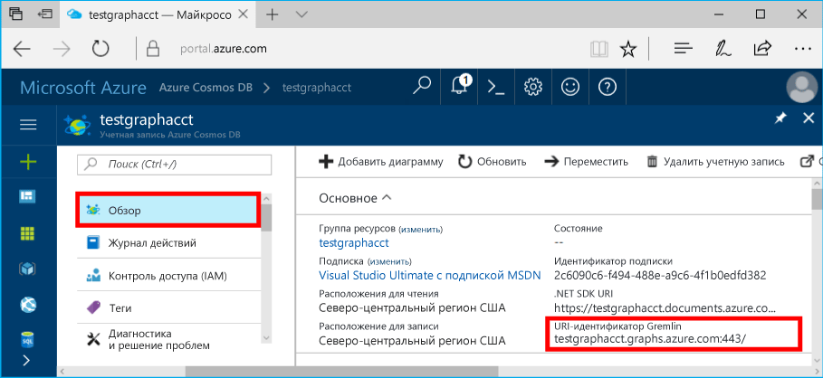
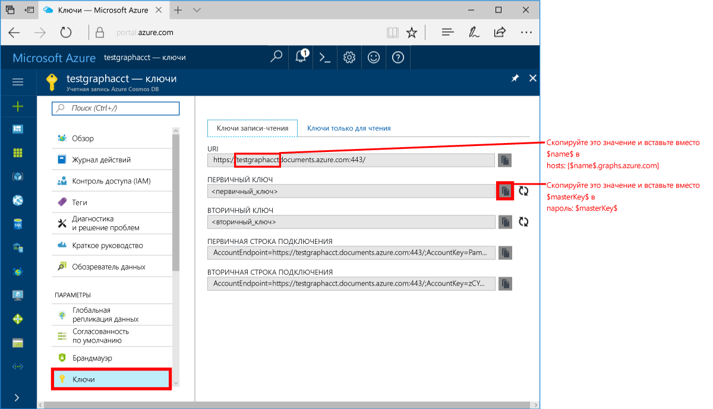
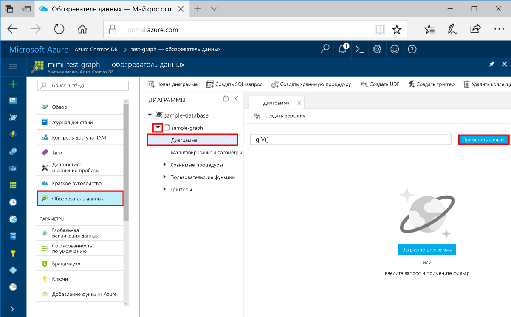
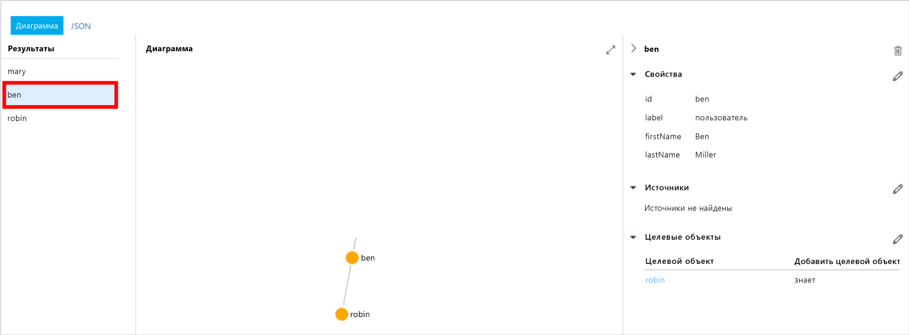
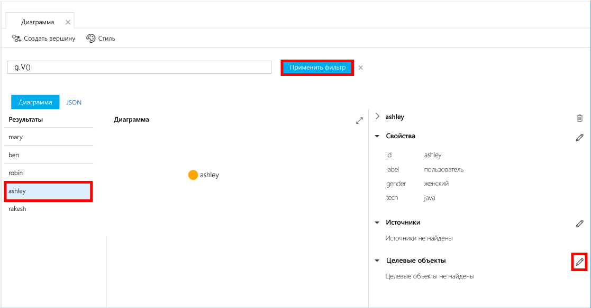
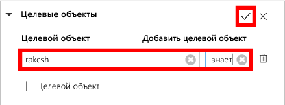
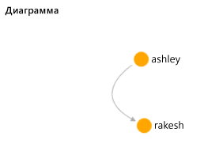

# <a name="azure-cosmos-db-create-a-graph-database-using-java-and-the-azure-portal"></a><span data-ttu-id="e7e37-103">Azure Cosmos DB: создание графовой базы данных с помощью Java и портала Azure</span><span class="sxs-lookup"><span data-stu-id="e7e37-103">Azure Cosmos DB: Create a graph database using Java and the Azure portal</span></span>

<span data-ttu-id="e7e37-104">Azure Cosmos DB — это глобально распределенная многомодельная служба базы данных Майкрософт.</span><span class="sxs-lookup"><span data-stu-id="e7e37-104">Azure Cosmos DB is Microsoft’s globally distributed multi-model database service.</span></span> <span data-ttu-id="e7e37-105">Вы можете быстро создавать и запрашивать документы, пары "ключ — значение" и базы данных графов, используя преимущества возможностей глобального распределения и горизонтального масштабирования Azure Cosmos DB.</span><span class="sxs-lookup"><span data-stu-id="e7e37-105">You can quickly create and query document, key/value, and graph databases, all of which benefit from the global distribution and horizontal scale capabilities at the core of Azure Cosmos DB.</span></span> 

<span data-ttu-id="e7e37-106">Выполнив это краткое руководство, вы создадите графовую базу данных с помощью средств портала Azure для Azure Cosmos DB.</span><span class="sxs-lookup"><span data-stu-id="e7e37-106">This quickstart creates a graph database using the Azure portal tools for Azure Cosmos DB.</span></span> <span data-ttu-id="e7e37-107">В этом руководстве также объясняется, как быстро создать консольное приложение Java с помощью графовой базы данных и драйвера OSS [Gremlin Java](https://mvnrepository.com/artifact/org.apache.tinkerpop/gremlin-driver).</span><span class="sxs-lookup"><span data-stu-id="e7e37-107">This quickstart also shows you how to quickly create a Java console app using a graph database using the OSS [Gremlin Java](https://mvnrepository.com/artifact/org.apache.tinkerpop/gremlin-driver) driver.</span></span> <span data-ttu-id="e7e37-108">Указания в этом руководстве применимы к любой операционной системе, с которой может работать Java.</span><span class="sxs-lookup"><span data-stu-id="e7e37-108">The instructions in this quickstart can be followed on any operating system that is capable of running Java.</span></span> <span data-ttu-id="e7e37-109">Из этого краткого руководства вы узнаете, как создавать и изменять ресурсы графов с помощью пользовательского интерфейса или программных средств.</span><span class="sxs-lookup"><span data-stu-id="e7e37-109">This quickstart familiarizes you with creating and modifying graph resources in either the UI or programmatically, whichever is your preference.</span></span> 

## <a name="prerequisites"></a><span data-ttu-id="e7e37-110">Предварительные требования</span><span class="sxs-lookup"><span data-stu-id="e7e37-110">Prerequisites</span></span>

* [<span data-ttu-id="e7e37-111">Комплект разработчика Java (JDK 1.7+)</span><span class="sxs-lookup"><span data-stu-id="e7e37-111">Java Development Kit (JDK) 1.7+</span></span>](http://www.oracle.com/technetwork/java/javase/downloads/jdk8-downloads-2133151.html)
    * <span data-ttu-id="e7e37-112">В Ubuntu выполните команду `apt-get install default-jdk`, чтобы установить JDK.</span><span class="sxs-lookup"><span data-stu-id="e7e37-112">On Ubuntu, run `apt-get install default-jdk` to install the JDK.</span></span>
    * <span data-ttu-id="e7e37-113">Обязательно настройте переменную среды JAVA_HOME так, чтобы она указывала на папку, в которой установлен пакет JDK.</span><span class="sxs-lookup"><span data-stu-id="e7e37-113">Be sure to set the JAVA_HOME environment variable to point to the folder where the JDK is installed.</span></span>
* <span data-ttu-id="e7e37-114">[Скачайте](http://maven.apache.org/download.cgi) и [установите](http://maven.apache.org/install.html) двоичный архив [Maven](http://maven.apache.org/).</span><span class="sxs-lookup"><span data-stu-id="e7e37-114">[Download](http://maven.apache.org/download.cgi) and [install](http://maven.apache.org/install.html) a [Maven](http://maven.apache.org/) binary archive</span></span>
    * <span data-ttu-id="e7e37-115">В Ubuntu выполните команду `apt-get install maven`, чтобы установить Maven.</span><span class="sxs-lookup"><span data-stu-id="e7e37-115">On Ubuntu, you can run `apt-get install maven` to install Maven.</span></span>
* [<span data-ttu-id="e7e37-116">Git.</span><span class="sxs-lookup"><span data-stu-id="e7e37-116">Git</span></span>](https://www.git-scm.com/)
    * <span data-ttu-id="e7e37-117">В Ubuntu выполните команду `sudo apt-get install git`, чтобы установить Git.</span><span class="sxs-lookup"><span data-stu-id="e7e37-117">On Ubuntu, you can run `sudo apt-get install git` to install Git.</span></span>

[!INCLUDE [quickstarts-free-trial-note](../../includes/quickstarts-free-trial-note.md)]

## <a name="create-a-database-account"></a><span data-ttu-id="e7e37-118">Создание учетной записи базы данных</span><span class="sxs-lookup"><span data-stu-id="e7e37-118">Create a database account</span></span>

<span data-ttu-id="e7e37-119">Перед созданием графовой базы данных необходимо создать учетную запись графовой базы данных Gremlin с Azure Cosmos DB.</span><span class="sxs-lookup"><span data-stu-id="e7e37-119">Before you can create a graph database, you need to create a Gremlin (Graph) database account with Azure Cosmos DB.</span></span>

[!INCLUDE [cosmos-db-create-dbaccount-graph](../../includes/cosmos-db-create-dbaccount-graph.md)]

## <a name="add-a-graph"></a><span data-ttu-id="e7e37-120">Добавление графа</span><span class="sxs-lookup"><span data-stu-id="e7e37-120">Add a graph</span></span>

<span data-ttu-id="e7e37-121">Теперь вы можете использовать обозреватель данных на портале Azure для создания базы данных графов.</span><span class="sxs-lookup"><span data-stu-id="e7e37-121">You can now use the Data Explorer tool in the Azure portal to create a graph database.</span></span> 

1. <span data-ttu-id="e7e37-122">На портале Azure в меню навигации слева щелкните **Обозреватель данных (предварительная версия)**.</span><span class="sxs-lookup"><span data-stu-id="e7e37-122">In the Azure portal, in the left navigation menu, click **Data Explorer (Preview)**.</span></span> 
2. <span data-ttu-id="e7e37-123">В колонке **Обозреватель данных (ознакомительная версия)** щелкните **New Graph** (Создать граф), а затем заполните страницу, используя следующие сведения:</span><span class="sxs-lookup"><span data-stu-id="e7e37-123">In the **Data Explorer (Preview)** blade, click **New Graph**, then fill in the page using the following information:</span></span>

    

    <span data-ttu-id="e7e37-125">Настройка</span><span class="sxs-lookup"><span data-stu-id="e7e37-125">Setting</span></span>|<span data-ttu-id="e7e37-126">Рекомендуемое значение</span><span class="sxs-lookup"><span data-stu-id="e7e37-126">Suggested value</span></span>|<span data-ttu-id="e7e37-127">Описание</span><span class="sxs-lookup"><span data-stu-id="e7e37-127">Description</span></span>
    ---|---|---
    <span data-ttu-id="e7e37-128">Идентификатор базы данных</span><span class="sxs-lookup"><span data-stu-id="e7e37-128">Database ID</span></span>|<span data-ttu-id="e7e37-129">sample-database</span><span class="sxs-lookup"><span data-stu-id="e7e37-129">sample-database</span></span>|<span data-ttu-id="e7e37-130">Идентификатор новой базы данных.</span><span class="sxs-lookup"><span data-stu-id="e7e37-130">The ID for your new database.</span></span> <span data-ttu-id="e7e37-131">Имя базы данных может иметь длину от 1 до 255 символов и не может содержать `/ \ # ?` или пробел.</span><span class="sxs-lookup"><span data-stu-id="e7e37-131">Database names must be between 1 and 255 characters, and cannot contain `/ \ # ?` or a trailing space.</span></span>
    <span data-ttu-id="e7e37-132">Идентификатор графа</span><span class="sxs-lookup"><span data-stu-id="e7e37-132">Graph ID</span></span>|<span data-ttu-id="e7e37-133">sample-graph</span><span class="sxs-lookup"><span data-stu-id="e7e37-133">sample-graph</span></span>|<span data-ttu-id="e7e37-134">Идентификатор нового графа.</span><span class="sxs-lookup"><span data-stu-id="e7e37-134">The ID for your new graph.</span></span> <span data-ttu-id="e7e37-135">Для имен графов предусмотрены те же требования к знакам, что и для идентификаторов баз данных.</span><span class="sxs-lookup"><span data-stu-id="e7e37-135">Graph names have the same character requirements as database ids.</span></span>
    <span data-ttu-id="e7e37-136">Емкость хранилища</span><span class="sxs-lookup"><span data-stu-id="e7e37-136">Storage Capacity</span></span>| <span data-ttu-id="e7e37-137">10 ГБ</span><span class="sxs-lookup"><span data-stu-id="e7e37-137">10 GB</span></span>|<span data-ttu-id="e7e37-138">Оставьте значение по умолчанию.</span><span class="sxs-lookup"><span data-stu-id="e7e37-138">Leave the default value.</span></span> <span data-ttu-id="e7e37-139">Это емкость хранилища базы данных.</span><span class="sxs-lookup"><span data-stu-id="e7e37-139">This is the storage capacity of the database.</span></span>
    <span data-ttu-id="e7e37-140">Пропускная способность</span><span class="sxs-lookup"><span data-stu-id="e7e37-140">Throughput</span></span>|<span data-ttu-id="e7e37-141">400 ЕЗ</span><span class="sxs-lookup"><span data-stu-id="e7e37-141">400 RUs</span></span>|<span data-ttu-id="e7e37-142">Оставьте значение по умолчанию.</span><span class="sxs-lookup"><span data-stu-id="e7e37-142">Leave the default value.</span></span> <span data-ttu-id="e7e37-143">Вы можете увеличить масштаб пропускной способности позже, если необходимо уменьшить задержку.</span><span class="sxs-lookup"><span data-stu-id="e7e37-143">You can scale up the throughput later if you want to reduce latency.</span></span>
    <span data-ttu-id="e7e37-144">Ключ секции</span><span class="sxs-lookup"><span data-stu-id="e7e37-144">Partition key</span></span>|<span data-ttu-id="e7e37-145">Не указывайте</span><span class="sxs-lookup"><span data-stu-id="e7e37-145">Leave blank</span></span>|<span data-ttu-id="e7e37-146">В этом руководстве не нужно указывать ключ раздела.</span><span class="sxs-lookup"><span data-stu-id="e7e37-146">For the purpose of this quickstart, leave the partition key blank.</span></span>

3. <span data-ttu-id="e7e37-147">После заполнения формы нажмите кнопку **ОК**.</span><span class="sxs-lookup"><span data-stu-id="e7e37-147">Once the form is filled out, click **OK**.</span></span>

## <a name="clone-the-sample-application"></a><span data-ttu-id="e7e37-148">Клонирование примера приложения</span><span class="sxs-lookup"><span data-stu-id="e7e37-148">Clone the sample application</span></span>

<span data-ttu-id="e7e37-149">Теперь необходимо клонировать приложение графа из GitHub. Задайте строку подключения и выполните ее.</span><span class="sxs-lookup"><span data-stu-id="e7e37-149">Now let's clone a graph app from github, set the connection string, and run it.</span></span> <span data-ttu-id="e7e37-150">Вы узнаете, как можно упростить работу с данными программным способом.</span><span class="sxs-lookup"><span data-stu-id="e7e37-150">You see how easy it is to work with data programmatically.</span></span> 

1. <span data-ttu-id="e7e37-151">Откройте окно терминала Git, например Git Bash, и выполните команду `cd`, чтобы перейти в рабочий каталог.</span><span class="sxs-lookup"><span data-stu-id="e7e37-151">Open a git terminal window, such as git bash, and `cd` to a working directory.</span></span>  

2. <span data-ttu-id="e7e37-152">Выполните команду ниже, чтобы клонировать репозиторий с примером.</span><span class="sxs-lookup"><span data-stu-id="e7e37-152">Run the following command to clone the sample repository.</span></span> 

    ```bash
    git clone https://github.com/Azure-Samples/azure-cosmos-db-graph-java-getting-started.git
    ```

## <a name="review-the-code"></a><span data-ttu-id="e7e37-153">Просмотр кода</span><span class="sxs-lookup"><span data-stu-id="e7e37-153">Review the code</span></span>

<span data-ttu-id="e7e37-154">Сделаем краткий обзор того, что происходит в приложении.</span><span class="sxs-lookup"><span data-stu-id="e7e37-154">Let's make a quick review of what's happening in the app.</span></span> <span data-ttu-id="e7e37-155">Откройте файл `Program.java` из папки \src\GetStarted и найдите следующие строки кода.</span><span class="sxs-lookup"><span data-stu-id="e7e37-155">Open the `Program.java` file from the \src\GetStarted folder and find these lines of code.</span></span> 

* <span data-ttu-id="e7e37-156">Инициализация Gremlin `Client` из конфигурации в файле `src/remote.yaml`.</span><span class="sxs-lookup"><span data-stu-id="e7e37-156">The Gremlin `Client` is initialized from the configuration in `src/remote.yaml`.</span></span>

    ```java
    cluster = Cluster.build(new File("src/remote.yaml")).create();
    ...
    client = cluster.connect();
    ```

* <span data-ttu-id="e7e37-157">Выполнение шагов Gremlin с использованием метода `client.submit`.</span><span class="sxs-lookup"><span data-stu-id="e7e37-157">A series of Gremlin steps are executed using the `client.submit` method.</span></span>

    ```java
    ResultSet results = client.submit(gremlin);

    CompletableFuture<List<Result>> completableFutureResults = results.all();
    List<Result> resultList = completableFutureResults.get();

    for (Result result : resultList) {
        System.out.println(result.toString());
    }
    ```

## <a name="update-your-connection-string"></a><span data-ttu-id="e7e37-158">Обновление строки подключения</span><span class="sxs-lookup"><span data-stu-id="e7e37-158">Update your connection string</span></span>

1. <span data-ttu-id="e7e37-159">Откройте файл src/remote.yaml.</span><span class="sxs-lookup"><span data-stu-id="e7e37-159">Open the src/remote.yaml file.</span></span> 

3. <span data-ttu-id="e7e37-160">Укажите значения *hosts* (узлы), *username* (имя пользователя) и *password* (пароль) в файле src/remote.yaml.</span><span class="sxs-lookup"><span data-stu-id="e7e37-160">Fill in your *hosts*, *username*, and *password* values in the src/remote.yaml file.</span></span> <span data-ttu-id="e7e37-161">Остальные параметры не нужно изменять.</span><span class="sxs-lookup"><span data-stu-id="e7e37-161">The rest of the settings do not need to be changed.</span></span>

    <span data-ttu-id="e7e37-162">Настройка</span><span class="sxs-lookup"><span data-stu-id="e7e37-162">Setting</span></span>|<span data-ttu-id="e7e37-163">Рекомендуемое значение</span><span class="sxs-lookup"><span data-stu-id="e7e37-163">Suggested value</span></span>|<span data-ttu-id="e7e37-164">Описание</span><span class="sxs-lookup"><span data-stu-id="e7e37-164">Description</span></span>
    ---|---|---
    <span data-ttu-id="e7e37-165">Узлы</span><span class="sxs-lookup"><span data-stu-id="e7e37-165">Hosts</span></span>|<span data-ttu-id="e7e37-166">[***.graphs.azure.com]</span><span class="sxs-lookup"><span data-stu-id="e7e37-166">[***.graphs.azure.com]</span></span>|<span data-ttu-id="e7e37-167">См. снимок экрана после этой таблицы.</span><span class="sxs-lookup"><span data-stu-id="e7e37-167">See the screenshot following this table.</span></span> <span data-ttu-id="e7e37-168">Это значение Gremlin URI на странице обзора портала Azure, указанное в квадратных скобках и без окончания :443/.</span><span class="sxs-lookup"><span data-stu-id="e7e37-168">This value is the Gremlin URI value on the Overview page of the Azure portal, in square brackets, with the trailing :443/ removed.</span></span><br><br><span data-ttu-id="e7e37-169">Его также можно получить на вкладке "Ключи" с помощью значения URI, удалив https://, изменив документы на диаграммы и удалив окончание 443/.</span><span class="sxs-lookup"><span data-stu-id="e7e37-169">This value can also be retrieved from the Keys tab, using the URI value by removing https://, changing documents to graphs, and removing the trailing :443/.</span></span>
    <span data-ttu-id="e7e37-170">Имя пользователя</span><span class="sxs-lookup"><span data-stu-id="e7e37-170">Username</span></span>|<span data-ttu-id="e7e37-171">/dbs/sample-database/colls/sample-graph</span><span class="sxs-lookup"><span data-stu-id="e7e37-171">/dbs/sample-database/colls/sample-graph</span></span>|<span data-ttu-id="e7e37-172">Ресурс в формате `/dbs/<db>/colls/<coll>`, где `<db>` — это имя существующей базы данных, а `<coll>` — имя существующей коллекции.</span><span class="sxs-lookup"><span data-stu-id="e7e37-172">The resource of the form `/dbs/<db>/colls/<coll>` where `<db>` is your existing database name and `<coll>` is your existing collection name.</span></span>
    <span data-ttu-id="e7e37-173">Пароль</span><span class="sxs-lookup"><span data-stu-id="e7e37-173">Password</span></span>|<span data-ttu-id="e7e37-174">*Первичный главный ключ*</span><span class="sxs-lookup"><span data-stu-id="e7e37-174">*Your primary master key*</span></span>|<span data-ttu-id="e7e37-175">См. второй снимок экрана после этой таблицы.</span><span class="sxs-lookup"><span data-stu-id="e7e37-175">See the second screenshot following this table.</span></span> <span data-ttu-id="e7e37-176">Это значение первичного ключа, которое можно найти на странице "Ключи" портала Azure в поле "Первичный ключ".</span><span class="sxs-lookup"><span data-stu-id="e7e37-176">This value is your primary key, which you can retrieve from the Keys page of the Azure portal, in the Primary Key box.</span></span> <span data-ttu-id="e7e37-177">Скопируйте значение с помощью кнопки копирования справа от поля.</span><span class="sxs-lookup"><span data-stu-id="e7e37-177">Copy the value using the copy button on the right side of the box.</span></span>

    <span data-ttu-id="e7e37-178">Для значения Hosts скопируйте значение **Gremlin URI** на странице **Обзор**.</span><span class="sxs-lookup"><span data-stu-id="e7e37-178">For the Hosts value, copy the **Gremlin URI** value from the **Overview** page.</span></span> <span data-ttu-id="e7e37-179">Если это значение отсутствует, см. в строке "Узлы" в таблице выше инструкции по созданию Gremlin URI в колонке "Ключи".</span><span class="sxs-lookup"><span data-stu-id="e7e37-179">If it's empty, see the instructions in the Hosts row in the preceding table about creating the Gremlin URI from the Keys blade.</span></span>
<span data-ttu-id="e7e37-180"></span><span class="sxs-lookup"><span data-stu-id="e7e37-180"></span></span>

    <span data-ttu-id="e7e37-181">Для значения пароля скопируйте **первичный ключ** в колонке **Ключи**: </span><span class="sxs-lookup"><span data-stu-id="e7e37-181">For the Password value, copy the **Primary key** from the **Keys** blade: </span></span>

## <a name="run-the-console-app"></a><span data-ttu-id="e7e37-182">Запуск консольного приложения</span><span class="sxs-lookup"><span data-stu-id="e7e37-182">Run the console app</span></span>

1. <span data-ttu-id="e7e37-183">В окне терминала Git перейдите в папку azure-cosmos-db-graph-java-getting-started с помощью команды `cd`.</span><span class="sxs-lookup"><span data-stu-id="e7e37-183">In the git terminal window, `cd` to the azure-cosmos-db-graph-java-getting-started folder.</span></span>

2. <span data-ttu-id="e7e37-184">В окне терминала Git введите команду `mvn package`, чтобы установить необходимые пакеты Java.</span><span class="sxs-lookup"><span data-stu-id="e7e37-184">In the git terminal window, type `mvn package` to install the required Java packages.</span></span>

3. <span data-ttu-id="e7e37-185">В окне терминала Git выполните команду `mvn exec:java -D exec.mainClass=GetStarted.Program`, чтобы запустить приложение Java.</span><span class="sxs-lookup"><span data-stu-id="e7e37-185">In the git terminal window, run `mvn exec:java -D exec.mainClass=GetStarted.Program` in the terminal window to start your Java application.</span></span>

<span data-ttu-id="e7e37-186">В окне терминала появятся вершины, добавляемые в граф.</span><span class="sxs-lookup"><span data-stu-id="e7e37-186">The terminal window displays the vertices being added to the graph.</span></span> <span data-ttu-id="e7e37-187">После выполнения программы снова откройте в веб-браузере портал Azure.</span><span class="sxs-lookup"><span data-stu-id="e7e37-187">Once the program completes, switch back to the Azure portal in your internet browser.</span></span> 

<a id="add-sample-data"></a>
## <a name="review-and-add-sample-data"></a><span data-ttu-id="e7e37-188">Просмотр и добавление демонстрационных данных</span><span class="sxs-lookup"><span data-stu-id="e7e37-188">Review and add sample data</span></span>

<span data-ttu-id="e7e37-189">Теперь можно вернуться в обозреватель данных, чтобы просмотреть вершины, добавленные в граф, и добавить дополнительные точки данных.</span><span class="sxs-lookup"><span data-stu-id="e7e37-189">You can now go back to Data Explorer and see the vertices added to the graph, and add additional data points.</span></span>

1. <span data-ttu-id="e7e37-190">В обозревателе данных разверните узел **sample-database**/**sample-graph**, щелкните **Граф** и нажмите кнопку **Применить фильтр**.</span><span class="sxs-lookup"><span data-stu-id="e7e37-190">In Data Explorer, expand the **sample-database**/**sample-graph**, click **Graph**, and then click **Apply Filter**.</span></span> 

   

2. <span data-ttu-id="e7e37-192">В списке **результатов** обратите внимание на новых пользователей, добавленных в граф.</span><span class="sxs-lookup"><span data-stu-id="e7e37-192">In the **Results** list, notice the new users added to the graph.</span></span> <span data-ttu-id="e7e37-193">Выберите пользователя **ben**. Вы увидите, что он связан с пользователем robin.</span><span class="sxs-lookup"><span data-stu-id="e7e37-193">Select **ben** and notice that he's connected to robin.</span></span> <span data-ttu-id="e7e37-194">В обозревателе графа можно перемещать вершины, увеличивать и уменьшать масштаб и увеличивать размер области обозревателя графа.</span><span class="sxs-lookup"><span data-stu-id="e7e37-194">You can move the vertices around on the graph explorer, zoom in and out, and expand the size of the graph explorer surface.</span></span> 

   

3. <span data-ttu-id="e7e37-196">Добавим новых пользователей в граф с помощью обозревателя данных.</span><span class="sxs-lookup"><span data-stu-id="e7e37-196">Let's add a few new users to the graph using the Data Explorer.</span></span> <span data-ttu-id="e7e37-197">Нажмите кнопку **New Vertex** (Создать вершину), чтобы добавить данные в граф.</span><span class="sxs-lookup"><span data-stu-id="e7e37-197">Click the **New Vertex** button to add data to your graph.</span></span>

   

4. <span data-ttu-id="e7e37-199">Введите метку *пользователя* и укажите следующие ключи и значения для создания первой вершины в графе.</span><span class="sxs-lookup"><span data-stu-id="e7e37-199">Enter a label of *person* then enter the following keys and values to create the first vertex in the graph.</span></span> <span data-ttu-id="e7e37-200">Обратите внимание, что вы можете создать уникальные свойства для каждого пользователя в графе.</span><span class="sxs-lookup"><span data-stu-id="e7e37-200">Notice that you can create unique properties for each person in your graph.</span></span> <span data-ttu-id="e7e37-201">Требуется только ключ идентификатора.</span><span class="sxs-lookup"><span data-stu-id="e7e37-201">Only the id key is required.</span></span>

    <span data-ttu-id="e7e37-202">key</span><span class="sxs-lookup"><span data-stu-id="e7e37-202">key</span></span>|<span data-ttu-id="e7e37-203">value</span><span class="sxs-lookup"><span data-stu-id="e7e37-203">value</span></span>|<span data-ttu-id="e7e37-204">Примечания</span><span class="sxs-lookup"><span data-stu-id="e7e37-204">Notes</span></span>
    ----|----|----
    <span data-ttu-id="e7e37-205">id</span><span class="sxs-lookup"><span data-stu-id="e7e37-205">id</span></span>|<span data-ttu-id="e7e37-206">ashley</span><span class="sxs-lookup"><span data-stu-id="e7e37-206">ashley</span></span>|<span data-ttu-id="e7e37-207">Уникальный идентификатор вершины.</span><span class="sxs-lookup"><span data-stu-id="e7e37-207">The unique identifier for the vertex.</span></span> <span data-ttu-id="e7e37-208">Если не указать идентификатор, он создастся автоматически.</span><span class="sxs-lookup"><span data-stu-id="e7e37-208">If you don't specify an id, one is generated for you.</span></span>
    <span data-ttu-id="e7e37-209">gender</span><span class="sxs-lookup"><span data-stu-id="e7e37-209">gender</span></span>|<span data-ttu-id="e7e37-210">Женский</span><span class="sxs-lookup"><span data-stu-id="e7e37-210">female</span></span>| 
    <span data-ttu-id="e7e37-211">Технология</span><span class="sxs-lookup"><span data-stu-id="e7e37-211">tech</span></span> | <span data-ttu-id="e7e37-212">java</span><span class="sxs-lookup"><span data-stu-id="e7e37-212">java</span></span> | 

    > [!NOTE]
    > <span data-ttu-id="e7e37-213">В этом кратком руководстве мы создадим несекционированную коллекцию.</span><span class="sxs-lookup"><span data-stu-id="e7e37-213">In this quickstart we create a non-partitioned collection.</span></span> <span data-ttu-id="e7e37-214">Но если вы создаете секционированную коллекцию, указав ключ раздела во время создания коллекции, включите ключ раздела в качестве ключа каждой новой вершины.</span><span class="sxs-lookup"><span data-stu-id="e7e37-214">However, if you create a partitioned collection by specifying a partition key during the collection creation, then you need to include the partition key as a key in each new vertex.</span></span> 

5. <span data-ttu-id="e7e37-215">Нажмите кнопку **ОК**.</span><span class="sxs-lookup"><span data-stu-id="e7e37-215">Click **OK**.</span></span> <span data-ttu-id="e7e37-216">Чтобы увидеть кнопку **ОК** в нижней части экрана, может потребоваться развернуть экран.</span><span class="sxs-lookup"><span data-stu-id="e7e37-216">You may need to expand your screen to see **OK** on the bottom of the screen.</span></span>

6. <span data-ttu-id="e7e37-217">Еще раз нажмите кнопку **New Vertex** (Создать вершину), чтобы добавить нового пользователя.</span><span class="sxs-lookup"><span data-stu-id="e7e37-217">Click **New Vertex** again and add an additional new user.</span></span> <span data-ttu-id="e7e37-218">Введите метку *пользователя* и укажите следующие ключи и значения:</span><span class="sxs-lookup"><span data-stu-id="e7e37-218">Enter a label of *person* then enter the following keys and values:</span></span>

    <span data-ttu-id="e7e37-219">key</span><span class="sxs-lookup"><span data-stu-id="e7e37-219">key</span></span>|<span data-ttu-id="e7e37-220">value</span><span class="sxs-lookup"><span data-stu-id="e7e37-220">value</span></span>|<span data-ttu-id="e7e37-221">Примечания</span><span class="sxs-lookup"><span data-stu-id="e7e37-221">Notes</span></span>
    ----|----|----
    <span data-ttu-id="e7e37-222">id</span><span class="sxs-lookup"><span data-stu-id="e7e37-222">id</span></span>|<span data-ttu-id="e7e37-223">rakesh</span><span class="sxs-lookup"><span data-stu-id="e7e37-223">rakesh</span></span>|<span data-ttu-id="e7e37-224">Уникальный идентификатор вершины.</span><span class="sxs-lookup"><span data-stu-id="e7e37-224">The unique identifier for the vertex.</span></span> <span data-ttu-id="e7e37-225">Если не указать идентификатор, он создастся автоматически.</span><span class="sxs-lookup"><span data-stu-id="e7e37-225">If you don't specify an id, one is generated for you.</span></span>
    <span data-ttu-id="e7e37-226">gender</span><span class="sxs-lookup"><span data-stu-id="e7e37-226">gender</span></span>|<span data-ttu-id="e7e37-227">Мужской</span><span class="sxs-lookup"><span data-stu-id="e7e37-227">male</span></span>| 
    <span data-ttu-id="e7e37-228">Учебное заведение</span><span class="sxs-lookup"><span data-stu-id="e7e37-228">school</span></span>|<span data-ttu-id="e7e37-229">MIT</span><span class="sxs-lookup"><span data-stu-id="e7e37-229">MIT</span></span>| 

7. <span data-ttu-id="e7e37-230">Нажмите кнопку **ОК**.</span><span class="sxs-lookup"><span data-stu-id="e7e37-230">Click **OK**.</span></span> 

8. <span data-ttu-id="e7e37-231">Нажмите кнопку **Применить фильтр** с фильтром по умолчанию `g.V()`.</span><span class="sxs-lookup"><span data-stu-id="e7e37-231">Click **Apply Filter** with the default `g.V()` filter.</span></span> <span data-ttu-id="e7e37-232">Все пользователи теперь отображаются в списке **Результаты**.</span><span class="sxs-lookup"><span data-stu-id="e7e37-232">All of the users now show in the **Results** list.</span></span> <span data-ttu-id="e7e37-233">По мере добавления новых данных используйте фильтры для ограничения результатов.</span><span class="sxs-lookup"><span data-stu-id="e7e37-233">As you add more data, you can use filters to limit your results.</span></span> <span data-ttu-id="e7e37-234">По умолчанию обозреватель данных использует фильтр `g.V()` для получения всех вершин в графе. Но вы можете заменить его другим [запросом к графу](tutorial-query-graph.md), например `g.V().count()`, чтобы получить количество всех вершин в графе в формате JSON.</span><span class="sxs-lookup"><span data-stu-id="e7e37-234">By default, Data Explorer uses `g.V()` to retrieve all vertices in a graph, but you can change that to a different [graph query](tutorial-query-graph.md), such as `g.V().count()`, to return a count of all the vertices in the graph in JSON format.</span></span>

9. <span data-ttu-id="e7e37-235">Теперь можно будет соединить пользователей rakesh и ashley.</span><span class="sxs-lookup"><span data-stu-id="e7e37-235">Now we can connect rakesh and ashley.</span></span> <span data-ttu-id="e7e37-236">Выберите в списке **Результаты** пользователя **ashley**, а затем нажмите кнопку редактирования рядом с разделом **Целевые объекты** в нижнем правом углу.</span><span class="sxs-lookup"><span data-stu-id="e7e37-236">Ensure **ashley** in selected in the **Results** list, then click the edit button next to **Targets** on lower right side.</span></span> <span data-ttu-id="e7e37-237">Чтобы отобразить область **Свойства**, может потребоваться развернуть окно.</span><span class="sxs-lookup"><span data-stu-id="e7e37-237">You may need to widen your window to see the **Properties** area.</span></span>

   

10. <span data-ttu-id="e7e37-239">В поле **Целевой объект** введите *rakesh*, затем в поле **Граничная метка** введите слово *знает* и установите флажок.</span><span class="sxs-lookup"><span data-stu-id="e7e37-239">In the **Target** box type *rakesh*, and in the **Edge label** box type *knows*, and then click the check box.</span></span>

   

11. <span data-ttu-id="e7e37-241">Теперь выберите пользователя **rakesh** в списке результатов. Вы увидите, что пользователи ashley и rakesh связаны.</span><span class="sxs-lookup"><span data-stu-id="e7e37-241">Now select **rakesh** from the results list and see that ashley and rakesh are connected.</span></span> 

   

    <span data-ttu-id="e7e37-243">В обозревателе данных также можно создавать хранимые процедуры, триггеры и определяемые пользователем функции, чтобы реализовать бизнес-логику на стороне сервера и масштабировать пропускную способность.</span><span class="sxs-lookup"><span data-stu-id="e7e37-243">You can also use Data Explorer to create stored procedures, UDFs, and triggers to perform server-side business logic as well as scale throughput.</span></span> <span data-ttu-id="e7e37-244">Это средство позволяет использовать все встроенные возможности программного доступа к данным, доступные в API-интерфейсах, к которым вы можете быстро получить доступ на портале Azure.</span><span class="sxs-lookup"><span data-stu-id="e7e37-244">Data Explorer exposes all of the built-in programmatic data access available in the APIs, but provides easy access to your data in the Azure portal.</span></span>


## <a name="review-slas-in-the-azure-portal"></a><span data-ttu-id="e7e37-245">Просмотр соглашений об уровне обслуживания на портале Azure</span><span class="sxs-lookup"><span data-stu-id="e7e37-245">Review SLAs in the Azure portal</span></span>

[!INCLUDE [cosmosdb-tutorial-review-slas](../../includes/cosmos-db-tutorial-review-slas.md)]

## <a name="clean-up-resources"></a><span data-ttu-id="e7e37-246">Очистка ресурсов</span><span class="sxs-lookup"><span data-stu-id="e7e37-246">Clean up resources</span></span>

<span data-ttu-id="e7e37-247">Если вы не собираетесь использовать это приложение дальше, удалите все ресурсы, созданные в ходе работы с этим руководством, на портале Azure, сделав следующее:</span><span class="sxs-lookup"><span data-stu-id="e7e37-247">If you're not going to continue to use this app, delete all resources created by this quickstart in the Azure portal with the following steps:</span></span> 

1. <span data-ttu-id="e7e37-248">В меню слева на портале Azure щелкните **Группы ресурсов**, а затем выберите имя созданного ресурса.</span><span class="sxs-lookup"><span data-stu-id="e7e37-248">From the left-hand menu in the Azure portal, click **Resource groups** and then click the name of the resource you created.</span></span> 
2. <span data-ttu-id="e7e37-249">На странице группы ресурсов щелкните **Удалить**, в текстовом поле введите имя ресурса для удаления и щелкните **Удалить**.</span><span class="sxs-lookup"><span data-stu-id="e7e37-249">On your resource group page, click **Delete**, type the name of the resource to delete in the text box, and then click **Delete**.</span></span>

## <a name="next-steps"></a><span data-ttu-id="e7e37-250">Дальнейшие действия</span><span class="sxs-lookup"><span data-stu-id="e7e37-250">Next steps</span></span>

<span data-ttu-id="e7e37-251">В этом кратком руководстве вы узнали, как создать учетную запись Azure Cosmos DB, граф с помощью обозревателя данных, а также как запустить приложение.</span><span class="sxs-lookup"><span data-stu-id="e7e37-251">In this quickstart, you've learned how to create an Azure Cosmos DB account, create a graph using the Data Explorer, and run an app.</span></span> <span data-ttu-id="e7e37-252">Теперь вы можете создавать более сложные запросы и внедрять эффективную логику обхода графа с помощью Gremlin.</span><span class="sxs-lookup"><span data-stu-id="e7e37-252">You can now build more complex queries and implement powerful graph traversal logic using Gremlin.</span></span> 

> [!div class="nextstepaction"]
> [<span data-ttu-id="e7e37-253">Как выполнять запросы к данным в базе данных Azure Cosmos DB с помощью API Graph (предварительная версия)</span><span class="sxs-lookup"><span data-stu-id="e7e37-253">Query using Gremlin</span></span>](tutorial-query-graph.md)

