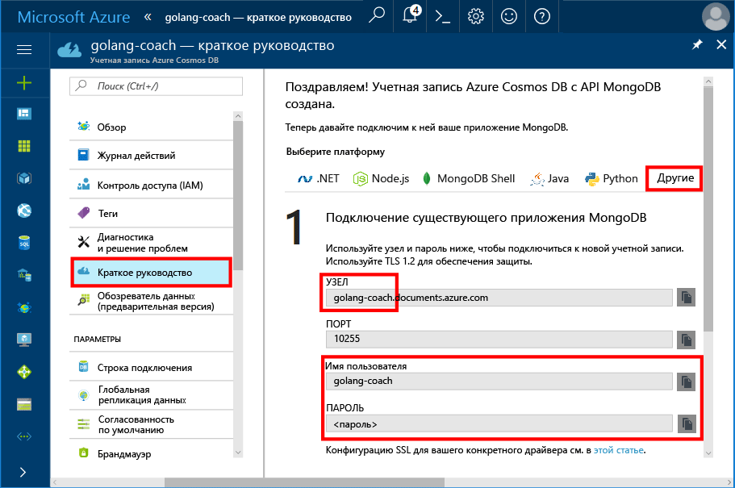
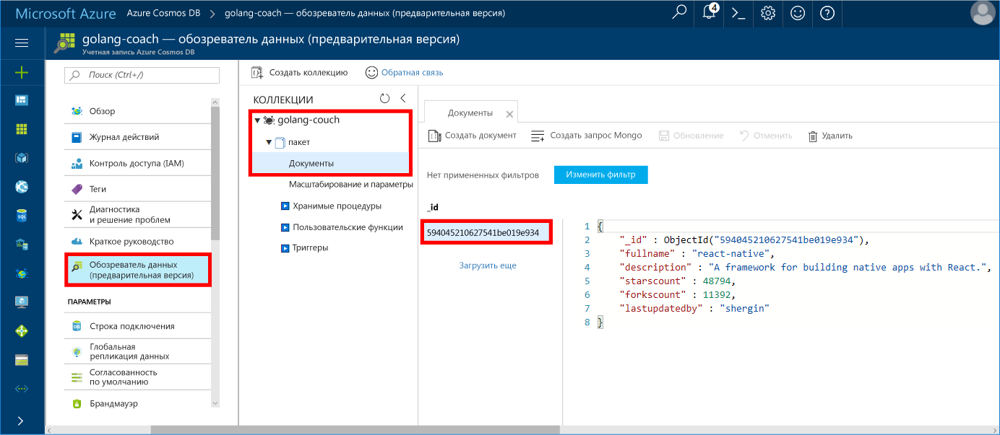

# <a name="azure-cosmos-db-build-a-mongodb-api-console-app-with-golang-and-the-azure-portal"></a><span data-ttu-id="0cade-103">Azure Cosmos DB. Создание консольного приложения API MongoDB с использованием языка Golang и портала Azure</span><span class="sxs-lookup"><span data-stu-id="0cade-103">Azure Cosmos DB: Build a MongoDB API console app with Golang and the Azure portal</span></span>

<span data-ttu-id="0cade-104">Azure Cosmos DB — это глобально распределенная многомодельная служба базы данных Майкрософт.</span><span class="sxs-lookup"><span data-stu-id="0cade-104">Azure Cosmos DB is Microsoft’s globally distributed multi-model database service.</span></span> <span data-ttu-id="0cade-105">Вы можете быстро создавать и запрашивать документы, пары "ключ — значение" и базы данных графов, используя преимущества возможностей глобального распределения и горизонтального масштабирования Azure Cosmos DB.</span><span class="sxs-lookup"><span data-stu-id="0cade-105">You can quickly create and query document, key/value, and graph databases, all of which benefit from the global distribution and horizontal scale capabilities at the core of Azure Cosmos DB.</span></span>

<span data-ttu-id="0cade-106">В этом кратком руководстве описывается, как использовать существующее приложение [MongoDB](https://docs.microsoft.com/en-us/azure/cosmos-db/mongodb-introduction), написанное на [Golang](https://golang.org/), а также как подключить его к базе данных Azure Cosmos DB, поддерживающей клиентские подключения MongoDB.</span><span class="sxs-lookup"><span data-stu-id="0cade-106">This quick-start demonstrates how to use an existing [MongoDB](https://docs.microsoft.com/en-us/azure/cosmos-db/mongodb-introduction) app written in [Golang](https://golang.org/) and connect it to your Azure Cosmos DB database, which supports MongoDB client connections.</span></span>

<span data-ttu-id="0cade-107">Другими словами, только приложение Golang "знает" о подключении к базе данных с помощью API-интерфейсов MongoDB.</span><span class="sxs-lookup"><span data-stu-id="0cade-107">In other words, your Golang application only knows that it's connecting to a database using MongoDB APIs.</span></span> <span data-ttu-id="0cade-108">Приложению понятно, что данные хранятся в службе Azure Cosmos DB.</span><span class="sxs-lookup"><span data-stu-id="0cade-108">It is transparent to the application that the data is stored in Azure Cosmos DB.</span></span>

## <a name="prerequisites"></a><span data-ttu-id="0cade-109">Предварительные требования</span><span class="sxs-lookup"><span data-stu-id="0cade-109">Prerequisites</span></span>

- <span data-ttu-id="0cade-110">Подписка Azure.</span><span class="sxs-lookup"><span data-stu-id="0cade-110">An Azure subscription.</span></span> <span data-ttu-id="0cade-111">Если у вас еще нет подписки Azure, [создайте бесплатную учетную запись Azure](https://azure.microsoft.com/free), прежде чем начинать работу.</span><span class="sxs-lookup"><span data-stu-id="0cade-111">If you don’t have an Azure subscription, create a [free account](https://azure.microsoft.com/free) before you begin.</span></span>
- <span data-ttu-id="0cade-112">[Go](https://golang.org/dl/) и базовые знания о языке [Go](https://golang.org/).</span><span class="sxs-lookup"><span data-stu-id="0cade-112">[Go](https://golang.org/dl/) and a basic knowledge of the [Go](https://golang.org/) language.</span></span>
- <span data-ttu-id="0cade-113">Интегрированная среда разработки: [Gogland](https://www.jetbrains.com/go/), созданная Jetbrains, [Visual Studio Code](https://code.visualstudio.com/) корпорации Майкрософт или [Atom](https://atom.io/).</span><span class="sxs-lookup"><span data-stu-id="0cade-113">An IDE — [Gogland](https://www.jetbrains.com/go/) by Jetbrains, [Visual Studio Code](https://code.visualstudio.com/) by Microsoft, or [Atom](https://atom.io/).</span></span> <span data-ttu-id="0cade-114">В этом руководстве используется Goglang.</span><span class="sxs-lookup"><span data-stu-id="0cade-114">In this tutorial, I'm using Goglang.</span></span>

<a id="create-account"></a>
## <a name="create-a-database-account"></a><span data-ttu-id="0cade-115">Создание учетной записи базы данных</span><span class="sxs-lookup"><span data-stu-id="0cade-115">Create a database account</span></span>

[!INCLUDE [cosmos-db-create-dbaccount](../../includes/cosmos-db-create-dbaccount-mongodb.md)]

## <a name="clone-the-sample-application"></a><span data-ttu-id="0cade-116">Клонирование примера приложения</span><span class="sxs-lookup"><span data-stu-id="0cade-116">Clone the sample application</span></span>

<span data-ttu-id="0cade-117">Клонируйте пример приложения и установите необходимые пакеты.</span><span class="sxs-lookup"><span data-stu-id="0cade-117">Clone the sample application and install the required packages.</span></span>

1. <span data-ttu-id="0cade-118">Создайте папку с именем CosmosDBSample внутри папки GOROOT\src. По умолчанию это папка C:\Go\.</span><span class="sxs-lookup"><span data-stu-id="0cade-118">Create a folder named CosmosDBSample inside the GOROOT\src folder, which is C:\Go\ by default.</span></span>
2. <span data-ttu-id="0cade-119">Выполните следующую команду в окне терминала git, например git bash, чтобы клонировать пример репозитория в папку CosmosDBSample.</span><span class="sxs-lookup"><span data-stu-id="0cade-119">Run the following command using a git terminal window such as git bash to clone the sample repository into the CosmosDBSample folder.</span></span> 

    ```bash
    git clone https://github.com/Azure-Samples/azure-cosmos-db-mongodb-golang-getting-started.git
    ```
3.  <span data-ttu-id="0cade-120">Выполните следующую команду, чтобы получить пакет mgo.</span><span class="sxs-lookup"><span data-stu-id="0cade-120">Run the following command to get the mgo package.</span></span> 

    ```
    go get gopkg.in/mgo.v2
    ```

<span data-ttu-id="0cade-121">Драйвер [mgo](http://labix.org/mgo) (произносится *mango*) — это драйвер [MongoDB](http://www.mongodb.org/) для [языка Go](http://golang.org/), реализующий полнофункциональный и хорошо проверенный набор функций в очень простом API, следуя стандартным идиомам Go.</span><span class="sxs-lookup"><span data-stu-id="0cade-121">The [mgo](http://labix.org/mgo) driver (pronounced as *mango*) is a [MongoDB](http://www.mongodb.org/) driver for the [Go language](http://golang.org/) that implements a rich and well tested selection of features under a very simple API following standard Go idioms.</span></span>

<a id="connection-string"></a>

## <a name="update-your-connection-string"></a><span data-ttu-id="0cade-122">Обновление строки подключения</span><span class="sxs-lookup"><span data-stu-id="0cade-122">Update your connection string</span></span>

<span data-ttu-id="0cade-123">Теперь вернитесь на портал Azure, чтобы получить данные строки подключения. Скопируйте эти данные в приложение.</span><span class="sxs-lookup"><span data-stu-id="0cade-123">Now go back to the Azure portal to get your connection string information and copy it into the app.</span></span>

1. <span data-ttu-id="0cade-124">Выберите раздел **Быстрый запуск** в меню навигации слева, а затем откройте вкладку **Другие**, чтобы просмотреть сведения строки подключения, необходимые для приложения Go.</span><span class="sxs-lookup"><span data-stu-id="0cade-124">Click **Quick start** in the left navigation menu, and then click **Other** to view the connection string information required by the Go application.</span></span>

2. <span data-ttu-id="0cade-125">В Goglang откройте файл main.go в каталоге GOROOT\CosmosDBSample и измените следующие строки кода, используя сведения строки подключения с портала Azure, как показано на следующем снимке экрана.</span><span class="sxs-lookup"><span data-stu-id="0cade-125">In Goglang, open the main.go file in the GOROOT\CosmosDBSample directory and update the following lines of code using the connection string information from the Azure portal as shown in the following screenshot.</span></span> 

    <span data-ttu-id="0cade-126">Имя базы данных — это префикс значения **узла** в области строки подключения на портале Azure.</span><span class="sxs-lookup"><span data-stu-id="0cade-126">The Database name is the prefix of the **Host** value in the Azure portal connection string pane.</span></span> <span data-ttu-id="0cade-127">Для учетной записи, показанной на рисунке ниже, имя базы данных — golang-coach.</span><span class="sxs-lookup"><span data-stu-id="0cade-127">For the account shown in the image below, the Database name is golang-coach.</span></span>

    ```go
    Database: "The prefix of the Host value in the Azure portal",
    Username: "The Username in the Azure portal",
    Password: "The Password in the Azure portal",
    ```

    

3. <span data-ttu-id="0cade-129">Сохраните файл main.go.</span><span class="sxs-lookup"><span data-stu-id="0cade-129">Save the main.go file.</span></span>

## <a name="review-the-code"></a><span data-ttu-id="0cade-130">Просмотр кода</span><span class="sxs-lookup"><span data-stu-id="0cade-130">Review the code</span></span>

<span data-ttu-id="0cade-131">Кратко рассмотрим файл main.go.</span><span class="sxs-lookup"><span data-stu-id="0cade-131">Let's make a quick review of what's happening in the main.go file.</span></span> 

### <a name="connecting-the-go-app-to-azure-cosmos-db"></a><span data-ttu-id="0cade-132">Подключение приложения Go к Azure Cosmos DB</span><span class="sxs-lookup"><span data-stu-id="0cade-132">Connecting the Go app to Azure Cosmos DB</span></span>

<span data-ttu-id="0cade-133">Azure Cosmos DB поддерживает MongoDB с протоколом SSL.</span><span class="sxs-lookup"><span data-stu-id="0cade-133">Azure Cosmos DB supports the SSL-enabled MongoDB.</span></span> <span data-ttu-id="0cade-134">Чтобы подключиться к системе MongoDB с протоколом SSL, необходимо определить функцию **DialServer** в разделе [mgo.DialInfo](http://gopkg.in/mgo.v2#DialInfo) и использовать функцию [tls.*Dial*](http://golang.org/pkg/crypto/tls#Dial) для установки подключения.</span><span class="sxs-lookup"><span data-stu-id="0cade-134">To connect to an SSL-enabled MongoDB, you need to define the **DialServer** function in [mgo.DialInfo](http://gopkg.in/mgo.v2#DialInfo), and make use of the [tls.*Dial*](http://golang.org/pkg/crypto/tls#Dial) function to perform the connection.</span></span>

<span data-ttu-id="0cade-135">Следующий фрагмент кода Golang подключается к приложению Go с помощью API MongoDB Azure Cosmos DB.</span><span class="sxs-lookup"><span data-stu-id="0cade-135">The following Golang code snippet connects the Go app with Azure Cosmos DB MongoDB API.</span></span> <span data-ttu-id="0cade-136">Класс *DialInfo* содержит параметры для установки сеанса подключения к кластеру MongoDB.</span><span class="sxs-lookup"><span data-stu-id="0cade-136">The *DialInfo* class holds options for establishing a session with a MongoDB cluster.</span></span>

```go
// DialInfo holds options for establishing a session with a MongoDB cluster.
dialInfo := &mgo.DialInfo{
    Addrs:    []string{"golang-couch.documents.azure.com:10255"}, // Get HOST + PORT
    Timeout:  60 * time.Second,
    Database: "database", // It can be anything
    Username: "username", // Username
    Password: "Azure database connect password from Azure Portal", // PASSWORD
    DialServer: func(addr *mgo.ServerAddr) (net.Conn, error) {
        return tls.Dial("tcp", addr.String(), &tls.Config{})
    },
}

// Create a session which maintains a pool of socket connections
// to our Azure Cosmos DB MongoDB database.
session, err := mgo.DialWithInfo(dialInfo)

if err != nil {
    fmt.Printf("Can't connect to mongo, go error %v\n", err)
    os.Exit(1)
}

defer session.Close()

// SetSafe changes the session safety mode.
// If the safe parameter is nil, the session is put in unsafe mode, 
// and writes become fire-and-forget,
// without error checking. The unsafe mode is faster since operations won't hold on waiting for a confirmation.
// 
session.SetSafe(&mgo.Safe{})
```

<span data-ttu-id="0cade-137">Метод **mgo.Dial()** используется, когда отсутствует подключение SSL.</span><span class="sxs-lookup"><span data-stu-id="0cade-137">The **mgo.Dial()** method is used when there is no SSL connection.</span></span> <span data-ttu-id="0cade-138">Для подключения SSL требуется метод **mgo.DialWithInfo()**.</span><span class="sxs-lookup"><span data-stu-id="0cade-138">For an SSL connection, the **mgo.DialWithInfo()** method is required.</span></span>

<span data-ttu-id="0cade-139">Экземпляр объекта **DialWIthInfo {}** используется для создания объекта сеанса.</span><span class="sxs-lookup"><span data-stu-id="0cade-139">An instance of the **DialWIthInfo{}** object is used to create the session object.</span></span> <span data-ttu-id="0cade-140">После установки сеанса можно получить доступ к коллекции, используя следующий фрагмент кода:</span><span class="sxs-lookup"><span data-stu-id="0cade-140">Once the session is established, you can access the collection by using the following code snippet:</span></span>

```go
collection := session.DB(“database”).C(“package”)
```

<a id="create-document"></a>

### <a name="create-a-document"></a><span data-ttu-id="0cade-141">Создание документа</span><span class="sxs-lookup"><span data-stu-id="0cade-141">Create a document</span></span>

```go
// Model
type Package struct {
    Id bson.ObjectId  `bson:"_id,omitempty"`
    FullName      string
    Description   string
    StarsCount    int
    ForksCount    int
    LastUpdatedBy string
}

// insert Document in collection
err = collection.Insert(&Package{
    FullName:"react",
    Description:"A framework for building native apps with React.",
    ForksCount: 11392,
    StarsCount:48794,
    LastUpdatedBy:"shergin",

})

if err != nil {
    log.Fatal("Problem inserting data: ", err)
    return
}
```

### <a name="query-or-read-a-document"></a><span data-ttu-id="0cade-142">Запрос к документу или чтение документа</span><span class="sxs-lookup"><span data-stu-id="0cade-142">Query or read a document</span></span>

<span data-ttu-id="0cade-143">Azure Cosmos DB поддерживает полнофункциональные запросы к документам JSON, хранящимся в каждой коллекции.</span><span class="sxs-lookup"><span data-stu-id="0cade-143">Azure Cosmos DB supports rich queries against JSON documents stored in each collection.</span></span> <span data-ttu-id="0cade-144">В следующем примере кода показан выполняемый запрос к документам в коллекции.</span><span class="sxs-lookup"><span data-stu-id="0cade-144">The following sample code shows a query that you can run against the documents in your collection.</span></span>

```go
// Get a Document from the collection
result := Package{}
err = collection.Find(bson.M{"fullname": "react"}).One(&result)
if err != nil {
    log.Fatal("Error finding record: ", err)
    return
}

fmt.Println("Description:", result.Description)
```


### <a name="update-a-document"></a><span data-ttu-id="0cade-145">обновление документа;</span><span class="sxs-lookup"><span data-stu-id="0cade-145">Update a document</span></span>

```go
// Update a document
updateQuery := bson.M{"_id": result.Id}
change := bson.M{"$set": bson.M{"fullname": "react-native"}}
err = collection.Update(updateQuery, change)
if err != nil {
    log.Fatal("Error updating record: ", err)
    return
}
```

### <a name="delete-a-document"></a><span data-ttu-id="0cade-146">Удаление документа</span><span class="sxs-lookup"><span data-stu-id="0cade-146">Delete a document</span></span>

<span data-ttu-id="0cade-147">Azure Cosmos DB поддерживает удаление документов JSON.</span><span class="sxs-lookup"><span data-stu-id="0cade-147">Azure Cosmos DB supports deleting JSON documents.</span></span>

```go
// Delete a document
query := bson.M{"_id": result.Id}
err = collection.Remove(query)
if err != nil {
   log.Fatal("Error deleting record: ", err)
   return
}
```
    
## <a name="run-the-app"></a><span data-ttu-id="0cade-148">Запуск приложения</span><span class="sxs-lookup"><span data-stu-id="0cade-148">Run the app</span></span>

1. <span data-ttu-id="0cade-149">В Goglang убедитесь, что путь GOPATH (находится в меню **File** (Файл), **Settings** (Параметры), **Go**, **GOPATH**) включает расположение, в котором установлен gopkg. По умолчанию это папка ПРОФИЛЬ_ПОЛЬЗОВАТЕЛЯ\go.</span><span class="sxs-lookup"><span data-stu-id="0cade-149">In Goglang, ensure that your GOPATH (available under **File**, **Settings**, **Go**, **GOPATH**) include the location in which the gopkg was installed, which is USERPROFILE\go by default.</span></span> 
2. <span data-ttu-id="0cade-150">Закомментируйте строки, удаляющие документ (строки 91–96), чтобы вы могли видеть документ после запуска приложения.</span><span class="sxs-lookup"><span data-stu-id="0cade-150">Comment out the lines that delete the document, lines 91-96, so that you can see the document after running the app.</span></span>
3. <span data-ttu-id="0cade-151">В Goglang выберите команду **Run** (Выполнить), затем нажмите кнопку **Build main.go and run** (Создать main.go и выполнить).</span><span class="sxs-lookup"><span data-stu-id="0cade-151">In Goglang, click **Run**, and then click **Run 'Build main.go and run'**.</span></span>

    <span data-ttu-id="0cade-152">Будет создано приложение и отобразится описание документа, созданного в разделе [Создание документа](#create-document).</span><span class="sxs-lookup"><span data-stu-id="0cade-152">The app finishes and displays the description of the document created in [Create a document](#create-document).</span></span>
    
    ```
    Description: A framework for building native apps with React.
    
    Process finished with exit code 0
    ```

    
    
## <a name="review-your-document-in-data-explorer"></a><span data-ttu-id="0cade-154">Просмотр документа в обозревателе данных</span><span class="sxs-lookup"><span data-stu-id="0cade-154">Review your document in Data Explorer</span></span>

<span data-ttu-id="0cade-155">Вернитесь на портал Azure, чтобы просмотреть документ в обозревателе данных.</span><span class="sxs-lookup"><span data-stu-id="0cade-155">Go back to the Azure portal to see your document in Data Explorer.</span></span>

1. <span data-ttu-id="0cade-156">Щелкните **Обозреватель данных (предварительная версия)** в меню навигации слева, разверните узел **golang-coach**, **Пакет**, а затем выберите раздел **Документы**.</span><span class="sxs-lookup"><span data-stu-id="0cade-156">Click **Data Explorer (Preview)** in the left navigation menu, expand **golang-coach**, **package**, and then click **Documents**.</span></span> <span data-ttu-id="0cade-157">На вкладке **Документы** щелкните \_идентификатор, чтобы открыть документ на панели справа.</span><span class="sxs-lookup"><span data-stu-id="0cade-157">In the **Documents** tab, click the \_id to display the document in the right pane.</span></span> 

    
    
2. <span data-ttu-id="0cade-159">Вы можете работать со встроенным документом. Чтобы сохранить его, нажмите кнопку **Обновить**.</span><span class="sxs-lookup"><span data-stu-id="0cade-159">You can then work with the document inline and click **Update** to save it.</span></span> <span data-ttu-id="0cade-160">Вы также можете удалить документ или создать новые документы или запросы.</span><span class="sxs-lookup"><span data-stu-id="0cade-160">You can also delete the document, or create new documents or queries.</span></span>

## <a name="review-slas-in-the-azure-portal"></a><span data-ttu-id="0cade-161">Просмотр соглашений об уровне обслуживания на портале Azure</span><span class="sxs-lookup"><span data-stu-id="0cade-161">Review SLAs in the Azure portal</span></span>

[!INCLUDE [cosmosdb-tutorial-review-slas](../../includes/cosmos-db-tutorial-review-slas.md)]

## <a name="clean-up-resources"></a><span data-ttu-id="0cade-162">Очистка ресурсов</span><span class="sxs-lookup"><span data-stu-id="0cade-162">Clean up resources</span></span>

<span data-ttu-id="0cade-163">Если вы не собираетесь использовать это приложение дальше, удалите все ресурсы, созданные в ходе работы с этим руководством, на портале Azure, сделав следующее:</span><span class="sxs-lookup"><span data-stu-id="0cade-163">If you're not going to continue to use this app, delete all resources created by this quickstart in the Azure portal with the following steps:</span></span>

1. <span data-ttu-id="0cade-164">В меню слева на портале Azure щелкните **Группы ресурсов**, а затем выберите имя созданного ресурса.</span><span class="sxs-lookup"><span data-stu-id="0cade-164">From the left-hand menu in the Azure portal, click **Resource groups** and then click the name of the resource you created.</span></span> 
2. <span data-ttu-id="0cade-165">На странице группы ресурсов щелкните **Удалить**, в текстовом поле введите имя ресурса для удаления и щелкните **Удалить**.</span><span class="sxs-lookup"><span data-stu-id="0cade-165">On your resource group page, click **Delete**, type the name of the resource to delete in the text box, and then click **Delete**.</span></span>

## <a name="next-steps"></a><span data-ttu-id="0cade-166">Дальнейшие действия</span><span class="sxs-lookup"><span data-stu-id="0cade-166">Next steps</span></span>

<span data-ttu-id="0cade-167">В этом кратком руководстве вы узнали, как создать учетную запись Azure Cosmos DB и запустить приложение Golang, используя API MongoDB.</span><span class="sxs-lookup"><span data-stu-id="0cade-167">In this quickstart, you've learned how to create an Azure Cosmos DB account and run a Golang app using the API for MongoDB.</span></span> <span data-ttu-id="0cade-168">Теперь можно импортировать дополнительные данные в учетную запись Azure Cosmos DB.</span><span class="sxs-lookup"><span data-stu-id="0cade-168">You can now import additional data to your Cosmos DB account.</span></span> 

> [!div class="nextstepaction"]
> [<span data-ttu-id="0cade-169">Перенос данных в DocumentDB с помощью mongoimport и mongorestore</span><span class="sxs-lookup"><span data-stu-id="0cade-169">Import data into Azure Cosmos DB for the MongoDB API</span></span>](mongodb-migrate.md)
