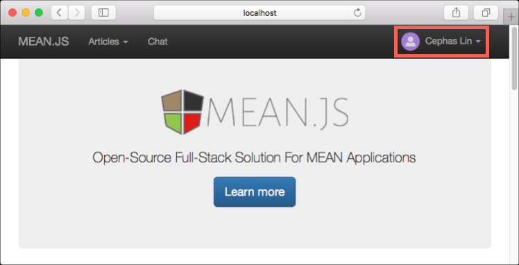
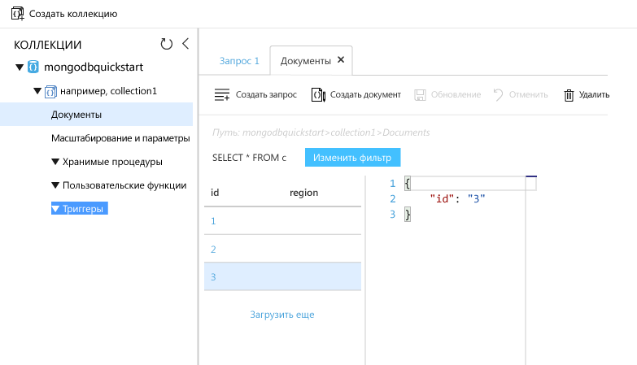

# <a name="azure-cosmos-db-migrate-an-existing-nodejs-mongodb-web-app"></a><span data-ttu-id="2db42-103">Azure Cosmos DB. Перемещение имеющегося веб-приложения MongoDB Node.js</span><span class="sxs-lookup"><span data-stu-id="2db42-103">Azure Cosmos DB: Migrate an existing Node.js MongoDB web app</span></span> 

<span data-ttu-id="2db42-104">Azure Cosmos DB — это глобально распределенная многомодельная служба базы данных Майкрософт.</span><span class="sxs-lookup"><span data-stu-id="2db42-104">Azure Cosmos DB is Microsoft’s globally distributed multi-model database service.</span></span> <span data-ttu-id="2db42-105">Вы можете быстро создавать и запрашивать документы, пары "ключ — значение" и базы данных графов, используя преимущества возможностей глобального распределения и горизонтального масштабирования Azure Cosmos DB.</span><span class="sxs-lookup"><span data-stu-id="2db42-105">You can quickly create and query document, key/value, and graph databases, all of which benefit from the global distribution and horizontal scale capabilities at the core of Azure Cosmos DB.</span></span> 

<span data-ttu-id="2db42-106">В этом кратком руководстве описывается, как использовать имеющееся приложение [MongoDB](mongodb-introduction.md), написанное на Node.js, а также как подключить его к базе данных Azure Cosmos DB, поддерживающей клиентские подключения MongoDB.</span><span class="sxs-lookup"><span data-stu-id="2db42-106">This quickstart demonstrates how to use an existing [MongoDB](mongodb-introduction.md) app written in Node.js and connect it to your Azure Cosmos DB database, which supports MongoDB client connections.</span></span> <span data-ttu-id="2db42-107">Другими словами, только приложение Node.js "знает" о подключении к базе данных с помощью API-интерфейсов MongoDB.</span><span class="sxs-lookup"><span data-stu-id="2db42-107">In other words, your Node.js application only knows that it's connecting to a database using MongoDB APIs.</span></span> <span data-ttu-id="2db42-108">Приложению понятно, что данные хранятся в службе Azure Cosmos DB.</span><span class="sxs-lookup"><span data-stu-id="2db42-108">It is transparent to the application that the data is stored in Azure Cosmos DB.</span></span>

<span data-ttu-id="2db42-109">После выполнения шагов, описанных в этом руководстве, у вас будет приложение MEAN (MongoDB, Express, AngularJS и Node.js), выполняющееся в [Azure Cosmos DB](https://azure.microsoft.com/services/cosmos-db/).</span><span class="sxs-lookup"><span data-stu-id="2db42-109">When you are done, you will have a MEAN application (MongoDB, Express, AngularJS, and Node.js) running on [Azure Cosmos DB](https://azure.microsoft.com/services/cosmos-db/).</span></span> 


[!INCLUDE [cloud-shell-try-it](../../includes/cloud-shell-try-it.md)]

<span data-ttu-id="2db42-111">Если вы решили установить и использовать интерфейс командной строки локально, для работы с этим руководством вам понадобится Azure CLI 2.0 или более поздней версии.</span><span class="sxs-lookup"><span data-stu-id="2db42-111">If you choose to install and use the CLI locally, this topic requires that you are running the Azure CLI version 2.0 or later.</span></span> <span data-ttu-id="2db42-112">Чтобы узнать версию, выполните команду `az --version`.</span><span class="sxs-lookup"><span data-stu-id="2db42-112">Run `az --version` to find the version.</span></span> <span data-ttu-id="2db42-113">Если вам необходимо выполнить установку или обновление, см. статью [Установка Azure CLI 2.0]( /cli/azure/install-azure-cli).</span><span class="sxs-lookup"><span data-stu-id="2db42-113">If you need to install or upgrade, see [Install Azure CLI 2.0]( /cli/azure/install-azure-cli).</span></span> 

## <a name="prerequisites"></a><span data-ttu-id="2db42-114">Предварительные требования</span><span class="sxs-lookup"><span data-stu-id="2db42-114">Prerequisites</span></span> 
<span data-ttu-id="2db42-115">Кроме Azure CLI, вам нужно локально установить [Node.js](https://nodejs.org/) и [Git](http://www.git-scm.com/downloads) для выполнения команд `npm` и `git`.</span><span class="sxs-lookup"><span data-stu-id="2db42-115">In addition to Azure CLI, you need [Node.js](https://nodejs.org/) and [Git](http://www.git-scm.com/downloads) installed locally to run `npm` and `git` commands.</span></span>

<span data-ttu-id="2db42-116">У вас должен быть опыт работы с Node.js.</span><span class="sxs-lookup"><span data-stu-id="2db42-116">You should have working knowledge of Node.js.</span></span> <span data-ttu-id="2db42-117">В целом разработка приложений Node.js в этом кратком руководстве не рассматривается.</span><span class="sxs-lookup"><span data-stu-id="2db42-117">This quickstart is not intended to help you with developing Node.js applications in general.</span></span>

## <a name="clone-the-sample-application"></a><span data-ttu-id="2db42-118">Клонирование примера приложения</span><span class="sxs-lookup"><span data-stu-id="2db42-118">Clone the sample application</span></span>

<span data-ttu-id="2db42-119">Откройте окно терминала Git, например Git Bash, и выполните команду `cd`, чтобы перейти в рабочий каталог.</span><span class="sxs-lookup"><span data-stu-id="2db42-119">Open a git terminal window, such as git bash, and `cd` to a working directory.</span></span>  

<span data-ttu-id="2db42-120">Затем выполните следующие команды, чтобы клонировать репозиторий с примером.</span><span class="sxs-lookup"><span data-stu-id="2db42-120">Run the following commands to clone the sample repository.</span></span> <span data-ttu-id="2db42-121">Этот репозиторий с примером содержит приложение по умолчанию [MEAN.js](http://meanjs.org/).</span><span class="sxs-lookup"><span data-stu-id="2db42-121">This sample repository contains the default [MEAN.js](http://meanjs.org/) application.</span></span> 

```bash
git clone https://github.com/prashanthmadi/mean
```

## <a name="run-the-application"></a><span data-ttu-id="2db42-122">Выполнение приложения</span><span class="sxs-lookup"><span data-stu-id="2db42-122">Run the application</span></span>

<span data-ttu-id="2db42-123">Установите необходимые пакеты и запустите приложение.</span><span class="sxs-lookup"><span data-stu-id="2db42-123">Install the required packages and start the application.</span></span>

```bash
cd mean
npm install
npm start
```

## <a name="log-in-to-azure"></a><span data-ttu-id="2db42-124">Вход в Azure</span><span class="sxs-lookup"><span data-stu-id="2db42-124">Log in to Azure</span></span>

<span data-ttu-id="2db42-125">Если вы используете установленную версию Azure CLI, войдите в подписку Azure с помощью команды [az login](/cli/azure/#login) и следуйте инструкциям на экране.</span><span class="sxs-lookup"><span data-stu-id="2db42-125">If you are using an installed Azure CLI, log in to your Azure subscription with the [az login](/cli/azure/#login) command and follow the on-screen directions.</span></span> <span data-ttu-id="2db42-126">Этот шаг можно пропустить, если вы используете Azure Cloud Shell.</span><span class="sxs-lookup"><span data-stu-id="2db42-126">You can skip this step if you're using the Azure Cloud Shell.</span></span>

```azurecli
az login 
``` 
   
## <a name="add-the-azure-cosmos-db-module"></a><span data-ttu-id="2db42-127">Добавление модуля Azure Cosmos DB</span><span class="sxs-lookup"><span data-stu-id="2db42-127">Add the Azure Cosmos DB module</span></span>

<span data-ttu-id="2db42-128">Если вы используете установленную версию Azure CLI, проверьте наличие компонента `cosmosdb`, выполнив команду `az`.</span><span class="sxs-lookup"><span data-stu-id="2db42-128">If you are using an installed Azure CLI, check to see if the `cosmosdb` component is already installed by running the `az` command.</span></span> <span data-ttu-id="2db42-129">Если компонент `cosmosdb` включен в список базовых команд, перейдите к следующей команде.</span><span class="sxs-lookup"><span data-stu-id="2db42-129">If `cosmosdb` is in the list of base commands, proceed to the next command.</span></span> <span data-ttu-id="2db42-130">Этот шаг можно пропустить, если вы используете Azure Cloud Shell.</span><span class="sxs-lookup"><span data-stu-id="2db42-130">You can skip this step if you're using the Azure Cloud Shell.</span></span>

<span data-ttu-id="2db42-131">Если компонента `cosmosdb` нет в списке базовых команд, переустановите [Azure CLI 2.0]( /cli/azure/install-azure-cli).</span><span class="sxs-lookup"><span data-stu-id="2db42-131">If `cosmosdb` is not in the list of base commands, reinstall [Azure CLI 2.0]( /cli/azure/install-azure-cli).</span></span>

## <a name="create-a-resource-group"></a><span data-ttu-id="2db42-132">Создание группы ресурсов</span><span class="sxs-lookup"><span data-stu-id="2db42-132">Create a resource group</span></span>

<span data-ttu-id="2db42-133">Создайте [группу ресурсов](../azure-resource-manager/resource-group-overview.md) с помощью команды [az group create](/cli/azure/group#create).</span><span class="sxs-lookup"><span data-stu-id="2db42-133">Create a [resource group](../azure-resource-manager/resource-group-overview.md) with the [az group create](/cli/azure/group#create).</span></span> <span data-ttu-id="2db42-134">Группа ресурсов Azure — это логический контейнер, в котором происходит развертывание ресурсов Azure (веб-приложений, баз данных и учетных записей хранения) и управление ими.</span><span class="sxs-lookup"><span data-stu-id="2db42-134">An Azure resource group is a logical container into which Azure resources like web apps, databases and storage accounts are deployed and managed.</span></span> 

<span data-ttu-id="2db42-135">В следующем примере показано создание группы ресурсов в регионе "Западная Европа".</span><span class="sxs-lookup"><span data-stu-id="2db42-135">The following example creates a resource group in the West Europe region.</span></span> <span data-ttu-id="2db42-136">Выберите уникальное имя для группы ресурсов.</span><span class="sxs-lookup"><span data-stu-id="2db42-136">Choose a unique name for the resource group.</span></span>

<span data-ttu-id="2db42-137">Если вы используете Azure Cloud Shell, щелкните **Попробовать**, войдите в систему, следуя указаниям на экране, а затем скопируйте команду в командную строку.</span><span class="sxs-lookup"><span data-stu-id="2db42-137">If you are using Azure Cloud Shell, click **Try It**, follow the onscreen prompts to login, then copy the command into the command prompt.</span></span>

```azurecli-interactive
az group create --name myResourceGroup --location "West Europe"
```

## <a name="create-an-azure-cosmos-db-account"></a><span data-ttu-id="2db42-138">создание учетной записи Azure Cosmos DB;</span><span class="sxs-lookup"><span data-stu-id="2db42-138">Create an Azure Cosmos DB account</span></span>

<span data-ttu-id="2db42-139">Создайте учетную запись Azure Cosmos DB с помощью команды [az cosmosdb create](/cli/azure/cosmosdb#create).</span><span class="sxs-lookup"><span data-stu-id="2db42-139">Create an Azure Cosmos DB account with the [az cosmosdb create](/cli/azure/cosmosdb#create) command.</span></span>

<span data-ttu-id="2db42-140">В следующей команде замените `<cosmosdb-name>` уникальным именем своей базы данных Azure Cosmos DB везде, где встречается этот заполнитель.</span><span class="sxs-lookup"><span data-stu-id="2db42-140">In the following command, please substitute your own unique Azure Cosmos DB account name where you see the `<cosmosdb-name>` placeholder.</span></span> <span data-ttu-id="2db42-141">Это уникальное имя будет использоваться как часть конечной точки Azure Cosmos DB (`https://<cosmosdb-name>.documents.azure.com/`), поэтому оно должно быть уникальным для всех учетных записей Cosmos DB в Azure.</span><span class="sxs-lookup"><span data-stu-id="2db42-141">This unique name will be used as part of your Azure Cosmos DB endpoint (`https://<cosmosdb-name>.documents.azure.com/`), so the name needs to be unique across all Azure Cosmos DB accounts in Azure.</span></span> 

```azurecli-interactive
az cosmosdb create --name <cosmosdb-name> --resource-group myResourceGroup --kind MongoDB
```

<span data-ttu-id="2db42-142">Параметр `--kind MongoDB` разрешает клиентские подключения MongoDB.</span><span class="sxs-lookup"><span data-stu-id="2db42-142">The `--kind MongoDB` parameter enables MongoDB client connections.</span></span>

<span data-ttu-id="2db42-143">После создания учетной записи Azure Cosmos DB в Azure CLI отображаются сведения, схожие с теми, которые приведены ниже.</span><span class="sxs-lookup"><span data-stu-id="2db42-143">When the Azure Cosmos DB account is created, the Azure CLI shows information similar to the following example.</span></span> 

> [!NOTE]
> <span data-ttu-id="2db42-144">В этом примере JSON по умолчанию используется как формат выходных данных Azure CLI.</span><span class="sxs-lookup"><span data-stu-id="2db42-144">This example uses JSON as the Azure CLI output format, which is the default.</span></span> <span data-ttu-id="2db42-145">Чтобы использовать другой формат выходных данных, см. статью [Форматы выходных данных для команд Azure CLI 2.0](https://docs.microsoft.com/cli/azure/format-output-azure-cli).</span><span class="sxs-lookup"><span data-stu-id="2db42-145">To use another output format, see [Output formats for Azure CLI 2.0 commands](https://docs.microsoft.com/cli/azure/format-output-azure-cli).</span></span>

```json
{
  "databaseAccountOfferType": "Standard",
  "documentEndpoint": "https://<cosmosdb-name>.documents.azure.com:443/",
  "id": "/subscriptions/00000000-0000-0000-0000-000000000000/resourceGroups/myResourceGroup/providers/Microsoft.Document
DB/databaseAccounts/<cosmosdb-name>",
  "kind": "MongoDB",
  "location": "West Europe",
  "name": "<cosmosdb-name>",
  "readLocations": [
    {
      "documentEndpoint": "https://<cosmosdb-name>-westeurope.documents.azure.com:443/",
      "failoverPriority": 0,
      "id": "<cosmosdb-name>-westeurope",
      "locationName": "West Europe",
      "provisioningState": "Succeeded"
    }
  ],
  "resourceGroup": "myResourceGroup",
  "type": "Microsoft.DocumentDB/databaseAccounts",
  "writeLocations": [
    {
      "documentEndpoint": "https://<cosmosdb-name>-westeurope.documents.azure.com:443/",
      "failoverPriority": 0,
      "id": "<cosmosdb-name>-westeurope",
      "locationName": "West Europe",
      "provisioningState": "Succeeded"
    }
  ]
} 
```

## <a name="connect-your-nodejs-application-to-the-database"></a><span data-ttu-id="2db42-146">Подключение приложения Node.js к базе данных</span><span class="sxs-lookup"><span data-stu-id="2db42-146">Connect your Node.js application to the database</span></span>

<span data-ttu-id="2db42-147">На этом шаге вы подключите пример приложения MEAN.js к только что созданной базе данных Azure Cosmos DB с помощью строки подключения MongoDB.</span><span class="sxs-lookup"><span data-stu-id="2db42-147">In this step, you connect your MEAN.js sample application to an Azure Cosmos DB database you just created, using a MongoDB connection string.</span></span> 

<a name="devconfig"></a>
## <a name="configure-the-connection-string-in-your-nodejs-application"></a><span data-ttu-id="2db42-148">Настройка строки подключения в приложении Node.js</span><span class="sxs-lookup"><span data-stu-id="2db42-148">Configure the connection string in your Node.js application</span></span>

<span data-ttu-id="2db42-149">В репозитории MEAN.js откройте `config/env/local-development.js`.</span><span class="sxs-lookup"><span data-stu-id="2db42-149">In your MEAN.js repository, open `config/env/local-development.js`.</span></span>

<span data-ttu-id="2db42-150">Замените содержимое этого файла приведенным ниже кодом.</span><span class="sxs-lookup"><span data-stu-id="2db42-150">Replace the content of this file with the following code.</span></span> <span data-ttu-id="2db42-151">Замени также два заполнителя `<cosmosdb-name>` на имя учетной записи Azure Cosmos DB.</span><span class="sxs-lookup"><span data-stu-id="2db42-151">Be sure to also replace the two `<cosmosdb-name>` placeholders with your Azure Cosmos DB account name.</span></span>

```javascript
'use strict';

module.exports = {
  db: {
    uri: 'mongodb://<cosmosdb-name>:<primary_master_key>@<cosmosdb-name>.documents.azure.com:10255/mean-dev?ssl=true&sslverifycertificate=false'
  }
};
```

## <a name="retrieve-the-key"></a><span data-ttu-id="2db42-152">Получение ключа</span><span class="sxs-lookup"><span data-stu-id="2db42-152">Retrieve the key</span></span>

<span data-ttu-id="2db42-153">Чтобы подключиться к базе данных Azure Cosmos DB, вам понадобится ключ базы данных.</span><span class="sxs-lookup"><span data-stu-id="2db42-153">In order to connect to an Azure Cosmos DB database, you need the database key.</span></span> <span data-ttu-id="2db42-154">Чтобы получить первичный ключ, выполните команду [az cosmosdb list-keys](/cli/azure/cosmosdb#list-keys).</span><span class="sxs-lookup"><span data-stu-id="2db42-154">Use the [az cosmosdb list-keys](/cli/azure/cosmosdb#list-keys) command to retrieve the primary key.</span></span>

```azurecli-interactive
az cosmosdb list-keys --name <cosmosdb-name> --resource-group myResourceGroup --query "primaryMasterKey"
```

<span data-ttu-id="2db42-155">В Azure CLI отображаются сведения, подобные следующим:</span><span class="sxs-lookup"><span data-stu-id="2db42-155">The Azure CLI outputs information similar to the following example.</span></span> 

```json
"RUayjYjixJDWG5xTqIiXjC..."
```

<span data-ttu-id="2db42-156">Скопируйте значение `primaryMasterKey`.</span><span class="sxs-lookup"><span data-stu-id="2db42-156">Copy the value of `primaryMasterKey`.</span></span> <span data-ttu-id="2db42-157">Вставить это над `<primary_master_key>` в `local-development.js`.</span><span class="sxs-lookup"><span data-stu-id="2db42-157">Paste this over the  `<primary_master_key>` in `local-development.js`.</span></span>

<span data-ttu-id="2db42-158">Сохраните изменения.</span><span class="sxs-lookup"><span data-stu-id="2db42-158">Save your changes.</span></span>

### <a name="run-the-application-again"></a><span data-ttu-id="2db42-159">Повторный запуск приложения</span><span class="sxs-lookup"><span data-stu-id="2db42-159">Run the application again.</span></span>

<span data-ttu-id="2db42-160">Еще раз запустите `npm start`.</span><span class="sxs-lookup"><span data-stu-id="2db42-160">Run `npm start` again.</span></span> 

```bash
npm start
```

<span data-ttu-id="2db42-161">Должно появиться сообщение консоли, что среда разработки подготовлена к работе.</span><span class="sxs-lookup"><span data-stu-id="2db42-161">A console message should now tell you that the development environment is up and running.</span></span> 

<span data-ttu-id="2db42-162">Откройте браузер и перейдите по адресу `http://localhost:3000`.</span><span class="sxs-lookup"><span data-stu-id="2db42-162">Navigate to `http://localhost:3000` in a browser.</span></span> <span data-ttu-id="2db42-163">Щелкните **регистрацию** в верхней области меню и создайте двух фиктивных пользователей.</span><span class="sxs-lookup"><span data-stu-id="2db42-163">Click **Sign Up** in the top menu and try to create two dummy users.</span></span> 

<span data-ttu-id="2db42-164">В примере приложения MEAN.js данные пользователя хранятся в базе данных.</span><span class="sxs-lookup"><span data-stu-id="2db42-164">The MEAN.js sample application stores user data in the database.</span></span> <span data-ttu-id="2db42-165">Если все получилось и вы вошли в приложение MEAN.js под созданным пользователем, это означает, что подключение Azure Cosmos DB работает.</span><span class="sxs-lookup"><span data-stu-id="2db42-165">If you are successful and MEAN.js automatically signs into the created user, then your Azure Cosmos DB connection is working.</span></span> 



## <a name="view-data-in-data-explorer"></a><span data-ttu-id="2db42-167">Просмотр данных в обозревателе данных</span><span class="sxs-lookup"><span data-stu-id="2db42-167">View data in Data Explorer</span></span>

<span data-ttu-id="2db42-168">Данные, сохраненные Azure Cosmos DB, доступны для просмотра, запроса и выполнения бизнес-логики на портале Azure.</span><span class="sxs-lookup"><span data-stu-id="2db42-168">Data stored by an Azure Cosmos DB is available to view, query, and run business-logic on in the Azure portal.</span></span>

<span data-ttu-id="2db42-169">Чтобы просмотреть данные пользователя, созданные на предыдущем шаге, запросить их и начать с ними работать, войдите на [портал Azure](https://portal.azure.com) с помощью своего браузера.</span><span class="sxs-lookup"><span data-stu-id="2db42-169">To view, query, and work with the user data created in the previous step, login to the [Azure portal](https://portal.azure.com) in your web browser.</span></span>

<span data-ttu-id="2db42-170">В поле поиска в верхней области введите Azure Cosmos DB.</span><span class="sxs-lookup"><span data-stu-id="2db42-170">In the top Search box, type Azure Cosmos DB.</span></span> <span data-ttu-id="2db42-171">Когда откроется колонка учетной записи Cosmos DB, выберите свою учетную запись Cosmos DB.</span><span class="sxs-lookup"><span data-stu-id="2db42-171">When your Cosmos DB account blade opens, select your Cosmos DB account.</span></span> <span data-ttu-id="2db42-172">В левой области навигации щелкните обозреватель данных.</span><span class="sxs-lookup"><span data-stu-id="2db42-172">In the left navigation, click Data Explorer.</span></span> <span data-ttu-id="2db42-173">Разверните свою коллекцию на панели коллекций. Вы сможете увидеть документы в коллекции, запросить данные и даже создать и запустить хранимые процедуры, триггеры и определенные пользователем функции.</span><span class="sxs-lookup"><span data-stu-id="2db42-173">Expand your collection in the Collections pane, and then you can view the documents in the collection, query the data, and even create and run stored procedures, triggers, and UDFs.</span></span> 




## <a name="deploy-the-nodejs-application-to-azure"></a><span data-ttu-id="2db42-175">Развертывание приложения Node.js в Azure</span><span class="sxs-lookup"><span data-stu-id="2db42-175">Deploy the Node.js application to Azure</span></span>

<span data-ttu-id="2db42-176">На этом шаге вы развернете приложение Node.js, подключенное к MongoDB, в службе Azure Cosmos DB.</span><span class="sxs-lookup"><span data-stu-id="2db42-176">In this step, you deploy your MongoDB-connected Node.js application to Azure Cosmos DB.</span></span>

<span data-ttu-id="2db42-177">Заметьте, что файл конфигурации, измененный ранее, понадобится для среды разработки (`/config/env/local-development.js`).</span><span class="sxs-lookup"><span data-stu-id="2db42-177">You may have noticed that the configuration file that you changed earlier is for the development environment (`/config/env/local-development.js`).</span></span> <span data-ttu-id="2db42-178">Когда вы развернете приложение в службу приложений, оно запустится в рабочей среде по умолчанию.</span><span class="sxs-lookup"><span data-stu-id="2db42-178">When you deploy your application to App Service, it will run in the production environment by default.</span></span> <span data-ttu-id="2db42-179">Таким образом, вам необходимо внести те же изменения в соответствующий файл конфигурации.</span><span class="sxs-lookup"><span data-stu-id="2db42-179">So now, you need to make the same change to the respective configuration file.</span></span>

<span data-ttu-id="2db42-180">В репозитории MEAN.js откройте `config/env/production.js`.</span><span class="sxs-lookup"><span data-stu-id="2db42-180">In your MEAN.js repository, open `config/env/production.js`.</span></span>

<span data-ttu-id="2db42-181">В объекте `db` замените значение `uri`, как показано в следующем примере.</span><span class="sxs-lookup"><span data-stu-id="2db42-181">In the `db` object, replace the value of `uri` as show in the following example.</span></span> <span data-ttu-id="2db42-182">Обязательно замените заполнители на фактические значения, как и в прошлый раз.</span><span class="sxs-lookup"><span data-stu-id="2db42-182">Be sure to replace the placeholders as before.</span></span>

```javascript
'mongodb://<cosmosdb-name>:<primary_master_key>@<cosmosdb-name>.documents.azure.com:10255/mean?ssl=true&sslverifycertificate=false',
```

> [!NOTE] 
> <span data-ttu-id="2db42-183">Параметр `ssl=true` важен, так как [Azure Cosmos DB требуется протокол SSL](connect-mongodb-account.md#connection-string-requirements).</span><span class="sxs-lookup"><span data-stu-id="2db42-183">The `ssl=true` option is important because [Azure Cosmos DB requires SSL](connect-mongodb-account.md#connection-string-requirements).</span></span> 
>
>

<span data-ttu-id="2db42-184">В окне терминала зафиксируйте все изменения в Git.</span><span class="sxs-lookup"><span data-stu-id="2db42-184">In the terminal, commit all your changes into Git.</span></span> <span data-ttu-id="2db42-185">Вы можете скопировать обе команды, чтобы выполнить их вместе.</span><span class="sxs-lookup"><span data-stu-id="2db42-185">You can copy both commands to run them together.</span></span>

```bash
git add .
git commit -m "configured MongoDB connection string"
```
## <a name="clean-up-resources"></a><span data-ttu-id="2db42-186">Очистка ресурсов</span><span class="sxs-lookup"><span data-stu-id="2db42-186">Clean up resources</span></span>

<span data-ttu-id="2db42-187">Если вы не собираетесь использовать это приложение дальше, удалите все ресурсы, созданные в ходе работы с этим руководством, на портале Azure, сделав следующее:</span><span class="sxs-lookup"><span data-stu-id="2db42-187">If you're not going to continue to use this app, delete all resources created by this quickstart in the Azure portal with the following steps:</span></span>

1. <span data-ttu-id="2db42-188">В меню слева на портале Azure щелкните **Группы ресурсов**, а затем выберите имя созданного ресурса.</span><span class="sxs-lookup"><span data-stu-id="2db42-188">From the left-hand menu in the Azure portal, click **Resource groups** and then click the name of the resource you created.</span></span> 
2. <span data-ttu-id="2db42-189">На странице группы ресурсов щелкните **Удалить**, в текстовом поле введите имя ресурса для удаления и щелкните **Удалить**.</span><span class="sxs-lookup"><span data-stu-id="2db42-189">On your resource group page, click **Delete**, type the name of the resource to delete in the text box, and then click **Delete**.</span></span>

## <a name="next-steps"></a><span data-ttu-id="2db42-190">Дальнейшие действия</span><span class="sxs-lookup"><span data-stu-id="2db42-190">Next steps</span></span>

<span data-ttu-id="2db42-191">Из этого краткого руководства вы узнали, как создать учетную запись Azure Cosmos DB и коллекцию MongoDB с помощью обозревателя данных.</span><span class="sxs-lookup"><span data-stu-id="2db42-191">In this quickstart, you've learned how to create an Azure Cosmos DB account and create a MongoDB collection using the Data Explorer.</span></span> <span data-ttu-id="2db42-192">Теперь вы можете перенести свои данные MongoDB в Azure Cosmos DB.</span><span class="sxs-lookup"><span data-stu-id="2db42-192">You can now migrate your MongoDB data to Azure Cosmos DB.</span></span>  

> [!div class="nextstepaction"]
> [<span data-ttu-id="2db42-193">Перенос данных в DocumentDB с помощью mongoimport и mongorestore</span><span class="sxs-lookup"><span data-stu-id="2db42-193">Import MongoDB data into Azure Cosmos DB</span></span>](mongodb-migrate.md)
