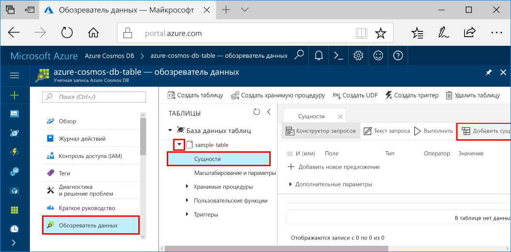

# <a name="azure-cosmos-db-build-a-net-application-using-hello-table-api"></a>Azure Cosmos DB: Сборка приложений .NET, использующих hello API таблиц

Azure Cosmos DB — это глобально распределенная многомодельная служба базы данных Майкрософт. Вы можете быстро создать и запрашивать документа, ключ значение и graph баз данных, все из которых преимущества глобального распространения hello и возможности горизонтального масштабирования в основе hello Azure Cosmos БД. 

В этом кратком руководстве показано, как toocreate Cosmos Azure DB учетную запись, а также создать таблицу в этой учетной записи, с помощью портала Azure hello. Вы затем написать код tooinsert, обновления и удаления сущностей, а также выполнение некоторых запросов, с помощью hello новый [таблиц Premium хранилища Windows Azure](https://aka.ms/premiumtablenuget) (Предварительная версия) пакета из NuGet. Эта библиотека имеет hello же классах и подписях методов как hello public [пакет SDK хранилища Windows Azure](https://www.nuget.org/packages/WindowsAzure.Storage), но также имеет hello возможности tooconnect tooAzure Cosmos DB учетным записям hello [API таблиц](table-introduction.md) (Предварительная версия). 

## <a name="prerequisites"></a>Предварительные требования

Если у вас еще нет Visual Studio 2017 г. установлен, можно загрузить и использовать hello **свободного** [2017 г. Visual Studio Community Edition](https://www.visualstudio.com/downloads/). Убедитесь, что включен **разработки Azure** во время установки Visual Studio hello.

[!INCLUDE [quickstarts-free-trial-note](../../includes/quickstarts-free-trial-note.md)]

## <a name="create-a-database-account"></a>Создание учетной записи базы данных

[!INCLUDE [cosmos-db-create-dbaccount-table](../../includes/cosmos-db-create-dbaccount-table.md)]

## <a name="add-a-table"></a>Добавление таблицы

[!INCLUDE [cosmos-db-create-table](../../includes/cosmos-db-create-table.md)]

## <a name="add-sample-data"></a>Добавление демонстрационных данных

Теперь можно добавить новую таблицу данных tooyour с помощью данных обозревателя (Предварительная версия).

1. В обозревателе данных разверните **пример таблицы**, затем щелкните **Сущности** и нажмите кнопку **Добавление сущности**.

   
2. Теперь добавьте поле значений данных toohello PartitionKey и RowKey значение поле и нажмите **Добавление сущности**.

   
  
    Теперь можно добавить дополнительные таблицы tooyour сущностей, изменение сущности или запроса данных в обозревателе данных. Обозреватель данных — также, где можно масштабировать пропускную способность и добавить хранимые процедуры, определяемые пользователем функции и триггеры tooyour таблицы.

## <a name="clone-hello-sample-application"></a>Пример приложения hello клонирования

Теперь давайте клонировать приложении таблицы из github, задайте строку подключения hello и запустите его. Вы увидите, как просто можно toowork с данными программными средствами. 

1. Откройте окно терминала git, таких как git bash и `cd` tooa рабочий каталог.  

2. Выполнения hello следующая команда репозитории примеров tooclone hello. 

    ```bash
    git clone https://github.com/Azure-Samples/azure-cosmos-db-table-dotnet-getting-started.git
    ```

3. Затем откройте файл решения hello в Visual Studio. 

## <a name="review-hello-code"></a>Проверка кода hello

Убедитесь, что происходит в приложение hello быстро ознакомиться. Привет открыть файл Program.cs и вы найдете следующие строки кода создать hello Azure Cosmos DB ресурсы. 

* Hello CloudTableClient инициализируется.

    ```csharp
    CloudStorageAccount storageAccount = CloudStorageAccount.Parse(connectionString); 
    CloudTableClient tableClient = storageAccount.CreateCloudTableClient();
    ```

* Создание таблицы, если она не существует.

    ```csharp
    CloudTable table = tableClient.GetTableReference("people");
    table.CreateIfNotExists();
    ```

* Создание контейнера таблицы. Вы увидите этот код очень похож tooregular хранилище таблиц Azure SDK. 

    ```csharp
    CustomerEntity item = new CustomerEntity()
                {
                    PartitionKey = Guid.NewGuid().ToString(),
                    RowKey = Guid.NewGuid().ToString(),
                    Email = $"{GetRandomString(6)}@contoso.com",
                    PhoneNumber = "425-555-0102",
                    Bio = GetRandomString(1000)
                };
    ```

## <a name="update-your-connection-string"></a>Обновление строки подключения

Теперь строку hello подключения будет обновлена, приложения могут взаимодействовать tooAzure Cosmos DB. 

1. В Visual Studio откройте файл app.config hello. 

2. В hello [портал Azure](http://portal.azure.com/)в hello Azure Cosmos DB влево меню навигации, нажмите кнопку **строка подключения**. В новой области hello нажмите кнопку hello копирования для строки подключения hello. 

    

3. Вставьте значение hello в файл app.config hello в качестве значения hello PremiumStorageConnectionString hello. 

    `<add key="PremiumStorageConnectionString" 
        value="DefaultEndpointsProtocol=https;AccountName=MYSTORAGEACCOUNT;AccountKey=AUTHKEY;TableEndpoint=https://COSMOSDB.documents.azure.com" />`    

    Можно оставить hello StandardStorageConnectionString как есть.

Теперь вы обновили приложения с все hello сведения учетной записи, он должен toocommunicate с Azure Cosmos DB. 

## <a name="run-hello-web-app"></a>Запустите веб-приложение hello

1. В Visual Studio щелкните правой кнопкой мыши на hello **PremiumTableGetStarted** проекта в **обозревателе решений** и нажмите кнопку **управление пакетами NuGet**. 

2. В hello NuGet **Обзор** введите *WindowsAzure.Storage PremiumTable*.

3. Проверьте hello **включить предварительный выпуск** поле. 

4. На основе результатов hello установить hello **WindowsAzure.Storage PremiumTable** библиотеки. При этом устанавливаются hello предварительной версии пакета Azure Cosmos DB таблицы API, а также все зависимости. Обратите внимание, что в другой пакет NuGet, чем пакет hello хранилища Windows Azure, используемые хранилищем таблиц Azure. 

5. Нажмите сочетание клавиш CTRL + F5 toorun приложения hello.

    окно консоли Hello отображаются данные hello добавляемыми, извлечь, запрашивать, заменить и удалены из таблицы hello. После завершения скрипта hello, нажмите клавишу любого окна консоли ключа tooclose hello. 
    
    

6. Если требуется, чтобы новые сущности toosee hello в обозреватель данных, точно так же, закомментируйте строки 188 208 в файле program.cs, поэтому они не удаляются, запустите образец hello еще раз. 

    Теперь вы можете перейти обратно tooData Explorer, нажмите кнопку **обновление**, разверните hello **людей** таблицы и нажмите кнопку **сущностей**и затем работать с новые данные. 

    

## <a name="review-slas-in-hello-azure-portal"></a>Просмотрите соглашений об уровне обслуживания в hello портал Azure

[!INCLUDE [cosmosdb-tutorial-review-slas](../../includes/cosmos-db-tutorial-review-slas.md)]

## <a name="clean-up-resources"></a>Очистка ресурсов

Если вы не будете toocontinue toouse это приложение, необходимо удалите все ресурсы, созданные в этом кратком руководстве в hello портал Azure с hello следующие шаги: 

1. Hello слева в меню портала Azure hello, пункт **групп ресурсов** и щелкните имя hello созданного ресурса hello. 
2. На странице группы ресурсов, нажмите кнопку **удаление**, введите имя hello toodelete ресурсов hello в hello текстовое поле и нажмите кнопку **удалить**.

## <a name="next-steps"></a>Дальнейшие действия

В этом кратком руководстве вы узнали, как создать таблицу с помощью hello обозреватель данных toocreate учетную запись Azure Cosmos DB и запуск приложения.  Теперь вы можете запрашивать данные с помощью API таблиц hello.  

> [!div class="nextstepaction"]
> [Запрос с использованием hello API таблиц](tutorial-query-table.md)

