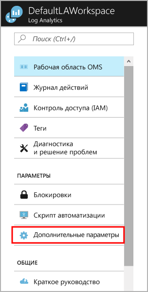
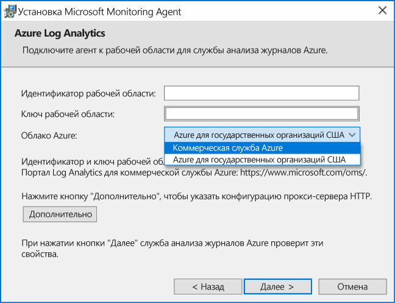
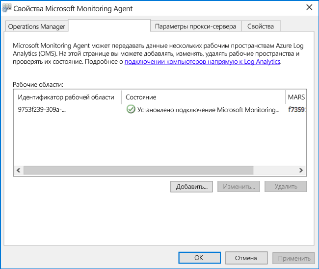

# <a name="connect-windows-computers-to-the-log-analytics-service-in-azure"></a>Подключение компьютеров Windows к службе Log Analytics в Azure

Чтобы отслеживать и управлять ими виртуальных машин или физических компьютеров в локальном центре обработки данных или других облачной среде с помощью аналитики журналов, необходимо развернуть агент наблюдения Майкрософт (MMA) и настроить его для передачи одного или нескольких рабочих областях службы анализа журналов.  Агент также поддерживает гибридной рабочей роли Runbook для автоматизации Azure.  

На наблюдаемом компьютере Windows агент представляется как служба Microsoft Monitoring Agent. Служба Microsoft Monitoring Agent собирает события из файлов журнала и журнала событий Windows, данные о производительности и другие данные телеметрии. Даже в том случае, если агенту не удалось подключиться к службе анализа журналов, которому она подчиняется, агент продолжает работать и помещает в очередь собранные данные на диске наблюдаемого компьютера. При восстановлении подключения служба Microsoft Monitoring Agent отправляет собранные данные в службу.

Агент могут быть установлены с помощью одного из следующих методов. В большинстве установок позволяет установить разные группы компьютеры, соответствующие сочетания этих методов.

* Установка вручную. Программа установки запускается на компьютере, используя мастер установки из командной строки, вручную или развернуто с помощью существующие средства для распространения программного обеспечения.
* Служба автоматизации Azure Настройка требуемого состояния (DSC). Использование DSC для компьютеров Windows в вашей среде уже развернуто в службе автоматизации Azure с помощью сценария.  
* Сценарий PowerShell.
* Шаблон диспетчера ресурсов для виртуальных машин, работающих в Azure стек Windows в локальной.  

Чтобы понять требования к сети и системы для развертывания агента Windows, просмотрите [сбор данных для среды с помощью Azure Log Analytics](log-analytics-concept-hybrid.md#prerequisites).

## <a name="obtain-workspace-id-and-key"></a>Получение идентификатора и ключа рабочей области
Перед установкой Microsoft Monitoring Agent для Windows требуется получить идентификатор и ключ для рабочей области Log Analytics.  Эта информация является обязательной при установке каждого метода установки, чтобы правильно настроить агент и убедитесь, что могло успешно взаимодействовать с помощью аналитики журналов.  

1. На портале Azure щелкните **Другие службы** в нижнем левом углу. В списке ресурсов введите **Log Analytics**. Как только вы начнете вводить символы, список отфильтруется соответствующим образом. Выберите **Log Analytics**.
2. В списке рабочих областей для анализа журналов выберите рабочую область, которую вы хотите Настройка агента для передачи данных.
3. Выберите **Дополнительные параметры**.<br><br> <br><br>  
4. Выберите **Подключенные источники**, а затем выберите **Серверы с Windows**.   
5. Необходимые значения указаны справа от полей **Идентификатор рабочей области** и **Первичный ключ**. Скопируйте их и вставьте в любой удобный для вас редактор.   
   
## <a name="install-the-agent-using-setup"></a>Установка агента с помощью программы установки
Ниже приведены инструкции по установке и настройке агента для Log Analytics в Azure и облаке Azure для государственных организаций с помощью программы установки для Microsoft Monitoring Agent на компьютере.  Содержится в загруженный файл программы установки для агента и должно быть извлечено для 

1. На странице **Серверы с Windows** выберите соответствующую версию **агента для Windows** для скачивания в зависимости от архитектуры процессора, на котором выполняется операционная система Windows.
2. Запустите программу установки, чтобы установить агент на компьютере.
2. На странице **приветствия** нажмите кнопку **Далее**.
3. На странице **Условия лицензии** прочтите лицензию и нажмите кнопку **Принимаю**.
4. На странице **Папка назначения** измените или оставьте папку установки по умолчанию и нажмите кнопку **Далее**.
5. На странице **Параметры установки агента** выберите подключение агента к Azure Log Analytics (OMS) и нажмите кнопку **Далее**.   
6. На странице **Azure Log Analytics** выполните следующее.
   1. Вставьте **идентификатор рабочей области** и **ключ рабочей области (первичный ключ)**, скопированные ранее.  Если компьютер должен передавать данные в рабочую область Log Analytics в облаке Azure для государственных организаций, выберите  **	Azure для государственных организаций США** из раскрывающегося списка **Облако Azure**.  
   2. Если компьютер должен обмениваться данными со службой Log Analytics через прокси-сервер, щелкните **Дополнительно** и укажите URL-адрес и номер порта прокси-сервера.  Если для доступа к прокси-серверу требуется аутентификация, введите имя пользователя и пароль для аутентификации на прокси-сервере, затем нажмите кнопку **Далее**.  
7. Нажмите кнопку **Далее** после завершения ввода необходимых параметров конфигурации.<br><br> <br><br>
8. На странице **Готовность к установке** просмотрите выбранные параметры и нажмите кнопку **Установить**.
9. На странице **Настройка успешно завершена** нажмите кнопку **Готово**.

После завершения установки на **панели управления** появится **Microsoft Monitoring Agent**. Чтобы убедиться в его отчеты для анализа журналов, просмотрите [проверки подключения агента к службе анализа журналов](#verify-agent-connectivity-to-log-analytics). 

## <a name="install-the-agent-using-the-command-line"></a>Установка агента с помощью командной строки
Загружаемый файл для агента представляет независимый установочный пакет, создаваемый IExpress.  Программа установки для агента и вспомогательные файлы содержащиеся в пакете и должны извлекаться для правильной установки с помощью командной строки, показано в следующих примерах.  Этот метод поддерживает Настройка агента для занесения в коммерческих Azure и облачных правительства США.  

>[!NOTE]
>Для обновления агента необходимо использовать API сценариев службы Log Analytics. См. в разделе [управление и поддержка анализа журналов агент для Windows и Linux](log-analytics-agent-manage.md) для получения дополнительных сведений.

В следующей таблице выделены отдельных параметров анализа журналов, поддерживаемые программой установки для агента, включая при развертывании с помощью DSC службы автоматизации.

|Параметры MMA                   |Заметки         |
|---------------------------------------|--------------|
|ADD_OPINSIGHTS_WORKSPACE               | 1 — настройка агента для передачи отчетов в рабочую область.                |
|OPINSIGHTS_WORKSPACE_ID                | Идентификатор добавляемой рабочей области (GUID).                    |
|OPINSIGHTS_WORKSPACE_KEY               | Ключ рабочей области, используемый для первоначальной аутентификации в рабочей области. |
|OPINSIGHTS_WORKSPACE_AZURE_CLOUD_TYPE  | Укажите облачную среду, в которой находится рабочая область. <br> 0 — коммерческое облако Azure (по умолчанию). <br> 1 — Azure для государственных организаций. |
|OPINSIGHTS_PROXY_URL               | Универсальный код ресурса (URI) для прокси-сервера. |
|OPINSIGHTS_PROXY_USERNAME               | Имя пользователя для доступа к прокси-серверу после аутентификации. |
|OPINSIGHTS_PROXY_PASSWORD               | Пароль для доступа к прокси-серверу после аутентификации. |

1. Чтобы извлечь файлы установки агента, из командной строки с повышенными привилегиями запустите `extract MMASetup-<platform>.exe` и вам будет предложено для пути, чтобы извлечь файлы.  Кроме того, можно указать путь, передавая аргументы `extract MMASetup-<platform>.exe /c:<Path> /t:<Path>`.  Дополнительные сведения о swtiches командной строки, поддерживаемые IExpress см. в разделе [параметры командной строки для IExpress](https://support.microsoft.com/help/197147/command-line-switches-for-iexpress-software-update-packages) и обновите пример в соответствии с потребностями.
2. Автоматическая установка агента и настроить его для передачи в рабочую область в Azure коммерческих облачных из папки были извлечены файлы программы установки для ввода: 
   
     ```dos
    setup.exe /qn ADD_OPINSIGHTS_WORKSPACE=1 OPINSIGHTS_WORKSPACE_AZURE_CLOUD_TYPE=0 OPINSIGHTS_WORKSPACE_ID=<your workspace id> OPINSIGHTS_WORKSPACE_KEY=<your workspace key> AcceptEndUserLicenseAgreement=1
    ```

   или, чтобы настроить агент для занесения в облаке правительства США, введите: 

     ```dos
    setup.exe /qn ADD_OPINSIGHTS_WORKSPACE=1 OPINSIGHTS_WORKSPACE_AZURE_CLOUD_TYPE=1 OPINSIGHTS_WORKSPACE_ID=<your workspace id> OPINSIGHTS_WORKSPACE_KEY=<your workspace key> AcceptEndUserLicenseAgreement=1
    ```

## <a name="install-the-agent-using-dsc-in-azure-automation"></a>Установка агента с помощью DSC в службе автоматизации Azure

В следующем примере сценария можно использовать для установки агента с помощью DSC службы автоматизации Azure.   Если у вас учетной записи автоматизации, см. раздел [начало работы с автоматизацией Azure](../automation/automation-offering-get-started.md) чтобы понять требования и шаги по созданию учетной записи автоматизации, необходимые перед использованием DSC службы автоматизации.  Если вы не знакомы с DSC службы автоматизации, просмотрите [начало работы с DSC службы автоматизации](../automation/automation-dsc-getting-started.md).

Следующий пример устанавливает 64-разрядный агент, обозначенную `URI` значение. Вы также можете использовать 32-разрядную версию, заменив значение универсального кода ресурса (URI). URI для обеих версий:

- 64-разрядный агент Windows: https://go.microsoft.com/fwlink/?LinkId=828603
- 32-разрядный агент Windows: https://go.microsoft.com/fwlink/?LinkId=828604


>[!NOTE]
>В этом примере процедура и скрипта не поддерживает обновление агента, уже развернутых на компьютере Windows.

32-разрядных и 64-разрядной версии пакета агента имеют различные коды и новыми версиями, выпущенными также иметь уникальное значение.  Код продукта — это GUID, являющийся основным удостоверением приложения или продукта и представляется с помощью установщика Windows **ProductCode** свойство.  `ProductId value` В **MMAgent.ps1** сценарий должен соответствовать код продукта из пакета установщика на 32-разрядная или 64-разрядного агента.

Чтобы получить код продукта из пакета установки агента непосредственно, можно использовать Orca.exe из [Windows SDK компонентов для установщика разработчиков Windows](https://msdn.microsoft.com/library/windows/desktop/aa370834%27v=vs.85%28.aspx) именно компонент пакет средств разработки программного обеспечения Windows или с помощью Следующие PowerShell [пример сценария](http://www.scconfigmgr.com/2014/08/22/how-to-get-msi-file-information-with-powershell/) записи по Microsoft Valuable Professional (MVP).

1. Импортируйте модуль DSC xPSDesiredStateConfiguration со страницы [http://www.powershellgallery.com/packages/xPSDesiredStateConfiguration](http://www.powershellgallery.com/packages/xPSDesiredStateConfiguration) в службу автоматизации Azure.  
2.  Создайте в службе автоматизации Azure ресурсы-контейнеры для переменных *OPSINSIGHTS_WS_ID* и *OPSINSIGHTS_WS_KEY*. Задать *OPSINSIGHTS_WS_ID* идентификатор рабочей области аналитики журналов и установите *OPSINSIGHTS_WS_KEY* на первичный ключ рабочей области.
3.  Скопируйте сценарий и сохраните его как MMAgent.ps1

    ```PowerShell
    Configuration MMAgent
    {
        $OIPackageLocalPath = "C:\Deploy\MMASetup-AMD64.exe"
        $OPSINSIGHTS_WS_ID = Get-AutomationVariable -Name "OPSINSIGHTS_WS_ID"
        $OPSINSIGHTS_WS_KEY = Get-AutomationVariable -Name "OPSINSIGHTS_WS_KEY"

        Import-DscResource -ModuleName xPSDesiredStateConfiguration

        Node OMSnode {
            Service OIService
            {
                Name = "HealthService"
                State = "Running"
                DependsOn = "[Package]OI"
            }

            xRemoteFile OIPackage {
                Uri = "https://go.microsoft.com/fwlink/?LinkId=828603"
                DestinationPath = $OIPackageLocalPath
            }

            Package OI {
                Ensure = "Present"
                Path  = $OIPackageLocalPath
                Name = "Microsoft Monitoring Agent"
                ProductId = "8A7F2C51-4C7D-4BFD-9014-91D11F24AAE2"
                Arguments = '/C:Deploy"setup.exe /qn ADD_OPINSIGHTS_WORKSPACE=1 OPINSIGHTS_WORKSPACE_ID=' + $OPSINSIGHTS_WS_ID + ' OPINSIGHTS_WORKSPACE_KEY=' + $OPSINSIGHTS_WS_KEY + ' AcceptEndUserLicenseAgreement=1"'
                DependsOn = "[xRemoteFile]OIPackage"
            }
        }
    }

    ```

4. [Импорт скрипта конфигурации MMAgent.ps1](../automation/automation-dsc-getting-started.md#importing-a-configuration-into-azure-automation) в вашу учетную запись автоматизации. 
5. [Назначьте компьютер Windows или узел](../automation/automation-dsc-getting-started.md#onboarding-an-azure-vm-for-management-with-azure-automation-dsc) в конфигурацию. В течение 15 минут узел проверяет свою конфигурацию и обмена данными с агентом на узел.

## <a name="verify-agent-connectivity-to-log-analytics"></a>Проверьте подключение агента к службе анализа журналов

По завершении instalaltion агента проверка его успешного подключения и отчетов можно выполнить двумя способами.  

На компьютере в **панели управления**, найдите элемент **Microsoft Monitoring Agent**.  Выберите его и на **анализа журналов Azure (OMS)** вкладку, агент должен отображать сообщение о том,: **Microsoft Monitoring Agent успешно подключился к службе Microsoft Operations Management Suite.**<br><br> 

Можно также выполнить поиск журнала простых на портале Azure.  

1. На портале Azure щелкните **Другие службы** в нижнем левом углу. В списке ресурсов введите **Log Analytics**. Как только вы начнете вводить символы, список отфильтруется соответствующим образом. Выберите **Log Analytics**.  
2. На странице рабочей области аналитики журналов, выберите целевой рабочей области, а затем выберите **поиска журналов** плитки. 
2. На панели поиска журналов в поле запроса введите:  

    ```
    search * 
    | where Type == "Heartbeat" 
    | where Category == "Direct Agent" 
    | where TimeGenerated > ago(30m)  
    ```

Возвращаемые результаты поиска вы увидите записи пакетов пульса для компьютера, указывающий, что он подключен, а также отчетов в службу.   

## <a name="next-steps"></a>Дальнейшие действия

Просмотрите [управление и поддержка анализа журналов агент для Windows и Linux](log-analytics-agent-manage.md) Дополнительные сведения об управлении агента в течение его жизненного цикла развертывания на машинах.  