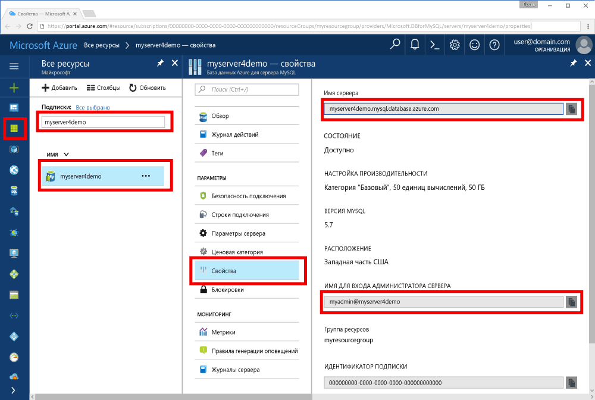

# <a name="azure-database-for-mysql-use-go-language-to-connect-and-query-data"></a><span data-ttu-id="c368b-103">База данных Azure для MySQL: подключение и запрос данных с помощью языка Go</span><span class="sxs-lookup"><span data-stu-id="c368b-103">Azure Database for MySQL: Use Go language to connect and query data</span></span>
<span data-ttu-id="c368b-104">В этом кратком руководстве объясняется, как подключиться к базе данных Azure для MySQL с помощью кода [Go](https://golang.org/) на платформе Windows, Ubuntu Linux или Apple macOS.</span><span class="sxs-lookup"><span data-stu-id="c368b-104">This quickstart demonstrates how to connect to an Azure Database for MySQL using code written in the [Go](https://golang.org/) language from Windows, Ubuntu Linux, and Apple macOS platforms.</span></span> <span data-ttu-id="c368b-105">Здесь также показано, как использовать инструкции SQL для запроса, вставки, обновления и удаления данных в базе данных.</span><span class="sxs-lookup"><span data-stu-id="c368b-105">It shows how to use SQL statements to query, insert, update, and delete data in the database.</span></span> <span data-ttu-id="c368b-106">В этой статье предполагается, что у вас уже есть опыт разработки на Go, но вы только начали работу с базой данных Azure для MySQL.</span><span class="sxs-lookup"><span data-stu-id="c368b-106">This article assumes you are familiar with development using Go, but that you are new to working with Azure Database for MySQL.</span></span>

## <a name="prerequisites"></a><span data-ttu-id="c368b-107">Предварительные требования</span><span class="sxs-lookup"><span data-stu-id="c368b-107">Prerequisites</span></span>
<span data-ttu-id="c368b-108">В качестве отправной точки в этом кратком руководстве используются ресурсы, созданные в соответствии со следующими материалами:</span><span class="sxs-lookup"><span data-stu-id="c368b-108">This quickstart uses the resources created in either of these guides as a starting point:</span></span>
- <span data-ttu-id="c368b-109">[Create an Azure Database for MySQL server using Azure portal](./quickstart-create-mysql-server-database-using-azure-portal.md) (Создание сервера базы данных Azure для MySQL с помощью портала Azure)</span><span class="sxs-lookup"><span data-stu-id="c368b-109">[Create an Azure Database for MySQL server using Azure portal](./quickstart-create-mysql-server-database-using-azure-portal.md)</span></span>
- <span data-ttu-id="c368b-110">[Create an Azure Database for MySQL server using Azure CLI](./quickstart-create-mysql-server-database-using-azure-cli.md) (Создание базы данных Azure для сервера MySQL с помощью Azure CLI)</span><span class="sxs-lookup"><span data-stu-id="c368b-110">[Create an Azure Database for MySQL server using Azure CLI](./quickstart-create-mysql-server-database-using-azure-cli.md)</span></span>

## <a name="install-go-and-mysql-connector"></a><span data-ttu-id="c368b-111">Установка Go и соединителя MySQL</span><span class="sxs-lookup"><span data-stu-id="c368b-111">Install Go and MySQL connector</span></span>
<span data-ttu-id="c368b-112">Установите [Go](https://golang.org/doc/install) и драйвер [go-sql-driver](https://github.com/go-sql-driver/mysql#installation) для MySQL на своем компьютере.</span><span class="sxs-lookup"><span data-stu-id="c368b-112">Install [Go](https://golang.org/doc/install) and the [go-sql-driver for MySQL](https://github.com/go-sql-driver/mysql#installation) on your own machine.</span></span> <span data-ttu-id="c368b-113">В зависимости от используемой платформы выполните следующие действия:</span><span class="sxs-lookup"><span data-stu-id="c368b-113">Depending on your platform, follow the steps:</span></span>

### <a name="windows"></a><span data-ttu-id="c368b-114">Windows</span><span class="sxs-lookup"><span data-stu-id="c368b-114">Windows</span></span>
1. <span data-ttu-id="c368b-115">[Скачайте](https://golang.org/dl/) и установите Go для Microsoft Windows [согласно инструкциям по установке](https://golang.org/doc/install).</span><span class="sxs-lookup"><span data-stu-id="c368b-115">[Download](https://golang.org/dl/) and install Go for Microsoft Windows according to the [installation instructions](https://golang.org/doc/install).</span></span>
2. <span data-ttu-id="c368b-116">Запустите командную строку из меню "Пуск".</span><span class="sxs-lookup"><span data-stu-id="c368b-116">Launch the command prompt from the start menu.</span></span>
3. <span data-ttu-id="c368b-117">Создайте папку для проекта, например</span><span class="sxs-lookup"><span data-stu-id="c368b-117">Make a folder for your project such.</span></span> <span data-ttu-id="c368b-118">`mkdir  %USERPROFILE%\go\src\mysqlgo`.</span><span class="sxs-lookup"><span data-stu-id="c368b-118">`mkdir  %USERPROFILE%\go\src\mysqlgo`.</span></span>
4. <span data-ttu-id="c368b-119">Перейдите в папку проекта, например `cd %USERPROFILE%\go\src\mysqlgo`.</span><span class="sxs-lookup"><span data-stu-id="c368b-119">Change directory into the project folder, such as `cd %USERPROFILE%\go\src\mysqlgo`.</span></span>
5. <span data-ttu-id="c368b-120">В качестве значения для переменной среды GOPATH укажите путь к каталогу с исходным кодом.</span><span class="sxs-lookup"><span data-stu-id="c368b-120">Set the environment variable for GOPATH to point to the source code directory.</span></span> <span data-ttu-id="c368b-121">`set GOPATH=%USERPROFILE%\go`.</span><span class="sxs-lookup"><span data-stu-id="c368b-121">`set GOPATH=%USERPROFILE%\go`.</span></span>
6. <span data-ttu-id="c368b-122">Установите драйвер [go-sql-driver](https://github.com/go-sql-driver/mysql#installation) для MySQL, выполнив команду `go get github.com/go-sql-driver/mysql`.</span><span class="sxs-lookup"><span data-stu-id="c368b-122">Install the [go-sql-driver for mysql](https://github.com/go-sql-driver/mysql#installation) by running the `go get github.com/go-sql-driver/mysql` command.</span></span>

   <span data-ttu-id="c368b-123">Установите Go, а затем выполните следующие команды в командной строке:</span><span class="sxs-lookup"><span data-stu-id="c368b-123">In summary, install Go, then run these commands in the command prompt:</span></span>
   ```cmd
   mkdir  %USERPROFILE%\go\src\mysqlgo
   cd %USERPROFILE%\go\src\mysqlgo
   set GOPATH=%USERPROFILE%\go
   go get github.com/go-sql-driver/mysql
   ```

### <a name="linux-ubuntu"></a><span data-ttu-id="c368b-124">Linux (Ubuntu)</span><span class="sxs-lookup"><span data-stu-id="c368b-124">Linux (Ubuntu)</span></span>
1. <span data-ttu-id="c368b-125">Запустите оболочку Bash.</span><span class="sxs-lookup"><span data-stu-id="c368b-125">Launch the Bash shell.</span></span> 
2. <span data-ttu-id="c368b-126">Установите Go, выполнив команду `sudo apt-get install golang-go`.</span><span class="sxs-lookup"><span data-stu-id="c368b-126">Install Go by running `sudo apt-get install golang-go`.</span></span>
3. <span data-ttu-id="c368b-127">Создайте папку для проекта в корневом каталоге, например `mkdir -p ~/go/src/mysqlgo/`.</span><span class="sxs-lookup"><span data-stu-id="c368b-127">Make a folder for your project in your home directory, such as `mkdir -p ~/go/src/mysqlgo/`.</span></span>
4. <span data-ttu-id="c368b-128">Перейдите в другую папку, например `cd ~/go/src/mysqlgo/`.</span><span class="sxs-lookup"><span data-stu-id="c368b-128">Change directory into the folder, such as `cd ~/go/src/mysqlgo/`.</span></span>
5. <span data-ttu-id="c368b-129">В качестве значения для переменной среды GOPATH укажите путь к действительному исходному каталогу, например к текущей папке Go в корневом каталоге.</span><span class="sxs-lookup"><span data-stu-id="c368b-129">Set the GOPATH environment variable to point to a valid source directory, such as your current home directory's go folder.</span></span> <span data-ttu-id="c368b-130">В оболочке Bash выполните команду `export GOPATH=~/go`, чтобы добавить каталог Go в качестве значения переменной GOPATH для текущего сеанса оболочки.</span><span class="sxs-lookup"><span data-stu-id="c368b-130">At the bash shell, run `export GOPATH=~/go` to add the go directory as the GOPATH for the current shell session.</span></span>
6. <span data-ttu-id="c368b-131">Установите драйвер [go-sql-driver](https://github.com/go-sql-driver/mysql#installation) для MySQL, выполнив команду `go get github.com/go-sql-driver/mysql`.</span><span class="sxs-lookup"><span data-stu-id="c368b-131">Install the [go-sql-driver for mysql](https://github.com/go-sql-driver/mysql#installation) by running the `go get github.com/go-sql-driver/mysql` command.</span></span>

   <span data-ttu-id="c368b-132">Выполните следующие команды Bash:</span><span class="sxs-lookup"><span data-stu-id="c368b-132">In summary, run these bash commands:</span></span>
   ```bash
   sudo apt-get install golang-go
   mkdir -p ~/go/src/mysqlgo/
   cd ~/go/src/mysqlgo/
   export GOPATH=~/go/
   go get github.com/go-sql-driver/mysql
   ```

### <a name="apple-macos"></a><span data-ttu-id="c368b-133">Apple macOS</span><span class="sxs-lookup"><span data-stu-id="c368b-133">Apple macOS</span></span>
1. <span data-ttu-id="c368b-134">Скачайте и установите Go согласно [инструкциям по установке](https://golang.org/doc/install) с учетом вашей платформы.</span><span class="sxs-lookup"><span data-stu-id="c368b-134">Download and install Go according to the [installation instructions](https://golang.org/doc/install)  matching your platform.</span></span> 
2. <span data-ttu-id="c368b-135">Запустите оболочку Bash.</span><span class="sxs-lookup"><span data-stu-id="c368b-135">Launch the Bash shell.</span></span> 
3. <span data-ttu-id="c368b-136">Создайте папку для проекта в корневом каталоге, например `mkdir -p ~/go/src/mysqlgo/`.</span><span class="sxs-lookup"><span data-stu-id="c368b-136">Make a folder for your project in your home directory, such as `mkdir -p ~/go/src/mysqlgo/`.</span></span>
4. <span data-ttu-id="c368b-137">Перейдите в другую папку, например `cd ~/go/src/mysqlgo/`.</span><span class="sxs-lookup"><span data-stu-id="c368b-137">Change directory into the folder, such as `cd ~/go/src/mysqlgo/`.</span></span>
5. <span data-ttu-id="c368b-138">В качестве значения для переменной среды GOPATH укажите путь к действительному исходному каталогу, например к текущей папке Go в корневом каталоге.</span><span class="sxs-lookup"><span data-stu-id="c368b-138">Set the GOPATH environment variable to point to a valid source directory, such as your current home directory's go folder.</span></span> <span data-ttu-id="c368b-139">В оболочке Bash выполните команду `export GOPATH=~/go`, чтобы добавить каталог Go в качестве значения переменной GOPATH для текущего сеанса оболочки.</span><span class="sxs-lookup"><span data-stu-id="c368b-139">At the bash shell, run `export GOPATH=~/go` to add the go directory as the GOPATH for the current shell session.</span></span>
6. <span data-ttu-id="c368b-140">Установите драйвер [go-sql-driver](https://github.com/go-sql-driver/mysql#installation) для MySQL, выполнив команду `go get github.com/go-sql-driver/mysql`.</span><span class="sxs-lookup"><span data-stu-id="c368b-140">Install the [go-sql-driver for mysql](https://github.com/go-sql-driver/mysql#installation) by running the `go get github.com/go-sql-driver/mysql` command.</span></span>

   <span data-ttu-id="c368b-141">Установите Go, а затем выполните следующие команды Bash:</span><span class="sxs-lookup"><span data-stu-id="c368b-141">In summary, install Go, then run these bash commands:</span></span>
   ```bash
   mkdir -p ~/go/src/mysqlgo/
   cd ~/go/src/mysqlgo/
   export GOPATH=~/go/
   go get github.com/go-sql-driver/mysql
   ```

## <a name="get-connection-information"></a><span data-ttu-id="c368b-142">Получение сведений о подключении</span><span class="sxs-lookup"><span data-stu-id="c368b-142">Get connection information</span></span>
<span data-ttu-id="c368b-143">Получите сведения о подключении, необходимые для подключения к базе данных Azure.для MySQL.</span><span class="sxs-lookup"><span data-stu-id="c368b-143">Get the connection information needed to connect to the Azure Database for MySQL.</span></span> <span data-ttu-id="c368b-144">Вам потребуется полное имя сервера и учетные данные для входа.</span><span class="sxs-lookup"><span data-stu-id="c368b-144">You need the fully qualified server name and login credentials.</span></span>

1. <span data-ttu-id="c368b-145">Войдите на [портал Azure](https://portal.azure.com/).</span><span class="sxs-lookup"><span data-stu-id="c368b-145">Log in to the [Azure portal](https://portal.azure.com/).</span></span>
2. <span data-ttu-id="c368b-146">В меню слева на портале Azure щелкните **Все ресурсы** и выполните поиск по имени созданного сервера, например **myserver4demo**.</span><span class="sxs-lookup"><span data-stu-id="c368b-146">From the left-hand menu in Azure portal, click **All resources** and search for the server you have creased, such as **myserver4demo**.</span></span>
3. <span data-ttu-id="c368b-147">Щелкните имя сервера **myserver4demo**.</span><span class="sxs-lookup"><span data-stu-id="c368b-147">Click the server name **myserver4demo**.</span></span>
4. <span data-ttu-id="c368b-148">Откройте страницу **свойств** сервера.</span><span class="sxs-lookup"><span data-stu-id="c368b-148">Select the server's **Properties** page.</span></span> <span data-ttu-id="c368b-149">Запишите значения **имени сервера** и **имени для входа администратора сервера**.</span><span class="sxs-lookup"><span data-stu-id="c368b-149">Make a note of the **Server name** and **Server admin login name**.</span></span>
 <span data-ttu-id="c368b-150"></span><span class="sxs-lookup"><span data-stu-id="c368b-150"></span></span>
5. <span data-ttu-id="c368b-151">Если вы забыли данные для входа на сервер, перейдите на страницу **Обзор**, чтобы просмотреть имя администратора сервера и при необходимости сбросить пароль.</span><span class="sxs-lookup"><span data-stu-id="c368b-151">If you forget your server login information, navigate to the **Overview** page to view the Server admin login name and, if necessary, reset the password.</span></span>
   

## <a name="build-and-run-go-code"></a><span data-ttu-id="c368b-152">Сборка и выполнение кода Go</span><span class="sxs-lookup"><span data-stu-id="c368b-152">Build and run Go code</span></span> 
1. <span data-ttu-id="c368b-153">Для написания кода на Golang можно использовать простой текстовый редактор, например Блокнот в Microsoft Windows, [vi](http://manpages.ubuntu.com/manpages/xenial/man1/nvi.1.html#contenttoc5) или [Nano](https://www.nano-editor.org/) в Ubuntu, а также TextEdit в macOS.</span><span class="sxs-lookup"><span data-stu-id="c368b-153">To write Golang code, you can use a simple text editor, such as Notepad in Microsoft Windows, [vi](http://manpages.ubuntu.com/manpages/xenial/man1/nvi.1.html#contenttoc5) or [Nano](https://www.nano-editor.org/) in Ubuntu, or TextEdit in macOS.</span></span> <span data-ttu-id="c368b-154">Если вы предпочитаете использовать полнофункциональную интерактивную среду разработки (IDE), попробуйте [Gogland](https://www.jetbrains.com/go/) от JetBrains, [Visual Studio Code](https://code.visualstudio.com/) от Майкрософт или [Atom](https://atom.io/).</span><span class="sxs-lookup"><span data-stu-id="c368b-154">If you prefer a richer Interactive Development Environment (IDE) try [Gogland](https://www.jetbrains.com/go/) by Jetbrains, [Visual Studio Code](https://code.visualstudio.com/) by Microsoft, or [Atom](https://atom.io/).</span></span>
2. <span data-ttu-id="c368b-155">Вставьте код Go из раздела ниже в текстовые файлы с расширением \*.go и сохраните их в папке проекта, например `%USERPROFILE%\go\src\mysqlgo\createtable.go` в Windows или `~/go/src/mysqlgo/createtable.go` в Linux.</span><span class="sxs-lookup"><span data-stu-id="c368b-155">Paste the Go code from the sections below into text files, and save into your project folder with file extension \*.go, such as Windows path `%USERPROFILE%\go\src\mysqlgo\createtable.go` or Linux path `~/go/src/mysqlgo/createtable.go`.</span></span>
3. <span data-ttu-id="c368b-156">Найдите константы `HOST`, `DATABASE`, `USER` и `PASSWORD` в коде и замените приведенные для примера значения своими собственными.</span><span class="sxs-lookup"><span data-stu-id="c368b-156">Locate the `HOST`, `DATABASE`, `USER`, and `PASSWORD` constants in the code, and replace the example values with your own values.</span></span> 
4. <span data-ttu-id="c368b-157">Запустите командную строку или оболочку Bash.</span><span class="sxs-lookup"><span data-stu-id="c368b-157">Launch the command prompt or bash shell.</span></span> <span data-ttu-id="c368b-158">Перейдите в папку проекта.</span><span class="sxs-lookup"><span data-stu-id="c368b-158">Change directory into your project folder.</span></span> <span data-ttu-id="c368b-159">В Windows это будет команда `cd %USERPROFILE%\go\src\mysqlgo\`,</span><span class="sxs-lookup"><span data-stu-id="c368b-159">For example, on Windows `cd %USERPROFILE%\go\src\mysqlgo\`.</span></span> <span data-ttu-id="c368b-160">а в Linux — `cd ~/go/src/mysqlgo/`.</span><span class="sxs-lookup"><span data-stu-id="c368b-160">On Linux `cd ~/go/src/mysqlgo/`.</span></span>  <span data-ttu-id="c368b-161">Некоторые из упомянутых редакторов IDE позволяют выполнять отладку и использовать среду выполнения без применения команд оболочки.</span><span class="sxs-lookup"><span data-stu-id="c368b-161">Some of the IDE editors mentioned offer debug and runtime capabilities without requiring shell commands.</span></span>
5. <span data-ttu-id="c368b-162">Выполните код с помощью команды `go run createtable.go`, чтобы скомпилировать и запустить приложение.</span><span class="sxs-lookup"><span data-stu-id="c368b-162">Run the code by typing the command `go run createtable.go` to compile the application and run it.</span></span> 
6. <span data-ttu-id="c368b-163">Вы также можете создать код в собственном приложении. Для этого введите `go build createtable.go`, а затем выполните `createtable.exe`, чтобы запустить приложение.</span><span class="sxs-lookup"><span data-stu-id="c368b-163">Alternatively, to build the code into a native application, `go build createtable.go`, then launch `createtable.exe` to run the application.</span></span>

## <a name="connect-create-table-and-insert-data"></a><span data-ttu-id="c368b-164">Подключение, создание таблицы и вставка данных</span><span class="sxs-lookup"><span data-stu-id="c368b-164">Connect, create table, and insert data</span></span>
<span data-ttu-id="c368b-165">Используйте следующий код для подключения к серверу, создания таблицы и загрузки данных с помощью инструкции SQL **INSERT**.</span><span class="sxs-lookup"><span data-stu-id="c368b-165">Use the following code to connect to the server, create a table, and load the data using an **INSERT** SQL statement.</span></span> 

<span data-ttu-id="c368b-166">Код импортирует три пакета: [пакет sql](https://golang.org/pkg/database/sql/), [драйвер go sql для MySQL](https://github.com/go-sql-driver/mysql#installation) для обмена данными с базой данных Azure для MySQL, а также [пакет fmt](https://golang.org/pkg/fmt/) для вывода входных и выходных данных в командной строке.</span><span class="sxs-lookup"><span data-stu-id="c368b-166">The code imports three packages: the [sql package](https://golang.org/pkg/database/sql/), the [go sql driver for mysql](https://github.com/go-sql-driver/mysql#installation) as a driver to communicate with the Azure Database for MySQL, and the [fmt package](https://golang.org/pkg/fmt/) for printed input and output on the command line.</span></span>

<span data-ttu-id="c368b-167">Код вызывает метод [sql.Open()](http://go-database-sql.org/accessing.html), чтобы подключиться к базе данных Azure для MySQL, а затем проверяет подключение с помощью метода [db.Ping()](https://golang.org/pkg/database/sql/#DB.Ping).</span><span class="sxs-lookup"><span data-stu-id="c368b-167">The code calls method [sql.Open()](http://go-database-sql.org/accessing.html) to connect to Azure Database for MySQL, and checks the connection using method [db.Ping()](https://golang.org/pkg/database/sql/#DB.Ping).</span></span> <span data-ttu-id="c368b-168">[Дескриптор базы данных](https://golang.org/pkg/database/sql/#DB) используется для всех компонентов. Он содержит пул подключений к серверу базы данных.</span><span class="sxs-lookup"><span data-stu-id="c368b-168">A [database handle](https://golang.org/pkg/database/sql/#DB) is used throughout, holding the connection pool for the database server.</span></span> <span data-ttu-id="c368b-169">Код вызывает метод [Exec()](https://golang.org/pkg/database/sql/#DB.Exec) несколько раз, чтобы выполнить несколько команд DDL.</span><span class="sxs-lookup"><span data-stu-id="c368b-169">The code calls the [Exec()](https://golang.org/pkg/database/sql/#DB.Exec) method several times to run several DDL commands.</span></span> <span data-ttu-id="c368b-170">Код также использует методы [Prepare()](http://go-database-sql.org/prepared.html) и Exec(), чтобы выполнить подготовленные инструкции с разными параметрами для вставки трех строк.</span><span class="sxs-lookup"><span data-stu-id="c368b-170">The code also uses the [Prepare()](http://go-database-sql.org/prepared.html) and Exec() to run prepared statements with different parameters to insert three rows.</span></span> <span data-ttu-id="c368b-171">При каждом запуске пользовательский метод checkError() проверяет наличие ошибок и инициирует аварийный выход в случае их обнаружения.</span><span class="sxs-lookup"><span data-stu-id="c368b-171">Each time a custom checkError() method is used to check if an error occurred and panic to exit.</span></span>

<span data-ttu-id="c368b-172">Замените значения констант `host`, `database`, `user` и `password` собственными значениями.</span><span class="sxs-lookup"><span data-stu-id="c368b-172">Replace the `host`, `database`, `user`, and `password` constants with your own values.</span></span> 

```Go
package main

import (
    "database/sql"
    "fmt"

    _ "github.com/go-sql-driver/mysql"
)

const (
    host     = "myserver4demo.mysql.database.azure.com"
    database = "quickstartdb"
    user     = "myadmin@myserver4demo"
    password = "yourpassword"
)

func checkError(err error) {
    if err != nil {
        panic(err)
    }
}

func main() {

    // Initialize connection string.
    var connectionString = fmt.Sprintf("%s:%s@tcp(%s:3306)/%s?allowNativePasswords=true", user, password, host, database)

    // Initialize connection object.
    db, err := sql.Open("mysql", connectionString)
    checkError(err)
    defer db.Close()

    err = db.Ping()
    checkError(err)
    fmt.Println("Successfully created connection to database.")

    // Drop previous table of same name if one exists.
    _, err = db.Exec("DROP TABLE IF EXISTS inventory;")
    checkError(err)
    fmt.Println("Finished dropping table (if existed).")

    // Create table.
    _, err = db.Exec("CREATE TABLE inventory (id serial PRIMARY KEY, name VARCHAR(50), quantity INTEGER);")
    checkError(err)
    fmt.Println("Finished creating table.")

    // Insert some data into table.
    sqlStatement, err := db.Prepare("INSERT INTO inventory (name, quantity) VALUES (?, ?);")
    res, err := sqlStatement.Exec("banana", 150)
    checkError(err)
    rowCount, err := res.RowsAffected()
    fmt.Printf("Inserted %d row(s) of data.\n", rowCount)

    res, err = sqlStatement.Exec("orange", 154)
    checkError(err)
    rowCount, err = res.RowsAffected()
    fmt.Printf("Inserted %d row(s) of data.\n", rowCount)

    res, err = sqlStatement.Exec("apple", 100)
    checkError(err)
    rowCount, err = res.RowsAffected()
    fmt.Printf("Inserted %d row(s) of data.\n", rowCount)
    fmt.Println("Done.")
}

```

## <a name="read-data"></a><span data-ttu-id="c368b-173">Считывание данных</span><span class="sxs-lookup"><span data-stu-id="c368b-173">Read data</span></span>
<span data-ttu-id="c368b-174">Используйте указанный ниже код с инструкцией SQL **SELECT** для подключения и чтения данных.</span><span class="sxs-lookup"><span data-stu-id="c368b-174">Use the following code to connect and read the data using a **SELECT** SQL statement.</span></span> 

<span data-ttu-id="c368b-175">Код импортирует три пакета: [пакет sql](https://golang.org/pkg/database/sql/), [драйвер go sql для MySQL](https://github.com/go-sql-driver/mysql#installation) для обмена данными с базой данных Azure для MySQL, а также [пакет fmt](https://golang.org/pkg/fmt/) для вывода входных и выходных данных в командной строке.</span><span class="sxs-lookup"><span data-stu-id="c368b-175">The code imports three packages: the [sql package](https://golang.org/pkg/database/sql/), the [go sql driver for mysql](https://github.com/go-sql-driver/mysql#installation) as a driver to communicate with the Azure Database for MySQL, and the [fmt package](https://golang.org/pkg/fmt/) for printed input and output on the command line.</span></span>

<span data-ttu-id="c368b-176">Код вызывает метод [sql.Open()](http://go-database-sql.org/accessing.html), чтобы подключиться к базе данных Azure для MySQL, а затем проверяет подключение с помощью метода [db.Ping()](https://golang.org/pkg/database/sql/#DB.Ping).</span><span class="sxs-lookup"><span data-stu-id="c368b-176">The code calls method [sql.Open()](http://go-database-sql.org/accessing.html) to connect to Azure Database for MySQL, and checks the connection using method [db.Ping()](https://golang.org/pkg/database/sql/#DB.Ping).</span></span> <span data-ttu-id="c368b-177">[Дескриптор базы данных](https://golang.org/pkg/database/sql/#DB) используется для всех компонентов. Он содержит пул подключений к серверу базы данных.</span><span class="sxs-lookup"><span data-stu-id="c368b-177">A [database handle](https://golang.org/pkg/database/sql/#DB) is used throughout, holding the connection pool for the database server.</span></span> <span data-ttu-id="c368b-178">Код вызывает метод [Query()](https://golang.org/pkg/database/sql/#DB.Query) для выполнения команды SELECT.</span><span class="sxs-lookup"><span data-stu-id="c368b-178">The code calls the [Query()](https://golang.org/pkg/database/sql/#DB.Query) method to run the select command.</span></span> <span data-ttu-id="c368b-179">Затем он запускает метод [Next()](https://golang.org/pkg/database/sql/#Rows.Next), чтобы выполнить итерацию результирующего набора, и метод [Scan()](https://golang.org/pkg/database/sql/#Rows.Scan) для анализа значений столбца, сохраняя значения в переменных.</span><span class="sxs-lookup"><span data-stu-id="c368b-179">Then it runs [Next()](https://golang.org/pkg/database/sql/#Rows.Next) to iterate through the result set and [Scan()](https://golang.org/pkg/database/sql/#Rows.Scan) to parse the column values, saving the value into variables.</span></span> <span data-ttu-id="c368b-180">При каждом запуске пользовательский метод checkError() проверяет наличие ошибок и инициирует аварийный выход в случае их обнаружения.</span><span class="sxs-lookup"><span data-stu-id="c368b-180">Each time a custom checkError() method is used to check if an error occurred and panic to exit.</span></span>

<span data-ttu-id="c368b-181">Замените значения констант `host`, `database`, `user` и `password` собственными значениями.</span><span class="sxs-lookup"><span data-stu-id="c368b-181">Replace the `host`, `database`, `user`, and `password` constants with your own values.</span></span> 

```Go
package main

import (
    "database/sql"
    "fmt"

    _ "github.com/go-sql-driver/mysql"
)

const (
    host     = "myserver4demo.mysql.database.azure.com"
    database = "quickstartdb"
    user     = "myadmin@myserver4demo"
    password = "yourpassword"
)

func checkError(err error) {
    if err != nil {
        panic(err)
    }
}

func main() {

    // Initialize connection string.
    var connectionString = fmt.Sprintf("%s:%s@tcp(%s:3306)/%s?allowNativePasswords=true", user, password, host, database)

    // Initialize connection object.
    db, err := sql.Open("mysql", connectionString)
    checkError(err)
    defer db.Close()

    err = db.Ping()
    checkError(err)
    fmt.Println("Successfully created connection to database.")

    // Variables for printing column data when scanned.
    var (
        id       int
        name     string
        quantity int
    )

    // Read some data from the table.
    rows, err := db.Query("SELECT id, name, quantity from inventory;")
    checkError(err)
    defer rows.Close()
    fmt.Println("Reading data:")
    for rows.Next() {
        err := rows.Scan(&id, &name, &quantity)
        checkError(err)
        fmt.Printf("Data row = (%d, %s, %d)\n", id, name, quantity)
    }
    err = rows.Err()
    checkError(err)
    fmt.Println("Done.")
}
```

## <a name="update-data"></a><span data-ttu-id="c368b-182">Обновление данных</span><span class="sxs-lookup"><span data-stu-id="c368b-182">Update data</span></span>
<span data-ttu-id="c368b-183">Используйте указанный ниже код с инструкцией SQL **UPDATE** для подключения и обновления данных.</span><span class="sxs-lookup"><span data-stu-id="c368b-183">Use the following code to connect and update the data using a **UPDATE** SQL statement.</span></span> 

<span data-ttu-id="c368b-184">Код импортирует три пакета: [пакет sql](https://golang.org/pkg/database/sql/), [драйвер go sql для MySQL](https://github.com/go-sql-driver/mysql#installation) для обмена данными с базой данных Azure для MySQL, а также [пакет fmt](https://golang.org/pkg/fmt/) для вывода входных и выходных данных в командной строке.</span><span class="sxs-lookup"><span data-stu-id="c368b-184">The code imports three packages: the [sql package](https://golang.org/pkg/database/sql/), the [go sql driver for mysql](https://github.com/go-sql-driver/mysql#installation) as a driver to communicate with the Azure Database for MySQL, and the [fmt package](https://golang.org/pkg/fmt/) for printed input and output on the command line.</span></span>

<span data-ttu-id="c368b-185">Код вызывает метод [sql.Open()](http://go-database-sql.org/accessing.html), чтобы подключиться к базе данных Azure для MySQL, а затем проверяет подключение с помощью метода [db.Ping()](https://golang.org/pkg/database/sql/#DB.Ping).</span><span class="sxs-lookup"><span data-stu-id="c368b-185">The code calls method [sql.Open()](http://go-database-sql.org/accessing.html) to connect to Azure Database for MySQL, and checks the connection using method [db.Ping()](https://golang.org/pkg/database/sql/#DB.Ping).</span></span> <span data-ttu-id="c368b-186">[Дескриптор базы данных](https://golang.org/pkg/database/sql/#DB) используется для всех компонентов. Он содержит пул подключений к серверу базы данных.</span><span class="sxs-lookup"><span data-stu-id="c368b-186">A [database handle](https://golang.org/pkg/database/sql/#DB) is used throughout, holding the connection pool for the database server.</span></span> <span data-ttu-id="c368b-187">Код вызывает метод [Exec()](https://golang.org/pkg/database/sql/#DB.Exec) для выполнения команды UPDATE.</span><span class="sxs-lookup"><span data-stu-id="c368b-187">The code calls the [Exec()](https://golang.org/pkg/database/sql/#DB.Exec) method to run the update command.</span></span> <span data-ttu-id="c368b-188">При каждом запуске пользовательский метод checkError() проверяет наличие ошибок и инициирует аварийный выход в случае их обнаружения.</span><span class="sxs-lookup"><span data-stu-id="c368b-188">Each time a custom checkError() method is used to check if an error occurred and panic to exit.</span></span>

<span data-ttu-id="c368b-189">Замените значения констант `host`, `database`, `user` и `password` собственными значениями.</span><span class="sxs-lookup"><span data-stu-id="c368b-189">Replace the `host`, `database`, `user`, and `password` constants with your own values.</span></span> 

```Go
package main

import (
    "database/sql"
    "fmt"

    _ "github.com/go-sql-driver/mysql"
)

const (
    host     = "myserver4demo.mysql.database.azure.com"
    database = "quickstartdb"
    user     = "myadmin@myserver4demo"
    password = "yourpassword"
)

func checkError(err error) {
    if err != nil {
        panic(err)
    }
}

func main() {

    // Initialize connection string.
    var connectionString = fmt.Sprintf("%s:%s@tcp(%s:3306)/%s?allowNativePasswords=true", user, password, host, database)

    // Initialize connection object.
    db, err := sql.Open("mysql", connectionString)
    checkError(err)
    defer db.Close()

    err = db.Ping()
    checkError(err)
    fmt.Println("Successfully created connection to database.")

    // Modify some data in table.
    rows, err := db.Exec("UPDATE inventory SET quantity = ? WHERE name = ?", 200, "banana")
    checkError(err)
    rowCount, err := rows.RowsAffected()
    fmt.Printf("Deleted %d row(s) of data.\n", rowCount)
    fmt.Println("Done.")
}
```

## <a name="delete-data"></a><span data-ttu-id="c368b-190">Удаление данных</span><span class="sxs-lookup"><span data-stu-id="c368b-190">Delete data</span></span>
<span data-ttu-id="c368b-191">Используйте указанный ниже код с инструкцией SQL **DELETE** для подключения и удаления данных.</span><span class="sxs-lookup"><span data-stu-id="c368b-191">Use the following code to connect and remove data using a **DELETE** SQL statement.</span></span> 

<span data-ttu-id="c368b-192">Код импортирует три пакета: [пакет sql](https://golang.org/pkg/database/sql/), [драйвер go sql для MySQL](https://github.com/go-sql-driver/mysql#installation) для обмена данными с базой данных Azure для MySQL, а также [пакет fmt](https://golang.org/pkg/fmt/) для вывода входных и выходных данных в командной строке.</span><span class="sxs-lookup"><span data-stu-id="c368b-192">The code imports three packages: the [sql package](https://golang.org/pkg/database/sql/), the [go sql driver for mysql](https://github.com/go-sql-driver/mysql#installation) as a driver to communicate with the Azure Database for MySQL, and the [fmt package](https://golang.org/pkg/fmt/) for printed input and output on the command line.</span></span>

<span data-ttu-id="c368b-193">Код вызывает метод [sql.Open()](http://go-database-sql.org/accessing.html), чтобы подключиться к базе данных Azure для MySQL, а затем проверяет подключение с помощью метода [db.Ping()](https://golang.org/pkg/database/sql/#DB.Ping).</span><span class="sxs-lookup"><span data-stu-id="c368b-193">The code calls method [sql.Open()](http://go-database-sql.org/accessing.html) to connect to Azure Database for MySQL, and checks the connection using method [db.Ping()](https://golang.org/pkg/database/sql/#DB.Ping).</span></span> <span data-ttu-id="c368b-194">[Дескриптор базы данных](https://golang.org/pkg/database/sql/#DB) используется для всех компонентов. Он содержит пул подключений к серверу базы данных.</span><span class="sxs-lookup"><span data-stu-id="c368b-194">A [database handle](https://golang.org/pkg/database/sql/#DB) is used throughout, holding the connection pool for the database server.</span></span> <span data-ttu-id="c368b-195">Код вызывает метод [Exec()](https://golang.org/pkg/database/sql/#DB.Exec) для выполнения команды DELETE.</span><span class="sxs-lookup"><span data-stu-id="c368b-195">The code calls the [Exec()](https://golang.org/pkg/database/sql/#DB.Exec) method to run the delete command.</span></span> <span data-ttu-id="c368b-196">При каждом запуске пользовательский метод checkError() проверяет наличие ошибок и инициирует аварийный выход в случае их обнаружения.</span><span class="sxs-lookup"><span data-stu-id="c368b-196">Each time a custom checkError() method is used to check if an error occurred and panic to exit.</span></span>

<span data-ttu-id="c368b-197">Замените значения констант `host`, `database`, `user` и `password` собственными значениями.</span><span class="sxs-lookup"><span data-stu-id="c368b-197">Replace the `host`, `database`, `user`, and `password` constants with your own values.</span></span> 

```Go
package main

import (
    "database/sql"
    "fmt"
    _ "github.com/go-sql-driver/mysql"
)

const (
    host     = "myserver4demo.mysql.database.azure.com"
    database = "quickstartdb"
    user     = "myadmin@myserver4demo"
    password = "yourpassword"
)

func checkError(err error) {
    if err != nil {
        panic(err)
    }
}

func main() {

    // Initialize connection string.
    var connectionString = fmt.Sprintf("%s:%s@tcp(%s:3306)/%s?allowNativePasswords=true", user, password, host, database)

    // Initialize connection object.
    db, err := sql.Open("mysql", connectionString)
    checkError(err)
    defer db.Close()

    err = db.Ping()
    checkError(err)
    fmt.Println("Successfully created connection to database.")

    // Modify some data in table.
    rows, err := db.Exec("DELETE FROM inventory WHERE name = ?", "orange")
    checkError(err)
    rowCount, err := rows.RowsAffected()
    fmt.Printf("Deleted %d row(s) of data.\n", rowCount)
    fmt.Println("Done.")
}
```

## <a name="next-steps"></a><span data-ttu-id="c368b-198">Дальнейшие действия</span><span class="sxs-lookup"><span data-stu-id="c368b-198">Next steps</span></span>
> [!div class="nextstepaction"]
> [<span data-ttu-id="c368b-199">Перенос базы данных с помощью экспорта и импорта</span><span class="sxs-lookup"><span data-stu-id="c368b-199">Migrate your database using Export and Import</span></span>](./concepts-migrate-import-export.md)
