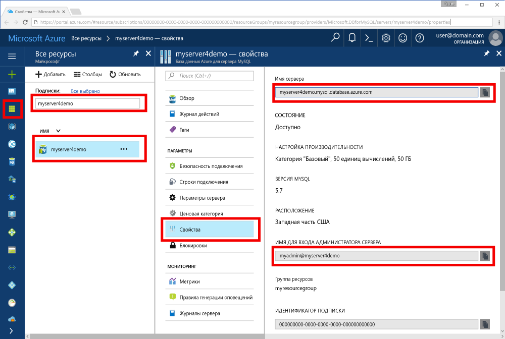

# <a name="azure-database-for-mysql-use-nodejs-tooconnect-and-query-data"></a>База данных Azure для MySQL: tooconnect и запрашивают данные, используйте Node.js
Краткого руководства показано, как tooconnect tooan Azure этой базы данных MySQL с помощью [Node.js](https://nodejs.org/) из платформ Mac, Ubuntu Linux и Windows. Показано, как tooquery инструкций SQL toouse, вставка, обновление и удаление данных в базе данных hello. Hello в этой статье предполагается, что вы знакомы с разработка с использованием Node.js и новый tooworking с базой данных Azure для MySQL, которые.

## <a name="prerequisites"></a>Предварительные требования
Это краткое руководство использует ресурсы hello, созданные в любой из этих руководствах по в качестве отправной точки.
- [Create an Azure Database for MySQL server using Azure portal](./quickstart-create-mysql-server-database-using-azure-portal.md) (Создание сервера базы данных Azure для MySQL с помощью портала Azure)
- [Create an Azure Database for MySQL server using Azure CLI](./quickstart-create-mysql-server-database-using-azure-cli.md) (Создание сервера базы данных Azure для MySQL с помощью Azure CLI)

Также вам потребуется:
- Установка hello [Node.js](https://nodejs.org) среды выполнения.
- Установка [mysql2](https://www.npmjs.com/package/mysql2) пакета tooMySQL tooconnect из Node.js приложения hello. 

## <a name="install-nodejs-and-hello-mysql-connector"></a>Установка Node.js и hello соединителя MySQL
В зависимости от используемой платформы выполните соответствующие инструкции hello tooinstall Node.js. Используйте npm tooinstall hello mysql2 пакет и его зависимости в папку проекта.

### <a name="windows"></a>**Windows**
1. Посетите hello [Node.js загружает страницу](https://nodejs.org/en/download/) и выберите нужный режим установщика Windows.
2. Создайте папку локального проекта, например `nodejsmysql`. 
3. Запустите командную строку hello и компакт-диска в папку проекта hello, такие как`cd c:\nodejsmysql\`
4. Запустите hello NPM средство tooinstall hello mysql2 библиотеки в папку проекта hello.

   ```cmd
   cd c:\nodejsmysql\
   "C:\Program Files\nodejs\npm" install mysql2
   "C:\Program Files\nodejs\npm" list
   ```

5. Проверить hello hello `npm list` вывода текста для `mysql2@1.3.5`.

### <a name="linux-ubuntu"></a>**Linux (Ubuntu)**
1. Выполнения hello следующими командами tooinstall **Node.js** и **npm** диспетчера пакетов приветствия для Node.js.

   ```bash
   sudo apt-get install -y nodejs npm
   ```

2. Запустите следующие команды toomake hello в папку проекта `mysqlnodejs` и установить пакет mysql2 hello в этой папке.

   ```bash
   mkdir nodejsmysql
   cd nodejsmysql
   npm install --save mysql2
   npm list
   ```
3. Проверить, просмотрев текст вывод списка npm для установки hello `mysql2@1.3.5`.

### <a name="mac-os"></a>**Mac OS**
1. Введите следующие команды tooinstall hello **brew**, диспетчер пакетов для использования для Mac OS X и **Node.js**.

   ```bash
   ruby -e "$(curl -fsSL https://raw.githubusercontent.com/Homebrew/install/master/install)"
   brew install node
   ```
2. Запустите следующие команды toomake hello в папку проекта `mysqlnodejs` и установить пакет mysql2 hello в этой папке.

   ```bash
   mkdir nodejsmysql
   cd nodejsmysql
   npm install --save mysql2
   npm list
   ```

3. Проверить hello hello `npm list` вывода текста для `mysql2@1.3.6`. Hello номер версии может изменяться будут выпущены новые обновления.

## <a name="get-connection-information"></a>Получение сведений о подключении
Получите toohello tooconnect базы данных Azure для hello подключения сведения, необходимые для MySQL. Необходимо hello server полное имя и учетные данные входа.

1. Войдите в toohello [портал Azure](https://portal.azure.com/).
2. Hello левой панели щелкните **все ресурсы**и выполните поиск hello сервере был создан (например, **myserver4demo**).
3. Щелкните имя сервера hello **myserver4demo**.
4. Выберите hello server **свойства** страницы. Запишите hello **имя сервера** и **имя входа администратора сервера**.
 
5. Если вы забыли учетные данные входа сервера, перейдите toohello **Обзор** страница hello tooview: имя пользователя администратора сервера и, при необходимости переустановить пароль hello.

## <a name="running-hello-javascript-code-in-nodejs"></a>Выполняет код JavaScript hello в Node.js
1. Вставьте код JavaScript hello в текстовые файлы и сохранить в папку проекта с расширением .js файла, например C:\nodejsmysql\createtable.js или /home/username/nodejsmysql/createtable.js
2. Запустите командную строку hello или bash оболочки. Перейдите в папку проекта `cd nodejsmysql`.
3. приложение hello toorun, введите команду узел hello следуют hello имя файла, например `node createtable.js`.
4. В Windows Если приложение hello узел не находится в переменной путь к среде, может потребоваться toouse hello полный путь toolaunch hello узел приложения, такие как`"C:\Program Files\nodejs\node.exe" createtable.js`

## <a name="connect-create-table-and-insert-data"></a>Подключение, создание таблицы и вставка данных
Используйте следующие hello кода tooconnect и загружать данные при помощи hello **CREATE TABLE** и **INSERT INTO** инструкции SQL.

Hello [mysql.createConnection()](https://github.com/mysqljs/mysql#establishing-connections) в противном случае используется toointerface с сервером MySQL hello. Hello [connect()](https://github.com/mysqljs/mysql#establishing-connections) функция является используется tooestablish hello соединения toohello сервера. Hello [query()](https://github.com/mysqljs/mysql#performing-queries) функция является используется tooexecute hello SQL-запрос к базе данных MySQL. 

Замените hello `host`, `user`, `password`, и `database` параметров со значениями hello, указанный при создании hello сервера и базы данных.

```javascript
const mysql = require('mysql2');

var config =
{
    host: 'myserver4demo.mysql.database.azure.com',
    user: 'myadmin@myserver4demo',
    password: 'your_password',
    database: 'quickstartdb',
    port: 3306,
    ssl: true
};

const conn = new mysql.createConnection(config);

conn.connect(
    function (err) { 
    if (err) { 
        console.log("!!! Cannot connect !!! Error:");
        throw err;
    }
    else
    {
       console.log("Connection established.");
           queryDatabase();
    }   
});

function queryDatabase(){
       conn.query('DROP TABLE IF EXISTS inventory;', function (err, results, fields) { 
            if (err) throw err; 
            console.log('Dropped inventory table if existed.');
        })
       conn.query('CREATE TABLE inventory (id serial PRIMARY KEY, name VARCHAR(50), quantity INTEGER);', 
            function (err, results, fields) {
                if (err) throw err;
            console.log('Created inventory table.');
        })
       conn.query('INSERT INTO inventory (name, quantity) VALUES (?, ?);', ['banana', 150], 
            function (err, results, fields) {
                if (err) throw err;
            else console.log('Inserted ' + results.affectedRows + ' row(s).');
        })
       conn.query('INSERT INTO inventory (name, quantity) VALUES (?, ?);', ['orange', 154], 
            function (err, results, fields) {
                if (err) throw err;
            console.log('Inserted ' + results.affectedRows + ' row(s).');
        })
       conn.query('INSERT INTO inventory (name, quantity) VALUES (?, ?);', ['apple', 100], 
        function (err, results, fields) {
                if (err) throw err;
            console.log('Inserted ' + results.affectedRows + ' row(s).');
        })
       conn.end(function (err) { 
        if (err) throw err;
        else  console.log('Done.') 
        });
};
```

## <a name="read-data"></a>Считывание данных
Используйте следующие hello кода tooconnect и чтения данных с помощью hello **ВЫБЕРИТЕ** инструкции SQL. 

Hello [mysql.createConnection()](https://github.com/mysqljs/mysql#establishing-connections) в противном случае используется toointerface с сервером MySQL hello. Hello [connect()](https://github.com/mysqljs/mysql#establishing-connections) в противном случае используется tooestablish hello соединения toohello сервера. Hello [query()](https://github.com/mysqljs/mysql#performing-queries) метод является используется tooexecute hello SQL-запрос к базе данных MySQL. Массив результатов Hello — используется toohold hello результаты запроса hello.

Замените hello `host`, `user`, `password`, и `database` параметров со значениями hello, указанный при создании hello сервера и базы данных.

```javascript
const mysql = require('mysql2');

var config =
{
    host: 'myserver4demo.mysql.database.azure.com',
    user: 'myadmin@myserver4demo',
    password: 'your_password',
    database: 'quickstartdb',
    port: 3306,
    ssl: true
};

const conn = new mysql.createConnection(config);

conn.connect(
    function (err) { 
        if (err) { 
            console.log("!!! Cannot connect !!! Error:");
            throw err;
        }
        else {
            console.log("Connection established.");
            readData();
        }   
    });

function readData(){
        conn.query('SELECT * FROM inventory', 
            function (err, results, fields) {
                if (err) throw err;
                else console.log('Selected ' + results.length + ' row(s).');
                for (i = 0; i < results.length; i++) {
                    console.log('Row: ' + JSON.stringify(results[i]));
                }
                console.log('Done.');
            })
       conn.end(
           function (err) { 
                if (err) throw err;
                else  console.log('Closing connection.') 
        });
};
```

## <a name="update-data"></a>Обновление данных
Используйте следующие hello кода tooconnect и чтения данных с помощью hello **обновление** инструкции SQL. 

Hello [mysql.createConnection()](https://github.com/mysqljs/mysql#establishing-connections) в противном случае используется toointerface с сервером MySQL hello. Hello [connect()](https://github.com/mysqljs/mysql#establishing-connections) в противном случае используется tooestablish hello соединения toohello сервера. Hello [query()](https://github.com/mysqljs/mysql#performing-queries) метод является используется tooexecute hello SQL-запрос к базе данных MySQL. 

Замените hello `host`, `user`, `password`, и `database` параметров со значениями hello, указанный при создании hello сервера и базы данных.

```javascript
const mysql = require('mysql2');

var config =
{
    host: 'myserver4demo.mysql.database.azure.com',
    user: 'myadmin@myserver4demo',
    password: 'your_password',
    database: 'quickstartdb',
    port: 3306,
    ssl: true
};

const conn = new mysql.createConnection(config);

conn.connect(
    function (err) { 
        if (err) { 
            console.log("!!! Cannot connect !!! Error:");
            throw err;
        }
        else {
            console.log("Connection established.");
            updateData();
        }   
    });

function updateData(){
       conn.query('UPDATE inventory SET quantity = ? WHERE name = ?', [200, 'banana'], 
            function (err, results, fields) {
                if (err) throw err;
                else console.log('Updated ' + results.affectedRows + ' row(s).');
        })
       conn.end(
           function (err) { 
                if (err) throw err;
                else  console.log('Done.') 
        });
};
```

## <a name="delete-data"></a>Удаление данных
Используйте следующие hello кода tooconnect и чтения данных с помощью hello **удалить** инструкции SQL. 

Hello [mysql.createConnection()](https://github.com/mysqljs/mysql#establishing-connections) в противном случае используется toointerface с сервером MySQL hello. Hello [connect()](https://github.com/mysqljs/mysql#establishing-connections) в противном случае используется tooestablish hello соединения toohello сервера. Hello [query()](https://github.com/mysqljs/mysql#performing-queries) метод является используется tooexecute hello SQL-запрос к базе данных MySQL. 

Замените hello `host`, `user`, `password`, и `database` параметров со значениями hello, указанный при создании hello сервера и базы данных.

```javascript
const mysql = require('mysql2');

var config =
{
    host: 'myserver4demo.mysql.database.azure.com',
    user: 'myadmin@myserver4demo',
    password: 'your_password',
    database: 'quickstartdb',
    port: 3306,
    ssl: true
};

const conn = new mysql.createConnection(config);

conn.connect(
    function (err) { 
        if (err) { 
            console.log("!!! Cannot connect !!! Error:");
            throw err;
        }
        else {
            console.log("Connection established.");
            deleteData();
        }   
    });

function deleteData(){
       conn.query('DELETE FROM inventory WHERE name = ?', ['orange'], 
            function (err, results, fields) {
                if (err) throw err;
                else console.log('Deleted ' + results.affectedRows + ' row(s).');
        })
       conn.end(
           function (err) { 
                if (err) throw err;
                else  console.log('Done.') 
        });
};
```

## <a name="next-steps"></a>Дальнейшие действия
> [!div class="nextstepaction"]
> [Перенос базы данных с помощью экспорта и импорта](./concepts-migrate-import-export.md)
