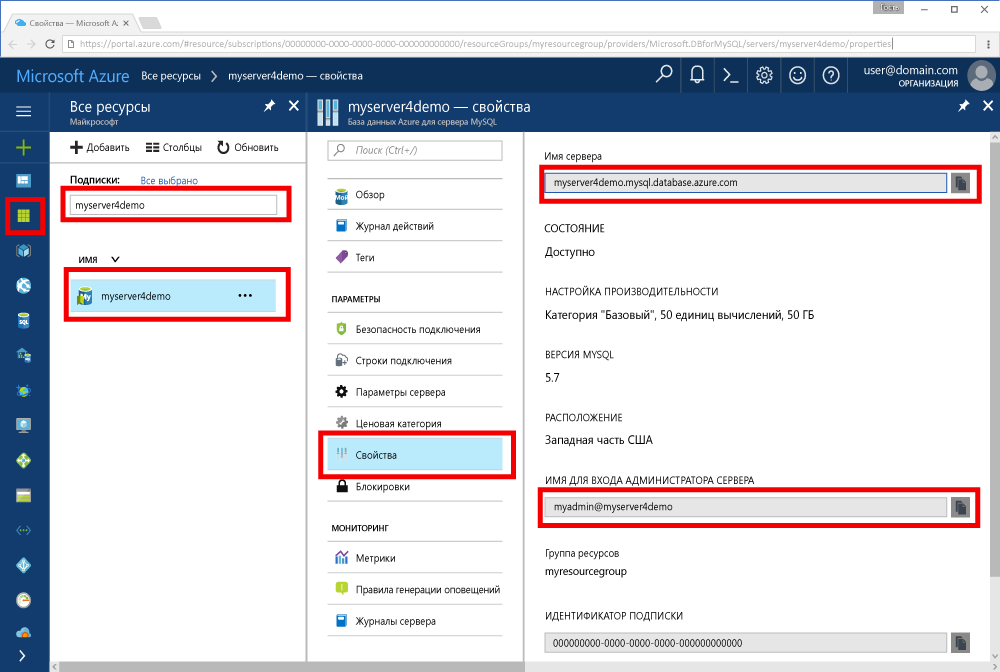

# <a name="azure-database-for-mysql-use-python-tooconnect-and-query-data"></a><span data-ttu-id="69f5b-103">База данных Azure для MySQL: использование Python tooconnect и запроса данных</span><span class="sxs-lookup"><span data-stu-id="69f5b-103">Azure Database for MySQL: Use Python tooconnect and query data</span></span>
<span data-ttu-id="69f5b-104">Это краткое руководство демонстрирует, как toouse [Python](https://python.org) tooconnect tooan базы данных Azure для MySQL.</span><span class="sxs-lookup"><span data-stu-id="69f5b-104">This quickstart demonstrates how toouse [Python](https://python.org) tooconnect tooan Azure Database for MySQL.</span></span> <span data-ttu-id="69f5b-105">В нем tooquery инструкций SQL, insert, update и delete данных в базе данных hello из платформ Mac OS, Ubuntu Linux и Windows.</span><span class="sxs-lookup"><span data-stu-id="69f5b-105">It uses SQL statements tooquery, insert, update, and delete data in hello database from Mac OS, Ubuntu Linux, and Windows platforms.</span></span> <span data-ttu-id="69f5b-106">Hello в этой статье предполагается, что представление о разработке с помощью Python и являются новый tooworking с базой данных Azure для MySQL.</span><span class="sxs-lookup"><span data-stu-id="69f5b-106">hello steps in this article assume that you are familiar with developing using Python and are new tooworking with Azure Database for MySQL.</span></span>

## <a name="prerequisites"></a><span data-ttu-id="69f5b-107">Предварительные требования</span><span class="sxs-lookup"><span data-stu-id="69f5b-107">Prerequisites</span></span>
<span data-ttu-id="69f5b-108">Это краткое руководство использует ресурсы hello, созданные в любой из этих руководствах по в качестве отправной точки.</span><span class="sxs-lookup"><span data-stu-id="69f5b-108">This quickstart uses hello resources created in either of these guides as a starting point:</span></span>
- <span data-ttu-id="69f5b-109">[Create an Azure Database for MySQL server using Azure portal](./quickstart-create-mysql-server-database-using-azure-portal.md) (Создание сервера базы данных Azure для MySQL с помощью портала Azure)</span><span class="sxs-lookup"><span data-stu-id="69f5b-109">[Create an Azure Database for MySQL server using Azure portal](./quickstart-create-mysql-server-database-using-azure-portal.md)</span></span>
- <span data-ttu-id="69f5b-110">[Create an Azure Database for MySQL server using Azure CLI](./quickstart-create-mysql-server-database-using-azure-cli.md) (Создание сервера базы данных Azure для MySQL с помощью Azure CLI)</span><span class="sxs-lookup"><span data-stu-id="69f5b-110">[Create an Azure Database for MySQL server using Azure CLI](./quickstart-create-mysql-server-database-using-azure-cli.md)</span></span>

## <a name="install-python-and-hello-mysql-connector"></a><span data-ttu-id="69f5b-111">Установка Python и hello соединителя MySQL</span><span class="sxs-lookup"><span data-stu-id="69f5b-111">Install Python and hello MySQL connector</span></span>
<span data-ttu-id="69f5b-112">Установка [Python](https://www.python.org/downloads/) и hello [соединитель MySQL для Python](https://dev.mysql.com/downloads/connector/python/) на компьютере.</span><span class="sxs-lookup"><span data-stu-id="69f5b-112">Install [Python](https://www.python.org/downloads/) and hello [MySQL connector for Python](https://dev.mysql.com/downloads/connector/python/) on your own machine.</span></span> <span data-ttu-id="69f5b-113">В зависимости от используемой платформы выполните действия hello.</span><span class="sxs-lookup"><span data-stu-id="69f5b-113">Depending on your platform, follow hello steps:</span></span>

### <a name="windows"></a><span data-ttu-id="69f5b-114">Windows</span><span class="sxs-lookup"><span data-stu-id="69f5b-114">Windows</span></span>
1. <span data-ttu-id="69f5b-115">Скачайте и установите Python 2.7 с веб-сайта [python.org](https://www.python.org/downloads/windows/).</span><span class="sxs-lookup"><span data-stu-id="69f5b-115">Download and Install Python 2.7 from [python.org](https://www.python.org/downloads/windows/).</span></span> 
2. <span data-ttu-id="69f5b-116">Проверьте установки Python hello, запустив hello командной строки.</span><span class="sxs-lookup"><span data-stu-id="69f5b-116">Check hello Python installation by launching hello command prompt.</span></span> <span data-ttu-id="69f5b-117">Выполните команду hello `C:\python27\python.exe -V` с помощью hello прописные V коммутатора toosee hello номер версии.</span><span class="sxs-lookup"><span data-stu-id="69f5b-117">Run hello command `C:\python27\python.exe -V` using hello uppercase V switch toosee hello version number.</span></span>
3. <span data-ttu-id="69f5b-118">Установка соединителя hello Python для MySQL из [mysql.com](https://dev.mysql.com/downloads/connector/python/) соответствующую версию tooyour Python.</span><span class="sxs-lookup"><span data-stu-id="69f5b-118">Install hello Python connector for MySQL from [mysql.com](https://dev.mysql.com/downloads/connector/python/) corresponding tooyour version of Python.</span></span>

### <a name="linux-ubuntu"></a><span data-ttu-id="69f5b-119">Linux (Ubuntu)</span><span class="sxs-lookup"><span data-stu-id="69f5b-119">Linux (Ubuntu)</span></span>
1. <span data-ttu-id="69f5b-120">В Linux (Ubuntu) Python обычно устанавливается как часть установки по умолчанию hello.</span><span class="sxs-lookup"><span data-stu-id="69f5b-120">In Linux (Ubuntu), Python is typically installed as part of hello default installation.</span></span>
2. <span data-ttu-id="69f5b-121">Проверьте установки Python hello путем запуска команд bash hello.</span><span class="sxs-lookup"><span data-stu-id="69f5b-121">Check hello Python installation by launching hello bash shell.</span></span> <span data-ttu-id="69f5b-122">Выполните команду hello `python -V` с помощью hello прописные V коммутатора toosee hello номер версии.</span><span class="sxs-lookup"><span data-stu-id="69f5b-122">Run hello command `python -V` using hello uppercase V switch toosee hello version number.</span></span>
3. <span data-ttu-id="69f5b-123">Проверьте установку PIP hello, запустив hello `pip show pip -V` команды номер версии toosee hello.</span><span class="sxs-lookup"><span data-stu-id="69f5b-123">Check hello PIP installation by running hello `pip show pip -V` command toosee hello version number.</span></span> 
4. <span data-ttu-id="69f5b-124">PIP может быть включен в некоторых версиях Python.</span><span class="sxs-lookup"><span data-stu-id="69f5b-124">PIP may be included in some versions of Python.</span></span> <span data-ttu-id="69f5b-125">Если PIP не установлен, может потребоваться установить hello [PIP] (https://pip.pypa.io/en/stable/installing/) пакета, выполнив команду `sudo apt-get install python-pip`.</span><span class="sxs-lookup"><span data-stu-id="69f5b-125">If PIP is not installed, you may install hello [PIP] (https://pip.pypa.io/en/stable/installing/) package, by running command `sudo apt-get install python-pip`.</span></span>
5. <span data-ttu-id="69f5b-126">Обновление PIP toohello последней версии, выполнив hello `pip install -U pip` команды.</span><span class="sxs-lookup"><span data-stu-id="69f5b-126">Update PIP toohello latest version, by running hello `pip install -U pip` command.</span></span>
6. <span data-ttu-id="69f5b-127">Установите соединитель MySQL hello Python и его зависимостей с помощью команды hello PIP-адрес:</span><span class="sxs-lookup"><span data-stu-id="69f5b-127">Install hello MySQL connector for Python, and its dependencies by using hello PIP command:</span></span>

   ```bash
   sudo pip install mysql-connector-python-rf
   ```
 
### <a name="macos"></a><span data-ttu-id="69f5b-128">MacOS</span><span class="sxs-lookup"><span data-stu-id="69f5b-128">MacOS</span></span>
1. <span data-ttu-id="69f5b-129">В Mac OS Python обычно устанавливается как часть установки операционной системы по умолчанию hello.</span><span class="sxs-lookup"><span data-stu-id="69f5b-129">In Mac OS, Python is typically installed as part of hello default OS installation.</span></span>
2. <span data-ttu-id="69f5b-130">Проверьте установки Python hello путем запуска команд bash hello.</span><span class="sxs-lookup"><span data-stu-id="69f5b-130">Check hello Python installation by launching hello bash shell.</span></span> <span data-ttu-id="69f5b-131">Выполните команду hello `python -V` с помощью hello прописные V коммутатора toosee hello номер версии.</span><span class="sxs-lookup"><span data-stu-id="69f5b-131">Run hello command `python -V` using hello uppercase V switch toosee hello version number.</span></span>
3. <span data-ttu-id="69f5b-132">Проверьте установку PIP hello, запустив hello `pip show pip -V` команды номер версии toosee hello.</span><span class="sxs-lookup"><span data-stu-id="69f5b-132">Check hello PIP installation by running hello `pip show pip -V` command toosee hello version number.</span></span>
4. <span data-ttu-id="69f5b-133">PIP может быть включен в некоторых версиях Python.</span><span class="sxs-lookup"><span data-stu-id="69f5b-133">PIP may be included in some versions of Python.</span></span> <span data-ttu-id="69f5b-134">Если PIP не установлен, может потребоваться установить hello [PIP](https://pip.pypa.io/en/stable/installing/) пакета.</span><span class="sxs-lookup"><span data-stu-id="69f5b-134">If PIP is not installed, you may install hello [PIP](https://pip.pypa.io/en/stable/installing/) package.</span></span>
5. <span data-ttu-id="69f5b-135">Обновление PIP toohello последней версии, выполнив hello `pip install -U pip` команды.</span><span class="sxs-lookup"><span data-stu-id="69f5b-135">Update PIP toohello latest version, by running hello `pip install -U pip` command.</span></span>
6. <span data-ttu-id="69f5b-136">Установите соединитель MySQL hello Python и его зависимостей с помощью команды hello PIP-адрес:</span><span class="sxs-lookup"><span data-stu-id="69f5b-136">Install hello MySQL connector for Python, and its dependencies by using hello PIP command:</span></span>

   ```bash
   pip install mysql-connector-python-rf
   ```

## <a name="get-connection-information"></a><span data-ttu-id="69f5b-137">Получение сведений о подключении</span><span class="sxs-lookup"><span data-stu-id="69f5b-137">Get connection information</span></span>
<span data-ttu-id="69f5b-138">Получите toohello tooconnect базы данных Azure для hello подключения сведения, необходимые для MySQL.</span><span class="sxs-lookup"><span data-stu-id="69f5b-138">Get hello connection information needed tooconnect toohello Azure Database for MySQL.</span></span> <span data-ttu-id="69f5b-139">Необходимо hello server полное имя и учетные данные входа.</span><span class="sxs-lookup"><span data-stu-id="69f5b-139">You need hello fully qualified server name and login credentials.</span></span>

1. <span data-ttu-id="69f5b-140">Войдите в toohello [портал Azure](https://portal.azure.com/).</span><span class="sxs-lookup"><span data-stu-id="69f5b-140">Log in toohello [Azure portal](https://portal.azure.com/).</span></span>
2. <span data-ttu-id="69f5b-141">Hello левого меню на портале Azure, щелкните **все ресурсы** и выполните поиск сервера hello, можно creased, такие как **myserver4demo**.</span><span class="sxs-lookup"><span data-stu-id="69f5b-141">From hello left-hand menu in Azure portal, click **All resources** and search for hello server you have creased, such as **myserver4demo**.</span></span>
3. <span data-ttu-id="69f5b-142">Щелкните имя сервера hello **myserver4demo**.</span><span class="sxs-lookup"><span data-stu-id="69f5b-142">Click hello server name **myserver4demo**.</span></span>
4. <span data-ttu-id="69f5b-143">Выберите hello server **свойства** страницы.</span><span class="sxs-lookup"><span data-stu-id="69f5b-143">Select hello server's **Properties** page.</span></span> <span data-ttu-id="69f5b-144">Запишите hello **имя сервера** и **имя входа администратора сервера**.</span><span class="sxs-lookup"><span data-stu-id="69f5b-144">Make a note of hello **Server name** and **Server admin login name**.</span></span>
 <span data-ttu-id="69f5b-145"></span><span class="sxs-lookup"><span data-stu-id="69f5b-145"></span></span>
5. <span data-ttu-id="69f5b-146">Если вы забыли учетные данные входа сервера, перейдите toohello **Обзор** страница hello tooview: имя пользователя администратора сервера и, при необходимости переустановить пароль hello.</span><span class="sxs-lookup"><span data-stu-id="69f5b-146">If you forget your server login information, navigate toohello **Overview** page tooview hello Server admin login name and, if necessary, reset hello password.</span></span>
   

## <a name="run-python-code"></a><span data-ttu-id="69f5b-147">Выполнение кода Python</span><span class="sxs-lookup"><span data-stu-id="69f5b-147">Run Python Code</span></span>
- <span data-ttu-id="69f5b-148">Вставьте код hello в текстовый файл и сохраните файл hello в проект папку с .py расширение файла, например C:\pythonmysql\createtable.py или /home/username/pythonmysql/createtable.py</span><span class="sxs-lookup"><span data-stu-id="69f5b-148">Paste hello code into a text file, and save hello file into a project folder with file extension .py, such as C:\pythonmysql\createtable.py or /home/username/pythonmysql/createtable.py</span></span>
- <span data-ttu-id="69f5b-149">toorun hello кода, запустите командную строку hello или bash оболочки.</span><span class="sxs-lookup"><span data-stu-id="69f5b-149">toorun hello code, launch hello command prompt or bash shell.</span></span> <span data-ttu-id="69f5b-150">Перейдите в папку проекта `cd pythonmysql`.</span><span class="sxs-lookup"><span data-stu-id="69f5b-150">Change directory into your project folder `cd pythonmysql`.</span></span> <span data-ttu-id="69f5b-151">Затем введите команду hello python, за которым следует имя файла hello `python createtable.py` toorun приложения hello.</span><span class="sxs-lookup"><span data-stu-id="69f5b-151">Then type hello python command followed by hello file name `python createtable.py` toorun hello application.</span></span> <span data-ttu-id="69f5b-152">На hello ОС Windows Если python.exe не найден, вы может предоставить hello полный путь toohello исполняемый файл или добавить hello Python путь в переменной среды path hello.</span><span class="sxs-lookup"><span data-stu-id="69f5b-152">On hello Windows OS, if python.exe is not found, you may provide hello full path toohello executable, or add hello Python path into hello path environment variable.</span></span> `C:\python27\python.exe createtable.py`

## <a name="connect-create-table-and-insert-data"></a><span data-ttu-id="69f5b-153">Подключение, создание таблицы и вставка данных</span><span class="sxs-lookup"><span data-stu-id="69f5b-153">Connect, create table, and insert data</span></span>
<span data-ttu-id="69f5b-154">Используйте следующие hello кода tooconnect toohello сервера, создайте таблицу и загружать данные при помощи hello **вставить** инструкции SQL.</span><span class="sxs-lookup"><span data-stu-id="69f5b-154">Use hello following code tooconnect toohello server, create a table, and load hello data using an **INSERT** SQL statement.</span></span> 

<span data-ttu-id="69f5b-155">В коде hello импорта библиотеки mysql.connector hello.</span><span class="sxs-lookup"><span data-stu-id="69f5b-155">In hello code, hello mysql.connector library is imported.</span></span> <span data-ttu-id="69f5b-156">Hello [connect()](https://dev.mysql.com/doc/connector-python/en/connector-python-api-mysql-connector-connect.html) функция является tooAzure используется tooconnect базы данных MySQL с помощью hello [аргументы соединения](https://dev.mysql.com/doc/connector-python/en/connector-python-connectargs.html) в коллекции конфигурации hello.</span><span class="sxs-lookup"><span data-stu-id="69f5b-156">hello [connect()](https://dev.mysql.com/doc/connector-python/en/connector-python-api-mysql-connector-connect.html) function is used tooconnect tooAzure Database for MySQL using hello [connection arguments](https://dev.mysql.com/doc/connector-python/en/connector-python-connectargs.html) in hello config collection.</span></span> <span data-ttu-id="69f5b-157">Hello код использует курсор для соединения hello и [cursor.execute()](https://dev.mysql.com/doc/connector-python/en/connector-python-api-mysqlcursor-execute.html) метод выполняет запрос SQL hello в базу данных MySQL.</span><span class="sxs-lookup"><span data-stu-id="69f5b-157">hello code uses a cursor on hello connection, and [cursor.execute()](https://dev.mysql.com/doc/connector-python/en/connector-python-api-mysqlcursor-execute.html) method executes hello SQL query against MySQL database.</span></span> 

<span data-ttu-id="69f5b-158">Замените hello `host`, `user`, `password`, и `database` параметров со значениями hello, указанный при создании hello сервера и базы данных.</span><span class="sxs-lookup"><span data-stu-id="69f5b-158">Replace hello `host`, `user`, `password`, and `database` parameters with hello values that you specified when you created hello server and database.</span></span>

```Python
import mysql.connector
from mysql.connector import errorcode

# Obtain connection string information from hello portal
config = {
  'host':'myserver4demo.mysql.database.azure.com',
  'user':'myadmin@myserver4demo',
  'password':'yourpassword',
  'database':'quickstartdb'
}

# Construct connection string
try:
   conn = mysql.connector.connect(**config)
   print("Connection established")
except mysql.connector.Error as err:
  if err.errno == errorcode.ER_ACCESS_DENIED_ERROR:
    print("Something is wrong with hello user name or password")
  elif err.errno == errorcode.ER_BAD_DB_ERROR:
    print("Database does not exist")
  else:
    print(err)
else:
  cursor = conn.cursor()

  # Drop previous table of same name if one exists
  cursor.execute("DROP TABLE IF EXISTS inventory;")
  print("Finished dropping table (if existed).")

  # Create table
  cursor.execute("CREATE TABLE inventory (id serial PRIMARY KEY, name VARCHAR(50), quantity INTEGER);")
  print("Finished creating table.")

  # Insert some data into table
  cursor.execute("INSERT INTO inventory (name, quantity) VALUES (%s, %s);", ("banana", 150))
  print("Inserted",cursor.rowcount,"row(s) of data.")
  cursor.execute("INSERT INTO inventory (name, quantity) VALUES (%s, %s);", ("orange", 154))
  print("Inserted",cursor.rowcount,"row(s) of data.")
  cursor.execute("INSERT INTO inventory (name, quantity) VALUES (%s, %s);", ("apple", 100))
  print("Inserted",cursor.rowcount,"row(s) of data.")

  # Cleanup
  conn.commit()
  cursor.close()
  conn.close()
  print("Done.")
```

## <a name="read-data"></a><span data-ttu-id="69f5b-159">Считывание данных</span><span class="sxs-lookup"><span data-stu-id="69f5b-159">Read data</span></span>
<span data-ttu-id="69f5b-160">Используйте следующие hello кода tooconnect и чтения данных с помощью hello **ВЫБЕРИТЕ** инструкции SQL.</span><span class="sxs-lookup"><span data-stu-id="69f5b-160">Use hello following code tooconnect and read hello data using a **SELECT** SQL statement.</span></span> 

<span data-ttu-id="69f5b-161">В коде hello импорта библиотеки mysql.connector hello.</span><span class="sxs-lookup"><span data-stu-id="69f5b-161">In hello code, hello mysql.connector library is imported.</span></span> <span data-ttu-id="69f5b-162">Hello [connect()](https://dev.mysql.com/doc/connector-python/en/connector-python-api-mysql-connector-connect.html) функция является tooAzure используется tooconnect базы данных MySQL с помощью hello [аргументы соединения](https://dev.mysql.com/doc/connector-python/en/connector-python-connectargs.html) в коллекции конфигурации hello.</span><span class="sxs-lookup"><span data-stu-id="69f5b-162">hello [connect()](https://dev.mysql.com/doc/connector-python/en/connector-python-api-mysql-connector-connect.html) function is used tooconnect tooAzure Database for MySQL using hello [connection arguments](https://dev.mysql.com/doc/connector-python/en/connector-python-connectargs.html) in hello config collection.</span></span> <span data-ttu-id="69f5b-163">Hello код использует курсор для соединения hello и [cursor.execute()](https://dev.mysql.com/doc/connector-python/en/connector-python-api-mysqlcursor-execute.html) метод выполняет hello инструкции SQL для базы данных MySQL.</span><span class="sxs-lookup"><span data-stu-id="69f5b-163">hello code uses a cursor on hello connection, and [cursor.execute()](https://dev.mysql.com/doc/connector-python/en/connector-python-api-mysqlcursor-execute.html) method executes hello SQL statement against MySQL database.</span></span> <span data-ttu-id="69f5b-164">строки данных Hello считываются с использованием hello [fetchall()](https://dev.mysql.com/doc/connector-python/en/connector-python-api-mysqlcursor-fetchall.html) метод.</span><span class="sxs-lookup"><span data-stu-id="69f5b-164">hello data rows are read using hello [fetchall()](https://dev.mysql.com/doc/connector-python/en/connector-python-api-mysqlcursor-fetchall.html) method.</span></span> <span data-ttu-id="69f5b-165">Hello результирующий набор хранится в строке коллекции и для итератора используется tooloop по строкам hello.</span><span class="sxs-lookup"><span data-stu-id="69f5b-165">hello result set is kept in a collection row and a for iterator is used tooloop over hello rows.</span></span>

<span data-ttu-id="69f5b-166">Замените hello `host`, `user`, `password`, и `database` параметров со значениями hello, указанный при создании hello сервера и базы данных.</span><span class="sxs-lookup"><span data-stu-id="69f5b-166">Replace hello `host`, `user`, `password`, and `database` parameters with hello values that you specified when you created hello server and database.</span></span>

```Python
import mysql.connector
from mysql.connector import errorcode

# Obtain connection string information from hello portal
config = {
  'host':'myserver4demo.mysql.database.azure.com',
  'user':'myadmin@myserver4demo',
  'password':'yourpassword',
  'database':'quickstartdb'
}

# Construct connection string
try:
   conn = mysql.connector.connect(**config)
   print("Connection established")
except mysql.connector.Error as err:
  if err.errno == errorcode.ER_ACCESS_DENIED_ERROR:
    print("Something is wrong with hello user name or password")
  elif err.errno == errorcode.ER_BAD_DB_ERROR:
    print("Database does not exist")
  else:
    print(err)
else:
  cursor = conn.cursor()

  # Read data
  cursor.execute("SELECT * FROM inventory;")
  rows = cursor.fetchall()
  print("Read",cursor.rowcount,"row(s) of data.")

  # Print all rows
  for row in rows:
    print("Data row = (%s, %s, %s)" %(str(row[0]), str(row[1]), str(row[2])))

  # Cleanup
  conn.commit()
  cursor.close()
  conn.close()
  print("Done.")
```

## <a name="update-data"></a><span data-ttu-id="69f5b-167">Обновление данных</span><span class="sxs-lookup"><span data-stu-id="69f5b-167">Update data</span></span>
<span data-ttu-id="69f5b-168">Используйте следующие hello кода tooconnect и обновления данных с помощью hello **обновление** инструкции SQL.</span><span class="sxs-lookup"><span data-stu-id="69f5b-168">Use hello following code tooconnect and update hello data using a **UPDATE** SQL statement.</span></span> 

<span data-ttu-id="69f5b-169">В коде hello импорта библиотеки mysql.connector hello.</span><span class="sxs-lookup"><span data-stu-id="69f5b-169">In hello code, hello mysql.connector library is imported.</span></span>  <span data-ttu-id="69f5b-170">Hello [connect()](https://dev.mysql.com/doc/connector-python/en/connector-python-api-mysql-connector-connect.html) функция является tooAzure используется tooconnect базы данных MySQL с помощью hello [аргументы соединения](https://dev.mysql.com/doc/connector-python/en/connector-python-connectargs.html) в коллекции конфигурации hello.</span><span class="sxs-lookup"><span data-stu-id="69f5b-170">hello [connect()](https://dev.mysql.com/doc/connector-python/en/connector-python-api-mysql-connector-connect.html) function is used tooconnect tooAzure Database for MySQL using hello [connection arguments](https://dev.mysql.com/doc/connector-python/en/connector-python-connectargs.html) in hello config collection.</span></span> <span data-ttu-id="69f5b-171">Hello код использует курсор для соединения hello и [cursor.execute()](https://dev.mysql.com/doc/connector-python/en/connector-python-api-mysqlcursor-execute.html) метод выполняет hello инструкции SQL для базы данных MySQL.</span><span class="sxs-lookup"><span data-stu-id="69f5b-171">hello code uses a cursor on hello connection, and [cursor.execute()](https://dev.mysql.com/doc/connector-python/en/connector-python-api-mysqlcursor-execute.html) method executes hello SQL statement against MySQL database.</span></span> 

<span data-ttu-id="69f5b-172">Замените hello `host`, `user`, `password`, и `database` параметров со значениями hello, указанный при создании hello сервера и базы данных.</span><span class="sxs-lookup"><span data-stu-id="69f5b-172">Replace hello `host`, `user`, `password`, and `database` parameters with hello values that you specified when you created hello server and database.</span></span>

```Python
import mysql.connector
from mysql.connector import errorcode

# Obtain connection string information from hello portal
config = {
  'host':'myserver4demo.mysql.database.azure.com',
  'user':'myadmin@myserver4demo',
  'password':'yourpassword',
  'database':'quickstartdb'
}

# Construct connection string
try:
   conn = mysql.connector.connect(**config)
   print("Connection established")
except mysql.connector.Error as err:
  if err.errno == errorcode.ER_ACCESS_DENIED_ERROR:
    print("Something is wrong with hello user name or password")
  elif err.errno == errorcode.ER_BAD_DB_ERROR:
    print("Database does not exist")
  else:
    print(err)
else:
  cursor = conn.cursor()

  # Update a data row in hello table
  cursor.execute("UPDATE inventory SET quantity = %s WHERE name = %s;", (200, "banana"))
  print("Updated",cursor.rowcount,"row(s) of data.")

  # Cleanup
  conn.commit()
  cursor.close()
  conn.close()
  print("Done.")
```

## <a name="delete-data"></a><span data-ttu-id="69f5b-173">Удаление данных</span><span class="sxs-lookup"><span data-stu-id="69f5b-173">Delete data</span></span>
<span data-ttu-id="69f5b-174">Используйте следующие hello кода tooconnect и удаление данных с помощью **удалить** инструкции SQL.</span><span class="sxs-lookup"><span data-stu-id="69f5b-174">Use hello following code tooconnect and remove data using a **DELETE** SQL statement.</span></span> 

<span data-ttu-id="69f5b-175">В коде hello импорта библиотеки mysql.connector hello.</span><span class="sxs-lookup"><span data-stu-id="69f5b-175">In hello code, hello mysql.connector library is imported.</span></span>  <span data-ttu-id="69f5b-176">Hello [connect()](https://dev.mysql.com/doc/connector-python/en/connector-python-api-mysql-connector-connect.html) функция является tooAzure используется tooconnect базы данных MySQL с помощью hello [аргументы соединения](https://dev.mysql.com/doc/connector-python/en/connector-python-connectargs.html) в коллекции конфигурации hello.</span><span class="sxs-lookup"><span data-stu-id="69f5b-176">hello [connect()](https://dev.mysql.com/doc/connector-python/en/connector-python-api-mysql-connector-connect.html) function is used tooconnect tooAzure Database for MySQL using hello [connection arguments](https://dev.mysql.com/doc/connector-python/en/connector-python-connectargs.html) in hello config collection.</span></span> <span data-ttu-id="69f5b-177">Hello код использует курсор для соединения hello и [cursor.execute()](https://dev.mysql.com/doc/connector-python/en/connector-python-api-mysqlcursor-execute.html) метод выполняет запрос SQL hello в базу данных MySQL.</span><span class="sxs-lookup"><span data-stu-id="69f5b-177">hello code uses a cursor on hello connection, and [cursor.execute()](https://dev.mysql.com/doc/connector-python/en/connector-python-api-mysqlcursor-execute.html) method executes hello SQL query against MySQL database.</span></span> 

<span data-ttu-id="69f5b-178">Замените hello `host`, `user`, `password`, и `database` параметров со значениями hello, указанный при создании hello сервера и базы данных.</span><span class="sxs-lookup"><span data-stu-id="69f5b-178">Replace hello `host`, `user`, `password`, and `database` parameters with hello values that you specified when you created hello server and database.</span></span>

```Python
import mysql.connector
from mysql.connector import errorcode

# Obtain connection string information from hello portal
config = {
  'host':'myserver4demo.mysql.database.azure.com',
  'user':'myadmin@myserver4demo',
  'password':'yourpassword',
  'database':'quickstartdb'
}

# Construct connection string
try:
   conn = mysql.connector.connect(**config)
   print("Connection established.")
except mysql.connector.Error as err:
  if err.errno == errorcode.ER_ACCESS_DENIED_ERROR:
    print("Something is wrong with hello user name or password.")
  elif err.errno == errorcode.ER_BAD_DB_ERROR:
    print("Database does not exist.")
  else:
    print(err)
else:
  cursor = conn.cursor()

  # Delete a data row in hello table
  cursor.execute("DELETE FROM inventory WHERE name=%(param1)s;", {'param1':"orange"})
  print("Deleted",cursor.rowcount,"row(s) of data.")

  # Cleanup
  conn.commit()
  cursor.close()
  conn.close()
  print("Done.")
```

## <a name="next-steps"></a><span data-ttu-id="69f5b-179">Дальнейшие действия</span><span class="sxs-lookup"><span data-stu-id="69f5b-179">Next steps</span></span>
> [!div class="nextstepaction"]
> [<span data-ttu-id="69f5b-180">Перенос базы данных с помощью экспорта и импорта</span><span class="sxs-lookup"><span data-stu-id="69f5b-180">Migrate your database using Export and Import</span></span>](./concepts-migrate-import-export.md)
