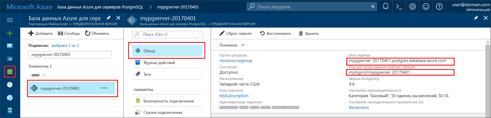

# <a name="azure-database-for-postgresql-use-nodejs-tooconnect-and-query-data"></a>База данных Azure для PostgreSQL: использование Node.js tooconnect и запроса данных
Это краткое руководство демонстрирует, как tooconnect tooan Azure этой базы данных с помощью PostgreSQL [Node.js](https://nodejs.org/). Показано, как tooquery инструкций SQL toouse, вставка, обновление и удаление данных в базе данных hello. Hello в этой статье предполагается, что вы знакомы с разработка с использованием Node.js и новый tooworking с базой данных Azure для PostgreSQL, которые.

## <a name="prerequisites"></a>Предварительные требования
Это краткое руководство использует ресурсы hello, созданные в любой из этих руководствах по в качестве отправной точки.
- [Создание базы данных с помощью портала](quickstart-create-server-database-portal.md)
- [Создание базы данных SQL Azure и отправка к ней запросов с помощью Azure CLI](quickstart-create-server-database-azure-cli.md)

Также вам потребуется:
- Установите [Node.js](https://nodejs.org)

## <a name="install-pg-client"></a>Установка клиента pg
Установите [pg](https://www.npmjs.com/package/pg), клиент PostgreSQL для Node.js.

toodo таким образом, запустите диспетчер пакетов node hello (npm-файл) для JavaScript из клиента pg hello tooinstall командной строки.
```bash
npm install pg
```

Проверка установки hello, перечисляя установленных пакетов hello.
```bash
npm list
```

## <a name="get-connection-information"></a>Получение сведений о подключении
Получите toohello tooconnect базы данных Azure для hello подключения сведения, необходимые для PostgreSQL. Необходимо hello server полное имя и учетные данные входа.

1. Войдите в toohello [портал Azure](https://portal.azure.com/).
2. Hello левого меню на портале Azure, щелкните **все ресурсы** и найдите только что созданный сервер hello.
3. Щелкните имя сервера hello.
4. Выберите hello server **Обзор** страницы. Запишите hello **имя сервера** и **имя входа администратора сервера**.
 
5. Если вы забыли учетные данные входа сервера, перейдите toohello **Обзор** страница hello tooview: имя пользователя администратора сервера и, при необходимости переустановить пароль hello.

## <a name="running-hello-javascript-code-in-nodejs"></a>Выполняет код JavaScript hello в Node.js
Могут запускать Node.js из hello bash оболочки или окна командной строки, введя `node`, интерактивного запуска кода JavaScript в примере hello путем копирования и вставки его в строке приветствия. Кроме того, вы можете сохранить hello код JavaScript в текстовый файл и запустите `node filename.js` с именем файла hello как toorun параметр его.

## <a name="connect-create-table-and-insert-data"></a>Подключение, создание таблицы и вставка данных
Используйте следующие hello кода tooconnect и загружать данные при помощи hello **CREATE TABLE** и **INSERT INTO** инструкции SQL.
Hello [pg. Клиент](https://github.com/brianc/node-postgres/wiki/Client) объект является используется toointerface с сервером PostgreSQL hello. Hello [pg. Client.Connect()](https://github.com/brianc/node-postgres/wiki/Client#method-connect) функция является используется tooestablish hello соединения toohello сервера. Hello [pg. Client.Query()](https://github.com/brianc/node-postgres/wiki/Query) функция является используется tooexecute hello SQL-запрос к базе данных PostgreSQL. 

Замените узел hello, dbname, пользователя и пароль параметры со значениями hello, указанный при создании hello сервера и базы данных.

```javascript
const pg = require('pg');

const config = {
    host: '<your-db-server-name>.postgres.database.azure.com',
    // Do not hard code your username and password.
    // Consider using Node environment variables.
    user: '<your-db-username>',     
    password: '<your-password>',
    database: '<name-of-database>',
    port: 5432,
    ssl: true
};

const client = new pg.Client(config);

client.connect(err => {
    if (err) throw err;
    else {
        queryDatabase();
    }
});

function queryDatabase() {
    const query = `
        DROP TABLE IF EXISTS inventory;
        CREATE TABLE inventory (id serial PRIMARY KEY, name VARCHAR(50), quantity INTEGER);
        INSERT INTO inventory (name, quantity) VALUES ('banana', 150);
        INSERT INTO inventory (name, quantity) VALUES ('orange', 154);
        INSERT INTO inventory (name, quantity) VALUES ('apple', 100);
    `;

    client
        .query(query)
        .then(() => {
            console.log('Table created successfully!');
            client.end(console.log('Closed client connection'));
        })
        .catch(err => console.log(err))
        .then(() => {
            console.log('Finished execution, exiting now');
            process.exit();
        });
}
```

## <a name="read-data"></a>Считывание данных
Используйте следующие hello кода tooconnect и чтения данных с помощью hello **ВЫБЕРИТЕ** инструкции SQL. Hello [pg. Клиент](https://github.com/brianc/node-postgres/wiki/Client) объект является используется toointerface с сервером PostgreSQL hello. Hello [pg. Client.Connect()](https://github.com/brianc/node-postgres/wiki/Client#method-connect) функция является используется tooestablish hello соединения toohello сервера. Hello [pg. Client.Query()](https://github.com/brianc/node-postgres/wiki/Query) функция является используется tooexecute hello SQL-запрос к базе данных PostgreSQL. 

Замените узел hello, dbname, пользователя и пароль параметры со значениями hello, указанный при создании hello сервера и базы данных. 

```javascript
const pg = require('pg');

const config = {
    host: '<your-db-server-name>.postgres.database.azure.com',
    // Do not hard code your username and password.
    // Consider using Node environment variables.
    user: '<your-db-username>',     
    password: '<your-password>',
    database: '<name-of-database>',
    port: 5432,
    ssl: true
};

const client = new pg.Client(config);

client.connect(err => {
    if (err) throw err;
    else { queryDatabase(); }
});

function queryDatabase() {
  
    console.log(`Running query tooPostgreSQL server: ${config.host}`);

    const query = 'SELECT * FROM inventory;';

    client.query(query)
        .then(res => {
            const rows = res.rows;

            rows.map(row => {
                console.log(`Read: ${JSON.stringify(row)}`);
            });

            process.exit();
        })
        .catch(err => {
            console.log(err);
        });
}
```

## <a name="update-data"></a>Обновление данных
Используйте следующие hello кода tooconnect и чтения данных с помощью hello **обновление** инструкции SQL. Hello [pg. Клиент](https://github.com/brianc/node-postgres/wiki/Client) объект является используется toointerface с сервером PostgreSQL hello. Hello [pg. Client.Connect()](https://github.com/brianc/node-postgres/wiki/Client#method-connect) функция является используется tooestablish hello соединения toohello сервера. Hello [pg. Client.Query()](https://github.com/brianc/node-postgres/wiki/Query) функция является используется tooexecute hello SQL-запрос к базе данных PostgreSQL. 

Замените узел hello, dbname, пользователя и пароль параметры со значениями hello, указанный при создании hello сервера и базы данных. 

```javascript
const pg = require('pg');

const config = {
    host: '<your-db-server-name>.postgres.database.azure.com',
    // Do not hard code your username and password.
    // Consider using Node environment variables.
    user: '<your-db-username>',     
    password: '<your-password>',
    database: '<name-of-database>',
    port: 5432,
    ssl: true
};

const client = new pg.Client(config);

client.connect(err => {
    if (err) throw err;
    else {
        queryDatabase();
    }
});

function queryDatabase() {
    const query = `
        UPDATE inventory 
        SET quantity= 1000 WHERE name='banana';
    `;

    client
        .query(query)
        .then(result => {
            console.log('Update completed');
            console.log(`Rows affected: ${result.rowCount}`);
        })
        .catch(err => {
            console.log(err);
            throw err;
        });
}
```

## <a name="delete-data"></a>Удаление данных
Используйте следующие hello кода tooconnect и чтения данных с помощью hello **удалить** инструкции SQL. Hello [pg. Клиент](https://github.com/brianc/node-postgres/wiki/Client) объект является используется toointerface с сервером PostgreSQL hello. Hello [pg. Client.Connect()](https://github.com/brianc/node-postgres/wiki/Client#method-connect) функция является используется tooestablish hello соединения toohello сервера. Hello [pg. Client.Query()](https://github.com/brianc/node-postgres/wiki/Query) функция является используется tooexecute hello SQL-запрос к базе данных PostgreSQL. 

Замените узел hello, dbname, пользователя и пароль параметры со значениями hello, указанный при создании hello сервера и базы данных. 

```javascript
const pg = require('pg');

const config = {
    host: '<your-db-server-name>.postgres.database.azure.com',
    // Do not hard code your username and password.
    // Consider using Node environment variables.
    user: '<your-db-username>',     
    password: '<your-password>',
    database: '<name-of-database>',
    port: 5432,
    ssl: true
};

const client = new pg.Client(config);

client.connect(err => {
    if (err) {
        throw err;
    } else {
        queryDatabase();
    }
});

function queryDatabase() {
    const query = `
        DELETE FROM inventory 
        WHERE name = 'apple';
    `;

    client
        .query(query)
        .then(result => {
            console.log('Delete completed');
            console.log(`Rows affected: ${result.rowCount}`);
        })
        .catch(err => {
            console.log(err);
            throw err;
        });
}
```

## <a name="next-steps"></a>Дальнейшие действия
> [!div class="nextstepaction"]
> [Перенос базы данных с помощью экспорта и импорта](./howto-migrate-using-export-and-import.md)
