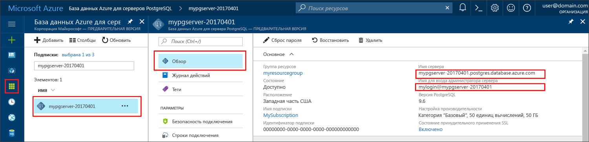

# <a name="azure-database-for-postgresql-use-ruby-tooconnect-and-query-data"></a>База данных Azure для PostgreSQL: используйте Ruby tooconnect и запроса данных
Краткого руководства показано, как tooconnect tooan Azure этой базы данных с помощью PostgreSQL [Ruby](https://www.ruby-lang.org) приложения. Показано, как tooquery инструкций SQL toouse, вставка, обновление и удаление данных в базе данных hello. В этой статье предполагается, что вы знакомы с разработки, используя Ruby, но, чтобы новый tooworking с базой данных Azure для PostgreSQL.

## <a name="prerequisites"></a>Предварительные требования
Это краткое руководство использует ресурсы hello, созданные в любой из этих руководствах по в качестве отправной точки.
- [Создание базы данных с помощью портала](quickstart-create-server-database-portal.md)
- [Создание базы данных с помощью Azure CLI](quickstart-create-server-database-azure-cli.md)

## <a name="install-ruby"></a>Установка Ruby
Установите Ruby на своем компьютере. 

### <a name="windows"></a>Windows
- Загрузка и установка hello последнюю версию [Ruby](http://rubyinstaller.org/downloads/).
- На hello завершить экрана приветствия установщика MSI, установите флажок "hello" с сообщением «выполнения 'ridk установить' tooinstall MSYS2 и инструментов разработки.» Нажмите кнопку **Готово** toolaunch hello Далее установщика.
- запускает установщик RubyInstaller2 для Windows Hello. Введите 2 обновление репозитория hello MSYS2 tooinstall. После завершения и возвращает toohello запрос на установку, закройте командное окно приветствия.
- Из меню "Пуск" hello, запустите новую командную строку (cmd).
- Тест hello Ruby установки `ruby -v` установленной версии toosee hello.
- Проверьте установку Gem hello `gem -v` установленной версии toosee hello.
- Построить hello PostgreSQL модуль для Ruby, с помощью Gem, выполнив команду hello `gem install pg`.

### <a name="macos"></a>MacOS
- Установка с помощью Homebrew, выполнив команду hello Ruby `brew install ruby`. Дополнительные параметры установки см. в разделе hello Ruby [документацию по установке](https://www.ruby-lang.org/en/documentation/installation/#homebrew)
- Тест hello Ruby установки `ruby -v` установленной версии toosee hello.
- Проверьте установку Gem hello `gem -v` установленной версии toosee hello.
- Построить hello PostgreSQL модуль для Ruby, с помощью Gem, выполнив команду hello `gem install pg`.

### <a name="linux-ubuntu"></a>Linux (Ubuntu)
- Установите Ruby, выполнив команду hello `sudo apt-get install ruby-full`. Дополнительные параметры установки см. в разделе hello Ruby [документацию по установке](https://www.ruby-lang.org/en/documentation/installation/).
- Тест hello Ruby установки `ruby -v` установленной версии toosee hello.
- Установите последние обновления hello для Gem, выполнив команду hello `sudo gem update --system`.
- Проверьте установку Gem hello `gem -v` установленной версии toosee hello.
- Установите hello gcc, того же типа и других средств построения, выполнив команду hello `sudo apt-get install build-essential`.
- Установите hello PostgreSQL библиотеки, выполнив команду hello `sudo apt-get install libpq-dev`.
- Построить с помощью Gem, выполнив команду hello модуль Ruby pg hello `sudo gem install pg`.

## <a name="run-ruby-code"></a>Выполнение кода Ruby 
- Сохраните код hello в текстовый файл и сохраните файл hello в проект папку с .rb расширение файла, такие как `C:\rubypostgres\read.rb` или`/home/username/rubypostgres/read.rb`
- toorun hello кода, запустите командную строку hello или bash оболочки. Перейдите в каталог в папке проекта `cd rubypostgres`, после чего введите команду hello `ruby read.rb` toorun приложения hello.

## <a name="get-connection-information"></a>Получение сведений о подключении
Получите toohello tooconnect базы данных Azure для hello подключения сведения, необходимые для PostgreSQL. Необходимо hello server полное имя и учетные данные входа.

1. Войдите в toohello [портал Azure](https://portal.azure.com/).
2. Hello левого меню на портале Azure, щелкните **все ресурсы** и выполните поиск сервера hello, вы создали, таких как **mypgserver 20170401**.
3. Щелкните имя сервера hello **mypgserver 20170401**.
4. Выберите hello server **Обзор** страницы. Запишите hello **имя сервера** и **имя входа администратора сервера**.
 
5. Если вы забыли учетные данные входа сервера, перейдите toohello **Обзор** имя пользователя администратора сервера hello tooview страницы. При необходимости hello сброс пароля.

## <a name="connect-and-create-a-table"></a>Подключение и создание таблицы
Используйте следующие hello кода tooconnect и создание таблицы с помощью **CREATE TABLE** инструкции SQL, за которым следует **INSERT INTO** строк tooadd инструкций SQL в таблицу hello.

использует код Hello [PG::Connection](http://www.rubydoc.info/gems/pg/PG/Connection) объекта с помощью конструктора [new()](http://www.rubydoc.info/gems/pg/PG%2FConnection:initialize) tooconnect tooAzure базы данных PostgreSQL. Затем он вызывает метод [exec()](http://www.rubydoc.info/gems/pg/PG/Connection#exec-instance_method) toorun hello: команд DROP, CREATE TABLE и INSERT INTO. Hello код проверяет наличие ошибок с помощью hello [PG::Error](http://www.rubydoc.info/gems/pg/PG/Error) класса. Затем он вызывает метод [close()](http://www.rubydoc.info/gems/pg/PG/Connection#lo_close-instance_method) tooclose hello соединения перед завершением работы.

Замените hello `host`, `database`, `user`, и `password` строки собственными значениями. 
```ruby
require 'pg'

begin
    # Initialize connection variables.
    host = String('mypgserver-20170401.postgres.database.azure.com')
    database = String('postgres')
    user = String('mylogin@mypgserver-20170401')
    password = String('<server_admin_password>')

    # Initialize connection object.
    connection = PG::Connection.new(:host => host, :user => user, :dbname => database, :port => '5432', :password => password)
    puts 'Successfully created connection toodatabase'

    # Drop previous table of same name if one exists
    connection.exec('DROP TABLE IF EXISTS inventory;')
    puts 'Finished dropping table (if existed).'

    # Drop previous table of same name if one exists.
    connection.exec('CREATE TABLE inventory (id serial PRIMARY KEY, name VARCHAR(50), quantity INTEGER);')
    puts 'Finished creating table.'

    # Insert some data into table.
    connection.exec("INSERT INTO inventory VALUES(1, 'banana', 150)")
    connection.exec("INSERT INTO inventory VALUES(2, 'orange', 154)")
    connection.exec("INSERT INTO inventory VALUES(3, 'apple', 100)")
    puts 'Inserted 3 rows of data.'

rescue PG::Error => e
    puts e.message 
    
ensure
    connection.close if connection
end
```

## <a name="read-data"></a>Считывание данных
Используйте следующие hello кода tooconnect и чтения данных с помощью hello **ВЫБЕРИТЕ** инструкции SQL. 

использует код Hello [PG::Connection](http://www.rubydoc.info/gems/pg/PG/Connection) объекта с помощью конструктора [new()](http://www.rubydoc.info/gems/pg/PG%2FConnection:initialize) tooconnect tooAzure базы данных PostgreSQL. Затем он вызывает метод [exec()](http://www.rubydoc.info/gems/pg/PG/Connection#exec-instance_method) toorun hello команды SELECT, сохранения результатов hello в результирующий набор. Hello результирующий набор сбора проходит по hello `resultSet.each do` цикла, руководствуясь hello hello текущие значения строки `row` переменной. Hello код проверяет наличие ошибок с помощью hello [PG::Error](http://www.rubydoc.info/gems/pg/PG/Error) класса. Затем он вызывает метод [close()](http://www.rubydoc.info/gems/pg/PG/Connection#lo_close-instance_method) tooclose hello соединения перед завершением работы.

Замените hello `host`, `database`, `user`, и `password` строки собственными значениями. 

```ruby
require 'pg'

begin
    # Initialize connection variables.
    host = String('mypgserver-20170401.postgres.database.azure.com')
    database = String('postgres')
    user = String('mylogin@mypgserver-20170401')
    password = String('<server_admin_password>')

    # Initialize connection object.
    connection = PG::Connection.new(:host => host, :user => user, :database => dbname, :port => '5432', :password => password)
    puts 'Successfully created connection toodatabase.'

    resultSet = connection.exec('SELECT * from inventory;')
    resultSet.each do |row|
        puts 'Data row = (%s, %s, %s)' % [row['id'], row['name'], row['quantity']]
    end

rescue PG::Error => e
    puts e.message 
    
ensure
    connection.close if connection
end
```

## <a name="update-data"></a>Обновление данных
Используйте следующие hello кода tooconnect и обновления данных с помощью hello **обновление** инструкции SQL.

использует код Hello [PG::Connection](http://www.rubydoc.info/gems/pg/PG/Connection) объекта с помощью конструктора [new()](http://www.rubydoc.info/gems/pg/PG%2FConnection:initialize) tooconnect tooAzure базы данных PostgreSQL. Затем он вызывает метод [exec()](http://www.rubydoc.info/gems/pg/PG/Connection#exec-instance_method) toorun hello команды UPDATE. Hello код проверяет наличие ошибок с помощью hello [PG::Error](http://www.rubydoc.info/gems/pg/PG/Error) класса. Затем он вызывает метод [close()](http://www.rubydoc.info/gems/pg/PG/Connection#lo_close-instance_method) tooclose hello соединения перед завершением работы.

Замените hello `host`, `database`, `user`, и `password` строки собственными значениями. 

```ruby
require 'pg'

begin
    # Initialize connection variables.
    host = String('mypgserver-20170401.postgres.database.azure.com')
    database = String('postgres')
    user = String('mylogin@mypgserver-20170401')
    password = String('<server_admin_password>')

    # Initialize connection object.
    connection = PG::Connection.new(:host => host, :user => user, :dbname => database, :port => '5432', :password => password)
    puts 'Successfully created connection toodatabase.'

    # Modify some data in table.
    connection.exec('UPDATE inventory SET quantity = %d WHERE name = %s;' % [200, '\'banana\''])
    puts 'Updated 1 row of data.'

rescue PG::Error => e
    puts e.message 
    
ensure
    connection.close if connection
end
```


## <a name="delete-data"></a>Удаление данных
Используйте следующие hello кода tooconnect и чтения данных с помощью hello **удалить** инструкции SQL. 

использует код Hello [PG::Connection](http://www.rubydoc.info/gems/pg/PG/Connection) объекта с помощью конструктора [new()](http://www.rubydoc.info/gems/pg/PG%2FConnection:initialize) tooconnect tooAzure базы данных PostgreSQL. Затем он вызывает метод [exec()](http://www.rubydoc.info/gems/pg/PG/Connection#exec-instance_method) toorun hello команды UPDATE. Hello код проверяет наличие ошибок с помощью hello [PG::Error](http://www.rubydoc.info/gems/pg/PG/Error) класса. Затем он вызывает метод [close()](http://www.rubydoc.info/gems/pg/PG/Connection#lo_close-instance_method) tooclose hello соединения перед завершением работы.

Замените hello `host`, `database`, `user`, и `password` строки собственными значениями. 

```ruby
require 'pg'

begin
    # Initialize connection variables.
    host = String('mypgserver-20170401.postgres.database.azure.com')
    database = String('postgres')
    user = String('mylogin@mypgserver-20170401')
    password = String('<server_admin_password>')

    # Initialize connection object.
    connection = PG::Connection.new(:host => host, :user => user, :dbname => database, :port => '5432', :password => password)
    puts 'Successfully created connection toodatabase.'

    # Modify some data in table.
    connection.exec('DELETE FROM inventory WHERE name = %s;' % ['\'orange\''])
    puts 'Deleted 1 row of data.'

rescue PG::Error => e
    puts e.message 
    
ensure
    connection.close if connection
end
```

## <a name="next-steps"></a>Дальнейшие действия
> [!div class="nextstepaction"]
> [Перенос базы данных с помощью экспорта и импорта](./howto-migrate-using-export-and-import.md)
