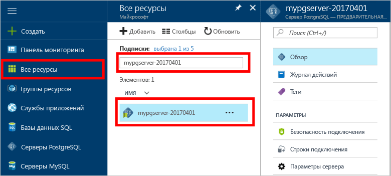

# Как заархивировать и восстановить сервер в базе данных Azure для PostgreSQL с помощью портала AzureHow To Backup and Restore a server in Azure Database for PostgreSQL using the Azure portal

## Архивация выполняется автоматическиBackup happens Automatically
При использовании базы данных Azure для PostgreSQL служба базы данных автоматически создает резервную копию службы каждые 5 минут.When using Azure Database for PostgreSQL, the database service automatically makes a backup of the service every 5 minutes. 

Для уровня "Базовый" доступны резервные копии за 7 дней, а для уровня "Стандартный" — за 35 дней.The backups are available for 7 days when using Basic Tier, and 35 days when using Standard Tier. Дополнительные сведения см. в разделе [Параметры и производительность базы данных Azure для PostgreSQL: возможности разных уровней служб](concepts-service-tiers.md).For more information, see [Azure Database for PostgreSQL service tiers](concepts-service-tiers.md)

С помощью этой функции автоматической архивации можно восстановить сервер и все его базы данных до более ранней точки во времени на новом сервере.Using this automatic backup feature you may restore the server and all its databases into a new server to an earlier point-in-time.

## Восстановление на портале AzureRestore in the Azure portal
База данных Azure для PostgreSQL позволяет восстановить сервер до точки во времени и восстановить сервер в виде новой копии сервера.Azure Database for PostgreSQL allows you to restore the server back to a point in time and into to a new copy of the server. Вы можете восстановить данные с помощью этого нового сервера.You can use this new server to recover your data. 

Например, если таблица была случайно удалена сегодня в полдень, ее можно восстановить до момента сразу перед полуднем и получить отсутствующие таблицы и данные из новой копии сервера.For example, if a table was accidentally dropped at noon today, you could restore to the time just before noon and retrieve the missing table and data from that new copy of the server.

Указанные ниже шаги позволяют восстановить пример сервера до определенной точки во времени.The following steps restore the sample server to a point in time:
1. Войдите на [портал Azure](https://portal.azure.com/).Sign into the [Azure portal](https://portal.azure.com/)
2. Найдите сервер базы данных Azure для PostgreSQL.Locate your Azure Database for PostgreSQL server. На портале Azure щелкните **Все ресурсы** в меню слева и введите имя, например **mypgserver-20170401**, чтобы найти существующий сервер.In the Azure portal, click **All Resources** from the left-hand menu and type in the name, such as **mypgserver-20170401**, to search for your existing server. Щелкните имя сервера в результатах поиска.Click the server name listed in the search result. После этого откроется страница **Обзор** сервера с параметрами для дальнейшей конфигурации.The **Overview** page for your server opens and provides options for further configuration.

   

3. В верхней части колонки "Обзор" сервера нажмите кнопку **Восстановить** на панели инструментов.On the top of the server overview blade, click **Restore** on the toolbar. Откроется колонка "Восстановление".The Restore blade opens.

   

4. Заполните форму "Восстановление", указав следующие сведения.Fill out the Restore form with the required information:

   
  - **Точка восстановления**: выберите время до того момента, когда был изменен сервер.**Restore point**: Select a point-in-time that occurs before the server was changed
  - **Целевой сервер**: укажите новое имя сервера, который нужно восстановить.**Target server**: Provide a new server name you want to restore to
  - **Расположение**: вы не сможете выбрать регион, по умолчанию он совпадает с регионом исходного сервера.**Location**: You cannot select the region, by default it is same as the source server
  - **Ценовая категория**: это значение нельзя изменить при восстановлении сервера.**Pricing tier**: You cannot change this value when restoring a server. Она совпадает с ценовой категорией исходного сервера.It is same as the source server. 

5. Чтобы восстановить сервер до выбранной точки во времени, нажмите кнопку **OК**.Click **OK** to restore the server to restore to a point in time. 

6. После завершения восстановления найдите созданный сервер, чтобы убедиться, что данные были восстановлены, как и ожидалось.Once the restore finishes, locate the new server that is created to verify the data was restored as expected.

## Дальнейшие действияNext steps
- [Библиотеки подключений для базы данных Azure для PostgreSQLConnection libraries for Azure Database for PostgreSQL](concepts-connection-libraries.md)
