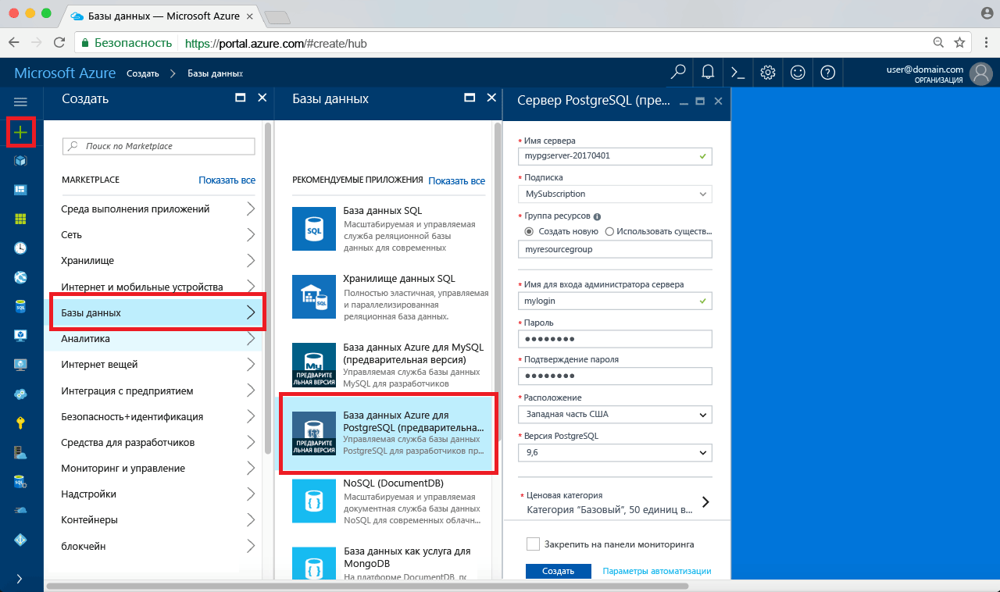
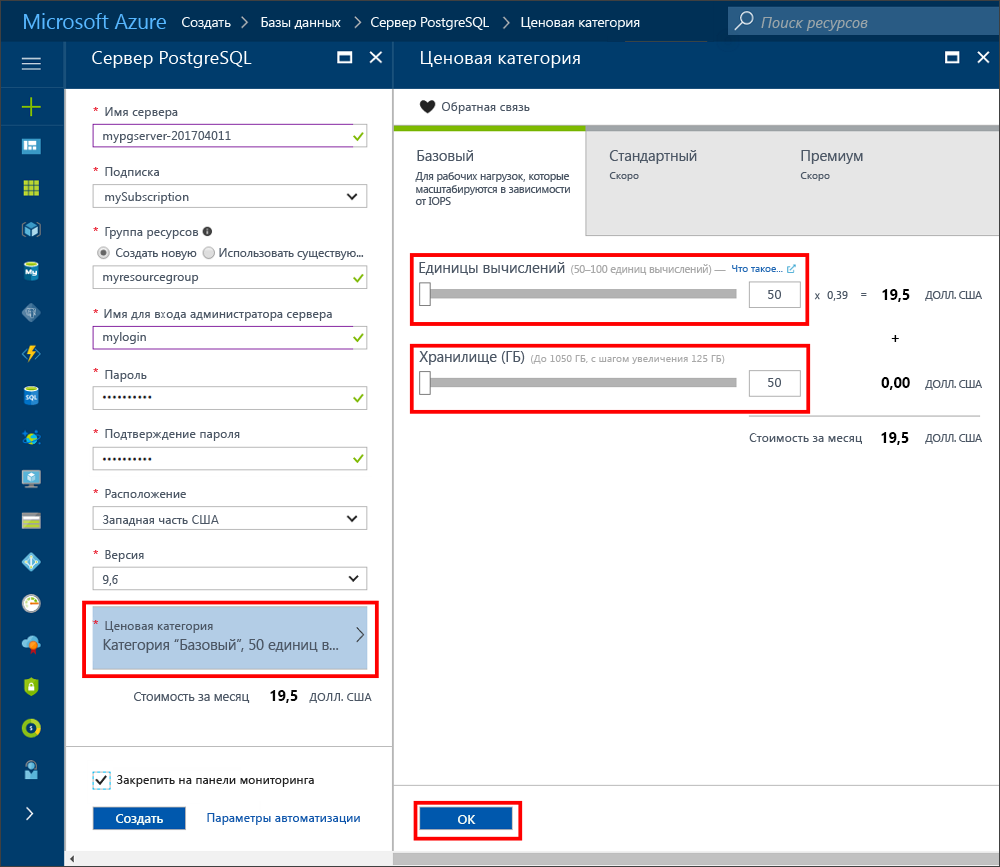
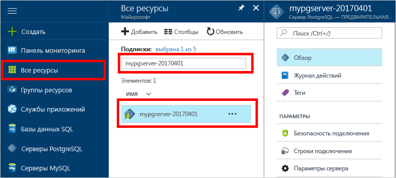
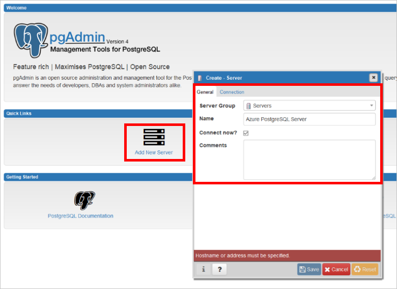
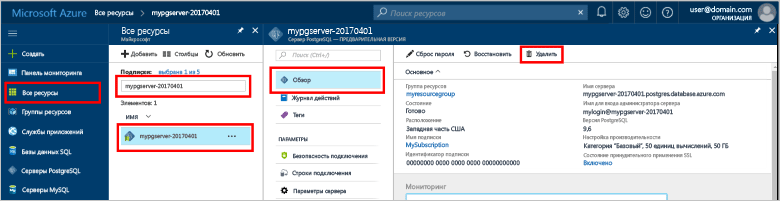

# <a name="create-an-azure-database-for-postgresql-in-hello-azure-portal"></a><span data-ttu-id="05340-103">Создание базы данных Azure для PostgreSQL в hello портал Azure</span><span class="sxs-lookup"><span data-stu-id="05340-103">Create an Azure Database for PostgreSQL in hello Azure portal</span></span>

<span data-ttu-id="05340-104">База данных Azure для PostgreSQL является управляемой службы, которая позволяет toorun, управлять и масштабировать высокодоступных баз данных PostgreSQL в облаке hello.</span><span class="sxs-lookup"><span data-stu-id="05340-104">Azure Database for PostgreSQL is a managed service that enables you toorun, manage, and scale highly available PostgreSQL databases in hello cloud.</span></span> <span data-ttu-id="05340-105">Это краткое руководство показывает, как toocreate Azure базы данных для сервера PostgreSQL, с помощью портала Azure hello примерно через пять минут.</span><span class="sxs-lookup"><span data-stu-id="05340-105">This quickstart shows you how toocreate an Azure Database for PostgreSQL server using hello Azure portal in about five minutes.</span></span>

<span data-ttu-id="05340-106">Если у вас еще нет подписки Azure, создайте [бесплатную](https://azure.microsoft.com/free/) учетную запись Azure, прежде чем начинать работу.</span><span class="sxs-lookup"><span data-stu-id="05340-106">If you don't have an Azure subscription, create a [free](https://azure.microsoft.com/free/) account before you begin.</span></span>

## <a name="log-in-toohello-azure-portal"></a><span data-ttu-id="05340-107">Войдите в toohello портал Azure</span><span class="sxs-lookup"><span data-stu-id="05340-107">Log in toohello Azure portal</span></span>
<span data-ttu-id="05340-108">Откройте браузер и перейдите toohello [портал Microsoft Azure](https://portal.azure.com/).</span><span class="sxs-lookup"><span data-stu-id="05340-108">Open your web browser, and navigate toohello [Microsoft Azure portal](https://portal.azure.com/).</span></span> <span data-ttu-id="05340-109">Введите ваш toosign учетные данные на портале toohello.</span><span class="sxs-lookup"><span data-stu-id="05340-109">Enter your credentials toosign in toohello portal.</span></span> <span data-ttu-id="05340-110">представление по умолчанию Hello, панели мониторинга службы.</span><span class="sxs-lookup"><span data-stu-id="05340-110">hello default view is your service dashboard.</span></span>

## <a name="create-an-azure-database-for-postgresql"></a><span data-ttu-id="05340-111">Создание базы данных Azure для PostgreSQL</span><span class="sxs-lookup"><span data-stu-id="05340-111">Create an Azure Database for PostgreSQL</span></span>

<span data-ttu-id="05340-112">Сервер базы данных Azure для PostgreSQL создается с определенным набором [вычислительных ресурсов и ресурсов хранения](./concepts-compute-unit-and-storage.md).</span><span class="sxs-lookup"><span data-stu-id="05340-112">An Azure Database for PostgreSQL server is created with a defined set of [compute and storage resources](./concepts-compute-unit-and-storage.md).</span></span> <span data-ttu-id="05340-113">сервер Hello создается в пределах [группы ресурсов Azure](../azure-resource-manager/resource-group-overview.md).</span><span class="sxs-lookup"><span data-stu-id="05340-113">hello server is created within an [Azure resource group](../azure-resource-manager/resource-group-overview.md).</span></span>

<span data-ttu-id="05340-114">Выполните эти действия toocreate PostgreSQL сервера базы данных Azure.</span><span class="sxs-lookup"><span data-stu-id="05340-114">Follow these steps toocreate an Azure Database for PostgreSQL server:</span></span>
1.  <span data-ttu-id="05340-115">Нажмите кнопку hello **New** кнопки (+), найденных на верхний левый угол hello hello портал Azure.</span><span class="sxs-lookup"><span data-stu-id="05340-115">Click hello **New** button (+) found on hello upper left-hand corner of hello Azure portal.</span></span>
2.  <span data-ttu-id="05340-116">Выберите **баз данных** из hello **New** и выберите **базы данных Azure для PostgreSQL** из hello **баз данных** страницы.</span><span class="sxs-lookup"><span data-stu-id="05340-116">Select **Databases** from hello **New** page, and select **Azure Database for PostgreSQL** from hello **Databases** page.</span></span>
 <span data-ttu-id="05340-117"></span><span class="sxs-lookup"><span data-stu-id="05340-117"></span></span>

3.  <span data-ttu-id="05340-118">Заполнение hello новый сервер сведения формы с hello следующую информацию, как показано на предшествующий изображения hello:</span><span class="sxs-lookup"><span data-stu-id="05340-118">Fill out hello new server details form with hello following information, as shown on hello preceding image:</span></span>

    <span data-ttu-id="05340-119">Настройка</span><span class="sxs-lookup"><span data-stu-id="05340-119">Setting</span></span>|<span data-ttu-id="05340-120">Рекомендуемое значение</span><span class="sxs-lookup"><span data-stu-id="05340-120">Suggested value</span></span>|<span data-ttu-id="05340-121">Описание</span><span class="sxs-lookup"><span data-stu-id="05340-121">Description</span></span>
    ---|---|---
    <span data-ttu-id="05340-122">имя сервера;</span><span class="sxs-lookup"><span data-stu-id="05340-122">Server name</span></span> |<span data-ttu-id="05340-123">*mypgserver-20170401*</span><span class="sxs-lookup"><span data-stu-id="05340-123">*mypgserver-20170401*</span></span>|<span data-ttu-id="05340-124">Выберите уникальное имя, идентифицирующее базу данных Azure для сервера PostgreSQL.</span><span class="sxs-lookup"><span data-stu-id="05340-124">Choose a unique name that identifies your Azure Database for PostgreSQL server.</span></span> <span data-ttu-id="05340-125">имя домена Hello *postgres.database.azure.com* — имя сервера присоединенных toohello обеспечения tooconnect приложений для.</span><span class="sxs-lookup"><span data-stu-id="05340-125">hello domain name *postgres.database.azure.com* is appended toohello server name you provide for applications tooconnect to.</span></span> <span data-ttu-id="05340-126">Имя сервера Hello может содержать только строчные буквы, цифры и знак дефиса (-) hello и он должен содержать от 3 до 63 символов.</span><span class="sxs-lookup"><span data-stu-id="05340-126">hello server name can contain only lowercase letters, numbers, and hello hyphen (-) character, and it must contain from 3 through 63 characters.</span></span>
    <span data-ttu-id="05340-127">Подписки</span><span class="sxs-lookup"><span data-stu-id="05340-127">Subscription</span></span>|<span data-ttu-id="05340-128">*Ваша подписка*</span><span class="sxs-lookup"><span data-stu-id="05340-128">*Your subscription*</span></span>|<span data-ttu-id="05340-129">Здравствуйте, подписки Azure, что требуется toouse для сервера.</span><span class="sxs-lookup"><span data-stu-id="05340-129">hello Azure subscription that you want toouse for your server.</span></span> <span data-ttu-id="05340-130">Если у вас несколько подписок, выберите нужную подписку hello, в котором ресурсов hello выставлен счет за.</span><span class="sxs-lookup"><span data-stu-id="05340-130">If you have multiple subscriptions, choose hello appropriate subscription in which hello resource is billed for.</span></span>
    <span data-ttu-id="05340-131">Группа ресурсов</span><span class="sxs-lookup"><span data-stu-id="05340-131">Resource Group</span></span>|<span data-ttu-id="05340-132">*myresourcegroup*</span><span class="sxs-lookup"><span data-stu-id="05340-132">*myresourcegroup*</span></span>| <span data-ttu-id="05340-133">Можно создать новую группу ресурсов или использовать существующую группу из подписки.</span><span class="sxs-lookup"><span data-stu-id="05340-133">You may make a new resource group name, or use an existing one from your subscription.</span></span>
    <span data-ttu-id="05340-134">учетные данные администратора сервера для входа;</span><span class="sxs-lookup"><span data-stu-id="05340-134">Server admin login</span></span> |<span data-ttu-id="05340-135">*mylogin*</span><span class="sxs-lookup"><span data-stu-id="05340-135">*mylogin*</span></span>| <span data-ttu-id="05340-136">Сделать собственные toouse учетной записи входа при подключении toohello серверу.</span><span class="sxs-lookup"><span data-stu-id="05340-136">Make your own login account toouse when connecting toohello server.</span></span> <span data-ttu-id="05340-137">Имя входа администратора Hello не может быть «azure_superuser», «azure_pg_admin», «admin», «администратор», «root», «guest» или «public» и не может начинаться с «pg_».</span><span class="sxs-lookup"><span data-stu-id="05340-137">hello admin login name cannot be 'azure_superuser', 'azure_pg_admin', 'admin', 'administrator', 'root', 'guest', or 'public', and cannot start with 'pg_'.</span></span>
    <span data-ttu-id="05340-138">Пароль</span><span class="sxs-lookup"><span data-stu-id="05340-138">Password</span></span> |<span data-ttu-id="05340-139">*По своему выбору*</span><span class="sxs-lookup"><span data-stu-id="05340-139">*Your choice*</span></span> | <span data-ttu-id="05340-140">Создайте новый пароль для учетной записи администратора сервера hello.</span><span class="sxs-lookup"><span data-stu-id="05340-140">Create a new password for hello server admin account.</span></span> <span data-ttu-id="05340-141">Должно содержать от 8 too128 символов.</span><span class="sxs-lookup"><span data-stu-id="05340-141">Must contain from 8 too128 characters.</span></span> <span data-ttu-id="05340-142">Пароль должен содержать символы трех из следующих категорий hello: прописные латинские буквы, строчные латинские буквы, цифры (0-9) и неалфавитные символы (!, $, #, %, и т. д.).</span><span class="sxs-lookup"><span data-stu-id="05340-142">Your password must contain characters from three of hello following categories – English uppercase letters, English lowercase letters, numbers (0-9), and non-alphanumeric characters (!, $, #, %, etc.).</span></span>
    <span data-ttu-id="05340-143">Расположение</span><span class="sxs-lookup"><span data-stu-id="05340-143">Location</span></span>|<span data-ttu-id="05340-144">*Пользователи tooyour ближайший регион Hello*</span><span class="sxs-lookup"><span data-stu-id="05340-144">*hello region closest tooyour users*</span></span>| <span data-ttu-id="05340-145">Выберите расположение hello ближайший tooyour пользователей.</span><span class="sxs-lookup"><span data-stu-id="05340-145">Choose hello location that's closest tooyour users.</span></span>
    <span data-ttu-id="05340-146">Версия PostgreSQL.</span><span class="sxs-lookup"><span data-stu-id="05340-146">PostgreSQL Version</span></span>|<span data-ttu-id="05340-147">*Выберите последнюю версию hello*</span><span class="sxs-lookup"><span data-stu-id="05340-147">*Choose hello latest version*</span></span>| <span data-ttu-id="05340-148">Последнюю версию hello следует выбирайте, если у вас есть особые требования.</span><span class="sxs-lookup"><span data-stu-id="05340-148">Choose hello latest version unless you have specific requirements.</span></span>
    <span data-ttu-id="05340-149">Ценовая категория</span><span class="sxs-lookup"><span data-stu-id="05340-149">Pricing Tier</span></span> | <span data-ttu-id="05340-150">**Базовый**, **50 единиц вычислений**,  **50 ГБ**</span><span class="sxs-lookup"><span data-stu-id="05340-150">**Basic**, **50 Compute Units** **50 GB**</span></span> | <span data-ttu-id="05340-151">Нажмите кнопку **Ценовая категория** toospecify hello службы уровня и уровня производительности для новой базы данных.</span><span class="sxs-lookup"><span data-stu-id="05340-151">Click **Pricing tier** toospecify hello service tier and performance level for your new database.</span></span> <span data-ttu-id="05340-152">Выберите базовый уровень во вкладке "hello" вверху hello.</span><span class="sxs-lookup"><span data-stu-id="05340-152">Choose Basic tier in hello tab at hello top.</span></span> <span data-ttu-id="05340-153">Щелкните левый конец hello hello вычислений единицы ползунок tooadjust hello значение toohello минимально необходимыми для краткого руководства.</span><span class="sxs-lookup"><span data-stu-id="05340-153">Click hello left end of hello Compute Units slider tooadjust hello value toohello least amount available for this quickstart.</span></span> <span data-ttu-id="05340-154">Нажмите кнопку **ОК** toosave hello цены Выбор уровня.</span><span class="sxs-lookup"><span data-stu-id="05340-154">Click **Ok** toosave hello pricing tier selection.</span></span> <span data-ttu-id="05340-155">См. следующий снимок экрана приветствия.</span><span class="sxs-lookup"><span data-stu-id="05340-155">See hello following screenshot.</span></span>
    | <span data-ttu-id="05340-156">Toodashboard ПИН-кода</span><span class="sxs-lookup"><span data-stu-id="05340-156">Pin toodashboard</span></span> | <span data-ttu-id="05340-157">Проверка</span><span class="sxs-lookup"><span data-stu-id="05340-157">Check</span></span> | <span data-ttu-id="05340-158">Проверьте hello **toodashboard ПИН-код** параметр tooallow легко отслеживания сервера на странице приветствия передней панели мониторинга портала Azure.</span><span class="sxs-lookup"><span data-stu-id="05340-158">Check hello **Pin toodashboard** option tooallow easy tracking of your server on hello front dashboard page of your Azure portal.</span></span>

  > [!IMPORTANT]
  > <span data-ttu-id="05340-159">Имя входа администратора сервера Hello и пароль, указанные здесь являются необходимые toolog в toohello сервера и баз данных далее в этом кратком руководстве.</span><span class="sxs-lookup"><span data-stu-id="05340-159">hello server admin login and password that you specify here are required toolog in toohello server and its databases later in this quick start.</span></span> <span data-ttu-id="05340-160">Запомните или запишите эту информацию для последующего использования.</span><span class="sxs-lookup"><span data-stu-id="05340-160">Remember or record this information for later use.</span></span>

    

4.  <span data-ttu-id="05340-162">Нажмите кнопку **создать** tooprovision hello server.</span><span class="sxs-lookup"><span data-stu-id="05340-162">Click **Create** tooprovision hello server.</span></span> <span data-ttu-id="05340-163">Подготовка занимает несколько минут, копирование too20 минут максимальное.</span><span class="sxs-lookup"><span data-stu-id="05340-163">Provisioning takes a few minutes, up too20 minutes maximum.</span></span>

5.  <span data-ttu-id="05340-164">На панели инструментов hello, нажмите кнопку **уведомления** процесс развертывания toomonitor hello.</span><span class="sxs-lookup"><span data-stu-id="05340-164">On hello toolbar, click **Notifications** toomonitor hello deployment process.</span></span>
 <span data-ttu-id="05340-165"></span><span class="sxs-lookup"><span data-stu-id="05340-165"></span></span>
   
  <span data-ttu-id="05340-166">По умолчанию на сервере создается база данных **postgres**.</span><span class="sxs-lookup"><span data-stu-id="05340-166">By default, **postgres** database gets created under your server.</span></span> <span data-ttu-id="05340-167">Hello [postgres](https://www.postgresql.org/docs/9.6/static/app-initdb.html) база данных является базой данных по умолчанию, предназначены для использования пользователями, служебные программы и сторонние приложения.</span><span class="sxs-lookup"><span data-stu-id="05340-167">hello [postgres](https://www.postgresql.org/docs/9.6/static/app-initdb.html) database is a default database meant for use by users, utilities, and third-party applications.</span></span> 

## <a name="configure-a-server-level-firewall-rule"></a><span data-ttu-id="05340-168">Настройка правила брандмауэра на уровне сервера</span><span class="sxs-lookup"><span data-stu-id="05340-168">Configure a server-level firewall rule</span></span>

<span data-ttu-id="05340-169">Hello базы данных Azure для службы PostgreSQL создает брандмауэра на уровне сервера hello.</span><span class="sxs-lookup"><span data-stu-id="05340-169">hello Azure Database for PostgreSQL service creates a firewall at hello server-level.</span></span> <span data-ttu-id="05340-170">Этот брандмауэр блокирует внешних приложений и средств подключения toohello сервер и все базы данных на сервере hello правила брандмауэра не введен tooopen hello брандмауэра для конкретных IP-адресов.</span><span class="sxs-lookup"><span data-stu-id="05340-170">This firewall prevents external applications and tools from connecting toohello server and any databases on hello server, unless a firewall rule is created tooopen hello firewall for specific IP addresses.</span></span> 

1.  <span data-ttu-id="05340-171">Найдите нужный сервер после завершения развертывания hello.</span><span class="sxs-lookup"><span data-stu-id="05340-171">Locate your server after hello deployment completes.</span></span> <span data-ttu-id="05340-172">При необходимости можно выполнить поиск.</span><span class="sxs-lookup"><span data-stu-id="05340-172">If needed, you can search for it.</span></span> <span data-ttu-id="05340-173">Например, щелкните **все ресурсы** hello левого меню и введите в поле имя сервера hello (как показано в примере hello *mypgserver 20170401*) toosearch для вновь созданного сервера.</span><span class="sxs-lookup"><span data-stu-id="05340-173">For example, click **All Resources** from hello left-hand menu and type in hello server name (such as hello example *mypgserver-20170401*) toosearch for your newly created server.</span></span> <span data-ttu-id="05340-174">Щелкните имя сервера, перечисленные в результатах поиска hello.</span><span class="sxs-lookup"><span data-stu-id="05340-174">Click on your server name listed in hello search result.</span></span> <span data-ttu-id="05340-175">Hello **Обзор** страница сервера открывает и предоставляет параметры для дальнейшей настройки.</span><span class="sxs-lookup"><span data-stu-id="05340-175">hello **Overview** page for your server opens and provides options for further configuration.</span></span>
 
    

2.  <span data-ttu-id="05340-177">На странице приветствия сервера выберите **безопасности подключения**.</span><span class="sxs-lookup"><span data-stu-id="05340-177">On hello server page, select **Connection security**.</span></span> 
    <span data-ttu-id="05340-178"></span><span class="sxs-lookup"><span data-stu-id="05340-178"></span></span>

3.  <span data-ttu-id="05340-179">В разделе hello **правила брандмауэра** щелкните пустое текстовое поле hello hello **имя правила** toobegin столбца при создании правила брандмауэра hello.</span><span class="sxs-lookup"><span data-stu-id="05340-179">Under hello **Firewall rules** heading, click in hello blank text box in hello **Rule Name** column toobegin creating hello firewall rule.</span></span> 

    <span data-ttu-id="05340-180">Для в этом кратком руководстве давайте разрешить все IP-адреса на сервер hello, заполнив hello текстовое поле в каждом столбце с hello следующие значения:</span><span class="sxs-lookup"><span data-stu-id="05340-180">For this quick start, let's allow all IP addresses into hello server by filling in hello text box in each column with hello following values:</span></span>

    <span data-ttu-id="05340-181">Имя правила</span><span class="sxs-lookup"><span data-stu-id="05340-181">Rule Name</span></span> | <span data-ttu-id="05340-182">Начальный IP-адрес</span><span class="sxs-lookup"><span data-stu-id="05340-182">Start IP</span></span> | <span data-ttu-id="05340-183">Конечный IP-адрес</span><span class="sxs-lookup"><span data-stu-id="05340-183">End IP</span></span> 
    ---|---|---
    <span data-ttu-id="05340-184">AllowAllIps</span><span class="sxs-lookup"><span data-stu-id="05340-184">AllowAllIps</span></span> |  <span data-ttu-id="05340-185">0.0.0.0</span><span class="sxs-lookup"><span data-stu-id="05340-185">0.0.0.0</span></span> | <span data-ttu-id="05340-186">255.255.255.255</span><span class="sxs-lookup"><span data-stu-id="05340-186">255.255.255.255</span></span>

4. <span data-ttu-id="05340-187">Щелкните hello верхней панели инструментов страницы безопасности подключения hello, **Сохранить**.</span><span class="sxs-lookup"><span data-stu-id="05340-187">On hello upper toolbar of hello Connection security page, click **Save**.</span></span> <span data-ttu-id="05340-188">Подождите несколько секунд и обратите внимание hello уведомление о, обновление безопасности соединения завершилась успешно перед продолжением.</span><span class="sxs-lookup"><span data-stu-id="05340-188">Wait for a few moments and notice hello notification showing that updating connection security has finished successfully before continuing.</span></span>

    > [!NOTE]
    > <span data-ttu-id="05340-189">Tooyour подключения базы данных Azure для сервера PostgreSQL связь через порт 5432.</span><span class="sxs-lookup"><span data-stu-id="05340-189">Connections tooyour Azure Database for PostgreSQL server communicate over port 5432.</span></span> <span data-ttu-id="05340-190">Если вы пытаетесь tooconnect из корпоративной сети, исходящий трафик через порт 5432 может оказаться невозможным брандмауэром вашей сети.</span><span class="sxs-lookup"><span data-stu-id="05340-190">If you are trying tooconnect from within a corporate network, outbound traffic over port 5432 may not be allowed by your network's firewall.</span></span> <span data-ttu-id="05340-191">В этом случае нельзя будет tooconnect tooyour сервера Если ИТ-отдел открывает порт 5432.</span><span class="sxs-lookup"><span data-stu-id="05340-191">If so, you will not be able tooconnect tooyour server unless your IT department opens port 5432.</span></span>
    >

## <a name="get-hello-connection-information"></a><span data-ttu-id="05340-192">Получить сведения о соединении hello</span><span class="sxs-lookup"><span data-stu-id="05340-192">Get hello connection information</span></span>

<span data-ttu-id="05340-193">При создании базы данных Azure для сервера PostgreSQL создается база данных по умолчанию **postgres**.</span><span class="sxs-lookup"><span data-stu-id="05340-193">When we created our Azure Database for PostgreSQL server, a default database named **postgres** gets created.</span></span> <span data-ttu-id="05340-194">сервер базы данных tooyour tooconnect, необходимо tooremember hello полного сервера имя и администратора учетные данные для входа.</span><span class="sxs-lookup"><span data-stu-id="05340-194">tooconnect tooyour database server, you need tooremember hello full server name and admin login credentials.</span></span> <span data-ttu-id="05340-195">Отметить эти значения в начале статьи краткого hello.</span><span class="sxs-lookup"><span data-stu-id="05340-195">You may have noted those values earlier in hello quick start article.</span></span> <span data-ttu-id="05340-196">В случае, если не произошло, можно легко находить hello вход с именем и сведения о сервере со страницы Общие сведения о server hello в hello портал Azure.</span><span class="sxs-lookup"><span data-stu-id="05340-196">In case you did not, you can easily find hello server name and login information from hello server Overview page in hello Azure portal.</span></span>

1. <span data-ttu-id="05340-197">Откройте страницу сервера **Обзор**.</span><span class="sxs-lookup"><span data-stu-id="05340-197">Open your server's **Overview** page.</span></span> <span data-ttu-id="05340-198">Запишите hello **имя сервера** и **имя входа администратора сервера**.</span><span class="sxs-lookup"><span data-stu-id="05340-198">Make a note of hello **Server name** and **Server admin login name**.</span></span>
    <span data-ttu-id="05340-199">Наведите указатель на каждое поле и появляется значок копирования hello toohello справа от текста hello.</span><span class="sxs-lookup"><span data-stu-id="05340-199">Hover your cursor over each field, and hello copy icon appears toohello right of hello text.</span></span> <span data-ttu-id="05340-200">Щелкните значок копирования hello как необходимые toocopy hello значения.</span><span class="sxs-lookup"><span data-stu-id="05340-200">Click hello copy icon as needed toocopy hello values.</span></span>

 

## <a name="connect-toopostgresql-database-using-psql-in-cloud-shell"></a><span data-ttu-id="05340-202">Подключение tooPostgreSQL базы данных с помощью psql в оболочке облака</span><span class="sxs-lookup"><span data-stu-id="05340-202">Connect tooPostgreSQL database using psql in Cloud Shell</span></span>

<span data-ttu-id="05340-203">Существует несколько приложений можно использовать tooconnect tooyour базы данных Azure для сервера PostgreSQL.</span><span class="sxs-lookup"><span data-stu-id="05340-203">There are a number of applications you can use tooconnect tooyour Azure Database for PostgreSQL server.</span></span> <span data-ttu-id="05340-204">Давайте сначала с помощью программы командной строки tooillustrate hello psql как tooconnect toohello сервера.</span><span class="sxs-lookup"><span data-stu-id="05340-204">Let's first use hello psql command-line utility tooillustrate how tooconnect toohello server.</span></span>  <span data-ttu-id="05340-205">Можно использовать веб-браузер и hello оболочки облако Azure, как описано здесь без hello должны tooinstall никаких дополнительных программ.</span><span class="sxs-lookup"><span data-stu-id="05340-205">You can use a web browser and hello Azure Cloud Shell as described here without hello need tooinstall any additional software.</span></span> <span data-ttu-id="05340-206">Если у вас есть hello psql программы, установленные локально на компьютере, можно подключиться с тем же успехом.</span><span class="sxs-lookup"><span data-stu-id="05340-206">If you have hello psql utility installed locally on your own machine, you can connect from there as well.</span></span>

1. <span data-ttu-id="05340-207">Запустите hello оболочки облако Azure через hello терминалов значок на верхней панели навигации панели hello.</span><span class="sxs-lookup"><span data-stu-id="05340-207">Launch hello Azure Cloud Shell via hello terminal icon on hello top navigation pane.</span></span>

   

2. <span data-ttu-id="05340-209">Hello оболочки облако Azure открывает в браузере, позволяя команд оболочки tootype bash.</span><span class="sxs-lookup"><span data-stu-id="05340-209">hello Azure Cloud Shell opens in your browser, enabling you tootype bash shell commands.</span></span>

   

3. <span data-ttu-id="05340-211">В облаке командную строку hello подключения tooa базы данных в базе данных Azure для сервера PostgreSQL, введя hello psql командной строки в строке приветствия зеленый.</span><span class="sxs-lookup"><span data-stu-id="05340-211">At hello Cloud Shell prompt, connect tooa database in your Azure Database for PostgreSQL server by typing hello psql command line at hello green prompt.</span></span>

    <span data-ttu-id="05340-212">Hello следующий формат: tooan tooconnect используется база данных Azure для сервера PostgreSQL с hello [psql](https://www.postgresql.org/docs/9.6/static/app-psql.html) программы:</span><span class="sxs-lookup"><span data-stu-id="05340-212">hello following format is used tooconnect tooan Azure Database for PostgreSQL server with hello [psql](https://www.postgresql.org/docs/9.6/static/app-psql.html) utility:</span></span>
    ```bash
    psql --host=<yourserver> --port=<port> --username=<server admin login> --dbname=<database name>
    ```

    <span data-ttu-id="05340-213">Например следующая команда hello подключается к серверу пример tooan:</span><span class="sxs-lookup"><span data-stu-id="05340-213">For example, hello following command connects tooan example server:</span></span>

    ```bash
    psql --host=mypgserver-20170401.postgres.database.azure.com --port=5432 --username=mylogin@mypgserver-20170401 --dbname=postgres
    ```

    <span data-ttu-id="05340-214">Параметр psql</span><span class="sxs-lookup"><span data-stu-id="05340-214">psql parameter</span></span> |<span data-ttu-id="05340-215">Рекомендуемое значение</span><span class="sxs-lookup"><span data-stu-id="05340-215">Suggested value</span></span>|<span data-ttu-id="05340-216">Описание</span><span class="sxs-lookup"><span data-stu-id="05340-216">Description</span></span>
    ---|---|---
    <span data-ttu-id="05340-217">--host</span><span class="sxs-lookup"><span data-stu-id="05340-217">--host</span></span> | <span data-ttu-id="05340-218">*имя сервера*</span><span class="sxs-lookup"><span data-stu-id="05340-218">*server name*</span></span> | <span data-ttu-id="05340-219">Укажите значение имени сервера hello, который использовался при создании hello базы данных Azure для PostgreSQL ранее.</span><span class="sxs-lookup"><span data-stu-id="05340-219">Specify hello server name value that was used when you created hello Azure Database for PostgreSQL earlier.</span></span> <span data-ttu-id="05340-220">В нашем примере используется такое имя сервера: mypgserver-20170401.postgres.database.azure.com. Используйте hello полное доменное имя (\*. postgres.database.azure.com) как показано в примере hello.</span><span class="sxs-lookup"><span data-stu-id="05340-220">Our example server shown is mypgserver-20170401.postgres.database.azure.com. Use hello fully qualified domain name (\*.postgres.database.azure.com) as shown in hello example.</span></span> <span data-ttu-id="05340-221">Выполните действия hello hello предыдущего раздела tooget hello сведения о соединении, если вы не помните имя вашего сервера.</span><span class="sxs-lookup"><span data-stu-id="05340-221">Follow hello steps in hello previous section tooget hello connection information if you do not remember your server name.</span></span> 
    <span data-ttu-id="05340-222">--port</span><span class="sxs-lookup"><span data-stu-id="05340-222">--port</span></span> | <span data-ttu-id="05340-223">**5432**</span><span class="sxs-lookup"><span data-stu-id="05340-223">**5432**</span></span> | <span data-ttu-id="05340-224">Всегда используйте порт 5432 при подключении tooAzure базы данных PostgreSQL.</span><span class="sxs-lookup"><span data-stu-id="05340-224">Always use port 5432 when connecting tooAzure Database for PostgreSQL.</span></span> 
    <span data-ttu-id="05340-225">--username</span><span class="sxs-lookup"><span data-stu-id="05340-225">--username</span></span> | <span data-ttu-id="05340-226">*имя для входа администратора сервера*</span><span class="sxs-lookup"><span data-stu-id="05340-226">*server admin login name*</span></span> |<span data-ttu-id="05340-227">Введите в hello входа имя входа администратора сервера указаны при создании hello базы данных Azure для PostgreSQL ранее.</span><span class="sxs-lookup"><span data-stu-id="05340-227">Type in hello  server admin login username supplied when you created hello Azure Database for PostgreSQL earlier.</span></span> <span data-ttu-id="05340-228">Выполните действия hello hello предыдущего раздела tooget hello сведения о соединении, если вы не помните hello имя пользователя.</span><span class="sxs-lookup"><span data-stu-id="05340-228">Follow hello steps in hello previous section tooget hello connection information if you do not remember hello username.</span></span>  <span data-ttu-id="05340-229">Формат Hello  *username@servername* .</span><span class="sxs-lookup"><span data-stu-id="05340-229">hello format is *username@servername*.</span></span>
    <span data-ttu-id="05340-230">--dbname</span><span class="sxs-lookup"><span data-stu-id="05340-230">--dbname</span></span> | <span data-ttu-id="05340-231">**postgres**</span><span class="sxs-lookup"><span data-stu-id="05340-231">**postgres**</span></span> | <span data-ttu-id="05340-232">Используйте имя базы данных, сформированное системой по умолчанию hello *postgres* для первого подключения hello.</span><span class="sxs-lookup"><span data-stu-id="05340-232">Use hello default system generated database name *postgres* for hello first connection.</span></span> <span data-ttu-id="05340-233">Позже можно создать собственную базу данных.</span><span class="sxs-lookup"><span data-stu-id="05340-233">Later you create your own database.</span></span>

    <span data-ttu-id="05340-234">После выполнения команды psql hello собственными значениями параметра используется пароль администратора сервера запрашиваемые tootype hello.</span><span class="sxs-lookup"><span data-stu-id="05340-234">After running hello psql command, with your own parameter values, you are prompted tootype hello server admin password.</span></span> <span data-ttu-id="05340-235">Этот пароль будет hello же, указанный при создании сервера hello.</span><span class="sxs-lookup"><span data-stu-id="05340-235">This password is hello same that you provided when you created hello server.</span></span> 

    <span data-ttu-id="05340-236">Параметр psql</span><span class="sxs-lookup"><span data-stu-id="05340-236">psql parameter</span></span> |<span data-ttu-id="05340-237">Рекомендуемое значение</span><span class="sxs-lookup"><span data-stu-id="05340-237">Suggested value</span></span>|<span data-ttu-id="05340-238">Описание</span><span class="sxs-lookup"><span data-stu-id="05340-238">Description</span></span>
    ---|---|---
    <span data-ttu-id="05340-239">пароль</span><span class="sxs-lookup"><span data-stu-id="05340-239">password</span></span> | <span data-ttu-id="05340-240">*ваш пароль администратора*</span><span class="sxs-lookup"><span data-stu-id="05340-240">*your admin password*</span></span> | <span data-ttu-id="05340-241">Обратите внимание, hello введенного пароля, символы, не отображаются на hello bash приглашения.</span><span class="sxs-lookup"><span data-stu-id="05340-241">Note, hello typed password characters are not shown on hello bash prompt.</span></span> <span data-ttu-id="05340-242">Нажмите клавишу ВВОД после набрана все tooauthenticate символов hello и подключения.</span><span class="sxs-lookup"><span data-stu-id="05340-242">Press enter after you have typed all hello characters tooauthenticate and connect.</span></span>

    <span data-ttu-id="05340-243">После подключения hello psql программа выводит запрос postgres ввода команды sql.</span><span class="sxs-lookup"><span data-stu-id="05340-243">Once connected, hello psql utility displays a postgres prompt where you type sql commands.</span></span> <span data-ttu-id="05340-244">В выходных данных hello первоначальное соединение так как psql hello в hello оболочки облако Azure могут быть разные версии, чем hello базы данных Azure для версии сервера PostgreSQL может отображается предупреждение.</span><span class="sxs-lookup"><span data-stu-id="05340-244">In hello initial connection output, a warning may be displayed since hello psql in hello Azure Cloud Shell may be a different  version than hello Azure Database for PostgreSQL server version.</span></span> 
    
    <span data-ttu-id="05340-245">Пример выходных данных psql:</span><span class="sxs-lookup"><span data-stu-id="05340-245">Example psql output:</span></span>
    ```bash
    psql (9.5.7, server 9.6.2)
    WARNING: psql major version 9.5, server major version 9.6.
        Some psql features might not work.
    SSL connection (protocol: TLSv1.2, cipher: ECDHE-RSA-AES256-SHA384, bits: 256, compression: off)
    Type "help" for help.
   
    postgres=> 
    ```

    > [!TIP]
    > <span data-ttu-id="05340-246">Если брандмауэр hello не настроен tooallow hello IP-адрес hello Azure облачной оболочки, hello возникает следующая ошибка:</span><span class="sxs-lookup"><span data-stu-id="05340-246">If hello firewall is not configured tooallow hello IP address of hello Azure Cloud Shell, hello following error occurs:</span></span>
    > 
    > <span data-ttu-id="05340-247">psql: FATAL: нет записи pg_hba.conf для узла 138.91.195.82, пользователь mylogin, база данных postgres, подключение SSL для FATAL: необходимо SSL-подключение.</span><span class="sxs-lookup"><span data-stu-id="05340-247">"psql: FATAL:  no pg_hba.conf entry for host "138.91.195.82", user "mylogin", database "postgres", SSL on FATAL:  SSL connection is required.</span></span> <span data-ttu-id="05340-248">Укажите параметры SSL и повторите попытку.</span><span class="sxs-lookup"><span data-stu-id="05340-248">Please specify SSL options and retry.</span></span>
    > 
    > <span data-ttu-id="05340-249">Ошибка tooresolve hello, убедитесь, что hello server конфигурации совпадений hello шагов в hello *Настройка правила брандмауэра уровня сервера* hello статьи.</span><span class="sxs-lookup"><span data-stu-id="05340-249">tooresolve hello error, make sure hello server configuration matches hello steps in hello *Configure a server-level firewall rule* section of hello article.</span></span>

4.  <span data-ttu-id="05340-250">Создайте пустую базу данных на hello, запрашивать, введя hello следующую команду:</span><span class="sxs-lookup"><span data-stu-id="05340-250">Create a blank database at hello prompt by typing hello following command:</span></span>
    ```bash
    CREATE DATABASE mypgsqldb;
    ```
    <span data-ttu-id="05340-251">Команда Hello может занять несколько минут toocomplete.</span><span class="sxs-lookup"><span data-stu-id="05340-251">hello command may take a few moments toocomplete.</span></span> 

5.  <span data-ttu-id="05340-252">Выполните следующие tooswitch для команды подключение к базе данных только что созданный toohello hello строке hello **mypgsqldb**.</span><span class="sxs-lookup"><span data-stu-id="05340-252">At hello prompt, execute hello following command tooswitch connection toohello newly created database **mypgsqldb**.</span></span>
    ```bash
    \c mypgsqldb
    ```

6.  <span data-ttu-id="05340-253">Введите \q и нажмите клавишу ВВОД tooquit psql.</span><span class="sxs-lookup"><span data-stu-id="05340-253">Type \q and then press ENTER tooquit psql.</span></span> <span data-ttu-id="05340-254">После завершения hello оболочки облака Azure можно закрыть.</span><span class="sxs-lookup"><span data-stu-id="05340-254">You can close hello Azure Cloud Shell after you are done.</span></span>

<span data-ttu-id="05340-255">Теперь вы подключились toohello базы данных Azure для PostgreSQL и создана пустая пользовательской базы данных.</span><span class="sxs-lookup"><span data-stu-id="05340-255">Now you have connected toohello Azure Database for PostgreSQL and created a blank user database.</span></span> <span data-ttu-id="05340-256">По-прежнему toohello tooconnect следующего раздела с помощью другого общее средство pgAdmin.</span><span class="sxs-lookup"><span data-stu-id="05340-256">Continue toohello next section tooconnect using another common tool, pgAdmin.</span></span>

## <a name="connect-toopostgresql-database-using-pgadmin"></a><span data-ttu-id="05340-257">Подключитесь с помощью pgAdmin базу данных tooPostgreSQL</span><span class="sxs-lookup"><span data-stu-id="05340-257">Connect tooPostgreSQL database using pgAdmin</span></span>

<span data-ttu-id="05340-258">с помощью средства hello графического интерфейса пользователя PostgreSQL сервера с tooAzure tooconnect _pgAdmin_</span><span class="sxs-lookup"><span data-stu-id="05340-258">tooconnect tooAzure PostgreSQL server using hello GUI tool _pgAdmin_</span></span>
1.  <span data-ttu-id="05340-259">Запустите hello _pgAdmin_ приложения на клиентском компьютере.</span><span class="sxs-lookup"><span data-stu-id="05340-259">Launch hello _pgAdmin_ application on your client computer.</span></span> <span data-ttu-id="05340-260">Вы можете установить _pgAdmin_ с помощью http://www.pgadmin.org/.</span><span class="sxs-lookup"><span data-stu-id="05340-260">You can install _pgAdmin_ from http://www.pgadmin.org/.</span></span>
2.  <span data-ttu-id="05340-261">Нажмите кнопку hello **добавить новый сервер** значка hello **быстрые ссылки** раздел в центре hello hello страницы панели мониторинга.</span><span class="sxs-lookup"><span data-stu-id="05340-261">Click hello **Add New Server** icon from hello **Quick Links** section in hello center of hello Dashboard page.</span></span>
3.  <span data-ttu-id="05340-262">В hello **создание - сервера** диалоговое окно **Общие** введите уникальное понятное имя для сервера hello, таких как **PostgreSQL сервера Azure**.</span><span class="sxs-lookup"><span data-stu-id="05340-262">In hello **Create - Server** dialog box **General** tab, enter a unique friendly Name for hello server, such as **Azure PostgreSQL Server**.</span></span>
<span data-ttu-id="05340-263"></span><span class="sxs-lookup"><span data-stu-id="05340-263"></span></span>
4.  <span data-ttu-id="05340-264">В hello **создание - сервера** диалоговом **подключения** , использовать параметры hello определяемое и щелкните **Сохранить**.</span><span class="sxs-lookup"><span data-stu-id="05340-264">In hello **Create - Server** dialog box, **Connection** tab, use hello settings as specified and click **Save**.</span></span>
   <span data-ttu-id="05340-265"></span><span class="sxs-lookup"><span data-stu-id="05340-265"></span></span>

    <span data-ttu-id="05340-266">параметр pgAdmin</span><span class="sxs-lookup"><span data-stu-id="05340-266">pgAdmin parameter</span></span> |<span data-ttu-id="05340-267">Рекомендуемое значение</span><span class="sxs-lookup"><span data-stu-id="05340-267">Suggested value</span></span>|<span data-ttu-id="05340-268">Описание</span><span class="sxs-lookup"><span data-stu-id="05340-268">Description</span></span>
    ---|---|---
    <span data-ttu-id="05340-269">Имя узла и адрес</span><span class="sxs-lookup"><span data-stu-id="05340-269">Host Name/Address</span></span> | <span data-ttu-id="05340-270">*имя сервера*</span><span class="sxs-lookup"><span data-stu-id="05340-270">*server name*</span></span> | <span data-ttu-id="05340-271">Укажите значение имени сервера hello, который использовался при создании hello базы данных Azure для PostgreSQL ранее.</span><span class="sxs-lookup"><span data-stu-id="05340-271">Specify hello server name value that was used when you created hello Azure Database for PostgreSQL earlier.</span></span> <span data-ttu-id="05340-272">В нашем примере используется такое имя сервера: mypgserver-20170401.postgres.database.azure.com. Используйте hello полное доменное имя (\*. postgres.database.azure.com) как показано в примере hello.</span><span class="sxs-lookup"><span data-stu-id="05340-272">Our example server shown is mypgserver-20170401.postgres.database.azure.com. Use hello fully qualified domain name (\*.postgres.database.azure.com) as shown in hello example.</span></span> <span data-ttu-id="05340-273">Выполните действия hello hello предыдущего раздела tooget hello сведения о соединении, если вы не помните имя вашего сервера.</span><span class="sxs-lookup"><span data-stu-id="05340-273">Follow hello steps in hello previous section tooget hello connection information if you do not remember your server name.</span></span> 
    <span data-ttu-id="05340-274">Порт</span><span class="sxs-lookup"><span data-stu-id="05340-274">Port</span></span> | <span data-ttu-id="05340-275">**5432**</span><span class="sxs-lookup"><span data-stu-id="05340-275">**5432**</span></span> | <span data-ttu-id="05340-276">Всегда используйте порт 5432 при подключении tooAzure базы данных PostgreSQL.</span><span class="sxs-lookup"><span data-stu-id="05340-276">Always use port 5432 when connecting tooAzure Database for PostgreSQL.</span></span>  
    <span data-ttu-id="05340-277">База данных обслуживания</span><span class="sxs-lookup"><span data-stu-id="05340-277">Maintenance Database</span></span> | <span data-ttu-id="05340-278">**postgres**</span><span class="sxs-lookup"><span data-stu-id="05340-278">**postgres**</span></span> | <span data-ttu-id="05340-279">Используйте имя базы данных, сформированное системой по умолчанию hello *postgres*.</span><span class="sxs-lookup"><span data-stu-id="05340-279">Use hello default system generated database name *postgres*.</span></span>
    <span data-ttu-id="05340-280">Имя пользователя</span><span class="sxs-lookup"><span data-stu-id="05340-280">User Name</span></span> | <span data-ttu-id="05340-281">*имя для входа администратора сервера*</span><span class="sxs-lookup"><span data-stu-id="05340-281">*server admin login name*</span></span> | <span data-ttu-id="05340-282">Введите в hello входа имя входа администратора сервера указаны при создании hello базы данных Azure для PostgreSQL ранее.</span><span class="sxs-lookup"><span data-stu-id="05340-282">Type in hello server admin login username supplied when you created hello Azure Database for PostgreSQL earlier.</span></span> <span data-ttu-id="05340-283">Выполните действия hello hello предыдущего раздела tooget hello сведения о соединении, если вы не помните hello имя пользователя.</span><span class="sxs-lookup"><span data-stu-id="05340-283">Follow hello steps in hello previous section tooget hello connection information if you do not remember hello username.</span></span> <span data-ttu-id="05340-284">Формат Hello  *username@servername* .</span><span class="sxs-lookup"><span data-stu-id="05340-284">hello format is *username@servername*.</span></span>
    <span data-ttu-id="05340-285">Пароль</span><span class="sxs-lookup"><span data-stu-id="05340-285">Password</span></span> | <span data-ttu-id="05340-286">*ваш пароль администратора*</span><span class="sxs-lookup"><span data-stu-id="05340-286">*your admin password*</span></span> |  <span data-ttu-id="05340-287">Hello пароль был выбран при создании сервера hello ранее в этом кратком руководстве.</span><span class="sxs-lookup"><span data-stu-id="05340-287">hello password you chose when you created hello server earlier in this quickstart.</span></span>
    <span data-ttu-id="05340-288">Роль</span><span class="sxs-lookup"><span data-stu-id="05340-288">Role</span></span> | <span data-ttu-id="05340-289">*Не указывайте*</span><span class="sxs-lookup"><span data-stu-id="05340-289">*leave blank*</span></span> | <span data-ttu-id="05340-290">Не должны tooprovide роли имя на этом этапе.</span><span class="sxs-lookup"><span data-stu-id="05340-290">No need tooprovide a role name at this point.</span></span> <span data-ttu-id="05340-291">Hello поле оставить пустым.</span><span class="sxs-lookup"><span data-stu-id="05340-291">Leave hello field blank.</span></span>
    <span data-ttu-id="05340-292">Режим SSL</span><span class="sxs-lookup"><span data-stu-id="05340-292">SSL Mode</span></span> | <span data-ttu-id="05340-293">Обязательный параметр</span><span class="sxs-lookup"><span data-stu-id="05340-293">Require</span></span> | <span data-ttu-id="05340-294">По умолчанию все серверы PostgreSQL Azure создаются с включенным применением SSL.</span><span class="sxs-lookup"><span data-stu-id="05340-294">By default, all Azure PostgreSQL servers are created with SSL enforcing turned ON.</span></span> <span data-ttu-id="05340-295">tooturn OFF применяют SSL, см. Подробности в [применения SSL](./concepts-ssl-connection-security.md).</span><span class="sxs-lookup"><span data-stu-id="05340-295">tooturn OFF SSL enforcing, see details in [Enforcing SSL](./concepts-ssl-connection-security.md).</span></span>
    
5.  <span data-ttu-id="05340-296">Щелкните **Сохранить**.</span><span class="sxs-lookup"><span data-stu-id="05340-296">Click **Save**.</span></span>
6.  <span data-ttu-id="05340-297">В левой области обозревателя hello разверните hello **серверы** узла.</span><span class="sxs-lookup"><span data-stu-id="05340-297">In hello Browser left pane, expand hello **Servers** node.</span></span> <span data-ttu-id="05340-298">Выберите сервер, например **PostgreSQL сервера Azure** и нажмите кнопку tooconnect tooit.</span><span class="sxs-lookup"><span data-stu-id="05340-298">Choose your server, for example **Azure PostgreSQL Server** and click tooconnect tooit.</span></span>
7. <span data-ttu-id="05340-299">Разверните узел сервера hello, а затем разверните **баз данных** под ним.</span><span class="sxs-lookup"><span data-stu-id="05340-299">Expand hello server node, and then expand **Databases** under it.</span></span> <span data-ttu-id="05340-300">Hello список должен содержать существующие *postgres* базы данных и все только что созданного пользователя базы данных, например *mypgsqldb*, созданную в предыдущем разделе hello.</span><span class="sxs-lookup"><span data-stu-id="05340-300">hello list should include your existing *postgres* database, and any newly created user database, such as *mypgsqldb*, that we created in hello previous section.</span></span> <span data-ttu-id="05340-301">Обратите внимание, что можно создать несколько баз данных на сервере с помощью базы данных Azure для PostgreSQL.</span><span class="sxs-lookup"><span data-stu-id="05340-301">Notice that you may create multiple databases per server with Azure Database for PostgreSQL.</span></span>
8. <span data-ttu-id="05340-302">Щелкните правой кнопкой мыши **баз данных**, выберите hello **создать** меню и выберите пункт **базы данных**.</span><span class="sxs-lookup"><span data-stu-id="05340-302">Right-click on **Databases**, choose hello **Create** menu, and click **Database**.</span></span>
9.  <span data-ttu-id="05340-303">Введите имя базы данных по своему усмотрению hello **базы данных** поля, такие как *mypgsqldb* показано в примере hello.</span><span class="sxs-lookup"><span data-stu-id="05340-303">Type a database name of your choice in hello **Database** field, such as *mypgsqldb* shown in hello example.</span></span> 
10. <span data-ttu-id="05340-304">Выберите hello **владельца** для hello базы данных из раскрывающегося списка hello.</span><span class="sxs-lookup"><span data-stu-id="05340-304">Select hello **Owner** for hello database from hello drop-down box.</span></span> <span data-ttu-id="05340-305">Выберите имя администратора сервера для входа, в нашем примере это *mylogin*.</span><span class="sxs-lookup"><span data-stu-id="05340-305">Choose your server admin login name, such as our example *mylogin*.</span></span>
10. <span data-ttu-id="05340-306">Нажмите кнопку **Сохранить** toocreate новую пустую базу данных.</span><span class="sxs-lookup"><span data-stu-id="05340-306">Click **Save** toocreate a new blank database.</span></span>
11. <span data-ttu-id="05340-307">В hello **браузера** области в разделе hello базу данных, созданную в hello из списка баз данных под именем сервера.</span><span class="sxs-lookup"><span data-stu-id="05340-307">In hello **Browser** pane, see hello database you created in hello list of Databases under your server name.</span></span>
 <span data-ttu-id="05340-308"></span><span class="sxs-lookup"><span data-stu-id="05340-308"></span></span>


## <a name="clean-up-resources"></a><span data-ttu-id="05340-309">Очистка ресурсов</span><span class="sxs-lookup"><span data-stu-id="05340-309">Clean up resources</span></span>
<span data-ttu-id="05340-310">Очистка hello ресурсы, созданные в кратком руководстве hello либо путем удаления hello [группы ресурсов Azure](../azure-resource-manager/resource-group-overview.md), которая содержит все ресурсы hello в группе ресурсов hello или путем удаления ресурсов hello одного сервера, если вы хотите tookeep hello другие ресурсы без изменений.</span><span class="sxs-lookup"><span data-stu-id="05340-310">Clean up hello resources you created in hello quickstart either by deleting hello [Azure resource group](../azure-resource-manager/resource-group-overview.md), which includes all hello resources in hello resource group, or by deleting hello one server resource if you want tookeep hello other resources intact.</span></span>

> [!TIP]
> <span data-ttu-id="05340-311">Другие краткие руководства в этой коллекции созданы на основе этого документа.</span><span class="sxs-lookup"><span data-stu-id="05340-311">Other quickstarts in this collection build upon this quick start.</span></span> <span data-ttu-id="05340-312">Если вы планируете toowork с последующей toocontinue краткие руководства, выполните очистку не hello ресурсы, созданные в этом кратком руководстве.</span><span class="sxs-lookup"><span data-stu-id="05340-312">If you plan toocontinue on toowork with subsequent quickstarts, do not clean up hello resources created in this quickstart.</span></span> <span data-ttu-id="05340-313">Если вы не планируете toocontinue, используйте следующие ресурсы toodelete действия, созданные в hello портал Azure краткого руководства hello.</span><span class="sxs-lookup"><span data-stu-id="05340-313">If you do not plan toocontinue, use hello following steps toodelete resources created by this quickstart in hello Azure portal.</span></span>

<span data-ttu-id="05340-314">Группа hello весь ресурс toodelete включая только что созданный hello server:</span><span class="sxs-lookup"><span data-stu-id="05340-314">toodelete hello entire resource group including hello newly created server:</span></span>
1.  <span data-ttu-id="05340-315">Найдите группы ресурсов в hello портал Azure.</span><span class="sxs-lookup"><span data-stu-id="05340-315">Locate your resource group in hello Azure portal.</span></span> <span data-ttu-id="05340-316">Hello слева в меню портала Azure hello, пункт **групп ресурсов** и щелкните имя группы ресурсов, таких как в нашем примере hello **myresourcegroup**.</span><span class="sxs-lookup"><span data-stu-id="05340-316">From hello left-hand menu in hello Azure portal, click **Resource groups** and then click hello name of your resource group, such as our example **myresourcegroup**.</span></span>
2.  <span data-ttu-id="05340-317">На странице группы ресурсов щелкните **Удалить**.</span><span class="sxs-lookup"><span data-stu-id="05340-317">On your resource group page, click **Delete**.</span></span> <span data-ttu-id="05340-318">Затем имя типа hello вашей группы ресурсов, таких как в нашем примере **myresourcegroup**в hello удаления tooconfirm текстовое поле и нажмите кнопку **удалить**.</span><span class="sxs-lookup"><span data-stu-id="05340-318">Then type hello name of your resource group, such as our example **myresourcegroup**, in hello text box tooconfirm deletion, and then click **Delete**.</span></span>

<span data-ttu-id="05340-319">Или вместо этого toodelete hello только что созданный сервер:</span><span class="sxs-lookup"><span data-stu-id="05340-319">Or instead, toodelete hello newly created server:</span></span>
1.  <span data-ttu-id="05340-320">Если у вас открыт, найдите нужный сервер в hello портал Azure.</span><span class="sxs-lookup"><span data-stu-id="05340-320">Locate your server in hello Azure portal, if you do not have it open.</span></span> <span data-ttu-id="05340-321">Hello левого меню на портале Azure, щелкните **все ресурсы**и найдите созданный сервер hello.</span><span class="sxs-lookup"><span data-stu-id="05340-321">From hello left-hand menu in Azure portal, click **All resources**, and then search for hello server you created.</span></span>
2.  <span data-ttu-id="05340-322">На hello **Обзор** щелкните hello **удалить** кнопку на верхней панели hello.</span><span class="sxs-lookup"><span data-stu-id="05340-322">On hello **Overview** page, click hello **Delete** button on hello top pane.</span></span>
<span data-ttu-id="05340-323"></span><span class="sxs-lookup"><span data-stu-id="05340-323"></span></span>
3.  <span data-ttu-id="05340-324">Проверьте имя сервера hello требуется toodelete и Показать hello базы данных, которые затрагиваются.</span><span class="sxs-lookup"><span data-stu-id="05340-324">Confirm hello server name you want toodelete, and show hello databases under it that are affected.</span></span> <span data-ttu-id="05340-325">Введите имя сервера в текстовом поле hello, такие как в нашем примере **mypgserver 20170401**, а затем нажмите кнопку **удалить**.</span><span class="sxs-lookup"><span data-stu-id="05340-325">Type your server name in hello text box, such as our example **mypgserver-20170401**, and then click **Delete**.</span></span>

## <a name="next-steps"></a><span data-ttu-id="05340-326">Дальнейшие действия</span><span class="sxs-lookup"><span data-stu-id="05340-326">Next steps</span></span>
> [!div class="nextstepaction"]
> [<span data-ttu-id="05340-327">Перенос базы данных с помощью экспорта и импорта</span><span class="sxs-lookup"><span data-stu-id="05340-327">Migrate your database using Export and Import</span></span>](./howto-migrate-using-export-and-import.md)
