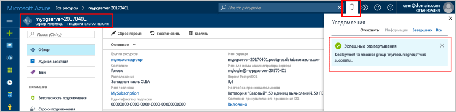
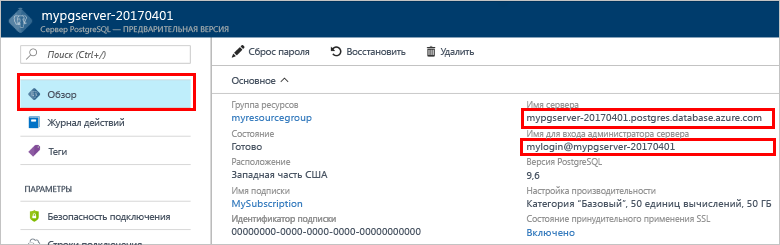

# <a name="create-an-azure-database-for-postgresql-in-hello-azure-portal"></a>Создание базы данных Azure для PostgreSQL в hello портал Azure

База данных Azure для PostgreSQL является управляемой службы, которая позволяет toorun, управлять и масштабировать высокодоступных баз данных PostgreSQL в облаке hello. Это краткое руководство показывает, как toocreate Azure базы данных для сервера PostgreSQL, с помощью портала Azure hello примерно через пять минут.

Если у вас еще нет подписки Azure, создайте [бесплатную](https://azure.microsoft.com/free/) учетную запись Azure, прежде чем начинать работу.

## <a name="log-in-toohello-azure-portal"></a>Войдите в toohello портал Azure
Откройте браузер и перейдите toohello [портал Microsoft Azure](https://portal.azure.com/). Введите ваш toosign учетные данные на портале toohello. представление по умолчанию Hello, панели мониторинга службы.

## <a name="create-an-azure-database-for-postgresql"></a>Создание базы данных Azure для PostgreSQL

Сервер базы данных Azure для PostgreSQL создается с определенным набором [вычислительных ресурсов и ресурсов хранения](./concepts-compute-unit-and-storage.md). сервер Hello создается в пределах [группы ресурсов Azure](../azure-resource-manager/resource-group-overview.md).

Выполните эти действия toocreate PostgreSQL сервера базы данных Azure.
1.  Нажмите кнопку hello **New** кнопки (+), найденных на верхний левый угол hello hello портал Azure.
2.  Выберите **баз данных** из hello **New** и выберите **базы данных Azure для PostgreSQL** из hello **баз данных** страницы.
 

3.  Заполнение hello новый сервер сведения формы с hello следующую информацию, как показано на предшествующий изображения hello:

    Настройка|Рекомендуемое значение|Описание
    ---|---|---
    имя сервера; |*mypgserver-20170401*|Выберите уникальное имя, идентифицирующее базу данных Azure для сервера PostgreSQL. имя домена Hello *postgres.database.azure.com* — имя сервера присоединенных toohello обеспечения tooconnect приложений для. Имя сервера Hello может содержать только строчные буквы, цифры и знак дефиса (-) hello и он должен содержать от 3 до 63 символов.
    Подписки|*Ваша подписка*|Здравствуйте, подписки Azure, что требуется toouse для сервера. Если у вас несколько подписок, выберите нужную подписку hello, в котором ресурсов hello выставлен счет за.
    Группа ресурсов|*myresourcegroup*| Можно создать новую группу ресурсов или использовать существующую группу из подписки.
    учетные данные администратора сервера для входа; |*mylogin*| Сделать собственные toouse учетной записи входа при подключении toohello серверу. Имя входа администратора Hello не может быть «azure_superuser», «azure_pg_admin», «admin», «администратор», «root», «guest» или «public» и не может начинаться с «pg_».
    Пароль |*По своему выбору* | Создайте новый пароль для учетной записи администратора сервера hello. Должно содержать от 8 too128 символов. Пароль должен содержать символы трех из следующих категорий hello: прописные латинские буквы, строчные латинские буквы, цифры (0-9) и неалфавитные символы (!, $, #, %, и т. д.).
    Расположение|*Пользователи tooyour ближайший регион Hello*| Выберите расположение hello ближайший tooyour пользователей.
    Версия PostgreSQL.|*Выберите последнюю версию hello*| Последнюю версию hello следует выбирайте, если у вас есть особые требования.
    Ценовая категория | **Базовый**, **50 единиц вычислений**,  **50 ГБ** | Нажмите кнопку **Ценовая категория** toospecify hello службы уровня и уровня производительности для новой базы данных. Выберите базовый уровень во вкладке "hello" вверху hello. Щелкните левый конец hello hello вычислений единицы ползунок tooadjust hello значение toohello минимально необходимыми для краткого руководства. Нажмите кнопку **ОК** toosave hello цены Выбор уровня. См. следующий снимок экрана приветствия.
    | Toodashboard ПИН-кода | Проверка | Проверьте hello **toodashboard ПИН-код** параметр tooallow легко отслеживания сервера на странице приветствия передней панели мониторинга портала Azure.

  > [!IMPORTANT]
  > Имя входа администратора сервера Hello и пароль, указанные здесь являются необходимые toolog в toohello сервера и баз данных далее в этом кратком руководстве. Запомните или запишите эту информацию для последующего использования.

    

4.  Нажмите кнопку **создать** tooprovision hello server. Подготовка занимает несколько минут, копирование too20 минут максимальное.

5.  На панели инструментов hello, нажмите кнопку **уведомления** процесс развертывания toomonitor hello.
 
   
  По умолчанию на сервере создается база данных **postgres**. Hello [postgres](https://www.postgresql.org/docs/9.6/static/app-initdb.html) база данных является базой данных по умолчанию, предназначены для использования пользователями, служебные программы и сторонние приложения. 

## <a name="configure-a-server-level-firewall-rule"></a>Настройка правила брандмауэра на уровне сервера

Hello базы данных Azure для службы PostgreSQL создает брандмауэра на уровне сервера hello. Этот брандмауэр блокирует внешних приложений и средств подключения toohello сервер и все базы данных на сервере hello правила брандмауэра не введен tooopen hello брандмауэра для конкретных IP-адресов. 

1.  Найдите нужный сервер после завершения развертывания hello. При необходимости можно выполнить поиск. Например, щелкните **все ресурсы** hello левого меню и введите в поле имя сервера hello (как показано в примере hello *mypgserver 20170401*) toosearch для вновь созданного сервера. Щелкните имя сервера, перечисленные в результатах поиска hello. Hello **Обзор** страница сервера открывает и предоставляет параметры для дальнейшей настройки.
 
    

2.  На странице приветствия сервера выберите **безопасности подключения**. 
    

3.  В разделе hello **правила брандмауэра** щелкните пустое текстовое поле hello hello **имя правила** toobegin столбца при создании правила брандмауэра hello. 

    Для в этом кратком руководстве давайте разрешить все IP-адреса на сервер hello, заполнив hello текстовое поле в каждом столбце с hello следующие значения:

    Имя правила | Начальный IP-адрес | Конечный IP-адрес 
    ---|---|---
    AllowAllIps |  0.0.0.0 | 255.255.255.255

4. Щелкните hello верхней панели инструментов страницы безопасности подключения hello, **Сохранить**. Подождите несколько секунд и обратите внимание hello уведомление о, обновление безопасности соединения завершилась успешно перед продолжением.

    > [!NOTE]
    > Tooyour подключения базы данных Azure для сервера PostgreSQL связь через порт 5432. Если вы пытаетесь tooconnect из корпоративной сети, исходящий трафик через порт 5432 может оказаться невозможным брандмауэром вашей сети. В этом случае нельзя будет tooconnect tooyour сервера Если ИТ-отдел открывает порт 5432.
    >

## <a name="get-hello-connection-information"></a>Получить сведения о соединении hello

При создании базы данных Azure для сервера PostgreSQL создается база данных по умолчанию **postgres**. сервер базы данных tooyour tooconnect, необходимо tooremember hello полного сервера имя и администратора учетные данные для входа. Отметить эти значения в начале статьи краткого hello. В случае, если не произошло, можно легко находить hello вход с именем и сведения о сервере со страницы Общие сведения о server hello в hello портал Azure.

1. Откройте страницу сервера **Обзор**. Запишите hello **имя сервера** и **имя входа администратора сервера**.
    Наведите указатель на каждое поле и появляется значок копирования hello toohello справа от текста hello. Щелкните значок копирования hello как необходимые toocopy hello значения.

 

## <a name="connect-toopostgresql-database-using-psql-in-cloud-shell"></a>Подключение tooPostgreSQL базы данных с помощью psql в оболочке облака

Существует несколько приложений можно использовать tooconnect tooyour базы данных Azure для сервера PostgreSQL. Давайте сначала с помощью программы командной строки tooillustrate hello psql как tooconnect toohello сервера.  Можно использовать веб-браузер и hello оболочки облако Azure, как описано здесь без hello должны tooinstall никаких дополнительных программ. Если у вас есть hello psql программы, установленные локально на компьютере, можно подключиться с тем же успехом.

1. Запустите hello оболочки облако Azure через hello терминалов значок на верхней панели навигации панели hello.

   

2. Hello оболочки облако Azure открывает в браузере, позволяя команд оболочки tootype bash.

   

3. В облаке командную строку hello подключения tooa базы данных в базе данных Azure для сервера PostgreSQL, введя hello psql командной строки в строке приветствия зеленый.

    Hello следующий формат: tooan tooconnect используется база данных Azure для сервера PostgreSQL с hello [psql](https://www.postgresql.org/docs/9.6/static/app-psql.html) программы:
    ```bash
    psql --host=<yourserver> --port=<port> --username=<server admin login> --dbname=<database name>
    ```

    Например следующая команда hello подключается к серверу пример tooan:

    ```bash
    psql --host=mypgserver-20170401.postgres.database.azure.com --port=5432 --username=mylogin@mypgserver-20170401 --dbname=postgres
    ```

    Параметр psql |Рекомендуемое значение|Описание
    ---|---|---
    --host | *имя сервера* | Укажите значение имени сервера hello, который использовался при создании hello базы данных Azure для PostgreSQL ранее. В нашем примере используется такое имя сервера: mypgserver-20170401.postgres.database.azure.com. Используйте hello полное доменное имя (\*. postgres.database.azure.com) как показано в примере hello. Выполните действия hello hello предыдущего раздела tooget hello сведения о соединении, если вы не помните имя вашего сервера. 
    --port | **5432** | Всегда используйте порт 5432 при подключении tooAzure базы данных PostgreSQL. 
    --username | *имя для входа администратора сервера* |Введите в hello входа имя входа администратора сервера указаны при создании hello базы данных Azure для PostgreSQL ранее. Выполните действия hello hello предыдущего раздела tooget hello сведения о соединении, если вы не помните hello имя пользователя.  Формат Hello  *username@servername* .
    --dbname | **postgres** | Используйте имя базы данных, сформированное системой по умолчанию hello *postgres* для первого подключения hello. Позже можно создать собственную базу данных.

    После выполнения команды psql hello собственными значениями параметра используется пароль администратора сервера запрашиваемые tootype hello. Этот пароль будет hello же, указанный при создании сервера hello. 

    Параметр psql |Рекомендуемое значение|Описание
    ---|---|---
    пароль | *ваш пароль администратора* | Обратите внимание, hello введенного пароля, символы, не отображаются на hello bash приглашения. Нажмите клавишу ВВОД после набрана все tooauthenticate символов hello и подключения.

    После подключения hello psql программа выводит запрос postgres ввода команды sql. В выходных данных hello первоначальное соединение так как psql hello в hello оболочки облако Azure могут быть разные версии, чем hello базы данных Azure для версии сервера PostgreSQL может отображается предупреждение. 
    
    Пример выходных данных psql:
    ```bash
    psql (9.5.7, server 9.6.2)
    WARNING: psql major version 9.5, server major version 9.6.
        Some psql features might not work.
    SSL connection (protocol: TLSv1.2, cipher: ECDHE-RSA-AES256-SHA384, bits: 256, compression: off)
    Type "help" for help.
   
    postgres=> 
    ```

    > [!TIP]
    > Если брандмауэр hello не настроен tooallow hello IP-адрес hello Azure облачной оболочки, hello возникает следующая ошибка:
    > 
    > psql: FATAL: нет записи pg_hba.conf для узла 138.91.195.82, пользователь mylogin, база данных postgres, подключение SSL для FATAL: необходимо SSL-подключение. Укажите параметры SSL и повторите попытку.
    > 
    > Ошибка tooresolve hello, убедитесь, что hello server конфигурации совпадений hello шагов в hello *Настройка правила брандмауэра уровня сервера* hello статьи.

4.  Создайте пустую базу данных на hello, запрашивать, введя hello следующую команду:
    ```bash
    CREATE DATABASE mypgsqldb;
    ```
    Команда Hello может занять несколько минут toocomplete. 

5.  Выполните следующие tooswitch для команды подключение к базе данных только что созданный toohello hello строке hello **mypgsqldb**.
    ```bash
    \c mypgsqldb
    ```

6.  Введите \q и нажмите клавишу ВВОД tooquit psql. После завершения hello оболочки облака Azure можно закрыть.

Теперь вы подключились toohello базы данных Azure для PostgreSQL и создана пустая пользовательской базы данных. По-прежнему toohello tooconnect следующего раздела с помощью другого общее средство pgAdmin.

## <a name="connect-toopostgresql-database-using-pgadmin"></a>Подключитесь с помощью pgAdmin базу данных tooPostgreSQL

с помощью средства hello графического интерфейса пользователя PostgreSQL сервера с tooAzure tooconnect _pgAdmin_
1.  Запустите hello _pgAdmin_ приложения на клиентском компьютере. Вы можете установить _pgAdmin_ с помощью http://www.pgadmin.org/.
2.  Нажмите кнопку hello **добавить новый сервер** значка hello **быстрые ссылки** раздел в центре hello hello страницы панели мониторинга.
3.  В hello **создание - сервера** диалоговое окно **Общие** введите уникальное понятное имя для сервера hello, таких как **PostgreSQL сервера Azure**.

4.  В hello **создание - сервера** диалоговом **подключения** , использовать параметры hello определяемое и щелкните **Сохранить**.
   

    параметр pgAdmin |Рекомендуемое значение|Описание
    ---|---|---
    Имя узла и адрес | *имя сервера* | Укажите значение имени сервера hello, который использовался при создании hello базы данных Azure для PostgreSQL ранее. В нашем примере используется такое имя сервера: mypgserver-20170401.postgres.database.azure.com. Используйте hello полное доменное имя (\*. postgres.database.azure.com) как показано в примере hello. Выполните действия hello hello предыдущего раздела tooget hello сведения о соединении, если вы не помните имя вашего сервера. 
    Порт | **5432** | Всегда используйте порт 5432 при подключении tooAzure базы данных PostgreSQL.  
    База данных обслуживания | **postgres** | Используйте имя базы данных, сформированное системой по умолчанию hello *postgres*.
    Имя пользователя | *имя для входа администратора сервера* | Введите в hello входа имя входа администратора сервера указаны при создании hello базы данных Azure для PostgreSQL ранее. Выполните действия hello hello предыдущего раздела tooget hello сведения о соединении, если вы не помните hello имя пользователя. Формат Hello  *username@servername* .
    Пароль | *ваш пароль администратора* |  Hello пароль был выбран при создании сервера hello ранее в этом кратком руководстве.
    Роль | *Не указывайте* | Не должны tooprovide роли имя на этом этапе. Hello поле оставить пустым.
    Режим SSL | Обязательный параметр | По умолчанию все серверы PostgreSQL Azure создаются с включенным применением SSL. tooturn OFF применяют SSL, см. Подробности в [применения SSL](./concepts-ssl-connection-security.md).
    
5.  Щелкните **Сохранить**.
6.  В левой области обозревателя hello разверните hello **серверы** узла. Выберите сервер, например **PostgreSQL сервера Azure** и нажмите кнопку tooconnect tooit.
7. Разверните узел сервера hello, а затем разверните **баз данных** под ним. Hello список должен содержать существующие *postgres* базы данных и все только что созданного пользователя базы данных, например *mypgsqldb*, созданную в предыдущем разделе hello. Обратите внимание, что можно создать несколько баз данных на сервере с помощью базы данных Azure для PostgreSQL.
8. Щелкните правой кнопкой мыши **баз данных**, выберите hello **создать** меню и выберите пункт **базы данных**.
9.  Введите имя базы данных по своему усмотрению hello **базы данных** поля, такие как *mypgsqldb* показано в примере hello. 
10. Выберите hello **владельца** для hello базы данных из раскрывающегося списка hello. Выберите имя администратора сервера для входа, в нашем примере это *mylogin*.
10. Нажмите кнопку **Сохранить** toocreate новую пустую базу данных.
11. В hello **браузера** области в разделе hello базу данных, созданную в hello из списка баз данных под именем сервера.
 


## <a name="clean-up-resources"></a>Очистка ресурсов
Очистка hello ресурсы, созданные в кратком руководстве hello либо путем удаления hello [группы ресурсов Azure](../azure-resource-manager/resource-group-overview.md), которая содержит все ресурсы hello в группе ресурсов hello или путем удаления ресурсов hello одного сервера, если вы хотите tookeep hello другие ресурсы без изменений.

> [!TIP]
> Другие краткие руководства в этой коллекции созданы на основе этого документа. Если вы планируете toowork с последующей toocontinue краткие руководства, выполните очистку не hello ресурсы, созданные в этом кратком руководстве. Если вы не планируете toocontinue, используйте следующие ресурсы toodelete действия, созданные в hello портал Azure краткого руководства hello.

Группа hello весь ресурс toodelete включая только что созданный hello server:
1.  Найдите группы ресурсов в hello портал Azure. Hello слева в меню портала Azure hello, пункт **групп ресурсов** и щелкните имя группы ресурсов, таких как в нашем примере hello **myresourcegroup**.
2.  На странице группы ресурсов щелкните **Удалить**. Затем имя типа hello вашей группы ресурсов, таких как в нашем примере **myresourcegroup**в hello удаления tooconfirm текстовое поле и нажмите кнопку **удалить**.

Или вместо этого toodelete hello только что созданный сервер:
1.  Если у вас открыт, найдите нужный сервер в hello портал Azure. Hello левого меню на портале Azure, щелкните **все ресурсы**и найдите созданный сервер hello.
2.  На hello **Обзор** щелкните hello **удалить** кнопку на верхней панели hello.

3.  Проверьте имя сервера hello требуется toodelete и Показать hello базы данных, которые затрагиваются. Введите имя сервера в текстовом поле hello, такие как в нашем примере **mypgserver 20170401**, а затем нажмите кнопку **удалить**.

## <a name="next-steps"></a>Дальнейшие действия
> [!div class="nextstepaction"]
> [Перенос базы данных с помощью экспорта и импорта](./howto-migrate-using-export-and-import.md)
