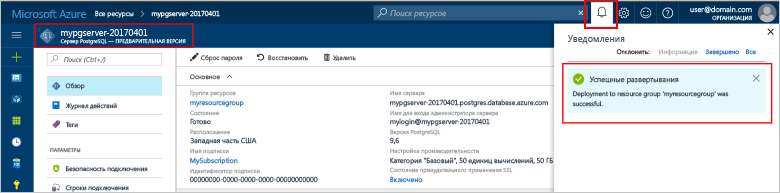
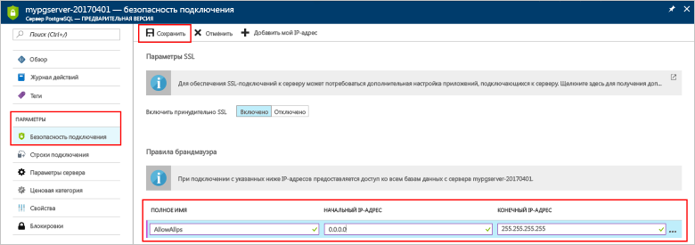
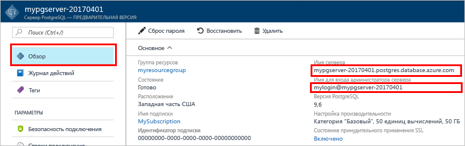
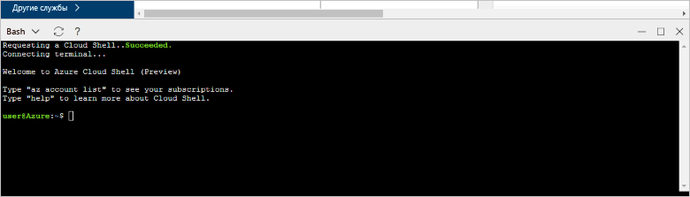

# <a name="design-your-first-azure-database-for-postgresql-using-hello-azure-portal"></a>Проектирование первой базы данных Azure для PostgreSQL, с помощью портала Azure hello

База данных Azure для PostgreSQL является управляемой службы, которая позволяет toorun, управлять и масштабировать высокодоступных баз данных PostgreSQL в облаке hello. С помощью hello портал Azure, можно легко управлять сервером и разработке базы данных.

В этом учебнике используется hello Azure портала toolearn как для:
> [!div class="checklist"]
> * Создание базы данных Azure для PostgreSQL
> * Настройте брандмауэр сервера hello
> * Используйте [ **psql** ](https://www.postgresql.org/docs/9.6/static/app-psql.html) toocreate программа базы данных
> * Загрузка примера данных
> * Запрос данных
> * Обновление данных
> * восстановление данных.

## <a name="prerequisites"></a>Предварительные требования
Если у вас еще нет подписки Azure, создайте [бесплатную](https://azure.microsoft.com/free/) учетную запись Azure, прежде чем начинать работу.

## <a name="log-in-toohello-azure-portal"></a>Войдите в toohello портал Azure
Войдите в toohello [портал Azure](https://portal.azure.com).

## <a name="create-an-azure-database-for-postgresql"></a>Создание базы данных Azure для PostgreSQL

Сервер базы данных Azure для PostgreSQL создается с определенным набором [вычислительных ресурсов и ресурсов хранения](./concepts-compute-unit-and-storage.md). сервер Hello создается в пределах [группы ресурсов Azure](../azure-resource-manager/resource-group-overview.md).

Выполните эти действия toocreate PostgreSQL сервера базы данных Azure.
1.  Нажмите кнопку hello **+ создать** кнопка найдена в верхнем левом углу hello hello портал Azure.
2.  Выберите **баз данных** из hello **New** и выберите **базы данных Azure для PostgreSQL** из hello **баз данных** страницы.
 

3.  Заполнение hello новый сервер сведения формы с hello следующую информацию, как показано на предшествующий изображения hello:
    - Имя сервера: **mypgserver 20170401** (имя учетной записи сопоставляет имя tooDNS и, таким образом, требуется toobe глобально уникальным) 
    - Подписки: Если у вас несколько подписок, выберите нужную подписку hello, в котором hello ресурсов существует, или плата за.
    - Группа ресурсов — **myresourcegroup**.
    - Имя для входа администратора сервера и пароль.
    - Расположение
    - Версия PostgreSQL.

  > [!IMPORTANT]
  > Имя входа администратора сервера Hello и пароль, указанные здесь являются необходимые toolog в toohello сервера и баз данных далее в этом кратком руководстве. Запомните или запишите эту информацию для последующего использования.

4.  Нажмите кнопку **Ценовая категория** toospecify hello службы уровня и уровня производительности для новой базы данных. Для этого руководства выберите уровень **Базовый**, **50 единиц вычислений** и хранилище объемом **50 ГБ**.
 
5.  Нажмите кнопку **ОК**.
6.  Нажмите кнопку **создать** tooprovision hello server. Подготовка занимает несколько минут.

  > [!TIP]
  > Проверьте hello **toodashboard ПИН-код** параметр tooallow легко отслеживания развертываний.

7.  На панели инструментов hello, нажмите кнопку **уведомления** процесс развертывания toomonitor hello.
 
   
  По умолчанию на сервере создается база данных **postgres**. Hello [postgres](https://www.postgresql.org/docs/9.6/static/app-initdb.html) база данных является базой данных по умолчанию, предназначены для использования пользователями, служебные программы и сторонние приложения. 

## <a name="configure-a-server-level-firewall-rule"></a>Настройка правила брандмауэра на уровне сервера

Hello базы данных Azure для службы PostgreSQL создает брандмауэра на уровне сервера hello. Этот брандмауэр невозможным подключение toohello сервер и все базы данных на сервере hello правила брандмауэра не введен tooopen hello брандмауэра для конкретных IP-адресов внешнего приложения и средства. 

1.  После завершения развертывания hello, нажмите кнопку **все ресурсы** из hello левого меню и введите имя hello **mypgserver 20170401** toosearch для вновь созданного сервера. Щелкните имя сервера hello, перечисленные в результатах поиска hello. Hello **Обзор** страница сервера открывает и предоставляет параметры для дальнейшей настройки.
 
 

2.  В колонке сервера hello выберите **безопасности подключения**. 
3.  Щелкните в поле текст hello в разделе **имя правила,** и добавить новый брандмауэр правило toowhitelist hello диапазон IP-подключения. В задачах этого руководства разрешите подключение для всех IP-адресов, указав для параметра **Имя правила** значение AllowAllIps, для параметра **Начальный IP-адрес** значение 0.0.0.0, а для параметра **Конечный IP-адрес** значение 255.255.255.255, после чего щелкните **Сохранить**. Можно задать правило брандмауэра, которое охватывает IP диапазон toobe может tooconnect из сети.
 
 

4.  Нажмите кнопку **Сохранить** и нажмите кнопку hello **X** tooclose hello **безопасности подключений** страницы.

  > [!NOTE]
  > Сервер PostgreSQL Azure обменивается данными через порт 5432. Если вы пытаетесь tooconnect из корпоративной сети, исходящий трафик через порт 5432 может оказаться невозможным брандмауэром вашей сети. В этом случае нельзя сервера базы данных SQL Azure может tooconnect tooyour Если ИТ-отдел открывает порт 5432.
  >


## <a name="get-hello-connection-information"></a>Получить сведения о соединении hello

По умолчанию Здравствуйте, создавая базе данных Azure для сервера PostgreSQL, **postgres** также получает создана база данных. сервер базы данных tooyour tooconnect, необходимы учетные данные сведения и доступа узла tooprovide.

1. Hello левого меню на портале Azure, щелкните **все ресурсы** и найдите только что созданный сервер hello **mypgserver 20170401**.

  

3. Щелкните имя сервера hello **mypgserver 20170401**.
4. Выберите hello server **Обзор** страницы. Запишите hello **имя сервера** и **имя входа администратора сервера**.

 


## <a name="connect-toopostgresql-database-using-psql-in-cloud-shell"></a>Подключение tooPostgreSQL базы данных с помощью psql в оболочке облака

Теперь воспользуемся hello psql программы командной строки tooconnect toohello базы данных Azure для сервера PostgreSQL. 
1. Запустите hello оболочки облако Azure через hello терминалов значок на верхней панели навигации панели hello.

   

2. Hello оболочки облако Azure открывает в браузере, позволяя tootype команд bash.

   

3. В облаке командную строку hello подключение tooyour базы данных Azure для сервера PostgreSQL, с помощью команды psql hello. Hello следующий формат: tooan tooconnect используется база данных Azure для сервера PostgreSQL с hello [psql](https://www.postgresql.org/docs/9.6/static/app-psql.html) программы:
   ```bash
   psql --host=<myserver> --port=<port> --username=<server admin login> --dbname=<database name>
   ```

   Например, следующую команду hello подключается toohello по умолчанию база данных с именем **postgres** на сервере PostgreSQL **mypgserver 20170401.postgres.database.azure.com** с использованием учетных данных. В ответ на запрос введите пароль администратора сервера.

   ```bash
   psql --host=mypgserver-20170401.postgres.database.azure.com --port=5432 --username=mylogin@mypgserver-20170401 --dbname=postgres
   ```

## <a name="create-a-new-database"></a>Создание базы данных
После того, как сервер подключенных toohello, создайте пустую базу данных в строке приветствия.
```bash
CREATE DATABASE mypgsqldb;
```

Выполните следующие tooswitch для команды подключение к базе данных только что созданный toohello hello строке hello **mypgsqldb**.
```bash
\c mypgsqldb
```
## <a name="create-tables-in-hello-database"></a>Создание таблиц в базе данных hello
Теперь, когда вы знаете, как toohello tooconnect базы данных Azure для PostgreSQL, мы можем открыть как toocomplete некоторых базовых задач.

Сначала можно создать таблицу и заполнить ее некоторыми данными. Давайте создадим таблицу, с помощью которой можно отслеживать данные инвентаризации.
```sql
CREATE TABLE inventory (
    id serial PRIMARY KEY, 
    name VARCHAR(50), 
    quantity INTEGER
);
```

Вы можете увидеть hello вновь созданные таблицы в списке hello tabvles сейчас, введя:
```sql
\dt
```

## <a name="load-data-into-hello-tables"></a>Загрузка данных в таблицы hello
Теперь, когда таблица создана, мы можем вставить в нее данные. Привет открыть окно командной строки запустите следующий запрос tooinsert hello некоторых строк данных
```sql
INSERT INTO inventory (id, name, quantity) VALUES (1, 'banana', 150); 
INSERT INTO inventory (id, name, quantity) VALUES (2, 'orange', 154);
```

У вас теперь две строки образца данных в таблицу hello, созданную ранее.

## <a name="query-and-update-hello-data-in-hello-tables"></a>Запрашивать и обновлять данные hello в таблицах hello
Выполните следующую информацию tooretrieve запроса из таблицы базы данных hello hello. 
```sql
SELECT * FROM inventory;
```

Можно также обновить данные hello в таблицах hello
```sql
UPDATE inventory SET quantity = 200 WHERE name = 'banana';
```

Строка Hello обновляется соответствующим образом при извлечении данных.
```sql
SELECT * FROM inventory;
```

## <a name="restore-data-tooa-previous-point-in-time"></a>Восстановление предыдущей точки данных tooa времени
Представьте, что вы случайно удалили таблицу. Восстановить ее будет непросто. База данных Azure для PostgreSQL позволяет toogo tooany назад в определенный момент (в hello последней копии too7 дней (Basic) и на 35 дней (стандартный)) и восстановления на момент tooa созданный сервер. Можно использовать этот новый сервер toorecover удаленные данные. Здравствуйте, следующая точка tooa сервера образец hello действия восстановления перед hello таблица была добавлена.

1.  Щелкните hello PostgreSQL страницы для сервера базы данных Azure, **восстановить** на панели инструментов hello. Hello **восстановить** откроется страница.
  
2.  Заполните hello **восстановить** формы с hello необходимые сведения:

  
  - **Точка восстановления**: выберите в момент, выполняемой до hello сервер был изменен
  - **Целевой сервер**: Введите имя нового сервера требуется toorestore для
  - **Расположение**: не удается выбрать область hello, по умолчанию его значение совпадает hello исходного сервера
  - **Ценовая категория**: это значение нельзя изменить при восстановлении сервера. Это то же, что hello исходного сервера. 
3.  Нажмите кнопку **ОК** toorestore hello server слишком[восстановить tooa в момент](./howto-restore-server-portal.md) до удаления таблиц hello. Восстановление сервера tooa другой момент времени, создает повторяющиеся новый сервер как исходный сервер hello как hello моменту времени можно указать, при условии, что он находится в пределах срока хранения hello вашей [уровня службы](./concepts-service-tiers.md).

## <a name="next-steps"></a>Дальнейшие действия
В этом учебнике вы узнали, как toouse hello Azure и других служебных программ для:
> [!div class="checklist"]
> * Создание базы данных Azure для PostgreSQL
> * Настройте брандмауэр сервера hello
> * Используйте [ **psql** ](https://www.postgresql.org/docs/9.6/static/app-psql.html) toocreate программа базы данных
> * Загрузка примера данных
> * Запрос данных
> * Обновление данных
> * восстановление данных.

Далее, узнайте, как toouse Azure CLI toodo других подобных задач, просмотрите этот учебник: [проектирование первой базы данных Azure для PostgreSQL, с помощью Azure CLI](tutorial-design-database-using-azure-cli.md)
