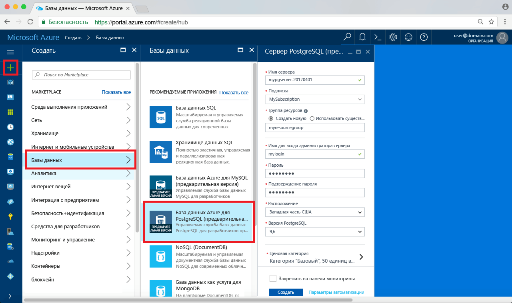

# <a name="design-your-first-azure-database-for-postgresql-using-hello-azure-portal"></a><span data-ttu-id="b836f-103">Проектирование первой базы данных Azure для PostgreSQL, с помощью портала Azure hello</span><span class="sxs-lookup"><span data-stu-id="b836f-103">Design your first Azure Database for PostgreSQL using hello Azure portal</span></span>

<span data-ttu-id="b836f-104">База данных Azure для PostgreSQL является управляемой службы, которая позволяет toorun, управлять и масштабировать высокодоступных баз данных PostgreSQL в облаке hello.</span><span class="sxs-lookup"><span data-stu-id="b836f-104">Azure Database for PostgreSQL is a managed service that enables you toorun, manage, and scale highly available PostgreSQL databases in hello cloud.</span></span> <span data-ttu-id="b836f-105">С помощью hello портал Azure, можно легко управлять сервером и разработке базы данных.</span><span class="sxs-lookup"><span data-stu-id="b836f-105">Using hello Azure portal, you can easily manage your server and design a database.</span></span>

<span data-ttu-id="b836f-106">В этом учебнике используется hello Azure портала toolearn как для:</span><span class="sxs-lookup"><span data-stu-id="b836f-106">In this tutorial, you use hello Azure portal toolearn how to:</span></span>
> [!div class="checklist"]
> * <span data-ttu-id="b836f-107">Создание базы данных Azure для PostgreSQL</span><span class="sxs-lookup"><span data-stu-id="b836f-107">Create an Azure Database for PostgreSQL</span></span>
> * <span data-ttu-id="b836f-108">Настройте брандмауэр сервера hello</span><span class="sxs-lookup"><span data-stu-id="b836f-108">Configure hello server firewall</span></span>
> * <span data-ttu-id="b836f-109">Используйте [ **psql** ](https://www.postgresql.org/docs/9.6/static/app-psql.html) toocreate программа базы данных</span><span class="sxs-lookup"><span data-stu-id="b836f-109">Use [**psql**](https://www.postgresql.org/docs/9.6/static/app-psql.html) utility toocreate a database</span></span>
> * <span data-ttu-id="b836f-110">Загрузка примера данных</span><span class="sxs-lookup"><span data-stu-id="b836f-110">Load sample data</span></span>
> * <span data-ttu-id="b836f-111">Запрос данных</span><span class="sxs-lookup"><span data-stu-id="b836f-111">Query data</span></span>
> * <span data-ttu-id="b836f-112">Обновление данных</span><span class="sxs-lookup"><span data-stu-id="b836f-112">Update data</span></span>
> * <span data-ttu-id="b836f-113">восстановление данных.</span><span class="sxs-lookup"><span data-stu-id="b836f-113">Restore data</span></span>

## <a name="prerequisites"></a><span data-ttu-id="b836f-114">Предварительные требования</span><span class="sxs-lookup"><span data-stu-id="b836f-114">Prerequisites</span></span>
<span data-ttu-id="b836f-115">Если у вас еще нет подписки Azure, создайте [бесплатную](https://azure.microsoft.com/free/) учетную запись Azure, прежде чем начинать работу.</span><span class="sxs-lookup"><span data-stu-id="b836f-115">If you don't have an Azure subscription, create a [free](https://azure.microsoft.com/free/) account before you begin.</span></span>

## <a name="log-in-toohello-azure-portal"></a><span data-ttu-id="b836f-116">Войдите в toohello портал Azure</span><span class="sxs-lookup"><span data-stu-id="b836f-116">Log in toohello Azure portal</span></span>
<span data-ttu-id="b836f-117">Войдите в toohello [портал Azure](https://portal.azure.com).</span><span class="sxs-lookup"><span data-stu-id="b836f-117">Log in toohello [Azure portal](https://portal.azure.com).</span></span>

## <a name="create-an-azure-database-for-postgresql"></a><span data-ttu-id="b836f-118">Создание базы данных Azure для PostgreSQL</span><span class="sxs-lookup"><span data-stu-id="b836f-118">Create an Azure Database for PostgreSQL</span></span>

<span data-ttu-id="b836f-119">Сервер базы данных Azure для PostgreSQL создается с определенным набором [вычислительных ресурсов и ресурсов хранения](./concepts-compute-unit-and-storage.md).</span><span class="sxs-lookup"><span data-stu-id="b836f-119">An Azure Database for PostgreSQL server is created with a defined set of [compute and storage resources](./concepts-compute-unit-and-storage.md).</span></span> <span data-ttu-id="b836f-120">сервер Hello создается в пределах [группы ресурсов Azure](../azure-resource-manager/resource-group-overview.md).</span><span class="sxs-lookup"><span data-stu-id="b836f-120">hello server is created within an [Azure resource group](../azure-resource-manager/resource-group-overview.md).</span></span>

<span data-ttu-id="b836f-121">Выполните эти действия toocreate PostgreSQL сервера базы данных Azure.</span><span class="sxs-lookup"><span data-stu-id="b836f-121">Follow these steps toocreate an Azure Database for PostgreSQL server:</span></span>
1.  <span data-ttu-id="b836f-122">Нажмите кнопку hello **+ создать** кнопка найдена в верхнем левом углу hello hello портал Azure.</span><span class="sxs-lookup"><span data-stu-id="b836f-122">Click hello **+ New**  button found on hello upper left-hand corner of hello Azure portal.</span></span>
2.  <span data-ttu-id="b836f-123">Выберите **баз данных** из hello **New** и выберите **базы данных Azure для PostgreSQL** из hello **баз данных** страницы.</span><span class="sxs-lookup"><span data-stu-id="b836f-123">Select **Databases** from hello **New** page, and select **Azure Database for PostgreSQL** from hello **Databases** page.</span></span>
 <span data-ttu-id="b836f-124"></span><span class="sxs-lookup"><span data-stu-id="b836f-124"></span></span>

3.  <span data-ttu-id="b836f-125">Заполнение hello новый сервер сведения формы с hello следующую информацию, как показано на предшествующий изображения hello:</span><span class="sxs-lookup"><span data-stu-id="b836f-125">Fill out hello new server details form with hello following information, as shown on hello preceding image:</span></span>
    - <span data-ttu-id="b836f-126">Имя сервера: **mypgserver 20170401** (имя учетной записи сопоставляет имя tooDNS и, таким образом, требуется toobe глобально уникальным)</span><span class="sxs-lookup"><span data-stu-id="b836f-126">Server name: **mypgserver-20170401** (name of a server maps tooDNS name and is thus required toobe globally unique)</span></span> 
    - <span data-ttu-id="b836f-127">Подписки: Если у вас несколько подписок, выберите нужную подписку hello, в котором hello ресурсов существует, или плата за.</span><span class="sxs-lookup"><span data-stu-id="b836f-127">Subscription: If you have multiple subscriptions, choose hello appropriate subscription in which hello resource exists or is billed for.</span></span>
    - <span data-ttu-id="b836f-128">Группа ресурсов — **myresourcegroup**.</span><span class="sxs-lookup"><span data-stu-id="b836f-128">Resource group: **myresourcegroup**</span></span>
    - <span data-ttu-id="b836f-129">Имя для входа администратора сервера и пароль.</span><span class="sxs-lookup"><span data-stu-id="b836f-129">Server admin login and password of your choice</span></span>
    - <span data-ttu-id="b836f-130">Расположение</span><span class="sxs-lookup"><span data-stu-id="b836f-130">Location</span></span>
    - <span data-ttu-id="b836f-131">Версия PostgreSQL.</span><span class="sxs-lookup"><span data-stu-id="b836f-131">PostgreSQL Version</span></span>

  > [!IMPORTANT]
  > <span data-ttu-id="b836f-132">Имя входа администратора сервера Hello и пароль, указанные здесь являются необходимые toolog в toohello сервера и баз данных далее в этом кратком руководстве.</span><span class="sxs-lookup"><span data-stu-id="b836f-132">hello server admin login and password that you specify here are required toolog in toohello server and its databases later in this quick start.</span></span> <span data-ttu-id="b836f-133">Запомните или запишите эту информацию для последующего использования.</span><span class="sxs-lookup"><span data-stu-id="b836f-133">Remember or record this information for later use.</span></span>

4.  <span data-ttu-id="b836f-134">Нажмите кнопку **Ценовая категория** toospecify hello службы уровня и уровня производительности для новой базы данных.</span><span class="sxs-lookup"><span data-stu-id="b836f-134">Click **Pricing tier** toospecify hello service tier and performance level for your new database.</span></span> <span data-ttu-id="b836f-135">Для этого руководства выберите уровень **Базовый**, **50 единиц вычислений** и хранилище объемом **50 ГБ**.</span><span class="sxs-lookup"><span data-stu-id="b836f-135">For this quick start, select **Basic** Tier, **50 Compute Units** and **50 GB** of included storage.</span></span>
 <span data-ttu-id="b836f-136"></span><span class="sxs-lookup"><span data-stu-id="b836f-136"></span></span>
5.  <span data-ttu-id="b836f-137">Нажмите кнопку **ОК**.</span><span class="sxs-lookup"><span data-stu-id="b836f-137">Click **Ok**.</span></span>
6.  <span data-ttu-id="b836f-138">Нажмите кнопку **создать** tooprovision hello server.</span><span class="sxs-lookup"><span data-stu-id="b836f-138">Click **Create** tooprovision hello server.</span></span> <span data-ttu-id="b836f-139">Подготовка занимает несколько минут.</span><span class="sxs-lookup"><span data-stu-id="b836f-139">Provisioning takes a few minutes.</span></span>

  > [!TIP]
  > <span data-ttu-id="b836f-140">Проверьте hello **toodashboard ПИН-код** параметр tooallow легко отслеживания развертываний.</span><span class="sxs-lookup"><span data-stu-id="b836f-140">Check hello **Pin toodashboard** option tooallow easy tracking of your deployments.</span></span>

7.  <span data-ttu-id="b836f-141">На панели инструментов hello, нажмите кнопку **уведомления** процесс развертывания toomonitor hello.</span><span class="sxs-lookup"><span data-stu-id="b836f-141">On hello toolbar, click **Notifications** toomonitor hello deployment process.</span></span>
 <span data-ttu-id="b836f-142"></span><span class="sxs-lookup"><span data-stu-id="b836f-142"></span></span>
   
  <span data-ttu-id="b836f-143">По умолчанию на сервере создается база данных **postgres**.</span><span class="sxs-lookup"><span data-stu-id="b836f-143">By default, **postgres** database gets created under your server.</span></span> <span data-ttu-id="b836f-144">Hello [postgres](https://www.postgresql.org/docs/9.6/static/app-initdb.html) база данных является базой данных по умолчанию, предназначены для использования пользователями, служебные программы и сторонние приложения.</span><span class="sxs-lookup"><span data-stu-id="b836f-144">hello [postgres](https://www.postgresql.org/docs/9.6/static/app-initdb.html) database is a default database meant for use by users, utilities, and third-party applications.</span></span> 

## <a name="configure-a-server-level-firewall-rule"></a><span data-ttu-id="b836f-145">Настройка правила брандмауэра на уровне сервера</span><span class="sxs-lookup"><span data-stu-id="b836f-145">Configure a server-level firewall rule</span></span>

<span data-ttu-id="b836f-146">Hello базы данных Azure для службы PostgreSQL создает брандмауэра на уровне сервера hello.</span><span class="sxs-lookup"><span data-stu-id="b836f-146">hello Azure Database for PostgreSQL service creates a firewall at hello server-level.</span></span> <span data-ttu-id="b836f-147">Этот брандмауэр невозможным подключение toohello сервер и все базы данных на сервере hello правила брандмауэра не введен tooopen hello брандмауэра для конкретных IP-адресов внешнего приложения и средства.</span><span class="sxs-lookup"><span data-stu-id="b836f-147">This firewall prevents external applications and tools from connecting toohello server and any databases on hello server unless a firewall rule is created tooopen hello firewall for specific IP addresses.</span></span> 

1.  <span data-ttu-id="b836f-148">После завершения развертывания hello, нажмите кнопку **все ресурсы** из hello левого меню и введите имя hello **mypgserver 20170401** toosearch для вновь созданного сервера.</span><span class="sxs-lookup"><span data-stu-id="b836f-148">After hello deployment completes, click **All Resources** from hello left-hand menu and type in hello name **mypgserver-20170401** toosearch for your newly created server.</span></span> <span data-ttu-id="b836f-149">Щелкните имя сервера hello, перечисленные в результатах поиска hello.</span><span class="sxs-lookup"><span data-stu-id="b836f-149">Click hello server name listed in hello search result.</span></span> <span data-ttu-id="b836f-150">Hello **Обзор** страница сервера открывает и предоставляет параметры для дальнейшей настройки.</span><span class="sxs-lookup"><span data-stu-id="b836f-150">hello **Overview** page for your server opens and provides options for further configuration.</span></span>
 
 

2.  <span data-ttu-id="b836f-152">В колонке сервера hello выберите **безопасности подключения**.</span><span class="sxs-lookup"><span data-stu-id="b836f-152">In hello server blade, select **Connection Security**.</span></span> 
3.  <span data-ttu-id="b836f-153">Щелкните в поле текст hello в разделе **имя правила,** и добавить новый брандмауэр правило toowhitelist hello диапазон IP-подключения.</span><span class="sxs-lookup"><span data-stu-id="b836f-153">Click in hello text box under **Rule Name,** and add a new firewall rule toowhitelist hello IP range for connectivity.</span></span> <span data-ttu-id="b836f-154">В задачах этого руководства разрешите подключение для всех IP-адресов, указав для параметра **Имя правила** значение AllowAllIps, для параметра **Начальный IP-адрес** значение 0.0.0.0, а для параметра **Конечный IP-адрес** значение 255.255.255.255, после чего щелкните **Сохранить**.</span><span class="sxs-lookup"><span data-stu-id="b836f-154">For this tutorial, let's allow all IPs by typing in **Rule Name = AllowAllIps**, **Start IP = 0.0.0.0** and **End IP = 255.255.255.255** and then click **Save**.</span></span> <span data-ttu-id="b836f-155">Можно задать правило брандмауэра, которое охватывает IP диапазон toobe может tooconnect из сети.</span><span class="sxs-lookup"><span data-stu-id="b836f-155">You can set a firewall rule that covers an IP range toobe able tooconnect from your network.</span></span>
 
 

4.  <span data-ttu-id="b836f-157">Нажмите кнопку **Сохранить** и нажмите кнопку hello **X** tooclose hello **безопасности подключений** страницы.</span><span class="sxs-lookup"><span data-stu-id="b836f-157">Click **Save** and then click hello **X** tooclose hello **Connections Security** page.</span></span>

  > [!NOTE]
  > <span data-ttu-id="b836f-158">Сервер PostgreSQL Azure обменивается данными через порт 5432.</span><span class="sxs-lookup"><span data-stu-id="b836f-158">Azure PostgreSQL server communicates over port 5432.</span></span> <span data-ttu-id="b836f-159">Если вы пытаетесь tooconnect из корпоративной сети, исходящий трафик через порт 5432 может оказаться невозможным брандмауэром вашей сети.</span><span class="sxs-lookup"><span data-stu-id="b836f-159">If you are trying tooconnect from within a corporate network, outbound traffic over port 5432 may not be allowed by your network's firewall.</span></span> <span data-ttu-id="b836f-160">В этом случае нельзя сервера базы данных SQL Azure может tooconnect tooyour Если ИТ-отдел открывает порт 5432.</span><span class="sxs-lookup"><span data-stu-id="b836f-160">If so, you will not be able tooconnect tooyour Azure SQL Database server unless your IT department opens port 5432.</span></span>
  >


## <a name="get-hello-connection-information"></a><span data-ttu-id="b836f-161">Получить сведения о соединении hello</span><span class="sxs-lookup"><span data-stu-id="b836f-161">Get hello connection information</span></span>

<span data-ttu-id="b836f-162">По умолчанию Здравствуйте, создавая базе данных Azure для сервера PostgreSQL, **postgres** также получает создана база данных.</span><span class="sxs-lookup"><span data-stu-id="b836f-162">When we created our Azure Database for PostgreSQL server, hello default **postgres** database also gets created.</span></span> <span data-ttu-id="b836f-163">сервер базы данных tooyour tooconnect, необходимы учетные данные сведения и доступа узла tooprovide.</span><span class="sxs-lookup"><span data-stu-id="b836f-163">tooconnect tooyour database server, you need tooprovide host information and access credentials.</span></span>

1. <span data-ttu-id="b836f-164">Hello левого меню на портале Azure, щелкните **все ресурсы** и найдите только что созданный сервер hello **mypgserver 20170401**.</span><span class="sxs-lookup"><span data-stu-id="b836f-164">From hello left-hand menu in Azure portal, click **All resources** and search for hello server you just created **mypgserver-20170401**.</span></span>

  

3. <span data-ttu-id="b836f-166">Щелкните имя сервера hello **mypgserver 20170401**.</span><span class="sxs-lookup"><span data-stu-id="b836f-166">Click hello server name **mypgserver-20170401**.</span></span>
4. <span data-ttu-id="b836f-167">Выберите hello server **Обзор** страницы.</span><span class="sxs-lookup"><span data-stu-id="b836f-167">Select hello server's **Overview** page.</span></span> <span data-ttu-id="b836f-168">Запишите hello **имя сервера** и **имя входа администратора сервера**.</span><span class="sxs-lookup"><span data-stu-id="b836f-168">Make a note of hello **Server name** and **Server admin login name**.</span></span>

 


## <a name="connect-toopostgresql-database-using-psql-in-cloud-shell"></a><span data-ttu-id="b836f-170">Подключение tooPostgreSQL базы данных с помощью psql в оболочке облака</span><span class="sxs-lookup"><span data-stu-id="b836f-170">Connect tooPostgreSQL database using psql in Cloud Shell</span></span>

<span data-ttu-id="b836f-171">Теперь воспользуемся hello psql программы командной строки tooconnect toohello базы данных Azure для сервера PostgreSQL.</span><span class="sxs-lookup"><span data-stu-id="b836f-171">Let's now use hello psql command-line utility tooconnect toohello Azure Database for PostgreSQL server.</span></span> 
1. <span data-ttu-id="b836f-172">Запустите hello оболочки облако Azure через hello терминалов значок на верхней панели навигации панели hello.</span><span class="sxs-lookup"><span data-stu-id="b836f-172">Launch hello Azure Cloud Shell via hello terminal icon on hello top navigation pane.</span></span>

   

2. <span data-ttu-id="b836f-174">Hello оболочки облако Azure открывает в браузере, позволяя tootype команд bash.</span><span class="sxs-lookup"><span data-stu-id="b836f-174">hello Azure Cloud Shell opens in your browser, enabling you tootype bash commands.</span></span>

   

3. <span data-ttu-id="b836f-176">В облаке командную строку hello подключение tooyour базы данных Azure для сервера PostgreSQL, с помощью команды psql hello.</span><span class="sxs-lookup"><span data-stu-id="b836f-176">At hello Cloud Shell prompt, connect tooyour Azure Database for PostgreSQL server using hello psql commands.</span></span> <span data-ttu-id="b836f-177">Hello следующий формат: tooan tooconnect используется база данных Azure для сервера PostgreSQL с hello [psql](https://www.postgresql.org/docs/9.6/static/app-psql.html) программы:</span><span class="sxs-lookup"><span data-stu-id="b836f-177">hello following format is used tooconnect tooan Azure Database for PostgreSQL server with hello [psql](https://www.postgresql.org/docs/9.6/static/app-psql.html) utility:</span></span>
   ```bash
   psql --host=<myserver> --port=<port> --username=<server admin login> --dbname=<database name>
   ```

   <span data-ttu-id="b836f-178">Например, следующую команду hello подключается toohello по умолчанию база данных с именем **postgres** на сервере PostgreSQL **mypgserver 20170401.postgres.database.azure.com** с использованием учетных данных.</span><span class="sxs-lookup"><span data-stu-id="b836f-178">For example, hello following command connects toohello default database called **postgres** on your PostgreSQL server **mypgserver-20170401.postgres.database.azure.com** using access credentials.</span></span> <span data-ttu-id="b836f-179">В ответ на запрос введите пароль администратора сервера.</span><span class="sxs-lookup"><span data-stu-id="b836f-179">Enter your server admin password when prompted.</span></span>

   ```bash
   psql --host=mypgserver-20170401.postgres.database.azure.com --port=5432 --username=mylogin@mypgserver-20170401 --dbname=postgres
   ```

## <a name="create-a-new-database"></a><span data-ttu-id="b836f-180">Создание базы данных</span><span class="sxs-lookup"><span data-stu-id="b836f-180">Create a New Database</span></span>
<span data-ttu-id="b836f-181">После того, как сервер подключенных toohello, создайте пустую базу данных в строке приветствия.</span><span class="sxs-lookup"><span data-stu-id="b836f-181">Once you're connected toohello server, create a blank database at hello prompt.</span></span>
```bash
CREATE DATABASE mypgsqldb;
```

<span data-ttu-id="b836f-182">Выполните следующие tooswitch для команды подключение к базе данных только что созданный toohello hello строке hello **mypgsqldb**.</span><span class="sxs-lookup"><span data-stu-id="b836f-182">At hello prompt, execute hello following command tooswitch connection toohello newly created database **mypgsqldb**.</span></span>
```bash
\c mypgsqldb
```
## <a name="create-tables-in-hello-database"></a><span data-ttu-id="b836f-183">Создание таблиц в базе данных hello</span><span class="sxs-lookup"><span data-stu-id="b836f-183">Create tables in hello database</span></span>
<span data-ttu-id="b836f-184">Теперь, когда вы знаете, как toohello tooconnect базы данных Azure для PostgreSQL, мы можем открыть как toocomplete некоторых базовых задач.</span><span class="sxs-lookup"><span data-stu-id="b836f-184">Now that you know how tooconnect toohello Azure Database for PostgreSQL, we can go over how toocomplete some basic tasks.</span></span>

<span data-ttu-id="b836f-185">Сначала можно создать таблицу и заполнить ее некоторыми данными.</span><span class="sxs-lookup"><span data-stu-id="b836f-185">First, we can create a table and load it with some data.</span></span> <span data-ttu-id="b836f-186">Давайте создадим таблицу, с помощью которой можно отслеживать данные инвентаризации.</span><span class="sxs-lookup"><span data-stu-id="b836f-186">Let's create a table that tracks inventory information.</span></span>
```sql
CREATE TABLE inventory (
    id serial PRIMARY KEY, 
    name VARCHAR(50), 
    quantity INTEGER
);
```

<span data-ttu-id="b836f-187">Вы можете увидеть hello вновь созданные таблицы в списке hello tabvles сейчас, введя:</span><span class="sxs-lookup"><span data-stu-id="b836f-187">You can see hello newly created table in hello list of tabvles now by typing:</span></span>
```sql
\dt
```

## <a name="load-data-into-hello-tables"></a><span data-ttu-id="b836f-188">Загрузка данных в таблицы hello</span><span class="sxs-lookup"><span data-stu-id="b836f-188">Load data into hello tables</span></span>
<span data-ttu-id="b836f-189">Теперь, когда таблица создана, мы можем вставить в нее данные.</span><span class="sxs-lookup"><span data-stu-id="b836f-189">Now that we have a table, we can insert some data into it.</span></span> <span data-ttu-id="b836f-190">Привет открыть окно командной строки запустите следующий запрос tooinsert hello некоторых строк данных</span><span class="sxs-lookup"><span data-stu-id="b836f-190">At hello open command prompt window, run hello following query tooinsert some rows of data</span></span>
```sql
INSERT INTO inventory (id, name, quantity) VALUES (1, 'banana', 150); 
INSERT INTO inventory (id, name, quantity) VALUES (2, 'orange', 154);
```

<span data-ttu-id="b836f-191">У вас теперь две строки образца данных в таблицу hello, созданную ранее.</span><span class="sxs-lookup"><span data-stu-id="b836f-191">You have now two rows of sample data into hello table you created earlier.</span></span>

## <a name="query-and-update-hello-data-in-hello-tables"></a><span data-ttu-id="b836f-192">Запрашивать и обновлять данные hello в таблицах hello</span><span class="sxs-lookup"><span data-stu-id="b836f-192">Query and update hello data in hello tables</span></span>
<span data-ttu-id="b836f-193">Выполните следующую информацию tooretrieve запроса из таблицы базы данных hello hello.</span><span class="sxs-lookup"><span data-stu-id="b836f-193">Execute hello following query tooretrieve information from hello database table.</span></span> 
```sql
SELECT * FROM inventory;
```

<span data-ttu-id="b836f-194">Можно также обновить данные hello в таблицах hello</span><span class="sxs-lookup"><span data-stu-id="b836f-194">You can also update hello data in hello tables</span></span>
```sql
UPDATE inventory SET quantity = 200 WHERE name = 'banana';
```

<span data-ttu-id="b836f-195">Строка Hello обновляется соответствующим образом при извлечении данных.</span><span class="sxs-lookup"><span data-stu-id="b836f-195">hello row gets updated accordingly when you retrieve data.</span></span>
```sql
SELECT * FROM inventory;
```

## <a name="restore-data-tooa-previous-point-in-time"></a><span data-ttu-id="b836f-196">Восстановление предыдущей точки данных tooa времени</span><span class="sxs-lookup"><span data-stu-id="b836f-196">Restore data tooa previous point in time</span></span>
<span data-ttu-id="b836f-197">Представьте, что вы случайно удалили таблицу.</span><span class="sxs-lookup"><span data-stu-id="b836f-197">Imagine you have accidentally deleted this table.</span></span> <span data-ttu-id="b836f-198">Восстановить ее будет непросто.</span><span class="sxs-lookup"><span data-stu-id="b836f-198">This situation is something you cannot easily recover from.</span></span> <span data-ttu-id="b836f-199">База данных Azure для PostgreSQL позволяет toogo tooany назад в определенный момент (в hello последней копии too7 дней (Basic) и на 35 дней (стандартный)) и восстановления на момент tooa созданный сервер.</span><span class="sxs-lookup"><span data-stu-id="b836f-199">Azure Database for PostgreSQL allows you toogo back tooany point-in-time (in hello last up too7 days (Basic) and 35 days (Standard)) and restore this point-in-time tooa new server.</span></span> <span data-ttu-id="b836f-200">Можно использовать этот новый сервер toorecover удаленные данные.</span><span class="sxs-lookup"><span data-stu-id="b836f-200">You can use this new server toorecover your deleted data.</span></span> <span data-ttu-id="b836f-201">Здравствуйте, следующая точка tooa сервера образец hello действия восстановления перед hello таблица была добавлена.</span><span class="sxs-lookup"><span data-stu-id="b836f-201">hello following steps restore hello sample server tooa point before hello table was added.</span></span>

1.  <span data-ttu-id="b836f-202">Щелкните hello PostgreSQL страницы для сервера базы данных Azure, **восстановить** на панели инструментов hello.</span><span class="sxs-lookup"><span data-stu-id="b836f-202">On hello Azure Database for PostgreSQL page for your server, click **Restore** on hello toolbar.</span></span> <span data-ttu-id="b836f-203">Hello **восстановить** откроется страница.</span><span class="sxs-lookup"><span data-stu-id="b836f-203">hello **Restore** page opens.</span></span>
  <span data-ttu-id="b836f-204"></span><span class="sxs-lookup"><span data-stu-id="b836f-204"></span></span>
2.  <span data-ttu-id="b836f-205">Заполните hello **восстановить** формы с hello необходимые сведения:</span><span class="sxs-lookup"><span data-stu-id="b836f-205">Fill out hello **Restore** form with hello required information:</span></span>

  
  - <span data-ttu-id="b836f-207">**Точка восстановления**: выберите в момент, выполняемой до hello сервер был изменен</span><span class="sxs-lookup"><span data-stu-id="b836f-207">**Restore point**: Select a point-in-time that occurs before hello server was changed</span></span>
  - <span data-ttu-id="b836f-208">**Целевой сервер**: Введите имя нового сервера требуется toorestore для</span><span class="sxs-lookup"><span data-stu-id="b836f-208">**Target server**: Provide a new server name you want toorestore to</span></span>
  - <span data-ttu-id="b836f-209">**Расположение**: не удается выбрать область hello, по умолчанию его значение совпадает hello исходного сервера</span><span class="sxs-lookup"><span data-stu-id="b836f-209">**Location**: You cannot select hello region, by default it is same as hello source server</span></span>
  - <span data-ttu-id="b836f-210">**Ценовая категория**: это значение нельзя изменить при восстановлении сервера.</span><span class="sxs-lookup"><span data-stu-id="b836f-210">**Pricing tier**: You cannot change this value when restoring a server.</span></span> <span data-ttu-id="b836f-211">Это то же, что hello исходного сервера.</span><span class="sxs-lookup"><span data-stu-id="b836f-211">It is same as hello source server.</span></span> 
3.  <span data-ttu-id="b836f-212">Нажмите кнопку **ОК** toorestore hello server слишком[восстановить tooa в момент](./howto-restore-server-portal.md) до удаления таблиц hello.</span><span class="sxs-lookup"><span data-stu-id="b836f-212">Click **OK** toorestore hello server too[restore tooa point-in-time](./howto-restore-server-portal.md) before hello tables was deleted.</span></span> <span data-ttu-id="b836f-213">Восстановление сервера tooa другой момент времени, создает повторяющиеся новый сервер как исходный сервер hello как hello моменту времени можно указать, при условии, что он находится в пределах срока хранения hello вашей [уровня службы](./concepts-service-tiers.md).</span><span class="sxs-lookup"><span data-stu-id="b836f-213">Restoring a server tooa different point in time creates a duplicate new server as hello original server as of hello point in time you specify, provided that it is within hello retention period for your [service tier](./concepts-service-tiers.md).</span></span>

## <a name="next-steps"></a><span data-ttu-id="b836f-214">Дальнейшие действия</span><span class="sxs-lookup"><span data-stu-id="b836f-214">Next Steps</span></span>
<span data-ttu-id="b836f-215">В этом учебнике вы узнали, как toouse hello Azure и других служебных программ для:</span><span class="sxs-lookup"><span data-stu-id="b836f-215">In this tutorial, you learned how toouse hello Azure portal and other utilities to:</span></span>
> [!div class="checklist"]
> * <span data-ttu-id="b836f-216">Создание базы данных Azure для PostgreSQL</span><span class="sxs-lookup"><span data-stu-id="b836f-216">Create an Azure Database for PostgreSQL</span></span>
> * <span data-ttu-id="b836f-217">Настройте брандмауэр сервера hello</span><span class="sxs-lookup"><span data-stu-id="b836f-217">Configure hello server firewall</span></span>
> * <span data-ttu-id="b836f-218">Используйте [ **psql** ](https://www.postgresql.org/docs/9.6/static/app-psql.html) toocreate программа базы данных</span><span class="sxs-lookup"><span data-stu-id="b836f-218">Use [**psql**](https://www.postgresql.org/docs/9.6/static/app-psql.html) utility toocreate a database</span></span>
> * <span data-ttu-id="b836f-219">Загрузка примера данных</span><span class="sxs-lookup"><span data-stu-id="b836f-219">Load sample data</span></span>
> * <span data-ttu-id="b836f-220">Запрос данных</span><span class="sxs-lookup"><span data-stu-id="b836f-220">Query data</span></span>
> * <span data-ttu-id="b836f-221">Обновление данных</span><span class="sxs-lookup"><span data-stu-id="b836f-221">Update data</span></span>
> * <span data-ttu-id="b836f-222">восстановление данных.</span><span class="sxs-lookup"><span data-stu-id="b836f-222">Restore data</span></span>

<span data-ttu-id="b836f-223">Далее, узнайте, как toouse Azure CLI toodo других подобных задач, просмотрите этот учебник: [проектирование первой базы данных Azure для PostgreSQL, с помощью Azure CLI](tutorial-design-database-using-azure-cli.md)</span><span class="sxs-lookup"><span data-stu-id="b836f-223">Next, learn how toouse Azure CLI toodo similar tasks, review this tutorial: [Design your first Azure Database for PostgreSQL using Azure CLI](tutorial-design-database-using-azure-cli.md)</span></span>
