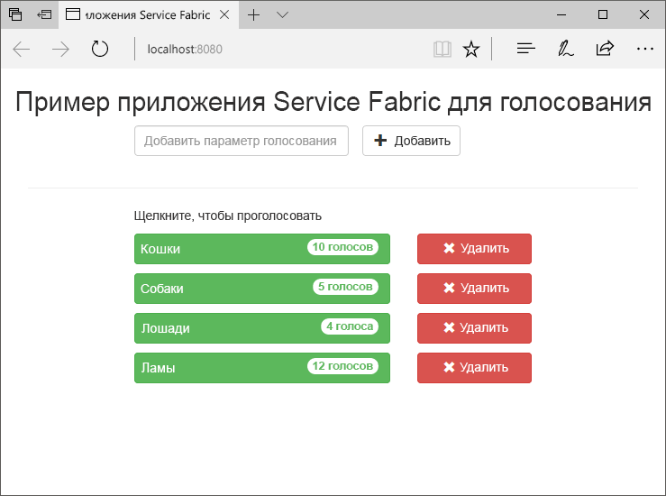
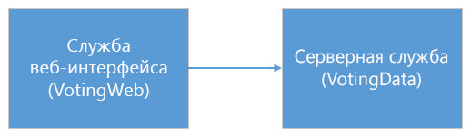
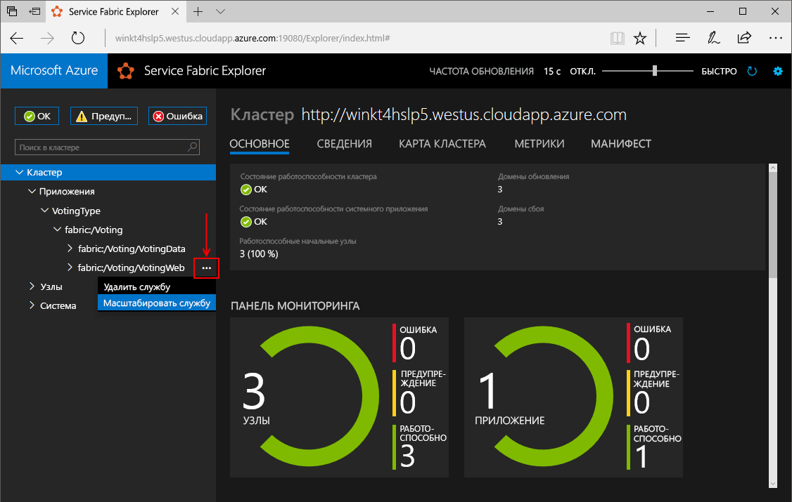
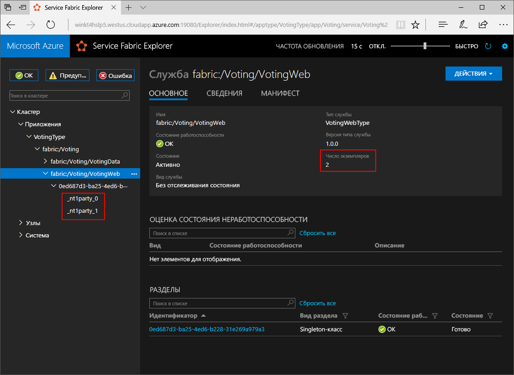
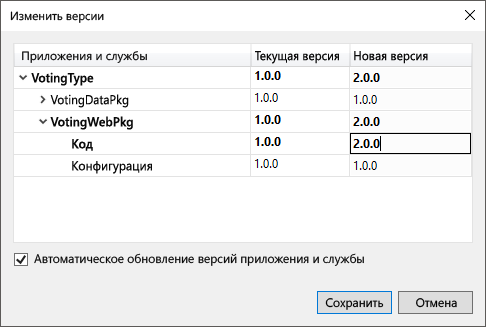
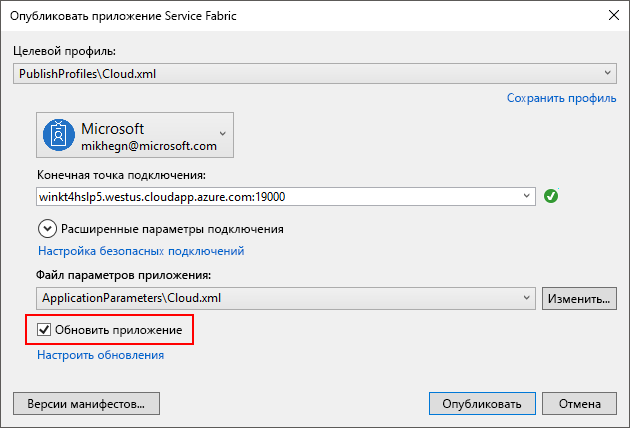
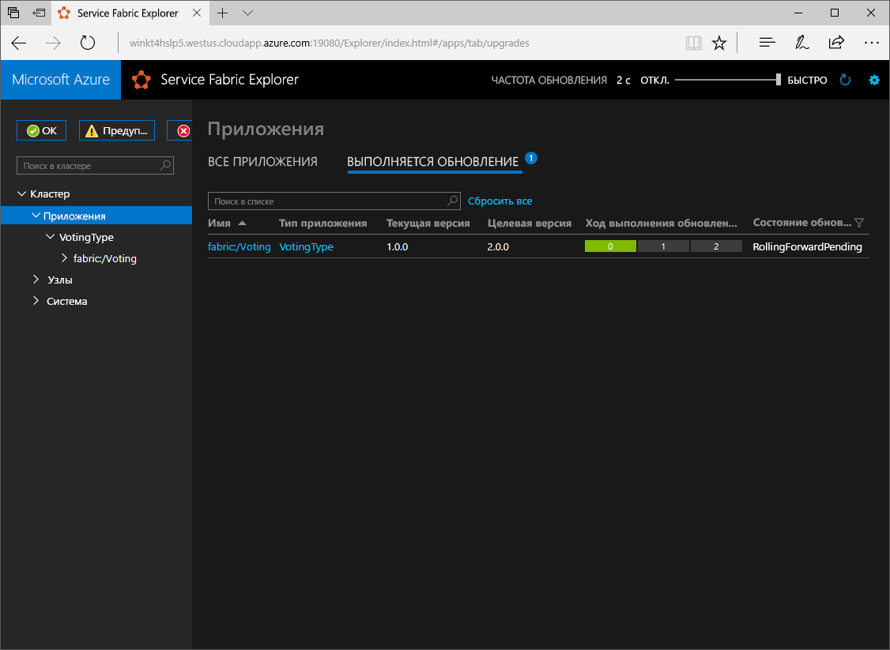

# <a name="create-a-net-service-fabric-application-in-azure"></a>Создание приложения .NET Service Fabric в Azure
Azure Service Fabric — это платформа распределенных систем для развертывания масштабируемых надежных микрослужб и контейнеров и управления ими. 

Краткого руководства показано, как toodeploy вашего первого tooService приложения .NET структуры. После завершения имеется голосования приложение с ASP.NET Core веб-интерфейса, который сохраняет результаты голосования в с отслеживанием состояния внутренней службы в кластере hello.



С помощью этого приложения вы узнаете, как выполнить следующие действия:
> [!div class="checklist"]
> * Создание приложения с использованием .NET и Service Fabric
> * Использование ASP.NET Core в качестве клиентского веб-интерфейса
> * Хранение данных приложения в службе с отслеживанием состояния
> * Локальная отладка приложения
> * Развертывание кластера tooa приложения hello в Azure
> * Hello масштабирования приложения на нескольких узлах
> * Последовательное обновление приложения

## <a name="prerequisites"></a>Предварительные требования
toocomplete краткого руководства:
1. [Установка Visual Studio 2017 г](https://www.visualstudio.com/) с hello **разработки Azure** и **ASP.NET и веб-разработки** рабочих нагрузок.
2. [установите Git](https://git-scm.com/);
3. [Установить пакет Microsoft Azure Service Fabric SDK hello](http://www.microsoft.com/web/handlers/webpi.ashx?command=getinstallerredirect&appid=MicrosoftAzure-ServiceFabric-CoreSDK)
4. Выполните следующие команды tooenable Visual Studio toodeploy toohello локального кластера Service Fabric hello.
    ```powershell
    Set-ExecutionPolicy -ExecutionPolicy Unrestricted -Force -Scope CurrentUser
    ```

## <a name="download-hello-sample"></a>Загрузить образец hello
В окне командной строки запустите hello, следующая команда tooclone hello образец приложения репозитория tooyour локального компьютера.
```
git clone https://github.com/Azure-Samples/service-fabric-dotnet-quickstart
```

## <a name="run-hello-application-locally"></a>Запустите приложение hello локально
Щелкните правой кнопкой мыши значок hello Visual Studio в меню "Пуск" hello и выберите **Запуск от имени администратора**. В порядке tooattach hello отладчик tooyour служб необходимо toorun Visual Studio от имени администратора.

Откройте hello **Voting.sln** решения Visual Studio из репозитория hello, можно клонировать.

приложение hello toodeploy, нажмите клавишу **F5**.

> [!NOTE]
> Hello в первый раз, запуска и развертывания приложения hello, Visual Studio создает локального кластера для отладки. Эта операция может занять некоторое время. Состояние создания кластера Hello отображается в окне вывода Visual Studio hello.

После завершения развертывания hello запускает браузер и открыть эту страницу: `http://localhost:8080` -hello клиентского веб-интерфейса приложения hello.


Теперь можно добавить варианты для выбора в голосовании и начать прием голосов. Здравствуйте, приложение будет работать и сохраняет все данные кластера Service Fabric, без необходимости hello отдельную базу данных.

## <a name="walk-through-hello-voting-sample-application"></a>Перемещайтесь голосования пример приложения hello
Hello голосования приложения состоит из двух служб.
- Веб-интерфейса службы (VotingWeb) — ASP.NET Core веб-интерфейса службы, который будет служить hello веб-страницы и предоставляет доступ к веб-API-интерфейсы toocommunicate с серверной службы hello.
- Внутренняя служба (VotingData)-ASP.NET Core веб-служба предоставляет один голос hello toostore API приводит к надежным словарь сохраняются на диске.



Когда голосовать в следующие hello приложения hello происходят события.
1. JavaScript отправляет toohello веб-запроса API hello голос hello веб-интерфейса службы как запрос HTTP PUT.

2. Hello клиентского веб-интерфейса службы использует toolocate прокси-сервера и пересылать запрос HTTP PUT toohello внутренней службы.

3. Hello внутренняя служба принимает входящий запрос hello и хранилищ hello обновил результат в надежные словаря, который получает реплицированные toomultiple узлами в кластере hello и сохраняются на диске. Все приложения hello данные хранятся в кластере hello, поэтому не требуется ни одной базы данных.

## <a name="debug-in-visual-studio"></a>Отладка в Visual Studio
При отладке приложения в Visual Studio вы используете локальный кластер разработки Service Fabric. У вас есть параметр tooadjust hello отладки сценария tooyour качества. В этом приложении мы храним данные во внутренней службе с помощью надежного словаря. Visual Studio удаляет приложение hello по умолчанию, при остановке отладчика hello. Удаление приложения hello вызывает hello данных в серверной части hello tooalso службы удаляется. toopersist hello данных между сеансами отладки, можно изменить hello **режим отладки приложения** как свойство hello **Голосование** проекта в Visual Studio.

toolook, что происходит в коде hello завершения hello, следующие шаги:
1. Откройте hello **VotesController.cs** файла и задать точку останова в hello веб-API **поместить** метод (строка 47 -), можно выполнить поиск файла hello в hello обозревателя решений в Visual Studio.

2. Откройте hello **VoteDataController.cs** файл и установите точку останова в этом веб-API **поместить** метод (строка 50).

3. Вернитесь к предыдущему окну toohello браузера и нажмите кнопку голосования параметр или добавить новую голосования. Попадании hello первой точки останова в hello веб-интерфейса контроллер api.
    - Это где hello JavaScript в браузере hello отправляет контроллер запроса toohello web API в клиентской службы hello.
    
    

    - Сначала мы создаем URL-адрес hello toohello ReverseProxy для наших служб **(1)**.
    - Затем мы отправляем hello запроса HTTP PUT toohello ReverseProxy **(2)**.
    - Наконец hello мы возвращаем hello ответа от клиента toohello внутренней службе hello **(3)**.

4. Нажмите клавишу **F5** toocontinue
    - Теперь вы находитесь в точке останова hello в hello внутренней службы.
    
    

    - В первую строку hello в методе hello **(1)** мы используем hello `StateManager` tooget или добавление надежного словаря, который называется `counts`.
    - Все взаимодействие с надежным словарем осуществляется с помощью транзакций. Для создания транзакции используется инструкция using **(2)**.
    - В транзакции hello, мы затем измените значение hello hello соответствующего ключа для голосования параметр hello и фиксации hello операции **(3)**. После фиксации hello методом hello данных обновляется в словаре hello и реплицируются tooother узлов в кластере hello. Hello данные теперь безопасно хранятся в кластере hello и hello внутренней службы при сбое tooother узлов, по-прежнему возникают hello данные недоступны.
5. Нажмите клавишу **F5** toocontinue

hello toostop сеанса, нажмите клавишу отладки **Shift + F5**.

## <a name="deploy-hello-application-tooazure"></a>Развертывание tooAzure приложения hello
toodeploy hello кластера tooa приложения в Azure, можно выбрать toocreate собственные кластера или использования кластера стороной.

Кластеры, стороннего производителя, бесплатные, ограничено по времени кластеров Service Fabric размещаются в Azure и выполняются командой Service Fabric hello, где любой пользователь может развертывать приложения и Дополнительные сведения о платформе hello. tooa доступа tooget кластера стороны [следуйте инструкциям hello](http://aka.ms/tryservicefabric). 

Сведения о создании собственного кластера см. в разделе [Создание первого кластера Service Fabric в Azure](service-fabric-get-started-azure-cluster.md).

> [!Note]
> Hello веб-интерфейса службы является настроенным toolisten через порт 8080 для входящего трафика. Убедитесь, что порт открыт в кластере. При использовании кластера стороны hello этот порт открыт.
>

### <a name="deploy-hello-application-using-visual-studio"></a>Развертывание приложения hello, с помощью Visual Studio
Теперь, когда приложение hello готов, его можно развернуть кластер tooa непосредственно из Visual Studio.

1. Щелкните правой кнопкой мыши **Голосование** в hello в обозревателе решений и выберите **публикации**. Откроется диалоговое окно публикации Hello.

    

2. Тип в hello конечной точки подключения кластера hello в hello **конечной точки подключения** поле и нажмите кнопку **публикации**. При регистрации для hello стороны кластера, в браузере hello предоставляется hello конечной точки подключения. Например, `winh1x87d1d.westus.cloudapp.azure.com:19000`.

3. Например, откройте браузер и введите в адрес кластера hello - `http://winh1x87d1d.westus.cloudapp.azure.com`. Теперь вы увидите приложения hello, запущенного в кластере hello в Azure.


## <a name="scale-applications-and-services-in-a-cluster"></a>Масштабирование приложений и служб в кластере
Служб Service Fabric, можно легко масштабировать на tooaccommodate кластера при изменении нагрузки hello в службах hello. Масштабирование службы, изменив hello количество экземпляров, работающих в кластере hello. Существует несколько способов масштабирования служб — вы можете использовать сценарии PowerShell или команды интерфейса командной строки Service Fabric (sfctl). В этом примере мы используем Service Fabric Explorer.

Обозреватель Service Fabric выполняется во всех кластерах службы структуры и может осуществляться из браузера, просматривая порт управления кластерами HTTP toohello (19080), например, `http://winh1x87d1d.westus.cloudapp.azure.com:19080`.

tooscale hello веб-службы интерфейса, hello следующие действия:

1. Откройте Service Fabric Explorer в своем кластере (например, по ссылке `http://winh1x87d1d.westus.cloudapp.azure.com:19080`).
2. Щелкните Далее toohello hello многоточие (три точки) **fabric: / голосование/VotingWeb** узел в hello treeview и выберите **служба масштабирования**.

    

    Теперь можно выбрать tooscale hello число экземпляров hello веб-интерфейса службы.

3. Изменить номер hello слишком**2** и нажмите кнопку **служба масштабирования**.
4. Щелкните hello **fabric: / голосование/VotingWeb** узла в дерево hello и разверните узел раздела hello (представленные кодами GUID).

    

    Теперь вы увидите hello служба имеет два экземпляра, что в представлении дерева hello можно узнать, какие узлы, проведение hello экземпляров.

Эта задача простое управление мы вдвое hello ресурсы, доступные для нашей службы интерфейса tooprocess пользовательской нагрузки. Это важные toounderstand, не требуется несколько экземпляров службы toohave, он работает надежно. При сбое в работе службы Service Fabric гарантирует, что новый экземпляр службы работает в кластере hello.

## <a name="perform-a-rolling-application-upgrade"></a>Последовательное обновление приложения
При развертывании новых обновлений tooyour приложения Service Fabric развертывает обновления hello безопасным способом. Последовательные обновления позволяют избежать простоя, а также автоматического отката в случае возникновения ошибок.

tooupgrade Здравствуйте, приложения, hello следующие:

1. Откройте hello **Index.cshtml** файл в Visual Studio — можно выполнить поиск файла hello в hello обозревателя решений в Visual Studio.
2. Изменить заголовок hello на странице приветствия, добавив текст - пример.
    ```html
        <div class="col-xs-8 col-xs-offset-2 text-center">
            <h2>Service Fabric Voting Sample v2</h2>
        </div>
    ```
3. Сохраните файл hello.
4. Щелкните правой кнопкой мыши **Голосование** в hello в обозревателе решений и выберите **публикации**. Откроется диалоговое окно публикации Hello.
5. Нажмите кнопку hello **версии манифеста** кнопку версии hello toochange hello службы и приложения.
6. Изменение версии hello hello **кода** элемента под **VotingWebPkg** слишком «2.0.0», например, и нажмите кнопку **Сохранить**.

    
7. В hello **опубликовать приложение Service Fabric** окна, проверка hello обновления hello приложения флажок и нажмите кнопку **публикации**.

    
8. Откройте браузер и перейдите toohello адрес кластера для порта 19080 - например, `http://winh1x87d1d.westus.cloudapp.azure.com:19080`.
9. Щелкните hello **приложений** узел в дереве hello, а затем **обновления выполняется** hello правой панели. Вы увидите сводный hello обновления через hello доменов обновления в кластере, убедившись, что каждый домен находится в работоспособном состоянии перед продолжением toohello Далее.
    

    Service Fabric делает безопасном обновлений, ожидающих двух минут после обновления службы hello на каждом узле в кластере hello. Ожидается, что tootake всего обновления hello около 8 минут.

10. Пока выполняется обновление hello, по-прежнему можно использовать приложение hello. Из-за наличия двух экземпляров службы hello, работающих в кластере hello некоторые из ваших запросов может возникнуть обновленной версии приложения hello пока другим пользователям все равно может получить hello старую версию.

## <a name="next-steps"></a>Дальнейшие действия
Из этого руководства вы узнали, как выполнить следующие действия:

> [!div class="checklist"]
> * Создание приложения с использованием .NET и Service Fabric
> * Использование ASP.NET Core в качестве клиентского веб-интерфейса
> * Хранение данных приложения в службе с отслеживанием состояния
> * Локальная отладка приложения
> * Развертывание кластера tooa приложения hello в Azure
> * Hello масштабирования приложения на нескольких узлах
> * Последовательное обновление приложения

toolearn Дополнительные сведения о Service Fabric и .NET, ознакомьтесь с учебником:
> [!div class="nextstepaction"]
> [Приложение .NET в Service Fabric](service-fabric-tutorial-create-dotnet-app.md)