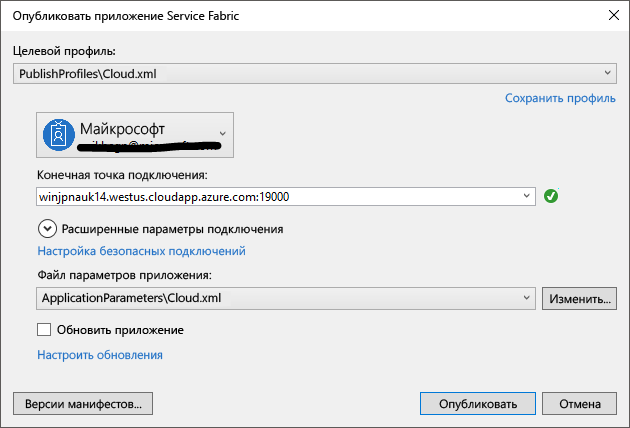

# <a name="deploy-an-application-tooa-party-cluster-in-azure"></a>Развертывание приложения tooa стороной кластер в Azure
Этот учебник входит два ряда и показано, как toodeploy tooa приложения Azure Service Fabric стороны кластер в Azure.

Во второй части учебника ряда hello, вы узнаете, как:
> [!div class="checklist"]
> * Развертывание приложения tooa удаленного кластера с помощью Visual Studio
> * Удаление приложения из кластера с помощью Service Fabric Explorer

Из этого цикла руководств вы узнаете, как выполнять такие задачи:
> [!div class="checklist"]
> * [Создание приложения .NET Service Fabric](service-fabric-tutorial-create-dotnet-app.md).
> * Развертывание кластера удаленного tooa приложения hello
> * [Настройка непрерывной интеграции и непрерывного развертывания с помощью Visual Studio Team Services](service-fabric-tutorial-deploy-app-with-cicd-vsts.md).

## <a name="prerequisites"></a>Предварительные требования
Перед началом работы с этим руководством выполните следующие действия:
- Если у вас еще нет подписки Azure, создайте [бесплатную учетную запись](https://azure.microsoft.com/free/?WT.mc_id=A261C142F).
- [Установка Visual Studio 2017 г](https://www.visualstudio.com/) и установить hello **разработки Azure** и **ASP.NET и веб-разработки** рабочих нагрузок.
- [Установите пакет Service Fabric SDK hello](service-fabric-get-started.md)

## <a name="download-hello-voting-sample-application"></a>Загрузите пример приложения hello голосование
Если вы не сборку пример приложения hello голосование в [часть одного из этого учебника ряда](service-fabric-tutorial-create-dotnet-app.md), вы можете загрузить ее. В окне командной строки запустите hello, следующая команда tooclone hello образец приложения репозитория tooyour локального компьютера.

```
git clone https://github.com/Azure-Samples/service-fabric-dotnet-quickstart
```

## <a name="set-up-a-party-cluster"></a>Настройка кластера сообщества
Кластеры, стороннего производителя, бесплатные, ограничено по времени кластеров Service Fabric размещаются в Azure и выполняются командой Service Fabric hello, где любой пользователь может развертывать приложения и Дополнительные сведения о платформе hello. Бесплатно!

tooa доступа tooget кластера стороны Обзор узла toothis: http://aka.ms/tryservicefabric и следовать hello инструкции tooget tooa кластера доступа. Вы должны Facebook или GitHub учетной записи tooget доступа tooa стороной кластера.

> [!NOTE]
> Кластеры стороннего производителя не защищены, поэтому ваши приложения и все данные, помещенные в них может быть видимым tooothers. Не используется развертывание никаких действий не требуется предоставить другим пользователям toosee. Убедиться, что tooread быть через условия использования подробности hello.

## <a name="configure-hello-listening-port"></a>Настройка hello прослушивающий порт
При создании hello VotingWeb клиентской службы Visual Studio случайным образом выбирает на порт для службы toolisten hello.  Hello службы VotingWeb выступает в качестве интерфейса для этого приложения hello и принимает внешнего трафика, так что давайте привязать, tooa службы фиксированной и хорошо знать порт. В обозревателе решений откройте файл *VotingWeb/PackageRoot/ServiceManifest.xml*.  Найти hello **конечной точки** ресурса в hello **ресурсов** и измените hello **порт** too80 значение.

```xml
<Resources>
    <Endpoints>
      <!-- This endpoint is used by hello communication listener tooobtain hello port on which too
           listen. Please note that if your service is partitioned, this port is shared with 
           replicas of different partitions that are placed in your code. -->
      <Endpoint Protocol="http" Name="ServiceEndpoint" Type="Input" Port="80" />
    </Endpoints>
  </Resources>
```

Также можно обновите значение свойства URL-адрес приложения hello в проекте голосование hello, веб-браузере откроется правильный порт toohello при отладке с помощью «F5».  В обозревателе решений выберите hello **Голосование** проекте и обновите hello **URL-адрес приложения** свойство.


## <a name="deploy-hello-app-toohello-azure"></a>Развертывание приложения hello toohello Azure
Теперь, когда приложение hello готов, его можно развернуть toohello стороной кластера прямой из Visual Studio.

1. Щелкните правой кнопкой мыши **Голосование** в hello в обозревателе решений и выберите **публикации**.

    

2. Тип в hello конечной точки подключения hello стороны кластера в hello **конечной точки подключения** поле и нажмите кнопку **публикации**.

    После публикации hello есть закончилась, должен быть доступ toosend приложении toohello запрос через браузер.

3. Откройте предпочтительный браузера и введите адрес кластера hello (hello конечной точкой соединения без сведения о порте hello - например, win1kw5649s.westus.cloudapp.azure.com).

    Теперь вы увидите hello же результат, как вы видели, когда запущено приложение hello локально.

    

## <a name="remove-hello-application-from-a-cluster-using-service-fabric-explorer"></a>Удаление приложения hello из кластера с помощью Service Fabric Explorer
Обозреватель Service Fabric является tooexplore графического пользовательского интерфейса приложений и управление ими в кластере Service Fabric.

приложение hello tooremove из hello стороны кластера:

1. Обзор toohello Service Fabric Explorer с помощью ссылки hello, предоставляемые hello стороны кластера "Регистрация". Например, http://win1kw5649s.westus.cloudapp.azure.com:19080/Explorer/index.html.

2. В Service Fabric Explorer перейдите toohello **fabric://Voting** узел в treeview hello hello левой стороны.

3. Нажмите кнопку hello **действия** кнопку в правом hello **Essentials** области и выберите **удалить приложение**. Подтвердите удаление экземпляра приложения hello, которая удаляет экземпляр hello нашей приложение, работающее в кластере hello.


## <a name="remove-hello-application-type-from-a-cluster-using-service-fabric-explorer"></a>Удаление типа приложения hello из кластера с помощью Service Fabric Explorer
Приложения развертываются как типы приложений в кластере Service Fabric, который позволяет вам toohave нескольких экземпляров и версий приложения hello, запущенного в рамках кластера hello. После удаления запущен экземпляр приложения hello, мы можем удалить тип hello, очистка hello toocomplete hello развертывания.

Дополнительные сведения о модели приложения hello в Service Fabric см. в разделе [модели приложения в Service Fabric](service-fabric-application-model.md).

1. Перейдите toohello **VotingType** узел в hello treeview.

2. Щелкните hello **действия** кнопку в правом hello **Essentials** области и выберите **наполнение типа**. Подтвердите Отмена подготовки типа приложения hello.


Это заключительный шаг учебника hello.

## <a name="next-steps"></a>Дальнейшие действия
Из этого руководства вы узнали, как выполнять такие задачи:

> [!div class="checklist"]
> * Развертывание приложения tooa удаленного кластера с помощью Visual Studio
> * Удаление приложения из кластера с помощью Service Fabric Explorer

Предварительное toohello Далее учебник.
> [!div class="nextstepaction"]
> [Настройка непрерывной интеграции с Visual Studio Team Services](service-fabric-tutorial-deploy-app-with-cicd-vsts.md)