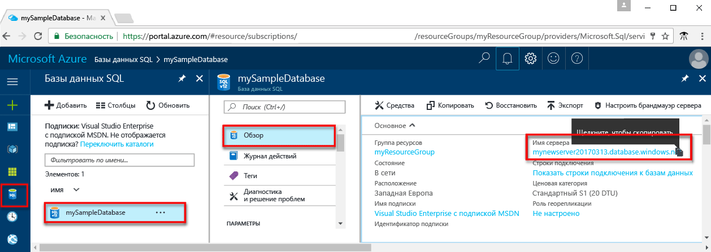
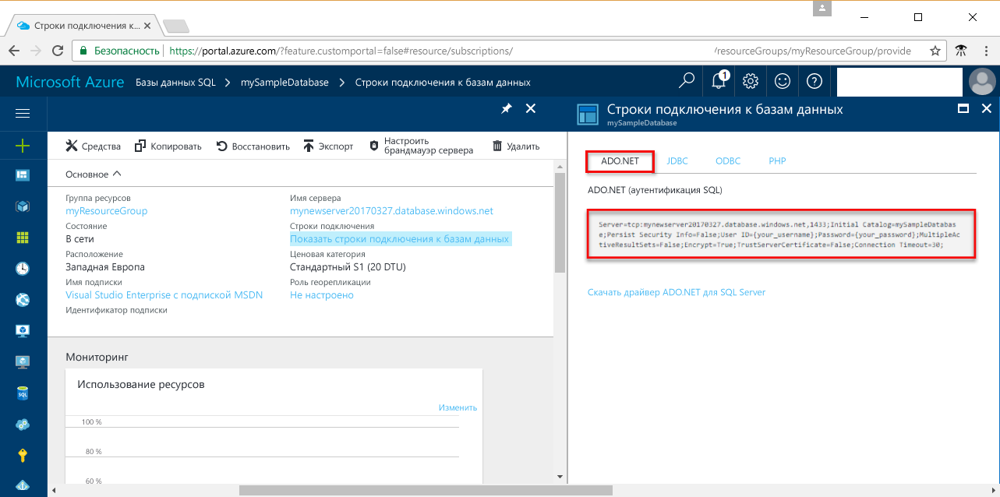

# <a name="use-net-c-with-visual-studio-tooconnect-and-query-an-azure-sql-database"></a>Использование с tooconnect Visual Studio .NET (C#) и запроса к базе данных Azure SQL

В этом учебнике быстрого запуска показано как toouse hello [.NET framework](https://www.microsoft.com/net/) toocreate C# программирования с использованием базы данных Azure SQL tooan tooconnect Visual Studio и использовать данные tooquery инструкций Transact-SQL.

## <a name="prerequisites"></a>Предварительные требования

toocomplete этом краткое руководство по началу работы, убедитесь, что у вас есть следующие hello:

- База данных SQL Azure. В этом кратком руководстве использует ресурсы hello, созданные в одном из этих краткие руководства: 

   - [Создание базы данных с помощью портала](sql-database-get-started-portal.md)
   - [Создание базы данных SQL Azure и отправка к ней запросов с помощью Azure CLI](sql-database-get-started-cli.md)
   - [Создание базы данных с помощью PowerShell](sql-database-get-started-powershell.md)

- Объект [правила брандмауэра уровня сервера](sql-database-get-started-portal.md#create-a-server-level-firewall-rule) для hello общедоступный IP-адрес компьютера hello, используйте для этого краткого руководства.
- Убедитесь, что установлен [Visual Studio Community 2017, Visual Studio Professional 2017 или Visual Studio Enterprise 2017](https://www.visualstudio.com/downloads/).

## <a name="sql-server-connection-information"></a>Сведения о подключении SQL Server

Получите базу данных Azure SQL toohello tooconnect в сведения, необходимые подключения hello. Необходимо будет hello полное имя сервера, имя базы данных и сведения об имени входа в следующих процедурах hello.

1. Войдите в toohello [портал Azure](https://portal.azure.com/).
2. Выберите **баз данных SQL** hello левом меню и выберите базу данных на hello **баз данных SQL** страницы. 
3. На hello **Обзор** страницу для базы данных, просмотрите hello полное доменное имя сервера, как показано в hello после изображения. Можно навести на toobring имя сервера hello копирование hello **щелкните toocopy** параметр. 

    

4. Если вы забыли учетные данные входа для сервера базы данных SQL Azure, перейдите toohello базы данных SQL server tooview hello server admin имя страницы. При необходимости можно сбросить пароль hello.

5. Щелкните **Показать строки подключения к базам данных**.

6. Просмотрите hello завершения **ADO.NET** строку подключения.

    

> [!IMPORTANT]
> Необходимо иметь правила брандмауэра на месте для hello общедоступный IP-адрес hello компьютера, на котором выполняется этот учебник. Если вы на другом компьютере или другой общий IP-адрес, создайте [правило брандмауэра уровня сервера с помощью портала Azure "hello"](sql-database-get-started-portal.md#create-a-server-level-firewall-rule). 
>
  
## <a name="create-a-new-visual-studio-project"></a>Создание проекта Visual Studio

1. В Visual Studio выберите **Файл**, **Создать**, **Проект**. 
2. В hello **новый проект** диалоговое окно и разверните **Visual C#**.
3. Выберите **консольного приложения** и введите *sqltest* hello имени проекта.
4. Нажмите кнопку **ОК** toocreate и Привет открыть новый проект в Visual Studio
4. В обозревателе решений щелкните правой кнопкой мыши **sqltest** и щелкните **Управление пакетами NuGet**. 
5. На hello **Обзор**, поиск ```System.Data.SqlClient``` и, если найдено, выберите его.
6. В hello **System.Data.SqlClient** щелкните **установить**.
7. По завершении установки hello просмотрите изменения hello и нажмите кнопку **ОК** tooclose hello **предварительного просмотра** окна. 
8. Если откроется окно **Прием условий лицензионного соглашения**, щелкните **Я принимаю**.

## <a name="insert-code-tooquery-sql-database"></a>Вставьте код базы данных SQL tooquery
1. Переключение слишком (или при необходимости откройте) **Program.cs**

2. Замените содержимое hello **Program.cs** с hello ниже программный код и добавить hello соответствующие значения для сервера, базы данных, пользователя и пароль.

```csharp
using System;
using System.Data.SqlClient;
using System.Text;

namespace sqltest
{
    class Program
    {
        static void Main(string[] args)
        {
            try 
            { 
                SqlConnectionStringBuilder builder = new SqlConnectionStringBuilder();
                builder.DataSource = "your_server.database.windows.net"; 
                builder.UserID = "your_user";            
                builder.Password = "your_password";     
                builder.InitialCatalog = "your_database";

                using (SqlConnection connection = new SqlConnection(builder.ConnectionString))
                {
                    Console.WriteLine("\nQuery data example:");
                    Console.WriteLine("=========================================\n");
                    
                    connection.Open();       
                    StringBuilder sb = new StringBuilder();
                    sb.Append("SELECT TOP 20 pc.Name as CategoryName, p.name as ProductName ");
                    sb.Append("FROM [SalesLT].[ProductCategory] pc ");
                    sb.Append("JOIN [SalesLT].[Product] p ");
                    sb.Append("ON pc.productcategoryid = p.productcategoryid;");
                    String sql = sb.ToString();

                    using (SqlCommand command = new SqlCommand(sql, connection))
                    {
                        using (SqlDataReader reader = command.ExecuteReader())
                        {
                            while (reader.Read())
                            {
                                Console.WriteLine("{0} {1}", reader.GetString(0), reader.GetString(1));
                            }
                        }
                    }                    
                }
            }
            catch (SqlException e)
            {
                Console.WriteLine(e.ToString());
            }
            Console.ReadLine();
        }
    }
}
```

## <a name="run-hello-code"></a>Выполнение кода hello

1. Нажмите клавишу **F5** toorun приложения hello.
2. Убедитесь, что возвращаются первые 20 строк hello и закройте окно приложения hello.

## <a name="next-steps"></a>Дальнейшие действия

- Узнайте, каким образом слишком[подключения и запроса к базе данных Azure SQL с помощью .NET core](sql-database-connect-query-dotnet-core.md) на Windows, Linux и macOS.  
- Дополнительные сведения о [начало работы с .NET Core в Windows и Linux/macOS hello командной строки](/dotnet/core/tutorials/using-with-xplat-cli).
- Узнайте, каким образом слишком[проектирование первой базы данных Azure SQL с помощью среды SSMS](sql-database-design-first-database.md) или [проектирование первой базы данных Azure SQL с помощью .NET](sql-database-design-first-database-csharp.md).
- Дополнительные сведения о .NET см. в [этой документации](https://docs.microsoft.com/dotnet/).
