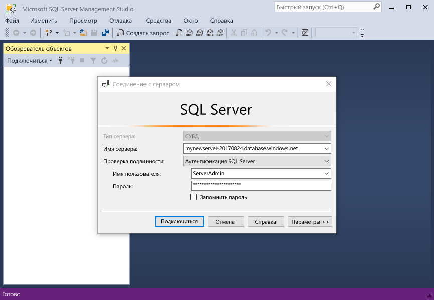
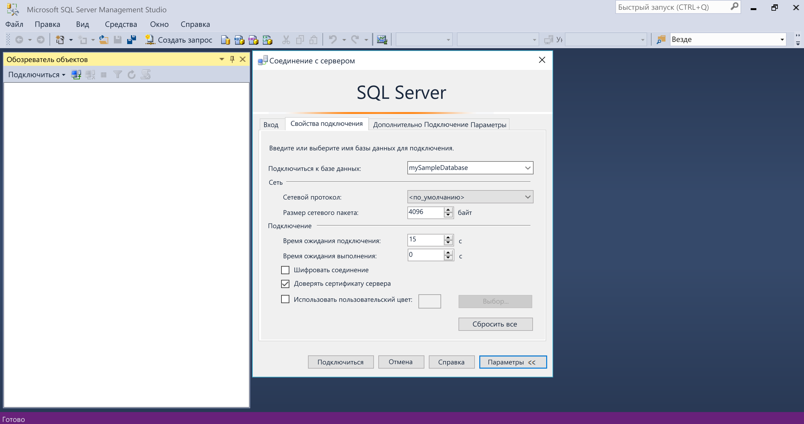
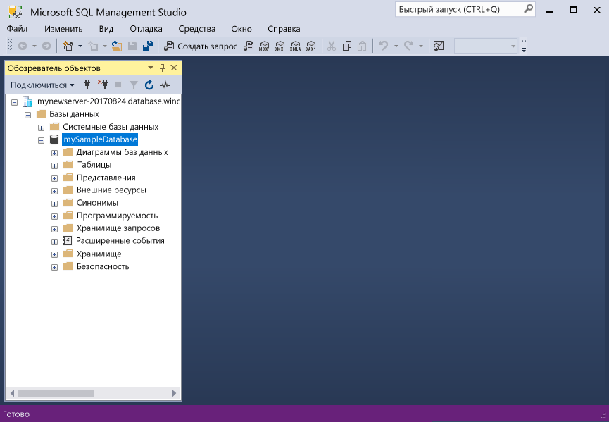
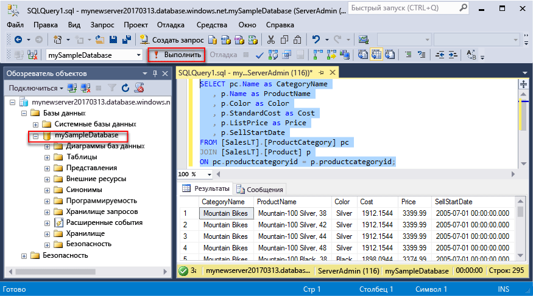
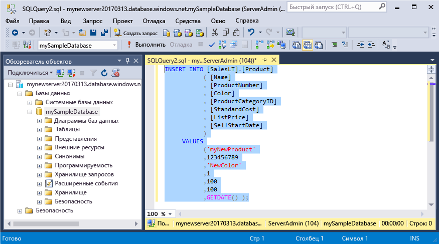
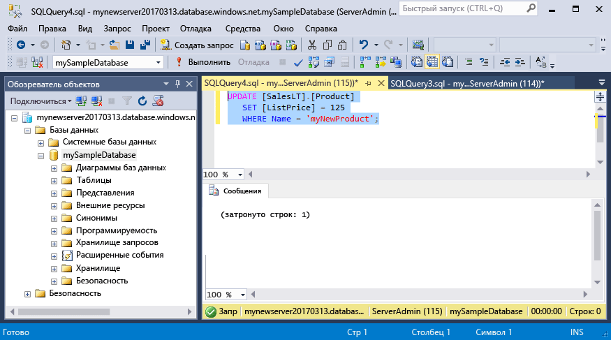
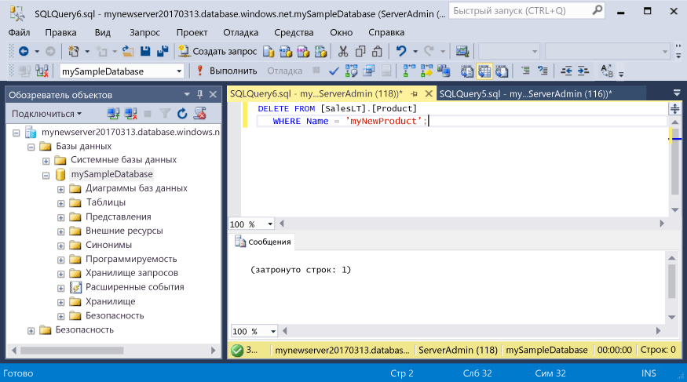

# <a name="azure-sql-database-use-sql-server-management-studio-to-connect-and-query-data"></a><span data-ttu-id="ed775-105">Подключайтесь к базе данных Azure SQL и создавайте запросы к ней с помощью SQL Server Management Studio</span><span class="sxs-lookup"><span data-stu-id="ed775-105">Azure SQL Database: Use SQL Server Management Studio to connect and query data</span></span>

<span data-ttu-id="ed775-106">[SQL Server Management Studio](https://msdn.microsoft.com/library/ms174173.aspx) (SSMS) — это интегрированная среда для управления любой инфраструктурой SQL, от SQL Server до базы данных SQL для Microsoft Windows.</span><span class="sxs-lookup"><span data-stu-id="ed775-106">[SQL Server Management Studio](https://msdn.microsoft.com/library/ms174173.aspx) (SSMS) is an integrated environment for managing any SQL infrastructure, from SQL Server to SQL Database for Microsoft Windows.</span></span> <span data-ttu-id="ed775-107">В этом кратком руководстве показано, как использовать SSMS для подключения к базе данных Azure SQL, а затем с помощью инструкций Transact-SQL выполнить запрос, вставку, обновление и удаление данных в базе данных.</span><span class="sxs-lookup"><span data-stu-id="ed775-107">This quick start demonstrates how to use SSMS to connect to an Azure SQL database, and then use Transact-SQL statements to query, insert, update, and delete data in the database.</span></span> 

## <a name="prerequisites"></a><span data-ttu-id="ed775-108">Предварительные требования</span><span class="sxs-lookup"><span data-stu-id="ed775-108">Prerequisites</span></span>

<span data-ttu-id="ed775-109">Начальной точкой в руководстве являются ресурсы, созданные в одном из этих кратких руководств:</span><span class="sxs-lookup"><span data-stu-id="ed775-109">This quick start uses as its starting point the resources created in one of these quick starts:</span></span>

- [<span data-ttu-id="ed775-110">Создание базы данных с помощью портала</span><span class="sxs-lookup"><span data-stu-id="ed775-110">Create DB - Portal</span></span>](sql-database-get-started-portal.md)
- [<span data-ttu-id="ed775-111">Создание базы данных SQL Azure и отправка к ней запросов с помощью Azure CLI</span><span class="sxs-lookup"><span data-stu-id="ed775-111">Create DB - CLI</span></span>](sql-database-get-started-cli.md)
- [<span data-ttu-id="ed775-112">Создание базы данных с помощью PowerShell</span><span class="sxs-lookup"><span data-stu-id="ed775-112">Create DB - PowerShell</span></span>](sql-database-get-started-powershell.md)

<span data-ttu-id="ed775-113">Перед началом работы установите последнюю версию [SSMS](https://msdn.microsoft.com/library/mt238290.aspx).</span><span class="sxs-lookup"><span data-stu-id="ed775-113">Before you start, make sure you have installed the newest version of [SSMS](https://msdn.microsoft.com/library/mt238290.aspx).</span></span> 

## <a name="sql-server-connection-information"></a><span data-ttu-id="ed775-114">Сведения о подключении SQL Server</span><span class="sxs-lookup"><span data-stu-id="ed775-114">SQL server connection information</span></span>

<span data-ttu-id="ed775-115">Получите сведения о подключении, необходимые для подключения к базе данных SQL Azure.</span><span class="sxs-lookup"><span data-stu-id="ed775-115">Get the connection information needed to connect to the Azure SQL database.</span></span> <span data-ttu-id="ed775-116">Вам понадобится следующее: полное имя сервера, имя базы данных и сведения для входа.</span><span class="sxs-lookup"><span data-stu-id="ed775-116">You will need the fully qualified server name, database name, and login information in the next procedures.</span></span>

1. <span data-ttu-id="ed775-117">Войдите на [портал Azure](https://portal.azure.com/).</span><span class="sxs-lookup"><span data-stu-id="ed775-117">Log in to the [Azure portal](https://portal.azure.com/).</span></span>
2. <span data-ttu-id="ed775-118">В меню слева выберите **Базы данных SQL** и на странице **Базы данных SQL** щелкните имя своей базы данных.</span><span class="sxs-lookup"><span data-stu-id="ed775-118">Select **SQL Databases** from the left-hand menu, and click your database on the **SQL databases** page.</span></span> 
3. <span data-ttu-id="ed775-119">На странице **Обзор** базы данных просмотрите полное имя сервера, как показано на рисунке ниже.</span><span class="sxs-lookup"><span data-stu-id="ed775-119">On the **Overview** page for your database, review the fully qualified server name as shown in the image below.</span></span> <span data-ttu-id="ed775-120">Вы можете навести указатель мыши на имя сервера, чтобы отобразился пункт **Щелкните, чтобы скопировать**.</span><span class="sxs-lookup"><span data-stu-id="ed775-120">You can hover over the server name to bring up the **Click to copy** option.</span></span>

    

4. <span data-ttu-id="ed775-122">Если вы забыли данные для входа на сервер базы данных SQL Azure, перейдите к соответствующей странице, чтобы просмотреть имя администратора сервера и при необходимости сбросить пароль.</span><span class="sxs-lookup"><span data-stu-id="ed775-122">If you have forgotten the login information for your Azure SQL Database server, navigate to the SQL Database server page to view the server admin name and, if necessary, reset the password.</span></span> 

## <a name="connect-to-your-database"></a><span data-ttu-id="ed775-123">Подключение к базе данных</span><span class="sxs-lookup"><span data-stu-id="ed775-123">Connect to your database</span></span>

<span data-ttu-id="ed775-124">Используйте SQL Server Management Studio для подключения к серверу базы данных SQL Azure.</span><span class="sxs-lookup"><span data-stu-id="ed775-124">Use SQL Server Management Studio to establish a connection to your Azure SQL Database server.</span></span> 

> [!IMPORTANT]
> <span data-ttu-id="ed775-125">Логический сервер базы данных SQL Azure прослушивает порт 1433.</span><span class="sxs-lookup"><span data-stu-id="ed775-125">An Azure SQL Database logical server listens on port 1433.</span></span> <span data-ttu-id="ed775-126">Чтобы подключиться к логическому серверу базы данных SQL Azure из среды, ограничиваемой корпоративным брандмауэром, этот порт должен быть открыт в брандмауэре.</span><span class="sxs-lookup"><span data-stu-id="ed775-126">If you are attempting to connect to an Azure SQL Database logical server from within a corporate firewall, this port must be open in the corporate firewall for you to successfully connect.</span></span>
>

1. <span data-ttu-id="ed775-127">Откройте среду SQL Server Management Studio.</span><span class="sxs-lookup"><span data-stu-id="ed775-127">Open SQL Server Management Studio.</span></span>

2. <span data-ttu-id="ed775-128">В диалоговом окне **Подключение к серверу** введите следующие значения.</span><span class="sxs-lookup"><span data-stu-id="ed775-128">In the **Connect to Server** dialog box, enter the following information:</span></span>

   | <span data-ttu-id="ed775-129">Настройка</span><span class="sxs-lookup"><span data-stu-id="ed775-129">Setting</span></span>       | <span data-ttu-id="ed775-130">Рекомендуемое значение</span><span class="sxs-lookup"><span data-stu-id="ed775-130">Suggested value</span></span> | <span data-ttu-id="ed775-131">Описание</span><span class="sxs-lookup"><span data-stu-id="ed775-131">Description</span></span> | 
   | ------------ | ------------------ | ------------------------------------------------- | 
   | <span data-ttu-id="ed775-132">**Тип сервера**</span><span class="sxs-lookup"><span data-stu-id="ed775-132">**Server type**</span></span> | <span data-ttu-id="ed775-133">Ядро СУБД</span><span class="sxs-lookup"><span data-stu-id="ed775-133">Database engine</span></span> | <span data-ttu-id="ed775-134">Это обязательное значение.</span><span class="sxs-lookup"><span data-stu-id="ed775-134">This value is required.</span></span> |
   | <span data-ttu-id="ed775-135">**Server name** (Имя сервера)</span><span class="sxs-lookup"><span data-stu-id="ed775-135">**Server name**</span></span> | <span data-ttu-id="ed775-136">Полное имя сервера</span><span class="sxs-lookup"><span data-stu-id="ed775-136">The fully qualified server name</span></span> | <span data-ttu-id="ed775-137">Имя должно быть примерно таким: **mynewserver20170313.database.windows.net**.</span><span class="sxs-lookup"><span data-stu-id="ed775-137">The name should be something like this: **mynewserver20170313.database.windows.net**.</span></span> |
   | <span data-ttu-id="ed775-138">**Аутентификация**</span><span class="sxs-lookup"><span data-stu-id="ed775-138">**Authentication**</span></span> | <span data-ttu-id="ed775-139">проверка подлинности SQL Server</span><span class="sxs-lookup"><span data-stu-id="ed775-139">SQL Server Authentication</span></span> | <span data-ttu-id="ed775-140">В рамках работы с этим руководством мы настроили только один тип проверки подлинности — проверку подлинности SQL.</span><span class="sxs-lookup"><span data-stu-id="ed775-140">SQL Authentication is the only authentication type that we have configured in this tutorial.</span></span> |
   | <span data-ttu-id="ed775-141">**Имя входа**</span><span class="sxs-lookup"><span data-stu-id="ed775-141">**Login**</span></span> | <span data-ttu-id="ed775-142">Учетная запись администратора сервера</span><span class="sxs-lookup"><span data-stu-id="ed775-142">The server admin account</span></span> | <span data-ttu-id="ed775-143">Это учетная запись, указанная при создании сервера.</span><span class="sxs-lookup"><span data-stu-id="ed775-143">This is the account that you specified when you created the server.</span></span> |
   | <span data-ttu-id="ed775-144">**Пароль**</span><span class="sxs-lookup"><span data-stu-id="ed775-144">**Password**</span></span> | <span data-ttu-id="ed775-145">Пароль учетной записи администратора сервера</span><span class="sxs-lookup"><span data-stu-id="ed775-145">The password for your server admin account</span></span> | <span data-ttu-id="ed775-146">Это пароль, указанный при создании сервера.</span><span class="sxs-lookup"><span data-stu-id="ed775-146">This is the password that you specified when you created the server.</span></span> |

     

3. <span data-ttu-id="ed775-148">Щелкните **Параметры** в диалоговом окне **Подключение к серверу**.</span><span class="sxs-lookup"><span data-stu-id="ed775-148">Click **Options** in the **Connect to server** dialog box.</span></span> <span data-ttu-id="ed775-149">В разделе **Подключение к базе данных** введите **mySampleDatabase**, чтобы подключиться к этой базе данных.</span><span class="sxs-lookup"><span data-stu-id="ed775-149">In the **Connect to database** section, enter **mySampleDatabase** to connect to this database.</span></span>

     

4. <span data-ttu-id="ed775-151">Щелкните **Подключить**.</span><span class="sxs-lookup"><span data-stu-id="ed775-151">Click **Connect**.</span></span> <span data-ttu-id="ed775-152">Откроется окно обозревателя объектов в SSMS.</span><span class="sxs-lookup"><span data-stu-id="ed775-152">The Object Explorer window opens in SSMS.</span></span> 

     

5. <span data-ttu-id="ed775-154">В обозревателе объектов разверните **базы данных**, затем выберите **mySampleDatabase**, чтобы просмотреть объекты в образце базы данных.</span><span class="sxs-lookup"><span data-stu-id="ed775-154">In Object Explorer, expand **Databases** and then expand **mySampleDatabase** to view the objects in the sample database.</span></span>

## <a name="query-data"></a><span data-ttu-id="ed775-155">Запрос данных</span><span class="sxs-lookup"><span data-stu-id="ed775-155">Query data</span></span>

<span data-ttu-id="ed775-156">Используйте следующий код, чтобы запросить 20 основных продуктов из категории с помощью инструкции [SELECT](https://msdn.microsoft.com/library/ms189499.aspx) Transact-SQL.</span><span class="sxs-lookup"><span data-stu-id="ed775-156">Use the following code to query for the top 20 products by category using the [SELECT](https://msdn.microsoft.com/library/ms189499.aspx) Transact-SQL statement.</span></span>

1. <span data-ttu-id="ed775-157">В обозревателе объектов щелкните правой кнопкой мыши **mySampleDatabase** и выберите пункт **Новый запрос**.</span><span class="sxs-lookup"><span data-stu-id="ed775-157">In Object Explorer, right-click **mySampleDatabase** and click **New Query**.</span></span> <span data-ttu-id="ed775-158">Откроется пустое окно запроса, подключенное к базе данных.</span><span class="sxs-lookup"><span data-stu-id="ed775-158">A blank query window opens that is connected to your database.</span></span>
2. <span data-ttu-id="ed775-159">В окне запроса введите следующее:</span><span class="sxs-lookup"><span data-stu-id="ed775-159">In the query window, enter the following query:</span></span>

   ```sql
   SELECT pc.Name as CategoryName, p.name as ProductName
   FROM [SalesLT].[ProductCategory] pc
   JOIN [SalesLT].[Product] p
   ON pc.productcategoryid = p.productcategoryid;
   ```

3. <span data-ttu-id="ed775-160">На панели инструментов щелкните **Выполнить**, чтобы получить данные из таблиц Product и ProductCategory.</span><span class="sxs-lookup"><span data-stu-id="ed775-160">On the toolbar, click **Execute** to retrieve data from the Product and ProductCategory tables.</span></span>

    

## <a name="insert-data"></a><span data-ttu-id="ed775-162">Добавление данных</span><span class="sxs-lookup"><span data-stu-id="ed775-162">Insert data</span></span>

<span data-ttu-id="ed775-163">Используйте указанный ниже код, чтобы вставить новый продукт в таблицу SalesLT.Product с помощью инструкции [INSERT](https://msdn.microsoft.com/library/ms174335.aspx) Transact-SQL.</span><span class="sxs-lookup"><span data-stu-id="ed775-163">Use the following code to insert a new product into the SalesLT.Product table using the [INSERT](https://msdn.microsoft.com/library/ms174335.aspx) Transact-SQL statement.</span></span>

1. <span data-ttu-id="ed775-164">В окне запроса замените предыдущий запрос следующим содержимым:</span><span class="sxs-lookup"><span data-stu-id="ed775-164">In the query window, replace the previous query with the following query:</span></span>

   ```sql
   INSERT INTO [SalesLT].[Product]
           ( [Name]
           , [ProductNumber]
           , [Color]
           , [ProductCategoryID]
           , [StandardCost]
           , [ListPrice]
           , [SellStartDate]
           )
     VALUES
           ('myNewProduct'
           ,123456789
           ,'NewColor'
           ,1
           ,100
           ,100
           ,GETDATE() );
   ```

2. <span data-ttu-id="ed775-165">На панели инструментов щелкните **Выполнить**, чтобы вставить новую строку в таблице Product.</span><span class="sxs-lookup"><span data-stu-id="ed775-165">On the toolbar, click **Execute**  to insert a new row in the Product table.</span></span>

    

## <a name="update-data"></a><span data-ttu-id="ed775-166">Обновление данных</span><span class="sxs-lookup"><span data-stu-id="ed775-166">Update data</span></span>

<span data-ttu-id="ed775-167">Используйте следующий код, чтобы обновить новый продукт, добавленный ранее, с помощью инструкции [UPDATE](https://msdn.microsoft.com/library/ms177523.aspx) Transact-SQL.</span><span class="sxs-lookup"><span data-stu-id="ed775-167">Use the following code to update the new product that you previously added using the [UPDATE](https://msdn.microsoft.com/library/ms177523.aspx) Transact-SQL statement.</span></span>

1. <span data-ttu-id="ed775-168">В окне запроса замените предыдущий запрос следующим содержимым:</span><span class="sxs-lookup"><span data-stu-id="ed775-168">In the query window, replace the previous query with the following query:</span></span>

   ```sql
   UPDATE [SalesLT].[Product]
   SET [ListPrice] = 125
   WHERE Name = 'myNewProduct';
   ```

2. <span data-ttu-id="ed775-169">На панели инструментов щелкните **Выполнить**, чтобы обновить указанную строку в таблице Product.</span><span class="sxs-lookup"><span data-stu-id="ed775-169">On the toolbar, click **Execute** to update the specified row in the Product table.</span></span>

    

## <a name="delete-data"></a><span data-ttu-id="ed775-170">Удаление данных</span><span class="sxs-lookup"><span data-stu-id="ed775-170">Delete data</span></span>

<span data-ttu-id="ed775-171">Используйте следующий код, чтобы удалить новый продукт, добавленный ранее, с помощью инструкции [DELETE](https://msdn.microsoft.com/library/ms189835.aspx) Transact-SQL.</span><span class="sxs-lookup"><span data-stu-id="ed775-171">Use the following code to delete the new product that you previously added using the [DELETE](https://msdn.microsoft.com/library/ms189835.aspx) Transact-SQL statement.</span></span>

1. <span data-ttu-id="ed775-172">В окне запроса замените предыдущий запрос следующим содержимым:</span><span class="sxs-lookup"><span data-stu-id="ed775-172">In the query window, replace the previous query with the following query:</span></span>

   ```sql
   DELETE FROM [SalesLT].[Product]
   WHERE Name = 'myNewProduct';
   ```

2. <span data-ttu-id="ed775-173">На панели инструментов щелкните **Выполнить**, чтобы удалить указанную строку из таблицы Product.</span><span class="sxs-lookup"><span data-stu-id="ed775-173">On the toolbar, click **Execute** to delete the specified row in the Product table.</span></span>

    

## <a name="next-steps"></a><span data-ttu-id="ed775-174">Дальнейшие действия</span><span class="sxs-lookup"><span data-stu-id="ed775-174">Next steps</span></span>

- <span data-ttu-id="ed775-175">См. дополнительные сведения о [создании и администрировании серверов и баз данных с помощью Transact-SQL](sql-database-servers-databases.md).</span><span class="sxs-lookup"><span data-stu-id="ed775-175">To learn about creating and managing servers and databases with Transact-SQL, see [Learn about Azure SQL Database servers and databases](sql-database-servers-databases.md).</span></span>
- <span data-ttu-id="ed775-176">Дополнительные сведения о решении SSMS см. в статье об [использовании SQL Server Management Studio](https://msdn.microsoft.com/library/ms174173.aspx).</span><span class="sxs-lookup"><span data-stu-id="ed775-176">For information about SSMS, see [Use SQL Server Management Studio](https://msdn.microsoft.com/library/ms174173.aspx).</span></span>
- <span data-ttu-id="ed775-177">См. дополнительные сведения о [подключении и создании запросов с помощью Visual Studio Code](sql-database-connect-query-vscode.md).</span><span class="sxs-lookup"><span data-stu-id="ed775-177">To connect and query using Visual Studio Code, see [Connect and query with Visual Studio Code](sql-database-connect-query-vscode.md).</span></span>
- <span data-ttu-id="ed775-178">См. дополнительные сведения о [подключении и создании запросов с помощью .NET](sql-database-connect-query-dotnet.md).</span><span class="sxs-lookup"><span data-stu-id="ed775-178">To connect and query using .NET, see [Connect and query with .NET](sql-database-connect-query-dotnet.md).</span></span>
- <span data-ttu-id="ed775-179">См. дополнительные сведения о [подключении и создании запросов с помощью PHP](sql-database-connect-query-php.md).</span><span class="sxs-lookup"><span data-stu-id="ed775-179">To connect and query using PHP, see [Connect and query with PHP](sql-database-connect-query-php.md).</span></span>
- <span data-ttu-id="ed775-180">См. дополнительные сведения о [подключении и создании запросов с помощью Node.js](sql-database-connect-query-nodejs.md).</span><span class="sxs-lookup"><span data-stu-id="ed775-180">To connect and query using Node.js, see [Connect and query with Node.js](sql-database-connect-query-nodejs.md).</span></span>
- <span data-ttu-id="ed775-181">См. дополнительные сведения о [подключении и создании запросов с помощью Java](sql-database-connect-query-java.md).</span><span class="sxs-lookup"><span data-stu-id="ed775-181">To connect and query using Java, see [Connect and query with Java](sql-database-connect-query-java.md).</span></span>
- <span data-ttu-id="ed775-182">См. дополнительные сведения о [подключении и создании запросов с помощью Python](sql-database-connect-query-python.md).</span><span class="sxs-lookup"><span data-stu-id="ed775-182">To connect and query using Python, see [Connect and query with Python](sql-database-connect-query-python.md).</span></span>
- <span data-ttu-id="ed775-183">См. дополнительные сведения о [подключении и создании запросов с помощью Ruby](sql-database-connect-query-ruby.md).</span><span class="sxs-lookup"><span data-stu-id="ed775-183">To connect and query using Ruby, see [Connect and query with Ruby](sql-database-connect-query-ruby.md).</span></span>
