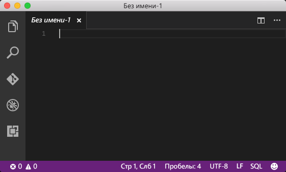
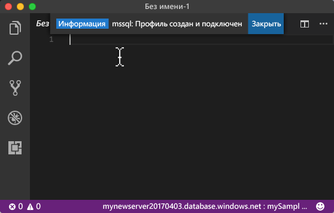
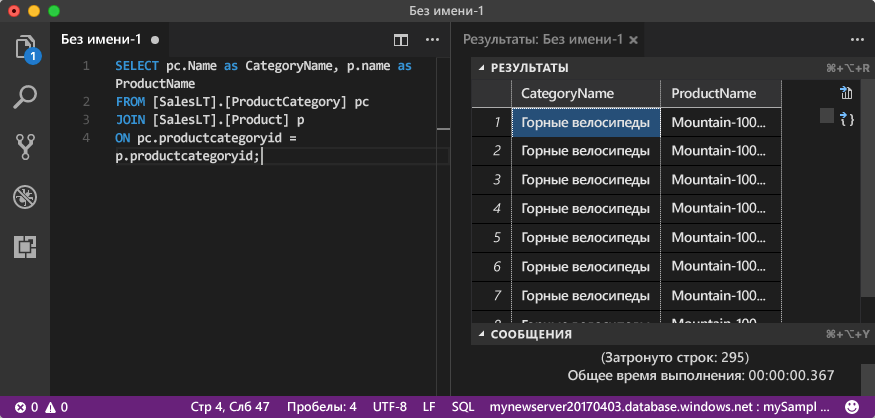

# <a name="azure-sql-database-use-visual-studio-code-tooconnect-and-query-data"></a>База данных SQL Azure: Использование Visual Studio Code tooconnect и запроса данных

[Код Visual Studio](https://code.visualstudio.com/docs) — это код графический редактор для Linux, macOS, и Windows, которые поддерживает расширения, включая hello [mssql расширения](https://aka.ms/mssql-marketplace) для выполнения запросов Microsoft SQL Server, базы данных SQL Azure и хранилище данных SQL. В этом кратком руководстве показано, как базы данных Azure SQL tooan tooconnect toouse кода Visual Studio, а затем tooquery инструкций используйте Transact-SQL, вставки, обновления и удаления данных в базе данных hello.

## <a name="prerequisites"></a>Предварительные требования

В этом кратком руководстве в качестве отправной точки ресурсов hello создана в одном из этих краткие используется:

- [Создание базы данных с помощью портала](sql-database-get-started-portal.md)
- [Создание базы данных SQL Azure и отправка к ней запросов с помощью Azure CLI](sql-database-get-started-cli.md)
- [Создание базы данных с помощью PowerShell](sql-database-get-started-powershell.md)

Прежде чем начать, убедитесь, что установлен hello новейшую версию [кода Visual Studio](https://code.visualstudio.com/Download) и загружаются hello [mssql расширение](https://aka.ms/mssql-marketplace). Руководство по установке для расширения mssql hello, в разделе [установки VS Code](https://docs.microsoft.com/sql/linux/sql-server-linux-develop-use-vscode#install-vs-code) и в разделе [mssql для Visual Studio Code](https://marketplace.visualstudio.com/items?itemName=ms-mssql.mssql). 

## <a name="configure-vs-code"></a>Настройка кода VS 

### <a name="mac-os"></a>**Mac OS**
MacOS необходимо tooinstall OpenSSL, являющийся необходимого компонента для DotNet Core этого расширения mssql использует. Откройте терминала и введите следующие команды tooinstall hello **brew** и **OpenSSL**. 

```bash
ruby -e "$(curl -fsSL https://raw.githubusercontent.com/Homebrew/install/master/install)"
brew update
brew install openssl
mkdir -p /usr/local/lib
ln -s /usr/local/opt/openssl/lib/libcrypto.1.0.0.dylib /usr/local/lib/
ln -s /usr/local/opt/openssl/lib/libssl.1.0.0.dylib /usr/local/lib/
```

### <a name="linux-ubuntu"></a>**Linux (Ubuntu)**

Специальная настройка не требуется.

### <a name="windows"></a>**Windows**

Специальная настройка не требуется.

## <a name="sql-server-connection-information"></a>Сведения о подключении SQL Server

Получите базу данных Azure SQL toohello tooconnect в сведения, необходимые подключения hello. Необходимо будет hello полное имя сервера, имя базы данных и сведения об имени входа в следующих процедурах hello.

1. Войдите в toohello [портал Azure](https://portal.azure.com/).
2. Выберите **баз данных SQL** hello левом меню и выберите базу данных на hello **баз данных SQL** страницы. 
3. На hello **Обзор** страницу для базы данных, просмотрите hello полное доменное имя сервера, как показано в hello после изображения. Можно навести на toobring имя сервера hello копирование hello **щелкните toocopy** параметр.

    

4. Если вы забыли hello учетные данные для сервера базы данных SQL Azure, перейдите toohello базы данных SQL server страницы tooview hello server с именем admin и, при необходимости сбросить пароль hello. 

## <a name="set-language-mode-toosql"></a>Режим tooSQL набор языка

Набор hello языка режим слишком**SQL** в командах mssql tooenable кода Visual Studio и T-SQL IntelliSense.

1. Откройте новое окно Visual Studio Code. 

2. Нажмите кнопку **обычный текст** в нижнем правом углу hello hello строки состояния.
3. В hello **режим выбора языка** раскрывающееся меню, которое открывается, тип **SQL**и нажмите клавишу **ввод** tooset hello языка режим tooSQL. 

   

## <a name="connect-tooyour-database"></a>Подключение базы данных tooyour

С помощью Visual Studio Code tooestablish сервером базы данных SQL Azure tooyour соединения.

> [!IMPORTANT]
> Прежде чем продолжить, приготовьте сервер, базу данных и учетные данные. После началом ввода данных профиля подключения hello, при изменении фокуса ввода из кода Visual Studio, вы сможете toorestart Создание профиля подключения hello.
>

1. В VS Code нажмите **CTRL + SHIFT + P** (или **F1**) tooopen hello палитры команд.

2. Введите **sqlcon** и нажмите клавишу **ВВОД**.

3. Нажмите клавишу **ввод** tooselect **создать профиль подключения**. Для экземпляра SQL Server будет создан профиль подключения.

4. Соблюдают hello приглашения toospecify hello подключения для нового профиля подключения hello. После ввода каждого значения, нажмите клавишу **ввод** toocontinue. 

   | Настройка       | Рекомендуемое значение | Описание |
   | ------------ | ------------------ | ------------------------------------------------- | 
   | **Имя сервера | Hello полное имя сервера | Hello имя должно быть примерно следующим образом: **mynewserver20170313.database.windows.net**. |
   | **Database name** (Имя базы данных) | mySampleDatabase | Имя Hello tooconnect toowhich hello базы данных. |
   | **Аутентификация** | Имя для входа в SQL| Проверка подлинности SQL — тип hello только проверку подлинности, который мы указали в этом учебнике. |
   | **Имя пользователя** | Учетная запись администратора сервера Hello | Это учетная запись hello, указанный при создании сервера hello. |
   | **Password (SQL Login)** (Пароль для входа в SQL) | Hello пароль для учетной записи администратора сервера | Это hello пароль, указанный при создании сервера hello. |
   | **Save Password?** (Сохранить пароль?) | "Да" или "Нет" | Если не требуется пароль hello tooenter каждый раз, нажмите кнопку "Да". |
   | **Укажите имя для этого профиля** | Имя профиля, например **mySampleDatabase**. | Сохраненное имя профиля повышает скорость подключения при последующих входах. | 

5. Нажмите клавишу hello **ESC** ключа tooclose hello информационное сообщение, информирующее о том, что профиль hello создается и подключены.

6. Проверки подключения в строке состояния hello.

   

## <a name="query-data"></a>Запрос данных

Используйте hello следующий код tooquery для hello 20 основных продуктов по категориям, используя hello [ВЫБЕРИТЕ](https://msdn.microsoft.com/library/ms189499.aspx) инструкции Transact-SQL.

1. В hello **редактор** окне приветствия при следующем запросе в hello пустое окно запроса введите:

   ```sql
   SELECT pc.Name as CategoryName, p.name as ProductName
   FROM [SalesLT].[ProductCategory] pc
   JOIN [SalesLT].[Product] p
   ON pc.productcategoryid = p.productcategoryid;
   ```

2. Нажмите клавишу **CTRL + SHIFT + E** tooretrieve данные из таблицы Product и ProductCategory hello.

    

## <a name="insert-data"></a>Добавление данных

Используйте следующие hello кода tooinsert новый продукт SalesLT.Product таблицу hello hello [вставить](https://msdn.microsoft.com/library/ms174335.aspx) инструкции Transact-SQL.

1. В hello **редактор** , удалите предыдущий запрос hello и введите приветствия при следующем запросе:

   ```sql
   INSERT INTO [SalesLT].[Product]
           ( [Name]
           , [ProductNumber]
           , [Color]
           , [ProductCategoryID]
           , [StandardCost]
           , [ListPrice]
           , [SellStartDate]
           )
     VALUES
           ('myNewProduct'
           ,123456789
           ,'NewColor'
           ,1
           ,100
           ,100
           ,GETDATE() );
   ```

2. Нажмите клавишу **CTRL + SHIFT + E** tooinsert новую строку в таблице Product hello.

## <a name="update-data"></a>Обновление данных

Используйте hello следующий код tooupdate hello новым продуктом, добавленный ранее с помощью hello [обновление](https://msdn.microsoft.com/library/ms177523.aspx) инструкции Transact-SQL.

1.  В hello **редактор** , удалите предыдущий запрос hello и введите приветствия при следующем запросе:

   ```sql
   UPDATE [SalesLT].[Product]
   SET [ListPrice] = 125
   WHERE Name = 'myNewProduct';
   ```

2. Нажмите клавишу **CTRL + SHIFT + E** tooupdate hello указанной строки в таблице Product hello.

## <a name="delete-data"></a>Удаление данных

Используйте hello следующий код toodelete hello новым продуктом, добавленный ранее с помощью hello [удалить](https://msdn.microsoft.com/library/ms189835.aspx) инструкции Transact-SQL.

1. В hello **редактор** , удалите предыдущий запрос hello и введите приветствия при следующем запросе:

   ```sql
   DELETE FROM [SalesLT].[Product]
   WHERE Name = 'myNewProduct';
   ```

2. Нажмите клавишу **CTRL + SHIFT + E** toodelete hello указанной строки в таблице Product hello.

## <a name="next-steps"></a>Дальнейшие действия

- tooconnect и запрос с помощью SQL Server Management Studio, в разделе [подключение и запрос с помощью SSMS](sql-database-connect-query-ssms.md).
- Статью из журнала MSDN, посвященную использованию кода Visual Studio, можно просмотреть в записи блога о [создании базы данных IDE с помощью расширения MSSQL](https://msdn.microsoft.com/magazine/mt809115).
