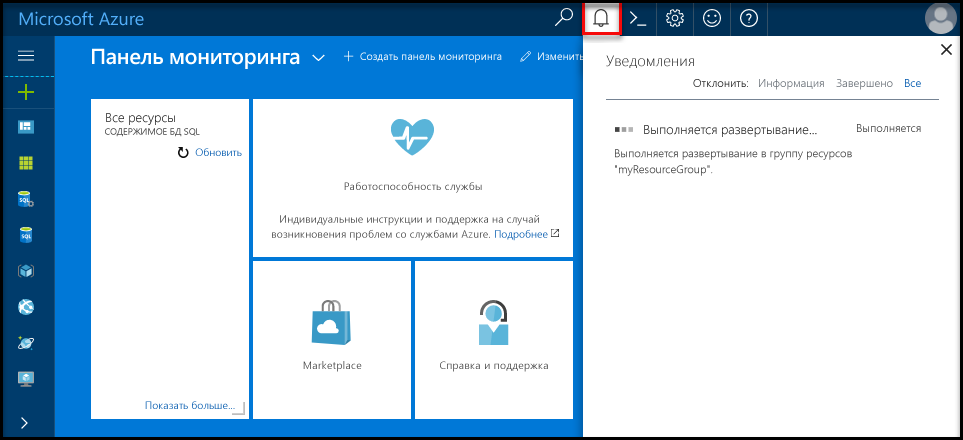
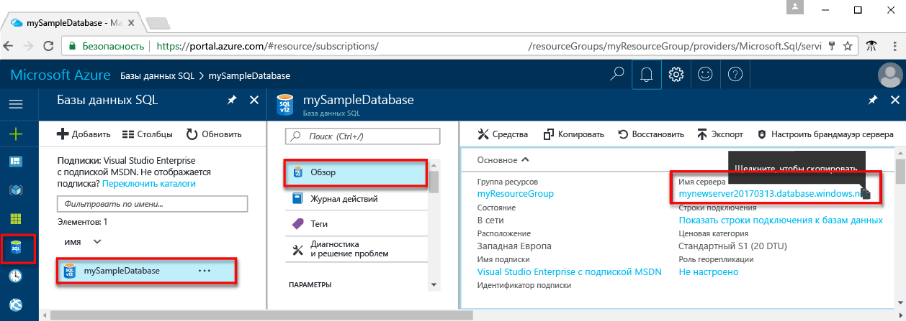

# <a name="design-your-first-azure-sql-database"></a><span data-ttu-id="f05e9-103">Проектирование первой базы данных SQL Azure</span><span class="sxs-lookup"><span data-stu-id="f05e9-103">Design your first Azure SQL database</span></span>

<span data-ttu-id="f05e9-104">База данных SQL Azure — это реляционной базы данных как a служба (DBaaS) в hello облака Майкрософт («Azure»).</span><span class="sxs-lookup"><span data-stu-id="f05e9-104">Azure SQL Database is a relational database-as-a service (DBaaS) in hello Microsoft Cloud ("Azure").</span></span> <span data-ttu-id="f05e9-105">В этом учебнике вы узнаете, как toouse hello портал Azure и [SQL Server Management Studio](https://msdn.microsoft.com/library/ms174173.aspx) (SSMS) для:</span><span class="sxs-lookup"><span data-stu-id="f05e9-105">In this tutorial, you learn how toouse hello Azure portal and [SQL Server Management Studio](https://msdn.microsoft.com/library/ms174173.aspx) (SSMS) to:</span></span> 

> [!div class="checklist"]
> * <span data-ttu-id="f05e9-106">Создание базы данных в hello портал Azure</span><span class="sxs-lookup"><span data-stu-id="f05e9-106">Create a database in hello Azure portal</span></span>
> * <span data-ttu-id="f05e9-107">Настройка правила брандмауэра уровня сервера в hello портал Azure</span><span class="sxs-lookup"><span data-stu-id="f05e9-107">Set up a server-level firewall rule in hello Azure portal</span></span>
> * <span data-ttu-id="f05e9-108">Подключитесь к SSMS toohello базы данных</span><span class="sxs-lookup"><span data-stu-id="f05e9-108">Connect toohello database with SSMS</span></span>
> * <span data-ttu-id="f05e9-109">создать таблицы с помощью SSMS;</span><span class="sxs-lookup"><span data-stu-id="f05e9-109">Create tables with SSMS</span></span>
> * <span data-ttu-id="f05e9-110">выполнить массовую загрузку данных с помощью BCP;</span><span class="sxs-lookup"><span data-stu-id="f05e9-110">Bulk load data with BCP</span></span>
> * <span data-ttu-id="f05e9-111">запросить эти данные с помощью SSMS;</span><span class="sxs-lookup"><span data-stu-id="f05e9-111">Query that data with SSMS</span></span>
> * <span data-ttu-id="f05e9-112">Восстановление предыдущих tooa базы данных hello [на момент времени восстановления](sql-database-recovery-using-backups.md#point-in-time-restore) в hello портал Azure</span><span class="sxs-lookup"><span data-stu-id="f05e9-112">Restore hello database tooa previous [point in time restore](sql-database-recovery-using-backups.md#point-in-time-restore) in hello Azure portal</span></span>

<span data-ttu-id="f05e9-113">Если у вас еще нет подписки Azure, [создайте бесплатную учетную запись Azure](https://azure.microsoft.com/free/), прежде чем начинать работу.</span><span class="sxs-lookup"><span data-stu-id="f05e9-113">If you don't have an Azure subscription, [create a free account](https://azure.microsoft.com/free/) before you begin.</span></span>

## <a name="prerequisites"></a><span data-ttu-id="f05e9-114">Предварительные требования</span><span class="sxs-lookup"><span data-stu-id="f05e9-114">Prerequisites</span></span>

<span data-ttu-id="f05e9-115">toocomplete этого учебника, проверьте правильность установки:</span><span class="sxs-lookup"><span data-stu-id="f05e9-115">toocomplete this tutorial, make sure you have installed:</span></span>
- <span data-ttu-id="f05e9-116">Hello новейшую версию [SQL Server Management Studio](https://msdn.microsoft.com/library/ms174173.aspx) (SSMS).</span><span class="sxs-lookup"><span data-stu-id="f05e9-116">hello newest version of [SQL Server Management Studio](https://msdn.microsoft.com/library/ms174173.aspx) (SSMS).</span></span>
- <span data-ttu-id="f05e9-117">Hello новейшую версию [BCP и SQLCMD](https://www.microsoft.com/download/details.aspx?id=36433).</span><span class="sxs-lookup"><span data-stu-id="f05e9-117">hello newest version of [BCP and SQLCMD](https://www.microsoft.com/download/details.aspx?id=36433).</span></span>

## <a name="log-in-toohello-azure-portal"></a><span data-ttu-id="f05e9-118">Войдите в toohello портал Azure</span><span class="sxs-lookup"><span data-stu-id="f05e9-118">Log in toohello Azure portal</span></span>

<span data-ttu-id="f05e9-119">Войдите в toohello [портал Azure](https://portal.azure.com/).</span><span class="sxs-lookup"><span data-stu-id="f05e9-119">Log in toohello [Azure portal](https://portal.azure.com/).</span></span>

## <a name="create-a-blank-sql-database"></a><span data-ttu-id="f05e9-120">Создание пустой базы данных SQL</span><span class="sxs-lookup"><span data-stu-id="f05e9-120">Create a blank SQL database</span></span>

<span data-ttu-id="f05e9-121">База данных Azure SQL создается с определенным набором [вычислительных ресурсов и ресурсов хранения](sql-database-service-tiers.md).</span><span class="sxs-lookup"><span data-stu-id="f05e9-121">An Azure SQL database is created with a defined set of [compute and storage resources](sql-database-service-tiers.md).</span></span> <span data-ttu-id="f05e9-122">Hello база данных создается в пределах [группы ресурсов Azure](../azure-resource-manager/resource-group-overview.md) и [логический сервер базы данных SQL Azure](sql-database-features.md).</span><span class="sxs-lookup"><span data-stu-id="f05e9-122">hello database is created within an [Azure resource group](../azure-resource-manager/resource-group-overview.md) and in an [Azure SQL Database logical server](sql-database-features.md).</span></span> 

<span data-ttu-id="f05e9-123">Выполните эти шаги toocreate пустую базу данных SQL.</span><span class="sxs-lookup"><span data-stu-id="f05e9-123">Follow these steps toocreate a blank SQL database.</span></span> 

1. <span data-ttu-id="f05e9-124">Нажмите кнопку hello **New** кнопка найдена в верхнем левом углу hello hello портал Azure.</span><span class="sxs-lookup"><span data-stu-id="f05e9-124">Click hello **New** button found on hello upper left-hand corner of hello Azure portal.</span></span>

2. <span data-ttu-id="f05e9-125">Выберите **баз данных** из hello **New** и выберите **базы данных SQL** из hello **баз данных** страницы.</span><span class="sxs-lookup"><span data-stu-id="f05e9-125">Select **Databases** from hello **New** page, and select **SQL Database** from hello **Databases** page.</span></span> 

   

3. <span data-ttu-id="f05e9-127">Заполнение hello базы данных SQL формы с hello следующую информацию, как показано на hello предшествующий образа:</span><span class="sxs-lookup"><span data-stu-id="f05e9-127">Fill out hello SQL Database form with hello following information, as shown on hello preceding image:</span></span>   

   | <span data-ttu-id="f05e9-128">Настройка</span><span class="sxs-lookup"><span data-stu-id="f05e9-128">Setting</span></span>       | <span data-ttu-id="f05e9-129">Рекомендуемое значение</span><span class="sxs-lookup"><span data-stu-id="f05e9-129">Suggested value</span></span> | <span data-ttu-id="f05e9-130">Описание</span><span class="sxs-lookup"><span data-stu-id="f05e9-130">Description</span></span> | 
   | ------------ | ------------------ | ------------------------------------------------- | 
   | <span data-ttu-id="f05e9-131">**Database name** (Имя базы данных)</span><span class="sxs-lookup"><span data-stu-id="f05e9-131">**Database name**</span></span> | <span data-ttu-id="f05e9-132">mySampleDatabase</span><span class="sxs-lookup"><span data-stu-id="f05e9-132">mySampleDatabase</span></span> | <span data-ttu-id="f05e9-133">Допустимые имена баз данных см. в статье об [идентификаторах базы данных](https://docs.microsoft.com/sql/relational-databases/databases/database-identifiers).</span><span class="sxs-lookup"><span data-stu-id="f05e9-133">For valid database names, see [Database Identifiers](https://docs.microsoft.com/sql/relational-databases/databases/database-identifiers).</span></span> | 
   | <span data-ttu-id="f05e9-134">**Подписка**</span><span class="sxs-lookup"><span data-stu-id="f05e9-134">**Subscription**</span></span> | <span data-ttu-id="f05e9-135">Ваша подписка</span><span class="sxs-lookup"><span data-stu-id="f05e9-135">Your subscription</span></span>  | <span data-ttu-id="f05e9-136">Дополнительные сведения о подписках см. [здесь](https://account.windowsazure.com/Subscriptions).</span><span class="sxs-lookup"><span data-stu-id="f05e9-136">For details about your subscriptions, see [Subscriptions](https://account.windowsazure.com/Subscriptions).</span></span> |
   | <span data-ttu-id="f05e9-137">**Группа ресурсов**</span><span class="sxs-lookup"><span data-stu-id="f05e9-137">**Resource group**</span></span> | <span data-ttu-id="f05e9-138">myResourceGroup</span><span class="sxs-lookup"><span data-stu-id="f05e9-138">myResourceGroup</span></span> | <span data-ttu-id="f05e9-139">Допустимые имена групп ресурсов см. в статье о [правилах и ограничениях именования](https://docs.microsoft.com/azure/architecture/best-practices/naming-conventions).</span><span class="sxs-lookup"><span data-stu-id="f05e9-139">For valid resource group names, see [Naming rules and restrictions](https://docs.microsoft.com/azure/architecture/best-practices/naming-conventions).</span></span> |
   | <span data-ttu-id="f05e9-140">**Выбрать источник**</span><span class="sxs-lookup"><span data-stu-id="f05e9-140">**Select source**</span></span> | <span data-ttu-id="f05e9-141">Пустая база данных</span><span class="sxs-lookup"><span data-stu-id="f05e9-141">Blank database</span></span> | <span data-ttu-id="f05e9-142">Указывает, что должна быть создана пустая база данных.</span><span class="sxs-lookup"><span data-stu-id="f05e9-142">Specifies that a blank database should be created.</span></span> |

4. <span data-ttu-id="f05e9-143">Нажмите кнопку **сервера** toocreate и настроить новый сервер для новой базы данных.</span><span class="sxs-lookup"><span data-stu-id="f05e9-143">Click **Server** toocreate and configure a new server for your new database.</span></span> <span data-ttu-id="f05e9-144">Заполните hello **новую форму сервера** с hello следующую информацию:</span><span class="sxs-lookup"><span data-stu-id="f05e9-144">Fill out hello **New server form** with hello following information:</span></span> 

   | <span data-ttu-id="f05e9-145">Настройка</span><span class="sxs-lookup"><span data-stu-id="f05e9-145">Setting</span></span>       | <span data-ttu-id="f05e9-146">Рекомендуемое значение</span><span class="sxs-lookup"><span data-stu-id="f05e9-146">Suggested value</span></span> | <span data-ttu-id="f05e9-147">Описание</span><span class="sxs-lookup"><span data-stu-id="f05e9-147">Description</span></span> | 
   | ------------ | ------------------ | ------------------------------------------------- | 
   | <span data-ttu-id="f05e9-148">**Server name** (Имя сервера)</span><span class="sxs-lookup"><span data-stu-id="f05e9-148">**Server name**</span></span> | <span data-ttu-id="f05e9-149">Любое глобально уникальное имя</span><span class="sxs-lookup"><span data-stu-id="f05e9-149">Any globally unique name</span></span> | <span data-ttu-id="f05e9-150">Допустимые имена серверов см. в статье о [правилах и ограничениях именования](https://docs.microsoft.com/azure/architecture/best-practices/naming-conventions).</span><span class="sxs-lookup"><span data-stu-id="f05e9-150">For valid server names, see [Naming rules and restrictions](https://docs.microsoft.com/azure/architecture/best-practices/naming-conventions).</span></span> | 
   | <span data-ttu-id="f05e9-151">**Имя для входа администратора сервера**</span><span class="sxs-lookup"><span data-stu-id="f05e9-151">**Server admin login**</span></span> | <span data-ttu-id="f05e9-152">Любое допустимое имя</span><span class="sxs-lookup"><span data-stu-id="f05e9-152">Any valid name</span></span> | <span data-ttu-id="f05e9-153">Допустимые имена входа см. в статье об [идентификаторах базы данных](https://docs.microsoft.com/sql/relational-databases/databases/database-identifiers).</span><span class="sxs-lookup"><span data-stu-id="f05e9-153">For valid login names, see [Database Identifiers](https://docs.microsoft.com/sql/relational-databases/databases/database-identifiers).</span></span>|
   | <span data-ttu-id="f05e9-154">**Пароль**</span><span class="sxs-lookup"><span data-stu-id="f05e9-154">**Password**</span></span> | <span data-ttu-id="f05e9-155">Любой допустимый пароль</span><span class="sxs-lookup"><span data-stu-id="f05e9-155">Any valid password</span></span> | <span data-ttu-id="f05e9-156">Пароль должен иметь по крайней мере 8 символов и должен содержать символы трех из следующих категорий hello: буквы в верхнем регистре, буквы в нижнем регистре, цифры и не буквенно-цифровых символов.</span><span class="sxs-lookup"><span data-stu-id="f05e9-156">Your password must have at least 8 characters and must contain characters from three of hello following categories: upper case characters, lower case characters, numbers, and non-alphanumeric characters.</span></span> |
   | <span data-ttu-id="f05e9-157">**Расположение**</span><span class="sxs-lookup"><span data-stu-id="f05e9-157">**Location**</span></span> | <span data-ttu-id="f05e9-158">Любое допустимое расположение</span><span class="sxs-lookup"><span data-stu-id="f05e9-158">Any valid location</span></span> | <span data-ttu-id="f05e9-159">Дополнительные сведения о регионах Azure см. [здесь](https://azure.microsoft.com/regions/).</span><span class="sxs-lookup"><span data-stu-id="f05e9-159">For information about regions, see [Azure Regions](https://azure.microsoft.com/regions/).</span></span> |

   

5. <span data-ttu-id="f05e9-161">Нажмите кнопку **Выбрать**.</span><span class="sxs-lookup"><span data-stu-id="f05e9-161">Click **Select**.</span></span>

6. <span data-ttu-id="f05e9-162">Нажмите кнопку **Ценовая категория** toospecify hello службы уровня и уровня производительности для новой базы данных.</span><span class="sxs-lookup"><span data-stu-id="f05e9-162">Click **Pricing tier** toospecify hello service tier and performance level for your new database.</span></span> <span data-ttu-id="f05e9-163">Для этого руководства выберите значения **20 DTU** и **250** ГБ хранилища.</span><span class="sxs-lookup"><span data-stu-id="f05e9-163">For this tutorial, select **20 DTUs** and **250** GB of storage.</span></span>

   

7. <span data-ttu-id="f05e9-165">Нажмите кнопку **Применить**.</span><span class="sxs-lookup"><span data-stu-id="f05e9-165">Click **Apply**.</span></span>  

8. <span data-ttu-id="f05e9-166">Выберите **сортировки** для hello пустой базы данных (в этом учебнике используется значение по умолчанию hello).</span><span class="sxs-lookup"><span data-stu-id="f05e9-166">Select a **collation** for hello blank database (for this tutorial, use hello default value).</span></span> <span data-ttu-id="f05e9-167">Дополнительные сведения о параметрах сортировки см. в [этой статье](https://docs.microsoft.com/sql/t-sql/statements/collations).</span><span class="sxs-lookup"><span data-stu-id="f05e9-167">For more information about collations, see [Collations](https://docs.microsoft.com/sql/t-sql/statements/collations)</span></span>

9. <span data-ttu-id="f05e9-168">Нажмите кнопку **создать** базы данных tooprovision hello.</span><span class="sxs-lookup"><span data-stu-id="f05e9-168">Click **Create** tooprovision hello database.</span></span> <span data-ttu-id="f05e9-169">Подготовка занимает около минуты с половиной toocomplete.</span><span class="sxs-lookup"><span data-stu-id="f05e9-169">Provisioning takes about a minute and a half toocomplete.</span></span> 

10. <span data-ttu-id="f05e9-170">На панели инструментов hello, нажмите кнопку **уведомления** процесс развертывания toomonitor hello.</span><span class="sxs-lookup"><span data-stu-id="f05e9-170">On hello toolbar, click **Notifications** toomonitor hello deployment process.</span></span>

   

## <a name="create-a-server-level-firewall-rule"></a><span data-ttu-id="f05e9-172">создадим правило брандмауэра на уровне сервера;</span><span class="sxs-lookup"><span data-stu-id="f05e9-172">Create a server-level firewall rule</span></span>

<span data-ttu-id="f05e9-173">Hello служба базы данных SQL создает брандмауэра на уровне сервера hello, невозможным подключение toohello сервера или любой базы данных на сервере hello, если правило брандмауэра создается tooopen hello брандмауэра для конкретных IP-адресов внешнего приложения и средства.</span><span class="sxs-lookup"><span data-stu-id="f05e9-173">hello SQL Database service creates a firewall at hello server-level that prevents external applications and tools from connecting toohello server or any databases on hello server unless a firewall rule is created tooopen hello firewall for specific IP addresses.</span></span> <span data-ttu-id="f05e9-174">Выполните эти действия toocreate [правила брандмауэра уровня сервера базы данных SQL](sql-database-firewall-configure.md) IP-адрес вашего клиента адресов и включить внешнее подключение через брандмауэр hello базы данных SQL для IP-адреса.</span><span class="sxs-lookup"><span data-stu-id="f05e9-174">Follow these steps toocreate a [SQL Database server-level firewall rule](sql-database-firewall-configure.md) for your client's IP address and enable external connectivity through hello SQL Database firewall for your IP address only.</span></span> 

> [!NOTE]
> <span data-ttu-id="f05e9-175">База данных SQL обменивается данными через порт 1433.</span><span class="sxs-lookup"><span data-stu-id="f05e9-175">SQL Database communicates over port 1433.</span></span> <span data-ttu-id="f05e9-176">Если вы пытаетесь tooconnect из корпоративной сети, исходящий трафик через порт 1433 может оказаться невозможным брандмауэром вашей сети.</span><span class="sxs-lookup"><span data-stu-id="f05e9-176">If you are trying tooconnect from within a corporate network, outbound traffic over port 1433 may not be allowed by your network's firewall.</span></span> <span data-ttu-id="f05e9-177">В этом случае tooyour сервера базы данных SQL Azure не удается подключиться, если ИТ-отдел открывает порт 1433.</span><span class="sxs-lookup"><span data-stu-id="f05e9-177">If so, you cannot connect tooyour Azure SQL Database server unless your IT department opens port 1433.</span></span>
>

1. <span data-ttu-id="f05e9-178">После завершения развертывания hello, нажмите кнопку **баз данных SQL** hello левого меню и выберите **mySampleDatabase** на hello **баз данных SQL** страницы.</span><span class="sxs-lookup"><span data-stu-id="f05e9-178">After hello deployment completes, click **SQL databases** from hello left-hand menu and then click **mySampleDatabase** on hello **SQL databases** page.</span></span> <span data-ttu-id="f05e9-179">Hello страница общих сведений для вашей базы данных открывается, показывающая вы полностью hello доменное имя сервера (таких как **mynewserver20170313.database.windows.net**) и предоставляет параметры для дальнейшей настройки.</span><span class="sxs-lookup"><span data-stu-id="f05e9-179">hello overview page for your database opens, showing you hello fully qualified server name (such as **mynewserver20170313.database.windows.net**) and provides options for further configuration.</span></span> <span data-ttu-id="f05e9-180">Скопируйте полное имя сервера для использования в дальнейшем.</span><span class="sxs-lookup"><span data-stu-id="f05e9-180">Copy this fully qualified server name for use later.</span></span>

   > [!IMPORTANT]
   > <span data-ttu-id="f05e9-181">Необходимо это полное имя tooconnect tooyour сервера и баз данных в последующих краткие руководства.</span><span class="sxs-lookup"><span data-stu-id="f05e9-181">You need this fully qualified server name tooconnect tooyour server and its databases in subsequent quick starts.</span></span>
   > 

    

2. <span data-ttu-id="f05e9-183">Нажмите кнопку **установить брандмауэр сервера** на hello инструментов, как показано на предыдущем рисунке hello.</span><span class="sxs-lookup"><span data-stu-id="f05e9-183">Click **Set server firewall** on hello toolbar as shown in hello previous image.</span></span> <span data-ttu-id="f05e9-184">Hello **параметры брандмауэра** откроется страница приветствия базы данных SQL server.</span><span class="sxs-lookup"><span data-stu-id="f05e9-184">hello **Firewall settings** page for hello SQL Database server opens.</span></span> 

    


3. <span data-ttu-id="f05e9-186">Нажмите кнопку **добавить IP-адрес клиента** на панели инструментов tooadd hello ваш текущий IP-адрес tooa нового правила брандмауэра.</span><span class="sxs-lookup"><span data-stu-id="f05e9-186">Click **Add client IP** on hello toolbar tooadd your current IP address tooa new firewall rule.</span></span> <span data-ttu-id="f05e9-187">С использованием правила брандмауэра можно открыть порт 1433 для одного IP-адреса или диапазона IP-адресов.</span><span class="sxs-lookup"><span data-stu-id="f05e9-187">A firewall rule can open port 1433 for a single IP address or a range of IP addresses.</span></span>

4. <span data-ttu-id="f05e9-188">Щелкните **Сохранить**.</span><span class="sxs-lookup"><span data-stu-id="f05e9-188">Click **Save**.</span></span> <span data-ttu-id="f05e9-189">Для открытия порта 1433 на логическом сервере hello текущий IP-адрес создается правило брандмауэра уровня сервера.</span><span class="sxs-lookup"><span data-stu-id="f05e9-189">A server-level firewall rule is created for your current IP address opening port 1433 on hello logical server.</span></span>

    

4. <span data-ttu-id="f05e9-191">Нажмите кнопку **ОК** , а затем закройте hello **параметры брандмауэра** страницы.</span><span class="sxs-lookup"><span data-stu-id="f05e9-191">Click **OK** and then close hello **Firewall settings** page.</span></span>

<span data-ttu-id="f05e9-192">Теперь можно подключиться toohello базы данных SQL server и баз данных с помощью SQL Server Management Studio или другого средства по своему усмотрению с этого IP-адреса, с помощью учетной записи администратора сервера hello создали ранее.</span><span class="sxs-lookup"><span data-stu-id="f05e9-192">You can now connect toohello SQL Database server and its databases using SQL Server Management Studio or another tool of your choice from this IP address using hello server admin account created previously.</span></span>

> [!IMPORTANT]
> <span data-ttu-id="f05e9-193">По умолчанию доступ через брандмауэр базы данных SQL hello включен для всех служб Azure.</span><span class="sxs-lookup"><span data-stu-id="f05e9-193">By default, access through hello SQL Database firewall is enabled for all Azure services.</span></span> <span data-ttu-id="f05e9-194">Нажмите кнопку **OFF** на этой странице toodisable для всех служб Azure.</span><span class="sxs-lookup"><span data-stu-id="f05e9-194">Click **OFF** on this page toodisable for all Azure services.</span></span>

## <a name="sql-server-connection-information"></a><span data-ttu-id="f05e9-195">Сведения о подключении SQL Server</span><span class="sxs-lookup"><span data-stu-id="f05e9-195">SQL server connection information</span></span>

<span data-ttu-id="f05e9-196">Получите hello полное имя сервера для сервера базы данных SQL Azure в hello портал Azure.</span><span class="sxs-lookup"><span data-stu-id="f05e9-196">Get hello fully qualified server name for your Azure SQL Database server in hello Azure portal.</span></span> <span data-ttu-id="f05e9-197">Можно использовать hello полное имя tooconnect tooyour сервер с помощью SQL Server Management Studio.</span><span class="sxs-lookup"><span data-stu-id="f05e9-197">You use hello fully qualified server name tooconnect tooyour server using SQL Server Management Studio.</span></span>

1. <span data-ttu-id="f05e9-198">Войдите в toohello [портал Azure](https://portal.azure.com/).</span><span class="sxs-lookup"><span data-stu-id="f05e9-198">Log in toohello [Azure portal](https://portal.azure.com/).</span></span>
2. <span data-ttu-id="f05e9-199">Выберите **баз данных SQL** hello левом меню и выберите базу данных на hello **баз данных SQL** страницы.</span><span class="sxs-lookup"><span data-stu-id="f05e9-199">Select **SQL Databases** from hello left-hand menu, and click your database on hello **SQL databases** page.</span></span> 
3. <span data-ttu-id="f05e9-200">В hello **Essentials** панели hello странице портала Azure для базы данных, найдите и сохраните hello **имя сервера**.</span><span class="sxs-lookup"><span data-stu-id="f05e9-200">In hello **Essentials** pane in hello Azure portal page for your database, locate and then copy hello **Server name**.</span></span>

   

## <a name="connect-toohello-database-with-ssms"></a><span data-ttu-id="f05e9-202">Подключитесь к SSMS toohello базы данных</span><span class="sxs-lookup"><span data-stu-id="f05e9-202">Connect toohello database with SSMS</span></span>

<span data-ttu-id="f05e9-203">Используйте [SQL Server Management Studio](https://docs.microsoft.com/sql/ssms/sql-server-management-studio-ssms) tooestablish сервером базы данных SQL Azure tooyour соединения.</span><span class="sxs-lookup"><span data-stu-id="f05e9-203">Use [SQL Server Management Studio](https://docs.microsoft.com/sql/ssms/sql-server-management-studio-ssms) tooestablish a connection tooyour Azure SQL Database server.</span></span>

1. <span data-ttu-id="f05e9-204">Откройте среду SQL Server Management Studio.</span><span class="sxs-lookup"><span data-stu-id="f05e9-204">Open SQL Server Management Studio.</span></span>

2. <span data-ttu-id="f05e9-205">В hello **подключения tooServer** диалогового окна введите hello следующую информацию:</span><span class="sxs-lookup"><span data-stu-id="f05e9-205">In hello **Connect tooServer** dialog box, enter hello following information:</span></span>

   | <span data-ttu-id="f05e9-206">Настройка</span><span class="sxs-lookup"><span data-stu-id="f05e9-206">Setting</span></span>       | <span data-ttu-id="f05e9-207">Рекомендуемое значение</span><span class="sxs-lookup"><span data-stu-id="f05e9-207">Suggested value</span></span> | <span data-ttu-id="f05e9-208">Описание</span><span class="sxs-lookup"><span data-stu-id="f05e9-208">Description</span></span> | 
   | ------------ | ------------------ | ------------------------------------------------- | 
   | <span data-ttu-id="f05e9-209">Тип сервера</span><span class="sxs-lookup"><span data-stu-id="f05e9-209">Server type</span></span> | <span data-ttu-id="f05e9-210">Ядро СУБД</span><span class="sxs-lookup"><span data-stu-id="f05e9-210">Database engine</span></span> | <span data-ttu-id="f05e9-211">Это обязательное значение</span><span class="sxs-lookup"><span data-stu-id="f05e9-211">This value is required</span></span> |
   | <span data-ttu-id="f05e9-212">имя сервера;</span><span class="sxs-lookup"><span data-stu-id="f05e9-212">Server name</span></span> | <span data-ttu-id="f05e9-213">Hello полное имя сервера</span><span class="sxs-lookup"><span data-stu-id="f05e9-213">hello fully qualified server name</span></span> | <span data-ttu-id="f05e9-214">Hello имя должно быть примерно следующим образом: **mynewserver20170313.database.windows.net**.</span><span class="sxs-lookup"><span data-stu-id="f05e9-214">hello name should be something like this: **mynewserver20170313.database.windows.net**.</span></span> |
   | <span data-ttu-id="f05e9-215">Аутентификация</span><span class="sxs-lookup"><span data-stu-id="f05e9-215">Authentication</span></span> | <span data-ttu-id="f05e9-216">проверка подлинности SQL Server</span><span class="sxs-lookup"><span data-stu-id="f05e9-216">SQL Server Authentication</span></span> | <span data-ttu-id="f05e9-217">Проверка подлинности SQL — тип hello только проверку подлинности, который мы указали в этом учебнике.</span><span class="sxs-lookup"><span data-stu-id="f05e9-217">SQL Authentication is hello only authentication type that we have configured in this tutorial.</span></span> |
   | <span data-ttu-id="f05e9-218">Вход</span><span class="sxs-lookup"><span data-stu-id="f05e9-218">Login</span></span> | <span data-ttu-id="f05e9-219">Учетная запись администратора сервера Hello</span><span class="sxs-lookup"><span data-stu-id="f05e9-219">hello server admin account</span></span> | <span data-ttu-id="f05e9-220">Это учетная запись hello, указанный при создании сервера hello.</span><span class="sxs-lookup"><span data-stu-id="f05e9-220">This is hello account that you specified when you created hello server.</span></span> |
   | <span data-ttu-id="f05e9-221">Пароль</span><span class="sxs-lookup"><span data-stu-id="f05e9-221">Password</span></span> | <span data-ttu-id="f05e9-222">Hello пароль для учетной записи администратора сервера</span><span class="sxs-lookup"><span data-stu-id="f05e9-222">hello password for your server admin account</span></span> | <span data-ttu-id="f05e9-223">Это hello пароль, указанный при создании сервера hello.</span><span class="sxs-lookup"><span data-stu-id="f05e9-223">This is hello password that you specified when you created hello server.</span></span> |

   

3. <span data-ttu-id="f05e9-225">Нажмите кнопку **параметры** в hello **подключения tooserver** диалоговое окно.</span><span class="sxs-lookup"><span data-stu-id="f05e9-225">Click **Options** in hello **Connect tooserver** dialog box.</span></span> <span data-ttu-id="f05e9-226">В hello **подключения toodatabase** введите **mySampleDatabase** базы данных toothis tooconnect.</span><span class="sxs-lookup"><span data-stu-id="f05e9-226">In hello **Connect toodatabase** section, enter **mySampleDatabase** tooconnect toothis database.</span></span>

     

4. <span data-ttu-id="f05e9-228">Щелкните **Подключить**.</span><span class="sxs-lookup"><span data-stu-id="f05e9-228">Click **Connect**.</span></span> <span data-ttu-id="f05e9-229">Откроется окно обозревателя объектов Hello в среде SSMS.</span><span class="sxs-lookup"><span data-stu-id="f05e9-229">hello Object Explorer window opens in SSMS.</span></span> 

5. <span data-ttu-id="f05e9-230">В обозревателе объектов разверните **баз данных** и разверните **mySampleDatabase** tooview объектов hello в образце hello базы данных.</span><span class="sxs-lookup"><span data-stu-id="f05e9-230">In Object Explorer, expand **Databases** and then expand **mySampleDatabase** tooview hello objects in hello sample database.</span></span>

     

## <a name="create-tables-in-hello-database"></a><span data-ttu-id="f05e9-232">Создание таблиц в базе данных hello</span><span class="sxs-lookup"><span data-stu-id="f05e9-232">Create tables in hello database</span></span> 

<span data-ttu-id="f05e9-233">Создайте схему базы данных с четырьмя таблицами, моделирующими систему управления студентами для университетов, с помощью [Transact-SQL](https://docs.microsoft.com/sql/t-sql/language-reference):</span><span class="sxs-lookup"><span data-stu-id="f05e9-233">Create a database schema with four tables that model a student management system for universities using [Transact-SQL](https://docs.microsoft.com/sql/t-sql/language-reference):</span></span>

- <span data-ttu-id="f05e9-234">Person</span><span class="sxs-lookup"><span data-stu-id="f05e9-234">Person</span></span>
- <span data-ttu-id="f05e9-235">Курс</span><span class="sxs-lookup"><span data-stu-id="f05e9-235">Course</span></span>
- <span data-ttu-id="f05e9-236">Студент</span><span class="sxs-lookup"><span data-stu-id="f05e9-236">Student</span></span>
- <span data-ttu-id="f05e9-237">Актив, моделирующий систему управления студентами для университетов</span><span class="sxs-lookup"><span data-stu-id="f05e9-237">Credit that model a student management system for universities</span></span>

<span data-ttu-id="f05e9-238">Hello следующей схеме показаны как эти таблицы являются другие связанные tooeach.</span><span class="sxs-lookup"><span data-stu-id="f05e9-238">hello following diagram shows how these tables are related tooeach other.</span></span> <span data-ttu-id="f05e9-239">Некоторые из этих таблиц ссылаются на столбцы в других таблицах.</span><span class="sxs-lookup"><span data-stu-id="f05e9-239">Some of these tables reference columns in other tables.</span></span> <span data-ttu-id="f05e9-240">Например, таблица студента hello ссылается hello **PersonId** столбец hello **лицо** таблицы.</span><span class="sxs-lookup"><span data-stu-id="f05e9-240">For example, hello Student table references hello **PersonId** column of hello **Person** table.</span></span> <span data-ttu-id="f05e9-241">Пример hello схема toounderstand как hello таблиц в этом учебнике, связанные tooone другой.</span><span class="sxs-lookup"><span data-stu-id="f05e9-241">Study hello diagram toounderstand how hello tables in this tutorial are related tooone another.</span></span> <span data-ttu-id="f05e9-242">Подробное рассмотрение как toocreate действующие базы данных таблицы, см. [создания эффективных баз данных таблиц](https://msdn.microsoft.com/library/cc505842.aspx).</span><span class="sxs-lookup"><span data-stu-id="f05e9-242">For an in-depth look at how toocreate effective database tables, see [Create effective database tables](https://msdn.microsoft.com/library/cc505842.aspx).</span></span> <span data-ttu-id="f05e9-243">Дополнительные сведения о выборе типов данных см. в [этой статье](https://docs.microsoft.com/sql/t-sql/data-types/data-types-transact-sql).</span><span class="sxs-lookup"><span data-stu-id="f05e9-243">For information about choosing data types, see [Data types](https://docs.microsoft.com/sql/t-sql/data-types/data-types-transact-sql).</span></span>

> [!NOTE]
> <span data-ttu-id="f05e9-244">Можно также использовать hello [конструктора таблиц в SQL Server Management Studio](https://msdn.microsoft.com/library/hh272695.aspx) toocreate и проектировании таблиц.</span><span class="sxs-lookup"><span data-stu-id="f05e9-244">You can also use hello [table designer in SQL Server Management Studio](https://msdn.microsoft.com/library/hh272695.aspx) toocreate and design your tables.</span></span> 


1. <span data-ttu-id="f05e9-246">В обозревателе объектов щелкните правой кнопкой мыши **mySampleDatabase** и выберите пункт **Новый запрос**.</span><span class="sxs-lookup"><span data-stu-id="f05e9-246">In Object Explorer, right-click **mySampleDatabase** and click **New Query**.</span></span> <span data-ttu-id="f05e9-247">Пустое окно запроса, откроется tooyour подключенной базы данных.</span><span class="sxs-lookup"><span data-stu-id="f05e9-247">A blank query window opens that is connected tooyour database.</span></span>

2. <span data-ttu-id="f05e9-248">В окне запроса hello выполните hello следующие четыре таблицы toocreate запросов в базе данных:</span><span class="sxs-lookup"><span data-stu-id="f05e9-248">In hello query window, execute hello following query toocreate four tables in your database:</span></span> 

   ```sql 
   -- Create Person table

   CREATE TABLE Person
   (
   PersonId   INT IDENTITY PRIMARY KEY,
   FirstName   NVARCHAR(128) NOT NULL,
   MiddelInitial NVARCHAR(10),
   LastName   NVARCHAR(128) NOT NULL,
   DateOfBirth   DATE NOT NULL
   )
   
   -- Create Student table
 
   CREATE TABLE Student
   (
   StudentId INT IDENTITY PRIMARY KEY,
   PersonId  INT REFERENCES Person (PersonId),
   Email   NVARCHAR(256)
   )
   
   -- Create Course table
 
   CREATE TABLE Course
   (
   CourseId  INT IDENTITY PRIMARY KEY,
   Name   NVARCHAR(50) NOT NULL,
   Teacher   NVARCHAR(256) NOT NULL
   ) 

   -- Create Credit table
 
   CREATE TABLE Credit
   (
   StudentId   INT REFERENCES Student (StudentId),
   CourseId   INT REFERENCES Course (CourseId),
   Grade   DECIMAL(5,2) CHECK (Grade <= 100.00),
   Attempt   TINYINT,
   CONSTRAINT  [UQ_studentgrades] UNIQUE CLUSTERED
   (
   StudentId, CourseId, Grade, Attempt
   )
   )
   ```

   

3. <span data-ttu-id="f05e9-250">Разверните узел «таблицы» hello hello объект SQL Server Management Studio обозреватель toosee hello ранее созданной таблицы.</span><span class="sxs-lookup"><span data-stu-id="f05e9-250">Expand hello 'tables' node in hello SQL Server Management Studio Object explorer toosee hello tables you created.</span></span>

   

## <a name="load-data-into-hello-tables"></a><span data-ttu-id="f05e9-252">Загрузка данных в таблицы hello</span><span class="sxs-lookup"><span data-stu-id="f05e9-252">Load data into hello tables</span></span>

1. <span data-ttu-id="f05e9-253">Создайте папку с именем **SampleTableData** в папке загрузки toostore образцы данных для базы данных.</span><span class="sxs-lookup"><span data-stu-id="f05e9-253">Create a folder called **SampleTableData** in your Downloads folder toostore sample data for your database.</span></span> 

2. <span data-ttu-id="f05e9-254">Щелкните правой кнопкой мыши hello следующие ссылки и сохранить их в hello **SampleTableData** папки.</span><span class="sxs-lookup"><span data-stu-id="f05e9-254">Right-click hello following links and save them into hello **SampleTableData** folder.</span></span> 

   - [<span data-ttu-id="f05e9-255">SampleCourseData</span><span class="sxs-lookup"><span data-stu-id="f05e9-255">SampleCourseData</span></span>](https://sqldbtutorial.blob.core.windows.net/tutorials/SampleCourseData)
   - [<span data-ttu-id="f05e9-256">SamplePersonData</span><span class="sxs-lookup"><span data-stu-id="f05e9-256">SamplePersonData</span></span>](https://sqldbtutorial.blob.core.windows.net/tutorials/SamplePersonData)
   - [<span data-ttu-id="f05e9-257">SampleStudentData</span><span class="sxs-lookup"><span data-stu-id="f05e9-257">SampleStudentData</span></span>](https://sqldbtutorial.blob.core.windows.net/tutorials/SampleStudentData)
   - [<span data-ttu-id="f05e9-258">SampleCreditData</span><span class="sxs-lookup"><span data-stu-id="f05e9-258">SampleCreditData</span></span>](https://sqldbtutorial.blob.core.windows.net/tutorials/SampleCreditData)

3. <span data-ttu-id="f05e9-259">Откройте окно командной строки и перейдите в папку SampleTableData toohello.</span><span class="sxs-lookup"><span data-stu-id="f05e9-259">Open a command prompt window and navigate toohello SampleTableData folder.</span></span>

4. <span data-ttu-id="f05e9-260">Выполните следующие команды tooinsert образец данных в таблицы hello, заменив значения hello для hello **ServerName**, **DatabaseName**, **UserName**и **Пароль** со значениями hello для вашей среды.</span><span class="sxs-lookup"><span data-stu-id="f05e9-260">Execute hello following commands tooinsert sample data into hello tables replacing hello values for **ServerName**, **DatabaseName**, **UserName**, and **Password** with hello values for your environment.</span></span>
  
   ```bcp
   bcp Course in SampleCourseData -S <ServerName>.database.windows.net -d <DatabaseName> -U <Username> -P <password> -q -c -t ","
   bcp Person in SamplePersonData -S <ServerName>.database.windows.net -d <DatabaseName> -U <Username> -P <password> -q -c -t ","
   bcp Student in SampleStudentData -S <ServerName>.database.windows.net -d <DatabaseName> -U <Username> -P <password> -q -c -t ","
   bcp Credit in SampleCreditData -S <ServerName>.database.windows.net -d <DatabaseName> -U <Username> -P <password> -q -c -t ","
   ```

<span data-ttu-id="f05e9-261">Теперь вы загрузили образец данных в таблицы hello, созданную ранее.</span><span class="sxs-lookup"><span data-stu-id="f05e9-261">You have now loaded sample data into hello tables you created earlier.</span></span>

## <a name="query-data"></a><span data-ttu-id="f05e9-262">Запрос данных</span><span class="sxs-lookup"><span data-stu-id="f05e9-262">Query data</span></span>

<span data-ttu-id="f05e9-263">Выполните следующие запросы tooretrieve сведения из таблиц базы данных hello hello.</span><span class="sxs-lookup"><span data-stu-id="f05e9-263">Execute hello following queries tooretrieve information from hello database tables.</span></span> <span data-ttu-id="f05e9-264">В разделе [написания SQL-запросов](https://technet.microsoft.com/library/bb264565.aspx) toolearn Дополнительные сведения о написании запросов SQL.</span><span class="sxs-lookup"><span data-stu-id="f05e9-264">See [Writing SQL Queries](https://technet.microsoft.com/library/bb264565.aspx) toolearn more about writing SQL queries.</span></span> <span data-ttu-id="f05e9-265">первый запрос Hello соединяет все четыре таблицы toofind, при изучении всех студентов hello, "Доминик эти протоколы", имеющим более чем на 75% оценку в свой класс.</span><span class="sxs-lookup"><span data-stu-id="f05e9-265">hello first query joins all four tables toofind all hello students taught by 'Dominick Pope' who have a grade higher than 75% in his class.</span></span> <span data-ttu-id="f05e9-266">второй запрос Hello соединяет все четыре таблицы и поиск всех курсов, в которых когда-либо зарегистрировал «Noe Coleman».</span><span class="sxs-lookup"><span data-stu-id="f05e9-266">hello second query joins all four tables and finds all courses in which 'Noe Coleman' has ever enrolled.</span></span>

1. <span data-ttu-id="f05e9-267">В окне запроса SQL Server Management Studio выполните приветствия при следующем запросе:</span><span class="sxs-lookup"><span data-stu-id="f05e9-267">In a SQL Server Management Studio query window, execute hello following query:</span></span>

   ```sql 
   -- Find hello students taught by Dominick Pope who have a grade higher than 75%

   SELECT  person.FirstName,
   person.LastName,
   course.Name,
   credit.Grade
   FROM  Person AS person
   INNER JOIN Student AS student ON person.PersonId = student.PersonId
   INNER JOIN Credit AS credit ON student.StudentId = credit.StudentId
   INNER JOIN Course AS course ON credit.CourseId = course.courseId
   WHERE course.Teacher = 'Dominick Pope' 
   AND Grade > 75
   ```

2. <span data-ttu-id="f05e9-268">В окне запроса SQL Server Management Studio выполните следующий запрос:</span><span class="sxs-lookup"><span data-stu-id="f05e9-268">In a SQL Server Management Studio query window, execute following query:</span></span>

   ```sql
   -- Find all hello courses in which Noe Coleman has ever enrolled

   SELECT  course.Name,
   course.Teacher,
   credit.Grade
   FROM  Course AS course
   INNER JOIN Credit AS credit ON credit.CourseId = course.CourseId
   INNER JOIN Student AS student ON student.StudentId = credit.StudentId
   INNER JOIN Person AS person ON person.PersonId = student.PersonId
   WHERE person.FirstName = 'Noe'
   AND person.LastName = 'Coleman'
   ```

## <a name="restore-a-database-tooa-previous-point-in-time"></a><span data-ttu-id="f05e9-269">Восстановление предыдущей точки tooa базы данных времени</span><span class="sxs-lookup"><span data-stu-id="f05e9-269">Restore a database tooa previous point in time</span></span>

<span data-ttu-id="f05e9-270">Представьте, что вы случайно удалили таблицу.</span><span class="sxs-lookup"><span data-stu-id="f05e9-270">Imagine you have accidentally deleted a table.</span></span> <span data-ttu-id="f05e9-271">Восстановить ее будет не просто.</span><span class="sxs-lookup"><span data-stu-id="f05e9-271">This is something you cannot easily recover from.</span></span> <span data-ttu-id="f05e9-272">База данных SQL Azure позволяет вам toogo задней tooany точки времени в hello последнего вверх too35 дней и моментов времени tooa новой базы.</span><span class="sxs-lookup"><span data-stu-id="f05e9-272">Azure SQL Database allows you toogo back tooany point in time in hello last up too35 days and restore this point in time tooa new database.</span></span> <span data-ttu-id="f05e9-273">Вы можете этой базы данных toorecover удаленные данные.</span><span class="sxs-lookup"><span data-stu-id="f05e9-273">You can you this database toorecover your deleted data.</span></span> <span data-ttu-id="f05e9-274">Hello следующее hello образца базы данных tooa точки восстановления перед hello таблицы были добавлены.</span><span class="sxs-lookup"><span data-stu-id="f05e9-274">hello following steps restore hello sample database tooa point before hello tables were added.</span></span>

1. <span data-ttu-id="f05e9-275">На странице приветствия базы данных SQL для базы данных, нажмите кнопку **восстановить** на панели инструментов hello.</span><span class="sxs-lookup"><span data-stu-id="f05e9-275">On hello SQL Database page for your database, click **Restore** on hello toolbar.</span></span> <span data-ttu-id="f05e9-276">Hello **восстановить** откроется страница.</span><span class="sxs-lookup"><span data-stu-id="f05e9-276">hello **Restore** page opens.</span></span>

   

2. <span data-ttu-id="f05e9-278">Заполните hello **восстановить** формы с hello необходимые сведения:</span><span class="sxs-lookup"><span data-stu-id="f05e9-278">Fill out hello **Restore** form with hello required information:</span></span>
    * <span data-ttu-id="f05e9-279">Имя базы данных. Укажите имя базы данных.</span><span class="sxs-lookup"><span data-stu-id="f05e9-279">Database name: Provide a database name</span></span> 
    * <span data-ttu-id="f05e9-280">В момент: Выберите hello **в момент** на вкладке hello восстановления формы</span><span class="sxs-lookup"><span data-stu-id="f05e9-280">Point-in-time: Select hello **Point-in-time** tab on hello Restore form</span></span> 
    * <span data-ttu-id="f05e9-281">Точка восстановления: выберите время, которое происходит перед изменением базы данных hello</span><span class="sxs-lookup"><span data-stu-id="f05e9-281">Restore point: Select a time that occurs before hello database was changed</span></span>
    * <span data-ttu-id="f05e9-282">Целевой сервер. Это значение нельзя изменить при восстановлении базы данных.</span><span class="sxs-lookup"><span data-stu-id="f05e9-282">Target server: You cannot change this value when restoring a database</span></span> 
    * <span data-ttu-id="f05e9-283">Пул эластичных баз данных. Выберите вариант **Нет**.</span><span class="sxs-lookup"><span data-stu-id="f05e9-283">Elastic database pool: Select **None**</span></span>  
    * <span data-ttu-id="f05e9-284">Ценовая категория. Выберите **20 DTU** и хранилище объемом **250 ГБ**.</span><span class="sxs-lookup"><span data-stu-id="f05e9-284">Pricing tier: Select **20 DTUs** and **250 GB** of storage.</span></span>

   

3. <span data-ttu-id="f05e9-286">Нажмите кнопку **ОК** toorestore hello базы данных слишком[моментов времени tooa](sql-database-recovery-using-backups.md#point-in-time-restore) перед hello таблицы были добавлены.</span><span class="sxs-lookup"><span data-stu-id="f05e9-286">Click **OK** toorestore hello database too[restore tooa point in time](sql-database-recovery-using-backups.md#point-in-time-restore) before hello tables were added.</span></span> <span data-ttu-id="f05e9-287">Восстановление базы данных tooa другой момент времени, создает базу данных дубликаты в hello сервере hello исходной базы данных на момент времени hello указать, поскольку он находится в пределах срока хранения hello вашей [уровня службы](sql-database-service-tiers.md).</span><span class="sxs-lookup"><span data-stu-id="f05e9-287">Restoring a database tooa different point in time creates a duplicate database in hello same server as hello original database as of hello point in time you specify, as long as it is within hello retention period for your [service tier](sql-database-service-tiers.md).</span></span>

## <a name="next-steps"></a><span data-ttu-id="f05e9-288">Дальнейшие действия</span><span class="sxs-lookup"><span data-stu-id="f05e9-288">Next Steps</span></span> 
<span data-ttu-id="f05e9-289">В этом учебнике вы узнали, что базовые задачи базами данных, такие как создание базы данных и таблиц, загрузить и запрашивать данные и восстановить hello базы данных tooa предыдущий момент времени.</span><span class="sxs-lookup"><span data-stu-id="f05e9-289">In this tutorial, you learned basic database tasks such as create a database and tables, load and query data, and restore hello database tooa previous point in time.</span></span> <span data-ttu-id="f05e9-290">Вы научились выполнять следующие задачи:</span><span class="sxs-lookup"><span data-stu-id="f05e9-290">You learned how to:</span></span>
> [!div class="checklist"]
> * <span data-ttu-id="f05e9-291">Создание базы данных</span><span class="sxs-lookup"><span data-stu-id="f05e9-291">Create a database</span></span>
> * <span data-ttu-id="f05e9-292">Настройка правила брандмауэра.</span><span class="sxs-lookup"><span data-stu-id="f05e9-292">Set up a firewall rule</span></span>
> * <span data-ttu-id="f05e9-293">Соединения с базой данных, toohello [SQL Server Management Studio](https://msdn.microsoft.com/library/ms174173.aspx) (среда SSMS)</span><span class="sxs-lookup"><span data-stu-id="f05e9-293">Connect toohello database with [SQL Server Management Studio](https://msdn.microsoft.com/library/ms174173.aspx) (SSMS)</span></span>
> * <span data-ttu-id="f05e9-294">создание таблиц.</span><span class="sxs-lookup"><span data-stu-id="f05e9-294">Create tables</span></span>
> * <span data-ttu-id="f05e9-295">Массовая загрузка данных.</span><span class="sxs-lookup"><span data-stu-id="f05e9-295">Bulk load data</span></span>
> * <span data-ttu-id="f05e9-296">Запрос данных.</span><span class="sxs-lookup"><span data-stu-id="f05e9-296">Query that data</span></span>
> * <span data-ttu-id="f05e9-297">Hello базы данных tooa предыдущие точки восстановления времени с помощью базы данных SQL [на момент времени восстановления](sql-database-recovery-using-backups.md#point-in-time-restore) возможности</span><span class="sxs-lookup"><span data-stu-id="f05e9-297">Restore hello database tooa previous point in time using SQL Database [point in time restore](sql-database-recovery-using-backups.md#point-in-time-restore) capabilities</span></span>

<span data-ttu-id="f05e9-298">Переместить следующий учебник toolearn toohello о разработке базы данных с помощью Visual Studio и C#.</span><span class="sxs-lookup"><span data-stu-id="f05e9-298">Advance toohello next tutorial toolearn about designing a database using Visual Studio and C#.</span></span>

> [!div class="nextstepaction"]
>[<span data-ttu-id="f05e9-299">Проектирование базы данных SQL Azure и подключение к ней с помощью C# и ADO.NET</span><span class="sxs-lookup"><span data-stu-id="f05e9-299">Design an Azure SQL database and connect with C# and ADO.NET</span></span>](sql-database-design-first-database-csharp.md)
