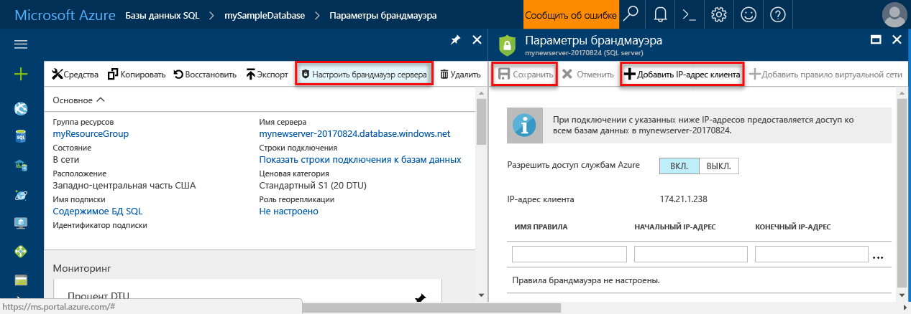

# <a name="design-your-first-azure-sql-database"></a><span data-ttu-id="69a20-103">Проектирование первой базы данных SQL Azure</span><span class="sxs-lookup"><span data-stu-id="69a20-103">Design your first Azure SQL database</span></span>

<span data-ttu-id="69a20-104">База данных SQL Azure — это реляционная база данных как служба (DBaaS) в Microsoft Cloud (Azure).</span><span class="sxs-lookup"><span data-stu-id="69a20-104">Azure SQL Database is a relational database-as-a service (DBaaS) in the Microsoft Cloud ("Azure").</span></span> <span data-ttu-id="69a20-105">В рамках этого руководства вы узнаете, как с помощью портала Azure и [SQL Server Management Studio](https://msdn.microsoft.com/library/ms174173.aspx) выполнять такие действия:</span><span class="sxs-lookup"><span data-stu-id="69a20-105">In this tutorial, you learn how to use the Azure portal and [SQL Server Management Studio](https://msdn.microsoft.com/library/ms174173.aspx) (SSMS) to:</span></span> 

> [!div class="checklist"]
> * <span data-ttu-id="69a20-106">создать базу данных на портале Azure;</span><span class="sxs-lookup"><span data-stu-id="69a20-106">Create a database in the Azure portal</span></span>
> * <span data-ttu-id="69a20-107">настроить правило брандмауэра на уровне сервера на портале Azure;</span><span class="sxs-lookup"><span data-stu-id="69a20-107">Set up a server-level firewall rule in the Azure portal</span></span>
> * <span data-ttu-id="69a20-108">Подключение к базе данных с помощью SQL Server Management Studio.</span><span class="sxs-lookup"><span data-stu-id="69a20-108">Connect to the database with SSMS</span></span>
> * <span data-ttu-id="69a20-109">создать таблицы с помощью SSMS;</span><span class="sxs-lookup"><span data-stu-id="69a20-109">Create tables with SSMS</span></span>
> * <span data-ttu-id="69a20-110">выполнить массовую загрузку данных с помощью BCP;</span><span class="sxs-lookup"><span data-stu-id="69a20-110">Bulk load data with BCP</span></span>
> * <span data-ttu-id="69a20-111">запросить эти данные с помощью SSMS;</span><span class="sxs-lookup"><span data-stu-id="69a20-111">Query that data with SSMS</span></span>
> * <span data-ttu-id="69a20-112">восстановить базу данных до предыдущего [восстановления до точки во времени](sql-database-recovery-using-backups.md#point-in-time-restore) на портале Azure.</span><span class="sxs-lookup"><span data-stu-id="69a20-112">Restore the database to a previous [point in time restore](sql-database-recovery-using-backups.md#point-in-time-restore) in the Azure portal</span></span>

<span data-ttu-id="69a20-113">Если у вас еще нет подписки Azure, [создайте бесплатную учетную запись Azure](https://azure.microsoft.com/free/), прежде чем начинать работу.</span><span class="sxs-lookup"><span data-stu-id="69a20-113">If you don't have an Azure subscription, [create a free account](https://azure.microsoft.com/free/) before you begin.</span></span>

## <a name="prerequisites"></a><span data-ttu-id="69a20-114">Предварительные требования</span><span class="sxs-lookup"><span data-stu-id="69a20-114">Prerequisites</span></span>

<span data-ttu-id="69a20-115">Для работы с этим руководством вам потребуются:</span><span class="sxs-lookup"><span data-stu-id="69a20-115">To complete this tutorial, make sure you have installed:</span></span>
- <span data-ttu-id="69a20-116">Последняя версия [SQL Server Management Studio](https://msdn.microsoft.com/library/ms174173.aspx) (SSMS).</span><span class="sxs-lookup"><span data-stu-id="69a20-116">The newest version of [SQL Server Management Studio](https://msdn.microsoft.com/library/ms174173.aspx) (SSMS).</span></span>
- <span data-ttu-id="69a20-117">Последняя версия [BCP и SQLCMD](https://www.microsoft.com/download/details.aspx?id=36433).</span><span class="sxs-lookup"><span data-stu-id="69a20-117">The newest version of [BCP and SQLCMD](https://www.microsoft.com/download/details.aspx?id=36433).</span></span>

## <a name="log-in-to-the-azure-portal"></a><span data-ttu-id="69a20-118">Войдите на портал Azure.</span><span class="sxs-lookup"><span data-stu-id="69a20-118">Log in to the Azure portal</span></span>

<span data-ttu-id="69a20-119">Войдите на [портал Azure](https://portal.azure.com/).</span><span class="sxs-lookup"><span data-stu-id="69a20-119">Log in to the [Azure portal](https://portal.azure.com/).</span></span>

## <a name="create-a-blank-sql-database"></a><span data-ttu-id="69a20-120">Создание пустой базы данных SQL</span><span class="sxs-lookup"><span data-stu-id="69a20-120">Create a blank SQL database</span></span>

<span data-ttu-id="69a20-121">База данных Azure SQL создается с определенным набором [вычислительных ресурсов и ресурсов хранения](sql-database-service-tiers.md).</span><span class="sxs-lookup"><span data-stu-id="69a20-121">An Azure SQL database is created with a defined set of [compute and storage resources](sql-database-service-tiers.md).</span></span> <span data-ttu-id="69a20-122">База данных создается в пределах [группы ресурсов Azure](../azure-resource-manager/resource-group-overview.md) и [логического сервера базы данных SQL Azure](sql-database-features.md).</span><span class="sxs-lookup"><span data-stu-id="69a20-122">The database is created within an [Azure resource group](../azure-resource-manager/resource-group-overview.md) and in an [Azure SQL Database logical server](sql-database-features.md).</span></span> 

<span data-ttu-id="69a20-123">Чтобы создать пустую базу данных SQL, выполните приведенные ниже действия.</span><span class="sxs-lookup"><span data-stu-id="69a20-123">Follow these steps to create a blank SQL database.</span></span> 

1. <span data-ttu-id="69a20-124">Щелкните **Создать** в верхнем левом углу портала Azure.</span><span class="sxs-lookup"><span data-stu-id="69a20-124">Click the **New** button found on the upper left-hand corner of the Azure portal.</span></span>

2. <span data-ttu-id="69a20-125">Выберите **Базы данных** на странице **создания** и щелкните **База данных SQL** на странице **Базы данных**.</span><span class="sxs-lookup"><span data-stu-id="69a20-125">Select **Databases** from the **New** page, and select **SQL Database** from the **Databases** page.</span></span> 

   

3. <span data-ttu-id="69a20-127">Заполните форму базы данных SQL, указав следующую информацию, как показано на предыдущем рисунке.</span><span class="sxs-lookup"><span data-stu-id="69a20-127">Fill out the SQL Database form with the following information, as shown on the preceding image:</span></span>   

   | <span data-ttu-id="69a20-128">Настройка</span><span class="sxs-lookup"><span data-stu-id="69a20-128">Setting</span></span>       | <span data-ttu-id="69a20-129">Рекомендуемое значение</span><span class="sxs-lookup"><span data-stu-id="69a20-129">Suggested value</span></span> | <span data-ttu-id="69a20-130">Описание</span><span class="sxs-lookup"><span data-stu-id="69a20-130">Description</span></span> | 
   | ------------ | ------------------ | ------------------------------------------------- | 
   | <span data-ttu-id="69a20-131">**Database name** (Имя базы данных)</span><span class="sxs-lookup"><span data-stu-id="69a20-131">**Database name**</span></span> | <span data-ttu-id="69a20-132">mySampleDatabase</span><span class="sxs-lookup"><span data-stu-id="69a20-132">mySampleDatabase</span></span> | <span data-ttu-id="69a20-133">Допустимые имена баз данных см. в статье об [идентификаторах базы данных](https://docs.microsoft.com/sql/relational-databases/databases/database-identifiers).</span><span class="sxs-lookup"><span data-stu-id="69a20-133">For valid database names, see [Database Identifiers](https://docs.microsoft.com/sql/relational-databases/databases/database-identifiers).</span></span> | 
   | <span data-ttu-id="69a20-134">**Подписка**</span><span class="sxs-lookup"><span data-stu-id="69a20-134">**Subscription**</span></span> | <span data-ttu-id="69a20-135">Ваша подписка</span><span class="sxs-lookup"><span data-stu-id="69a20-135">Your subscription</span></span>  | <span data-ttu-id="69a20-136">Дополнительные сведения о подписках см. [здесь](https://account.windowsazure.com/Subscriptions).</span><span class="sxs-lookup"><span data-stu-id="69a20-136">For details about your subscriptions, see [Subscriptions](https://account.windowsazure.com/Subscriptions).</span></span> |
   | <span data-ttu-id="69a20-137">**Группа ресурсов**</span><span class="sxs-lookup"><span data-stu-id="69a20-137">**Resource group**</span></span> | <span data-ttu-id="69a20-138">myResourceGroup</span><span class="sxs-lookup"><span data-stu-id="69a20-138">myResourceGroup</span></span> | <span data-ttu-id="69a20-139">Допустимые имена групп ресурсов см. в статье о [правилах и ограничениях именования](https://docs.microsoft.com/azure/architecture/best-practices/naming-conventions).</span><span class="sxs-lookup"><span data-stu-id="69a20-139">For valid resource group names, see [Naming rules and restrictions](https://docs.microsoft.com/azure/architecture/best-practices/naming-conventions).</span></span> |
   | <span data-ttu-id="69a20-140">**Выбрать источник**</span><span class="sxs-lookup"><span data-stu-id="69a20-140">**Select source**</span></span> | <span data-ttu-id="69a20-141">Пустая база данных</span><span class="sxs-lookup"><span data-stu-id="69a20-141">Blank database</span></span> | <span data-ttu-id="69a20-142">Указывает, что должна быть создана пустая база данных.</span><span class="sxs-lookup"><span data-stu-id="69a20-142">Specifies that a blank database should be created.</span></span> |

4. <span data-ttu-id="69a20-143">Щелкните **Сервер**, чтобы создать и настроить новый сервер для новой базы данных.</span><span class="sxs-lookup"><span data-stu-id="69a20-143">Click **Server** to create and configure a new server for your new database.</span></span> <span data-ttu-id="69a20-144">Заполните форму для **создания сервера**, указав следующую информацию.</span><span class="sxs-lookup"><span data-stu-id="69a20-144">Fill out the **New server form** with the following information:</span></span> 

   | <span data-ttu-id="69a20-145">Настройка</span><span class="sxs-lookup"><span data-stu-id="69a20-145">Setting</span></span>       | <span data-ttu-id="69a20-146">Рекомендуемое значение</span><span class="sxs-lookup"><span data-stu-id="69a20-146">Suggested value</span></span> | <span data-ttu-id="69a20-147">Описание</span><span class="sxs-lookup"><span data-stu-id="69a20-147">Description</span></span> | 
   | ------------ | ------------------ | ------------------------------------------------- | 
   | <span data-ttu-id="69a20-148">**Server name** (Имя сервера)</span><span class="sxs-lookup"><span data-stu-id="69a20-148">**Server name**</span></span> | <span data-ttu-id="69a20-149">Любое глобально уникальное имя</span><span class="sxs-lookup"><span data-stu-id="69a20-149">Any globally unique name</span></span> | <span data-ttu-id="69a20-150">Допустимые имена серверов см. в статье о [правилах и ограничениях именования](https://docs.microsoft.com/azure/architecture/best-practices/naming-conventions).</span><span class="sxs-lookup"><span data-stu-id="69a20-150">For valid server names, see [Naming rules and restrictions](https://docs.microsoft.com/azure/architecture/best-practices/naming-conventions).</span></span> | 
   | <span data-ttu-id="69a20-151">**Имя для входа администратора сервера**</span><span class="sxs-lookup"><span data-stu-id="69a20-151">**Server admin login**</span></span> | <span data-ttu-id="69a20-152">Любое допустимое имя</span><span class="sxs-lookup"><span data-stu-id="69a20-152">Any valid name</span></span> | <span data-ttu-id="69a20-153">Допустимые имена входа см. в статье об [идентификаторах базы данных](https://docs.microsoft.com/sql/relational-databases/databases/database-identifiers).</span><span class="sxs-lookup"><span data-stu-id="69a20-153">For valid login names, see [Database Identifiers](https://docs.microsoft.com/sql/relational-databases/databases/database-identifiers).</span></span>|
   | <span data-ttu-id="69a20-154">**Пароль**</span><span class="sxs-lookup"><span data-stu-id="69a20-154">**Password**</span></span> | <span data-ttu-id="69a20-155">Любой допустимый пароль</span><span class="sxs-lookup"><span data-stu-id="69a20-155">Any valid password</span></span> | <span data-ttu-id="69a20-156">Длина пароля должна составлять минимум 8 символов. Пароль должен содержать символы трех категорий из перечисленных: прописные буквы, строчные буквы, цифры и символы, не являющиеся буквами или цифрами.</span><span class="sxs-lookup"><span data-stu-id="69a20-156">Your password must have at least 8 characters and must contain characters from three of the following categories: upper case characters, lower case characters, numbers, and non-alphanumeric characters.</span></span> |
   | <span data-ttu-id="69a20-157">**Расположение**</span><span class="sxs-lookup"><span data-stu-id="69a20-157">**Location**</span></span> | <span data-ttu-id="69a20-158">Любое допустимое расположение</span><span class="sxs-lookup"><span data-stu-id="69a20-158">Any valid location</span></span> | <span data-ttu-id="69a20-159">Дополнительные сведения о регионах Azure см. [здесь](https://azure.microsoft.com/regions/).</span><span class="sxs-lookup"><span data-stu-id="69a20-159">For information about regions, see [Azure Regions](https://azure.microsoft.com/regions/).</span></span> |

   

5. <span data-ttu-id="69a20-161">Нажмите кнопку **Выбрать**.</span><span class="sxs-lookup"><span data-stu-id="69a20-161">Click **Select**.</span></span>

6. <span data-ttu-id="69a20-162">Щелкните **Ценовая категория**, чтобы указать уровень производительности и уровень служб для новой базы данных.</span><span class="sxs-lookup"><span data-stu-id="69a20-162">Click **Pricing tier** to specify the service tier and performance level for your new database.</span></span> <span data-ttu-id="69a20-163">Для этого руководства выберите значения **20 DTU** и **250** ГБ хранилища.</span><span class="sxs-lookup"><span data-stu-id="69a20-163">For this tutorial, select **20 DTUs** and **250** GB of storage.</span></span>

   

7. <span data-ttu-id="69a20-165">Нажмите кнопку **Применить**.</span><span class="sxs-lookup"><span data-stu-id="69a20-165">Click **Apply**.</span></span>  

8. <span data-ttu-id="69a20-166">Укажите **параметры сортировки** для пустой базы данных. В этом руководстве используйте значение по умолчанию.</span><span class="sxs-lookup"><span data-stu-id="69a20-166">Select a **collation** for the blank database (for this tutorial, use the default value).</span></span> <span data-ttu-id="69a20-167">Дополнительные сведения о параметрах сортировки см. в [этой статье](https://docs.microsoft.com/sql/t-sql/statements/collations).</span><span class="sxs-lookup"><span data-stu-id="69a20-167">For more information about collations, see [Collations](https://docs.microsoft.com/sql/t-sql/statements/collations)</span></span>

9. <span data-ttu-id="69a20-168">Нажмите кнопку **Создать**, чтобы подготовить базу данных.</span><span class="sxs-lookup"><span data-stu-id="69a20-168">Click **Create** to provision the database.</span></span> <span data-ttu-id="69a20-169">Подготовка занимает около полутора минут.</span><span class="sxs-lookup"><span data-stu-id="69a20-169">Provisioning takes about a minute and a half to complete.</span></span> 

10. <span data-ttu-id="69a20-170">На панели инструментов щелкните **Уведомления**, чтобы отслеживать процесс развертывания.</span><span class="sxs-lookup"><span data-stu-id="69a20-170">On the toolbar, click **Notifications** to monitor the deployment process.</span></span>

   

## <a name="create-a-server-level-firewall-rule"></a><span data-ttu-id="69a20-172">создадим правило брандмауэра на уровне сервера;</span><span class="sxs-lookup"><span data-stu-id="69a20-172">Create a server-level firewall rule</span></span>

<span data-ttu-id="69a20-173">Служба базы данных SQL создает брандмауэр уровня сервера, который не позволяет внешним приложениям и средствам подключаться к серверу или любой базе данных на сервере, если не создано правило брандмауэра, открывающее брандмауэр для определенных IP-адресов.</span><span class="sxs-lookup"><span data-stu-id="69a20-173">The SQL Database service creates a firewall at the server-level that prevents external applications and tools from connecting to the server or any databases on the server unless a firewall rule is created to open the firewall for specific IP addresses.</span></span> <span data-ttu-id="69a20-174">Выполните следующие действия, чтобы создать [правило брандмауэра уровня сервера базы данных SQL](sql-database-firewall-configure.md) для IP-адреса вашего клиента и разрешить внешнее подключение через брандмауэр базы данных SQL только с вашего IP-адреса.</span><span class="sxs-lookup"><span data-stu-id="69a20-174">Follow these steps to create a [SQL Database server-level firewall rule](sql-database-firewall-configure.md) for your client's IP address and enable external connectivity through the SQL Database firewall for your IP address only.</span></span> 

> [!NOTE]
> <span data-ttu-id="69a20-175">База данных SQL обменивается данными через порт 1433.</span><span class="sxs-lookup"><span data-stu-id="69a20-175">SQL Database communicates over port 1433.</span></span> <span data-ttu-id="69a20-176">Если вы пытаетесь подключиться из корпоративной сети, исходящий трафик через порт 1433 может быть запрещен сетевым брандмауэром.</span><span class="sxs-lookup"><span data-stu-id="69a20-176">If you are trying to connect from within a corporate network, outbound traffic over port 1433 may not be allowed by your network's firewall.</span></span> <span data-ttu-id="69a20-177">В таком случае вы не сможете подключиться к серверу базы данных SQL Azure, пока ваш ИТ-отдел не откроет порт 1433.</span><span class="sxs-lookup"><span data-stu-id="69a20-177">If so, you cannot connect to your Azure SQL Database server unless your IT department opens port 1433.</span></span>
>

1. <span data-ttu-id="69a20-178">По завершении развертывания щелкните раздел **Базы данных SQL** в меню слева и выберите **mySampleDatabase** на странице **баз данных SQL**.</span><span class="sxs-lookup"><span data-stu-id="69a20-178">After the deployment completes, click **SQL databases** from the left-hand menu and then click **mySampleDatabase** on the **SQL databases** page.</span></span> <span data-ttu-id="69a20-179">Откроется страница с общими сведениями о базе данных, где будет указано полное имя сервера (например, **mynewserver20170313.database.windows.net**) и предоставлены параметры для дальнейшей настройки.</span><span class="sxs-lookup"><span data-stu-id="69a20-179">The overview page for your database opens, showing you the fully qualified server name (such as **mynewserver20170313.database.windows.net**) and provides options for further configuration.</span></span> <span data-ttu-id="69a20-180">Скопируйте полное имя сервера для использования в дальнейшем.</span><span class="sxs-lookup"><span data-stu-id="69a20-180">Copy this fully qualified server name for use later.</span></span>

   > [!IMPORTANT]
   > <span data-ttu-id="69a20-181">Полное имя сервера понадобится вам при работе с последующими руководствами для подключения к серверу и к базам данных.</span><span class="sxs-lookup"><span data-stu-id="69a20-181">You need this fully qualified server name to connect to your server and its databases in subsequent quick starts.</span></span>
   > 

    

2. <span data-ttu-id="69a20-183">Щелкните **Настройка брандмауэра для сервера** на панели инструментов, как показано на предыдущем рисунке.</span><span class="sxs-lookup"><span data-stu-id="69a20-183">Click **Set server firewall** on the toolbar as shown in the previous image.</span></span> <span data-ttu-id="69a20-184">Откроется страница **параметров брандмауэра** для сервера базы данных SQL.</span><span class="sxs-lookup"><span data-stu-id="69a20-184">The **Firewall settings** page for the SQL Database server opens.</span></span> 

    


3. <span data-ttu-id="69a20-186">На панели инструментов щелкните **Добавить IP-адрес клиента**, чтобы добавить текущий IP-адрес в новое правило брандмауэра.</span><span class="sxs-lookup"><span data-stu-id="69a20-186">Click **Add client IP** on the toolbar to add your current IP address to a new firewall rule.</span></span> <span data-ttu-id="69a20-187">С использованием правила брандмауэра можно открыть порт 1433 для одного IP-адреса или диапазона IP-адресов.</span><span class="sxs-lookup"><span data-stu-id="69a20-187">A firewall rule can open port 1433 for a single IP address or a range of IP addresses.</span></span>

4. <span data-ttu-id="69a20-188">Щелкните **Сохранить**.</span><span class="sxs-lookup"><span data-stu-id="69a20-188">Click **Save**.</span></span> <span data-ttu-id="69a20-189">Для текущего IP-адреса будет создано правило брандмауэра уровня сервера, с помощью которого можно открыть порт 1433 логического сервера.</span><span class="sxs-lookup"><span data-stu-id="69a20-189">A server-level firewall rule is created for your current IP address opening port 1433 on the logical server.</span></span>

    

4. <span data-ttu-id="69a20-191">Нажмите кнопку **ОК**, а затем закройте страницу **Параметры брандмауэра**.</span><span class="sxs-lookup"><span data-stu-id="69a20-191">Click **OK** and then close the **Firewall settings** page.</span></span>

<span data-ttu-id="69a20-192">Теперь можно подключиться с этого IP-адреса к серверу базы данных SQL и его базам данных с помощью SQL Server Management Studio или другого средства по своему усмотрению, используя учетную запись администратора сервера, созданную ранее.</span><span class="sxs-lookup"><span data-stu-id="69a20-192">You can now connect to the SQL Database server and its databases using SQL Server Management Studio or another tool of your choice from this IP address using the server admin account created previously.</span></span>

> [!IMPORTANT]
> <span data-ttu-id="69a20-193">По умолчанию доступ через брандмауэр базы данных SQL включен для всех служб Azure.</span><span class="sxs-lookup"><span data-stu-id="69a20-193">By default, access through the SQL Database firewall is enabled for all Azure services.</span></span> <span data-ttu-id="69a20-194">На этой странице щелкните **Откл.**, чтобы отключить доступ для всех служб Azure.</span><span class="sxs-lookup"><span data-stu-id="69a20-194">Click **OFF** on this page to disable for all Azure services.</span></span>

## <a name="sql-server-connection-information"></a><span data-ttu-id="69a20-195">Сведения о подключении SQL Server</span><span class="sxs-lookup"><span data-stu-id="69a20-195">SQL server connection information</span></span>

<span data-ttu-id="69a20-196">Получите полное имя сервера для сервера базы данных SQL Azure на портале Azure.</span><span class="sxs-lookup"><span data-stu-id="69a20-196">Get the fully qualified server name for your Azure SQL Database server in the Azure portal.</span></span> <span data-ttu-id="69a20-197">Используйте полное имя сервера, чтобы подключиться к серверу с помощью SQL Server Management Studio.</span><span class="sxs-lookup"><span data-stu-id="69a20-197">You use the fully qualified server name to connect to your server using SQL Server Management Studio.</span></span>

1. <span data-ttu-id="69a20-198">Войдите на [портал Azure](https://portal.azure.com/).</span><span class="sxs-lookup"><span data-stu-id="69a20-198">Log in to the [Azure portal](https://portal.azure.com/).</span></span>
2. <span data-ttu-id="69a20-199">В меню слева выберите **Базы данных SQL** и на странице **Базы данных SQL** щелкните имя своей базы данных.</span><span class="sxs-lookup"><span data-stu-id="69a20-199">Select **SQL Databases** from the left-hand menu, and click your database on the **SQL databases** page.</span></span> 
3. <span data-ttu-id="69a20-200">На странице портала Azure вашей базы данных в области **Основные компоненты** найдите и скопируйте **имя сервера**.</span><span class="sxs-lookup"><span data-stu-id="69a20-200">In the **Essentials** pane in the Azure portal page for your database, locate and then copy the **Server name**.</span></span>

   

## <a name="connect-to-the-database-with-ssms"></a><span data-ttu-id="69a20-202">Подключение к базе данных с помощью SQL Server Management Studio.</span><span class="sxs-lookup"><span data-stu-id="69a20-202">Connect to the database with SSMS</span></span>

<span data-ttu-id="69a20-203">Используйте [SQL Server Management Studio](https://docs.microsoft.com/sql/ssms/sql-server-management-studio-ssms) для подключения к серверу базы данных SQL Azure.</span><span class="sxs-lookup"><span data-stu-id="69a20-203">Use [SQL Server Management Studio](https://docs.microsoft.com/sql/ssms/sql-server-management-studio-ssms) to establish a connection to your Azure SQL Database server.</span></span>

1. <span data-ttu-id="69a20-204">Откройте среду SQL Server Management Studio.</span><span class="sxs-lookup"><span data-stu-id="69a20-204">Open SQL Server Management Studio.</span></span>

2. <span data-ttu-id="69a20-205">В диалоговом окне **Подключение к серверу** введите следующие значения.</span><span class="sxs-lookup"><span data-stu-id="69a20-205">In the **Connect to Server** dialog box, enter the following information:</span></span>

   | <span data-ttu-id="69a20-206">Настройка</span><span class="sxs-lookup"><span data-stu-id="69a20-206">Setting</span></span>       | <span data-ttu-id="69a20-207">Рекомендуемое значение</span><span class="sxs-lookup"><span data-stu-id="69a20-207">Suggested value</span></span> | <span data-ttu-id="69a20-208">Описание</span><span class="sxs-lookup"><span data-stu-id="69a20-208">Description</span></span> | 
   | ------------ | ------------------ | ------------------------------------------------- | 
   | <span data-ttu-id="69a20-209">Тип сервера</span><span class="sxs-lookup"><span data-stu-id="69a20-209">Server type</span></span> | <span data-ttu-id="69a20-210">Ядро СУБД</span><span class="sxs-lookup"><span data-stu-id="69a20-210">Database engine</span></span> | <span data-ttu-id="69a20-211">Это обязательное значение</span><span class="sxs-lookup"><span data-stu-id="69a20-211">This value is required</span></span> |
   | <span data-ttu-id="69a20-212">имя сервера;</span><span class="sxs-lookup"><span data-stu-id="69a20-212">Server name</span></span> | <span data-ttu-id="69a20-213">Полное имя сервера</span><span class="sxs-lookup"><span data-stu-id="69a20-213">The fully qualified server name</span></span> | <span data-ttu-id="69a20-214">Имя должно быть примерно таким: **mynewserver20170313.database.windows.net**.</span><span class="sxs-lookup"><span data-stu-id="69a20-214">The name should be something like this: **mynewserver20170313.database.windows.net**.</span></span> |
   | <span data-ttu-id="69a20-215">Аутентификация</span><span class="sxs-lookup"><span data-stu-id="69a20-215">Authentication</span></span> | <span data-ttu-id="69a20-216">проверка подлинности SQL Server</span><span class="sxs-lookup"><span data-stu-id="69a20-216">SQL Server Authentication</span></span> | <span data-ttu-id="69a20-217">В рамках работы с этим руководством мы настроили только один тип проверки подлинности — проверку подлинности SQL.</span><span class="sxs-lookup"><span data-stu-id="69a20-217">SQL Authentication is the only authentication type that we have configured in this tutorial.</span></span> |
   | <span data-ttu-id="69a20-218">Вход</span><span class="sxs-lookup"><span data-stu-id="69a20-218">Login</span></span> | <span data-ttu-id="69a20-219">Учетная запись администратора сервера</span><span class="sxs-lookup"><span data-stu-id="69a20-219">The server admin account</span></span> | <span data-ttu-id="69a20-220">Это учетная запись, указанная при создании сервера.</span><span class="sxs-lookup"><span data-stu-id="69a20-220">This is the account that you specified when you created the server.</span></span> |
   | <span data-ttu-id="69a20-221">Пароль</span><span class="sxs-lookup"><span data-stu-id="69a20-221">Password</span></span> | <span data-ttu-id="69a20-222">Пароль учетной записи администратора сервера</span><span class="sxs-lookup"><span data-stu-id="69a20-222">The password for your server admin account</span></span> | <span data-ttu-id="69a20-223">Это пароль, указанный при создании сервера.</span><span class="sxs-lookup"><span data-stu-id="69a20-223">This is the password that you specified when you created the server.</span></span> |

   

3. <span data-ttu-id="69a20-225">Щелкните **Параметры** в диалоговом окне **Подключение к серверу**.</span><span class="sxs-lookup"><span data-stu-id="69a20-225">Click **Options** in the **Connect to server** dialog box.</span></span> <span data-ttu-id="69a20-226">В разделе **Подключение к базе данных** введите **mySampleDatabase**, чтобы подключиться к этой базе данных.</span><span class="sxs-lookup"><span data-stu-id="69a20-226">In the **Connect to database** section, enter **mySampleDatabase** to connect to this database.</span></span>

     

4. <span data-ttu-id="69a20-228">Щелкните **Подключить**.</span><span class="sxs-lookup"><span data-stu-id="69a20-228">Click **Connect**.</span></span> <span data-ttu-id="69a20-229">Откроется окно обозревателя объектов в SSMS.</span><span class="sxs-lookup"><span data-stu-id="69a20-229">The Object Explorer window opens in SSMS.</span></span> 

5. <span data-ttu-id="69a20-230">В обозревателе объектов разверните **базы данных**, затем выберите **mySampleDatabase**, чтобы просмотреть объекты в образце базы данных.</span><span class="sxs-lookup"><span data-stu-id="69a20-230">In Object Explorer, expand **Databases** and then expand **mySampleDatabase** to view the objects in the sample database.</span></span>

     

## <a name="create-tables-in-the-database"></a><span data-ttu-id="69a20-232">Создание таблиц в базе данных</span><span class="sxs-lookup"><span data-stu-id="69a20-232">Create tables in the database</span></span> 

<span data-ttu-id="69a20-233">Создайте схему базы данных с четырьмя таблицами, моделирующими систему управления студентами для университетов, с помощью [Transact-SQL](https://docs.microsoft.com/sql/t-sql/language-reference):</span><span class="sxs-lookup"><span data-stu-id="69a20-233">Create a database schema with four tables that model a student management system for universities using [Transact-SQL](https://docs.microsoft.com/sql/t-sql/language-reference):</span></span>

- <span data-ttu-id="69a20-234">Person</span><span class="sxs-lookup"><span data-stu-id="69a20-234">Person</span></span>
- <span data-ttu-id="69a20-235">Курс</span><span class="sxs-lookup"><span data-stu-id="69a20-235">Course</span></span>
- <span data-ttu-id="69a20-236">Студент</span><span class="sxs-lookup"><span data-stu-id="69a20-236">Student</span></span>
- <span data-ttu-id="69a20-237">Актив, моделирующий систему управления студентами для университетов</span><span class="sxs-lookup"><span data-stu-id="69a20-237">Credit that model a student management system for universities</span></span>

<span data-ttu-id="69a20-238">На приведенной ниже схеме показано, как эти таблицы связаны друг с другом.</span><span class="sxs-lookup"><span data-stu-id="69a20-238">The following diagram shows how these tables are related to each other.</span></span> <span data-ttu-id="69a20-239">Некоторые из этих таблиц ссылаются на столбцы в других таблицах.</span><span class="sxs-lookup"><span data-stu-id="69a20-239">Some of these tables reference columns in other tables.</span></span> <span data-ttu-id="69a20-240">Например, таблица Student ссылается на столбец **PersonId** таблицы **Person**.</span><span class="sxs-lookup"><span data-stu-id="69a20-240">For example, the Student table references the **PersonId** column of the **Person** table.</span></span> <span data-ttu-id="69a20-241">Изучите схему, чтобы понять, как таблицы в этом руководстве связаны друг с другом.</span><span class="sxs-lookup"><span data-stu-id="69a20-241">Study the diagram to understand how the tables in this tutorial are related to one another.</span></span> <span data-ttu-id="69a20-242">Подробные сведения о создании эффективных таблиц баз данных см. в [этой статье](https://msdn.microsoft.com/library/cc505842.aspx).</span><span class="sxs-lookup"><span data-stu-id="69a20-242">For an in-depth look at how to create effective database tables, see [Create effective database tables](https://msdn.microsoft.com/library/cc505842.aspx).</span></span> <span data-ttu-id="69a20-243">Дополнительные сведения о выборе типов данных см. в [этой статье](https://docs.microsoft.com/sql/t-sql/data-types/data-types-transact-sql).</span><span class="sxs-lookup"><span data-stu-id="69a20-243">For information about choosing data types, see [Data types](https://docs.microsoft.com/sql/t-sql/data-types/data-types-transact-sql).</span></span>

> [!NOTE]
> <span data-ttu-id="69a20-244">Для создания и проектирования таблиц можно также использовать [конструктор таблиц в SQL Server Management Studio](https://msdn.microsoft.com/library/hh272695.aspx).</span><span class="sxs-lookup"><span data-stu-id="69a20-244">You can also use the [table designer in SQL Server Management Studio](https://msdn.microsoft.com/library/hh272695.aspx) to create and design your tables.</span></span> 


1. <span data-ttu-id="69a20-246">В обозревателе объектов щелкните правой кнопкой мыши **mySampleDatabase** и выберите пункт **Новый запрос**.</span><span class="sxs-lookup"><span data-stu-id="69a20-246">In Object Explorer, right-click **mySampleDatabase** and click **New Query**.</span></span> <span data-ttu-id="69a20-247">Откроется пустое окно запроса, подключенное к базе данных.</span><span class="sxs-lookup"><span data-stu-id="69a20-247">A blank query window opens that is connected to your database.</span></span>

2. <span data-ttu-id="69a20-248">Чтобы создать в базе данных четыре таблицы, в окне запроса выполните следующий запрос:</span><span class="sxs-lookup"><span data-stu-id="69a20-248">In the query window, execute the following query to create four tables in your database:</span></span> 

   ```sql 
   -- Create Person table

   CREATE TABLE Person
   (
   PersonId   INT IDENTITY PRIMARY KEY,
   FirstName   NVARCHAR(128) NOT NULL,
   MiddelInitial NVARCHAR(10),
   LastName   NVARCHAR(128) NOT NULL,
   DateOfBirth   DATE NOT NULL
   )
   
   -- Create Student table
 
   CREATE TABLE Student
   (
   StudentId INT IDENTITY PRIMARY KEY,
   PersonId  INT REFERENCES Person (PersonId),
   Email   NVARCHAR(256)
   )
   
   -- Create Course table
 
   CREATE TABLE Course
   (
   CourseId  INT IDENTITY PRIMARY KEY,
   Name   NVARCHAR(50) NOT NULL,
   Teacher   NVARCHAR(256) NOT NULL
   ) 

   -- Create Credit table
 
   CREATE TABLE Credit
   (
   StudentId   INT REFERENCES Student (StudentId),
   CourseId   INT REFERENCES Course (CourseId),
   Grade   DECIMAL(5,2) CHECK (Grade <= 100.00),
   Attempt   TINYINT,
   CONSTRAINT  [UQ_studentgrades] UNIQUE CLUSTERED
   (
   StudentId, CourseId, Grade, Attempt
   )
   )
   ```

   

3. <span data-ttu-id="69a20-250">В обозревателе объектов SQL Server Management Studio разверните узел tables, чтобы просмотреть созданные таблицы.</span><span class="sxs-lookup"><span data-stu-id="69a20-250">Expand the 'tables' node in the SQL Server Management Studio Object explorer to see the tables you created.</span></span>

   

## <a name="load-data-into-the-tables"></a><span data-ttu-id="69a20-252">Загрузка данных в таблицу</span><span class="sxs-lookup"><span data-stu-id="69a20-252">Load data into the tables</span></span>

1. <span data-ttu-id="69a20-253">В папке скачиваний создайте папку с именем **SampleTableData** для хранения примеров данных базы данных.</span><span class="sxs-lookup"><span data-stu-id="69a20-253">Create a folder called **SampleTableData** in your Downloads folder to store sample data for your database.</span></span> 

2. <span data-ttu-id="69a20-254">Щелкните правой кнопкой мыши приведенные ниже ссылки и сохраните их в папку **SampleTableData**.</span><span class="sxs-lookup"><span data-stu-id="69a20-254">Right-click the following links and save them into the **SampleTableData** folder.</span></span> 

   - [<span data-ttu-id="69a20-255">SampleCourseData</span><span class="sxs-lookup"><span data-stu-id="69a20-255">SampleCourseData</span></span>](https://sqldbtutorial.blob.core.windows.net/tutorials/SampleCourseData)
   - [<span data-ttu-id="69a20-256">SamplePersonData</span><span class="sxs-lookup"><span data-stu-id="69a20-256">SamplePersonData</span></span>](https://sqldbtutorial.blob.core.windows.net/tutorials/SamplePersonData)
   - [<span data-ttu-id="69a20-257">SampleStudentData</span><span class="sxs-lookup"><span data-stu-id="69a20-257">SampleStudentData</span></span>](https://sqldbtutorial.blob.core.windows.net/tutorials/SampleStudentData)
   - [<span data-ttu-id="69a20-258">SampleCreditData</span><span class="sxs-lookup"><span data-stu-id="69a20-258">SampleCreditData</span></span>](https://sqldbtutorial.blob.core.windows.net/tutorials/SampleCreditData)

3. <span data-ttu-id="69a20-259">Откройте окно командной строки и перейдите в папку SampleTableData.</span><span class="sxs-lookup"><span data-stu-id="69a20-259">Open a command prompt window and navigate to the SampleTableData folder.</span></span>

4. <span data-ttu-id="69a20-260">Выполните приведенную ниже команду, которая вставляет пример данных в таблицы.Укажите значения **ServerName**, **DatabaseName**, **UserName** и **Password**, соответствующие вашей среде.</span><span class="sxs-lookup"><span data-stu-id="69a20-260">Execute the following commands to insert sample data into the tables replacing the values for **ServerName**, **DatabaseName**, **UserName**, and **Password** with the values for your environment.</span></span>
  
   ```bcp
   bcp Course in SampleCourseData -S <ServerName>.database.windows.net -d <DatabaseName> -U <Username> -P <password> -q -c -t ","
   bcp Person in SamplePersonData -S <ServerName>.database.windows.net -d <DatabaseName> -U <Username> -P <password> -q -c -t ","
   bcp Student in SampleStudentData -S <ServerName>.database.windows.net -d <DatabaseName> -U <Username> -P <password> -q -c -t ","
   bcp Credit in SampleCreditData -S <ServerName>.database.windows.net -d <DatabaseName> -U <Username> -P <password> -q -c -t ","
   ```

<span data-ttu-id="69a20-261">Итак, вы загрузили пример данных в созданные ранее таблицы.</span><span class="sxs-lookup"><span data-stu-id="69a20-261">You have now loaded sample data into the tables you created earlier.</span></span>

## <a name="query-data"></a><span data-ttu-id="69a20-262">Запрос данных</span><span class="sxs-lookup"><span data-stu-id="69a20-262">Query data</span></span>

<span data-ttu-id="69a20-263">Чтобы извлечь сведения из таблиц базы данных, выполните приведенные ниже запросы.</span><span class="sxs-lookup"><span data-stu-id="69a20-263">Execute the following queries to retrieve information from the database tables.</span></span> <span data-ttu-id="69a20-264">Дополнительные сведения о создании запросов SQL см. в [этой статье](https://technet.microsoft.com/library/bb264565.aspx).</span><span class="sxs-lookup"><span data-stu-id="69a20-264">See [Writing SQL Queries](https://technet.microsoft.com/library/bb264565.aspx) to learn more about writing SQL queries.</span></span> <span data-ttu-id="69a20-265">Первый запрос объединяет четыре таблицы для поиска всех студентов, посещающих занятия у преподавателя Dominick Pope и оценки которых выше, чем у 75 % учащихся в этом классе.</span><span class="sxs-lookup"><span data-stu-id="69a20-265">The first query joins all four tables to find all the students taught by 'Dominick Pope' who have a grade higher than 75% in his class.</span></span> <span data-ttu-id="69a20-266">Второй запрос объединяет четыре таблицы и находит все курсы, на которые когда-либо записывался Noe Coleman.</span><span class="sxs-lookup"><span data-stu-id="69a20-266">The second query joins all four tables and finds all courses in which 'Noe Coleman' has ever enrolled.</span></span>

1. <span data-ttu-id="69a20-267">В окне запроса SQL Server Management Studio выполните следующий запрос:</span><span class="sxs-lookup"><span data-stu-id="69a20-267">In a SQL Server Management Studio query window, execute the following query:</span></span>

   ```sql 
   -- Find the students taught by Dominick Pope who have a grade higher than 75%

   SELECT  person.FirstName,
   person.LastName,
   course.Name,
   credit.Grade
   FROM  Person AS person
   INNER JOIN Student AS student ON person.PersonId = student.PersonId
   INNER JOIN Credit AS credit ON student.StudentId = credit.StudentId
   INNER JOIN Course AS course ON credit.CourseId = course.courseId
   WHERE course.Teacher = 'Dominick Pope' 
   AND Grade > 75
   ```

2. <span data-ttu-id="69a20-268">В окне запроса SQL Server Management Studio выполните следующий запрос:</span><span class="sxs-lookup"><span data-stu-id="69a20-268">In a SQL Server Management Studio query window, execute following query:</span></span>

   ```sql
   -- Find all the courses in which Noe Coleman has ever enrolled

   SELECT  course.Name,
   course.Teacher,
   credit.Grade
   FROM  Course AS course
   INNER JOIN Credit AS credit ON credit.CourseId = course.CourseId
   INNER JOIN Student AS student ON student.StudentId = credit.StudentId
   INNER JOIN Person AS person ON person.PersonId = student.PersonId
   WHERE person.FirstName = 'Noe'
   AND person.LastName = 'Coleman'
   ```

## <a name="restore-a-database-to-a-previous-point-in-time"></a><span data-ttu-id="69a20-269">Восстановление базы данных до предыдущей точки во времени</span><span class="sxs-lookup"><span data-stu-id="69a20-269">Restore a database to a previous point in time</span></span>

<span data-ttu-id="69a20-270">Представьте, что вы случайно удалили таблицу.</span><span class="sxs-lookup"><span data-stu-id="69a20-270">Imagine you have accidentally deleted a table.</span></span> <span data-ttu-id="69a20-271">Восстановить ее будет не просто.</span><span class="sxs-lookup"><span data-stu-id="69a20-271">This is something you cannot easily recover from.</span></span> <span data-ttu-id="69a20-272">База данных SQL Azure позволяет вернуться в любой момент времени в течение последних 35 дней и восстановить данные на определенный момент времени в новой базе данных.</span><span class="sxs-lookup"><span data-stu-id="69a20-272">Azure SQL Database allows you to go back to any point in time in the last up to 35 days and restore this point in time to a new database.</span></span> <span data-ttu-id="69a20-273">С помощью этой базы данных можно восстановить удаленные данные.</span><span class="sxs-lookup"><span data-stu-id="69a20-273">You can you this database to recover your deleted data.</span></span> <span data-ttu-id="69a20-274">Ниже приведены действия по восстановлению базы данных до точки во времени, когда были созданы таблицы.</span><span class="sxs-lookup"><span data-stu-id="69a20-274">The following steps restore the sample database to a point before the tables were added.</span></span>

1. <span data-ttu-id="69a20-275">На странице "База данных SQL" на панели инструментов щелкните **Восстановить**.</span><span class="sxs-lookup"><span data-stu-id="69a20-275">On the SQL Database page for your database, click **Restore** on the toolbar.</span></span> <span data-ttu-id="69a20-276">Откроется страница **Восстановление**.</span><span class="sxs-lookup"><span data-stu-id="69a20-276">The **Restore** page opens.</span></span>

   

2. <span data-ttu-id="69a20-278">Заполните форму **Восстановление**, указав следующие сведения.</span><span class="sxs-lookup"><span data-stu-id="69a20-278">Fill out the **Restore** form with the required information:</span></span>
    * <span data-ttu-id="69a20-279">Имя базы данных. Укажите имя базы данных.</span><span class="sxs-lookup"><span data-stu-id="69a20-279">Database name: Provide a database name</span></span> 
    * <span data-ttu-id="69a20-280">Момент времени. Выберите вкладку **Момент времени** в форме восстановления.</span><span class="sxs-lookup"><span data-stu-id="69a20-280">Point-in-time: Select the **Point-in-time** tab on the Restore form</span></span> 
    * <span data-ttu-id="69a20-281">Точка восстановления. Выберите время до того момента, когда была изменена база данных.</span><span class="sxs-lookup"><span data-stu-id="69a20-281">Restore point: Select a time that occurs before the database was changed</span></span>
    * <span data-ttu-id="69a20-282">Целевой сервер. Это значение нельзя изменить при восстановлении базы данных.</span><span class="sxs-lookup"><span data-stu-id="69a20-282">Target server: You cannot change this value when restoring a database</span></span> 
    * <span data-ttu-id="69a20-283">Пул эластичных баз данных. Выберите вариант **Нет**.</span><span class="sxs-lookup"><span data-stu-id="69a20-283">Elastic database pool: Select **None**</span></span>  
    * <span data-ttu-id="69a20-284">Ценовая категория. Выберите **20 DTU** и хранилище объемом **250 ГБ**.</span><span class="sxs-lookup"><span data-stu-id="69a20-284">Pricing tier: Select **20 DTUs** and **250 GB** of storage.</span></span>

   

3. <span data-ttu-id="69a20-286">Чтобы [восстановить базу данных до точки во времени](sql-database-recovery-using-backups.md#point-in-time-restore) перед добавлением таблиц, нажмите кнопку **OК**.</span><span class="sxs-lookup"><span data-stu-id="69a20-286">Click **OK** to restore the database to [restore to a point in time](sql-database-recovery-using-backups.md#point-in-time-restore) before the tables were added.</span></span> <span data-ttu-id="69a20-287">Восстановление базы данных до другой точки во времени создает копию базы данных на том же сервере, где расположена исходная база данных, с состоянием на момент указанной точки во времени (в пределах срока хранения, установленного для вашего [уровня обслуживания](sql-database-service-tiers.md)).</span><span class="sxs-lookup"><span data-stu-id="69a20-287">Restoring a database to a different point in time creates a duplicate database in the same server as the original database as of the point in time you specify, as long as it is within the retention period for your [service tier](sql-database-service-tiers.md).</span></span>

## <a name="next-steps"></a><span data-ttu-id="69a20-288">Дальнейшие действия</span><span class="sxs-lookup"><span data-stu-id="69a20-288">Next Steps</span></span> 
<span data-ttu-id="69a20-289">Из этого руководства вы узнали об основных задачах базы данных, таких как создание базы данных и таблиц, загрузка и запрос данных, а также восстановление базы данных до предшествующей точки во времени.</span><span class="sxs-lookup"><span data-stu-id="69a20-289">In this tutorial, you learned basic database tasks such as create a database and tables, load and query data, and restore the database to a previous point in time.</span></span> <span data-ttu-id="69a20-290">Вы научились выполнять следующие задачи:</span><span class="sxs-lookup"><span data-stu-id="69a20-290">You learned how to:</span></span>
> [!div class="checklist"]
> * <span data-ttu-id="69a20-291">Создание базы данных</span><span class="sxs-lookup"><span data-stu-id="69a20-291">Create a database</span></span>
> * <span data-ttu-id="69a20-292">Настройка правила брандмауэра.</span><span class="sxs-lookup"><span data-stu-id="69a20-292">Set up a firewall rule</span></span>
> * <span data-ttu-id="69a20-293">Подключение к базе данных с помощью [SQL Server Management Studio](https://msdn.microsoft.com/library/ms174173.aspx) (SSMS).</span><span class="sxs-lookup"><span data-stu-id="69a20-293">Connect to the database with [SQL Server Management Studio](https://msdn.microsoft.com/library/ms174173.aspx) (SSMS)</span></span>
> * <span data-ttu-id="69a20-294">создание таблиц.</span><span class="sxs-lookup"><span data-stu-id="69a20-294">Create tables</span></span>
> * <span data-ttu-id="69a20-295">Массовая загрузка данных.</span><span class="sxs-lookup"><span data-stu-id="69a20-295">Bulk load data</span></span>
> * <span data-ttu-id="69a20-296">Запрос данных.</span><span class="sxs-lookup"><span data-stu-id="69a20-296">Query that data</span></span>
> * <span data-ttu-id="69a20-297">Восстановление базы данных на более ранний момент времени с использованием возможности [восстановления до точки во времени](sql-database-recovery-using-backups.md#point-in-time-restore) базы данных SQL.</span><span class="sxs-lookup"><span data-stu-id="69a20-297">Restore the database to a previous point in time using SQL Database [point in time restore](sql-database-recovery-using-backups.md#point-in-time-restore) capabilities</span></span>

<span data-ttu-id="69a20-298">Дополнительные сведения о проектировании базы данных с помощью Visual Studio и C# см. в следующем руководстве.</span><span class="sxs-lookup"><span data-stu-id="69a20-298">Advance to the next tutorial to learn about designing a database using Visual Studio and C#.</span></span>

> [!div class="nextstepaction"]
>[<span data-ttu-id="69a20-299">Проектирование базы данных SQL Azure и подключение к ней с помощью C# и ADO.NET</span><span class="sxs-lookup"><span data-stu-id="69a20-299">Design an Azure SQL database and connect with C# and ADO.NET</span></span>](sql-database-design-first-database-csharp.md)
