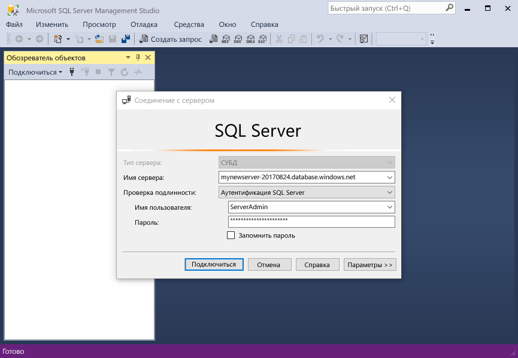

# <a name="design-your-first-azure-sql-database"></a>Проектирование первой базы данных SQL Azure

База данных SQL Azure — это реляционной базы данных как a служба (DBaaS) в hello облака Майкрософт («Azure»). В этом учебнике вы узнаете, как toouse hello портал Azure и [SQL Server Management Studio](https://msdn.microsoft.com/library/ms174173.aspx) (SSMS) для: 

> [!div class="checklist"]
> * Создание базы данных в hello портал Azure
> * Настройка правила брандмауэра уровня сервера в hello портал Azure
> * Подключитесь к SSMS toohello базы данных
> * создать таблицы с помощью SSMS;
> * выполнить массовую загрузку данных с помощью BCP;
> * запросить эти данные с помощью SSMS;
> * Восстановление предыдущих tooa базы данных hello [на момент времени восстановления](sql-database-recovery-using-backups.md#point-in-time-restore) в hello портал Azure

Если у вас еще нет подписки Azure, [создайте бесплатную учетную запись Azure](https://azure.microsoft.com/free/), прежде чем начинать работу.

## <a name="prerequisites"></a>Предварительные требования

toocomplete этого учебника, проверьте правильность установки:
- Hello новейшую версию [SQL Server Management Studio](https://msdn.microsoft.com/library/ms174173.aspx) (SSMS).
- Hello новейшую версию [BCP и SQLCMD](https://www.microsoft.com/download/details.aspx?id=36433).

## <a name="log-in-toohello-azure-portal"></a>Войдите в toohello портал Azure

Войдите в toohello [портал Azure](https://portal.azure.com/).

## <a name="create-a-blank-sql-database"></a>Создание пустой базы данных SQL

База данных Azure SQL создается с определенным набором [вычислительных ресурсов и ресурсов хранения](sql-database-service-tiers.md). Hello база данных создается в пределах [группы ресурсов Azure](../azure-resource-manager/resource-group-overview.md) и [логический сервер базы данных SQL Azure](sql-database-features.md). 

Выполните эти шаги toocreate пустую базу данных SQL. 

1. Нажмите кнопку hello **New** кнопка найдена в верхнем левом углу hello hello портал Azure.

2. Выберите **баз данных** из hello **New** и выберите **базы данных SQL** из hello **баз данных** страницы. 

   

3. Заполнение hello базы данных SQL формы с hello следующую информацию, как показано на hello предшествующий образа:   

   | Настройка       | Рекомендуемое значение | Описание | 
   | ------------ | ------------------ | ------------------------------------------------- | 
   | **Database name** (Имя базы данных) | mySampleDatabase | Допустимые имена баз данных см. в статье об [идентификаторах базы данных](https://docs.microsoft.com/sql/relational-databases/databases/database-identifiers). | 
   | **Подписка** | Ваша подписка  | Дополнительные сведения о подписках см. [здесь](https://account.windowsazure.com/Subscriptions). |
   | **Группа ресурсов** | myResourceGroup | Допустимые имена групп ресурсов см. в статье о [правилах и ограничениях именования](https://docs.microsoft.com/azure/architecture/best-practices/naming-conventions). |
   | **Выбрать источник** | Пустая база данных | Указывает, что должна быть создана пустая база данных. |

4. Нажмите кнопку **сервера** toocreate и настроить новый сервер для новой базы данных. Заполните hello **новую форму сервера** с hello следующую информацию: 

   | Настройка       | Рекомендуемое значение | Описание | 
   | ------------ | ------------------ | ------------------------------------------------- | 
   | **Server name** (Имя сервера) | Любое глобально уникальное имя | Допустимые имена серверов см. в статье о [правилах и ограничениях именования](https://docs.microsoft.com/azure/architecture/best-practices/naming-conventions). | 
   | **Имя для входа администратора сервера** | Любое допустимое имя | Допустимые имена входа см. в статье об [идентификаторах базы данных](https://docs.microsoft.com/sql/relational-databases/databases/database-identifiers).|
   | **Пароль** | Любой допустимый пароль | Пароль должен иметь по крайней мере 8 символов и должен содержать символы трех из следующих категорий hello: буквы в верхнем регистре, буквы в нижнем регистре, цифры и не буквенно-цифровых символов. |
   | **Расположение** | Любое допустимое расположение | Дополнительные сведения о регионах Azure см. [здесь](https://azure.microsoft.com/regions/). |

   

5. Нажмите кнопку **Выбрать**.

6. Нажмите кнопку **Ценовая категория** toospecify hello службы уровня и уровня производительности для новой базы данных. Для этого руководства выберите значения **20 DTU** и **250** ГБ хранилища.

   

7. Нажмите кнопку **Применить**.  

8. Выберите **сортировки** для hello пустой базы данных (в этом учебнике используется значение по умолчанию hello). Дополнительные сведения о параметрах сортировки см. в [этой статье](https://docs.microsoft.com/sql/t-sql/statements/collations).

9. Нажмите кнопку **создать** базы данных tooprovision hello. Подготовка занимает около минуты с половиной toocomplete. 

10. На панели инструментов hello, нажмите кнопку **уведомления** процесс развертывания toomonitor hello.

   

## <a name="create-a-server-level-firewall-rule"></a>создадим правило брандмауэра на уровне сервера;

Hello служба базы данных SQL создает брандмауэра на уровне сервера hello, невозможным подключение toohello сервера или любой базы данных на сервере hello, если правило брандмауэра создается tooopen hello брандмауэра для конкретных IP-адресов внешнего приложения и средства. Выполните эти действия toocreate [правила брандмауэра уровня сервера базы данных SQL](sql-database-firewall-configure.md) IP-адрес вашего клиента адресов и включить внешнее подключение через брандмауэр hello базы данных SQL для IP-адреса. 

> [!NOTE]
> База данных SQL обменивается данными через порт 1433. Если вы пытаетесь tooconnect из корпоративной сети, исходящий трафик через порт 1433 может оказаться невозможным брандмауэром вашей сети. В этом случае tooyour сервера базы данных SQL Azure не удается подключиться, если ИТ-отдел открывает порт 1433.
>

1. После завершения развертывания hello, нажмите кнопку **баз данных SQL** hello левого меню и выберите **mySampleDatabase** на hello **баз данных SQL** страницы. Hello страница общих сведений для вашей базы данных открывается, показывающая вы полностью hello доменное имя сервера (таких как **mynewserver20170313.database.windows.net**) и предоставляет параметры для дальнейшей настройки. Скопируйте полное имя сервера для использования в дальнейшем.

   > [!IMPORTANT]
   > Необходимо это полное имя tooconnect tooyour сервера и баз данных в последующих краткие руководства.
   > 

    

2. Нажмите кнопку **установить брандмауэр сервера** на hello инструментов, как показано на предыдущем рисунке hello. Hello **параметры брандмауэра** откроется страница приветствия базы данных SQL server. 

    


3. Нажмите кнопку **добавить IP-адрес клиента** на панели инструментов tooadd hello ваш текущий IP-адрес tooa нового правила брандмауэра. С использованием правила брандмауэра можно открыть порт 1433 для одного IP-адреса или диапазона IP-адресов.

4. Щелкните **Сохранить**. Для открытия порта 1433 на логическом сервере hello текущий IP-адрес создается правило брандмауэра уровня сервера.

    

4. Нажмите кнопку **ОК** , а затем закройте hello **параметры брандмауэра** страницы.

Теперь можно подключиться toohello базы данных SQL server и баз данных с помощью SQL Server Management Studio или другого средства по своему усмотрению с этого IP-адреса, с помощью учетной записи администратора сервера hello создали ранее.

> [!IMPORTANT]
> По умолчанию доступ через брандмауэр базы данных SQL hello включен для всех служб Azure. Нажмите кнопку **OFF** на этой странице toodisable для всех служб Azure.

## <a name="sql-server-connection-information"></a>Сведения о подключении SQL Server

Получите hello полное имя сервера для сервера базы данных SQL Azure в hello портал Azure. Можно использовать hello полное имя tooconnect tooyour сервер с помощью SQL Server Management Studio.

1. Войдите в toohello [портал Azure](https://portal.azure.com/).
2. Выберите **баз данных SQL** hello левом меню и выберите базу данных на hello **баз данных SQL** страницы. 
3. В hello **Essentials** панели hello странице портала Azure для базы данных, найдите и сохраните hello **имя сервера**.

   

## <a name="connect-toohello-database-with-ssms"></a>Подключитесь к SSMS toohello базы данных

Используйте [SQL Server Management Studio](https://docs.microsoft.com/sql/ssms/sql-server-management-studio-ssms) tooestablish сервером базы данных SQL Azure tooyour соединения.

1. Откройте среду SQL Server Management Studio.

2. В hello **подключения tooServer** диалогового окна введите hello следующую информацию:

   | Настройка       | Рекомендуемое значение | Описание | 
   | ------------ | ------------------ | ------------------------------------------------- | 
   | Тип сервера | Ядро СУБД | Это обязательное значение |
   | имя сервера; | Hello полное имя сервера | Hello имя должно быть примерно следующим образом: **mynewserver20170313.database.windows.net**. |
   | Аутентификация | проверка подлинности SQL Server | Проверка подлинности SQL — тип hello только проверку подлинности, который мы указали в этом учебнике. |
   | Вход | Учетная запись администратора сервера Hello | Это учетная запись hello, указанный при создании сервера hello. |
   | Пароль | Hello пароль для учетной записи администратора сервера | Это hello пароль, указанный при создании сервера hello. |

   

3. Нажмите кнопку **параметры** в hello **подключения tooserver** диалоговое окно. В hello **подключения toodatabase** введите **mySampleDatabase** базы данных toothis tooconnect.

     

4. Щелкните **Подключить**. Откроется окно обозревателя объектов Hello в среде SSMS. 

5. В обозревателе объектов разверните **баз данных** и разверните **mySampleDatabase** tooview объектов hello в образце hello базы данных.

     

## <a name="create-tables-in-hello-database"></a>Создание таблиц в базе данных hello 

Создайте схему базы данных с четырьмя таблицами, моделирующими систему управления студентами для университетов, с помощью [Transact-SQL](https://docs.microsoft.com/sql/t-sql/language-reference):

- Person
- Курс
- Студент
- Актив, моделирующий систему управления студентами для университетов

Hello следующей схеме показаны как эти таблицы являются другие связанные tooeach. Некоторые из этих таблиц ссылаются на столбцы в других таблицах. Например, таблица студента hello ссылается hello **PersonId** столбец hello **лицо** таблицы. Пример hello схема toounderstand как hello таблиц в этом учебнике, связанные tooone другой. Подробное рассмотрение как toocreate действующие базы данных таблицы, см. [создания эффективных баз данных таблиц](https://msdn.microsoft.com/library/cc505842.aspx). Дополнительные сведения о выборе типов данных см. в [этой статье](https://docs.microsoft.com/sql/t-sql/data-types/data-types-transact-sql).

> [!NOTE]
> Можно также использовать hello [конструктора таблиц в SQL Server Management Studio](https://msdn.microsoft.com/library/hh272695.aspx) toocreate и проектировании таблиц. 


1. В обозревателе объектов щелкните правой кнопкой мыши **mySampleDatabase** и выберите пункт **Новый запрос**. Пустое окно запроса, откроется tooyour подключенной базы данных.

2. В окне запроса hello выполните hello следующие четыре таблицы toocreate запросов в базе данных: 

   ```sql 
   -- Create Person table

   CREATE TABLE Person
   (
   PersonId   INT IDENTITY PRIMARY KEY,
   FirstName   NVARCHAR(128) NOT NULL,
   MiddelInitial NVARCHAR(10),
   LastName   NVARCHAR(128) NOT NULL,
   DateOfBirth   DATE NOT NULL
   )
   
   -- Create Student table
 
   CREATE TABLE Student
   (
   StudentId INT IDENTITY PRIMARY KEY,
   PersonId  INT REFERENCES Person (PersonId),
   Email   NVARCHAR(256)
   )
   
   -- Create Course table
 
   CREATE TABLE Course
   (
   CourseId  INT IDENTITY PRIMARY KEY,
   Name   NVARCHAR(50) NOT NULL,
   Teacher   NVARCHAR(256) NOT NULL
   ) 

   -- Create Credit table
 
   CREATE TABLE Credit
   (
   StudentId   INT REFERENCES Student (StudentId),
   CourseId   INT REFERENCES Course (CourseId),
   Grade   DECIMAL(5,2) CHECK (Grade <= 100.00),
   Attempt   TINYINT,
   CONSTRAINT  [UQ_studentgrades] UNIQUE CLUSTERED
   (
   StudentId, CourseId, Grade, Attempt
   )
   )
   ```

   

3. Разверните узел «таблицы» hello hello объект SQL Server Management Studio обозреватель toosee hello ранее созданной таблицы.

   

## <a name="load-data-into-hello-tables"></a>Загрузка данных в таблицы hello

1. Создайте папку с именем **SampleTableData** в папке загрузки toostore образцы данных для базы данных. 

2. Щелкните правой кнопкой мыши hello следующие ссылки и сохранить их в hello **SampleTableData** папки. 

   - [SampleCourseData](https://sqldbtutorial.blob.core.windows.net/tutorials/SampleCourseData)
   - [SamplePersonData](https://sqldbtutorial.blob.core.windows.net/tutorials/SamplePersonData)
   - [SampleStudentData](https://sqldbtutorial.blob.core.windows.net/tutorials/SampleStudentData)
   - [SampleCreditData](https://sqldbtutorial.blob.core.windows.net/tutorials/SampleCreditData)

3. Откройте окно командной строки и перейдите в папку SampleTableData toohello.

4. Выполните следующие команды tooinsert образец данных в таблицы hello, заменив значения hello для hello **ServerName**, **DatabaseName**, **UserName**и **Пароль** со значениями hello для вашей среды.
  
   ```bcp
   bcp Course in SampleCourseData -S <ServerName>.database.windows.net -d <DatabaseName> -U <Username> -P <password> -q -c -t ","
   bcp Person in SamplePersonData -S <ServerName>.database.windows.net -d <DatabaseName> -U <Username> -P <password> -q -c -t ","
   bcp Student in SampleStudentData -S <ServerName>.database.windows.net -d <DatabaseName> -U <Username> -P <password> -q -c -t ","
   bcp Credit in SampleCreditData -S <ServerName>.database.windows.net -d <DatabaseName> -U <Username> -P <password> -q -c -t ","
   ```

Теперь вы загрузили образец данных в таблицы hello, созданную ранее.

## <a name="query-data"></a>Запрос данных

Выполните следующие запросы tooretrieve сведения из таблиц базы данных hello hello. В разделе [написания SQL-запросов](https://technet.microsoft.com/library/bb264565.aspx) toolearn Дополнительные сведения о написании запросов SQL. первый запрос Hello соединяет все четыре таблицы toofind, при изучении всех студентов hello, "Доминик эти протоколы", имеющим более чем на 75% оценку в свой класс. второй запрос Hello соединяет все четыре таблицы и поиск всех курсов, в которых когда-либо зарегистрировал «Noe Coleman».

1. В окне запроса SQL Server Management Studio выполните приветствия при следующем запросе:

   ```sql 
   -- Find hello students taught by Dominick Pope who have a grade higher than 75%

   SELECT  person.FirstName,
   person.LastName,
   course.Name,
   credit.Grade
   FROM  Person AS person
   INNER JOIN Student AS student ON person.PersonId = student.PersonId
   INNER JOIN Credit AS credit ON student.StudentId = credit.StudentId
   INNER JOIN Course AS course ON credit.CourseId = course.courseId
   WHERE course.Teacher = 'Dominick Pope' 
   AND Grade > 75
   ```

2. В окне запроса SQL Server Management Studio выполните следующий запрос:

   ```sql
   -- Find all hello courses in which Noe Coleman has ever enrolled

   SELECT  course.Name,
   course.Teacher,
   credit.Grade
   FROM  Course AS course
   INNER JOIN Credit AS credit ON credit.CourseId = course.CourseId
   INNER JOIN Student AS student ON student.StudentId = credit.StudentId
   INNER JOIN Person AS person ON person.PersonId = student.PersonId
   WHERE person.FirstName = 'Noe'
   AND person.LastName = 'Coleman'
   ```

## <a name="restore-a-database-tooa-previous-point-in-time"></a>Восстановление предыдущей точки tooa базы данных времени

Представьте, что вы случайно удалили таблицу. Восстановить ее будет не просто. База данных SQL Azure позволяет вам toogo задней tooany точки времени в hello последнего вверх too35 дней и моментов времени tooa новой базы. Вы можете этой базы данных toorecover удаленные данные. Hello следующее hello образца базы данных tooa точки восстановления перед hello таблицы были добавлены.

1. На странице приветствия базы данных SQL для базы данных, нажмите кнопку **восстановить** на панели инструментов hello. Hello **восстановить** откроется страница.

   

2. Заполните hello **восстановить** формы с hello необходимые сведения:
    * Имя базы данных. Укажите имя базы данных. 
    * В момент: Выберите hello **в момент** на вкладке hello восстановления формы 
    * Точка восстановления: выберите время, которое происходит перед изменением базы данных hello
    * Целевой сервер. Это значение нельзя изменить при восстановлении базы данных. 
    * Пул эластичных баз данных. Выберите вариант **Нет**.  
    * Ценовая категория. Выберите **20 DTU** и хранилище объемом **250 ГБ**.

   

3. Нажмите кнопку **ОК** toorestore hello базы данных слишком[моментов времени tooa](sql-database-recovery-using-backups.md#point-in-time-restore) перед hello таблицы были добавлены. Восстановление базы данных tooa другой момент времени, создает базу данных дубликаты в hello сервере hello исходной базы данных на момент времени hello указать, поскольку он находится в пределах срока хранения hello вашей [уровня службы](sql-database-service-tiers.md).

## <a name="next-steps"></a>Дальнейшие действия 
В этом учебнике вы узнали, что базовые задачи базами данных, такие как создание базы данных и таблиц, загрузить и запрашивать данные и восстановить hello базы данных tooa предыдущий момент времени. Вы научились выполнять следующие задачи:
> [!div class="checklist"]
> * Создание базы данных
> * Настройка правила брандмауэра.
> * Соединения с базой данных, toohello [SQL Server Management Studio](https://msdn.microsoft.com/library/ms174173.aspx) (среда SSMS)
> * создание таблиц.
> * Массовая загрузка данных.
> * Запрос данных.
> * Hello базы данных tooa предыдущие точки восстановления времени с помощью базы данных SQL [на момент времени восстановления](sql-database-recovery-using-backups.md#point-in-time-restore) возможности

Переместить следующий учебник toolearn toohello о разработке базы данных с помощью Visual Studio и C#.

> [!div class="nextstepaction"]
>[Проектирование базы данных SQL Azure и подключение к ней с помощью C# и ADO.NET](sql-database-design-first-database-csharp.md)
