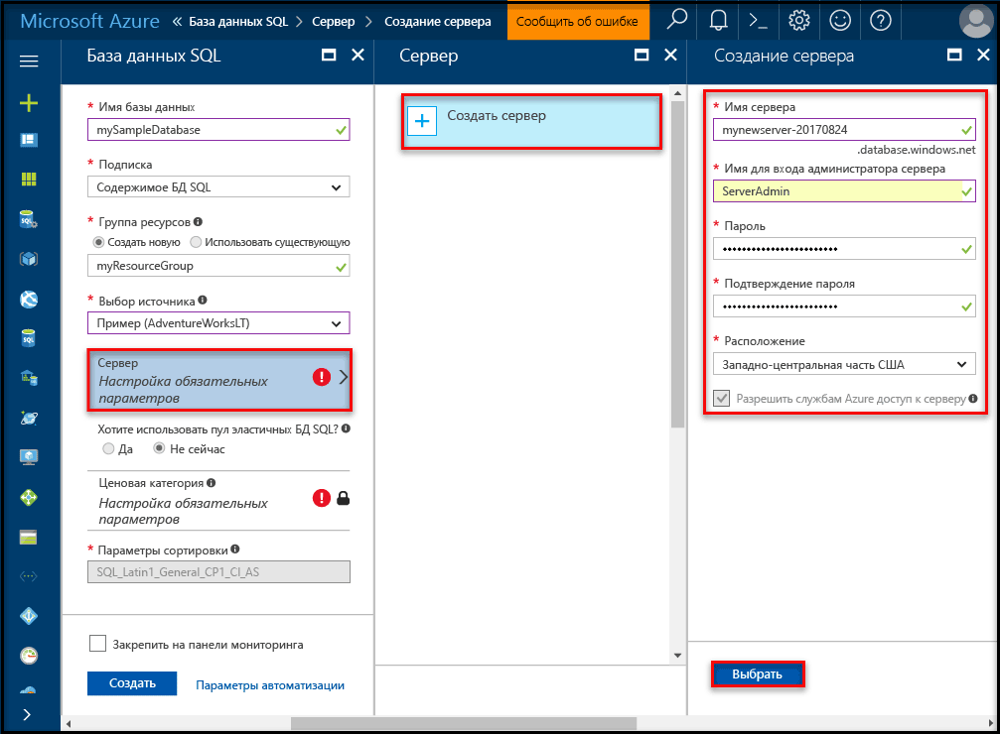
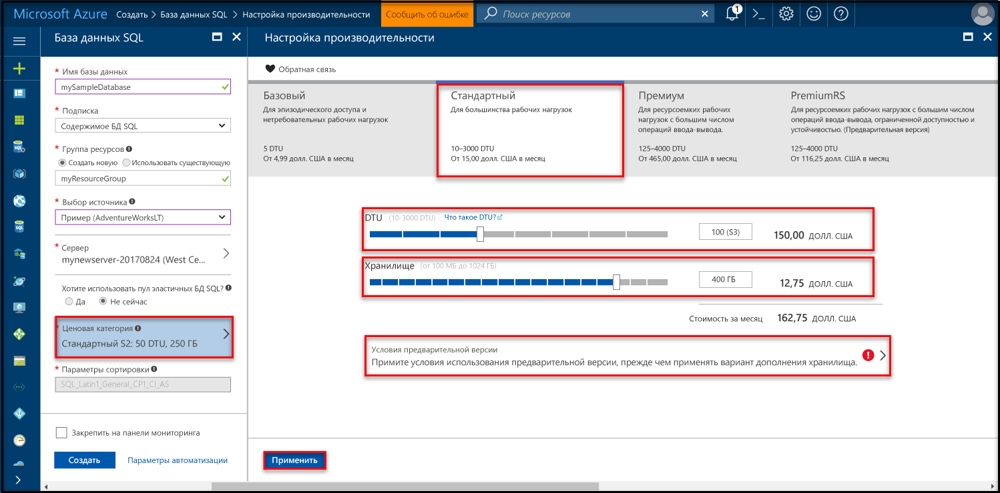

# <a name="create-an-azure-sql-database-in-hello-azure-portal"></a>Создание базы данных Azure SQL в hello портал Azure

Этого краткого руководства рассматриваются как toocreate SQL базы данных в Azure. База данных SQL Azure является «база данных как услуги», позволяющий toorun и масштаб высокой доступности баз данных SQL Server в облаке hello. В этом кратком руководстве показано, как tooget работу, создав базу данных SQL с помощью портала Azure hello.

Если у вас еще нет подписки Azure, создайте [бесплатную](https://azure.microsoft.com/free/) учетную запись Azure, прежде чем начинать работу.

## <a name="log-in-toohello-azure-portal"></a>Войдите в toohello портал Azure

Войдите в toohello [портал Azure](https://portal.azure.com/).

## <a name="create-a-sql-database"></a>Создание базы данных SQL

База данных Azure SQL создается с определенным набором [вычислительных ресурсов и ресурсов хранения](sql-database-service-tiers.md). Hello база данных создается в пределах [группы ресурсов Azure](../azure-resource-manager/resource-group-overview.md) и [логический сервер базы данных SQL Azure](sql-database-features.md). 

Выполните эти шаги toocreate базы данных SQL с образцами данных Adventure Works LT hello. 

1. Нажмите кнопку hello **New** кнопка найдена в верхнем левом углу hello hello портал Azure.

2. Выберите **баз данных** из hello **New** и выберите **базы данных SQL** из hello **баз данных** страницы.

   

3. Заполнение hello базы данных SQL формы с hello следующую информацию, как показано на hello предшествующий образа:   

   | Настройка       | Рекомендуемое значение | Описание | 
   | ------------ | ------------------ | ------------------------------------------------- | 
   | **Database name** (Имя базы данных) | mySampleDatabase | Допустимые имена баз данных см. в статье об [идентификаторах базы данных](https://docs.microsoft.com/en-us/sql/relational-databases/databases/database-identifiers). | 
   | **Подписка** | Ваша подписка  | Дополнительные сведения о подписках см. [здесь](https://account.windowsazure.com/Subscriptions). |
   | **Группа ресурсов**  | myResourceGroup | Допустимые имена групп ресурсов см. в статье о [правилах и ограничениях именования](https://docs.microsoft.com/azure/architecture/best-practices/naming-conventions). |
   | **Источник** | Пример (AdventureWorksLT) | Загружает hello AdventureWorksLT схему и данные в новую базу данных |

   > [!IMPORTANT]
   > Необходимо выбрать hello образца базы данных в этой форме, так как он используется в hello оставшейся части данного краткого руководства.
   > 

4. В разделе **сервера**, нажмите кнопку **настроить необходимые параметры** и заполните hello SQL server (логический сервер) формы с hello следующую информацию, как показано на hello после изображения:   

   | Настройка       | Рекомендуемое значение | Описание | 
   | ------------ | ------------------ | ------------------------------------------------- | 
   | **Server name** (Имя сервера) | Любое глобально уникальное имя | Допустимые имена серверов см. в статье о [правилах и ограничениях именования](https://docs.microsoft.com/azure/architecture/best-practices/naming-conventions). | 
   | **Имя для входа администратора сервера** | Любое допустимое имя | Допустимые имена входа см. в статье об [идентификаторах базы данных](https://docs.microsoft.com/en-us/sql/relational-databases/databases/database-identifiers). |
   | **Пароль** | Любой допустимый пароль | Пароль должен иметь по крайней мере 8 символов и должен содержать символы трех из следующих категорий hello: буквы в верхнем регистре, буквы в нижнем регистре, цифры и и отличные от буквенно-цифровых символов. |
   | **Подписка** | Ваша подписка | Дополнительные сведения о подписках см. [здесь](https://account.windowsazure.com/Subscriptions). |
   | **Группа ресурсов** | myResourceGroup | Допустимые имена групп ресурсов см. в статье о [правилах и ограничениях именования](https://docs.microsoft.com/azure/architecture/best-practices/naming-conventions). |
   | **Расположение** | Любое допустимое расположение | Дополнительные сведения о регионах Azure см. [здесь](https://azure.microsoft.com/regions/). |

   > [!IMPORTANT]
   > Имя входа администратора сервера Hello и пароль, указанные здесь являются необходимые toolog в toohello сервера и баз данных далее в этом кратком руководстве. Запомните или запишите эту информацию для последующего использования. 
   >  

   

5. После завершения hello формы щелкните **выберите**.

6. Нажмите кнопку **Ценовая категория** toospecify hello службы уровня и уровня производительности для новой базы данных. Используйте ползунок tooselect hello **20 Dtu** и **250** ГБ хранилища. Дополнительные сведения о DTU см. в статье [Общие сведения об обычных единицах передачи данных (DTU) и единицах передачи данных в эластичной базе данных (eDTU)](sql-database-what-is-a-dtu.md).

   

7. После выбранного hello количество Dtu, нажмите кнопку **применить**.  

8. После выполнения формы hello базы данных SQL щелкните **создать** базы данных tooprovision hello. Подготовка занимает несколько минут. 

9. На панели инструментов hello, нажмите кнопку **уведомления** процесс развертывания toomonitor hello.

   

## <a name="create-a-server-level-firewall-rule"></a>создадим правило брандмауэра на уровне сервера;

Hello служба базы данных SQL создает брандмауэра на уровне сервера hello, невозможным подключение toohello сервера или любой базы данных на сервере hello, если правило брандмауэра создается tooopen hello брандмауэра для конкретных IP-адресов внешнего приложения и средства. Выполните эти действия toocreate [правила брандмауэра уровня сервера базы данных SQL](sql-database-firewall-configure.md) IP-адрес вашего клиента адресов и включить внешнее подключение через брандмауэр hello базы данных SQL для IP-адреса. 

> [!NOTE]
> База данных SQL обменивается данными через порт 1433. Если вы пытаетесь tooconnect из корпоративной сети, исходящий трафик через порт 1433 может оказаться невозможным брандмауэром вашей сети. В этом случае tooyour сервера базы данных SQL Azure не удается подключиться, если ИТ-отдел открывает порт 1433.
>

1. После завершения развертывания hello, нажмите кнопку **баз данных SQL** hello левого меню и выберите **mySampleDatabase** на hello **баз данных SQL** страницы. Hello страница общих сведений для вашей базы данных открывается, показывающая вы полностью hello доменное имя сервера (таких как **mynewserver20170313.database.windows.net**) и предоставляет параметры для дальнейшей настройки. Скопируйте полное имя сервера для использования в дальнейшем.

   > [!IMPORTANT]
   > Необходимо это полное имя tooconnect tooyour сервера и баз данных в последующих краткие руководства.
   > 

    

2. Нажмите кнопку **установить брандмауэр сервера** на hello инструментов, как показано на предыдущем рисунке hello. Hello **параметры брандмауэра** откроется страница приветствия базы данных SQL server. 

    

3. Нажмите кнопку **добавить IP-адрес клиента** на панели инструментов tooadd hello ваш текущий IP-адрес tooa нового правила брандмауэра. С использованием правила брандмауэра можно открыть порт 1433 для одного IP-адреса или диапазона IP-адресов.

4. Щелкните **Сохранить**. Для открытия порта 1433 на логическом сервере hello текущий IP-адрес создается правило брандмауэра уровня сервера.

    

4. Нажмите кнопку **ОК** , а затем закройте hello **параметры брандмауэра** страницы.

Теперь можно подключиться toohello базы данных SQL server и баз данных с помощью SQL Server Management Studio или другого средства по своему усмотрению с этого IP-адреса, с помощью учетной записи администратора сервера hello создали ранее.

> [!IMPORTANT]
> По умолчанию доступ через брандмауэр базы данных SQL hello включен для всех служб Azure. Нажмите кнопку **OFF** на этой странице toodisable для всех служб Azure.
>

## <a name="query-hello-sql-database"></a>Hello запрос SQL к базе данных

Теперь, когда вы создали образец базы данных в Azure, воспользуемся hello встроенное средство запроса в пределах hello Azure портала tooconfirm, возможность подключения toohello базы данных и запроса данных hello. 

1. На странице приветствия базы данных SQL для базы данных, нажмите кнопку **средства** на панели инструментов hello. Hello **средства** откроется страница.

    

2. Нажмите кнопку **редактора запросов (Предварительная версия)**, щелкните hello **Предварительный просмотр условия** флажок, а затем нажмите кнопку **ОК**. Откроется страница редактор запросов Hello.

3. Нажмите кнопку **входа** и при появлении запроса выберите **проверки подлинности SQL server** и укажите имя входа администратора сервера hello и пароль, созданный ранее.

    

4. Нажмите кнопку **ОК** toolog в.

5. После проверки подлинности, введите hello в следующем запросе в hello окна редактора запросов.

   ```sql
   SELECT TOP 20 pc.Name as CategoryName, p.name as ProductName
   FROM SalesLT.ProductCategory pc
   JOIN SalesLT.Product p
   ON pc.productcategoryid = p.productcategoryid;
   ```

6. Нажмите кнопку **запуска** и просмотрите результаты запроса hello в hello **результатов** области.

   

7. Закрыть hello **редактора запросов** страницы и hello **средства** страницы.

## <a name="clean-up-resources"></a>Очистка ресурсов

Если эти ресурсы не требуется для другой учебник (см. [дальнейшие действия](#next-steps)), их можно удалить, выполнив hello ниже:


1. Hello слева в меню портала Azure hello, пункт **групп ресурсов** и нажмите кнопку **myResourceGroup**. 
2. На странице группы ресурсов, нажмите кнопку **удаление**, тип **myResourceGroup** в hello текстовое поле и нажмите кнопку **удалить**.

## <a name="next-steps"></a>Дальнейшие действия

Теперь, когда у вас есть база данных, вы можете подключиться и создать запрос, используя привычные средства. См. дополнительные сведения о доступных средствах:

- [SQL Server Management Studio](sql-database-connect-query-ssms.md)
- [Visual Studio Code](sql-database-connect-query-vscode.md)
- [.NET](sql-database-connect-query-dotnet.md)
- [PHP](sql-database-connect-query-php.md)
- [Node.js](sql-database-connect-query-nodejs.md)
- [Java](sql-database-connect-query-java.md)
- [Python](sql-database-connect-query-python.md)
- [Ruby](sql-database-connect-query-ruby.md)
