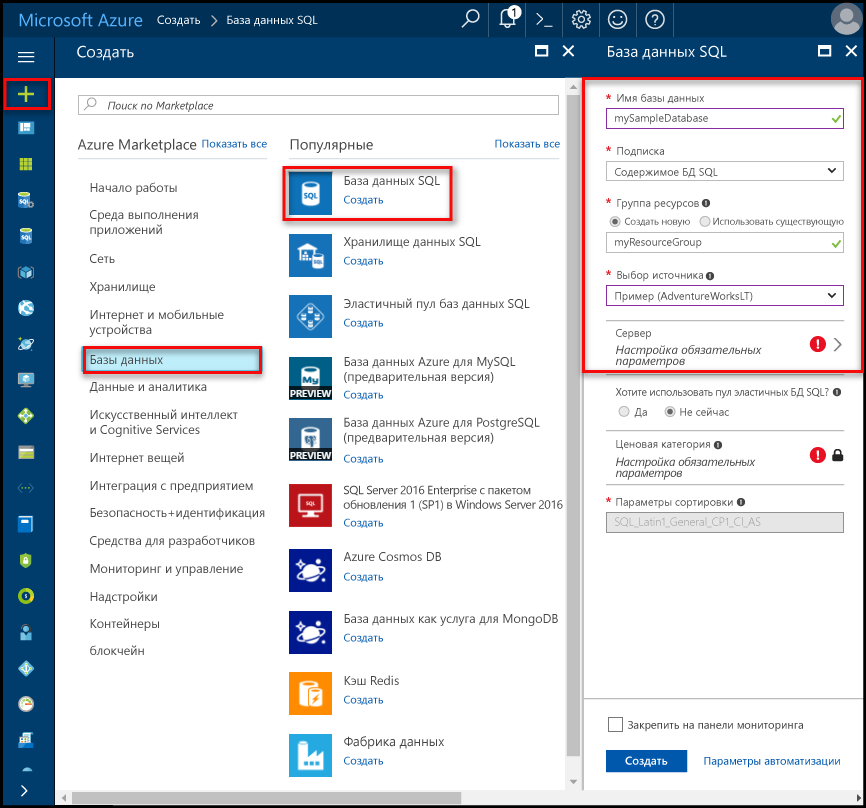

# <a name="create-an-azure-sql-database-in-hello-azure-portal"></a><span data-ttu-id="6055f-105">Создание базы данных Azure SQL в hello портал Azure</span><span class="sxs-lookup"><span data-stu-id="6055f-105">Create an Azure SQL database in hello Azure portal</span></span>

<span data-ttu-id="6055f-106">Этого краткого руководства рассматриваются как toocreate SQL базы данных в Azure.</span><span class="sxs-lookup"><span data-stu-id="6055f-106">This quick start tutorial walks through how toocreate a SQL database in Azure.</span></span> <span data-ttu-id="6055f-107">База данных SQL Azure является «база данных как услуги», позволяющий toorun и масштаб высокой доступности баз данных SQL Server в облаке hello.</span><span class="sxs-lookup"><span data-stu-id="6055f-107">Azure SQL Database is a “Database-as-a-Service” offering that enables you toorun and scale highly available SQL Server databases in hello cloud.</span></span> <span data-ttu-id="6055f-108">В этом кратком руководстве показано, как tooget работу, создав базу данных SQL с помощью портала Azure hello.</span><span class="sxs-lookup"><span data-stu-id="6055f-108">This quick start shows you how tooget started by creating a SQL database using hello Azure portal.</span></span>

<span data-ttu-id="6055f-109">Если у вас еще нет подписки Azure, создайте [бесплатную](https://azure.microsoft.com/free/) учетную запись Azure, прежде чем начинать работу.</span><span class="sxs-lookup"><span data-stu-id="6055f-109">If you don't have an Azure subscription, create a [free](https://azure.microsoft.com/free/) account before you begin.</span></span>

## <a name="log-in-toohello-azure-portal"></a><span data-ttu-id="6055f-110">Войдите в toohello портал Azure</span><span class="sxs-lookup"><span data-stu-id="6055f-110">Log in toohello Azure portal</span></span>

<span data-ttu-id="6055f-111">Войдите в toohello [портал Azure](https://portal.azure.com/).</span><span class="sxs-lookup"><span data-stu-id="6055f-111">Log in toohello [Azure portal](https://portal.azure.com/).</span></span>

## <a name="create-a-sql-database"></a><span data-ttu-id="6055f-112">Создание базы данных SQL</span><span class="sxs-lookup"><span data-stu-id="6055f-112">Create a SQL database</span></span>

<span data-ttu-id="6055f-113">База данных Azure SQL создается с определенным набором [вычислительных ресурсов и ресурсов хранения](sql-database-service-tiers.md).</span><span class="sxs-lookup"><span data-stu-id="6055f-113">An Azure SQL database is created with a defined set of [compute and storage resources](sql-database-service-tiers.md).</span></span> <span data-ttu-id="6055f-114">Hello база данных создается в пределах [группы ресурсов Azure](../azure-resource-manager/resource-group-overview.md) и [логический сервер базы данных SQL Azure](sql-database-features.md).</span><span class="sxs-lookup"><span data-stu-id="6055f-114">hello database is created within an [Azure resource group](../azure-resource-manager/resource-group-overview.md) and in an [Azure SQL Database logical server](sql-database-features.md).</span></span> 

<span data-ttu-id="6055f-115">Выполните эти шаги toocreate базы данных SQL с образцами данных Adventure Works LT hello.</span><span class="sxs-lookup"><span data-stu-id="6055f-115">Follow these steps toocreate a SQL database containing hello Adventure Works LT sample data.</span></span> 

1. <span data-ttu-id="6055f-116">Нажмите кнопку hello **New** кнопка найдена в верхнем левом углу hello hello портал Azure.</span><span class="sxs-lookup"><span data-stu-id="6055f-116">Click hello **New** button found on hello upper left-hand corner of hello Azure portal.</span></span>

2. <span data-ttu-id="6055f-117">Выберите **баз данных** из hello **New** и выберите **базы данных SQL** из hello **баз данных** страницы.</span><span class="sxs-lookup"><span data-stu-id="6055f-117">Select **Databases** from hello **New** page, and select **SQL Database** from hello **Databases** page.</span></span>

   

3. <span data-ttu-id="6055f-119">Заполнение hello базы данных SQL формы с hello следующую информацию, как показано на hello предшествующий образа:</span><span class="sxs-lookup"><span data-stu-id="6055f-119">Fill out hello SQL Database form with hello following information, as shown on hello preceding image:</span></span>   

   | <span data-ttu-id="6055f-120">Настройка</span><span class="sxs-lookup"><span data-stu-id="6055f-120">Setting</span></span>       | <span data-ttu-id="6055f-121">Рекомендуемое значение</span><span class="sxs-lookup"><span data-stu-id="6055f-121">Suggested value</span></span> | <span data-ttu-id="6055f-122">Описание</span><span class="sxs-lookup"><span data-stu-id="6055f-122">Description</span></span> | 
   | ------------ | ------------------ | ------------------------------------------------- | 
   | <span data-ttu-id="6055f-123">**Database name** (Имя базы данных)</span><span class="sxs-lookup"><span data-stu-id="6055f-123">**Database name**</span></span> | <span data-ttu-id="6055f-124">mySampleDatabase</span><span class="sxs-lookup"><span data-stu-id="6055f-124">mySampleDatabase</span></span> | <span data-ttu-id="6055f-125">Допустимые имена баз данных см. в статье об [идентификаторах базы данных](https://docs.microsoft.com/en-us/sql/relational-databases/databases/database-identifiers).</span><span class="sxs-lookup"><span data-stu-id="6055f-125">For valid database names, see [Database Identifiers](https://docs.microsoft.com/en-us/sql/relational-databases/databases/database-identifiers).</span></span> | 
   | <span data-ttu-id="6055f-126">**Подписка**</span><span class="sxs-lookup"><span data-stu-id="6055f-126">**Subscription**</span></span> | <span data-ttu-id="6055f-127">Ваша подписка</span><span class="sxs-lookup"><span data-stu-id="6055f-127">Your subscription</span></span>  | <span data-ttu-id="6055f-128">Дополнительные сведения о подписках см. [здесь](https://account.windowsazure.com/Subscriptions).</span><span class="sxs-lookup"><span data-stu-id="6055f-128">For details about your subscriptions, see [Subscriptions](https://account.windowsazure.com/Subscriptions).</span></span> |
   | <span data-ttu-id="6055f-129">**Группа ресурсов**</span><span class="sxs-lookup"><span data-stu-id="6055f-129">**Resource group**</span></span>  | <span data-ttu-id="6055f-130">myResourceGroup</span><span class="sxs-lookup"><span data-stu-id="6055f-130">myResourceGroup</span></span> | <span data-ttu-id="6055f-131">Допустимые имена групп ресурсов см. в статье о [правилах и ограничениях именования](https://docs.microsoft.com/azure/architecture/best-practices/naming-conventions).</span><span class="sxs-lookup"><span data-stu-id="6055f-131">For valid resource group names, see [Naming rules and restrictions](https://docs.microsoft.com/azure/architecture/best-practices/naming-conventions).</span></span> |
   | <span data-ttu-id="6055f-132">**Источник**</span><span class="sxs-lookup"><span data-stu-id="6055f-132">**Source source**</span></span> | <span data-ttu-id="6055f-133">Пример (AdventureWorksLT)</span><span class="sxs-lookup"><span data-stu-id="6055f-133">Sample (AdventureWorksLT)</span></span> | <span data-ttu-id="6055f-134">Загружает hello AdventureWorksLT схему и данные в новую базу данных</span><span class="sxs-lookup"><span data-stu-id="6055f-134">Loads hello AdventureWorksLT schema and data into your new database</span></span> |

   > [!IMPORTANT]
   > <span data-ttu-id="6055f-135">Необходимо выбрать hello образца базы данных в этой форме, так как он используется в hello оставшейся части данного краткого руководства.</span><span class="sxs-lookup"><span data-stu-id="6055f-135">You must select hello sample database on this form because it is used in hello remainder of this quick start.</span></span>
   > 

4. <span data-ttu-id="6055f-136">В разделе **сервера**, нажмите кнопку **настроить необходимые параметры** и заполните hello SQL server (логический сервер) формы с hello следующую информацию, как показано на hello после изображения:</span><span class="sxs-lookup"><span data-stu-id="6055f-136">Under **Server**, click **Configure required settings** and fill out hello SQL server (logical server) form with hello following information, as shown on hello following image:</span></span>   

   | <span data-ttu-id="6055f-137">Настройка</span><span class="sxs-lookup"><span data-stu-id="6055f-137">Setting</span></span>       | <span data-ttu-id="6055f-138">Рекомендуемое значение</span><span class="sxs-lookup"><span data-stu-id="6055f-138">Suggested value</span></span> | <span data-ttu-id="6055f-139">Описание</span><span class="sxs-lookup"><span data-stu-id="6055f-139">Description</span></span> | 
   | ------------ | ------------------ | ------------------------------------------------- | 
   | <span data-ttu-id="6055f-140">**Server name** (Имя сервера)</span><span class="sxs-lookup"><span data-stu-id="6055f-140">**Server name**</span></span> | <span data-ttu-id="6055f-141">Любое глобально уникальное имя</span><span class="sxs-lookup"><span data-stu-id="6055f-141">Any globally unique name</span></span> | <span data-ttu-id="6055f-142">Допустимые имена серверов см. в статье о [правилах и ограничениях именования](https://docs.microsoft.com/azure/architecture/best-practices/naming-conventions).</span><span class="sxs-lookup"><span data-stu-id="6055f-142">For valid server names, see [Naming rules and restrictions](https://docs.microsoft.com/azure/architecture/best-practices/naming-conventions).</span></span> | 
   | <span data-ttu-id="6055f-143">**Имя для входа администратора сервера**</span><span class="sxs-lookup"><span data-stu-id="6055f-143">**Server admin login**</span></span> | <span data-ttu-id="6055f-144">Любое допустимое имя</span><span class="sxs-lookup"><span data-stu-id="6055f-144">Any valid name</span></span> | <span data-ttu-id="6055f-145">Допустимые имена входа см. в статье об [идентификаторах базы данных](https://docs.microsoft.com/en-us/sql/relational-databases/databases/database-identifiers).</span><span class="sxs-lookup"><span data-stu-id="6055f-145">For valid login names, see [Database Identifiers](https://docs.microsoft.com/en-us/sql/relational-databases/databases/database-identifiers).</span></span> |
   | <span data-ttu-id="6055f-146">**Пароль**</span><span class="sxs-lookup"><span data-stu-id="6055f-146">**Password**</span></span> | <span data-ttu-id="6055f-147">Любой допустимый пароль</span><span class="sxs-lookup"><span data-stu-id="6055f-147">Any valid password</span></span> | <span data-ttu-id="6055f-148">Пароль должен иметь по крайней мере 8 символов и должен содержать символы трех из следующих категорий hello: буквы в верхнем регистре, буквы в нижнем регистре, цифры и и отличные от буквенно-цифровых символов.</span><span class="sxs-lookup"><span data-stu-id="6055f-148">Your password must have at least 8 characters and must contain characters from three of hello following categories: upper case characters, lower case characters, numbers, and and non-alphanumeric characters.</span></span> |
   | <span data-ttu-id="6055f-149">**Подписка**</span><span class="sxs-lookup"><span data-stu-id="6055f-149">**Subscription**</span></span> | <span data-ttu-id="6055f-150">Ваша подписка</span><span class="sxs-lookup"><span data-stu-id="6055f-150">Your subscription</span></span> | <span data-ttu-id="6055f-151">Дополнительные сведения о подписках см. [здесь](https://account.windowsazure.com/Subscriptions).</span><span class="sxs-lookup"><span data-stu-id="6055f-151">For details about your subscriptions, see [Subscriptions](https://account.windowsazure.com/Subscriptions).</span></span> |
   | <span data-ttu-id="6055f-152">**Группа ресурсов**</span><span class="sxs-lookup"><span data-stu-id="6055f-152">**Resource group**</span></span> | <span data-ttu-id="6055f-153">myResourceGroup</span><span class="sxs-lookup"><span data-stu-id="6055f-153">myResourceGroup</span></span> | <span data-ttu-id="6055f-154">Допустимые имена групп ресурсов см. в статье о [правилах и ограничениях именования](https://docs.microsoft.com/azure/architecture/best-practices/naming-conventions).</span><span class="sxs-lookup"><span data-stu-id="6055f-154">For valid resource group names, see [Naming rules and restrictions](https://docs.microsoft.com/azure/architecture/best-practices/naming-conventions).</span></span> |
   | <span data-ttu-id="6055f-155">**Расположение**</span><span class="sxs-lookup"><span data-stu-id="6055f-155">**Location**</span></span> | <span data-ttu-id="6055f-156">Любое допустимое расположение</span><span class="sxs-lookup"><span data-stu-id="6055f-156">Any valid location</span></span> | <span data-ttu-id="6055f-157">Дополнительные сведения о регионах Azure см. [здесь](https://azure.microsoft.com/regions/).</span><span class="sxs-lookup"><span data-stu-id="6055f-157">For information about regions, see [Azure Regions](https://azure.microsoft.com/regions/).</span></span> |

   > [!IMPORTANT]
   > <span data-ttu-id="6055f-158">Имя входа администратора сервера Hello и пароль, указанные здесь являются необходимые toolog в toohello сервера и баз данных далее в этом кратком руководстве.</span><span class="sxs-lookup"><span data-stu-id="6055f-158">hello server admin login and password that you specify here are required toolog in toohello server and its databases later in this quick start.</span></span> <span data-ttu-id="6055f-159">Запомните или запишите эту информацию для последующего использования.</span><span class="sxs-lookup"><span data-stu-id="6055f-159">Remember or record this information for later use.</span></span> 
   >  

   

5. <span data-ttu-id="6055f-161">После завершения hello формы щелкните **выберите**.</span><span class="sxs-lookup"><span data-stu-id="6055f-161">When you have completed hello form, click **Select**.</span></span>

6. <span data-ttu-id="6055f-162">Нажмите кнопку **Ценовая категория** toospecify hello службы уровня и уровня производительности для новой базы данных.</span><span class="sxs-lookup"><span data-stu-id="6055f-162">Click **Pricing tier** toospecify hello service tier and performance level for your new database.</span></span> <span data-ttu-id="6055f-163">Используйте ползунок tooselect hello **20 Dtu** и **250** ГБ хранилища.</span><span class="sxs-lookup"><span data-stu-id="6055f-163">Use hello slider tooselect **20 DTUs** and **250** GB of storage.</span></span> <span data-ttu-id="6055f-164">Дополнительные сведения о DTU см. в статье [Общие сведения об обычных единицах передачи данных (DTU) и единицах передачи данных в эластичной базе данных (eDTU)](sql-database-what-is-a-dtu.md).</span><span class="sxs-lookup"><span data-stu-id="6055f-164">For more information on DTUs, see [What is a DTU?](sql-database-what-is-a-dtu.md).</span></span>

   

7. <span data-ttu-id="6055f-166">После выбранного hello количество Dtu, нажмите кнопку **применить**.</span><span class="sxs-lookup"><span data-stu-id="6055f-166">After selected hello amount of DTUs, click **Apply**.</span></span>  

8. <span data-ttu-id="6055f-167">После выполнения формы hello базы данных SQL щелкните **создать** базы данных tooprovision hello.</span><span class="sxs-lookup"><span data-stu-id="6055f-167">Now that you have completed hello SQL Database form, click **Create** tooprovision hello database.</span></span> <span data-ttu-id="6055f-168">Подготовка занимает несколько минут.</span><span class="sxs-lookup"><span data-stu-id="6055f-168">Provisioning takes a few minutes.</span></span> 

9. <span data-ttu-id="6055f-169">На панели инструментов hello, нажмите кнопку **уведомления** процесс развертывания toomonitor hello.</span><span class="sxs-lookup"><span data-stu-id="6055f-169">On hello toolbar, click **Notifications** toomonitor hello deployment process.</span></span>

   

## <a name="create-a-server-level-firewall-rule"></a><span data-ttu-id="6055f-171">создадим правило брандмауэра на уровне сервера;</span><span class="sxs-lookup"><span data-stu-id="6055f-171">Create a server-level firewall rule</span></span>

<span data-ttu-id="6055f-172">Hello служба базы данных SQL создает брандмауэра на уровне сервера hello, невозможным подключение toohello сервера или любой базы данных на сервере hello, если правило брандмауэра создается tooopen hello брандмауэра для конкретных IP-адресов внешнего приложения и средства.</span><span class="sxs-lookup"><span data-stu-id="6055f-172">hello SQL Database service creates a firewall at hello server-level that prevents external applications and tools from connecting toohello server or any databases on hello server unless a firewall rule is created tooopen hello firewall for specific IP addresses.</span></span> <span data-ttu-id="6055f-173">Выполните эти действия toocreate [правила брандмауэра уровня сервера базы данных SQL](sql-database-firewall-configure.md) IP-адрес вашего клиента адресов и включить внешнее подключение через брандмауэр hello базы данных SQL для IP-адреса.</span><span class="sxs-lookup"><span data-stu-id="6055f-173">Follow these steps toocreate a [SQL Database server-level firewall rule](sql-database-firewall-configure.md) for your client's IP address and enable external connectivity through hello SQL Database firewall for your IP address only.</span></span> 

> [!NOTE]
> <span data-ttu-id="6055f-174">База данных SQL обменивается данными через порт 1433.</span><span class="sxs-lookup"><span data-stu-id="6055f-174">SQL Database communicates over port 1433.</span></span> <span data-ttu-id="6055f-175">Если вы пытаетесь tooconnect из корпоративной сети, исходящий трафик через порт 1433 может оказаться невозможным брандмауэром вашей сети.</span><span class="sxs-lookup"><span data-stu-id="6055f-175">If you are trying tooconnect from within a corporate network, outbound traffic over port 1433 may not be allowed by your network's firewall.</span></span> <span data-ttu-id="6055f-176">В этом случае tooyour сервера базы данных SQL Azure не удается подключиться, если ИТ-отдел открывает порт 1433.</span><span class="sxs-lookup"><span data-stu-id="6055f-176">If so, you cannot connect tooyour Azure SQL Database server unless your IT department opens port 1433.</span></span>
>

1. <span data-ttu-id="6055f-177">После завершения развертывания hello, нажмите кнопку **баз данных SQL** hello левого меню и выберите **mySampleDatabase** на hello **баз данных SQL** страницы.</span><span class="sxs-lookup"><span data-stu-id="6055f-177">After hello deployment completes, click **SQL databases** from hello left-hand menu and then click **mySampleDatabase** on hello **SQL databases** page.</span></span> <span data-ttu-id="6055f-178">Hello страница общих сведений для вашей базы данных открывается, показывающая вы полностью hello доменное имя сервера (таких как **mynewserver20170313.database.windows.net**) и предоставляет параметры для дальнейшей настройки.</span><span class="sxs-lookup"><span data-stu-id="6055f-178">hello overview page for your database opens, showing you hello fully qualified server name (such as **mynewserver20170313.database.windows.net**) and provides options for further configuration.</span></span> <span data-ttu-id="6055f-179">Скопируйте полное имя сервера для использования в дальнейшем.</span><span class="sxs-lookup"><span data-stu-id="6055f-179">Copy this fully qualified server name for use later.</span></span>

   > [!IMPORTANT]
   > <span data-ttu-id="6055f-180">Необходимо это полное имя tooconnect tooyour сервера и баз данных в последующих краткие руководства.</span><span class="sxs-lookup"><span data-stu-id="6055f-180">You need this fully qualified server name tooconnect tooyour server and its databases in subsequent quick starts.</span></span>
   > 

    

2. <span data-ttu-id="6055f-182">Нажмите кнопку **установить брандмауэр сервера** на hello инструментов, как показано на предыдущем рисунке hello.</span><span class="sxs-lookup"><span data-stu-id="6055f-182">Click **Set server firewall** on hello toolbar as shown in hello previous image.</span></span> <span data-ttu-id="6055f-183">Hello **параметры брандмауэра** откроется страница приветствия базы данных SQL server.</span><span class="sxs-lookup"><span data-stu-id="6055f-183">hello **Firewall settings** page for hello SQL Database server opens.</span></span> 

    

3. <span data-ttu-id="6055f-185">Нажмите кнопку **добавить IP-адрес клиента** на панели инструментов tooadd hello ваш текущий IP-адрес tooa нового правила брандмауэра.</span><span class="sxs-lookup"><span data-stu-id="6055f-185">Click **Add client IP** on hello toolbar tooadd your current IP address tooa new firewall rule.</span></span> <span data-ttu-id="6055f-186">С использованием правила брандмауэра можно открыть порт 1433 для одного IP-адреса или диапазона IP-адресов.</span><span class="sxs-lookup"><span data-stu-id="6055f-186">A firewall rule can open port 1433 for a single IP address or a range of IP addresses.</span></span>

4. <span data-ttu-id="6055f-187">Щелкните **Сохранить**.</span><span class="sxs-lookup"><span data-stu-id="6055f-187">Click **Save**.</span></span> <span data-ttu-id="6055f-188">Для открытия порта 1433 на логическом сервере hello текущий IP-адрес создается правило брандмауэра уровня сервера.</span><span class="sxs-lookup"><span data-stu-id="6055f-188">A server-level firewall rule is created for your current IP address opening port 1433 on hello logical server.</span></span>

    

4. <span data-ttu-id="6055f-190">Нажмите кнопку **ОК** , а затем закройте hello **параметры брандмауэра** страницы.</span><span class="sxs-lookup"><span data-stu-id="6055f-190">Click **OK** and then close hello **Firewall settings** page.</span></span>

<span data-ttu-id="6055f-191">Теперь можно подключиться toohello базы данных SQL server и баз данных с помощью SQL Server Management Studio или другого средства по своему усмотрению с этого IP-адреса, с помощью учетной записи администратора сервера hello создали ранее.</span><span class="sxs-lookup"><span data-stu-id="6055f-191">You can now connect toohello SQL Database server and its databases using SQL Server Management Studio or another tool of your choice from this IP address using hello server admin account created previously.</span></span>

> [!IMPORTANT]
> <span data-ttu-id="6055f-192">По умолчанию доступ через брандмауэр базы данных SQL hello включен для всех служб Azure.</span><span class="sxs-lookup"><span data-stu-id="6055f-192">By default, access through hello SQL Database firewall is enabled for all Azure services.</span></span> <span data-ttu-id="6055f-193">Нажмите кнопку **OFF** на этой странице toodisable для всех служб Azure.</span><span class="sxs-lookup"><span data-stu-id="6055f-193">Click **OFF** on this page toodisable for all Azure services.</span></span>
>

## <a name="query-hello-sql-database"></a><span data-ttu-id="6055f-194">Hello запрос SQL к базе данных</span><span class="sxs-lookup"><span data-stu-id="6055f-194">Query hello SQL database</span></span>

<span data-ttu-id="6055f-195">Теперь, когда вы создали образец базы данных в Azure, воспользуемся hello встроенное средство запроса в пределах hello Azure портала tooconfirm, возможность подключения toohello базы данных и запроса данных hello.</span><span class="sxs-lookup"><span data-stu-id="6055f-195">Now that you have created a sample database in Azure, let’s use hello built-in query tool within hello Azure portal tooconfirm that you can connect toohello database and query hello data.</span></span> 

1. <span data-ttu-id="6055f-196">На странице приветствия базы данных SQL для базы данных, нажмите кнопку **средства** на панели инструментов hello.</span><span class="sxs-lookup"><span data-stu-id="6055f-196">On hello SQL Database page for your database, click **Tools** on hello toolbar.</span></span> <span data-ttu-id="6055f-197">Hello **средства** откроется страница.</span><span class="sxs-lookup"><span data-stu-id="6055f-197">hello **Tools** page opens.</span></span>

    

2. <span data-ttu-id="6055f-199">Нажмите кнопку **редактора запросов (Предварительная версия)**, щелкните hello **Предварительный просмотр условия** флажок, а затем нажмите кнопку **ОК**.</span><span class="sxs-lookup"><span data-stu-id="6055f-199">Click **Query editor (preview)**, click hello **Preview terms** checkbox, and then click **OK**.</span></span> <span data-ttu-id="6055f-200">Откроется страница редактор запросов Hello.</span><span class="sxs-lookup"><span data-stu-id="6055f-200">hello Query editor page opens.</span></span>

3. <span data-ttu-id="6055f-201">Нажмите кнопку **входа** и при появлении запроса выберите **проверки подлинности SQL server** и укажите имя входа администратора сервера hello и пароль, созданный ранее.</span><span class="sxs-lookup"><span data-stu-id="6055f-201">Click **Login** and then, when prompted, select **SQL server authentication** and then provide hello server admin login and password that you created earlier.</span></span>

    

4. <span data-ttu-id="6055f-203">Нажмите кнопку **ОК** toolog в.</span><span class="sxs-lookup"><span data-stu-id="6055f-203">Click **OK** toolog in.</span></span>

5. <span data-ttu-id="6055f-204">После проверки подлинности, введите hello в следующем запросе в hello окна редактора запросов.</span><span class="sxs-lookup"><span data-stu-id="6055f-204">After you are authenticated, type hello following query in hello query editor pane.</span></span>

   ```sql
   SELECT TOP 20 pc.Name as CategoryName, p.name as ProductName
   FROM SalesLT.ProductCategory pc
   JOIN SalesLT.Product p
   ON pc.productcategoryid = p.productcategoryid;
   ```

6. <span data-ttu-id="6055f-205">Нажмите кнопку **запуска** и просмотрите результаты запроса hello в hello **результатов** области.</span><span class="sxs-lookup"><span data-stu-id="6055f-205">Click **Run** and then review hello query results in hello **Results** pane.</span></span>

   

7. <span data-ttu-id="6055f-207">Закрыть hello **редактора запросов** страницы и hello **средства** страницы.</span><span class="sxs-lookup"><span data-stu-id="6055f-207">Close hello **Query editor** page and hello **Tools** page.</span></span>

## <a name="clean-up-resources"></a><span data-ttu-id="6055f-208">Очистка ресурсов</span><span class="sxs-lookup"><span data-stu-id="6055f-208">Clean up resources</span></span>

<span data-ttu-id="6055f-209">Если эти ресурсы не требуется для другой учебник (см. [дальнейшие действия](#next-steps)), их можно удалить, выполнив hello ниже:</span><span class="sxs-lookup"><span data-stu-id="6055f-209">If you don't need these resources for another quickstart/tutorial (see [Next steps](#next-steps)), you can delete them by doing hello following:</span></span>


1. <span data-ttu-id="6055f-210">Hello слева в меню портала Azure hello, пункт **групп ресурсов** и нажмите кнопку **myResourceGroup**.</span><span class="sxs-lookup"><span data-stu-id="6055f-210">From hello left-hand menu in hello Azure portal, click **Resource groups** and then click **myResourceGroup**.</span></span> 
2. <span data-ttu-id="6055f-211">На странице группы ресурсов, нажмите кнопку **удаление**, тип **myResourceGroup** в hello текстовое поле и нажмите кнопку **удалить**.</span><span class="sxs-lookup"><span data-stu-id="6055f-211">On your resource group page, click **Delete**, type **myResourceGroup** in hello text box, and then click **Delete**.</span></span>

## <a name="next-steps"></a><span data-ttu-id="6055f-212">Дальнейшие действия</span><span class="sxs-lookup"><span data-stu-id="6055f-212">Next steps</span></span>

<span data-ttu-id="6055f-213">Теперь, когда у вас есть база данных, вы можете подключиться и создать запрос, используя привычные средства.</span><span class="sxs-lookup"><span data-stu-id="6055f-213">Now that you have a database, you can connect and query using your favorite tools.</span></span> <span data-ttu-id="6055f-214">См. дополнительные сведения о доступных средствах:</span><span class="sxs-lookup"><span data-stu-id="6055f-214">Learn more by choosing your tool below:</span></span>

- [<span data-ttu-id="6055f-215">SQL Server Management Studio</span><span class="sxs-lookup"><span data-stu-id="6055f-215">SQL Server Management Studio</span></span>](sql-database-connect-query-ssms.md)
- [<span data-ttu-id="6055f-216">Visual Studio Code</span><span class="sxs-lookup"><span data-stu-id="6055f-216">Visual Studio Code</span></span>](sql-database-connect-query-vscode.md)
- [<span data-ttu-id="6055f-217">.NET</span><span class="sxs-lookup"><span data-stu-id="6055f-217">.NET</span></span>](sql-database-connect-query-dotnet.md)
- [<span data-ttu-id="6055f-218">PHP</span><span class="sxs-lookup"><span data-stu-id="6055f-218">PHP</span></span>](sql-database-connect-query-php.md)
- [<span data-ttu-id="6055f-219">Node.js</span><span class="sxs-lookup"><span data-stu-id="6055f-219">Node.js</span></span>](sql-database-connect-query-nodejs.md)
- [<span data-ttu-id="6055f-220">Java</span><span class="sxs-lookup"><span data-stu-id="6055f-220">Java</span></span>](sql-database-connect-query-java.md)
- [<span data-ttu-id="6055f-221">Python</span><span class="sxs-lookup"><span data-stu-id="6055f-221">Python</span></span>](sql-database-connect-query-python.md)
- [<span data-ttu-id="6055f-222">Ruby</span><span class="sxs-lookup"><span data-stu-id="6055f-222">Ruby</span></span>](sql-database-connect-query-ruby.md)
