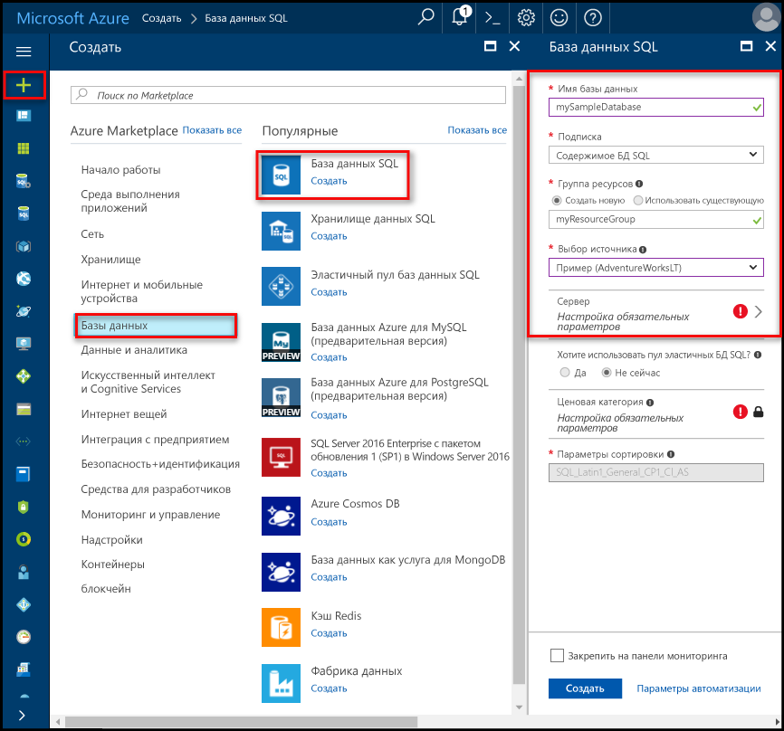
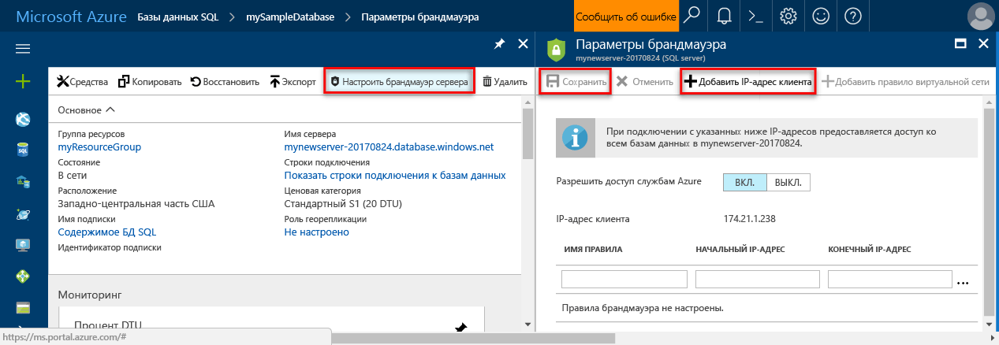

# Создание серверов базы данных SQL Azure и баз данных SQL Azure и управление ими

База данных SQL Azure — это управляемая база данных в Microsoft Azure, которая создается внутри [группы ресурсов Azure](../azure-resource-manager/resource-group-overview.md) с определенным набором [вычислительных ресурсов и ресурсов хранилища для разных рабочих нагрузок](sql-database-service-tiers.md). База данных SQL Azure связана с логическим сервером базы данных SQL Azure, который создан в определенном регионе Azure. 

## База данных SQL Azure может быть отдельной базой данных, базой данных в составе пула или секционированной базой данных.

База данных SQL Azure может:

- представлять собой отдельную базу данных с [собственным набором ресурсов](sql-database-what-is-a-dtu.md#what-are-database-transaction-units-dtus) (DTU);
- входить в состав [эластичного пула SQL](sql-database-elastic-pool.md), в котором [набор ресурсов используется совместно](sql-database-what-is-a-dtu.md#what-are-elastic-database-transaction-units-edtus) (eDTU);
- входить в состав [масштабируемого набора сегментированных баз данных](sql-database-elastic-scale-introduction.md#horizontal-and-vertical-scaling), которые могут быть отдельными базами данных или частью пула;
- входить в состав набора баз данных, использующихся в [шаблоне разработки для мультитенантных приложений SaaS](sql-database-design-patterns-multi-tenancy-saas-applications.md), которые могут быть отдельными базами данных или частью пула (или этот набор может иметь смешанную конфигурацию). 

> [!TIP]
> Допустимые имена баз данных см. в статье об [идентификаторах базы данных](https://docs.microsoft.com/en-us/sql/relational-databases/databases/database-identifiers). 
>
 
- Hello базы данных параметры сортировки по умолчанию базы данных SQL Microsoft Azure — **SQL_LATIN1_GENERAL_CP1_CI_AS**, где **LATIN1_GENERAL** — русский (Россия) **CP1** — кодовая страница 1252, **CI** не учитывается регистр, и **AS** диакритические знаки учитываются. Дополнительные сведения о как tooset hello параметров сортировки см. в разделе [COLLATE (Transact-SQL)](https://msdn.microsoft.com/library/ms184391.aspx).
- База данных SQL Microsoft Azure поддерживает клиент протокола для потока табличных данных (TDS) версии 7.3 или более поздней.
- Разрешены только подключения по протоколу TCP/IP.

## Что такое логический сервер SQL Azure?

Логический сервер выступает в качестве центра администрирования нескольких баз данных, включая [эластичные пулы SQL](sql-database-elastic-pool.md), [имена для входа](sql-database-manage-logins.md), [правила брандмауэра](sql-database-firewall-configure.md), [правила аудита](sql-database-auditing.md), [политики обнаружения угроз](sql-database-threat-detection.md) и [группы отработки отказа](sql-database-geo-replication-overview.md). Логический сервер может находиться в регионе, отличном от региона своей группы ресурсов. Hello логический сервер должен существовать до создания базы данных Azure SQL hello. Все базы данных на сервере создаются в hello же регионе, что hello логического сервера. 

> [!IMPORTANT]
> В базе данных SQL server — это логическая конструкция, отличается от экземпляра SQL Server, вы не знакомы с в локальной Здравствуй, мир!. В частности hello служба базы данных SQL не дает никаких гарантий относительно расположения hello баз данных в отношении tootheir логических серверов и предоставляет нет доступа на уровне экземпляра или функции.
> 

При создании логического сервера, укажите сервер, учетная запись входа и пароль, имеющую права администратора toohello базы данных master на этом сервере и всех баз данных, созданных на этом сервере. Эта начальная учетная запись является учетной записью входа SQL. База данных SQL Azure поддерживает аутентификацию SQL и аутентификацию Azure Active Directory. Дополнительную информацию об именах для входа и аутентификации можно найти в разделе [Предоставление доступа к базе данных и управление им](sql-database-manage-logins.md). Проверка подлинности Windows не поддерживается. 

> [!TIP]
> Допустимые имена групп и ресурсов описываются в статье о [правилах и ограничениях именования](https://docs.microsoft.com/azure/architecture/best-practices/naming-conventions).
>

Характеристики логического сервера базы данных SQL Azure

- Создается в пределах подписки Azure, но можно переместить с подпиской tooanother его автономной ресурсы
- — Hello родительского ресурса для базы данных, эластичные пулы и хранилищ данных
- Предоставляет пространство имен для баз данных, эластичных пулов и хранилищ данных.
- Это логический контейнер, в соответствии с семантикой строгого время существования - delete удаляет сервером и его hello автономных баз данных, эластичные пулы и хранилищ данных
- Участвует в [управления доступом Azure на основе ролей (RBAC)](/active-directory/role-based-access-control-what-is) -базы данных, эластичные пулы и хранилищ данных в пределах сервера наследовать права доступа от сервера hello
- Является элементом высокого порядка удостоверения hello баз данных, эластичные пулы и хранилищ данных для ресурсов Azure в целях управления (hello URL-адрес в разделе Схема базы данных и пулов)
- Выравнивает ресурсы в регионе.
- Предоставляет конечную точку подключения к базе данных (<serverName>.database.windows.net).
- Предоставляет доступ toometadata относительно автономной ресурсов через динамические административные представления, подключающегося tooa базы данных master 
- Предоставляет область hello для политик управления, которые применяются tooits баз данных - имена входа, брандмауэра, аудит, угрозы обнаружение и т. д. 
- Ограничен квотой в рамках подписки родительского hello (шести серверов на одну подписку по умолчанию - [см. Здесь ограничивает подписки](../azure-subscription-service-limits.md))
- Предоставляет область hello для квоты для баз данных и квоты DTU для hello ресурсы, содержащиеся в нем (например, 45,000 DTU)
- Hello область управления версиями для возможностями, включенными в автономной ресурсы 
- За счет возможностей входа в систему с использованием субъекта серверного уровня может управлять всеми базами данных на сервере.
- Может содержать имена входа аналогичные toothose в экземплярах SQL Server в вашей организации, для которых предоставлены права доступа tooone или несколько баз данных на сервере hello, которые могут быть предоставлены ограниченные права администратора. Дополнительные сведения см. в статье [Проверка подлинности и авторизация в базе данных SQL: предоставление доступа](sql-database-manage-logins.md).

## Базы данных SQL Azure, защищенные брандмауэром базы данных SQL

toohelp защиты данных, [брандмауэр базы данных SQL](sql-database-firewall-configure.md) предотвращает все доступа tooyour базы данных сервера или любое из баз данных из-за пределами сервера toohello подключения напрямую через подключение к подписке Azure. tooenable дополнительные подключения, необходимо [создать одно или несколько правил брандмауэра](sql-database-firewall-configure.md#creating-and-managing-firewall-rules). Изучите дополнительные сведения о создании [эластичных пулов SQL](sql-database-elastic-pool.md) и управлении ими.

## Управление серверами Azure SQL, баз данных и брандмауэры с использованием hello портал Azure

Можно создать группу ресурсов базы данных Azure SQL hello раньше времени или при создании сам сервер hello. Существует несколько методов для получения tooa новую форму сервера SQL, путем создания нового сервера SQL или при создании новой базы данных. 

### Создание пустого сервера SQL Server (логического сервера)

Здравствуйте, toocreate server (без базы данных) базы данных SQL Azure с помощью [портал Azure](https://portal.azure.com), перейдите tooa пустую форму SQL server (логический сервер). Hello следующей картинке показан один метод для открытия toocreate формы пустого логического сервера SQL. 

   

Если вы получаете toothis формы с использованием другого метода, hello информации в форме hello ничем не отличается.

### Создание пустой базы данных SQL или примера базы данных SQL

Здравствуйте, базы данных Azure SQL с помощью toocreate [портал Azure](https://portal.azure.com)перейдите tooa пустую форму базы данных SQL и укажите hello запрашиваемые сведения о. Можно создать группу ресурсов и раньше времени или при создании самой базы данных hello логический сервер базы данных Azure SQL hello. Можно создать пустую базу данных или пример базы данных на основе Adventure Works LT. 

  

> [ВАЖНО] Сведения о выборе hello ценовой категории базы данных см. в разделе [уровней служб](sql-database-service-tiers.md).
>

### Управление существующим сервером SQL Server

toomanage существующий сервер, перейдите с помощью нескольких методов - например, из конкретную страницу базы данных SQL, hello server toohello **серверов SQL Server** страницы или hello **все ресурсы** страницы. Привет, следуя снимке экрана показано, как toobegin, настройки параметров брандмауэра уровня сервера с hello **Обзор** страницы для сервера. 

   

toomanage существующей базы данных перейдите toohello **баз данных SQL** и нажмите кнопку hello базы данных нужно toomanage. Hello, следуя снимке экрана показано, как параметр брандмауэра уровня сервера для базы данных из hello toobegin **Обзор** страницу для базы данных. 

    

> [!IMPORTANT]
> свойства tooconfigure производительности для базы данных, в разделе [уровней служб](sql-database-service-tiers.md).
>

> [!TIP]
> Учебник быстрый запуск портала Azure в разделе [создать базу данных Azure SQL в hello портал Azure](sql-database-get-started-portal.md).
>

## Управление серверами SQL Azure, базами данных и брандмауэрами с помощью PowerShell

toocreate и управлять Azure SQL server, базы данных и брандмауэры с помощью Azure PowerShell, используйте следующие командлеты PowerShell hello. Если необходима tooinstall или обновить PowerShell, см. раздел [установите Azure PowerShell модуль](/powershell/azure/install-azurerm-ps). Изучите дополнительные сведения о создании [эластичных пулов SQL](sql-database-elastic-pool.md) и управлении ими.

| Командлет | Описание |
| --- | --- |
|[New-AzureRmSqlDatabase](/powershell/module/azurerm.sql/new-azurermsqldatabase)|Создает базу данных. |
|[Get-AzureRmSqlDatabase](/powershell/module/azurerm.sql/get-azurermsqldatabase)|Получает одну или несколько баз данных.|
|[Set-AzureRmSqlDatabase](/powershell/module/azurerm.sql/set-azurermsqldatabase)|Определяет свойства базы данных или перемещает ее в эластичный пул.|
|[Remove-AzureRmSqlDatabase](/powershell/module/azurerm.sql/remove-azurermsqldatabase)|Удаляет базу данных.|
|[New-AzureRmResourceGroup](/powershell/module/azurerm.resources/new-azurermresourcegroup)|Создает группу ресурсов.
|[New-AzureRmSqlServer](/powershell/module/azurerm.sql/new-azurermsqlserver)|Создает сервер.|
|[Get-AzureRmSqlServer](/powershell/module/azurerm.sql/get-azurermsqlserver)|Возвращает сведения о серверах.|
|[Set-AzureRmSqlServer](https://docs.microsoft.com/en-us/powershell/module/azurerm.sql/set-azurermsqlserver)|Изменяет свойства сервера.|
|[Remove-AzureRmSqlServer](/powershell/module/azurerm.sql/remove-azurermsqlserver)|Удаляет сервера.|
|[New-AzureRmSqlServerFirewallRule](/powershell/module/azurerm.sql/new-azurermsqlserverfirewallrule)|Создает правило брандмауэра уровня сервера. |
|[Get-AzureRmSqlServerFirewallRule](/powershell/module/azurerm.sql/get-azurermsqlserverfirewallrule)|Получает правила брандмауэра для сервера.|
|[Set-AzureRmSqlServerFirewallRule](/powershell/module/azurerm.sql/set-azurermsqlserverfirewallrule)|Изменяет правило брандмауэра на сервере.|
|[Remove-AzureRmSqlServerFirewallRule](/powershell/module/azurerm.sql/remove-azurermsqlserverfirewallrule)|Удаляет правило брандмауэра с сервера.|

> [!TIP]
> Краткое руководство по PowerShell приведено в разделе [Создание отдельной базы данных SQL Azure с помощью PowerShell](sql-database-get-started-portal.md). Образцы скриптов PowerShell, см. [toocreate с помощью PowerShell одной SQL Azure базы данных и настройка правила брандмауэра](scripts/sql-database-create-and-configure-database-powershell.md) и [монитора и масштабирования одного SQL базы данных с помощью PowerShell](scripts/sql-database-monitor-and-scale-database-powershell.md).
>

## Управление серверами Azure SQL, баз данных и брандмауэры с использованием hello Azure CLI

toocreate и управления сервером Azure SQL, баз данных и брандмауэры с hello [Azure CLI](/cli/azure/overview), используйте ниже hello [базы данных SQL Azure CLI](/cli/azure/sql/db) команд. Используйте hello [оболочки облака](/azure/cloud-shell/overview) toorun hello CLI в браузере или [установить](/cli/azure/install-azure-cli) ее на macOS, Linux или Windows. Изучите дополнительные сведения о создании [эластичных пулов SQL](sql-database-elastic-pool.md) и управлении ими.

| Командлет | Описание |
| --- | --- |
|[az sql db create](/cli/azure/sql/db#create) |Создает базу данных.|
|[az sql db list](/cli/azure/sql/db#list)|Выводит список всех баз данных и хранилищ данных на сервере или всех баз данных в эластичном пуле.|
|[az sql db list-editions](/cli/azure/sql/db#list-editions)|Выводит список доступных целевых служб и ограничений хранилища.|
|[az sql db list-usages](/cli/azure/sql/db#list-usages)|Возвращает данные об использовании баз данных.|
|[az sql db show](/cli/azure/sql/db#show)|Возвращает сведения о базе данных или хранилище данных.|
|[az sql db update](/cli/azure/sql/db#update)|Обновляет базу данных.|
|[az sql db delete](/cli/azure/sql/db#delete)|Удаляет базу данных.|
|[az group create](/cli/azure/group#create)|Создает группу ресурсов.|
|[az sql server create](/cli/azure/sql/server#create)|Создает сервер.|
|[az sql server list](/cli/azure/sql/server#list)|Выводит список серверов.|
|[az sql server list-usages](/cli/azure/sql/server#list-usages)|Возвращает данные об использовании серверов.|
|[az sql server show](/cli/azure/sql/server#show)|Возвращает сервер.|
|[az sql server update](/cli/azure/sql/server#update)|Обновляет сервер.|
|[az sql server delete](/cli/azure/sql/server#delete)|Удаляет сервер.|
|[az sql server firewall-rule create](/cli/azure/sql/server/firewall-rule#create)|Создает правило брандмауэра для сервера.|
|[az sql server firewall-rule list](/cli/azure/sql/server/firewall-rule#list)|Список правил брандмауэра hello на сервере|
|[az sql server firewall-rule show](/cli/azure/sql/server/firewall-rule#show)|Отображаются сведения hello правила брандмауэра|
|[az sql server firewall-rule update](/cli/azure/sql/server/firewall-rule#update)|Обновляет правило брандмауэра.|
|[az sql server firewall-rule delete](/cli/azure/sql/server/firewall-rule#delete)|Удаляет правило брандмауэра.|

> [!TIP]
> Краткое руководство Azure CLI. в разделе [создание одной базы данных Azure SQL с помощью Azure CLI hello](sql-database-get-started-cli.md). Azure CLI примере скриптов см. в разделе [toocreate CLI, используйте один SQL Azure базы данных и настройка правила брандмауэра](scripts/sql-database-create-and-configure-database-cli.md) и [toomonitor используйте CLI и масштаб одной базы данных SQL](scripts/sql-database-monitor-and-scale-database-cli.md).
>

## Управление серверами SQL Azure, базами данных и брандмауэрами с помощью Transact-SQL

toocreate и управлять Azure SQL server, базы данных и брандмауэры, с помощью Transact-SQL, hello, следующие команды T-SQL. Можно выполнить эти команды с помощью портала Azure hello [SQL Server Management Studio](/sql/ssms/use-sql-server-management-studio), [кода Visual Studio](https://code.visualstudio.com/docs), или любой другой программе, можно подключить tooan сервер базы данных SQL Azure и передать Transact-SQL команды. Ознакомьтесь с дополнительными сведениями об управлении [эластичными пулами](sql-database-elastic-pool.md).

> [!IMPORTANT]
> С помощью Transact-SQL невозможно создать или удалить сервер.
>

| Команда | Описание |
| --- | --- |
|[CREATE DATABASE (база данных SQL Azure)](/sql/t-sql/statements/create-database-azure-sql-database)|Создает базу данных. Должен быть toohello подключенной базы данных master toocreate новую базу данных.|
| [ALTER DATABASE (база данных SQL Azure)](/sql/t-sql/statements/alter-database-azure-sql-database) |Изменяет базу данных SQL Azure. |
|[ALTER DATABASE (хранилище данных SQL Azure)](/sql/t-sql/statements/alter-database-azure-sql-data-warehouse)|Изменяет хранилище данных SQL Azure.|
|[DROP DATABASE (Transact-SQL)](/sql/t-sql/statements/drop-database-transact-sql)|Удаляет базу данных.|
|[sys.database_service_objectives (база данных SQL Azure)](/sql/relational-databases/system-catalog-views/sys-database-service-objectives-azure-sql-database)|Возвращает hello выпуск (уровень службы), цель службы (ценовой категории) и имя эластичного пула, если таковые имеются, для базы данных Azure SQL или хранилище данных SQL Azure. Если вход в систему toohello базы данных master на сервере базы данных SQL Azure, возвращает сведения обо всех базах данных. Для хранилища данных SQL Azure необходимо быть toohello подключенной базы данных master.|
|[sys.dm_db_resource_stats (база данных SQL Azure)](/sql/relational-databases/system-dynamic-management-views/sys-dm-db-resource-stats-azure-sql-database)| Возвращает сведения об использовании ЦП, операциях ввода-вывода и потреблении памяти для базы данных в базе данных SQL Azure. Существует одна строка для каждых 15 секунд, даже если отсутствует действие hello базы данных.|
|[sys.resource_stats (база данных SQL Azure)](/sql/relational-databases/system-catalog-views/sys-resource-stats-azure-sql-database)|Возвращает сведения об использовании ЦП и хранилища для базы данных SQL Azure. Hello данные собираются и объединяются с пятиминутными интервалами.|
|[sys.database_connection_stats (база данных SQL Azure)](/sql/relational-databases/system-catalog-views/sys-database-connection-stats-azure-sql-database)|Содержит статистику о событиях подключения к базе данных в базе данных SQL, предоставляя общие сведения об успешных и неудачных попытках подключения. |
|[sys.event_log (база данных SQL Azure)](/sql/relational-databases/system-catalog-views/sys-event-log-azure-sql-database)|Возвращает сведения об успешных подключениях к базе данных в базе данных SQL Azure, а также о сбоях подключения и взаимоблокировках. Можно использовать этот tootrack сведения или устранения неполадок вашей работы базы данных в базе данных SQL.|
|[sp_set_firewall_rule (база данных SQL Azure)](/sql/relational-databases/system-stored-procedures/sp-set-firewall-rule-azure-sql-database)|Создает или обновляет hello в параметрах брандмауэра уровня сервера для сервера базы данных SQL. Эта хранимая процедура доступна только для входа участника уровня сервера toohello базы данных master hello. Правила брандмауэра уровня сервера могут создаваться только после создания пользователем, имеющим разрешения на уровне Azure hello первого правила брандмауэра уровня сервера, с помощью Transact-SQL|
|[sys.firewall_rules (база данных SQL Azure)](/sql/relational-databases/system-catalog-views/sys-firewall-rules-azure-sql-database)|Возвращает сведения о параметрах брандмауэра уровня сервера hello, связанные с базой данных SQL Microsoft Azure.|
|[sp_delete_firewall_rule (база данных SQL Azure)](/sql/relational-databases/system-stored-procedures/sp-delete-firewall-rule-azure-sql-database)|Удаляет параметры брандмауэра уровня сервера с сервера базы данных SQL. Эта хранимая процедура доступна только для входа участника уровня сервера toohello базы данных master hello.|
|[sp_set_database_firewall_rule (база данных SQL Azure)](/sql/relational-databases/system-stored-procedures/sp-set-database-firewall-rule-azure-sql-database)|Создает или обновляет правила брандмауэра уровня базы данных hello для базы данных SQL Azure или хранилище данных SQL. Можно настроить правила брандмауэра базы данных для базы данных master hello и пользовательских баз данных в базе данных SQL. Правила брандмауэра базы данных полезны в тех случаях, когда применяются пользователи автономной базы данных. |
|[sys.database_firewall_rules (база данных SQL Azure)](/sql/relational-databases/system-catalog-views/sys-database-firewall-rules-azure-sql-database)|Возвращает сведения о параметрах брандмауэра уровня базы данных hello, связанные с базой данных SQL Microsoft Azure. |
|[sp_delete_database_firewall_rule (база данных SQL Azure)](/sql/relational-databases/system-stored-procedures/sp-delete-database-firewall-rule-azure-sql-database)|Удаляет параметр брандмауэра уровня базы данных из базы данных SQL Azure или хранилища данных SQL. |

> [!TIP]
> Краткое руководство по началу работы с помощью SQL Server Management Studio для Microsoft Windows, в разделе [базы данных SQL Azure: tooconnect и запрашивают данные, используйте SQL Server Management Studio](sql-database-connect-query-ssms.md). Краткое руководство, с помощью кода Visual Studio на hello macOS, Linux или Windows, в разделе [базы данных SQL Azure: tooconnect и запрашивают данные, используйте Visual Studio Code](sql-database-connect-query-vscode.md).

## Управление серверами Azure SQL, баз данных и брандмауэры с использованием API-интерфейса REST hello

toocreate и управлять Azure SQL server, базы данных и брандмауэры с использованием hello REST API см. в разделе [API REST для базы данных SQL Azure](/rest/api/sql/).

## Дальнейшие действия

- toolearn о пуле баз данных с помощью эластичных пулов SQL, в разделе [эластичные пулы](sql-database-elastic-pool.md).
- Сведения о hello службы базы данных SQL Azure см. в разделе [возможности базы данных SQL?](sql-database-technical-overview.md).
- toolearn о миграции tooAzure базы данных SQL Server, в разделе [переноса базы данных SQL tooAzure](sql-database-cloud-migrate.md).
- Дополнительные сведения о поддерживаемых функциях см. [здесь](sql-database-features.md).
