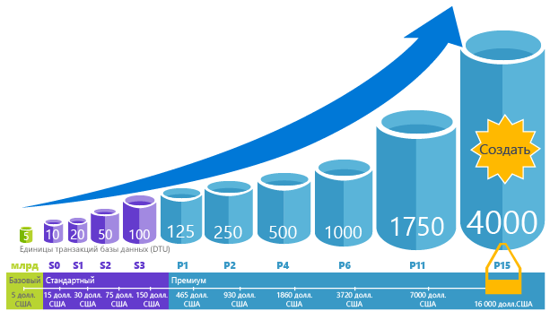
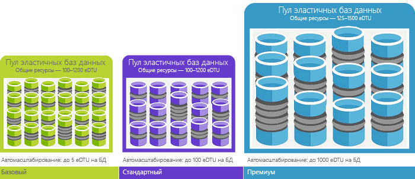

# Что такое служба hello базы данных SQL Azure? 

База данных SQL — это реляционная база данных общего назначения (служба) в Microsoft Azure, которая поддерживает такие структуры, как реляционные данные, JSON, пространственные данные и XML. Она обеспечивает [динамически масштабируемую производительность](sql-database-service-tiers.md) и предоставляет определенные возможности, например [индексы columnstore](https://docs.microsoft.com/sql/relational-databases/indexes/columnstore-indexes-overview) для экстремального аналитического анализа и отчетности и [выполняющуюся в памяти OLTP](sql-database-in-memory.md) для экстремальной обработки транзакций. Корпорация Майкрософт обрабатывает все исправления и обновления базы кода SQL hello без проблем и устраняет все управление hello базовой инфраструктуры. 

База данных SQL использует ее базовый код с hello [СУБД Microsoft SQL Server](https://docs.microsoft.com/sql/sql-server/sql-server-technical-documentation). Со стратегией облачный корпорации Майкрософт hello новые возможности SQL Server, выпущенных tooSQL первой базы данных, а затем tooSQL самого сервера. Такой подход обеспечивает hello новых возможностей SQL Server не нагрузку для внесения исправлений или обновление - и эти новые возможности проверять по миллионы баз данных. Дополнительные сведения о новых возможностях вы можете узнать с помощью следующих источников:

- **[Стратегия Azure для базы данных SQL](https://azure.microsoft.com/roadmap/?category=databases)**: toofind месте новые возможности и предстоящие Далее. 
- **[Блог базы данных SQL Azure](https://azure.microsoft.com/blog/topics/database)**: здесь участники команды по разработке продукта SQL Server добавляют новые сведения о возможностях и новостях, касающихся баз данных SQL. 

База данных SQL предоставляет предсказуемую производительность на нескольких уровнях обслуживания, что обеспечивает динамическое масштабирование без простоя, встроенную интеллектуальную оптимизацию, глобальные масштабируемость и доступность, а также расширенные параметры безопасности. Все это без необходимости администрирования. Эти возможности позволяют toofocus на Быстрая разработка приложений и ускорению вашей toomarket времени, вместо того чтобы выделять ценное время и ресурсы toomanaging виртуальных машин и инфраструктуры. Hello базы данных SQL, служба в настоящий момент 38 данных основано на Здравствуй, мир, с более центрами обработки данных переходит в оперативный режим регулярно, благодаря чему можно toorun базы данных в центре обработки данных рядом с вами.

> [!NOTE]
> Посетите [центр управления безопасностью Azure](https://azure.microsoft.com/support/trust-center/security/), чтобы посмотреть сведения о безопасности платформы Azure.
>

## Масштабируемая производительность и пулы

С базой данных SQL каждая база данных изолирована от друг друга и является переносимой — с собственным [уровнем обслуживания](sql-database-service-tiers.md) и гарантированным уровнем производительности. База данных SQL предоставляет разные уровни производительности для различных задач, а также позволяет базы данных hello пула toomaximize toobe использовать ресурсы и сэкономить деньги.

### Настройка производительности и масштабирования без простоя

База данных SQL предлагает четыре уровней обслуживания рабочие нагрузки базы данных упрощенных tooheavyweight toosupport: Basic, Standard, Premium и Premium RS. Можно создайте свое первое приложение на небольших одной базы данных за небольшую стоимость в месяц, а затем изменить ее уровень обслуживания вручную или программными средствами в любое время toomeet hello задачами решения. Вы можете настроить производительность без простоя tooyour приложения или tooyour клиентов. Динамические масштабируемость включает изменение требований к ресурсам и включает tooonly вы платите за hello ресурсы необходимо при необходимости их toorapidly ответ tootransparently вашей базы данных.

   

### Использование ресурсов toomaximize пулах эластичных БД

Для многих организаций и приложений, может toocreate отдельных баз данных и набрать производительности вверх или вниз по требованию достаточно, особенно в том случае, если шаблоны использования относительно предсказуемы. Но если непредсказуемым закономерностей, может сделать его жестких toomanage затраты и бизнес-модели. [Эластичные пулы](sql-database-elastic-pool.md) являются спроектированный toosolve этой проблемы. Концепция Hello проста. Выделите пул tooa ресурсы производительности, а не отдельные базы данных и оплаты для ресурсов общих данных о производительности hello hello пула, а не для одной базы данных производительности. 

   

Эластичные пулы необязательно toofocus на наборе производительность базы данных вверх и вниз, как колеблется спрос на ресурсы. Hello пула баз данных использовать hello производительности ресурсов hello эластичного пула при необходимости. Использовать пул баз данных, но не превышают ограничения hello пула hello, поэтому расходы остается прогнозируемый, даже если использование отдельной базы данных не. Дополнительные возможности, вы можете [Добавление и удаление баз данных пула toohello](sql-database-elastic-pool-manage-portal.md), масштабирование приложения из небольшое число toothousands баз данных, в течение бюджета, которым вы управляете. Вы также можете минимум управления hello и доступных toodatabases максимума ресурсов в пул tooensure hello, что база данных не в пуле hello использует все hello пула ресурсов, а каждый пул базы данных имеет гарантированную минимальный объем ресурсов. toolearn Дополнительные сведения о шаблонах разработки для приложений SaaS, с помощью эластичных пулов см [шаблоны проектирования многопользовательских приложений SaaS с базой данных SQL](sql-database-design-patterns-multi-tenancy-saas-applications.md).

### Совмещение отдельных баз данных и баз данных в составе пула

Независимо от того, что вы выбрали — отдельные базы данных или пулы эластичных баз данных, — ваши возможности не ограничиваются. Blend отдельных баз данных с помощью эластичных пулов и изменение уровней обслуживания hello отдельных баз данных и пулов эластичных быстро и легко tooadapt tooyour ситуации. Hello и доступ к Azure вы можете набора соответствия других Azure службы с уникальным приложения проектирования потребностей, диск затрат и эффективность ресурсов toomeet базы данных SQL и разблокировать новые бизнес-возможности.

### Возможности комплексного мониторинга и оповещения

Но, как сравнить относительную производительность отдельных баз данных и пулов эластичных hello? Как узнать, щелкните правой кнопкой мыши stop hello при наборе вверх и вниз? Использовать hello [наблюдения за производительностью встроенных](sql-database-performance.md) и [предупреждения](sql-database-insights-alerts-portal.md) средств, в сочетании с на основе оценки производительности hello [единицы транзакций баз данных (Dtu) для отдельных баз данных и эластичный (Edtu) Dtu для эластичного пулы](sql-database-what-is-a-dtu.md). С помощью этих средств можно быстро оценить влияние hello масштабирование вверх или вниз на основании текущих или проекте требованиям к производительности. Дополнительные сведения см. в статье [Параметры базы данных SQL и производительность: возможности разных уровней служб](sql-database-service-tiers.md).

Кроме того, база данных SQL может [выдавать значения метрик и журналы диагностики](sql-database-metrics-diag-logging.md) для упрощения мониторинга. Можно настроить использование ресурсов toostore базы данных SQL, сотрудников и сеансы и соединения до одного из этих ресурсов Azure:

- **Служба хранилища Azure**: для архивации больших объемов телеметрии по оптимальной стоимости.
- **Концентратор событий Azure**: для интеграции телеметрии базы данных SQL с настраиваемым решением для мониторинга или горячими конвейерами.
- **Azure Log Analytics**: для встроенного решения для мониторинга с возможностями предоставления отчетов, предупреждений и выполнения исправлений.

    

## Возможности доступности

Соглашение об уровне обслуживания [(SLA)](http://azure.microsoft.com/support/legal/sla/)в Azure, предусматривающее самый высокий в отрасли уровень доступности (99,99 %) и глобальную сеть центров обработки данных под управлением Майкрософт, обеспечит непрерывную работу приложения — 24 часа в сутки и 7 дней в неделю. Кроме того, база данных SQL обеспечивает встроенные функции [непрерывности бизнес-процессов и глобальной масштабируемости](sql-database-business-continuity.md), в частности:

- **[Автоматическое создание резервных копий](sql-database-automated-backups.md)**: база данных SQL автоматически создает полные, разностные копии и резервные копии журналов транзакций.
- **[Восстановление на момент](sql-database-recovery-using-backups.md)**: база данных SQL поддерживает точки восстановления tooany времени в пределах срока хранения автоматического резервного копирования hello.
- **[Активная георепликация](sql-database-geo-replication-overview.md)**: база данных SQL позволяет tooconfigure копирование toofour вторичной базы данных в любом hello таким же или глобально распределенных центрах обработки данных Azure.  Например при наличии приложения SaaS с базой данных каталога, который имеет слишком большое количество параллельных транзакций только для чтения, использования активной георепликации tooenable глобального чтения масштабирования и удаления узких мест на основной hello, из-за tooread рабочих нагрузок. 
- **[Переход на другой ресурс группы](sql-database-geo-replication-overview.md)**: база данных SQL позволяет tooenable высокого уровня доступности и по всему миру, включая прозрачные географическую репликацию и отработку отказа для больших наборов баз данных и пулов эластичных балансировки нагрузки. Переход на другой ресурс группы и активная георепликация обеспечивает создание глобально распределенных приложений SaaS, с помощью минимального объема работ, издержки, оставив все hello сложный мониторинг, маршрутизации и tooSQL orchestration отработки отказа базы данных.

## Встроенная система аналитики

База данных SQL вы получаете интеллектуальным позволяет существенно снизить затраты на hello запуска и управления базами данных и позволяет максимально повысить производительность и безопасность приложения. Рабочих нагрузок круглосуточно работающей под управлением миллионы клиентов, база данных SQL собирает и обрабатывает большие объемы данных телеметрии, при этом соблюдаются также полностью права конфиденциальность пользователей фоновом hello. Различные алгоритмы постоянно оценке hello данные телеметрии, можно узнать и адаптировать вместе с приложением службы hello. По результатам анализа hello службы появится с конкретной рабочей нагрузки специально настроенные tooyour рекомендации по улучшению производительности. 

### Автоматическая настройка производительности

База данных SQL предоставляет подробное представление о hello запрашивает необходимость toomonitor. База данных SQL узнает о шаблонах вашей базы данных и позволяет вам tooadapt рабочая нагрузка tooyour схемы базы данных. База данных SQL предоставляет рекомендации по настройке производительности с помощью [Помощника по базам данных SQL](sql-database-advisor.md). Вы можете просмотреть действия по настройке и применить их. Однако постоянный мониторинг базы данных — это сложная и трудоемкая задача, особенно при работе с несколькими базами данных. Управление огромное число баз данных может быть невозможным toodo эффективно даже со все доступные средства и отчеты, предоставляющие портал Azure и базы данных SQL. Вместо контроля и настройки базы данных вручную, следует рассмотреть возможность делегирования некоторые hello контроля и настройки действия tooSQL базы данных с помощью функции автоматической настройки. База данных SQL автоматически применить рекомендации, тестов и подтверждает, что каждый из его настройки производительности hello tooensure действия отслеживает повышение. В этом случае база данных SQL автоматически адаптирует tooyour рабочей нагрузки в управляемой и безопасным способом. Автоматической настройки означает, что тщательно отслеживается и сравнивать до и после каждого действия настройки hello производительность базы данных и если не повысить производительность hello, возвращается hello действия по настройке.

Сегодня, многие наши партнеры по управлением [мультитенантные SaaS](sql-database-design-patterns-multi-tenancy-saas-applications.md) поверх базы данных SQL зависит от настройки toomake убедиться, что их приложения всегда имеют устойчивыми и предсказуемыми производительности автоматического производительности. Для их создания эта функция сокращает невероятно hello опасность того, что инцидент производительности в середине hello ночь hello. Кроме того, поскольку часть базы клиентов также использует SQL Server, они используют hello такие же требования индексирования, предоставляемые toohelp базы данных SQL своим клиентам SQL Server.

В базе данных SQL есть две функции автоматической настройки.

- **[Автоматическое управление индексами](sql-database-automatic-tuning.md#automatic-index-management)**: определяет индексы, которые необходимо добавить в базу данных или удалить.
- **[Автоматическое изменение плана](sql-database-automatic-tuning.md#automatic-plan-choice-correction)**: определяет проблемные планы и исправляет проблемы производительности плана SQL (ожидается в ближайшее время, уже доступна в SQL Server 2017).

### Адаптивная обработка запросов

Также мы добавляем hello [обработки запросов адаптивной](/sql/relational-databases/performance/adaptive-query-processing) семейство tooSQL функций базы данных, включая поочередное исполнение нескольких инструкций возвращающих табличные значения функций пакетного режима памяти Предоставление отзывов и пакетных режим адаптивной соединения . Каждый из этих компонентов для обработки запросов адаптивной применяется сходные методы «Дополнительные сведения и адаптировать», помогает дальнейшей оптимизации проблем трудноразрешимые запроса связанных toohistorically адрес производительности проблемы.

### Эффективная система обнаружения угроз

 [Обнаружение угроз SQL](sql-database-threat-detection.md) использует [аудит базы данных SQL](sql-database-auditing.md) toocontinuously монитора Azure SQL баз данных для потенциально вредоносных попыток tooaccess конфиденциальных данных. Обнаружение угроз SQL предоставляет новый уровень безопасности, которая позволяет клиентам toodetect и отвечать toopotential угроз, как только они происходят, предоставляя предупреждения системы безопасности о подозрительной активности. Пользователи получают оповещения о подозрительных действиях с базами данных, потенциальных уязвимостях, атаках путем внедрения кода SQL и аномальных закономерностях в доступе к базам данных. Угрозы SQL оповещения об обнаружении указаны сведения о подозрительной активности и рекомендуем действия, о том, как tooinvestigate и устранить угрозу hello. Пользователи могут анализировать toodetermine hello подозрительных событий, если результаты события hello tooaccess попытки нарушения или воспользоваться hello базы данных. Обнаружение угроз база данных он простой tooaddress потенциальных угроз toohello без необходимости hello toobe специалист по безопасности или управлять повышенной безопасности, контроль различных систем.

## Расширенный уровень безопасности и соответствие требованиям

База данных SQL обеспечивает широкий набор [встроенные функции безопасности и соответствия](sql-database-security-overview.md) toohelp приложения требованиям различных безопасности и соответствия требованиям. 

### Аудит для обеспечения безопасности и соответствия

[Аудит базы данных SQL](sql-database-auditing.md) отслеживает события базы данных и записывает их в журнал аудита tooan в вашей учетной записи хранилища Azure. Аудит может помочь вам соблюсти требования нормативов, проанализировать работу с базой данных и получить представление о расхождениях и аномалиях, которые могут указывать на бизнес-проблемы или предполагаемые нарушения безопасности.

### Шифрование неактивных данных

База данных SQL [прозрачное шифрование данных](https://docs.microsoft.com/sql/relational-databases/security/encryption/transparent-data-encryption-with-azure-sql-database) защиты от угроз вредоносных действий hello, выполняя в реальном времени шифрование и расшифровку hello базы данных, связанных резервных копий и при хранении файлов журнала транзакций без необходимости изменения toohello приложения. Начиная с мая 2017 года все созданные базы данных SQL Azure автоматически защищены с помощью прозрачного шифрования данных (TDE). Прозрачное шифрование данных является SQL проверенные технологии шифрования на rest, которые требуются для многих tooprotect соответствия стандартам от кражи носителей. Клиенты могут управлять ключами шифрования hello прозрачного шифрования данных и другие секретные данные так, безопасность и соответствие с помощью хранилища ключей Azure.

### Шифрование данных при передаче

База данных SQL — hello только базы данных системы toooffer защиты конфиденциальных данных в полете при хранении и во время выполнения запроса, обработка с помощью [постоянного шифрования](https://docs.microsoft.com/sql/relational-databases/security/encryption/always-encrypted-database-engine). Постоянное шифрование — первые в отрасли, несравненную данных обеспечивает защиту от угроз, связанных с hello кражи критически важных данных. Например с постоянным шифрованием, номеров кредитных карт клиентов хранятся шифрования в базе данных hello всегда, даже во время обработки запросов, позволяя расшифровки точке hello использования авторизованный персонал или приложениями, которым требуется tooprocess эти данные.

### Динамическое маскирование данных

[Маскирование динамических данных базы данных SQL](sql-database-dynamic-data-masking-get-started.md) ограничивает возможность раскрытия конфиденциальных данных, маскируя его toonon правами доступа. Динамическое маскирование данных помогает предотвратить несанкционированный доступ к данным toosensitive, позволяя клиентам toodesignate объем hello tooreveal конфиденциальных данных с минимальным влиянием на уровень приложения hello. Это функция безопасности на основе политики скрывает hello конфиденциальные данные в hello результирующего набора запроса в заданных полях базы данных, а hello hello базы данных не изменяются.

### Безопасность на уровне строк

[Безопасности на уровне строк](https://docs.microsoft.com/sql/relational-databases/security/row-level-security) позволяет клиентам toocontrol доступа toorows в таблицу базы данных, основанной на характеристиках hello hello пользователя, выполняющего запрос (например, группа членство или контекст выполнения). Безопасность на уровне строк (RLS) упрощает проектирование hello и кодирование безопасности в приложении. RLS позволяет tooimplement ограничения на доступ к строкам данных. Например, обеспечивать сотрудники могут получить доступ к только те строки данных, которые являются нужные tootheir отдела, или ограничивать клиента данные доступа tooonly hello соответствующие tootheir данных компании.

### Интеграция Azure Active Directory и Многофакторная идентификация

База данных SQL позволяет, вы toocentrally Управление удостоверениями пользователей базы данных и другие службы Майкрософт с [интеграции Azure Active Directory](sql-database-aad-authentication.md). Эта возможность упростила управление разрешениями и повысила уровень безопасности. Azure Active Directory поддерживает [многофакторной проверки подлинности](sql-database-ssms-mfa-authentication.md) (MFA) tooincrease данных и приложений безопасности поддерживать одного процесса в ющего.

### Сертификат соответствия

База данных SQL участвует в регулярном аудите и сертифицирована для нескольких стандартов соответствия. Дополнительные сведения см. в разделе hello [Центр управления безопасностью Microsoft Azure](https://azure.microsoft.com/support/trust-center/), где можно найти hello самый последний список [сертификация соответствия базы данных SQL](https://azure.microsoft.com/support/trust-center/services/).

## Простые в использовании инструменты

База данных SQL делает создание и обслуживание приложений более удобным и эффективным. База данных SQL позволяет toofocus на возможностях лучше всего: построение отличных приложений. В базе данных SQL вы можете разрабатывать и обслуживать базы данных с помощью средств и навыков, которые у вас уже есть.

- **[Здравствуйте, портал Azure](https://portal.azure.com/)**: веб-приложения для управления всем службам Azure 
- **[SQL Server Management Studio](https://docs.microsoft.com/sql/ssms/download-sql-server-management-studio-ssms)**: бесплатный, загружаемые клиентское приложение для управления любой инфраструктуры SQL из SQL Server tooSQL базы данных
- **[SQL Server Data Tools в Visual Studio](https://docs.microsoft.com/sql/ssdt/download-sql-server-data-tools-ssdt)**: бесплатное, доступное для скачивания клиентское приложение для разработки реляционных баз данных SQL Server, баз данных SQL Azure, пакетов Integration Services, моделей данных Analysis Services и отчетов Reporting Services.
- **[Код Visual Studio](https://code.visualstudio.com/docs)**: бесплатно загружаемый открытым кодом, редактор кода для Windows, Linux, которая поддерживает расширения, включая hello и macOS [mssql расширения](https://aka.ms/mssql-marketplace) для выполнения запросов Microsoft SQL Server База данных Azure SQL и хранилище данных SQL.

База данных SQL поддерживает создание приложений с помощью Python, Java, Node.js, PHP, Ruby и .NET на hello MacOS, Linux и Windows. База данных SQL поддерживает hello же [библиотеки подключений к](sql-database-libraries.md) как SQL Server.

## Связаться с командой разработчиков SQL Server hello

- [StackExchange для администраторов баз данных:](https://dba.stackexchange.com/questions/tagged/sql-server) вопросы по администрированию баз данных
- [Переполнение стека:](http://stackoverflow.com/questions/tagged/sql-server) вопросы по разработке
- [Форумы MSDN:](https://social.msdn.microsoft.com/Forums/en-US/home?category=sqlserver) технические вопросы
- [Microsoft Connect:](https://connect.microsoft.com/SQLServer/Feedback) информирование об ошибках и подача заявок на функции
- [Reddit:](https://www.reddit.com/r/SQLServer/) обсуждение SQL Server

## Дальнейшие действия

- В разделе hello [странице цен](https://azure.microsoft.com/pricing/details/sql-database/) для одной базы данных и пулов эластичных сравнения затрат и калькуляторов.

- Увидите эти краткие руководства tooget, который был запущен:

  - [Создание базы данных SQL в hello портал Azure](sql-database-get-started-portal.md)  
  - [Создание базы данных SQL с hello Azure CLI](sql-database-get-started-cli.md)
  - [Создание отдельной базы данных SQL Azure с помощью PowerShell](sql-database-get-started-powershell.md)

- Примеры использования Azure CLI и PowerShell:
  - [Примеры Azure CLI для базы данных SQL Azure](sql-database-cli-samples.md)
  - [Примеры Azure PowerShell для базы данных SQL Azure](sql-database-powershell-samples.md)
