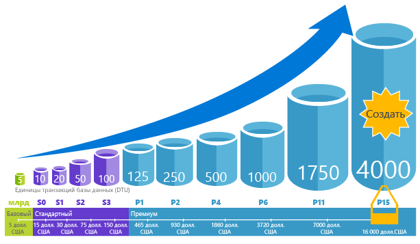
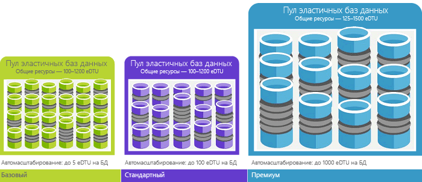

# Общие сведения об обычных единицах передачи данных (DTU) и единицах передачи данных в эластичной базе данных (eDTU)Explaining Database Transaction Units (DTUs) and elastic Database Transaction Units (eDTUs)
В этой статье объясняется, что максимальное Dtu или edtu, которое hello единицы транзакций баз данных (Dtu) и единицы транзакций эластичных баз данных (Edtu) и что произойдет, если вы столкнулись.This article explains Database Transaction Units (DTUs) and elastic Database Transaction Units (eDTUs) and what happens when you hit hello maximum DTUs or eDTUs.  

## Что такое единицы передачи данных (DTU)What are Database Transaction Units (DTUs)
На уровне производительности в пределах одной базы данных Azure SQL [уровня службы](sql-database-service-tiers.md#single-database-service-tiers-and-performance-levels), корпорация Майкрософт гарантирует определенного уровня ресурсов для этой базы данных (независимо от любой другой базы данных в облаке Azure hello) и предоставление прогнозируемый уровень производительности.For a single Azure SQL database at a specific performance level within a [service tier](sql-database-service-tiers.md#single-database-service-tiers-and-performance-levels), Microsoft guarantees a certain level of resources for that database (independent of any other database in hello Azure cloud) and providing a predictable level of performance. Этот объем ресурсов рассчитывается как количество единиц транзакций базы данных или DTU и является смешанной оценкой ЦП, памяти, ввода-вывода (ввод-вывод данных и журнала транзакций).This amount of resources is calculated as a number of Database Transaction Units or DTUs, and is a blended measure of CPU, memory, I/O (data and transaction log I/O). Коэффициент Hello среди этих ресурсов был первоначально определяется [рабочей нагрузки OLTP тестирования](sql-database-benchmark-overview.md) разработан toobe, типичные для реальных рабочих нагрузок OLTP.hello ratio amongst these resources was originally determined by an [OLTP benchmark workload](sql-database-benchmark-overview.md) designed toobe typical of real-world OLTP workloads. Когда рабочая нагрузка превышает hello объем любым из этих ресурсов, пропускная способность регулированию — в результате чего медленнее, производительность и время ожидания.When your workload exceeds hello amount of any of these resources, your throughput is throttled - resulting in slower performance and timeouts. Hello ресурсы, используемые при рабочей нагрузке не оказывают влияния на hello баз данных SQL ресурсы доступны tooother в облако Azure hello и hello ресурса при помощи других рабочих нагрузок, не оказывают влияния на базу данных SQL tooyour доступные ресурсы hello.hello resources used by your workload do not impact hello resources available tooother SQL databases in hello Azure cloud, and hello resource used by other workloads do not impact hello resources available tooyour SQL database.

Dtu наиболее полезны для понимания hello относительный объем ресурсов, между базами данных SQL Azure на разные уровни производительности и уровней обслуживания.DTUs are most useful for understanding hello relative amount of resources between Azure SQL Databases at different performance levels and service tiers. Например удвоение hello Dtu, увеличьте уровень производительности hello базы данных соответствует toodoubling hello набор баз данных toothat доступных ресурсов.For example, doubling hello DTUs by increasing hello performance level of a database equates toodoubling hello set of resource available toothat database. Например, база данных P11 уровня "Премиум" с 1750 единицами DTU обеспечивает в 350 раз больше вычислительной мощи, чем база данных уровня "Базовый" с 5 единицами DTU.For example, a Premium P11 database with 1750 DTUs provides 350x more DTU compute power than a Basic database with 5 DTUs.  

добиться более глубокого понимания hello потребления ресурсов (DTU) рабочей нагрузки, используйте toogain [анализ производительности запросов базы данных SQL Azure](sql-database-query-performance.md) для:toogain deeper insight into hello resource (DTU) consumption of your workload, use [Azure SQL Database Query Performance Insight](sql-database-query-performance.md) to:

- Определите hello первых запросах по количеству ЦП или длительность или выполнения, потенциально могут настраиваться для повышения производительности.Identify hello top queries by CPU/Duration/Execution count that can potentially be tuned for improved performance. Например, ввод-вывод служб с интенсивными вычислениями запрос может выиграть от использования hello [методы оптимизации в памяти](sql-database-in-memory.md) toomake более эффективного использования доступной памяти hello определенного уровня службы производительности и уровня.For example, an I/O intensive query might benefit from hello use of [in-memory optimization techniques](sql-database-in-memory.md) toomake better use of hello available memory at a certain service tier and performance level.
- Перейти к подробным сведениям hello запроса, просмотреть его текст и журнал использования ресурсов.Drill down into hello details of a query, view its text and history of resource utilization.
- Получать доступ к рекомендациям по настройке производительности, отображающим действия [Помощника по базам данных SQL](sql-database-advisor.md).Access performance tuning recommendations that show actions performed by [SQL Database Advisor](sql-database-advisor.md).

Вы можете [изменить уровни обслуживания](sql-database-service-tiers.md) в любое время с минимальным временем простоя tooyour приложения (обычно вычисление среднего значения в разделе четыре секунды).You can [change service tiers](sql-database-service-tiers.md) at any time with minimal downtime tooyour application (generally averaging under four seconds). Для многих организаций и приложений может toocreate баз данных и набрать производительности вверх или вниз по требованию достаточно, особенно в том случае, если операции являются относительно прогнозируемого.For many businesses and apps, being able toocreate databases and dial performance up or down on demand is enough, especially if usage patterns are relatively predictable. Но если непредсказуемым закономерностей, может сделать его жестких toomanage затраты и бизнес-модели.But if you have unpredictable usage patterns, it can make it hard toomanage costs and your business model. В этом сценарии вы используете эластичного пула с определенного числа edtu, которое, общими для нескольких баз данных в пуле hello.For this scenario, you use an elastic pool with a certain number of eDTUs that are shared among multiple database in hello pool.

## Что такое единицы передачи данных в эластичной базе данных (eDTU)What are elastic Database Transaction Units (eDTUs)
Вместо этого более выделенный набор ресурсов (Dtu) tooa базы данных SQL, которая доступна всегда независимо от ли не требуется, можно поместить баз данных в [эластичного пула](sql-database-elastic-pool.md) на сервере базы данных SQL, который использует пул ресурсов Среди этих баз данных.Rather than provide a dedicated set of resources (DTUs) tooa SQL Database that is always available regardless of whether needed not, you can place databases into an [elastic pool](sql-database-elastic-pool.md) on a SQL Database server that shares a pool of resources among those database. Hello общие ресурсы в пуле эластичных измеренное эластичной единицы транзакций баз данных или число Edtu.hello shared resources in an elastic pool measured by elastic Database Transaction Units or eDTUs. Пулов эластичных предоставляют цели производительности hello toomanage простого экономически эффективные решения для нескольких баз данных с совершенно разными и непредсказуемым статистические характеристики интенсивности использования.Elastic pools provide a simple cost effective solution toomanage hello performance goals for multiple databases that have widely varying and unpredictable usage patterns. В пуле эластичных БД может гарантировать, что один база данных не использует все ресурсы hello в hello пула, а также минимальный объем ресурсов всегда равен tooa доступные базы данных в эластичном пуле.In an elastic pool, you can guarantee that no one database uses all of hello resources in hello pool and also that a minimum amount of resources is always available tooa database in an elastic pool. Чтобы узнать больше, ознакомьтесь с [эластичными пулами](sql-database-elastic-pool.md).See  [elastic pools](sql-database-elastic-pool.md) for more information.

Пулу предоставляется заданное количество единиц eDTU по фиксированной цене.A pool is given a set number of eDTUs, for a set price. В пул эластичных hello отдельных баз данных, получают гибкость hello tooauto масштабирования в пределах границ hello настроен.Within hello elastic pool, individual databases are given hello flexibility tooauto-scale within hello configured boundaries. В условиях большой нагрузки базы данных может использовать дополнительные запросу toomeet edtu, которое пока баз данных под нагрузкой светлой потребляют меньше toohello точку, что базы данных в группе нагрузки не принимать edtu, которое не.Under heavy load, a database can consume more eDTUs toomeet demand while databases under light loads consume less, up toohello point that databases under no load consume no eDTUs. Путем подготовки ресурсов для всего пула hello, а не на одну базу данных, задачи управления упрощены и вы прогнозируемого бюджета hello в пуле.By provisioning resources for hello entire pool, rather than per database, management tasks are simplified and you have a predictable budget for hello pool.

Дополнительные edtu, которое можно добавить tooan существующий пул без простоев базы данных и без влияния на hello баз данных в пуле hello.Additional eDTUs can be added tooan existing pool with no database downtime and with no impact on hello databases in hello pool. Точно так же, если eDTU больше не нужны, их можно удалить из имеющегося пула в любой момент времени.Similarly, if extra eDTUs are no longer needed, they can be removed from an existing pool at any point in time. Можно добавить или вычесть toohello пула баз данных, или сумма hello ограничение числа Edtu на базу данных можно использовать в группе edtu, которое tooreserve интенсивной нагрузкой для других баз данных.You can add or subtract databases toohello pool, or limit hello amount of eDTUs a database can use under heavy load tooreserve eDTUs for other databases. Если базы данных предсказуемо недоиспользуют ресурсов, можно переместить за пределы пула hello и настройте его в качестве одной базы данных с прогнозируемый объем ресурсов, требуется.If a database is predictably under-utilizing resources, you can move it out of hello pool and configure it as a single database with predictable amount of resources it requires.

## Как определить hello число Dtu, необходимые для моей рабочей нагрузки?How can I determine hello number of DTUs needed by my workload?
Если вам нужна toomigrate существующей локальной или tooAzure рабочей нагрузки виртуальной машины SQL Server база данных SQL, можно использовать hello [DTU калькулятора](http://dtucalculator.azurewebsites.net/) tooapproximate hello количество необходимых Dtu.If you are looking toomigrate an existing on-premises or SQL Server virtual machine workload tooAzure SQL Database, you can use hello [DTU Calculator](http://dtucalculator.azurewebsites.net/) tooapproximate hello number of DTUs needed. Для рабочей нагрузки базы данных SQL Azure, можно использовать [анализ производительности запросов базы данных SQL](sql-database-query-performance.md) toounderstand вашей базы данных ресурсов потребления (Dtu) tooget добиться более глубокого понимания как toooptimize рабочей нагрузки.For an existing Azure SQL Database workload, you can use [SQL Database Query Performance Insight](sql-database-query-performance.md) toounderstand your database resource consumption (DTUs) tooget deeper insight into how toooptimize your workload. Можно также использовать hello [sys.dm_db_ resource_stats](https://msdn.microsoft.com/library/dn800981.aspx) динамического административного Представления tooget hello ресурсов сведения об энергопотреблении hello последний час.You can also use hello [sys.dm_db_ resource_stats](https://msdn.microsoft.com/library/dn800981.aspx) DMV tooget hello resource consumption information for hello last one hour. Кроме того, Здравствуйте, представление каталога [sys.resource_stats](http://msdn.microsoft.com/library/dn269979.aspx) может также быть запрашиваемые tooget hello и те же данные для hello последние 14 дней, хотя и ниже качество сложения каждые пять минут.Alternatively, hello catalog view [sys.resource_stats](http://msdn.microsoft.com/library/dn269979.aspx) can also be queried tooget hello same data for hello last 14 days, although at a lower fidelity of five-minute averages.

## Как понять, что мне нужен пул эластичных БД?How do I know if I could benefit from an elastic pool of resources?
Пулы подходят для большого числа баз данных с конкретными закономерностями использования.Pools are suited for a large number of databases with specific utilization patterns. Для заданной базы данных эта закономерность характеризуется низким средним использованием с относительно редкими пиками использования.For a given database, this pattern is characterized by low average utilization with relatively infrequent utilization spikes. База данных SQL автоматически вычисляет hello использование журнала ресурсов баз данных в существующий сервер базы данных SQL и рекомендует конфигурации соответствующий пул hello в hello портал Azure.SQL Database automatically evaluates hello historical resource usage of databases in an existing SQL Database server and recommends hello appropriate pool configuration in hello Azure portal. Дополнительные сведения см. в статье [Когда следует использовать пул эластичных баз данных?](sql-database-elastic-pool.md)For more information, see [when should an elastic pool be used?](sql-database-elastic-pool.md)

## Что происходит, когда количество единиц DTU становится максимальнымWhat happens when I hit my maximum DTUs
Уровни производительности являются калиброванных и управляемыми tooprovide hello требуется toorun ресурсов рабочей нагрузки базы данных копирование toohello максимального ограничения разрешена для выбранного обновления производительности или уровня.Performance levels are calibrated and governed tooprovide hello needed resources toorun your database workload up toohello max limits allowed for your selected service tier/performance level. Если рабочая нагрузка попадание hello ограничения в одном из ограничений ЦП и данных ввода-ВЫВОДА или журнала операций ввода-ВЫВОДА, продолжается tooreceive hello ресурсы в максимально допустимый уровень hello, но, скорее всего, toosee увеличение задержки для запросов.If your workload is hitting hello limits in one of CPU/Data IO/Log IO limits, you continue tooreceive hello resources at hello maximum allowed level, but you are likely toosee increased latencies for your queries. Эти ограничения не приводят к все ошибки, но вместо замедление hello рабочей нагрузки, если замедление hello становится запуска превышения времени запросов серьезные. Когда количество параллельных пользовательских сеансов или запросов (рабочих потоков) достигает максимально допустимого уровня, отображаются явные ошибки.These limits do not result in any errors, but rather a slowdown in hello workload, unless hello slowdown becomes so severe that queries start timing out. If you are hitting limits of maximum allowed concurrent user sessions/requests (worker threads), you see explicit errors. Сведения об ограничениях на использование ресурсов, отличных от ЦП, памяти, ввода-вывода данных и ввода-вывода журнала см. в статье [Ограничения ресурсов базы данных SQL Azure](sql-database-resource-limits.md).See [Azure SQL Database resource limits](sql-database-resource-limits.md) for information on limit on resources other than CPU, memory, data I/O, and transaction log I/O.

## Дальнейшие действияNext steps
* В разделе [уровень обслуживания](sql-database-service-tiers.md) сведения о Dtu hello и Edtu, для отдельных баз данных и пулов эластичных.See [Service tier](sql-database-service-tiers.md) for information on hello DTUs and eDTUs available for single databases and for elastic pools.
* Сведения об ограничениях на использование ресурсов, отличных от ЦП, памяти, ввода-вывода данных и ввода-вывода журнала см. в статье [Ограничения ресурсов базы данных SQL Azure](sql-database-resource-limits.md).See [Azure SQL Database resource limits](sql-database-resource-limits.md) for information on limit on resources other than CPU, memory, data I/O, and transaction log I/O.
* В разделе [анализ производительности запросов базы данных SQL](sql-database-query-performance.md) toounderstand потребления (Dtu).See [SQL Database Query Performance Insight](sql-database-query-performance.md) toounderstand your (DTUs) consumption.
* В разделе [Обзор производительности базы данных SQL](sql-database-benchmark-overview.md) методологии hello toounderstand за рабочая нагрузка теста производительности hello OLTP используется toodetermine hello DTU blend.See [SQL Database benchmark overview](sql-database-benchmark-overview.md) toounderstand hello methodology behind hello OLTP benchmark workload used toodetermine hello DTU blend.
